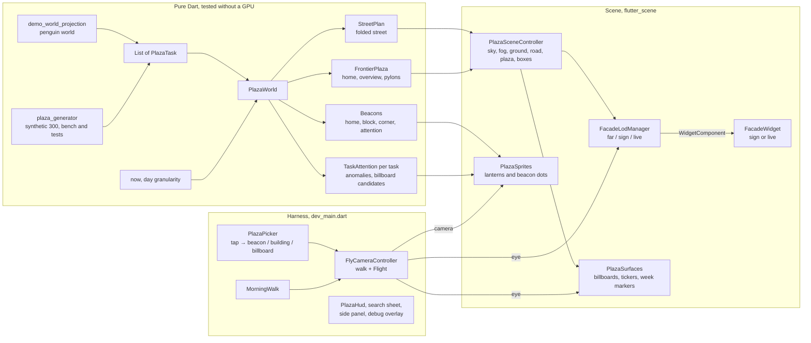
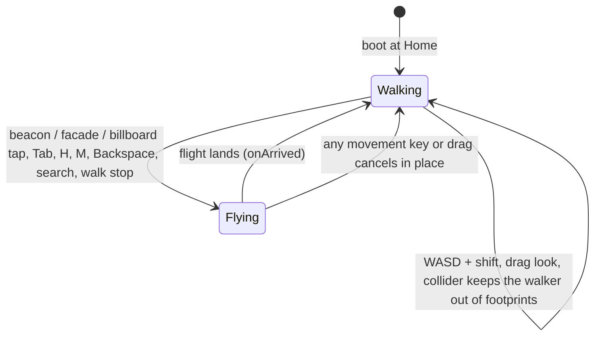

The prototype behind the plan to replace the knowledge-graph hairball with a
spatial map of a project. **It is a developer harness, not a feature**: not
routed, not registered in DI, not reading the database. What it is for, what
it looks like and what is still missing are in the
[handover](../../docs/plaza/HANDOVER.md); the design it implements is
[DESIGN.md](../../docs/plaza/DESIGN.md). This concept is the map of what
actually runs.

# Runtime flow

Every frame the harness advances the camera (walking or flying), hands the
eye to the LOD manager and the surface layer, hands the camera to the
sprite layer (screen-clamped sizes and pulses), and publishes rolling stats
to the debug overlay four times a second.

# The layout: nothing ever moves

Lotti is local-first with concurrent task creation on several devices, so
there is no global creation order to lay a street out by. `StreetLayout.plan`
is a pure function of data that merges identically everywhere:

- Tasks sort by `(createdAt, id)` and fall into **UTC week buckets** anchored
  on Monday 00:00 UTC. One bucket is one 46 m plot group; an empty week
  collapses to a 7 m gap segment drawn darker.
- Inside a bucket, tasks alternate road sides in order and split the group's
  usable length by a per-id FNV-1a hash weight (`stableHash`; `String.hashCode`
  is not stable across VM versions).
- **The fold.** After every `foldEvery` (6) buckets the road turns 90°, runs
  a `connectorLength` (50 m) connector segment that carries no buildings,
  and turns 90° again, alternating sides, so a long project is a serpentine
  of rows rather than a kilometres-long line. `foldAfter(bucketIndex)` is a
  function of the bucket index alone; a street shorter than one row never
  folds (the penguin world, six weeks, is one straight lane).
- **Height is weight.** `heightFor` is
  `minBuildingHeight + priorityWeight × 2.6 × ln(1 + heft)` capped at
  `maxBuildingHeight`, where `heft` is links + checklist items + open items
  and the priority weight runs 1.6 (urgent) to 0.8 (low). A wordy title
  changes nothing.
- Deleted tasks keep their plot as a fenced empty lot.

The property tests pin: shuffled arrival yields an identical street,
appending never moves an existing building, a late-syncing task jostles only
its own bucket, and the fold is a function of bucket index and not of tasks.
**Known edge**: a task syncing into a previously empty week turns the gap
into a plot group and shifts everything downstream; accepted for the
prototype and documented in the tests.

# The frontier plaza and its overlays

Everything beyond the street is an overlay derived from the `StreetPlan`
(and, for attention, from task data plus the day); none of it moves a
building.

- **Plaza** (`frontierPlazaFor`): a 62 × 58 m slab starting 7 m past the
  end of the newest segment. **Home** stands 56 m in, at eye height (2.2
  m), looking back down the street. **Overview** is 160 m out and 140 m up,
  pitched 0.62 rad down the street.
- **Billboard slots**: four pylons at fixed plaza-local positions, each
  facing the plaza's focal point, plus two screens mounted on the
  plaza-facing end walls of the newest building on each side. Slot order is
  attention rank; only the content changes.
- **Tickers**: one band under each mounted screen and one along the
  roofline of each hero (the two most urgent billboard tasks with cover
  art), scrolling the project headline.
- **Beacons** (`beaconsFor`): Home, one per built week (mid-block, looking
  along the road; newest first), one per fold corner, and one attention
  beacon per anomaly at that task's pose. `taskPoseFor` stands on the road
  far enough back to frame the wall and tilts to its centre.

# Attention

`attentionFor(task, now)` sums: blocked 3 · overdue 3 (+1 per week, capped
at 6) · due within three days 2 · in progress and untouched for fourteen
days 2 · urgent or high priority and open 1 · heavy and open for eight
weeks 1. Finished tasks score zero. Score ≥ 3 is an **anomaly**: attention
beacon, pulsing lantern, billboard candidate; score ≥ 2 may fill a spare
billboard slot; six slots. The lantern state is blocked > overdue > in
progress > open > off, and drives every state colour in the scene.

The clock is the day, not the instant; the harness scores the penguin
world against the demo fixture clock (`manualDemoNow`) because the world's
due dates are authored relative to it, and the synthetic set against the
day after its newest task (`plazaNowFor`).

# Camera: walking and flying

A `Flight` is planned once from two poses: duration `clamp(0.32 √distance,
0.8 s, 2.5 s)`, ease-in-out, an upward arc of `min(55, 0.2 distance)` for
flights over 120 m, and a yaw that turns into the direction of travel for
the middle 60 % of the flight before settling on the target heading (hops
under 8 m blend yaw directly). Every flight pushes the departure pose onto
the back stack. While flying, the LOD manager is suspended and the
destination building is pre-promoted to the sign tier. Tab cycles the
navigation beacons and, when cycling toward older weeks, turns the block
pose round so the walk reads as walking, not reversing.

The **morning walk** is overview (4 s) → up to three anomalies (3.2 s
each) → home; space pauses, any movement abandons it.

# Facade tiers and the budget

| Tier | Default | What it is | Capture |
|---|---|---|---|
| live | ≤ 4 within 26 m, in front of the wall | `FacadeWidget` live variant, interactive (ticks, OPEN) | every frame |
| sign | ≤ 80 within 140 m | `FacadeWidget` sign variant: category bar, big title, chip, light bar | once (manual; re-requested until the first capture lands) |
| far | everything else | dark plate + light bar geometry + lantern sprite | none |

Promotions are rate-limited to one per frame and suspended during flights;
demotions are immediate. The nearest live building is the **focused** one:
its teal ring node is shown and it is the wall whose checkboxes work.
Ticks live in a shared `ChecklistTicks` so the wall and the side panel
agree; nothing is persisted (milestone M5).

Other surfaces: billboards are captured every 100 ms within 180 m of the
plaza (so the anomaly glow breathes), tickers every 50 ms, week markers
once at build; out of range the animated surfaces are hidden, which stops
their captures.

# Harness modes

| Mode | Trigger | What it does |
|---|---|---|
| Interactive | default | Penguin world. WASD walk, drag look, tap to fly, Tab beacons, H home, M overview, Backspace back, `/` search, Space pause walk, Esc close, backtick toggles the debug overlay |
| Benchmark | `PLAZA_BENCH=1` | Synthetic 300-task district, auto-walks from home through six LOD budgets (`PlazaBench`), prints `PLAZA_BENCH result` lines |
| Tour | `PLAZA_TOUR=1` | Steps through `plazaTourStops` (penguin world, then the synthetic district for the fold), prints `PLAZA_TOUR ready <i> <name>` after 5 s; stops whose pose does not exist are skipped |

# Gotchas

- **Await `Scene.initializeStaticResources()` before building the world.**
  Sprites (`BillboardGeometry`) and `GradientSkySource` touch the base
  shader library; the harness gates everything behind that future.
- **Flutter GPU must be enabled.** `--enable-flutter-gpu` is a `flutter run`
  flag; a built binary needs `FLUTTER_ENGINE_SWITCHES=1
  FLUTTER_ENGINE_SWITCH_1=enable-flutter-gpu` in its environment.
- **`flutter_scene` 0.23 winds `WidgetComponent`'s quad clockwise** while the
  engine culls clockwise faces, so `plaza_scene.dart` supplies `ccwQuad`.
  Drop it when upstream fixes the primitive.
- **`flutter_scene` pins `code_assets ^1.2.1`.** `code_assets` and
  `native_toolchain_c` are held current under `dependency_overrides` in
  `pubspec.yaml`; re-check on every `flutter_scene` bump.
- **Scene classes need a GPU context.** `PlazaSceneController` builds
  meshes on construction; the LOD manager, surfaces and sprites create
  GPU-backed components as they run. `codecov.yml` excludes
  `lib/features/plaza/scene/**` and `dev_main.dart`; `PlazaWorld` is the
  one scene-directory class that is pure and tested.
- **Colours are sRGB in widgets, linear in materials.** `linearColor`
  converts; feeding a widget colour straight into `baseColorFactor` renders
  washed out.
- **Sprites are skipped by the raycaster** (caller-managed vertex buffers),
  so beacon taps are resolved in screen space by `PlazaPicker` before the
  ray is cast for buildings and billboards.
- **The facade palette is local on purpose.** `PlazaStyle` is scene content
  in a dev harness, mapped to Lotti's dark semantics; it moves onto
  design-system tokens only if the prototype graduates.
- **Fixtures are the demo world only.** The harness projects
  `ManualDemoWorld.penguinLogistics`; the synthetic generator exists for
  the benchmark and the tests; never point the harness at user data.
