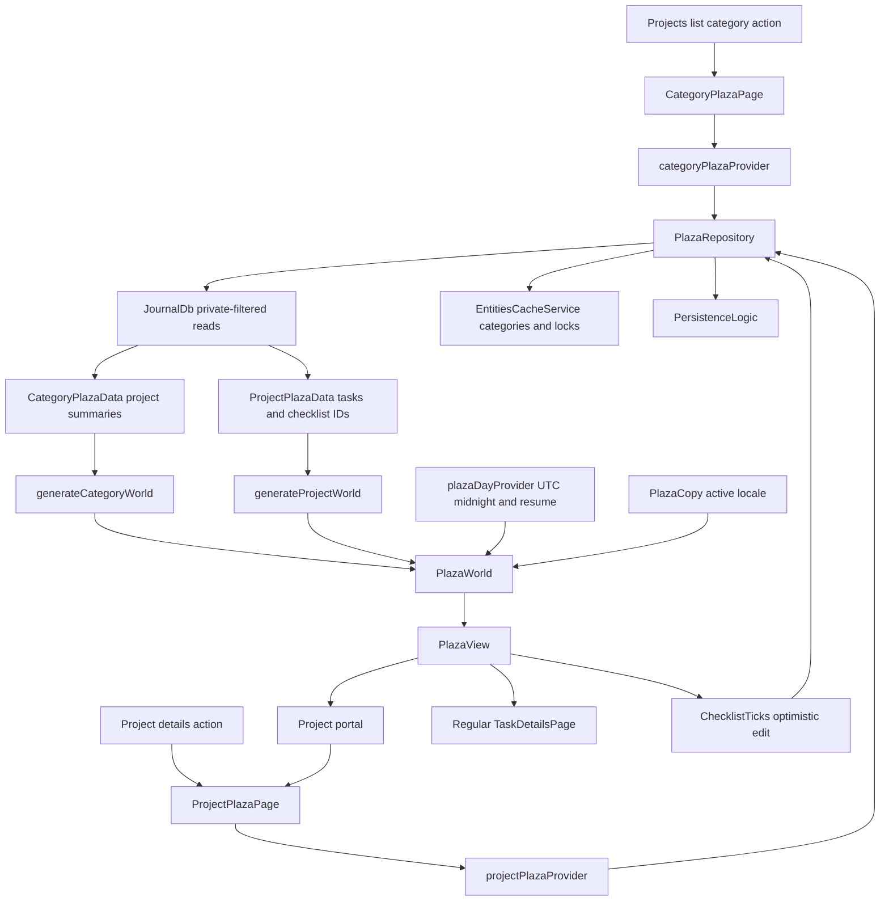
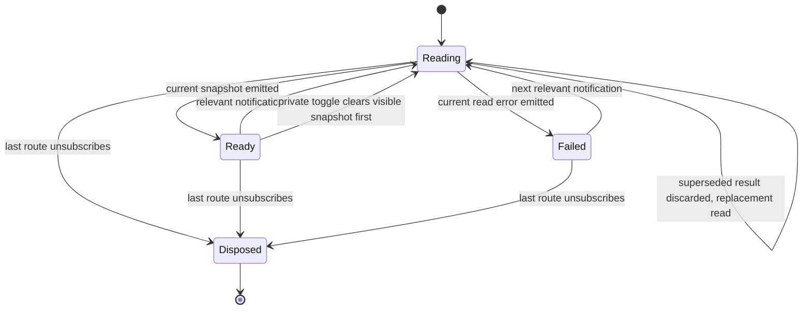
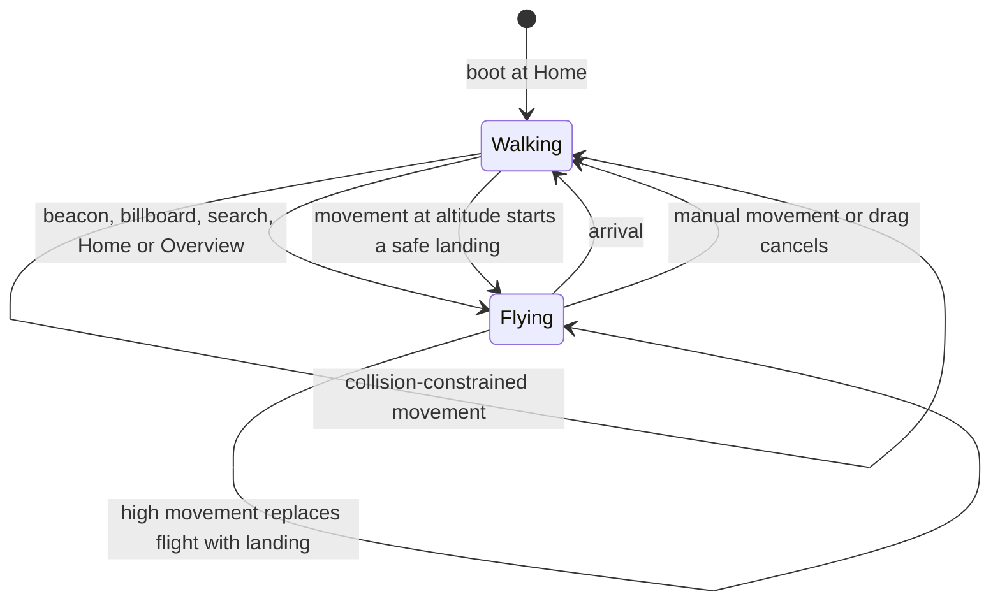
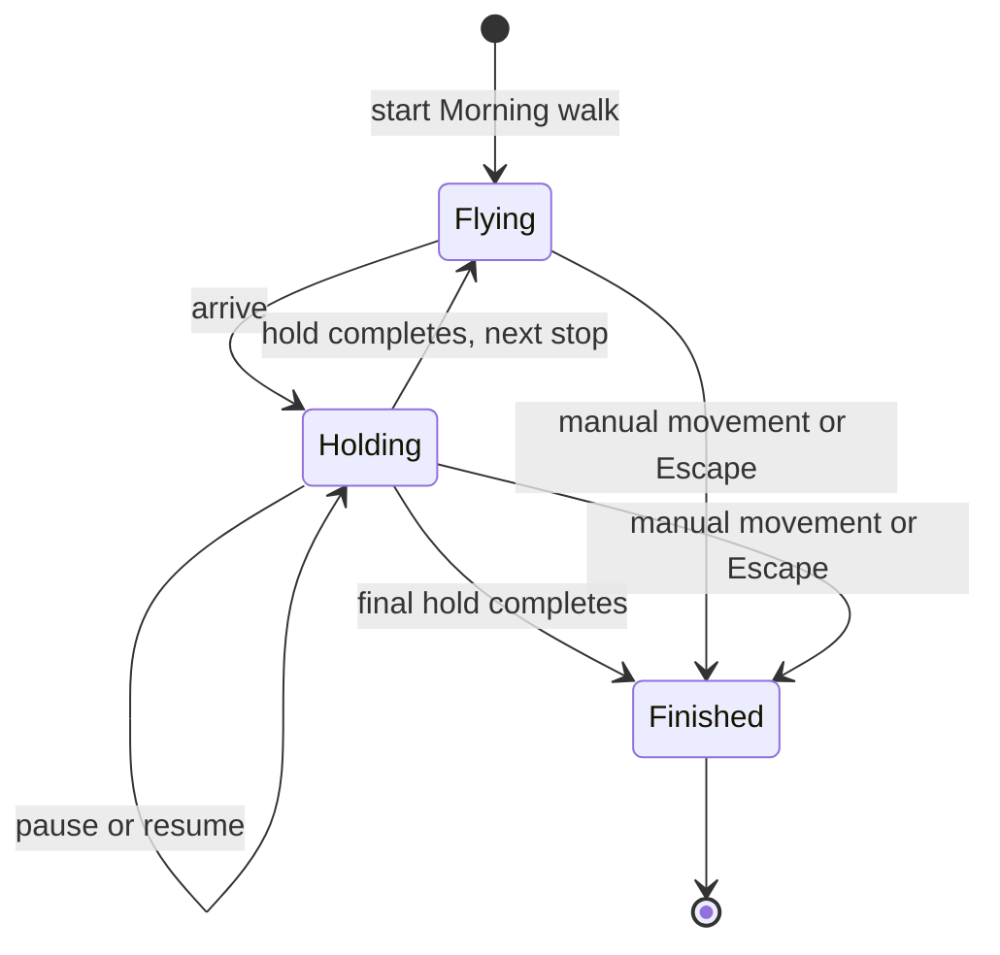
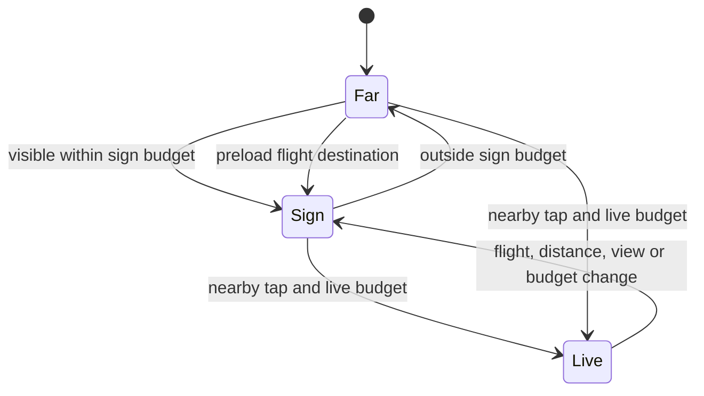
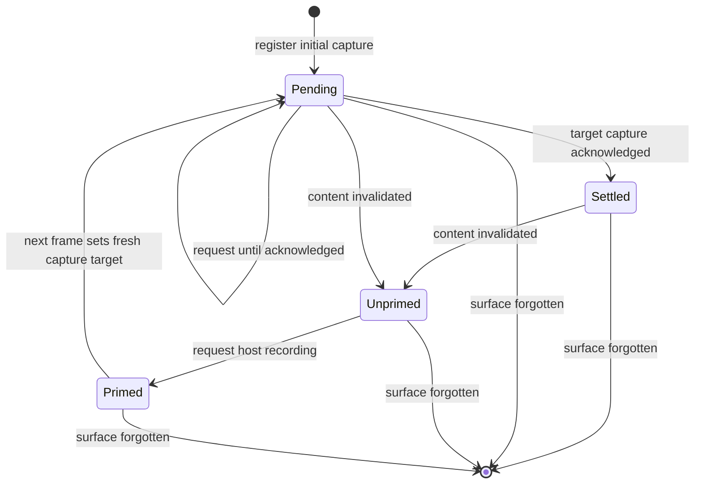
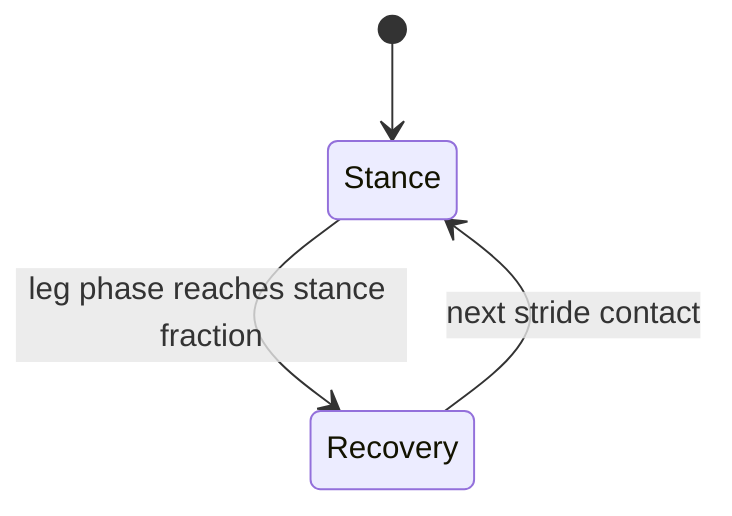
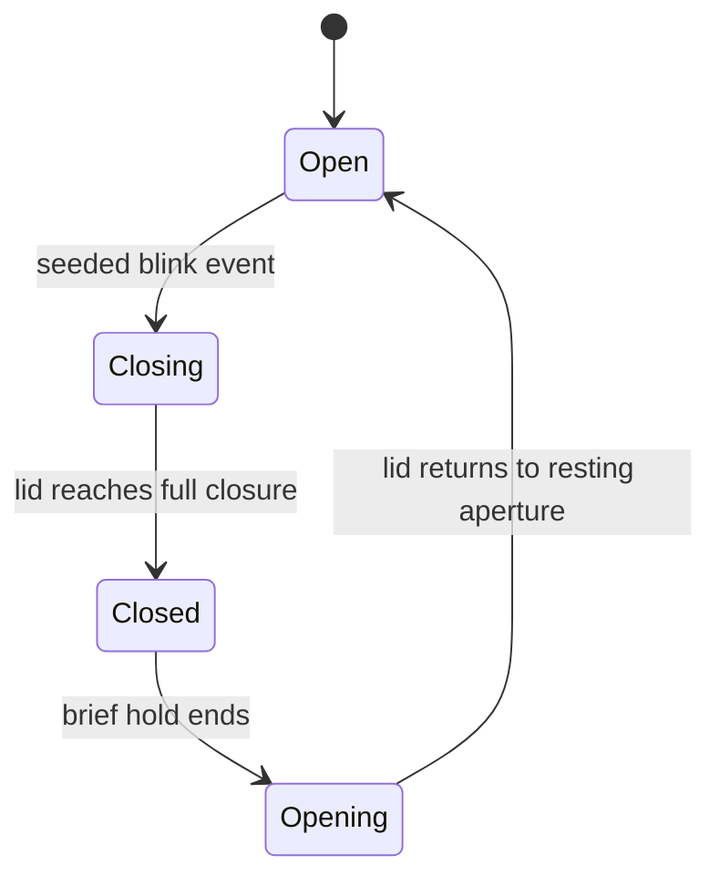
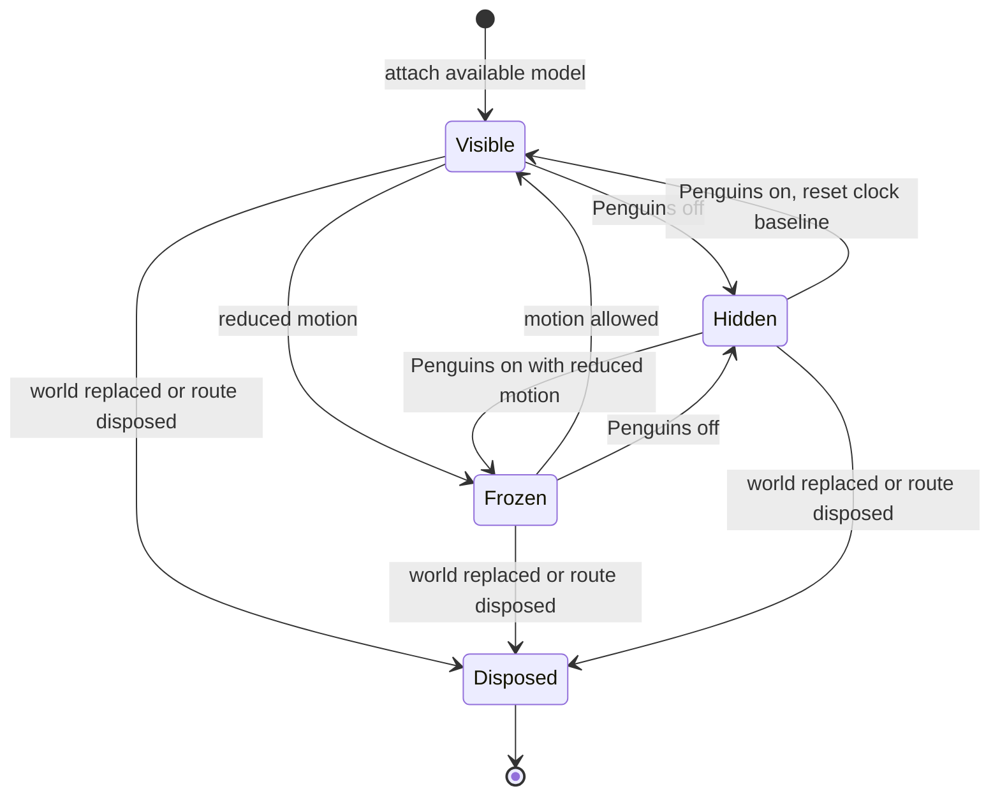

# Entry and data boundaries

Desktop project details open `ProjectPlazaPage`. The Projects overview forwards
category actions through `ProjectsOverviewContent`, `ProjectsOverviewSliverList`
and `ProjectGroupSection` to `CategoryPlazaPage`. The existing projects feature
flag controls access to those parent surfaces. Task ontology remains separate.

`loadProject` first resolves the requested project through the journal's
private-status filter and checks its category lock. It queries denormalized
project membership, excludes deleted tasks, and rejects stale links whose task
category or normalized privacy differs from the project. It never queries all
projects or pulls linked tasks from another project into the world.

Checklist and cover entities, then checklist items, are read in batches bounded
by the repository's SQLite parameter budget. Deleted/archived checklist content
is excluded by the projection. Links are bidirectional, deduplicated and kept
only when both endpoints are visible members; hidden and deleted edges are
excluded. Dependency IDs include unresolved children and filtered membership so
late sync arrivals and membership corrections can refresh the snapshot.

`projectPlazaTask` is shared with the fixture projection. It computes progress
from the complete deduplicated checklist while capping the open preview. The
preview carries durable item IDs parallel to its titles; its length is never
used as the completed count. Local covers use file URIs, including escaped
spaces. The repository does not need a GPU.

`loadCategory` queries exactly one category, including closed projects. It reads
lightweight task facts for those projects and defers checklist, link and cover
hydration until drilldown. It checks category membership again rather than
trusting a stale query result. Locked/deleted categories yield no world.
`ProjectPlazaPage.categoryId` constrains a category drilldown even if sync later
moves the project: the page removes the scene instead of following it outside
the selected scope.

# Snapshot and edit lifecycle

Both scoped stream providers share a serialized reload loop. Notifications that
intersect dependencies, project/link/category changes and private visibility
changes trigger reads. During discovery any notification invalidates the pending
read because child IDs are not known yet. A burst schedules one replacement;
superseded results never publish.

Pages retain their scene during ordinary refreshes and background errors. Null
snapshots remove inaccessible content, and a deliberate private toggle clears
old content before the replacement read, including when that read fails. Search
re-filters its current query when tasks change. Scope changes clear cached scene
data. Locale/day changes regenerate localized facts; wall textures also refresh
when the renderer's locale changes.

`plazaDayProvider` schedules the next UTC midnight and invalidates on application
resume. Its timer and lifecycle listener are disposed with the last consumer.
`PlazaView.didUpdateWidget` preserves camera pose and the camera back stack while
rebuilding scene bindings for a new world. It disarms live facades and stops the
current tour/walk state on replacement.

`ChecklistTicks` optimistically toggles by item ID, coalesces repeated clicks
while a write is pending, and rolls back false/failed writes. A refreshed preview
cannot redirect an in-flight edit to another item. Before persisting, the
repository rereads the task and item, verifies current project membership and
checklist membership, and rejects deleted, archived or locked content. It copies
fresh item data, stamps user provenance and updates metadata through
`PersistenceLogic`, preserving a concurrent title change. Failures produce a
localized toast. Category portals have no editable checklist.

# Generation and spatial memory

`ProjectWorldConfig` controls seed, minimum plot spacing, completed setback,
weeks per row and ambient creature budget. `generateProjectWorld` anchors the
timeline to the project's start date; neither generator mutates journal data.
`PlazaWorld` derives placements, attention, billboards, beacons, street furniture,
scenery, collision solids, walking routes and localized ticker text once per
snapshot. It needs Flutter text/date libraries but no GPU context.

Task placement sorts by creation date and ID, using Monday-aligned UTC week
buckets. Tasks older than the project epoch land in week zero. Empty weeks
collapse into gaps. Alternating sides split a week's usable frontage by a stable
per-ID weight. Busy weeks lengthen enough to retain readable plot widths; turns
and connectors fold the timeline into rows and leave room for completed setbacks.
Height follows priority and checklist/link weight, rather than title length.

This is deterministic, not immutable placement. Adding tasks inside a week can
move its siblings; crossing a density threshold or filling a previously empty
week can move downstream geometry. Completed tasks retain their week and move
laterally away from the road. Default low-level layout parameters preserve the
older fixture contracts; integrated generators enable density and priority
scaling. Renderer debug tuning preserves the remaining generator parameters.

Priority scales facade and attention billboard dimensions within their mounts:
urgent is full size, with successively smaller factors for high, medium and low.
Mount centers and orientation remain fixed. Completed walls are muted green;
completed roof lights stay clearly green and do not pulse. Cancellation remains
a neutral, distinct status. Overview framing grows with the full district;
the camera's far plane grows with it rather than clipping to the prototype size.

Category generation assigns one named avenue per project using explicit layout
buckets, while portal records retain actual creation dates. Since Home sits at
the street frontier, completed/archived avenues are ordered at the opposite end.
Within each completion group, creation date and ID determine order. Portals carry
real project status, total/done task counts and attention/overdue counts. They
reuse the building renderer, but project labels and actions stay distinct from
task labels. Entering pushes a project route above the category, preserving the
category camera on return.

# Architectural recipes

`ProjectWorldConfig.architecture` carries an `ArchitectureConfig` through both
project and category generation. `PlazaWorld.architectureByTaskId` computes each
recipe once from the task ID, recipe seed and plot envelope. The renderer uses
those same facade dimensions for the visible plate, focus ring, captured widget
and picking record. Priority scales the panel about its centre. Configuration
changes preserve the timeline address and the original street-facing plane.

`BuildingArchitecture` chooses a stepped tower, offset media crown or theater
setback. A recessed ground floor supports a continuous streetwall and canopy;
smaller upper volumes expose the silhouette. Every volume stays within the
plot's width, depth and height, so existing conservative collision and flight
solids remain valid. The former extra rooftop mass and decorative plant are
removed. The topmost crown carries the task's status colour, including green for
done and neutral grey for cancelled. Ordinary storeys have window grids without
repeating the ground-floor storefront band. The project jumbotron uses the
stepped family, reserving its entire sign height before beginning the crown.
Window and shopfront skins use the existing facade-plate depth bias as well as
their geometric offset. The offset alone loses depth precision on distant
towers when static batching changes draw order. The shared paving texture draws
staggered joints over transparent slab centres, avoiding checkerboard shading.

# Attention and navigation

`attentionFor` evaluates UTC calendar days. Done, cancelled and deleted items
score zero. Blocked and overdue work earn the strongest signals; overdue age,
near deadlines, stale activity, high priority and old heavy work contribute.
The highest scores populate the frontier billboards and the Morning walk.
Category portal attention additionally reflects unfinished overdue/attention
counts inside the project. Closed projects never burn for old deadlines.
`PlazaCopy` turns these facts into translated labels and localized dates; task
and project titles remain user content.

The frontier plaza, mounts, furniture and camera poses come from
`domain/plaza_layout.dart`. `StreetNetwork` joins the folded street to Home.
`WalkCollider` precomputes rotated footprints and merges nearby aligned ones so
narrow gaps cannot trap the walker. `Solid` also carries height, letting flights
clear pylons, signs, roof structures and buildings while walkers pass beneath
suspended geometry.

`Flight.route` follows street segments between low poses; `Flight.plan` handles
climbs and dives. Both use smooth speed profiles, bounded turn timing and swept
height clearance against solids. Starting flight clears walking velocity, and
hardware key state prevents a lost key-up from leaving movement latched.
Camera history returns through prior poses before the route exits.

The walk visits Overview, up to three attention stops and Home. A nearby facade
tap activates its live controls; distant taps and search fly to the facade.
Project portals open project worlds, app task details delegate to the existing
task page, and the independent fixture retains its local summary panel.

# Rendering and bounded work

`PlazaView` checks Flutter GPU before initializing shared shader resources and
handles unavailable renderers with a localized exit shell. Desktop runners enable
GPU at startup. Frame pacing stops when the route is hidden or the app is
backgrounded. Scene repainting uses `PlazaRepaint`; hosted widget subtrees don't
rebuild with every camera frame. The fixed `PlazaFrameWindow` buffer publishes
statistics periodically rather than allocating a new history each frame.

`PlazaSceneController` builds geometry through library parts and shared bindings.
`PlazaBoxes` shares unit meshes and immutable materials. Static opaque meshes are
baked by spatial cell and compatible material/UV/picking state; pick anchors and
dynamic groups keep their identity. Translucent pools and individual status
sprites keep depth ordering. Fog and ground washes recede with altitude, leaving
road markers and status lights readable in Overview. Decorative filler blocks
and the skyline ring share a separately baked `city-context` root. It hides at
the same altitude threshold that reveals map labels, removing their occlusion
of task roofs; the project landmark, actual task buildings and week addresses
remain. This is currently a discrete map transition, not an opacity fade.

Facade tiers are geometry-only far, captured sign, and activated live. The LOD
manager caps sign/live counts, uses range/view hysteresis and paces promotions.
A flight preloads its destination and disarms live controls. Live captures use a
short interval; still posters capture initially and when cover content changes.
Local cover arrival retries the image and invalidates its captured texture;
failed live image-cache entries are evicted before retry.

`SurfaceCaptures` waits for actual capture acknowledgements. Invalidating a
surface primes a fresh recording, then requests another capture on a subsequent
frame: an old recorded layer landing first must not settle the refresh. Tickers
scroll one captured period by UV offset; the jumbotron's slow shared clock only
advances when capture is requested. Window/shopfront texture families are shared,
and temporary canvas images are disposed after upload.

Roof lanterns have a minimum screen size, so completed green and blocked red
remain visible from altitude. Chase bulbs share a draw per lightbox.
`PlazaFireBuffer` ranks flame sources intermittently and animates only a fixed
nearest-source budget in one instance buffer. Conservative bounds are reserved
once, and distant sources fade out. The shared procedural texture forms flame
tongues above overdue facades and billboards; no completed/cancelled item burns.

# Ambient companions

`CharacterPopulation.forWorld` distributes solo walkers and pairs through the
street segments and frontier plaza. Each street gets a stadium circuit in its
own frame, including connectors with sufficient clear space. Routes stay within
the asphalt, excluding pavement and kerbs. End caps stay outside adjoining
streets at folded junctions so independently timed groups cannot collide there.
When nearby buildings block a wide circuit, smaller routes on either side of
the street are tried before omitting that region. The plaza uses
`CharacterLoop.forPlaza`; a missing or obstructed plaza does not remove street
walkers. Region IDs, builds, scales, phases and pace are deterministic.

All routes check their swept envelope against `PlazaWorld.solids`. Samples are
at most 0.5 m apart with another 0.25 m clearance covering the intervals. High
signs above the character envelope do not block routes. Characters are ambient
visual content, not collider solids or pick targets.

Pairs share route progress and pace but have independent stride phases and
scales. Their identical stadiums are translated across the fixed street frame,
maintaining separation and equal travel distance. They walk alongside one
another on straights and briefly stagger through turns. Narrow or obstructed
pair routes fall back to solo walkers. Groups on the same circuit share pace
and evenly spaced phases; different regions can use different paces. Each
region repeats its full solo/pair mix twice, with six groups on streets and
eight in the plaza. The generated world passes its `ambientCreatures` budget
(default 24) to `CharacterPopulation.forWorld(maxCount: ...)`. A zero budget
returns immediately. Selection retains whole groups, starts with a fitting
Home group, then visits regions round-robin; odd budgets use solo walkers.
Unbounded population generation remains available to route-clearance tests.

`PlazaCharacters` attaches the population **after** static mesh baking. Each
instance has its own skeleton; geometry and token materials are shared. All
surfaces in one instance share one skin upload. `Node.clone` does not preserve
raycast flags, so construction reapplies them to the cloned mesh nodes.

The original model is `assets/plaza/penguin.glb`, generated with the Python
standard library by `tool/plaza/build_penguin.py`. A smooth implicit mesh
forms the egg-shaped body, tapered flippers and short legs. Its 15-joint skin
has a pelvis, spine, head, two joints per flipper, three per leg and one gaze
joint per eye. Broad webbed feet have three toe lobes; the short beak is a
rounded taper with a narrow seam following its surface.
Feet below the ankle follow the ankle rigidly so shin deformation does not
bend their soles through the paving. The implicit surface is intersected with
its ground plane so smooth unions cannot inflate the soles below contact.
White belly and face patches are assigned
to surface triangles, not protruding primitives. The imported model root
is retained without the importer's coordinate-conversion wrapper because the
model is authored in Plaza's +Z-forward frame. Materials use the existing
dark background tokens for charcoal plumage, the light background token for
white patches, and the warning accent for the orange bill and feet. Colours
are converted to linear space with zero metallic response.

Standard, compact and upright builds share the same geometry. Body-only morph
targets carry position and normal deltas, fading above the pelvis and below
the head. Uniform head-joint scaling and a small rest-height offset carry the
face together without changing leg lengths. Each exported surface contains
only its used vertices; importing morphs therefore does not duplicate the
entire character vertex buffer for every face detail. Clone morph weights are
independent even though their geometry is shared.

The eyes are shallow insets. Their upper lids are cylindrical shells whose
front depth depends only on horizontal position, remaining outside the eye
envelope while the lower edge closes vertically. Open-to-closed morphing
therefore avoids cutting through the eye along an ellipsoid chord. The pupil
and catchlight of each eye share a gaze joint; the beak seam stays head-bound.
Facial morphing happens before skinning, so changing head proportions also
carries the eyelids and gaze without separate expression corrections.

`CharacterGait` derives the cycle from total distance and scales the short
stride length with character size. Low heel recovery keeps the feet below
the belly. Route distance wraps; the gait cycle never resets at the seam.
Each leg alternates between fixed world-space contact and recovery; the other
leg is half a cycle ahead. Stance occupies 60% of a cycle, so walking always
has at least one supporting foot and transfers through double support.
Recovery uses a quintic horizontal interpolation and an early heel lift,
returning the sole flat before landing with zero horizontal velocity. Ground
height belongs to the route: street asphalt and plaza paving use their actual
surface elevations for both ankle targets and contact shadows.

The body is lowest through double support and rises through passing. A lateral
pelvis shift and torso roll move weight toward the supporting foot. A short
centered tangent sample banks the torso into bends. The head counters torso
tilt, and the spread flippers balance the body; their restrained tips follow
the stroke by 80 ms. Two-bone inverse kinematics solves each leg in world space, including
sideways displacement on turns; the ankle cancels its parent rotation to
preserve contact orientation. `vector_math.Quaternion.rotated` applies the
inverse rotation: conjugating it again when converting world vectors into a
parent frame breaks foot locking. The solver retains tiny rotations rather
than rounding them to zero.

`CharacterCompanion.attentionAt` occasionally looks toward its partner.
Each seeded 9–13 second interval contains an eased glance, a short hold and an
eased return. The second partner responds 0.55 seconds later. A small nod has
zero angular velocity at its endpoints, and a continuous facing gate suppresses
conversation through U-turns. Eyes lead the head into the glance and back to
forward attention, then settle as the head takes over. Residual eye yaw is
bounded so pupils remain inside their eye openings. Social animation affects
the face and head without moving foot contacts or changing route progress.

`blinkAt` samples independent, jittered blink events from the companion ID
and event number. Each closes quickly, holds briefly, and reopens more slowly.
Partners share conversational timing but not blink schedules. Both eyes of
one penguin close together, covering pupils and catchlights.

The reusable explorer supplies its existing active clock; no extra ticker is created.
`MediaQuery.disableAnimations` freezes the entire pose and travel without a
catch-up jump when re-enabled. Characters beyond `visibleRange` stop rendering
and leave the 30 Hz animation budget. Resuming visibility samples the current
route time. Rebuilding the world or disposing the explorer detaches the old rigs.
`PlazaCharacters.enabled` hides the existing root, clears its motion budget,
and resets the clock baseline on both toggle edges. The HUD preference stays in
`PlazaView` across data refreshes; toggling it does not call `_load` or move the
camera. Reduced motion leaves visible animals frozen, independently of hiding.
Optional GLB load failure leaves the data world usable and its control disabled.
A later zero-to-positive budget change can load the model, with a mounted guard
before attaching it to the current world. `PLAZA_HIDE=characters` (or `life`)
omits the layer for scene isolation.

Tests load the shipped GLB hierarchy, inverse bind matrices and actual morph
deltas through the shared scene test helper, using empty base geometry to avoid GPU uploads. They check
cloned joint references, contact targets and ankle orientation through a full
lap at every scale and build, plus independent expressions, closed-lid reduced
motion, visibility and node disposal. Pure
gait tests check contact continuity, double support, recovery clearance and
deterministic sampling. Population tests cover every district in demo and
folded fixtures, obstacles, asphalt bounds, formation, eye/head sequencing and
independent blink timing. A separate junction regression checks independently
timed crowds for collisions. Rendered appearance still requires a
native Flutter GPU review; these tests cannot judge animation appeal.

# Validation boundaries

Repository/provider, generation, navigation, checklist edits, image arrivals,
flights and widget copy run in targeted headless tests. GPU geometry and native
texture interop still require the fixture on a supported renderer. Settled Linux
Xvfb captures now show hosted text and cover images. Earlier blank Home signs
were captured before presentation, not sufficient evidence of texture corruption.
The tour waits for acknowledged still captures and a stable settling interval,
then announces readiness only after raster timing acknowledges the frame. It
cannot advance past that stop before the acknowledgement. These Linux captures
do not establish macOS visual parity or its reported frame rate. Commands, screenshot
rules and measurement interpretation belong in the
[operator notes](../../docs/plaza/HANDOVER.md).
