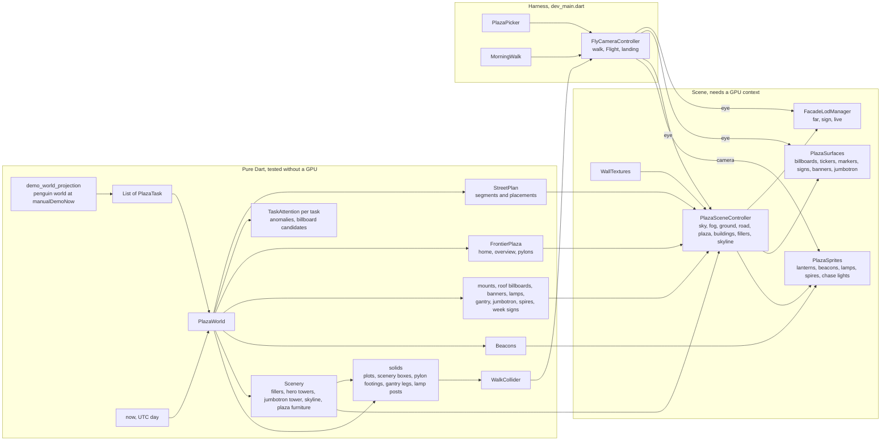
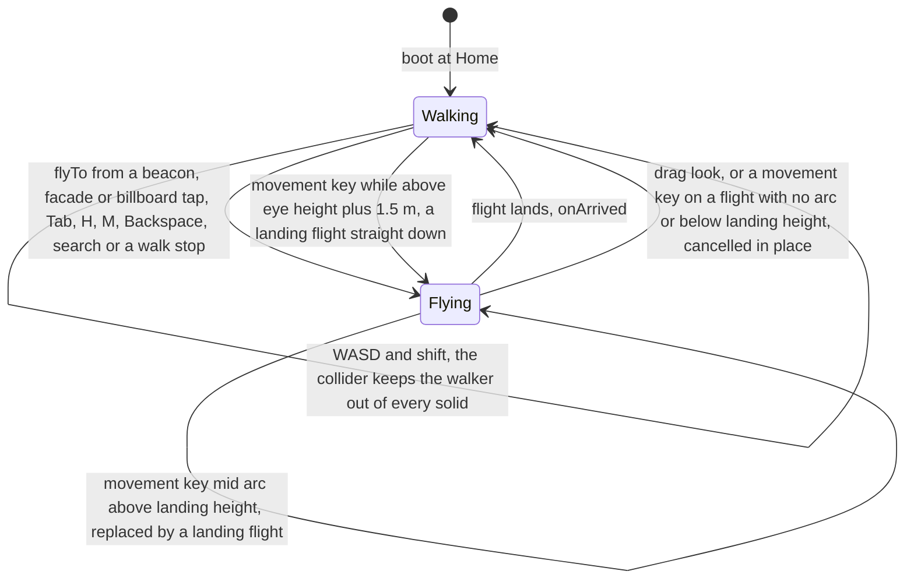
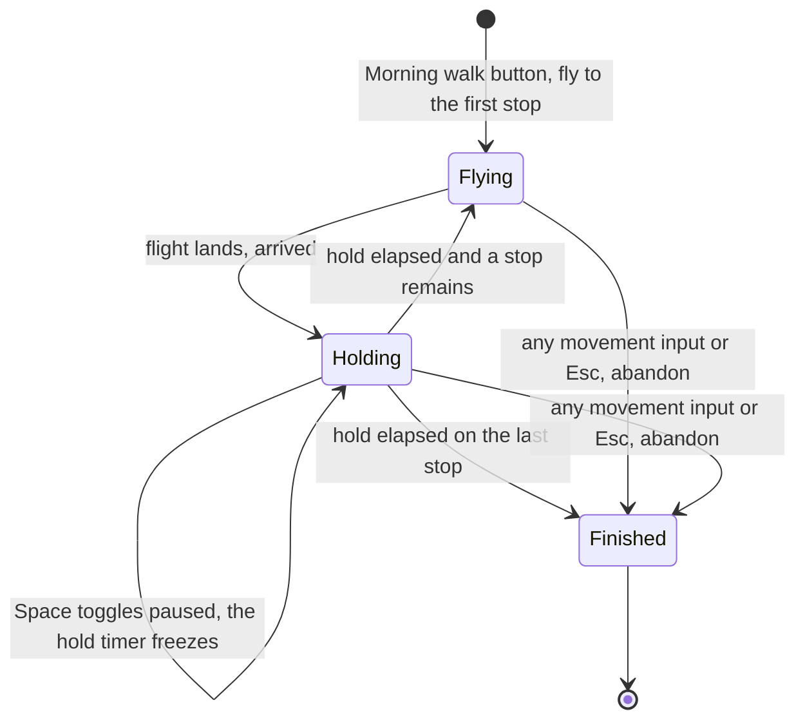
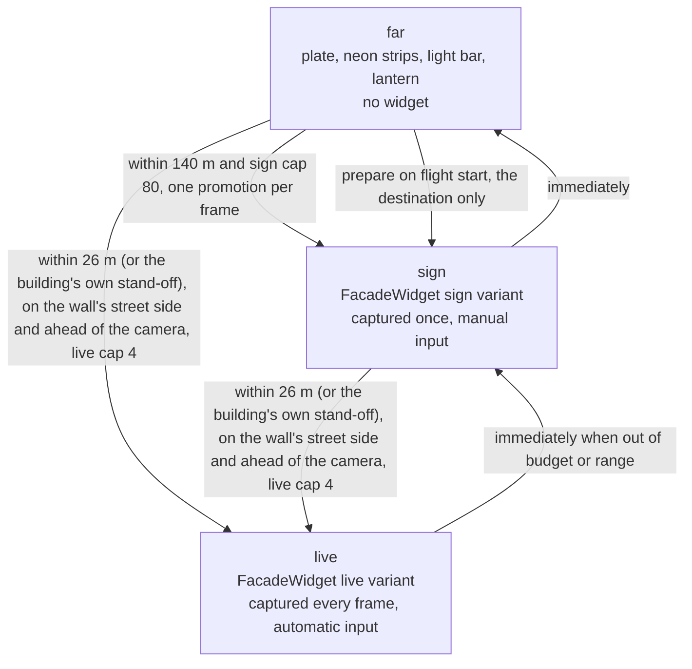

The prototype behind the plan to replace the knowledge-graph hairball with a
spatial map of a project. **It is a developer harness, not a feature**: not
routed, not registered in DI, not reading the database. How to run and drive
it, what is missing and the known limits are in the
[handover](../../docs/plaza/HANDOVER.md); the design it implements is
[DESIGN.md](../../docs/plaza/DESIGN.md). This concept is the map of what
actually runs, with the numbers as they stand in the code.

# Derivation and data flow

`PlazaWorld` is built once per scene from the task list, the clock, a project
label, the category labels and a `StreetLayout`. Its constructor derives the
plan, the plaza, the attention verdicts, the anomalies, the billboard
candidates, the beacons, every piece of street furniture, the scenery and
the collider over every solid, so the scene, the HUD, the search sheet and
the tour all read from one object.
It also composes the two ticker strings: `countsText` (project label,
attention count, in-progress count, done of live, built-week count) for the
gantry, and `tickerText` (the same with the top three anomaly headlines) for
every other band.

The harness scores the penguin world against the demo fixture clock
(`manualDemoNow`, 2026-07-17 10:30) because the world's due dates are
authored relative to it. The project label is `Project Waddle`.

Every frame the harness advances the bench or the tour, the morning walk and
the camera, hands the eye to the LOD manager, the surface layer and the scene
controller (light-pool fade), hands the camera to the sprite layer, and
publishes a rolling 120-frame window to the debug overlay four times a
second.

# The street: nothing ever moves

Lotti is local-first with concurrent task creation on several devices, so
there is no global creation order to lay a street out by. `StreetLayout.plan`
is a pure function of data that merges identically everywhere.

- Tasks sort by `(createdAt, id)` and fall into **UTC week buckets** anchored
  on Monday 00:00 UTC (`weekStart`). Week zero is the Monday of the earliest
  task unless an `epoch` is passed; a task older than an explicit epoch lands
  in bucket zero. One built bucket is a `groupLength` (40 m) segment; an
  empty week collapses to a `gapLength` (4 m) segment drawn darker.
- Inside a bucket, tasks alternate road sides in order (even index left) and
  split the usable length (`groupLength` minus 2 × `sideMargin` of 1.5 m) by
  a per-id FNV-1a weight (`widthFactorFor`, 0.5 to 1.5, from `stableHash`;
  `String.hashCode` is not stable across VM versions). A building is
  `min(0.95 × slot, clamp(0.9 × slot, 2.5, 18))` wide and `0.8 × plotDepth`
  (8 m) deep, its centre `roadWidth / 2 + plotDepth / 2` off the axis,
  facing the road.
- **The fold.** After every `foldEvery` (4) buckets the road turns 90°,
  runs a `connectorLength` (44 m) connector segment (`isGap` and
  `isConnector`, no buildings) and turns 90° again, so rows alternate
  direction as a serpentine. `foldAfter(bucketIndex)` depends on the bucket
  index alone: even rows turn one way, odd rows the other. No fold follows
  the last bucket, and a street shorter than one row never folds (the
  penguin world is one straight lane).
- **Height is weight.** `heightFor` is
  `minBuildingHeight + priorityWeight × 4.2 × ln(1 + heft)` clamped to
  `[minBuildingHeight, maxBuildingHeight]`, where `heft` is links +
  checklist items + open items and the priority weight is 1.6 (urgent),
  1.3 (high), 1.0 (medium), 0.8 (low). A wordy title changes nothing. The
  week's heaviest task (ties by id) is its **landmark** and stands
  `landmarkFactor` (1.3) taller, capped at 1.3 × `maxBuildingHeight`.
- Deleted tasks keep their plot as a fenced empty lot.

`StreetLayout` defaults are `roadWidth` 18, `maxBuildingHeight` 32,
`minBuildingHeight` 6, `plotDepth` 10, `pxPerMeter` 90. **The harness passes
three of them from `PlazaLayoutKnobs`**: `roadWidth` 25, `maxHeight` 14,
`pxPerMeter` 90, so in the running prototype the road is 25 m wide and no
building exceeds 14 m (a landmark 18.2 m). `projectSeed` (1337 in the
harness) is carried but does not enter placement.

The tests in `street_layout_test.dart` pin: shuffled arrival yields an
identical street, appending never moves an existing building, a late-syncing
task jostles only its own bucket, crowded weeks never overlap, empty weeks
are gaps, the fold is a function of bucket index and not of tasks, and height
follows links and open items but not words. **Known edge**: a task syncing
into a previously empty week turns the gap into a plot group and shifts
everything downstream; accepted for the prototype and documented in the
tests.

# The frontier plaza and the street furniture

Everything beyond the street is derived from the `StreetPlan` (and, for
attention, from task data plus the day). None of it moves a building.

**Plaza geometry** (`frontierPlazaFor`): the square starts `plazaSetback`
(7 m) past the end of the newest segment, is `plazaDepth` (66 m) deep and
`plazaWidth` (62 m) wide, in the last segment's frame. On a folded street
the last row runs back alongside an earlier one, so the whole plaza frame is
shifted sideways by `plazaFoldClearance` (`plazaWidth / 2 + 11` = 42 m)
toward the district's outside, away from the centroid of every plot
(`plazaLateralOffsetFor`). A straight street keeps the plaza on its axis.

- **Home** stands 68 m past the street end, at `eyeHeight` (2.2 m), looking
  back down the street.
- **Overview** (`overviewPoseFor`) is the map shot: the bounding box of every
  placement, every segment start, the street end and a point 85 m past the
  street end (the jumbotron) gives an `extent` (clamped 120 to 2000 m). The
  camera stands `0.58 × extent` behind the box centre along the last
  heading, `0.72 × extent` up, yawed along the heading and pitched
  `-atan2(0.72, 0.5)` (about 55° down), so the whole district and the
  jumbotron fit a 60° field of view.
- **Pylons**: four slots in plaza-local metres (lateral, along, width,
  height, bottom): `(-14, 20, 16, 9, 4.5)`, `(14, 23, 13, 7.5, 5.5)`,
  `(-19, 38, 11, 6.2, 3.5)`, `(19, 41, 9.5, 5.4, 5.5)`. Every panel faces
  the point `(0, 52)` so all four read from home. Slot order is attention
  rank; only the content changes.
- **Mounts** (`plazaMounts`, `mountedSlotsFor`): the newest building on each
  side carries a screen (ranks 4 and 5, `min(9.6, 1.2 × depth)` wide, 7 m
  tall, bottom 2.6 m) on its plaza-facing end wall and a ticker band under it
  (`1.1 × depth` wide, 1.3 m tall, bottom 1.2 m, 3.5 or 2.8 m/s).
- `PlazaWorld.billboardSlots` is the four pylons then the mounted screens,
  six in all (`billboardSlots`); slot i shows billboard candidate i, and a
  slot with no candidate stays empty.

**Roof billboards** (`roofBillboardsFor`): one panel above each anomalous
building (most urgent first, at most 12), `0.95 × width` wide, `clamp(2.6 +
0.45 × score, 3, 6)` tall, bottom at the roof plus 0.5 m, facing the street,
with a glow cycle of `clamp(3.6 - 0.4 × score, 1.2, 3)` seconds.

**Banners** (`bannersFor`): buildings at least 12 m tall carry a vertical
neon banner (`min(1.8, 0.3 × depth)` wide, `0.7 × height` tall from
`0.15 × height`) on the end wall facing along their row.

**Lamp posts** (`lampPostsFor`): `roadWidth / 2 - kerbFixtureInset` (1.6 m)
off the axis, `blockHeadAlong` (1.5 m) into every built block on the left
kerb only (the right kerb is where roof billboards and pylons show from the
block pose, and a post across a headline is worse than a dark kerb) plus
the middle of every gap between neighbours that is at least 2.5 m wide, on
both kerbs.

**Week signs** (`weekSignsFor`): a 5 × 1.4 m sign hung at 3.2 m from the
left-hand block-head lamp post (same inset and along as the post, no post
of its own), facing whoever walks in; the right kerb is left clear because
that is where the plaza's pylons show past a block's mouth. The scene also lays a **block marker**
(20 × 6.5 m) on the road 9 m into each built block, oriented to the last
row's heading rather than the row's own so it reads the right way up from
the overview.

**Gantry** (`gantryTickerFor`): a ticker spanning the street mouth 3 m past
the street end, `roadWidth + 4` wide, 1.8 m tall at 10.5 m, 4.5 m/s, facing
home; it shows `countsText`.

**Jumbotron** (`jumbotronSlotFor`): a 30 × 16 m screen with its bottom at
`jumbotronBottom` (18 m, above the near pylons' tops) on a tower beside the
plaza's mouth: `jumbotronAlong` (6 m) past the street end and
`jumbotronLateralClearance` (6 m) outside the plaza's edge on the district's
outside (the side the plaza shifted toward; the left on a straight street),
turned to face home, so the masthead sits over the billboards in the first
frame and marks the way out. `JumbotronWidget` cycles the project card and
the top three headlines every 5 s over the billboard tasks' cover art, and
holds the project card while `PlazaSurfaces.pinJumbotron` is true (the
tour's jumbotron stop pins it).

**Spires** (`spiresFor`): the two tallest buildings carry a mast with a
blinking warning light, as does the jumbotron tower, which is itself a
building: windowed on every face over a trading shopfront parade, a teal
crown and teal corner strips, and a pool at its foot.

**Roofline tickers** (`rooflineTickerFor`): the two tallest buildings that
carry no roof billboard (`PlazaWorld.heroes`) get a band along their
roofline (1.9 m tall, 4.2 or 3.4 m/s) showing `tickerText`.

**Facing pose** (`PlazaSurfaces.facingPose`): before a billboard at
`max(14 m, 1.25 × width)` unless a distance is given, pitched at the
panel's centre but never more than 12°, so the posts and the paving stay
in frame and verticals stay near vertical. The task pose caps its pitch at
`maxTaskPitch` (14°) for the same reason: a landmark loses its roof
signage before it loses its street.

**Task pose** (`taskPoseFor`): on the road in front of a facade at eye
height, `max(16, 1.2 × width, 0.9 × (height + roofSignageHeight + 3))`
metres back (`roofSignageHeight` 6.5), capped at `maxTaskStandOff` (24 m,
inside the live range and the street: farther out the camera lands among
the next row's buildings, which then take the live slots), yawed at the
wall and pitched at the midpoint of wall plus signage. Used by attention
beacons, facade taps, search results, billboard taps and the morning walk.

The tests in `plaza_layout_test.dart` pin that appending to the newest week
does not move the plaza, that a straight street keeps it on the axis, that
the pylons face the focal point, and the positions of mounts, banners,
lamps, gantry, jumbotron and spires.

# Attention and lanterns

`attentionFor(task, now)` works on the UTC calendar day (`_day`), so every
device flags the same tasks on the same date. Done, cancelled and deleted
tasks score zero. Otherwise it sums:

| Signal | Points |
|---|---|
| blocked | 3 |
| overdue | `clamp(3 + weeks overdue, 3, 6)` |
| due within `dueSoonWindow` (3 days) | 2 |
| in progress and untouched for `staleAfter` (14 days) | 2 |
| priority urgent or high (`priority <= 1`) and state open | 1 |
| `heft >= 6` and created at least `oldAfter` (56 days) ago | 1 |

The `reason` is the first that applies of blocked, overdue since a date,
quiet for N days, due on a date, each in the same problem-then-action
grammar (`blocked — needs a decision`, `overdue since Jul 14 — finish or
move it`, `quiet for 14 days — pick it back up`, `due today — finish it`
with `tomorrow` or `in N days` as the case may be); it is the headline on
billboards, tickers and the jumbotron, and the live facade repeats it
under its checklist. Score at or above `anomalyThreshold` (3) makes an
**anomaly**: attention beacon, pulsing lantern, roof billboard, billboard
candidate. Score at or above `billboardThreshold` (2) may fill a spare
plaza slot; `billboardCandidates` sorts by score then id and takes six.

The **lantern state** is the first that applies of off (finished), blocked,
overdue, inProgress, open. It drives every state colour in the scene
(`PlazaStyle.lantern`): the roof lantern, the billboard frame and rim, the
light pool in front of the facade, the wall window texture, the beacon
colour of an attention beacon and the chip on facades and panels.

# Beacons

`beaconsFor` emits, in this order: **Home** (the plaza's home pose), then
walking the segments newest first, a **Corner** beacon at the start of each
connector looking along it and a **Block** beacon for each built week, then
one **Attention** beacon per anomaly. A block beacon stands `blockBeaconInset`
(20 m) *before* the block start, looking down it with a 0.05 rad upward
pitch, so the first pair of facades fits the frame. An attention beacon's
pose is `taskPoseFor` its building. Markers hang 1.6 m above the road
(1.8 m for attention). `BeaconKind.overview` exists in the enum but no
overview beacon is created; the overview is reached by key, button or the
morning walk. Attention and home beacons are visible within 450 m, block
and corner within 320 m.

# Camera: walking, flying, landing

`FlyCameraController` walks at `walkSpeed` 3.4 m/s (shift × 2.5) with a
0.12 s velocity blend, at a 60° vertical field of view and a 1400 m far
plane. Drag look is 0.0032 rad per pixel of yaw and 0.0028 of pitch, pitch
clamped to ±1.25 rad. Walking always happens at `eyeHeight`; a pose set from
above (overview, tour) keeps its height until the next step, and that step
first plans a **landing flight** to eye height rather than dropping in one
frame. Pressed keys are reconciled with `HardwareKeyboard` every frame so a
key-up lost to a focus change cannot latch the camera walking.

A `Flight` is planned once from two poses:

- duration `clamp(0.32 × sqrt(distance), 0.8 s, 2.5 s)` divided by
  `timeScale`;
- **smootherstep** easing (`6t^5 - 15t^4 + 10t^3`) along the straight line;
- an **arc** for trips over `arcThreshold` (60 m): peak lift
  `min(45, 0.22 × distance) × horizontalFraction`, applied as a sine over
  the eased time, with the pitch dipping `-atan2(lift, 40) × 0.9` so the
  camera looks down at what it crosses; a climb gets no arc;
- **look-along**: when the ground distance is at least
  `lookAlongThreshold` (8 m) and the trip is at least 55 % horizontal, yaw
  turns into the travel heading during the first 35 % of the flight, holds
  it to 75 %, then settles onto the target yaw. Shorter or mostly vertical
  trips blend yaw directly, the short way round.

Every flight pushes the departure pose onto a back stack in the harness;
Backspace flies the reverse without pushing. While flying, the LOD manager
is `suspended` and the destination building of a facade flight is
pre-promoted to the sign tier (`prepare`). `Tab` cycles the navigation
beacons (everything but attention); when cycling toward older weeks a block
or corner pose is turned round so the walk reads as walking, not reversing.

# The morning walk

`morningWalkStops` is the overview (4 s hold), up to three anomalies at
their task poses (3.2 s each) and home (1 ms). `MorningWalk.tick` returns
the next stop when a hold is over; the harness flies there and calls
`arrived` when the flight lands. The HUD chip reports the stop index and
whether Space will pause or resume.

# The walk collider

`WalkCollider` keeps the walker out of every `Footprint` (a rectangle on
the ground: centre, rotation about +Y, width along local X, depth along
local Z) with a 0.6 m margin: a point-versus-rotated-rectangle push through
the nearest face. It is built from `PlazaWorld.solids`, which is
**everything the scene stands on the ground**: the plots
(`PlotPlacement.footprint`), every scenery box (`Scenery.boxes`: fillers,
hero towers, the jumbotron tower, the skyline ring, the plaza furniture),
the footings of the
built pylons (`pylonFootprintsFor`), the gantry legs
(`gantryLegFootprintsFor`) and the lamp posts (`lampPostFootprintsFor`).
Two neighbours in a crowded week can stand closer than twice the margin,
and resolving them one after the other never settles, so **aligned
footprints are merged** first (`_mergeAligned`): same facing, same row
line, same depth, and clearances that overlap become one footprint,
repeatedly, so the alley between them is solid. `footprints` exposes the
merged set for the tests.

# The scenery

`domain/scenery.dart` places every seeded solid, in pure Dart, and the
scene only builds what it is handed: a position the scene invented on its
own would be a box the collider cannot know, and a wall you walk through.
Every box is a `SceneryBox` (id, centre, yaw, width along local X, depth
along local Z, height); sizes come from `stableUnit(id, salt)`, never from
task data.

- **Fillers** (`fillerBlocksFor`): behind the plots of every built row,
  both sides, from 2 m along the row: frontage 7 to 16 m, reach 8 to 16 m,
  height 12 to 34 m with a seeded quarter at 40 to 60 m (the fabric is
  the tall layer behind the shops, with mid-rise landmarks so the roofline
  behind a row is jagged), alleys of 2 to 6 m, the near face `roadWidth /
  2 + plotDepth + 4` from the axis plus up to 4 m; nothing inside the plaza
  plus 12 m. A filler's yaw is the road heading, so its `depth` is the
  frontage.
- **Hero towers** (`heroTowersFor`): one per row that folds, 90 m past the
  row end on its axis, facing back down it, 26 to 34 m wide, 0.8 × as
  deep, 70 to 86 m tall.
- **Jumbotron tower** (`jumbotronTowerFor`): 3.5 m behind the screen's
  plane, 2 m wider than the screen each side, 6 m deep, 14 m above the
  screen's top.
- **Skyline** (`skylineFor`): 48 towers on a ring 50 m beyond the farthest
  plot from `planCenterOf` (or the plaza plus 60 m), spread up to 90 m
  further out, 16 to 42 m wide, 0.8 × as deep, 24 to 78 m tall, each
  turned to face the centre.
- **Plaza furniture** (`plazaFurnitureFor`): benches (0.6 × 2 × 0.9 m) and
  planters (1.4 m square, 0.8 m) alternating every 12 m down both long
  sides, 4 m in from the edge, a bench and a planter `nearHomeAhead` (6 m)
  ahead of home at `nearHomeLateral` (±7 m) as the first frame's
  foreground, and one kiosk (3 × 2.4 × 3.2 m) at plaza-local (−21, 20)
  facing the axis: out of the home pose's frame and off every line from
  home to a pylon. All solid.
- **Furniture footprints**: the pylon posts stand `pylonPostSetback` (0.6 m)
  behind the panel at `pylonPostSpread` (0.4) of its width either side on
  1.6 m footings; the gantry legs are 0.5 m square at the ends of its span;
  a lamp post is 0.16 m square. The scene builds the posts from the same
  constants.

# Facade tiers and the budget

`FacadeLodConfig` defaults: `liveCap` 4, `signCap` 80, `liveDistance` 26 m,
`signDistance` 140 m, `promotionsPerFrame` 1. Each frame the buildings are
ranked by ground distance to the eye with a sticky factor (a surface already
above far ranks as if 15 % closer), and the budget is handed out in that
order. Live needs the eye on the street side of the wall (`facesEye`).
Promotions are rate-limited to one per frame and suspended while
`suspended` is set (flights); demotions are immediate. `forceAllLive` (the
overlay's stress switch) makes every facade live and ignores the per-frame
budget. The nearest live building is the **focused** one: its teal ring
node is shown, and it is the wall whose checkboxes and details button
work. Ticks live in a shared `ChecklistTicks` so the wall and the side
panel agree; nothing is persisted.

A sign surface captures once (`WidgetUpdatePolicy.manual`); the manager keeps
requesting the capture until the first texture lands, because the host
attaches a frame after the component does. Widget subtrees are sized at the
facade's world size × `pxPerMeter` (the plate is `0.92 × width` by
`0.9 × height`).

# Widget surfaces and their capture intervals

Every widget surface is a `WidgetComponent` on a `ccwQuad` with an
`OpaqueSurface` material: widget content here is fully opaque, and an
opaque surface depth-tests like geometry, whereas the default alpha-blended
surface sorted unreliably (a banner sixty metres away drew over a pylon
fourteen metres away).

| Surface | Widget | Capture |
|---|---|---|
| live facade (at most 4) | `FacadeWidget` live | every frame |
| sign facade (at most 80) | `FacadeWidget` sign | once |
| pylon, mounted and roof billboards | `BillboardWidget` | every 100 ms, hidden beyond the plaza range |
| mounted, gantry and roofline tickers | `TickerWidget` | every 50 ms, hidden beyond the plaza range |
| jumbotron | `JumbotronWidget` at 0.5 × px/m | every 1 s |
| skyline screens | `BillboardWidget` at 0.35 × px/m | every 3 s |
| ticker housing | a dark track and a teal rim with end caps behind every band (geometry, not a widget) | — |
| block markers, week signs | `BlockMarkerWidget` | once |
| banners | `BannerWidget` | once |
| filler signs | `BannerWidget` at 0.6 × px/m | once |

The **plaza range** is `max(180 m, distance from the plaza centre to the
overview pose + 60 m)`, so the map shot still sees the pylons lit. A hidden
surface is not captured, which is what stops the plaza's animation costing
anything from the far end of the street. `PlazaSurfaces.update` re-requests
the one-off captures until their textures land. `PlazaSurfaces.facingPose`
gives the pose in front of a billboard slot (14 m by default), used by the
tour. Billboard and
ticker animation is driven by `AnimationController`s inside the widgets, so
the capture interval alone decides how often they re-render.

The **sign** facade variant is the category bar, a state marquee band with
its glyph, the title (up to three lines, shrunk until its longest word fits
the wall) and the cover art. The **live** variant adds the due and links
line, as many open checklist items as the wall has room for, the state
chip, a details button (opens the side panel) and the done count.

# Sprites

`PlazaSprites` owns the camera-facing dots, all with `raycastable = false`:

- **Lanterns**, one per building at roof + 0.7 m, coloured by lantern state,
  sized to `clamp(9 × 60 / d, 5, 22)` logical pixels, scaled by 2.2 when
  lit and 1.2 when dark, pulsing in alpha on a 3 s cycle when anomalous.
- **Beacons**, 8 px shrinking to half at their visible range, alpha 0.9 to
  0.3 with distance; attention beacons add an expanding ring on a 2.2 s
  cycle. Colours: home white, attention its task's lantern colour, the rest
  teal.
- **Lamp bulbs and halos**; the halo fades out between 30 m and 8 m so it
  never sits on a facade being read.
- **Spire lights** blink on for 0.55 s of a 1.6 s cycle.
- **Chase lights**, 20 warm-white bulbs around every billboard and jumbotron
  frame, a bright head with a three-bulb fading tail over a dim rest,
  running round at the panel's pulse period (clamped 1.2 to 4 s).

The glow (soft halo) and bulb (hard disc) textures are painted with the
Flutter canvas and uploaded once by `loadGlow`; sprites are square dots
until it lands.

# Scene composition

`PlazaSceneController` builds the `Scene` on construction:

- **Post-processing**: real HDR **bloom** (`scene.postProcess.bloom`,
  threshold `bloomThreshold` 1.0, intensity `bloomIntensity` 0.3, scatter
  0.6) and a soft **vignette** (0.32 at radius 0.82). Widget whites sit at
  1.0 and stay sharp; only what `emissiveColor` pushes past white blooms:
  neon strips, the skyline rooflines (`neonBoost` 1.6) and the chase heads
  (1.6). The glow quads stay as the
  near-field halo the bloom's blur cannot give a thin strip.
- **Shaded boxes**: every massing box (buildings, upper storeys, fillers,
  hero and skyline towers, the jumbotron tower, the kiosk, the planters)
  is a `shadedCuboid`: per-face vertex tints (top 1.0, front and back
  0.86, sides 0.7, bottom 0.5) multiplied into the unlit base colour, so a
  box keeps its silhouette from every camera height.
- **Sky**: a `GradientSkySource` (near-black zenith, desaturated indigo
  horizon, no sun): the night is cool so amber signage sits warm against
  it, and the magenta lives in the hero towers' domes alone. **Fog**:
  exponential, start 8 m, height 0 with falloff 0.028, in an indigo close
  to the horizon, so the street dissolves into the sky. It is
  **camera-driven**: `updateForCamera` lerps the density from
  `fogDensityLow` (0.0055) to `fogDensityHigh` (0.002) and the max opacity
  from 0.92 to 0.6 as the eye climbs through the pool-fade range, so the
  map shot sees a lit district instead of a wash.
- **Ground**: a 6000 × 6000 m slab at the plan centre. Per segment a road
  slab (`roadWidth` wide, darker for gaps), 3 m pavements with a kerb on
  both sides, a dashed centre line every 6 m on built segments, and an
  asphalt grain overlay (a 2 m tile of dim grit). Every plot stands on a
  pavement apron 1.5 m wider than its box on each side. The plaza is a slab in the ground colour with the
  grain, a paving-joint overlay (`WallTextures.paving`, a 4 m tile of four
  slabs), a raised kerb round its edge open at the street mouth (0.16 m,
  steppable, not a solid), a teal home ring with a soft warm pool under it,
  and the benches, planters and kiosk from `Scenery.furniture` (the kiosk
  has a lit sign, a warm hatch and its own pool).
- **Light pools**: one `ccwQuad` with a radial falloff texture (a hot
  core and a short skirt, dark again inside the radius) per lit facade
  (radius 0.55 × facade width), lamp post (3 m), pylon
  (`0.45 × max(width, 8)`), gantry (0.3 × width) and jumbotron (0.3 × width,
  alpha 0.12), so the walker stands on dark paving; and a wide faint
  **wash** in the frame colour before every large emitter (pylon 1.5 ×
  width at 0.07, jumbotron 1.2 × width at 0.05, hero screen 1.2 × screen
  width at 0.06) so the emitters connect to the ground. A blocked or
  overdue building spills its lantern colour in four pools round its
  walls. **Washes** (`_addWash`, the pool texture over a rectangle): a
  reflection streak on the paving before every pylon and the jumbotron, a
  streak in the state colour before an alarmed facade, a warm strip under
  every trading facade and along every filler's street side. The plaza
  paving overlay fades with altitude like the pools. `updateForCamera` fades
  every pool and glow quad with the eye's altitude from `poolFadeStart`
  (12 m) to `poolFadeTop` (70 m) down to `poolFloor` (0.4), so the overview
  is carried by lanterns, not discs.
- **Buildings**: a category-tinted box whose depth varies by hash
  (`0.78 to 1.1 × plot depth`, anchored to the street side), side and back
  walls built by `_windowedWall`: a **shopfront band** at the foot
  (`min(4 m, 0.45 × height)`) under tiled **window textures** by lantern
  state (`WallTextures`: a 12 × 12 m tile of 4 floors × 10 bays, panes
  0.46 × 0.5 of a 3 m cell so a window is visibly smaller than a shop
  door; lit ratio inProgress 0.62, blocked and overdue 0.5, open 0.36,
  off 0.2; a lit pane tops out at 0.8 alpha so screens and signs stay the
  brightest thing on a wall; three **tile families** by `stableUnit(id,
  'kit')`: mixed flats, a residential stack with one dark floor and one
  lit edge to edge, a cool office grid with few blinds). The upper wall is
  stacked in **whole storeys** from the band up (`vRepeat = floors / 4`, `vOffset` so a
  floor slab lands on the fascia) and the remainder is a dark **cornice**
  band at the top, so no cut row ever sits on the shops;
  per-wall tile offset), a plinth,
  a stepped-back upper storey at 14 m and above, a roof slab and trim, the
  facade plate (the only pickable part of a building), a progress **light
  bar** along the base (done fills it, a checklist fills its fraction, in
  progress without a checklist shows 0.35), **neon edge strips** with glow
  quads (emissive 0.22 off, 0.7 open, 1.0 otherwise) in the category's
  neon, except that on an alarm (blocked or overdue) the two verticals and
  their glow burn in the lantern colour and the roofline keeps the
  category at half power, a seeded **roof kit** (parapet, one or two plant boxes, a
  water tank on 40 % of buildings wider than 5 m, a mast on a third), the
  hidden focus ring, the facade anchor and the lantern anchor. The neon
  strips and their glow sit in one group that the LOD manager hides while
  the focus ring shows, so a faced facade has one frame. The light bar
  sits on the plinth on a full-width track a shade above the panel, so the
  lit part reads as progress along something.
- **Shopfronts** (`WallTextures.shopfront(state, variant)`): the band is
  one 33 × 4 m strip, a parade of six trades of different widths (café,
  record shop, bar, noodle bar, arcade, florist) plus one 3 m **vacant
  unit** (papered, TO LET, whatever the neighbours do), in a warm register
  (amber, coral, salmon, orange, gold) with the arcade's teal as the one
  cool accent; each shop has its own door side, window contents and, on
  three of them, an awning. There are **two parade orders**
  (`paradeVariants`), a wall picks one by `stableUnit(id, 'parade')` and
  starts at its own offset, so neighbours never show the same run. The
  strip is painted once **per state and order**, so the ground floor says
  what the task is doing, in words as well as dressing: **in progress**
  trades (lit signs, lit glass, people inside, lit transoms); **overdue**
  trades late, the interior flooded in the lantern amber and every sign
  reading OPEN LATE; **open** is not open yet (papered glass, OPENING
  SOON on a builder's board and on the door notice, a work light some
  nights); **blocked** is shuttered behind alarm tape in the lantern red,
  BLOCKED glowing in every dark sign box, NEEDS A DECISION on the
  shutter, a red lamp with a halo over each door; **off** is shuttered
  for the night, CLOSED in every sign box, CLOSED FOR THE NIGHT on the
  shutter, a security light over each door. Fillers, the hero towers and
  the jumbotron tower always trade: they are the city, not tasks.
- **Billboards**: pylons get two braced posts on footings and a catwalk; roof
  panels get two struts; every panel gets a dark lightbox, a glow quad and
  chase-light points around the frame; the panel's own border (the widget's,
  which breathes) is the one frame. A roof panel sits over its own facade,
  which carries the title, so it leads with the reason in the state colour
  and drops its 'fly there' (`BillboardWidget.reasonFirst`). The backing
  box is the pickable node.
- **Fillers** (`Scenery.fillers`): dark blocks behind the plots, every
  face a trading shopfront parade under open-state windows; about a third
  carry a neon category sign named after one of the week's own tasks.
- **Skyline** (`Scenery.skyline`): the ring of towers, a shade lighter
  than the fillers so they read against the sky, with two windowed faces
  toward the district and a lit roofline (warm and teal by turns) along
  the district-facing edge; every fourth carries a screen that shows the
  anomalies in rotation.
- **Hero towers** (`Scenery.heroTowers`, built with the skyline): one past
  the far end of every row that folds, windowed on all four faces, with a teal
  crown, a 14 m spire with a blinking light, a screen across the upper
  face toward the street showing the top anomaly and a warm glow dome
  behind it, so every row has a lit horizon to walk toward. The last row's
  far end has the jumbotron
  instead.

`PLAZA_HIDE` (see the README) drops the gantry, jumbotron, fillers,
skyline, pylons or windowed walls at build time to isolate what a screenshot
shows.

# Picking and input

Pointer handling lives in the harness: a press that moves more than 6 px is a
drag (look), a release within 0.25 s that never dragged is a tap.
`PlazaPicker.pick` resolves beacon dots first in screen space (within
`beaconHitPx` 14), because sprites are skipped by the raycaster, then casts a
ray up to `maxTapDistance` (160 m) and walks up from the hit node to a
billboard backing or a facade plate. A beacon tap flies to its pose, a
building tap to its task pose unless it is already the focused building, a
billboard tap to the task it shows. Only the primary button is used; input
is ignored entirely in tour and bench modes.

# Tour, bench and capture

- **Tour** (`PLAZA_TOUR=1`): the harness sets the camera to each pose in
  `plazaTourStops` in turn (no flight), prints `PLAZA_TOUR stop <i> start
  <name>`, then `PLAZA_TOUR ready <i> <name>` after 5 s, and moves on after
  9 s; a stop whose pose is null for this world is skipped, and
  `PLAZA_TOUR_ONLY` restricts the run to named stops. `PLAZA_TOUR done` ends
  it. Poses are functions of the world, so the tour tracks layout changes.
- **Bench** (`PLAZA_BENCH=1`): `PlazaBench` auto-walks the penguin street
  from home through six LOD phases of 14 s (4 s warm-up each) and prints one
  `PLAZA_BENCH result` line per phase with fps average, mean, p99 and worst
  frame time and the tier counts. Bench mode wins over tour mode when both
  are set.
- **Capture** (`tool/plaza/capture_tour.py`): launches the built Linux
  bundle with `GDK_BACKEND=x11`, `PLAZA_TOUR=1`, the Flutter GPU engine
  switch and `LOTTI_WINDOW_SIZE` (1600x1000 unless set), passes every other
  `PLAZA_*` variable through (dropping `PLAZA_BENCH`), grabs the window with
  `XGetImage` on each `ready` line, optionally clicks a `PLAZA_CLICK` point
  and grabs a second `-ticked` frame, and stops on `done` or a 240 s
  watchdog.

# Gotchas

- **Await `Scene.initializeStaticResources()` before building anything.**
  Sprites and `GradientSkySource` touch the base shader library; `_boot`
  awaits it, then `WallTextures.load()`, then builds the world.
- **Flutter GPU must be enabled.** `--enable-flutter-gpu` is a `flutter run`
  flag; a built binary needs `FLUTTER_ENGINE_SWITCHES=1
  FLUTTER_ENGINE_SWITCH_1=enable-flutter-gpu` in its environment (the
  capture script sets them).
- **Widget quads must wind counter-clockwise.** `flutter_scene` 0.23 flipped
  the engine's front face to CCW but `WidgetComponent`'s built-in quad still
  winds CW, so it is back-face culled and never shows; every surface here
  uses `ccwQuad` (or `tiledQuad`). Drop them when upstream fixes the
  primitive.
- **`flutter_scene` pins `code_assets ^1.2.1`.** `code_assets` and
  `native_toolchain_c` are held current under `dependency_overrides` in
  `pubspec.yaml`; re-check on every `flutter_scene` bump.
- **Scene classes need a GPU context.** `PlazaSceneController` builds meshes
  on construction; the LOD manager, surfaces and sprites create GPU-backed
  components as they run. `codecov.yml` excludes `lib/features/plaza/scene/**`
  and `dev_main.dart`; `PlazaWorld` is the one scene-directory class that is
  pure and tested, and `WallTextures.paintShopfront` is checked pixel by
  pixel because the dressing is a contract.
- **Xvfb cannot render the widget textures.** Under a virtual framebuffer the
  facades and billboards come out as flat slabs (observed in capture runs, not
  something the code checks); capture on a real X11 or XWayland display.
- **Colours are sRGB in widgets, linear in materials.** `linearColor`
  converts; feeding a widget colour straight into `baseColorFactor` renders
  washed out.
- **Alpha-blended widget surfaces sort unreliably.** Use `OpaqueSurface` for
  every widget quad; keep `AlphaMode.blend` for pools and glow quads only.
- **Sprites are skipped by the raycaster**, so the picker resolves beacons in
  screen space first.
- **The harness clock is the demo fixture clock**, not `DateTime.now()`; the
  attention verdicts only make sense against `manualDemoNow`.
- **The facade palette is local on purpose.** `PlazaStyle` is scene content
  in a dev harness, mapped to Lotti's dark semantics; it moves onto
  design-system tokens only if the prototype graduates.
- **Every solid is placed in `domain/scenery.dart`, never in the scene.**
  `PlazaWorld.solids` is what the collider knows; the scene builds its
  fillers, towers, footings, legs and posts from the same records and
  constants, so a box the scene invents on its own is a box you can walk
  through. `PLAZA_HIDE` hides geometry, not its footprint.
- **Fixtures are the demo world only.** The harness projects
  `ManualDemoWorld.penguinLogistics`; the synthetic generator lives in
  `test/features/plaza/plaza_fixtures.dart` for the tests and nowhere else.
  Never point the harness at user data.
