# Entry and data boundaries

Desktop project details open `ProjectPlazaPage`. The Projects overview forwards
category actions through `ProjectsOverviewContent`, `ProjectsOverviewSliverList`
and `ProjectGroupSection` to `CategoryPlazaPage`. The existing projects feature
flag controls access to those parent surfaces. Task ontology remains separate.

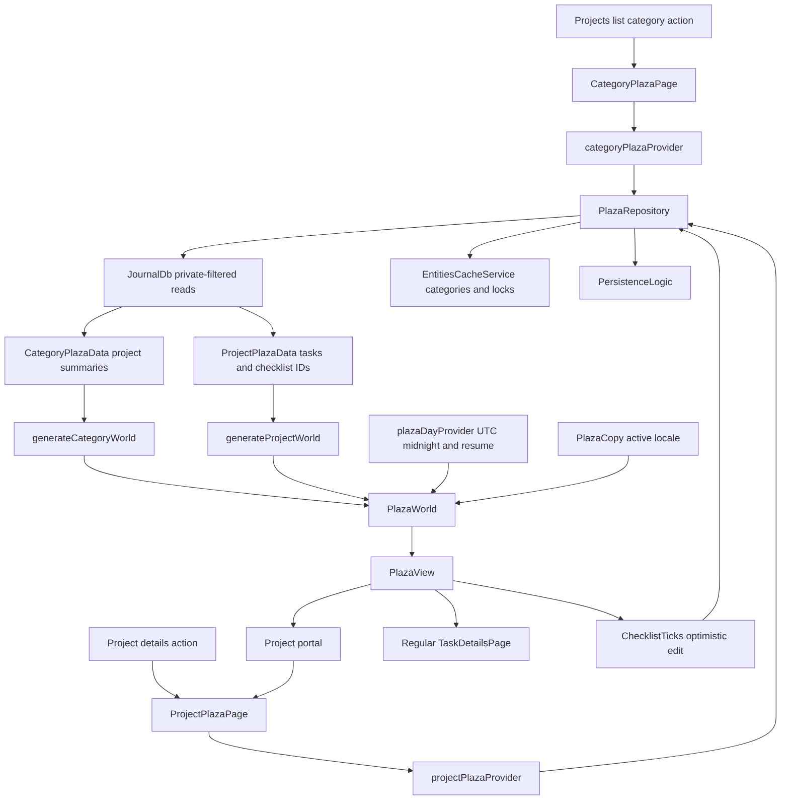

`loadProject` first resolves the requested project through the journal's
private-status filter and checks its category lock. It queries denormalized
project membership, excludes deleted tasks, and rejects stale links whose task
category or normalized privacy differs from the project. It never queries all
projects or pulls linked tasks from another project into the world.

Checklist and cover entities, then checklist items, are read in batches bounded
by the repository's SQLite parameter budget. Deleted/archived checklist content
is excluded by the projection. Task relationships retain their stored type and
direction in `PlazaConnection`. `projectPlazaConnections` excludes non-task link families,
self-links, hidden/deleted edges and edges outside the visible task set. Basic
associations normalize endpoint order; typed relationships retain opposing
directions as distinct edges. Duplicate rows resolve deterministically by ID.
The per-task linked-ID summary is bidirectional and deduplicated. The category
lock is rechecked after asynchronous child/link reads, before publication.
Dependency IDs include unresolved children and filtered membership so late sync
arrivals and membership corrections can refresh the snapshot.

`projectPlazaTask` is shared with the fixture projection. It computes progress
from the complete deduplicated checklist while capping the open preview. The
preview carries durable item IDs parallel to its titles; its length is never
used as the completed count. Local covers use file URIs, including escaped
spaces. The repository does not need a GPU.

`loadCategory` queries exactly one category, including closed projects. It reads
lightweight task facts for those projects and defers checklist, link and cover
hydration until drilldown. It checks category membership again rather than
trusting a stale query result. Locked/deleted categories yield no world.
`ProjectPlazaPage.categoryId` constrains a category drilldown even if sync later
moves the project: the page removes the scene instead of following it outside
the selected scope.

# Snapshot and edit lifecycle

Both scoped stream providers share a serialized reload loop. Notifications that
intersect dependencies, project/link/category changes and private visibility
changes trigger reads. During discovery any notification invalidates the pending
read because child IDs are not known yet. A burst schedules one replacement;
superseded results never publish.

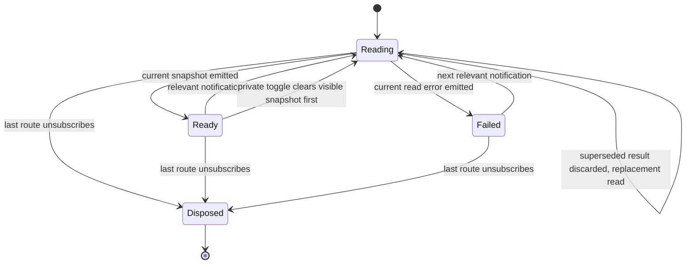

Pages retain their scene during ordinary refreshes and background errors. Null
snapshots remove inaccessible content, and a deliberate private toggle clears
old content before the replacement read, including when that read fails. Search
re-filters its current query when tasks change. Scope changes clear cached scene
data. Locale/day changes regenerate localized facts; wall textures also refresh
when the renderer's locale changes.

`plazaDayProvider` schedules the next UTC midnight and invalidates on application
resume. Its timer and lifecycle listener are disposed with the last consumer.
`PlazaView.didUpdateWidget` preserves camera pose and the camera back stack while
rebuilding scene bindings for a new world. It disarms live facades and stops the
current tour/walk state on replacement.

`ChecklistTicks` optimistically toggles by item ID, coalesces repeated clicks
while a write is pending, and rolls back false/failed writes. A refreshed preview
cannot redirect an in-flight edit to another item. Before persisting, the
repository rereads the task and item, verifies current project membership and
checklist membership, and rejects deleted, archived or locked content. It copies
fresh item data, stamps user provenance and updates metadata through
`PersistenceLogic`, preserving a concurrent title change. Failures produce a
localized toast. Category portals have no editable checklist.

# Generation and spatial memory

`ProjectWorldConfig` controls seed, minimum plot spacing, completed setback,
weeks per row and ambient creature budget. `generateProjectWorld` anchors the
timeline to the project's start date; neither generator mutates journal data.
`PlazaWorld` derives placements, attention, billboards, beacons, street furniture,
scenery, collision solids, walking routes and localized ticker text once per
snapshot. It needs Flutter text/date libraries but no GPU context.

Task placement sorts by creation date and ID, using Monday-aligned UTC week
buckets. Tasks older than the project epoch land in week zero. Empty weeks
collapse into gaps. Alternating sides split a week's usable frontage by a stable
per-ID weight. Busy weeks lengthen enough to retain readable plot widths; turns
and connectors fold the timeline into rows and leave room for completed setbacks.
Height follows priority and checklist/link weight, rather than title length.

This is deterministic, not immutable placement. Adding tasks inside a week can
move its siblings; crossing a density threshold or filling a previously empty
week can move downstream geometry. Completed tasks retain their week and move
laterally away from the road. Default low-level layout parameters preserve the
older fixture contracts; integrated generators enable density and priority
scaling. Renderer debug tuning preserves the remaining generator parameters.

Background fabric uses compact two-to-3.5-metre alleys and the same shallow
setback range behind the plot line. Mid-rise blocks stand 24–48 metres high,
with seeded 56–80-metre accents. Fillers shrink or disappear when they overlap
another street corridor or a task footprint, including recessed completed plots.
Avenue landmarks stand 60 metres past a folded row. The skyline retains its
48-tower budget: broader, taller towers occupy a 36-metre radial band beyond the
existing district clearance. These dimensions belong to the pure scenery
recipe; rendering, walking and flight clearance all consume the resulting solids.

Priority scales facade and attention billboard dimensions within their mounts:
urgent is full size, with successively smaller factors for high, medium and low.
Mount centers and orientation remain fixed. Completed walls are muted green;
completed roof lights stay clearly green and do not pulse. Cancellation remains
a neutral, distinct status. Overview framing grows with the full district;
the camera's far plane grows with it rather than clipping to the prototype size.

Category generation assigns one named avenue per project using explicit layout
buckets, while portal records retain actual creation dates. Since Home sits at
the street frontier, completed/archived avenues are ordered at the opposite end.
Within each completion group, creation date and ID determine order. Portals carry
real project status, total/done task counts and attention/overdue counts. They
reuse the building renderer, but project labels and actions stay distinct from
task labels. Entering pushes a project route above the category, preserving the
category camera on return.

# Architectural recipes

`ProjectWorldConfig.architecture` carries an `ArchitectureConfig` through both
project and category generation. `PlazaWorld.architectureByTaskId` computes each
recipe once from the task ID, recipe seed and plot envelope. The renderer uses
those same facade dimensions for the visible plate, focus ring, captured widget
and picking record. Priority scales the panel about its centre. Configuration
changes preserve the timeline address and the original street-facing plane.

`BuildingArchitecture` chooses a stepped tower, offset media crown or theater
setback. The stepped family has three narrowing crown tiers. A recessed ground
floor supports a continuous streetwall and canopy. Every volume stays within
the plot's width, depth and height, so conservative collision and flight solids
remain valid. The topmost crown carries the task's status colour, including
green for done and neutral grey for cancelled.

`PlazaArchitecture` builds inset wall cores under each volume's outer envelope.
Shared window skins dress those cores; corner piers, side-wall bays and cornices
occupy the remaining relief. Media towers use horizontal spandrels, while stone
families use vertical piers and crown flutes. Repeated detail caps at six bays or
courses per volume. All structure stays behind the street-facing sign plane;
priority scaling, picking anchors and the task's approach remain unchanged.
Materials come from the existing scene palette and design-system surface tokens.

Task buildings, the project jumbotron, avenue landmarks, filler blocks and the
skyline use this builder. Jumbotron and avenue recipes reserve the full screen
height before starting the crown. Supporting filler blocks and skyline towers
omit column grids and extra coping. Each lit setback uses one thin cap
instead of four rim pieces; the street-facing luminous course stays at the
same height. Skyline towers also omit shopfronts. The renderer creates this geometry once
and includes it in static batching; it adds no per-frame geometry work or new
texture families.

Ordinary storeys have window grids without repeating the ground-floor storefront
band. The office tile has full-height glass and metal mullions; residential
families retain inset panes. All share the original atlas dimensions. Window
and shopfront skins use the existing facade-plate depth bias as well as their
geometric offset. The offset alone loses depth precision on distant towers when
static batching changes draw order. The shared paving texture draws staggered
joints over transparent slab centres, avoiding checkerboard shading.

# Suspended task connections

`ProjectWorldConfig.cables` supplies `CableConfig`: cable radius, sag ratio and
cap, mount height, clearance, support/sample limits and animated-light budget.
`PlazaWorld.cablePaths` is lazy CPU geometry over the scoped connection list;
category avenues currently have no aggregate relationship cables.

`CablePath` mounts each endpoint on its building's actual top volume. Each route
follows a straight horizontal line with parabolic sag between roof supports.
Intersected rotated solid envelopes are checked analytically, including narrow
obstacles between samples. Raised mounts keep spans above those envelopes. The
default shares one mast per task roof, carrying all of its attachment heights; up to two intermediate
roof supports keep long crossings from requiring excessively tall endpoint
masts. Their explicit budget can be changed by the generator configuration.
Intermediate supports are structural, never additional relationship nodes.
Cable geometry is excluded from camera collision.
Arc-length samples let lights move at a constant physical speed.

`PlazaCables` attaches after the ordinary static bake. Tubes, support poles and
fixed lamps receive their own opaque mesh bake. Each tube uses local vertices
with a node at its arc midpoint, so the bake partitions by actual world cells
instead of merging every tube at the origin. Selected-task overlays remain
outside the bake; `PlazaCableSelection` creates them on first focus and caches
them for reuse. Selecting a task or looking at its facade emphasizes its incident
cables in the existing focus teal; white packets leave red/green available for task status. The
Connections checkbox hides the entire group and survives snapshot replacement.
Explicit task selection remains emphasized during flight and Overview; Home or
Escape clears it, and a snapshot removing that task also drops the selection.
A basic association sends opposing packets; a typed edge sends both packets in
its stored source-to-destination direction. No task status is inferred from edges.

`PlazaCableBuffer` bounds animation to two packets on each of the nearest 96
cables, prioritizing incident edges of the focused task. Ranking is throttled to
four times a second, or refreshed when focus changes. One instanced draw reuses
its scalar buffer and conservative bounds; reduced motion freezes the packet
clock. Static lamps and tubes remain visible beyond the moving-light distance.
The frame pacer includes visible cable motion, and hiding connections removes
that reason to keep drawing. No meshes are regenerated per frame.

# Attention and navigation

`attentionFor` evaluates UTC calendar days. Done, cancelled and deleted items
score zero. Blocked and overdue work earn the strongest signals; overdue age,
near deadlines, stale activity, high priority and old heavy work contribute.
The highest scores populate the frontier billboards and the Morning walk.
Category portal attention additionally reflects unfinished overdue/attention
counts inside the project. Closed projects never burn for old deadlines.
`PlazaCopy` turns these facts into translated labels and localized dates; task
and project titles remain user content.

The frontier plaza, mounts, furniture and camera poses come from
`domain/plaza_layout.dart`. `StreetNetwork` joins the folded street to Home.
`WalkCollider` precomputes rotated footprints and merges nearby aligned ones so
narrow gaps cannot trap the walker. `Solid` also carries height, letting flights
clear pylons, signs, roof structures and buildings while walkers pass beneath
suspended geometry.

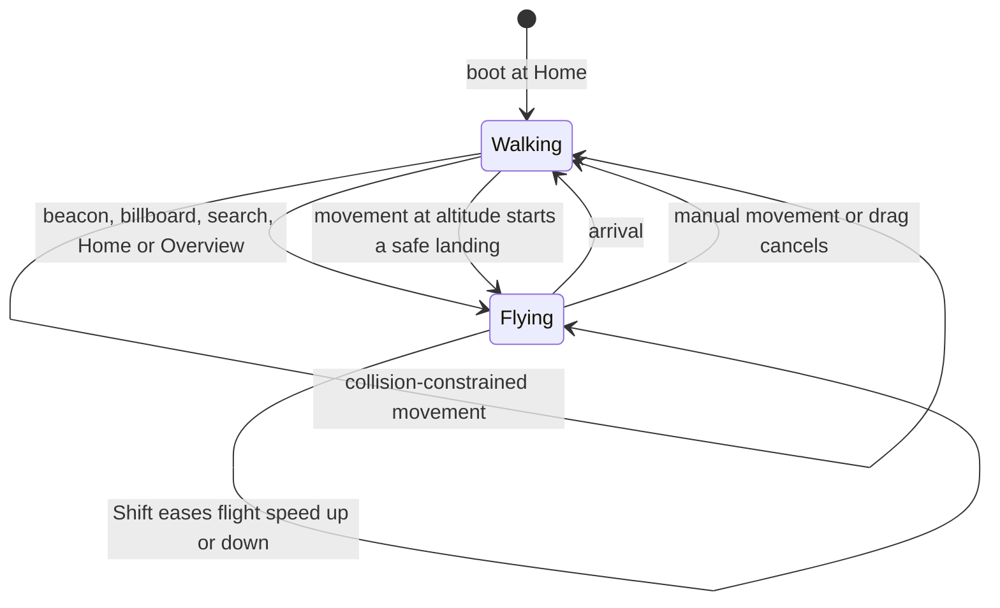

`Flight.route` follows street segments between low poses; `Flight.plan` handles
climbs and dives. Guide legs retain swept height clearance against solids.
Routed flights join those legs with cubic Bezier bends matching both position
and tangent. A bend trims at most eight metres and at most 35% of either adjacent
leg; its recursively subdivided control hull must clear every solid with
`solidClearance` horizontally and `Flight.clearance` vertically, matching the
guide legs' headroom. A blocked bend shrinks until clear; if no usable radius
remains, the original guide junction is retained. Arrival look-ahead stops before the rounded
pull-off, preserving the road heading until the final orientation blend.

Flight timing includes the actual three-dimensional distance between samples,
so a steep obstacle lift cannot ignore its vertical travel. A bounded slowdown
envelope spreads braking before tight sections. Monotone cubic interpolation of
progress, yaw and pitch shares derivatives between knots, preserving continuous
velocity. Analytic angular derivative bounds stretch the clock when necessary.
The bend checks, timing arrays and smoothing weights are computed once per
flight; frames interpolate the cached plan. Starting flight clears walking
velocity, and hardware key state prevents lost key-up from latching movement.
Walking is 3.4 m/s; holding either Shift key multiplies travel speed by eight,
with the existing acceleration/deceleration easing. The localized control legend
advertises the modifier. Holding Shift during a flight accelerates its clock
up to the same eightfold rate without cancelling the flight or Morning walk.
The multiplier approaches its target with a 0.3-second exponential time constant;
integrating it exactly makes coarse and fine frame steps agree. Releasing Shift
smoothly returns to normal speed, even when its key-up goes to an overlay. A new
flight or landing resets the multiplier. Arrival still clamps to the exact
endpoint and calls its callback once.

`WalkCollider.move` sweeps the whole movement segment
against inflated rotated footprints, chooses the earliest contact, then slides
along the wall. It processes at most four contacts and drops residual motion at
a complex corner, so speed and slow frames cannot tunnel through thin solids.
Wall frames are cached and the sweep creates no per-wall objects.
Point recovery first pushes through nearest faces. If overlapping buildings
push the camera back into an earlier wall, it unions the wall intersections
along both world axes and takes the shorter exit from the containing component.
This exceptional recovery costs O(n log n); clear movement stays O(n) without
allocating interval lists. Separate buildings do not extend the escape distance.
Camera history returns through prior poses before the route exits.

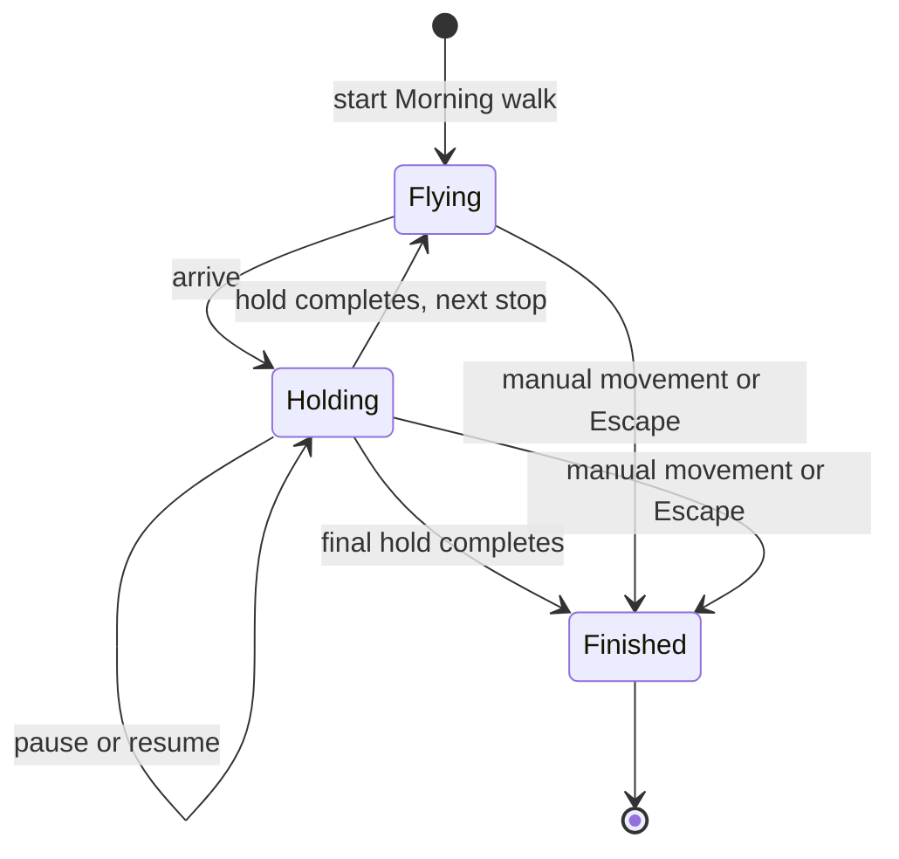

The walk visits Overview, up to three attention stops and Home. A nearby facade
tap activates its live controls; distant taps and search fly to the facade.
Project portals open project worlds, app task details delegate to the existing
task page, and the independent fixture retains its local summary panel.

# Rendering and bounded work

`PlazaView` checks Flutter GPU before initializing shared shader resources and
handles unavailable renderers with a localized exit shell. Desktop runners enable
GPU at startup. Frame pacing stops when the route is hidden or the app is
backgrounded. Scene repainting uses `PlazaRepaint`; hosted widget subtrees don't
rebuild with every camera frame. The fixed `PlazaFrameWindow` buffer publishes
statistics periodically rather than allocating a new history each frame.

`PlazaSceneController` builds geometry through library parts and shared bindings.
`PlazaBoxes` shares unit meshes and immutable materials. Static opaque meshes are
baked by spatial cell and compatible material/UV/picking state; pick anchors and
dynamic groups keep their identity. Translucent pools and individual status
sprites keep depth ordering. Ground streaks, scene glows and independently
animated billboard halos all receive the shared radial falloff texture; missing
that binding produces hard rectangular sheets of colour. Fog and ground washes recede with altitude, leaving
road markers and status lights readable in Overview. Decorative filler blocks
and the skyline ring share a separately baked `city-context` root. It hides at
the same altitude threshold that reveals map labels, removing their occlusion
of task roofs; the project landmark, actual task buildings and week addresses
remain. This is currently a discrete map transition, not an opacity fade.

Facade tiers are geometry-only far, captured sign, and activated live. The LOD
manager caps sign/live counts, uses range/view hysteresis and paces promotions.
A flight preloads its destination and disarms live controls. Live captures use a
short interval; still posters capture initially and when cover content changes.
Local cover arrival retries the image and invalidates its captured texture;
failed live image-cache entries are evicted before retry.

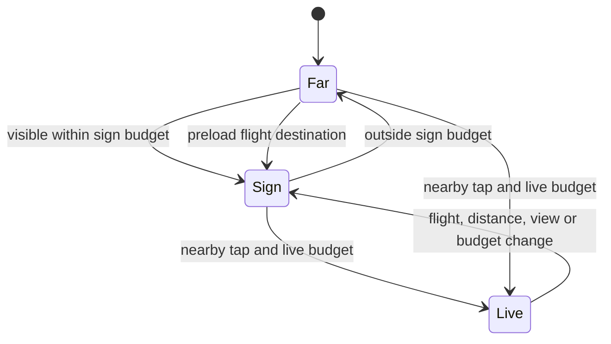

`SurfaceCaptures` waits for actual capture acknowledgements. Invalidating a
surface primes a fresh recording, then requests another capture on a subsequent
frame: an old recorded layer landing first must not settle the refresh. Tickers
scroll one captured period by UV offset; the jumbotron's slow shared clock only
advances when capture is requested. Window/shopfront texture families are shared,
and temporary canvas images are disposed after upload.

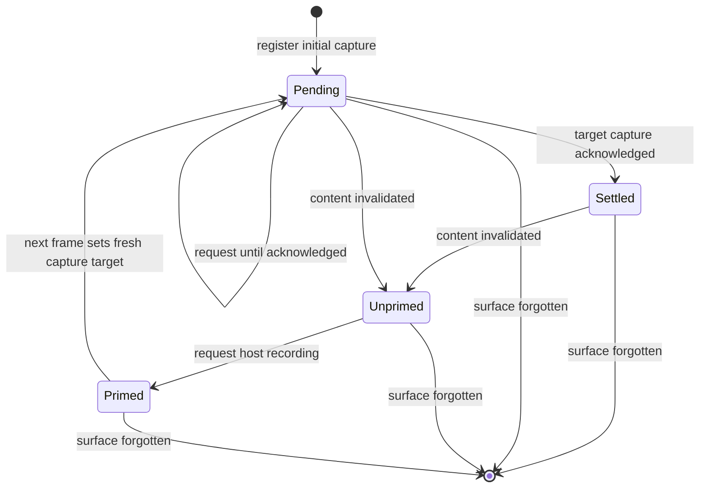

Roof lanterns have a minimum screen size, so completed green and blocked red
remain visible from altitude. Chase bulbs share a draw per lightbox.
`PlazaFireBuffer` ranks flame sources intermittently and animates only a fixed
nearest-source budget in one instance buffer. Conservative bounds are reserved
once, and distant sources fade out. The shared procedural texture forms flame
tongues above overdue facades and billboards; no completed/cancelled item burns.

# The hour the world is built under

Every material in the scene is unlit: nothing is a light and nothing is lit.
The hour is *painted*, and `PlazaPalette` is where it lives — sky, haze, bloom
and vignette, every flat surface colour, the lantern set, how far emitters are
pushed past white, and where the sun stands. `PlazaSceneController` holds one
palette and reads every colour and atmospheric number from it. **No file under
`scene/` keeps a colour constant of its own**: a value that is not in the
palette cannot change with the sky, which is the defect the type exists to
prevent. The one exception is signage — `PlazaStyle` — which keeps the night
register in both skies, because a sign is a sign at noon.

Night and day are separate palettes, not a blend, so a switch is a rebuild:
`PlazaView` throws the scene away and builds it again under the new palette,
keeping the camera pose. Materials are shared and immutable, so there is
nothing to repaint in place; this is the same path the layout knobs use.

Painted textures cannot be shared. The window and shopfront tiles are opaque —
the texture *is* the wall — so each hour has its own set, painted from a
`WallInk` and uploaded asynchronously. The set on screen stays until the new
one lands, and a result that is no longer wanted (the locale moved on, or the
walker switched back) is dropped rather than attached.

`PlazaWallSwap` owns that decision — what is on the walls, what is on its way,
and whether the set that just landed is still wanted — because a paint takes
long enough for the walker to change their mind twice. Every load settles it,
whether it was attached, dropped or thrown: a marker left standing would make
its sky unloadable for the rest of the session, and the district would keep the
other hour's windows with nothing scheduled to correct it. It is a plain object
rather than fields on the renderer so that sequence is a unit test. The paving and grain
overlays are translucent and serve both skies unchanged.

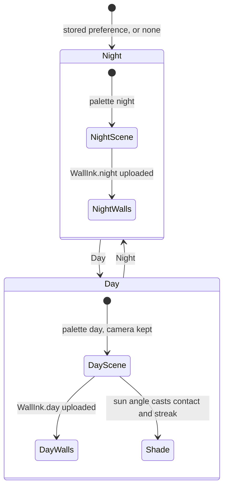

Daylight has no light to spend, so it spends shade. `PlazaSky.shadowLength`
turns a volume's height into a ground distance from the sun's elevation,
clamped so a tower does not drag its shadow across the district; night returns
zero and no shadow geometry is created at all. Each caster gets two quads: a
contact pad on its footprint, which is what says it meets the ground from any
camera angle, and a streak away from the sun, which is what says where the sun
is. One offset quad cannot be both — its falloff peaks half a shadow-length
out and leaves the wall's own foot at a third of the density.

Shade uses its own mask, not the light pool's. The pool is a hot core with a
long thin skirt, which is right for light and wrong for shade: the renderer
blends premultiplied (`src + dst × (1 − srcAlpha)`), so a dark colour
multiplied through that skirt darkens the paving by a percent or two and the
shadow reads as a stain. `WallTextures.paintShadow` is opaque across the middle
and feathers only at the rim.

Chrome over a bright world needs help the night never asked for: in daylight
the status key and the keyboard legend sit on a scrim, because white type and
tinted status pills drawn straight onto sunlit concrete do not read. The
toolbar above needs none of it — it brings its own glass, `WorldGlass`. That
is a design-system token rather than a plaza-local colour: chrome over an
arbitrary backdrop is a case the design system already recognises, and
`PhotoNeutralGlass` is its sibling. The difference is strength. Black at 45%
works over a still photograph; over a walking camera it strobes as the street
slides past, so this glass is near-opaque and tinted — a cool navy that stays a
panel while the world moves underneath it. `PlazaStyle` keeps scene content
only.

# The chrome, and how it hides

The world is the point of the screen, so the controls collapse. What stands
over the street at all times is two round buttons in the top-left corner —
leave, and show/hide — plus the status key and the keyboard legend along the
bottom. Everything else the HUD used to hold permanently on screen (the project
title, the counts, the three navigation buttons, the two segmented controls and
the four checkboxes) lives inside `PlazaTopBar`'s toolbar, which is closed on
arrival and slides out to the right of the buttons.

The two buttons read as one mirrored pair — an arrow out of the world, an arrow
into the controls. That is why the toggle carries `LottiIcons.forward` and not
`LottiIcons.sidebar`, whose *meaning* ("show or hide the side panel") is the
better fit but whose panel-left glyph read as window chrome sitting on a 3D
street. The arrow does not flip when the toolbar opens: it names the button,
and the teal fill is what carries the state.

The two buttons are the layout's fixed point. They are laid out *before* the
toolbar in the same row, so revealing it cannot move them, and the toggle can
be pressed twice without the pointer having to chase it. The toolbar carries
its own glass — fill, backdrop blur and drop — rather than borrowing the
daylight scrim, so it reads under either sky.

A closed toolbar is **not built**, not merely transparent. An invisible widget
still holding the width of the whole toolbar would sit over the street
swallowing drags, and the one thing a hidden toolbar must not do is interfere
with walking. Mid-animation it is in the tree and held inert by `IgnorePointer`,
so the press that dismissed it cannot land on a control on its way out.

Two things constrain how that reveal is animated. Reduced motion collapses it
to a single frame, as it already does for the penguins and the meerkats. And
the fade cannot be an `Opacity` around the panel: an opacity layer is a save
layer, and a `BackdropFilter` nested inside one has no backdrop left to sample,
so the glass would render flat for the whole transition and snap into blur on
the frame the opacity reached 1. The fade is spent instead on the surface's own
alpha, on the shadow's, and on an `Opacity` *inside* the filter.

`PlazaToolbarKey` states the keyboard contract as data — `T` flips the toolbar,
`Esc` only ever shuts it — because `PlazaView` needs a live GPU context to build
and is therefore beyond the test suite's reach. Only the *first* press counts:
the renderer's handler deliberately accepts key repeats, because walking is a
key held down, and a toggle fed repeats strobes and lands wherever the user let
go. `Esc` then falls through to the rest of the handler: the same press still
dismisses the task panel and ends a Morning walk.

`PlazaKeyRouting`, stated the same way and for the same reason, decides who a
press belongs to. The world binds nearly every key — `WASD`, `Tab`, `Space`,
`H`, `M` — from a `Focus` that sits *above* the chrome, so it answers `Tab`
before the app's own traversal ever sees it; that is why the toolbar's controls
and the corner buttons were reachable by pointer only. The way in is the
toolbar itself. While it is shut, which is nearly all of a visit, every key is
the world's exactly as before. Open it and `Tab` hands the keyboard to the
chrome instead of stepping to the next beacon; once a control holds it, every
press is that control's — **except the toolbar's own two**. `T` and `Esc`
outrank focus, because a shortcut the legend advertises has to keep working
while the thing it controls holds the keyboard, which is precisely when a
walker wants it gone; the routing lifts both above the focus check rather than
`Esc` alone. Neither is a key a control in this chrome can want — there is no
text field in it, and the search sheet takes the keyboard before the routing is
reached. Shutting the toolbar by any route returns focus to the world, because
a control that has left the screen must not keep the keyboard.

The buttons themselves are `FocusableActionDetector`s, so a focused one takes
`Enter` and `Space`, wears a ring of the interactive teal, and publishes
`focused` and `toggled` rather than answering "is it open?" in teal alone. The
glass chip is `ControlSizes.iconChip`; the thing you have to hit is
`TapTargets.minimum` around it, because a glyph-only control has no label to
borrow hit area from.

The toolbar hides controls, not feedback. The flight toast sits outside it,
under the buttons, because a message nobody can see is not a message.

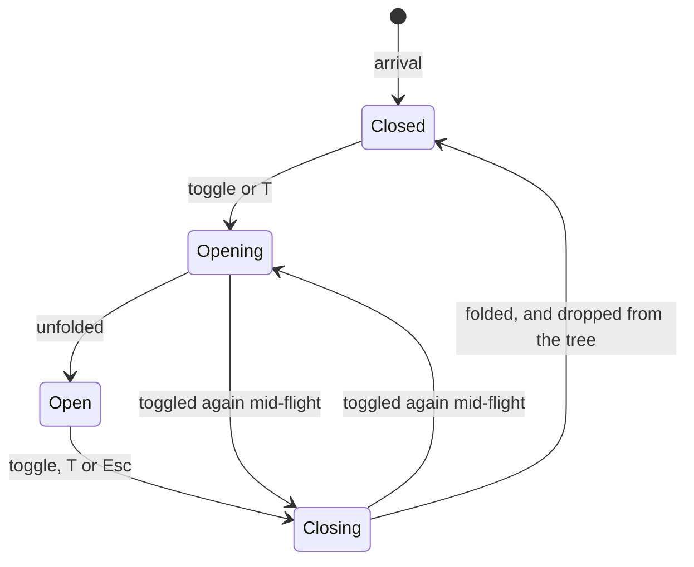

Open or closed is renderer state and lasts as long as the view. The sky is a
preference worth remembering between visits; an open toolbar is not.

# Ambient companions

`CharacterPopulation.forWorld` distributes solo walkers and pairs through the
street segments and frontier plaza. Each street gets a stadium circuit in its
own frame, including connectors with sufficient clear space. Routes stay within
the asphalt, excluding pavement and kerbs. End caps stay outside adjoining
streets at folded junctions so independently timed groups cannot collide there.
When nearby buildings block a wide circuit, smaller routes on either side of
the street are tried before omitting that region. The plaza uses
`CharacterLoop.forPlaza`; a missing or obstructed plaza does not remove street
walkers. Region IDs, builds, scales, phases and pace are deterministic.

All routes check their swept envelope against `PlazaWorld.solids`. Samples are
at most 0.5 m apart with another 0.25 m clearance covering the intervals. High
signs above the character envelope do not block routes. Characters are ambient
visual content, not collider solids or pick targets.

Pairs share route progress and pace but have independent stride phases and
scales. Their identical stadiums are translated across the fixed street frame,
maintaining separation and equal travel distance. They walk alongside one
another on straights and briefly stagger through turns. Narrow or obstructed
pair routes fall back to solo walkers. Groups on the same circuit share pace
and evenly spaced phases; different regions can use different paces. Each
region repeats its full solo/pair mix twice, with six groups on streets and
eight in the plaza. `PlazaView` shares the world's `ambientCreatures` budget
(default 24) between both species: up to one quarter goes to meerkats, with the
rest passed to `CharacterPopulation.forWorld(maxCount: ...)`. Unavailable
meerkat assets leave the full budget for penguins. A zero budget loads neither
model and creates no actors. Selection retains whole groups, starts with a fitting
Home group, then visits regions round-robin; odd budgets use solo walkers.
Unbounded population generation remains available to route-clearance tests.
Their uniform scales are 15% smaller than the original crowd; stride
distance, IK and contact heights follow that scale.

`MeerkatPopulation.forWorld` adds small, obstacle-cleared foraging circuits
through the same street network and square. Seeded phases and time offsets
spread out the lookouts. A bounded population keeps a Home lookout and samples
remaining circuits across the district. Candidate positions avoid the initial penguin crowd;
shared traffic reservations handle later encounters. Foraging loops exclude
parallel overlaps with narrow penguin lanes, where fixed routes would leave no
room to pass; transverse route crossings remain possible. Each species has its
own localized HUD checkbox; both species start hidden to preserve idle rendering.

`MeerkatMotion` integrates an eased velocity over a 3.2-second scamper. Ten
whole diagonal strides end with all four paws planted, followed by settling, a
camera-facing lookout and foraging. Each 10.8-second bout includes a lookout.
The body keeps facing the camera while upright, then turns back toward the
route on supporting pivot steps as it lowers. Route distance stays constant
throughout the stationary actions and continues across the next cycle without
resetting contacts. Head and eye tracking aim toward the camera during lookout;
the chin sits higher while the forepaws hang close to the belly. Seeded blinks
run independently. Foraging lowers the head toward the ground and alternates
short forepaw rakes, with both hind paws and the other forepaw supporting the
body. Entry and exit weights preserve continuous targets when the action
changes.

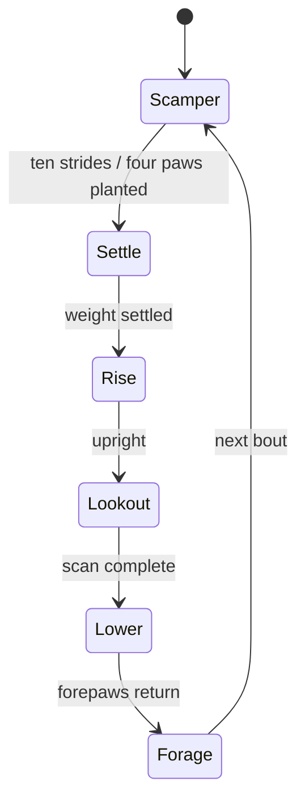

The original meerkat asset has a slender body, pointed muzzle, dark eye
patches, small low-set ears, a narrow torso and a long tapered tail. Zoo
reference photographs from
[Marwell](https://www.marwell.org.uk/animals/meerkat/) and
[Indianapolis](https://www.indianapoliszoo.com/animals/meerkat/), plus the
[Wellington Zoo behaviour footage](https://meerkat-dataset.github.io/), guide
the proportions, nose-down foraging and sentinel posture. Its 20-joint skin
includes four three-joint limbs, three tail joints and independent gaze joints.
`PlazaMeerkats` reuses `CharacterLimb` for all four contacts. The pelvis and
spine lean into the quadruped pose; the head counters the lean. On rising, the
hind paws support the body and alternate pivot steps while forepaws hang close
to the belly with downward-facing digits. Fur uses the existing warm neutral
lantern palette. Skin geometry and materials are shared; clone joints and
eyelid morphs remain independent. Each update samples the gait once per meerkat
and reuses that pose for distance culling and the visible rig transforms.

`MeerkatLookout` turns the stationary body toward the camera at a bounded
angular rate. The head and eyes lead the turn; hind paws alternate short pivot
steps, retaining at least one supporting contact without sliding. As the body
lowers, the same controller turns back toward the route. Reduced motion freezes
both these contacts and the camera target.
Contacts belong to their sampled route stop. If culling skips the moving phase,
the next sample at a different stop resets the cached yaw and hind-paw contacts
before posing the visible skeleton.

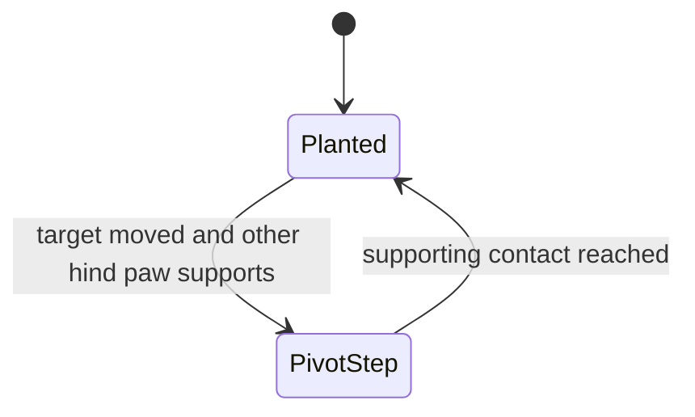

`CharacterTraffic` owns each actor's locomotion clock. It grants a swept route
reservation ending at a supporting pose, then accelerates or brakes the clock
within that reservation. The same clock drives root travel, feet and body;
collision response never displaces a root independently of its foot targets.
Reservation samples are at most 5 cm apart, with half a sample interval added
to each collision radius to cover the spaces between samples. Axis-aligned
bounds reject unrelated regions before testing individual samples. Meerkat
clearance includes the extended body and tail.

Stable population order grants priority at simultaneous crossings. A separate
forward guard keeps a yielding approach outside the crossing until its exit is
clear; parallel followers use ordinary swept reservations. Fixed 30 Hz steps
keep results independent of render cadence. Catch-up is capped at 250 ms after
long suspension. Hidden species release space, and reappearing actors wait for
a safe reservation before becoming visible. Reduced motion pauses the clocks.

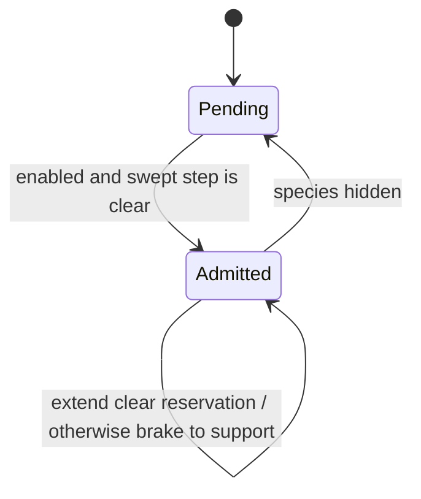

`PlazaCharacters` attaches the population **after** static mesh baking. Each
instance has its own skeleton; geometry and token materials are shared. All
surfaces in one instance share one skin upload. `Node.clone` does not preserve
raycast flags, so construction reapplies them to the cloned mesh nodes.

The original model is `assets/plaza/penguin.glb`, generated with the Python
standard library by `tool/plaza/build_penguin.py`. A smooth implicit mesh
forms the egg-shaped body, tapered flippers and short legs. Its 15-joint skin
has a pelvis, spine, head, two joints per flipper, three per leg and one gaze
joint per eye. Broad webbed feet have three toe lobes; the short beak is a
rounded taper with a narrow seam following its surface.
Feet below the ankle follow the ankle rigidly so shin deformation does not
bend their soles through the paving. The implicit surface is intersected with
its ground plane so smooth unions cannot inflate the soles below contact.
White belly and face patches are assigned
to surface triangles, not protruding primitives. The imported model root
is retained without the importer's coordinate-conversion wrapper because the
model is authored in Plaza's +Z-forward frame. Materials use the existing
dark background tokens for charcoal plumage, the light background token for
white patches, and the warning accent for the orange bill and feet. Colours
are converted to linear space with zero metallic response.

Standard, compact and upright builds share the same geometry. Body-only morph
targets carry position and normal deltas, fading above the pelvis and below
the head. Uniform head-joint scaling and a small rest-height offset carry the
face together without changing leg lengths. Each exported surface contains
only its used vertices; importing morphs therefore does not duplicate the
entire character vertex buffer for every face detail. Clone morph weights are
independent even though their geometry is shared.

The eyes are shallow insets. Their upper lids are cylindrical shells whose
front depth depends only on horizontal position, remaining outside the eye
envelope while the lower edge closes vertically. Open-to-closed morphing
therefore avoids cutting through the eye along an ellipsoid chord. The pupil
and catchlight of each eye share a gaze joint; the beak seam stays head-bound.
Facial morphing happens before skinning, so changing head proportions also
carries the eyelids and gaze without separate expression corrections.

`CharacterGait` derives the cycle from total distance and scales the short
stride length with character size. Low heel recovery keeps the feet below
the belly. Route distance wraps; the gait cycle never resets at the seam.
Each leg alternates between fixed world-space contact and recovery; the other
leg is half a cycle ahead. Stance occupies 60% of a cycle, so walking always
has at least one supporting foot and transfers through double support.
Recovery uses a quintic horizontal interpolation and an early heel lift,
returning the sole flat before landing with zero horizontal velocity. Ground
height belongs to the route: street asphalt and plaza paving use their actual
surface elevations for both ankle targets and contact shadows.

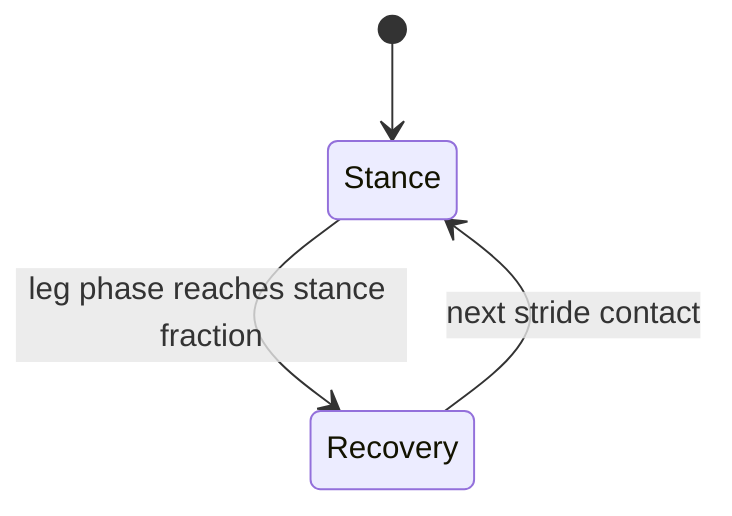

The body is lowest through double support and rises through passing. A lateral
pelvis shift and torso roll move weight toward the supporting foot. A short
centered tangent sample banks the torso into bends. The head counters torso
tilt, and the spread flippers balance the body; their restrained tips follow
the stroke by 80 ms. Two-bone inverse kinematics solves each leg in world space, including
sideways displacement on turns; the ankle cancels its parent rotation to
preserve contact orientation. `vector_math.Quaternion.rotated` applies the
inverse rotation: conjugating it again when converting world vectors into a
parent frame breaks foot locking. The solver retains tiny rotations rather
than rounding them to zero.

`CharacterCompanion.attentionAt` occasionally looks toward its partner.
Each seeded 9–13 second interval contains an eased glance, a short hold and an
eased return. The second partner responds 0.55 seconds later. A small nod has
zero angular velocity at its endpoints, and a continuous facing gate suppresses
conversation through U-turns. Eyes lead the head into the glance and back to
forward attention, then settle as the head takes over. Residual eye yaw is
bounded so pupils remain inside their eye openings. Social animation affects
the face and head without moving foot contacts or changing route progress.

`blinkAt` samples independent, jittered blink events from the companion ID
and event number. Each closes quickly, holds briefly, and reopens more slowly.
Partners share conversational timing but not blink schedules. Both eyes of
one penguin close together, covering pupils and catchlights.

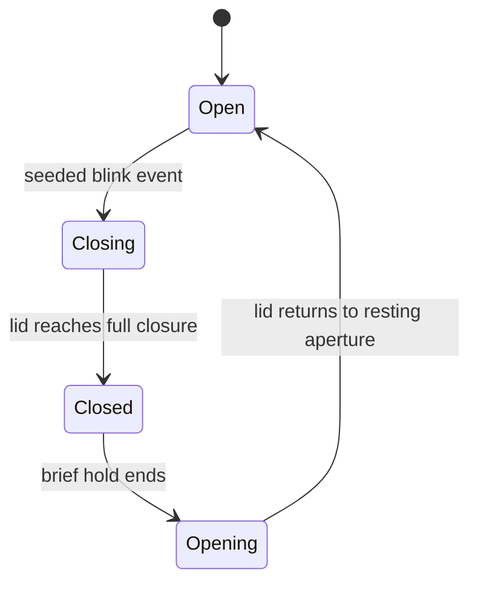

The reusable explorer supplies its existing active clock; no extra ticker is created.
`MediaQuery.disableAnimations` freezes the entire pose and travel without a
catch-up jump when re-enabled. Characters beyond `visibleRange` stop rendering
and leave the 30 Hz animation budget. Resuming visibility samples the current
route time. Rebuilding the world or disposing the explorer detaches the old rigs.
`PlazaCharacters.enabled` hides the existing root, clears its motion budget,
and resets the clock baseline on both toggle edges. The HUD preference starts
false in each new `PlazaView` and stays there across data refreshes; toggling it does not call `_load` or move the
camera. Reduced motion leaves visible animals frozen, independently of hiding.
Optional GLB load failure leaves the data world usable and its control disabled.
A later zero-to-positive budget change can load the model, with a mounted guard
before attaching it to the current world. `PLAZA_HIDE=characters` (or `life`)
omits the layer for scene isolation.

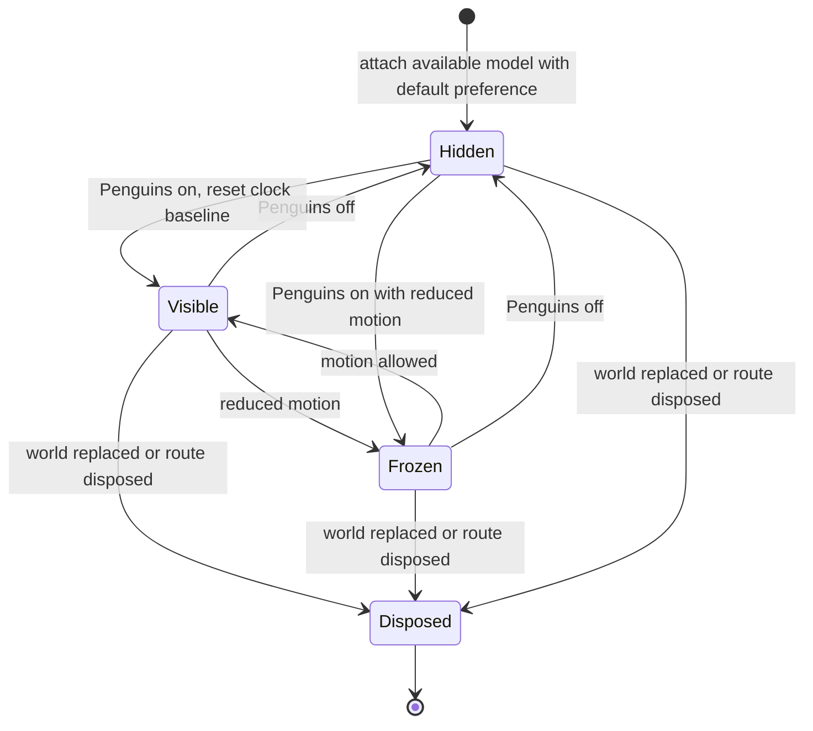

Tests load the shipped GLB hierarchy, inverse bind matrices and actual morph
deltas through the shared scene test helper, using empty base geometry to avoid GPU uploads. They check
cloned joint references, contact targets and ankle orientation through a full
lap at every scale and build, plus independent expressions, closed-lid reduced
motion, visibility and node disposal. Pure
gait tests check contact continuity, double support, recovery clearance and
deterministic sampling. Population tests cover every district in demo and
folded fixtures, obstacles, asphalt bounds, formation, eye/head sequencing and
independent blink timing. A separate junction regression checks independently
timed crowds for collisions. Rendered appearance still requires a
native Flutter GPU review; these tests cannot judge animation appeal.

# Validation boundaries

Repository/provider, generation, navigation, checklist edits, image arrivals,
flights and widget copy run in targeted headless tests. GPU geometry and native
texture interop still require the fixture on a supported renderer. Settled Linux
Xvfb captures now show hosted text and cover images. Earlier blank Home signs
were captured before presentation, not sufficient evidence of texture corruption.
The tour waits for acknowledged still captures and a stable settling interval,
then announces readiness only after raster timing acknowledges the frame. It
cannot advance past that stop before the acknowledgement. These Linux captures
do not establish macOS visual parity or its reported frame rate. Commands, screenshot
rules and measurement interpretation belong in the
[operator notes](../../docs/plaza/HANDOVER.md).
