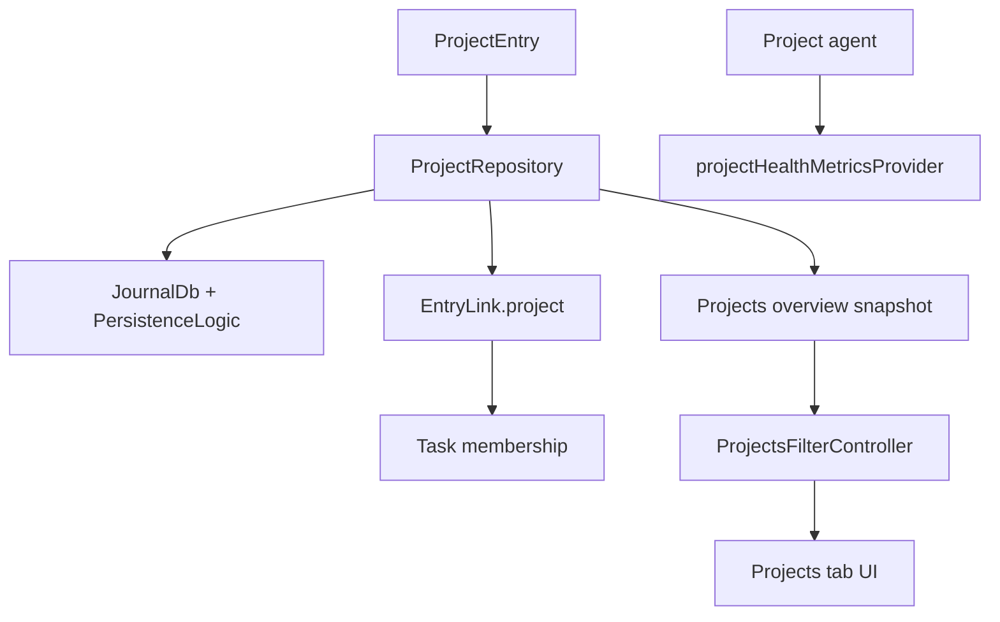
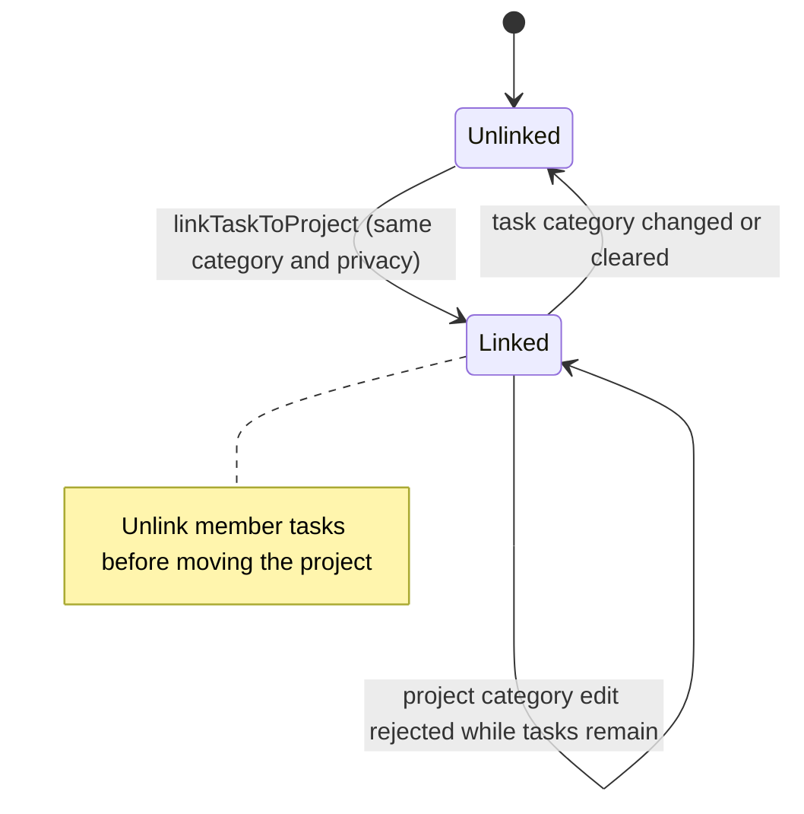
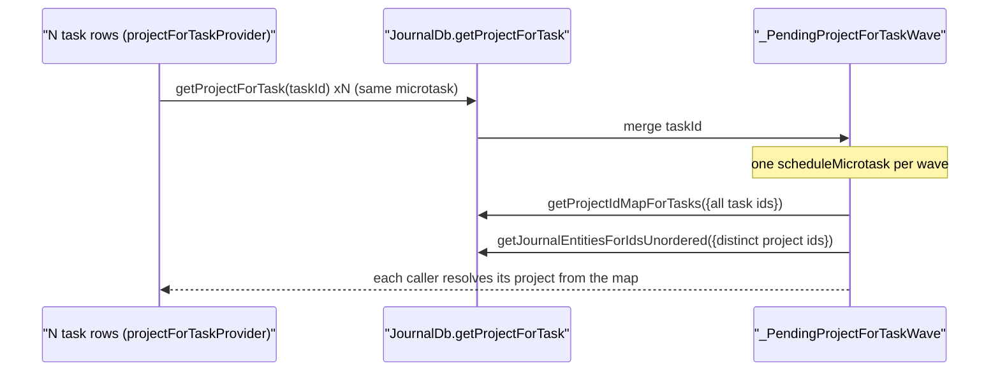
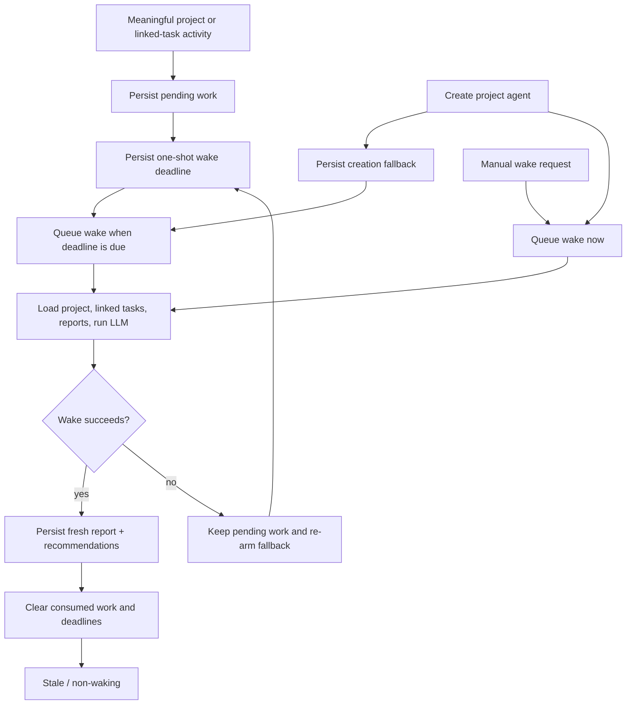

Projects group related tasks, power the projects tab, and integrate with the
agent system so a project accumulates health signals, recommendations and
update-driven reports instead of just acting as a nicer folder.

**The visible experience is gated by `enableProjectsFlag`.** With it off there is
no top-level tab, no category projects section and no task project chip. Routes
may still exist, but the normal ways in are hidden.

# The data model

A project is a `JournalEntity.project` variant. `ProjectData` carries `title`,
`status`, `statusHistory`, `targetDate`, `dateFrom` and `dateTo`, plus free-form
body text through `entryText`.

**`ProjectStatus` has six variants**: `open`, `active`, `monitoring`, `onHold`
(with a **required reason**), `completed`, `archived`.

`monitoring` marks a project that is not closed but has **no time actively
scheduled** — touched only when something comes up before it can be declared
done. Day planning tiers by status: `active` forms the scheduled pool;
`open`/`monitoring`/`onHold` stay available at lower priority so something
noticed along the way can still be planned; `completed`/`archived` are
unavailable.

## Membership is denormalized

Tasks link to projects through `EntryLink.project`, **and** the database keeps a
denormalized `project_id` on tasks.

That column is the read path for "project of a task":
`JournalDb.getProjectForTask` resolves through `journal.project_id` (indexed)
rather than joining `linked_entries` and sorting. **It is kept in lock-step with
the latest non-hidden `ProjectLink` on every link and entity write**, so the
result is identical to the old join without its
`USE TEMP B-TREE FOR ORDER BY` sort.

## Membership is scoped to category and privacy

`linkTaskToProject` re-reads both entities and refuses a link whose two sides
disagree on category or privacy. The fresh privacy check closes the async gap
between resolving a project for task creation and persisting its link: if sync
changes project privacy in between, the link is rejected and the creation path
soft-deletes the new task. Nullable privacy is normalized with `?? false`, so
legacy `null` and explicit `false` are both public and remain link-compatible.
The task header filters its project picker to the same normalized privacy, so
it does not offer a choice the repository must reject. Project-agent
`create_task` calls pass the project's privacy into task creation before
linking. A category can still move after linking, and that
write is nowhere near the link, so the category rule has to be re-checked there
too.

**`EntryController.updateCategoryId` does that for the task side**: it drops the
project link of every task it moves when the new category is not the project's
own.

The comparison is against **the project's** category, not the task's previous
one — re-picking the category the task is already in leaves the two in
agreement, so there is nothing to drop. It stays a comparison when the category
is cleared: a project that carries a category is dropped, and an uncategorized
project is kept, since `null == null` is exactly the pairing
`linkTaskToProject` would still accept. Uncategorized projects are real —
`createProject` takes a nullable category, and `createTask(projectId:)` copies
the project's category onto the new task, `null` included.

The lookup deliberately does **not** go through `getProjectForTask`. That read
honors the private gate, so a private project resolves to null while private
entries are hidden; a cleanup reading that as "no link" would skip the stale row
and let it reappear the moment they are shown. `getLinkedProjectForTask`
resolves the live `ProjectLink` and its project entity directly, neither of
which is privacy-filtered.

A task whose category write did not land is not swept. A failed write means the
entity was not found — deleted since it was read, or never there — so it keeps
the category it had, and its project is still correct for it.

Privacy toggles follow the same invariant. After a task privacy write commits,
`EntryController.togglePrivate` resolves the persisted project link through
`getLinkedProjectForTask`; if project and task now disagree, it unlinks them.
The cleanup does not run after a failed privacy write, so a task that stayed
public cannot lose a still-valid public-project membership.

The sweep covers the entries the same call re-categorized, not just the edited
one. `getLinkedEntities` is **not filtered by link type**, so the propagation
loop rewrites the category of linked *tasks* along with the timers and images it
is aimed at; each of those gives up a now-foreign project too. A `ProjectLink`
runs project → task, so a task's own project never appears in that list.

Only the task detail header changes a task's category
(`CategorySelectionIconButton` excludes tasks and events explicitly), so the
controller is the single funnel this rule has to sit in.

**The project side refuses to create a mismatch.**
`ProjectRepository.updateProject` compares the stored and requested category
inside the same journal transaction that writes the project. When they differ,
any linked task or non-destroyed project agent makes the update fail; the tasks
must be unlinked and the category-scoped agent retired before the project can
move. The task guard reads the unfiltered denormalized `project_id` membership
rather than the visible task list, so hidden private tasks still protect the
invariant. The agent guard resolves active `agent_project` links from the
independent agent store, preventing a moved project from retaining permissions
and template context scoped to its former category. `linkTaskToProject` uses the
same database transaction domain, so a new membership cannot land between the
task guard and the category write. Keeping the guards in the repository covers
both the inline picker and the full editor instead of relying on either UI to
remember the invariant.

# Two hot reads are shaped for bursts

**`getProjectForTask` is microtask-coalesced.** `projectForTaskProvider` is an
autoDispose family, so a task list mounts one lookup per visible row. Instead of
N single-task queries, concurrent callers in the same microtask merge into **one
wave**:

**`watchProjectsOverview` debounces refetches.** `UpdateNotifications` already
coalesces sync bursts (~1 s) and local edits (100 ms); the repository adds a
300 ms debounce so remaining back-to-back batches collapse into a single rebuild.
The first fetch on subscribe stays immediate, and the in-flight
`fetching`/`pendingRefetch` guard is preserved.

# The overview is grouped DTOs

The tab is driven by `ProjectsOverviewSnapshot`, `ProjectCategoryGroup`,
`ProjectListItemData`, `ProjectTaskRollupData` and `ProjectsFilter` — **not raw
entities** — so the UI renders grouped rows without recomputing counts,
categories and rollups in each widget.
Project-agent one-liners are resolved in two bulk reads when the snapshot is
assembled, then stored on each `ProjectListItemData`. Rows therefore render a
stable subtitle without one provider/query chain per card, and local search
matches the same one-liner text that the list displays. Background enrichment
listens through `projectAgentOverviewUpdateStreamProvider`, which bulk-resolves
the affected agent IDs and emits only when at least one is a project agent;
unrelated task, event, day and improver writes therefore do not rebuild the
project query, task rollups, links and reports. Background enrichment
reloads preserve the last rendered snapshot, category-filter metadata, and
create affordance until the replacement is ready. If agent enrichment fails,
the replacement snapshot retains the last resolved one-liner for each surviving
project instead of dropping visible subtitles and their searchable text. If an
upstream repository refresh fails after data was rendered, the tab keeps that
previous list instead of replacing it with a full-page error.

The default `Current` scope keeps open, active, monitoring and on-hold work in
view; `All` restores completed and archived projects. Projects sort by
actionability, then target date and recent activity by default, with target
date, recent and name alternatives. Category sections are collapsible, and
completion uses the interactive accent rather than pretending low completion
is a health warning. Projects with no tasks say so instead of showing a red
zero-percent ring. First-run, current-empty and filtered-empty states each
explain the state and offer the relevant recovery action.

On desktop the overview and selected detail share the standard resizable
list/detail traversal. Once a project is selected, Hide list enters focus mode:
the list and divider go offstage without being disposed, and Show list remains
available over every detail state, including initial loading and errors. A
desktop project detail never renders the mobile Back affordance because the
split has no parent route to pop; Back remains on the standalone mobile detail
route. The primary search command restores a hidden list before focusing its
search field, so keyboard search never targets an offstage control. Toggling
focus mode changes only the restore-button overlay; the detail subtree stays
mounted under a stable parent. Tasks and Projects share the persisted collapse
preference and expanded list width. The focused header and body are centered on
the shared 960 pt detail
measure with its one standard horizontal gutter, keeping report lines and cards
readable when the list releases a wide canvas without double-insetting mobile
content.

Project detail actions preserve workspace continuity. Edit uses the
Projects-owned `/projects/<id>/edit` route on mobile and desktop, with an
explicit return path back to the selected project. The editor owns the complete
user-authored project record — title, description, category, status and target
date — while the detail surface keeps compact quick edits for category, status
and target date. Both paths write through the same detail controller, so draft
rebasing and save-failure behavior stay consistent. Add task creates a
project-linked task with the project's privacy, serializes concurrent taps and
project saves,
awaits the category's default task-agent assignment, then opens the task. If
that optional assignment fails after creation, the page reports the error but
still opens the already-linked task, preventing a retry from creating another
blank task. Back, system-back, task-row navigation and the overflow menu remain
locked until this mutation settles, so the page cannot be disposed between
creating the blank task and opening its editor. If
the explicit project link loses a race with sync or otherwise fails, creation
soft-deletes the new task before surfacing the error, preventing blank orphans.
The inline editor rebases only locally changed fields onto a concurrently synced
project; title and description controllers synchronize independently, so a
dirty description does not leave a clean, remotely updated title stale. The
description rebase carries only the local plain text onto the synced
`EntryText`, preserving newer markdown, rich-text and geolocation payloads. Save
locks Cancel, Back and system-back until persistence settles, preventing a
discarded route from racing the still-running write. The controller invalidates
pending edits when sync reports that the project was deleted. Description edits
replace only `EntryText.plainText`, preserving any markdown, rich-text and
geolocation payload attached to the project. The project
lookup is applied before task rollups are loaded, so a
slow or failed task query cannot delay tombstone handling. Overlapping reloads
are generation-guarded, so an older read that finishes after a newer deletion
cannot repopulate the editor and resurrect the tombstoned project on save.
Cancel and system-back exits discard the shared
editor draft before returning to the still-mounted desktop detail, so canceled
values cannot appear there or leak into a later inline save. Project deletion
resolves every live linked project agent, aborts their running wakes and
retires all of them before soft-deleting the project, so duplicate identities,
runtime subscriptions and pending work cannot outlive the project. A
retirement error aborts deletion instead of claiming success; when that error
followed a committed lifecycle write, the deletion path re-reads the agent and
restores its exact prior lifecycle before returning; dormant agents remain
dormant and do not regain subscriptions. After a failed or throwing project
write, the path verifies the tombstone before compensation. A committed
tombstone is treated as successful deletion; if deletion cannot be confirmed,
the reversible agent retirement is compensated so a live project cannot lose
its automation because the verification read also failed. The detail keeps the
last resolved agent identity during provider reloads, and captures the
subscription restorer before deletion awaits, so neither a sync refresh nor
route disposal can bypass that lifecycle cleanup. Task creation and deletion
each hold the shared detail mutation lock through completion, preventing
overlapping edits, task creation, or deletion.

# Health is agent-authored

The detail pages pull project entity data, linked tasks, the latest project-agent
report, parsed health metrics from it, scheduled wake state, active
recommendations, pending project change sets, derived presentation data, and
the wake controls. The read-first surface renders recommendation
resolve/dismiss actions and change-set confirm/reject actions after the shared
AI report, so agent output remains actionable without duplicating the report in
the editor.

**There is no aggregator object** — each surface watches the providers it needs.

**If the latest report has no parseable health payload yet, the app shows a
neutral unassessed state** rather than falling back to invented local
heuristics. Once metrics exist, the detail leads with the agent-authored band,
rationale and optional confidence, labelled with the source report's freshness;
it never converts a categorical assessment into a fabricated numeric score.
That timestamp makes the assessment's snapshot provenance explicit beside live
task counts. Blocker navigation appears only when blocked tasks exist and opens
the first actionable blocker. A project with no agent gets distinct
provisioning guidance and an assignment action rather than an unavailable Run
report instruction.

The user-authored project description and the agent report are distinct fields
in the detail read model. A missing report renders the neutral report-empty
state; it never repeats the project description under an AI-authored heading
or presents the project's own modification time as report freshness.

# When the project agent actually wakes

Project agents are stale and non-waking by default. They have no recurring
daily schedule; meaningful project activity, agent-assigned work, or an
explicit request creates one-shot work instead.

The project detail read model exposes the active one-shot wake deadline beside
the agent report. Legacy recurring rows are retired by the agent subsystem and
do not become new daily wakes.

See [project and event agents](agents/project-and-event-agents.md) for the
workflow side.
