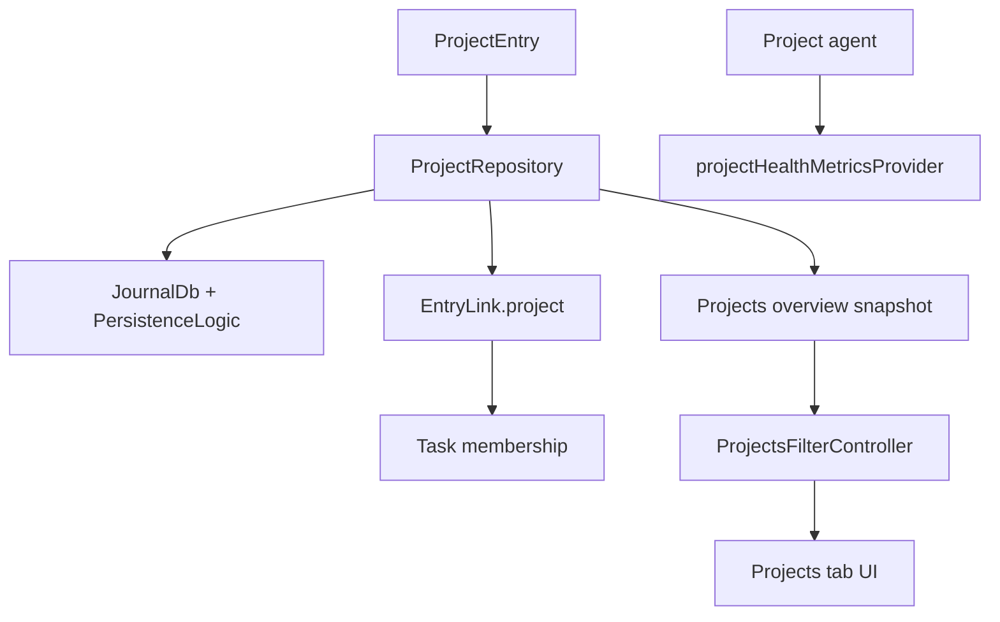
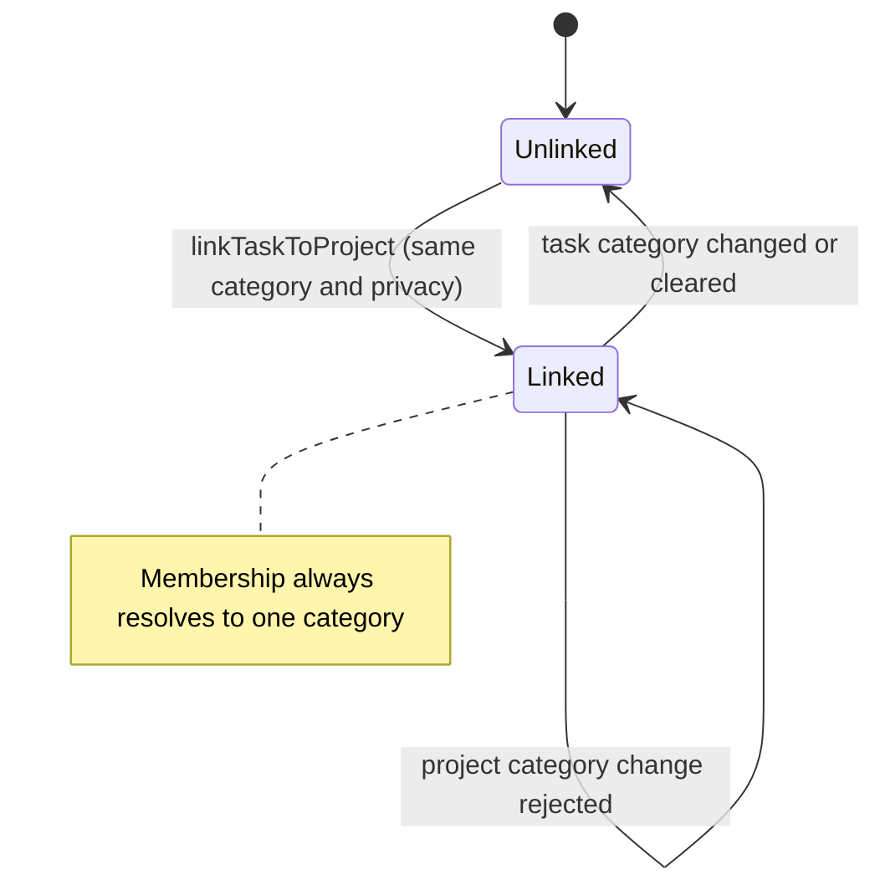
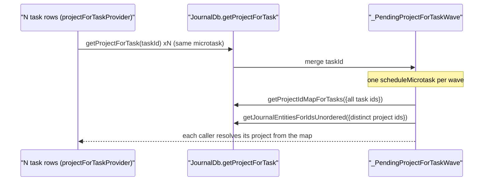
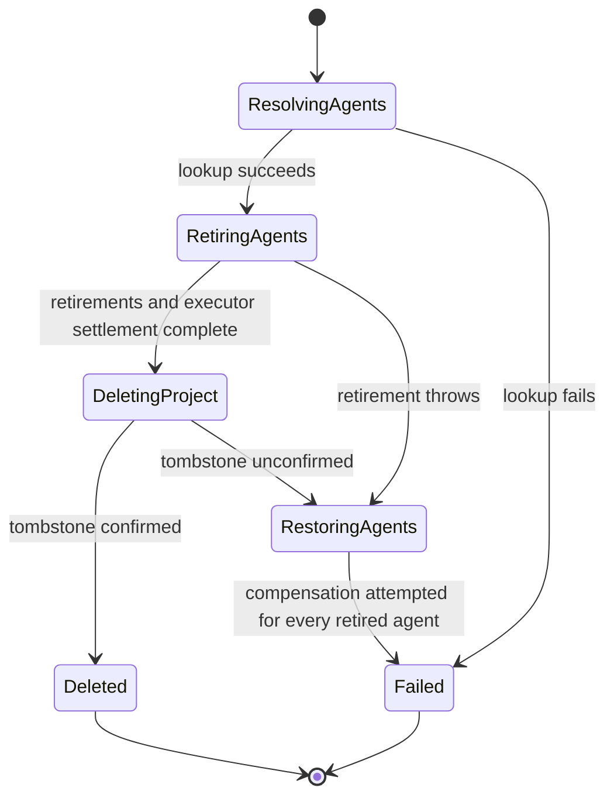
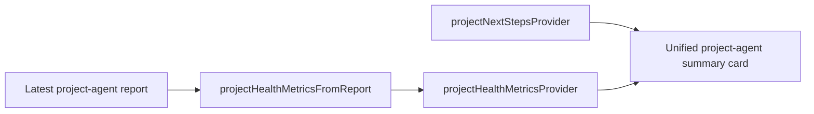
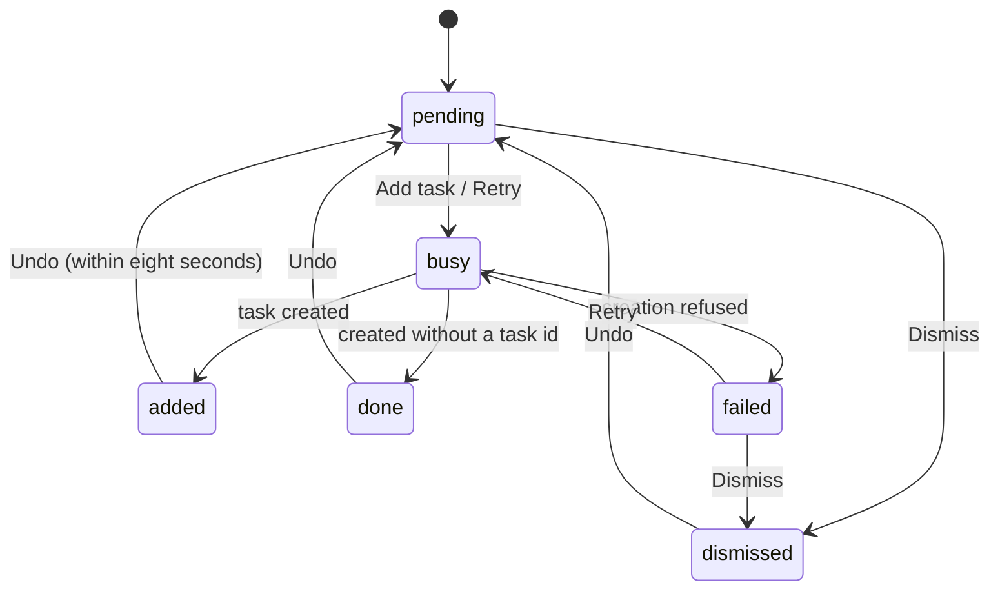
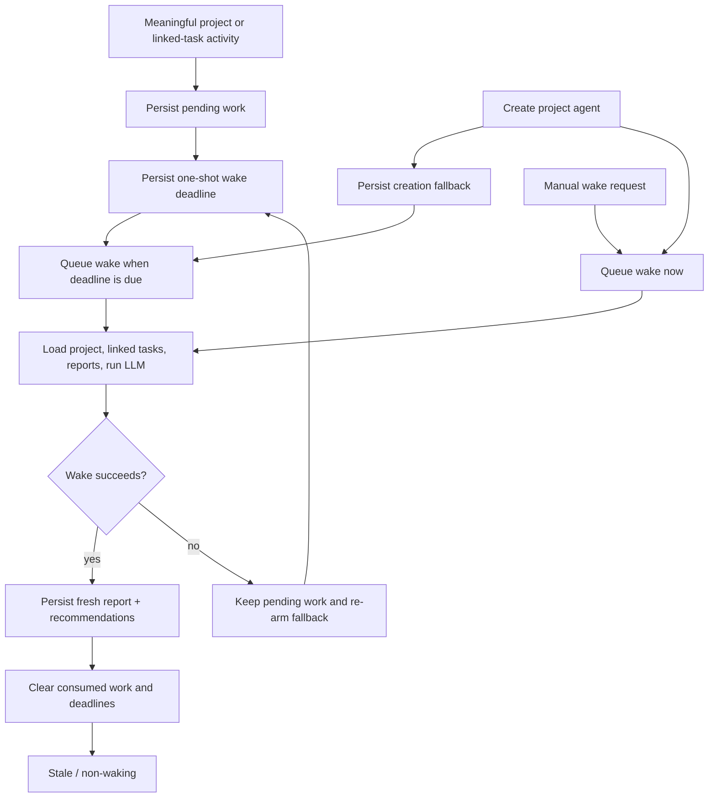

Projects group related tasks, power the projects tab, and integrate with the
agent system so a project accumulates health signals, recommendations and
update-driven reports instead of just acting as a nicer folder.

**The visible experience is gated by `enableProjectsFlag`.** With it off there is
no top-level tab, no category projects section and no task project chip. Routes
may still exist, but the normal ways in are hidden.

# The data model

A project is a `JournalEntity.project` variant. `ProjectData` carries `title`,
`status`, `statusHistory`, `targetDate`, `dateFrom` and `dateTo`, plus free-form
body text through `entryText`.

**`ProjectStatus` has six variants**: `open`, `active`, `monitoring`, `onHold`
(with a **required reason**), `completed`, `archived`.

`monitoring` marks a project that is not closed but has **no time actively
scheduled** — touched only when something comes up before it can be declared
done. Day planning tiers by status: `active` forms the scheduled pool;
`open`/`monitoring`/`onHold` stay available at lower priority so something
noticed along the way can still be planned; `completed`/`archived` are
unavailable.

## Membership is denormalized

Tasks link to projects through `EntryLink.project`, **and** the database keeps a
denormalized `project_id` on tasks.

That column is the read path for "project of a task":
`JournalDb.getProjectForTask` resolves through `journal.project_id` (indexed)
rather than joining `linked_entries` and sorting. **It is kept in lock-step with
the latest non-hidden `ProjectLink` on every link and entity write**, so the
result is identical to the old join without its
`USE TEMP B-TREE FOR ORDER BY` sort.

## Membership is scoped to category and privacy

`linkTaskToProject` re-reads both entities and refuses a link whose two sides
disagree on category or privacy. The fresh privacy check closes the async gap
between resolving a project for task creation and persisting its link: if sync
changes project privacy in between, the link is rejected and the creation path
soft-deletes the new task. Nullable privacy is normalized with `?? false`, so
legacy `null` and explicit `false` are both public and remain link-compatible.
`createTask` also rejects conflicting explicit-project and linked-entity privacy
before writing anything; it does not silently downgrade either context. If an
assignment race requires cleanup and that cleanup cannot be confirmed, creation
throws instead of claiming success. The Tasks tab catches that failure, shows a
localized error, and does not navigate to the failed task.
The task header filters its project picker to the same normalized privacy, so
it does not offer a choice the repository must reject. Project-agent
`create_task` calls pass the project's privacy into task creation before
linking. A category can still move after linking, and that
write is nowhere near the link, so the category rule has to be re-checked there
too.

**`EntryController.updateCategoryId` does that for the task side**: it drops the
project link of every task it moves when the new category is not the project's
own.

The comparison is against **the project's** category, not the task's previous
one — re-picking the category the task is already in leaves the two in
agreement, so there is nothing to drop. It stays a comparison when the category
is cleared: a project that carries a category is dropped, and an uncategorized
project is kept, since `null == null` is exactly the pairing
`linkTaskToProject` would still accept. Uncategorized projects are real —
`createProject` takes a nullable category, and `createTask(projectId:)` copies
the project's category onto the new task, `null` included.

The lookup deliberately does **not** go through `getProjectForTask`. That read
honors the private gate, so a private project resolves to null while private
entries are hidden; a cleanup reading that as "no link" would skip the stale row
and let it reappear the moment they are shown. `getLinkedProjectForTask`
resolves the live `ProjectLink` and its project entity directly, neither of
which is privacy-filtered.

A task whose category write did not land is not swept. A failed write means the
entity was not found — deleted since it was read, or never there — so it keeps
the category it had, and its project is still correct for it.

Privacy toggles follow the same invariant. After a task privacy write commits,
`EntryController.togglePrivate` requests a conditional repository unlink. Its
transaction rechecks the membership and both entries without the private gate;
a concurrent replacement link or newly matching privacy is preserved.
The cleanup does not run after a failed privacy write, so a task that stayed
public cannot lose a still-valid public-project membership.

The sweep covers the entries the same call re-categorized, not just the edited
one. `getLinkedEntities` is **not filtered by link type**, so the propagation
loop rewrites the category of linked *tasks* along with the timers and images it
is aimed at; each of those gives up a now-foreign project too. A `ProjectLink`
runs project → task, so a task's own project never appears in that list.

Only the task detail header changes a task's category
(`CategorySelectionIconButton` excludes tasks and events explicitly), so the
controller is the single funnel this rule has to sit in.

**Project category changes are guarded, not bulk migrations.**
Both editors save through `ProjectRepository.updateProject`, which rejects a
category change while any task remains linked or any live project agent exists.
Updates share the per-project mutation coordinator with agent provisioning, so
the cross-store guard cannot race a locally created agent.
The task guard uses unfiltered denormalized membership, including hidden private
tasks. Neither editor rewrites task categories, attachments, membership or
agent permissions as a side effect of changing the project category.

Synced category moves are reconciled through `ProjectActivityMonitor`.
`ProjectAgentService.updateProjectAgentScopes` shares the provisioning/deletion
coordinator, rechecks the current journal scope after waiting, and reads agent
identities and assigned templates inside its transaction. Only global or
matching-category templates retain their agents; missing, deleted, wrong-kind,
or incompatible templates cause retirement without granting the new scope.
Unchanged valid scopes produce no writes or notifications, and unrelated
identity preferences are preserved. Reconciliation
does not classify the remote edit as local activity or schedule a wake.

# Two hot reads are shaped for bursts

**`getProjectForTask` is microtask-coalesced.** `projectForTaskProvider` is an
autoDispose family, so a task list mounts one lookup per visible row. Instead of
N single-task queries, concurrent callers in the same microtask merge into **one
wave**:

**`watchProjectsOverview` debounces refetches.** `UpdateNotifications` already
coalesces sync bursts (~1 s) and local edits (100 ms); the repository adds a
300 ms debounce so remaining back-to-back batches collapse into a single rebuild.
The first fetch on subscribe stays immediate, and the in-flight
`fetching`/`pendingRefetch` guard is preserved.

# The overview is grouped DTOs

The tab is driven by `ProjectsOverviewSnapshot`, `ProjectCategoryGroup`,
`ProjectListItemData`, `ProjectTaskRollupData` and `ProjectsFilter` — **not raw
entities** — so the UI renders grouped rows without recomputing counts,
categories and rollups in each widget.
Project-agent one-liners are resolved in two bulk reads when the snapshot is
assembled, then stored on each `ProjectListItemData`. Rows therefore render a
stable subtitle without one provider/query chain per card, and local search
matches the same one-liner text that the list displays. Background enrichment
listens through `projectAgentOverviewUpdateStreamProvider`, which bulk-resolves
the affected agent IDs and emits only when at least one is a project agent;
unrelated task, event, day and improver writes therefore do not rebuild the
project query, task rollups, links and reports. Background enrichment
reloads preserve the last rendered snapshot, category-filter metadata, and
create affordance until the replacement is ready. If agent enrichment fails,
the replacement snapshot retains the last resolved one-liner for each surviving
project instead of dropping visible subtitles and their searchable text. If an
upstream repository refresh fails after data was rendered, the tab keeps that
previous list instead of replacing it with a full-page error.

The default `Current` scope keeps open, active, monitoring and on-hold work in
view; `All` restores completed and archived projects. Projects sort by
actionability, then target date and recent activity by default, with target
date, recent and name alternatives. Category sections are collapsible, and
completion uses the interactive accent rather than pretending low completion
is a health warning. Projects with no tasks say so instead of showing a red
zero-percent ring. First-run, current-empty and filtered-empty states each
explain the state and offer the relevant recovery action.

On desktop the overview and selected detail share the standard resizable
list/detail traversal. Once a project is selected, Hide list enters focus mode:
the list and divider go offstage without being disposed, and Show list remains
available over every detail state, including initial loading and errors. A
desktop project detail never renders the mobile Back affordance because the
split has no parent route to pop; Back remains on the standalone mobile detail
route. The primary search command restores a hidden list before focusing its
search field, so keyboard search never targets an offstage control. Toggling
focus mode changes only the restore-button overlay; the detail subtree stays
mounted under a stable parent. Tasks and Projects share the persisted collapse
preference and expanded list width. The focused header and body are centered on
the shared 960 pt detail
measure with its one standard horizontal gutter, keeping report lines and cards
readable when the list releases a wide canvas without double-insetting mobile
content.

Project detail actions preserve workspace continuity. Edit uses the
Projects-owned `/projects/<id>/edit` route on mobile and desktop, with an
explicit return path back to the selected project. The editor owns the complete
user-authored project record — title, description, category, status and target
date — while the detail surface keeps compact quick edits for category, status
and target date. Both paths write through the same detail controller, so draft
rebasing and save-failure behavior stay consistent. Add task creates a
project-linked task with the project's privacy, serializes concurrent taps and
project saves,
awaits the category's default task-agent assignment, then opens the task. If
that optional assignment fails after creation, the page reports the error but
still opens the already-linked task, preventing a retry from creating another
blank task. Back, system-back, task-row navigation and the overflow menu remain
locked until this mutation settles, so the page cannot be disposed between
creating the blank task and opening its editor. If
the explicit project link loses a race with sync or otherwise fails, creation
soft-deletes the new task before surfacing the error, preventing blank orphans.
The inline editor rebases only locally changed fields onto a concurrently synced
project; title and description controllers synchronize independently, so a
dirty description does not leave a clean, remotely updated title stale. The
description rebase carries only the local plain text onto the synced
`EntryText`, preserving newer markdown, rich-text and geolocation payloads. Save
locks Cancel, Back and system-back until persistence settles, preventing a
discarded route from racing the still-running write. The controller invalidates
pending edits when sync reports that the project was deleted. Description edits
replace only `EntryText.plainText`, preserving any markdown, rich-text and
geolocation payload attached to the project. The project
lookup is applied before task rollups are loaded, so a
slow or failed task query cannot delay tombstone handling. Overlapping reloads
are generation-guarded, so an older read that finishes after a newer deletion
cannot repopulate the editor and resurrect the tombstoned project on save.
Cancel and system-back exits discard the shared
editor draft before returning to the still-mounted desktop detail, so canceled
values cannot appear there or leak into a later inline save.

`ProjectLifecycleService` owns project deletion independently of the widget. It
resolves every live linked project agent, aborts their running wakes and retires
all of them, cancels queued/drain-owned jobs, and waits for their underlying
executors to settle before soft-deleting the project. An abort signal releases
the runner without cancelling its Dart future; the settlement barrier prevents
late tool/report writes from following the project tombstone. Immediately before that tombstone
write it re-reads the project inside the shared mutation coordinator, so the
vector clock cannot come from the stale entity captured before the confirmation
modal. Duplicate identities, runtime subscriptions and pending work cannot
outlive the project. A
retirement error aborts deletion instead of claiming success; when that error
followed a committed lifecycle write, the deletion path re-reads the agent and
restores its exact prior lifecycle before returning; dormant agents remain
dormant and do not regain subscriptions. After a failed or throwing project
write, the path verifies the tombstone before compensation. A committed
tombstone is treated as successful deletion; if deletion cannot be confirmed,
the reversible agent retirement is compensated so a live project cannot lose
its automation because the verification read also failed. Lifecycle compensation
attempts every retired identity even if one restore fails, then restores active
subscriptions. The detail keeps the last resolved identity during provider
reloads; route disposal cannot interrupt the service operation.

Task creation and deletion
each hold the shared detail mutation lock through completion, preventing
overlapping edits, task creation, or deletion.

# Health is agent-authored

The detail pages pull project entity data, linked tasks, the latest project-agent
report, parsed health metrics from it, scheduled wake state, active
recommendations, pending project change sets, derived presentation data, and
the wake controls. The read-first surface uses the same intelligence-card
chrome, identity route, report expansion, automation toggle, countdown,
run-now action and setup route as Task Details. Project health and durable
recommendation/change-set actions remain project-owned content inside that one
surface instead of becoming competing cards or duplicating the report in the
editor. The AI surface appears above the task list. `ProjectRecommendationsPanel`
renders two bands inside the card: the newest run's **recommended next steps**
(`ProjectNextStepRow`, one per step) and the agent's **proposed changes**
(`ProjectProposalRow`, reusing Task Details' `RowActions` rail). A step offers
**Add task** and **Dismiss** as labelled controls, and on touch the same two
by swipe — right adds, left dismisses, each named on the band the row reveals
(`DesignSystemSwipeActionBackground`), and the row snaps back rather than
leaving. A decided step keeps its place with an *Added* (its link focuses the
task in the list below), *Done* or *Dismissed* tag and an Undo — eight
seconds for an addition, as long as the run is current for a dismissal. A
failed creation keeps the row with Retry and the failure copy. Phones show
three rows before "Show N more"; more than one open step adds **Add all as
tasks** and **Dismiss all**.

Proposals go through `ProjectProposalService` (`projectProposalServiceProvider`,
kept alive for the session): `confirm` and `reject` delegate to the change
set confirmation service, and `confirm` remembers what the tool changed — the
task a `create_task` created, the status an `update_project_status` replaced.
A decided proposal keeps its *Confirmed* or *Dismissed* tag and, for the same
eight seconds, an Undo while `canUndo` holds (always for a rejection; for a
confirmation only while this session holds the memo). `undo` removes the
created task or restores the previous status and drops its history entry,
then calls `ChangeSetConfirmationService.reopenItem`, which records a
`deferred` decision and puts the item back to `pending`; a failed revert
leaves the item decided and the memo in place.

The band never invalidates the agent's update stream. The service notifies
after each write, `projectNextStepsProvider` re-reads, and the row changes
state where it stands; per-row busy and failure state plus an optimistic
overlay cover the gap until the snapshot catches up, so a row never flickers
through "pending". A proposal decision refreshes only
`projectPendingChangeSetsProvider`; the proposal band shows the live sets'
open items plus the rows decided in this session, never siblings decided in
an earlier one. The card keeps the bands mounted while the page mutates and
hands the panel `enabled: false` instead, so an in-flight decision keeps its
row state; a disabled rail is inert with disabled semantics, not a no-op.
While a bulk action runs every other row is disabled too, so a manual tap
cannot race the sweep. A creation the service reports as consumed
(`nonRetryable`: the task exists but linking and rollback both failed) keeps
the row with the service's message and no Retry. A refused Undo leaves the
row, its undo window and its task link exactly as they were.

A run whose every step was already decided when the page opened collapses to
`ProjectNextStepsSummary` — one line with the tally and when the agent last
looked, plus a history disclosure — while decisions made on the page stay
inline until the next visit. An empty run renders `ProjectNextStepsEmpty`
with the same "last looked" age. The pure pieces (outcome mapping, tally,
phone cap, age buckets) live in `project_next_steps_model.dart`. The
replacement, undo and migration lifecycle lives in
[project and event agents](agents/project-and-event-agents.md#tools-and-recommendations).

**There is no aggregator object** — each surface watches the providers it needs.

**If the latest report has no parseable health payload yet, the app shows a
neutral unassessed state** rather than falling back to invented local
heuristics. Once metrics exist, the detail leads with the agent-authored band,
rationale and optional confidence; it never converts a categorical assessment
into a fabricated numeric score. Task counts remain separate live rollups. Blocker navigation appears only when blocked tasks exist and opens
the first actionable blocker. A project with no agent gets distinct
provisioning guidance and an assignment action rather than an unavailable Run
report instruction.

The user-authored project description and the agent report are distinct fields
in the detail read model. A missing report renders the neutral report-empty
state; it never repeats the project description under an AI-authored heading
or presents the project's own modification time as report freshness.

# The task list groups and orders itself

`ProjectTasksSliverPanel` no longer renders one flat list. The pure model in
`ui/model/project_task_groups.dart` turns the record's task summaries into
`ProjectTaskGroup`s according to a `ProjectTaskListOptions` (grouping, sort
key, whether finished tasks stay in their groups):

| Group by | Order of groups | Header |
|---|---|---|
| creation month (default) | newest month first | month and year |
| status | actionability rank | the status label |
| priority | highest first | the priority label |
| due window | overdue, this week, later, no due date | the window |
| none | one header-less group | — |

With `keepDoneInGroups` off (the default) finished tasks — done or rejected,
the two terminal statuses — leave their groups for one trailing
`ProjectTaskDoneKey` group, which starts collapsed; with it on they sort among
their peers. Only the due-window grouping depends on the date, so the panel
keeps a timer for local midnight while that grouping is active and re-reads
the clock when it fires, rather than waiting for an unrelated rebuild to move
a task from "This week" to "Overdue". Within a group the sort key applies — actionability
(the same `compareTasksByActionability` the record provider uses for its
rollups), created, due date, estimate, priority, recently updated or title —
and every comparison breaks ties on title then id, so the result never depends
on input order. Empty groups are omitted. Which groups are folded is part of
the options too (`collapsedGroups`, keyed by the group's stable id, `done`
folded by default), so a fold is a change the host persists like any other.

The choice is remembered per project by `ProjectTaskListOptionsController`
(`projectTaskListOptionsProvider(projectId)`) under one `SettingsDb` key per
project, JSON-encoded and tolerant of unknown values; like the tasks-list
density preference it loads once, holds state in memory and never lets an
in-flight load clobber a fresh edit. Both database calls are fire-and-forget,
so a failing read or write is logged under `LogDomain.settings` and swallowed:
the read keeps the defaults, the write keeps the in-memory choice. The detail
page watches it and hands the panel the controller's `update` as its single
`onOptionsChanged`: every pick in the "Sort and group" control and every fold
flows through it. The panel decides how the control opens — on a screen at
`kDesktopBreakpoint` or wider as a `DesignSystemPopoverAnchor` beside the sort
button, otherwise as the shared single-page sheet
(`project_task_list_options_sheet.dart`); both host the same
`ProjectTaskListOptionsSheetContent`, whose rows apply on tap and leave the
surface open for the next pick. Read-only showcases pass no callback, show no
control, and keep folds in the panel's own state.

Group headers are `SliverPinnedHeader`s inside a `MultiSliver` with
`pushPinnedChildren` (the `sliver_tools` package): a group's header stays at
the top of the viewport while its rows scroll past and is pushed out by the
next group's header. The header paints the card surface opaquely so rows
scroll beneath it. `DecoratedSliver` and `SliverMainAxisGroup` around the
groups are unchanged, and folding a group only removes its list sliver, which
`MultiSliver` handles without the geometry assertion the plain pinned
persistent header used to trip.

A `ProjectTaskFocus` (task id, request number, `scroll`) asks the panel to
light one row up — the hover wash, held for `highlightDuration` — and, with
`scroll` on, to bring it into view. The detail content owns the current focus
and exposes `focusTask` to the agent band builder: the band's "Added → title"
link calls it with scroll, a fresh creation calls it without, so the new task
is marked where it is without pulling the page away from the band. Scrolling
first unfolds the task's group through `onOptionsChanged`, then, because the
list is lazy, jumps to the group's header (always built) and looks for the
row on the following frames, stepping one viewport further each time until it
exists or `maxScrollAttempts` run out; the row is then eased into view with
`Scrollable.ensureVisible`.

The header survives what used to break it: the title truncates before
anything overflows, and in its compact form — below 480 pt of header width (a
phone, or a desktop pane narrowed past what the full header needs) or at a
text scale of 1.2× and above — the total estimate is dropped in favour of the
per-group estimates and Add task turns into the glyph-only icon action.

# When the project agent actually wakes

Project agents are stale and non-waking by default. They have no recurring
daily schedule; meaningful project activity, agent-assigned work, or an
explicit request creates one-shot work instead.

The project detail read model exposes the active one-shot wake deadline beside
the agent report. Legacy recurring rows are retired by the agent subsystem and
do not become new daily wakes.

See [project and event agents](agents/project-and-event-agents.md) for the
workflow side.
