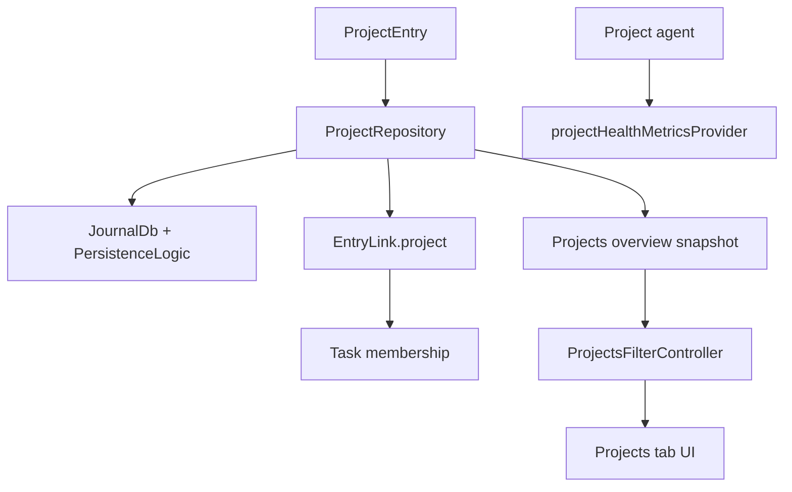
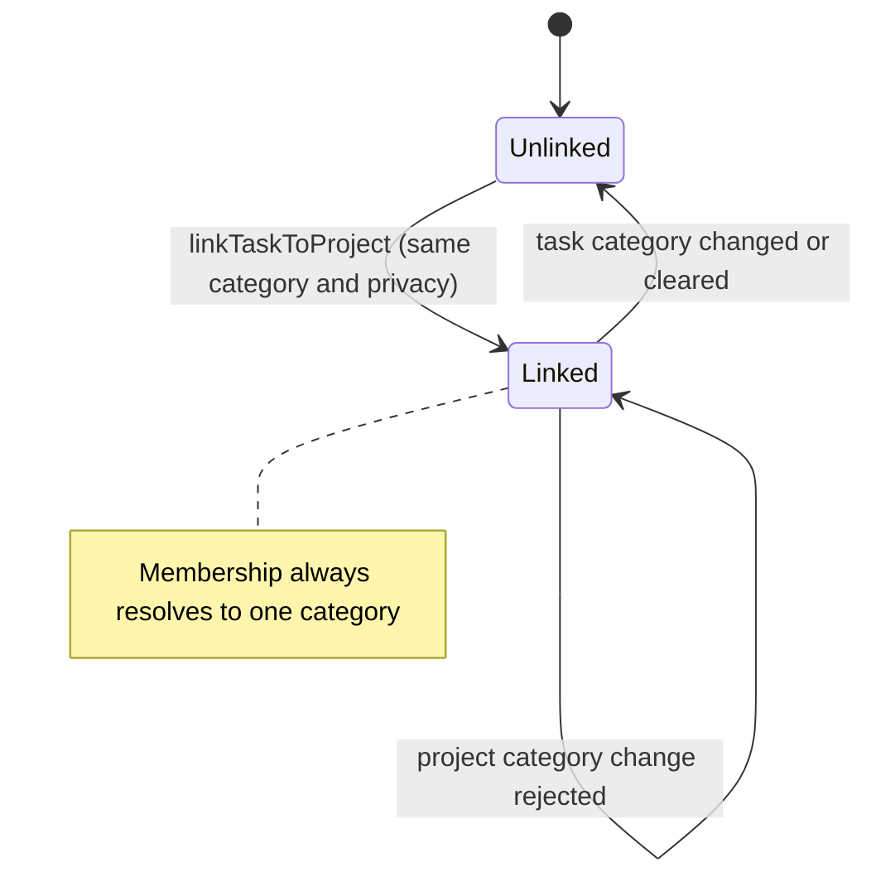
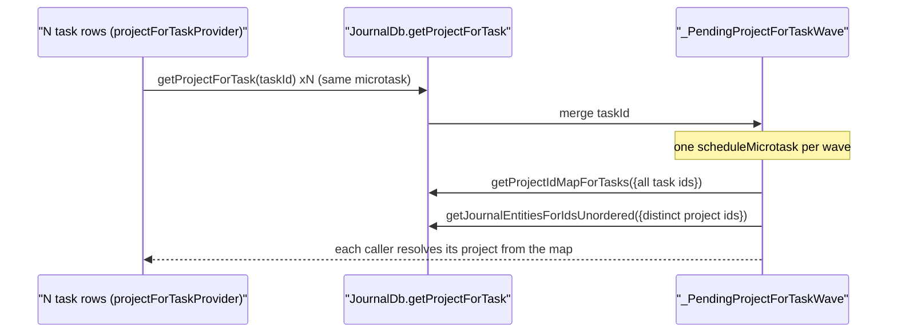
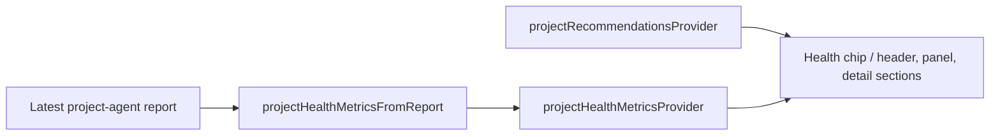
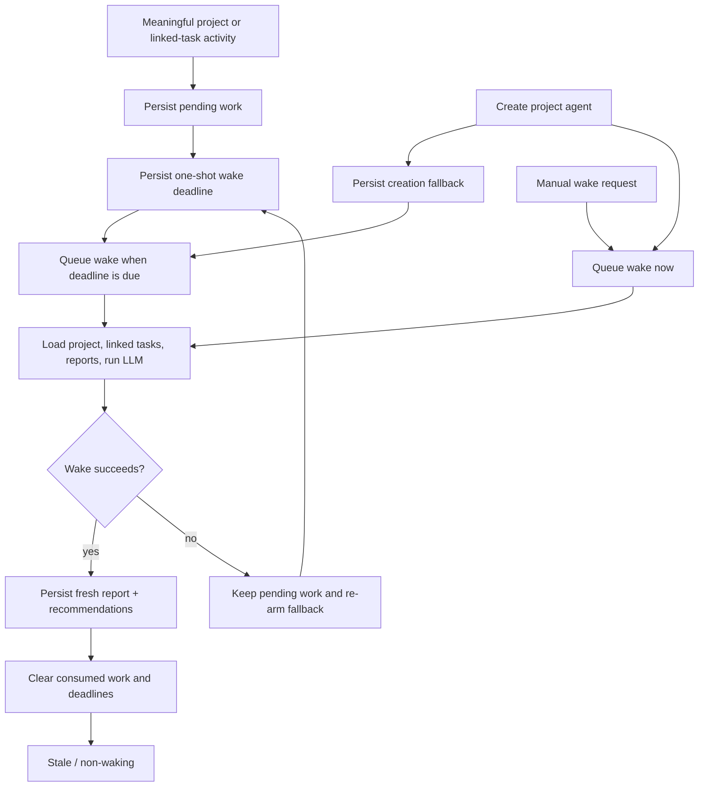

Projects group related tasks, power the projects tab, and integrate with the
agent system so a project accumulates health signals, recommendations and
update-driven reports instead of just acting as a nicer folder.

**The visible experience is gated by `enableProjectsFlag`.** With it off there is
no top-level tab, no category projects section and no task project chip. Routes
may still exist, but the normal ways in are hidden.

# The data model

A project is a `JournalEntity.project` variant. `ProjectData` carries `title`,
`status`, `statusHistory`, `targetDate`, `dateFrom` and `dateTo`, plus free-form
body text through `entryText` — which the detail page uses as fallback when no
project-agent TL;DR exists yet.

**`ProjectStatus` has six variants**: `open`, `active`, `monitoring`, `onHold`
(with a **required reason**), `completed`, `archived`.

`monitoring` marks a project that is not closed but has **no time actively
scheduled** — touched only when something comes up before it can be declared
done. Day planning tiers by status: `active` forms the scheduled pool;
`open`/`monitoring`/`onHold` stay available at lower priority so something
noticed along the way can still be planned; `completed`/`archived` are
unavailable.

## Membership is denormalized

Tasks link to projects through `EntryLink.project`, **and** the database keeps a
denormalized `project_id` on tasks.

That column is the read path for "project of a task":
`JournalDb.getProjectForTask` resolves through `journal.project_id` (indexed)
rather than joining `linked_entries` and sorting. **It is kept in lock-step with
the latest non-hidden `ProjectLink` on every link and entity write**, so the
result is identical to the old join without its
`USE TEMP B-TREE FOR ORDER BY` sort.

## Membership is scoped to category and privacy

`linkTaskToProject` re-reads both entities and refuses a link whose two sides
disagree on category or privacy. The fresh privacy check closes the async gap
between resolving a project for task creation and persisting its link: if sync
changes project privacy in between, the link is rejected and the creation path
soft-deletes the new task. Nullable privacy is normalized with `?? false`, so
legacy `null` and explicit `false` are both public and remain link-compatible.
`createTask` also rejects conflicting explicit-project and linked-entity privacy
before writing anything; it does not silently downgrade either context. If an
assignment race requires cleanup and that cleanup cannot be confirmed, creation
throws instead of claiming success. The Tasks tab catches that failure, shows a
localized error, and does not navigate to the failed task.
Project-agent
`create_task` calls pass the project's privacy into task creation before
linking. A category can still move after linking, and that
write is nowhere near the link, so the category rule has to be re-checked there
too.

**`EntryController.updateCategoryId` does that for the task side**: it drops the
project link of every task it moves when the new category is not the project's
own.

The comparison is against **the project's** category, not the task's previous
one — re-picking the category the task is already in leaves the two in
agreement, so there is nothing to drop. It stays a comparison when the category
is cleared: a project that carries a category is dropped, and an uncategorized
project is kept, since `null == null` is exactly the pairing
`linkTaskToProject` would still accept. Uncategorized projects are real —
`createProject` takes a nullable category, and `createTask(projectId:)` copies
the project's category onto the new task, `null` included.

The lookup deliberately does **not** go through `getProjectForTask`. That read
honors the private gate, so a private project resolves to null while private
entries are hidden; a cleanup reading that as "no link" would skip the stale row
and let it reappear the moment they are shown. `getLinkedProjectForTask`
resolves the live `ProjectLink` and its project entity directly, neither of
which is privacy-filtered.

A task whose category write did not land is not swept. A failed write means the
entity was not found — deleted since it was read, or never there — so it keeps
the category it had, and its project is still correct for it.

Privacy toggles follow the same invariant. After a task privacy write commits,
`EntryController.togglePrivate` requests a conditional repository unlink. Its
transaction rechecks the membership and both entries without the private gate;
a concurrent replacement link or newly matching privacy is preserved.
The cleanup does not run after a failed privacy write, so a task that stayed
public cannot lose a still-valid public-project membership.

The sweep covers the entries the same call re-categorized, not just the edited
one. `getLinkedEntities` is **not filtered by link type**, so the propagation
loop rewrites the category of linked *tasks* along with the timers and images it
is aimed at; each of those gives up a now-foreign project too. A `ProjectLink`
runs project → task, so a task's own project never appears in that list.

Only the task detail header changes a task's category
(`CategorySelectionIconButton` excludes tasks and events explicitly), so the
controller is the single funnel this rule has to sit in.

**Project category changes are guarded, not bulk migrations.**
Both editors save through `ProjectRepository.updateProject`, which rejects a
category change while any task remains linked or any live project agent exists.
Updates share the per-project mutation coordinator with agent provisioning, so
the cross-store guard cannot race a locally created agent.
The task guard uses unfiltered denormalized membership, including hidden private
tasks. Neither editor rewrites task categories, attachments, membership or
agent permissions as a side effect of changing the project category.

Synced category moves are reconciled through `ProjectActivityMonitor`.
`ProjectAgentService.updateProjectAgentScopes` shares the provisioning/deletion
coordinator, rechecks the current journal scope after waiting, and reads agent
identities and assigned templates inside its transaction. Only global or
matching-category templates retain their agents; missing, deleted, wrong-kind,
or incompatible templates cause retirement without granting the new scope.
Unchanged valid scopes produce no writes or notifications, and unrelated
identity preferences are preserved. Reconciliation
does not classify the remote edit as local activity or schedule a wake.

# Two hot reads are shaped for bursts

**`getProjectForTask` is microtask-coalesced.** `projectForTaskProvider` is an
autoDispose family, so a task list mounts one lookup per visible row. Instead of
N single-task queries, concurrent callers in the same microtask merge into **one
wave**:

**`watchProjectsOverview` debounces refetches.** `UpdateNotifications` already
coalesces sync bursts (~1 s) and local edits (100 ms); the repository adds a
300 ms debounce so remaining back-to-back batches collapse into a single rebuild.
The first fetch on subscribe stays immediate, and the in-flight
`fetching`/`pendingRefetch` guard is preserved.

# The overview is grouped DTOs

The tab is driven by `ProjectsOverviewSnapshot`, `ProjectCategoryGroup`,
`ProjectListItemData`, `ProjectTaskRollupData` and `ProjectsFilter` — **not raw
entities** — so the UI renders grouped rows without recomputing counts,
categories and rollups in each widget.

On desktop the overview and selected detail share the standard resizable
list/detail traversal. Once a project is selected, Hide list enters focus mode:
the list and divider go offstage without being disposed, and Show list remains
available over every detail state, including initial loading and errors. A
desktop project detail never renders the mobile Back affordance because the
split has no parent route to pop; Back remains on the standalone mobile detail
route. The primary search command restores a hidden list before focusing its
search field, so keyboard search never targets an offstage control. Toggling
focus mode changes only the restore-button overlay; the detail subtree stays
mounted under a stable parent. Tasks and Projects share the persisted collapse
preference and expanded list width. The focused header and body are centered on
the shared 960 pt detail
measure with its one standard horizontal gutter, keeping report lines and cards
readable when the list releases a wide canvas without double-insetting mobile
content.

# Editor persistence

`ProjectDetailController` retains the persisted baseline and local draft.
Reloads apply only locally changed fields to the latest project, preserving
unrelated synced fields and rich-text payloads when plain text changes.
A generation guard discards stale reload completions. A tombstone clears both
baseline and draft before loading tasks, so saving cannot resurrect a deleted
project. Repository writes verify ambiguous negative persistence results against
the committed row before reporting failure.

# Health is agent-authored

The detail pages pull project entity data, linked tasks, the latest project-agent
report, parsed health metrics from it, scheduled wake state, active
recommendations, derived presentation data, and the wake controls.

**There is no aggregator object** — each surface watches the providers it needs.

**If the latest report has no parseable health payload yet, the app shows no
health state** rather than falling back to invented local heuristics.

# When the project agent actually wakes

Project agents are stale and non-waking by default. They have no recurring
daily schedule; meaningful project activity, agent-assigned work, or an
explicit request creates one-shot work instead.

The project detail read model exposes the active one-shot wake deadline beside
the agent report. Legacy recurring rows are retired by the agent subsystem and
do not become new daily wakes.

See [project and event agents](agents/project-and-event-agents.md) for the
workflow side.
