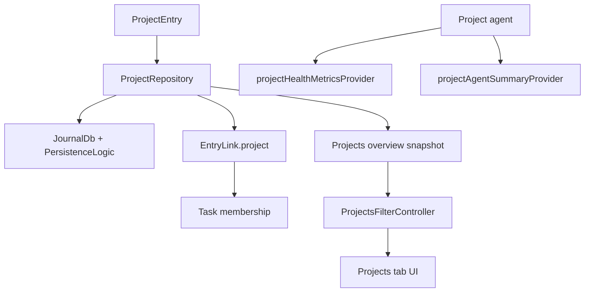
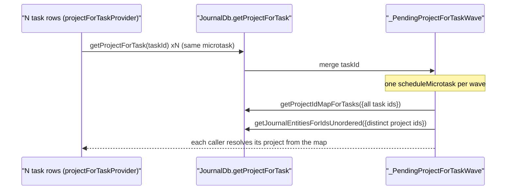
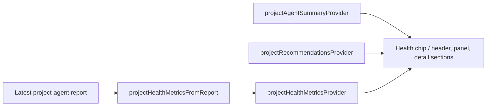
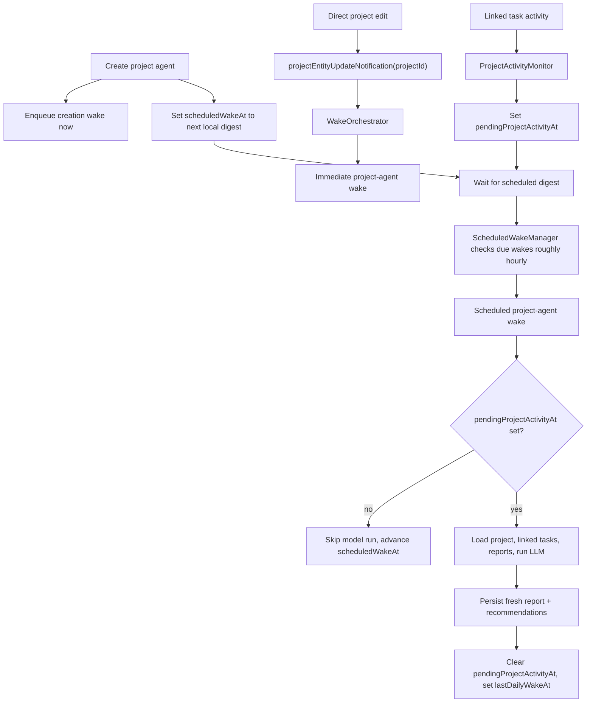

Projects group related tasks, power the projects tab, and integrate with the
agent system so a project accumulates health signals, recommendations and
scheduled digests instead of just acting as a nicer folder.

**The visible experience is gated by `enableProjectsFlag`.** With it off there is
no top-level tab, no category projects section and no task project chip. Routes
may still exist, but the normal ways in are hidden.

# The data model

A project is a `JournalEntity.project` variant. `ProjectData` carries `title`,
`status`, `statusHistory`, `targetDate`, `dateFrom` and `dateTo`, plus free-form
body text through `entryText` — which the detail page uses as fallback when no
project-agent TL;DR exists yet.

**`ProjectStatus` has six variants**: `open`, `active`, `monitoring`, `onHold`
(with a **required reason**), `completed`, `archived`.

`monitoring` marks a project that is not closed but has **no time actively
scheduled** — touched only when something comes up before it can be declared
done. Day planning tiers by status: `active` forms the scheduled pool;
`open`/`monitoring`/`onHold` stay available at lower priority so something
noticed along the way can still be planned; `completed`/`archived` are
unavailable.

## Membership is denormalized

Tasks link to projects through `EntryLink.project`, **and** the database keeps a
denormalized `project_id` on tasks.

That column is the read path for "project of a task":
`JournalDb.getProjectForTask` resolves through `journal.project_id` (indexed)
rather than joining `linked_entries` and sorting. **It is kept in lock-step with
the latest non-hidden `ProjectLink` on every link and entity write**, so the
result is identical to the old join without its
`USE TEMP B-TREE FOR ORDER BY` sort.

# Two hot reads are shaped for bursts

**`getProjectForTask` is microtask-coalesced.** `projectForTaskProvider` is an
autoDispose family, so a task list mounts one lookup per visible row. Instead of
N single-task queries, concurrent callers in the same microtask merge into **one
wave**:

**`watchProjectsOverview` debounces refetches.** `UpdateNotifications` already
coalesces sync bursts (~1 s) and local edits (100 ms); the repository adds a
300 ms debounce so remaining back-to-back batches collapse into a single rebuild.
The first fetch on subscribe stays immediate, and the in-flight
`fetching`/`pendingRefetch` guard is preserved.

# The overview is grouped DTOs

The tab is driven by `ProjectsOverviewSnapshot`, `ProjectCategoryGroup`,
`ProjectListItemData`, `ProjectTaskRollupData` and `ProjectsFilter` — **not raw
entities** — so the UI renders grouped rows without recomputing counts,
categories and rollups in each widget.

# Health is agent-authored

The detail pages pull project entity data, linked tasks, the latest project-agent
report, parsed health metrics from it, summary freshness and scheduled wake
state, active recommendations, derived presentation data, and the wake controls.

**There is no aggregator object** — each surface watches the providers it needs.

**If the latest report has no parseable health payload yet, the app shows no
health state** rather than falling back to invented local heuristics.

# When the project agent actually wakes

The project agent is deliberately **not** woken by every ripple in a linked task.

**The third path is the key design choice**: task churn marks the summary stale
*now*, and the digest decides *later* whether the model should spend tokens.

See [project and event agents](../agents/project-and-event-agents.md) for the
workflow side.
