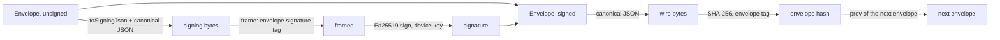

# What this is

Phase 1 of record provenance: the primitives every later phase builds on. It is
a pure library — nothing in the app calls it yet. The choices behind it are
[ADR 0088](../../docs/adr/0088-provenance-crypto-primitives.md); what the later
phases need from the rest of the codebase is the
[Phase 0 mapping](../../docs/implementation_plans/2026-09-25_record_provenance_phase0_mapping.md).

# One encoding per value

Signatures and hashes are over bytes, so a value that can be written two ways can
be signed one way and verified another. Two rules close that:

- **Canonical JSON is RFC 8785, restricted.** `canonicalJson` accepts `null`,
  booleans, integers within ±(2^53 − 1), strings, lists and string-keyed maps.
  Floats are rejected rather than formatted: envelopes carry none, and leaving
  them out is what makes the subset byte-identical to full JCS without
  reimplementing ECMAScript number formatting. Members sort by UTF-16 code units;
  lone surrogates are rejected.
- **Decoding is strict.** `parseCanonicalJson` re-encodes what it decoded and
  rejects the input unless the bytes match, so reordered members, whitespace, a
  needless escape or `1.0` for `1` all fail. The envelope adds its own spelling
  rules on top (below).

# Domain separation

Every hash and signature is over `tag ‖ 0x00 ‖ payload` (`domainFrame`), with one
tag per purpose:

| Domain | Tag | Over |
|---|---|---|
| `envelopeSignature` | `lotti/envelope-signature/v1` | the canonical envelope without its signature |
| `envelopeHash` | `lotti/envelope/v1` | the canonical envelope with its signature |
| `content` | `lotti/content/v1` | `salt ‖ plaintext` |
| `deviceId` | `lotti/device-id/v1` | the device's Ed25519 public key |

Signing and hashing an envelope use different tags, so a signature can never be
replayed as a hash or the other way round. The spec wrote the content commitment
as `tag ‖ salt ‖ plaintext`; the NUL separator is added so every domain frames
the same way.

# The envelope

`Envelope` holds the v1 fields: `version`, `kind`, `device_id`, `seq`, `prev`,
`causal_refs`, `vector_clock`, `author`, `claimed_time`, `content_commitment`,
`refs`, `signature`. Its structural rules are checked on construction and decode,
so a decoded envelope re-encodes to the same bytes:

- hashes, the device id and the signature are lower-case hex of fixed length;
- `seq` is non-negative, and `prev` is null exactly when `seq` is 0;
- `causal_refs` is sorted and unique — a set, written one way;
- `claimed_time` is UTC at millisecond precision, `YYYY-MM-DDTHH:MM:SS.mmmZ`;
- an author's optional `model` and `context_hash` are omitted, never `null`;
- unknown members are rejected, and every member is required.

**The device id is the fingerprint of the public key** (`deviceIdFor`), and
`signEnvelope` refuses an envelope whose device id is not the signer's.
`verifyEnvelopeSignature` checks both that the key is the one the device id names
and that the signature holds — spec invariant I1. Whether that device is
certified and unrevoked (I2), and whether `seq` and `prev` really continue the
chain (I3, I4), need state this library does not have; they belong to ingest.

`vector_clock` is carried as data. The Phase 0 mapping found the sync counter
cannot double as `seq`: it is shared by seven payload types and deliberately has
gaps, while a chain needs one gap-free counter per device.

**Decided for the chain phases: one chain per store.** Each device keeps a
separate chain, with its own `seq` and `prev`, for each store it signs (the
journal, entry links, and any other store brought under provenance), rather than
one chain across all of them. This answers decision D9 of the Phase 0 mapping.
The envelope format does not change for it; which store a chain belongs to is for
the chain phases to encode.

# Ed25519 and libsodium

`Ed25519` is the one interface callers depend on; `SodiumEd25519` implements it
over libsodium. The `sodium` package ships libsodium through a Dart build hook
that compiles the bundled source for the target platform, offline, so no system
library is needed — in the app or under `flutter test`. Secret keys stay inside
libsodium's protected memory (`Ed25519Signer`), never as plain bytes, and
`dispose` wipes them.

Measured on a desktop x86 CPU: libsodium signs an envelope in about 30 µs and
verifies in about 57 µs; the pure-Dart implementation it was measured against
took about 1.25 ms and 1.3 ms. Verification speed is what matters, because every
envelope a device receives is verified.

# How it is tested

Known-answer tests pin every primitive against values computed independently in
Python (`hashlib`, and the `cryptography` package for Ed25519): the RFC 8032
vectors, a domain hash per tag, a commitment, a device id, and a complete signed
envelope — its signing bytes, signature, wire bytes and hash. That makes the
tests an interoperability check for the standalone verifier the spec calls for,
not just self-consistency.

Glados properties cover member order never changing the bytes, any Unicode
string round-tripping, a flipped message bit breaking a signature, generated
envelopes round-tripping through their wire form, and the spec's §13.2
requirement: any single-byte mutation of a signed envelope either stops it
decoding or stops it verifying.

# Related

* [Sync](sync/) — the transport envelopes will travel over, and the vector clocks they carry.
* [Persistence](../architecture/persistence.md) — the journal row, the one stored copy of an entry.
