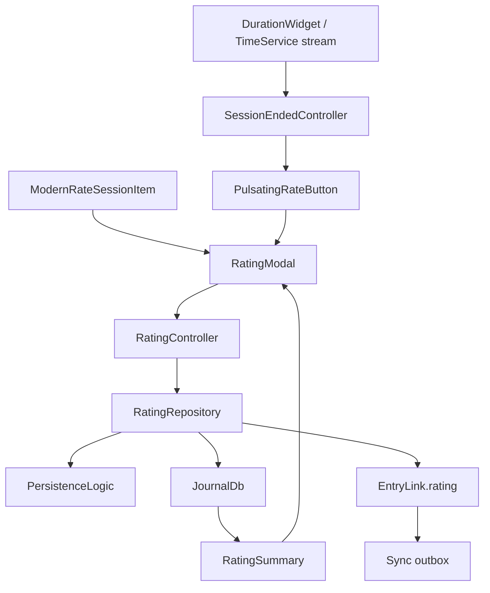

Ratings attach a structured judgment to another entry **without baking the
question set into the UI**. The shipped catalog is session-focused, but the model
is generic over `(targetId, catalogId)`.

Small, but it crosses more boundaries than it looks: the prompt comes from the
timer flow, the editor is catalog-driven, persistence is journal-backed, and
**rendering must still work when the local catalog is missing.**

# The model

**`RatingQuestion` is catalog schema, not stored data** — a stable `key`, a
localized `question`, an English `description` explaining the scale (intended for
downstream interpretation such as LLM use), an `inputType`, and normalized
options.

**`RatingData`** is the payload inside a `RatingEntry`: `targetId` (serialized
under the legacy wire key `timeEntryId`), the captured `dimensions`, `catalogId`,
`schemaVersion`, and an optional note.

**`(targetId, catalogId)` is the uniqueness boundary** — one target can hold
multiple ratings overall, but only one record per catalog.

## Snapshotting is the architectural decision

Each stored `RatingDimension` is deliberately **self-describing**: besides `key`
and `value` it may snapshot the `question`, `description`, `inputType`,
`optionLabels` and `optionValues`.

**That is what lets a synced rating stay readable** even if the catalog wording
changes, the catalog disappears locally, or a future client introduces catalogs an
older client does not know.

Without it, a rating synced from a newer device would render as bare numbers
against unknown keys.

# The catalog registry

`rating_catalogs.dart` maps `catalogId` values to **localized factory functions** —
so questions are generated in the active language rather than stored in one.

The registry currently holds a single catalog, `session`.
