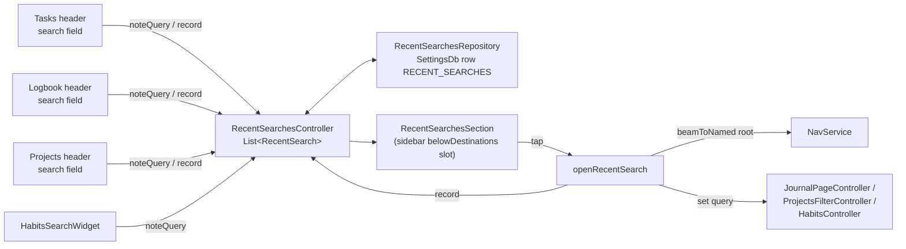
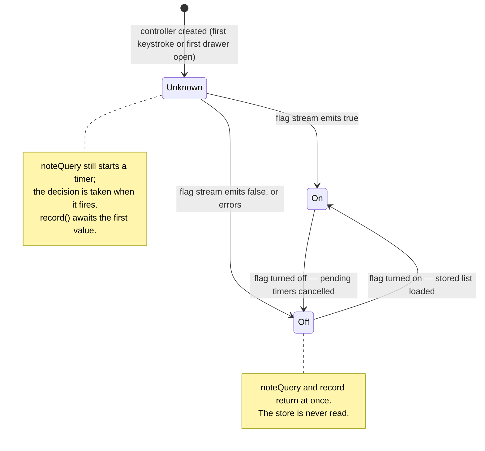
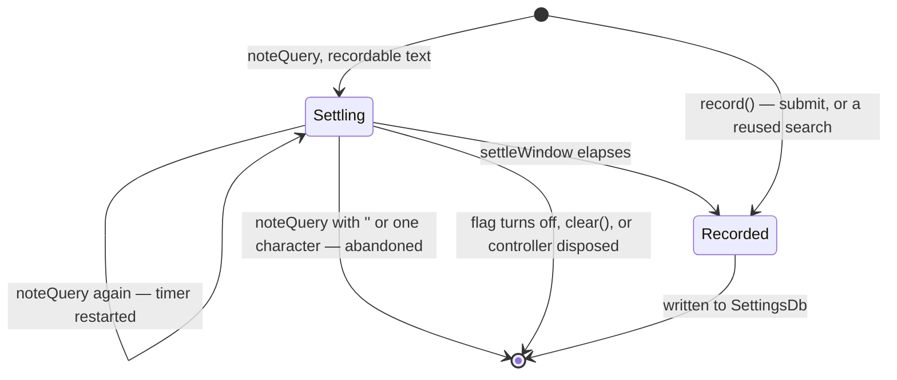

Recent searches is one Riverpod notifier, `RecentSearchesController`, holding a
newest-first `List<RecentSearch>`, where a `RecentSearch` is a
`RecentSearchSurface` plus the query as typed. Four search fields feed it, one
widget reads it, and one function turns a row back into a search.



The module is a leaf of the [mobile sidebar navigation](../architecture/navigation.md#the-mobile-sidebar-navigation):
the shell decides which surfaces are offered and hosts the section; nothing
here knows the sidebar exists beyond the flag it shares with it.

# What counts as one search

Every search field in the app filters **as the user types**. There is no submit
that marks a query as finished, so recording naively would store `p`, `pe`,
`pen`. Two layers turn keystrokes into searches.

**The controller waits for the text to rest.** `noteQuery(surface, query)` is
called on every change and restarts that surface's settle timer
(`settleWindow`, 2 s); only text still standing when it fires is recorded.
`record(surface, query)` skips the wait — it is the search glyph's submit, and
what a settled timer ends in.

**`recordRecentSearch` decides what the list looks like afterwards.** It is a
pure function over the list, property-tested, with three rules:

| Rule | Effect |
|------|--------|
| A repeat moves up | Any entry on the same surface with the same query, ignoring case, is dropped; the new casing wins |
| A continuation replaces its beginning | If the surface's **newest** entry is a case-insensitive prefix of the new query, it is dropped — the user paused mid-word and typed on |
| The list is capped | `maxRecentSearches` (12), oldest dropped |

Only the *newest* entry on the surface is a continuation candidate. An older,
shorter search on the same surface was a search of its own, and a repeat still
counts as that newest entry, so the rule cannot slide down onto an older
fragment behind it. The rule is one-directional: shortening `penguin` to `pen`
adds a row rather than replacing one.

Queries are normalized — trimmed, inner whitespace collapsed — and must be at
least `minRecentSearchLength` (2) characters. For anything unrecordable the
function returns the **identical** list, which is how the controller skips both
the state change and the write.

Recording on one surface never removes or reorders another surface's entries;
only the cap can trim the tail.

# The flag gate

The list has one reader, the sidebar's Recents section, and the sidebar is an
experiment behind `enable_mobile_sidebar_navigation`. Because every search
field in the app calls into this controller, **"off" has to mean no work at
all** — no timer, no write, not even the settings read — or the experiment
costs the users who never opted in.

The gate is a nullable bool fed by a `ref.listen` on `configFlagProvider`:



It is `listen`, not `watch`: a `watch` would re-run `build` on every flag
emission and reset the list to empty. The listener is also what keeps the
auto-disposing `configFlagProvider` alive, which is why `record` may safely
`await` its `.future` for a submit that arrives before the first value — without
a live subscription that read never resolves.

**Unknown is not Off.** The controller is created lazily by whichever caller
reaches it first, often the first keystroke of a session, when the flag has not
reported yet. Treating that as off would silently drop the first search after
every start. So a query noted while unknown is timed anyway, and the timer's
`record` decides with whatever is known two seconds later.

**The store is read once, and only when on.** `_ensureLoaded` memoizes a single
`load()`; the listener starts it when the flag turns on, and `record` and
`clear` await the same future. A record that beats the load therefore lands on
top of the stored history instead of being overwritten by it.

**A storage failure is reported, never thrown.** Every call reaches the
controller unawaited from a search field, so an escaping error would be one
uncaught error per settled search. Each failure goes to the `LoggingService`
under `RecentSearchesController` instead, and the controller degrades:

| Failure | What happens |
|---|---|
| Reading the stored list | Only a *successful* read is memoized. The failed one is dropped, and the next caller reads again, so one bad read does not end Recents for the session. A `record` made while the list cannot be read is dropped — writing it would replace a history that was never read. A `clear` goes ahead: there is nothing it could bring back. |
| Writing the list | The list in memory keeps what was recorded, and the next write carries it. |
| The flag's first value, awaited by an early `record` | Read as off, as the listener reads a failing flag: nothing is recorded. |

A failure that lands after the controller has been disposed is not reported:
its caller's work ended with the controller.

Turning the flag off does not delete what was recorded. It stays in the
settings row and returns with the flag; *Clear* is how a user removes it.

# A query's lifecycle



Surfaces time independently — one timer per `RecentSearchSurface` — so typing
in the Logbook does not reset a Tasks query that was about to settle.

**A cleared field needs no hook of its own.** `DesignSystemSearch` reports a
tap on its clear button as `onChanged('')` *before* `onClear`, so the
`onChanged` hook sees it and cancels the pending timer. The search surfaces
deliberately hook only `onChanged` and the submit callback.

# Running a search again

`openRecentSearch` does three things, in this order:

1. **Beams to the surface's tab root** (`RecentSearchSurfaceRoute.rootPath`),
   not merely to the tab. A tab parked on a detail page would otherwise come
   forward showing that page, with the search applied to a list the user
   cannot see.
2. **Records the reuse.** The query is about to be set through a controller,
   which never passes through the field's `onChanged`, so without this a reused
   search would not move back to the top.
3. **Hands the query to the controller that owns that list's search.** The
   fields mirror it back from state the way they mirror any external change.

Habits is the one surface with a precondition: its list filters only while
`HabitsState.showSearch` is true, so the opener toggles the search bar open
first. A query set behind a closed bar would change nothing on screen. Habits
also lower-cases its query; Recents keeps the casing as typed, and the
difference is Habits' controller's rule, not a bug in the round trip.

# Storage

One `SettingsDb` row, `RECENT_SEARCHES`:

```json
{ "v": 1, "items": [ { "s": "tasks", "q": "fish feeder" } ] }
```

`SettingsDb` is never synced, which is the point: a search history is about
what was looked for on *this* device. Surfaces are stored by
`RecentSearchSurface.wireName`, not by enum name, so a Dart rename cannot
orphan stored history.

**Writes are applied one at a time, in the order they were asked for.** The
controller chains every save behind the previous one rather than letting them
overlap. `SettingsDb.saveSettingsItem` returns without writing when its cache
already holds the value, so a *Clear* issued while a record's write was still
in flight — against a cache still holding the empty list — would return at
once, the record's write would land after it, and the search the user had just
cleared would be stored after all. A write queued before the notifier was
disposed still lands; a failed one is reported and does not hold up the next.

`decodeRecentSearches` never throws. A missing, corrupt or unknown-version row
is "nothing remembered"; a single malformed item, or one whose surface this
build does not know — written by a newer build — is skipped while the rest of
the list survives.

# Which searches are shown

The section filters the list through `recentSearchesOn` with the surfaces the
shell passes, and the shell derives those from the destinations **enabled right
now**. A search remembered on Projects while Projects is switched off is
therefore hidden rather than offered as a row that leads nowhere — and comes
back with the section, because hiding is a view, not a deletion.

The heading and its *Clear* follow what is **stored**, not what is listed. If
every remembered search belongs to a switched-off section there are no rows,
but the history still exists on the device, so the control that deletes it
stays on screen rather than waiting for the section to come back. Only with
nothing stored does the section render nothing at all, heading included.

# Gotchas

- **The flag provider is auto-disposing.** Read its `.future` only while
  something holds a subscription; the controller's own listener is that
  something. A bare `container.read(configFlagProvider(x).future)` elsewhere
  hangs.
- **Settings-tree searches are deliberately absent.** The Config Flags,
  Definitions and AI Settings fields filter a settings list, not the user's
  content, and a row for them would have nowhere meaningful to beam.
- **Tests that count timers must count their own.** Riverpod schedules
  zero-length housekeeping timers in the same zone, so the controller's tests
  filter `pendingTimers` by `settleWindow` rather than asserting on the bare
  count.

# Where to look

| Concern | File |
|---------|------|
| Model, surfaces, storage format | [`domain/recent_search.dart`](../../lib/features/recent_searches/domain/recent_search.dart) |
| What counts as one search | [`domain/recent_search_list.dart`](../../lib/features/recent_searches/domain/recent_search_list.dart) |
| Settings-backed store | [`state/recent_searches_repository.dart`](../../lib/features/recent_searches/state/recent_searches_repository.dart) |
| Flag gate, settle timers | [`state/recent_searches_controller.dart`](../../lib/features/recent_searches/state/recent_searches_controller.dart) |
| The Recents section | [`ui/recent_searches_section.dart`](../../lib/features/recent_searches/ui/recent_searches_section.dart) |
| Running a search again | [`ui/recent_search_opener.dart`](../../lib/features/recent_searches/ui/recent_search_opener.dart) |
