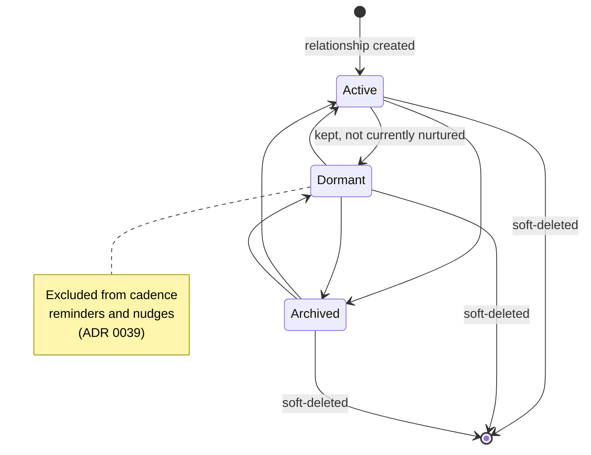
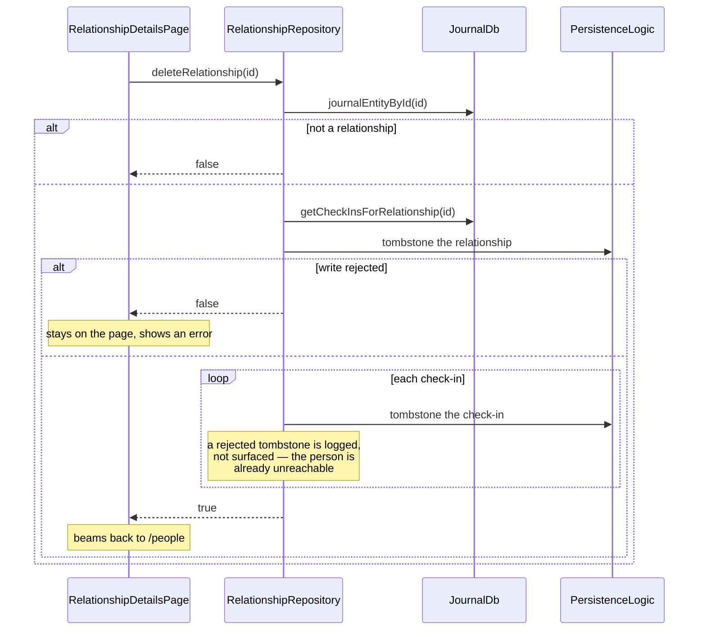
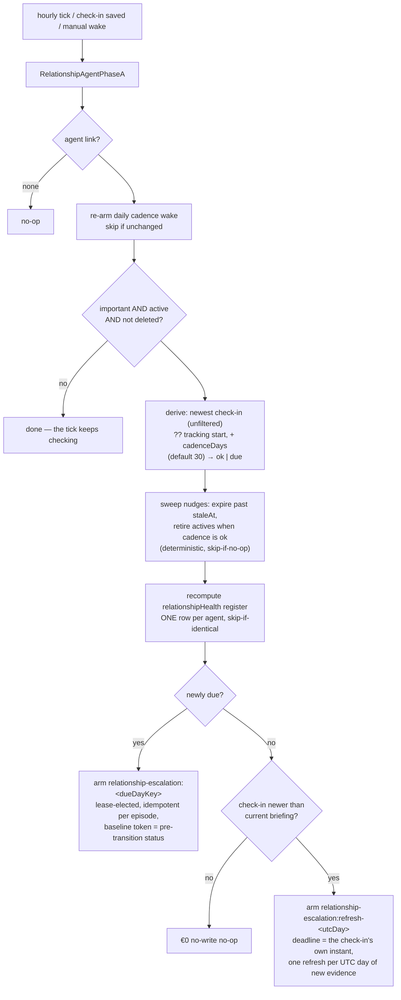
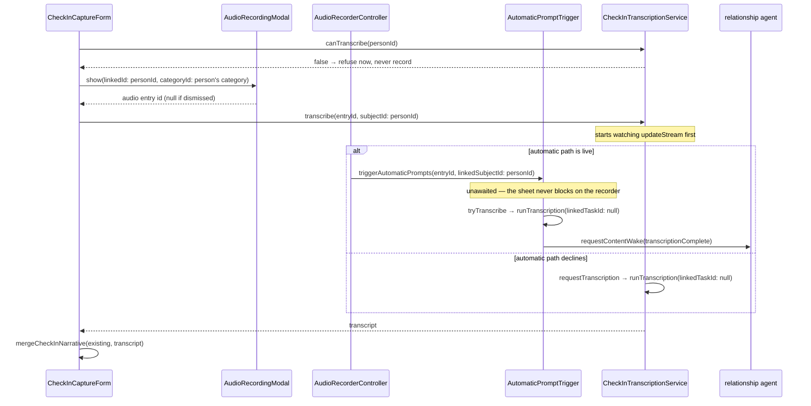

A person the user deliberately tracks is a `JournalEntity.relationship`; each
logged interaction with them is a `JournalEntity.checkIn`. Both ride the journal
table, so sync, categories, the `private` flag, export and purge apply with **no
new infrastructure and no schema change** (ADR 0038 decision 4).

**The visible experience is gated by `enableRelationshipsFlag`.** With it off,
`NavService` yields no People destination and the `/people` beamer delegate is
never mounted; the entities and their queries still exist, so a device that
syncs relationships in with the flag off stores them and shows nothing.

Relationships and check-ins are deliberately **absent from the journal
timeline**: `entryTypes` — the filter set the journal page queries with — lists
neither `Relationship` nor `CheckIn`. `JournalCard` still renders both, because
the card's `switch` over the sealed union is exhaustive and would not compile
otherwise; those branches are reachable only from linked-entry surfaces.
The exclusion extends to **global search, deliberately**: FTS title
extraction indexes neither variant, so a person's name is unfindable
outside the People tab — a privacy posture (ADR 0037: relationship data
describes third parties), not an oversight. The People list itself is short
by design and needs no local search.

# Bound twice, on purpose

A check-in is tied to its relationship through **two independent mechanisms**,
and neither is redundant:

| Binding | Written by | Read by |
|---------|-----------|---------|
| `RelationshipLink` row in `linked_entries` | `PersistenceLogic.createLink` | the generic linked-entries machinery, and future link-only consumers |
| `CheckInData.relationshipId`, denormalized into the journal `subtype` column by `toDbEntity` | `RelationshipRepository.createCheckIn` | every query this feature runs, and `affectedIds` |

The denormalized copy is what makes "check-ins for this person" an **indexed
`type` + `subtype` filter** instead of a link traversal — the
`HabitCompletionData.habitId` precedent. It is also what lets a check-in's
`affectedIds` emit the relationship id as a precise token, so the detail
provider reloads on a check-in write without subscribing to anything else.

The link row is the part that will matter later, and the part the delete cascade
deliberately leaves behind — see [what the cascade does not
reach](#what-the-cascade-does-not-reach).

**One `RelationshipLink` type serves two endpoint kinds.** The same type binds a
relationship to its check-ins *and* to its linked tasks, so a link row alone does
not say which it is. `RelationshipRepository.getLinkedTasks` therefore reads the
typed link rows, then resolves the task subset through
`JournalDb.getLiveTasksByIds`, which filters on the indexed journal `type`
column — a person's whole check-in history is never deserialized only to be
discarded. Scoping the read to `RelationshipLink` also keeps it in step with
`unlinkTask`, which removes exactly that type: a task surfaced through some
other link type would render an unlink action that could never succeed.

# Recency without an N+1

The People list sorts by "most recently interacted with", falling back to
`meta.dateFrom` (when tracking started) for a person with no check-in yet, so a
freshly added person lands at the top rather than the bottom.

Computing that naively is one query per person. Instead
`JournalDb.latestCheckInTimes` runs **a single `GROUP BY subtype` aggregate**
over `type = 'CheckIn'` rows, returning `relationshipId → MAX(dateFrom)` for the
whole table at once; `getRelationshipsByRecency` joins it in Dart. Both halves
route through `_queryWithPrivateFilter`, so a hidden check-in does not leak into
recency ordering.

# Status lifecycle

`RelationshipStatus` mirrors `ProjectStatus` in shape: a sealed union whose
variants each carry their own `id`, `createdAt` and `utcOffset`, with the
replaced instance appended to `statusHistory`. The form mints a new instance
**only when the kind actually changed**, so re-saving a person without touching
the status picker does not grow the history.

The picker offers all three kinds in every direction, so every transition above
is reachable; there is no ordering constraint in the model. `important` is a
**separate** switch — the single consent gate for proactive behaviour — and
`checkInCadenceDays` is only meaningful alongside it.

# Deleting a person

Deletion is a soft delete, like everywhere else in the journal, and it
**cascades to the person's check-ins** so no orphaned record of a third party
survives (ADR 0037 §5).

**The relationship is tombstoned first, deliberately.** An interruption
mid-cascade then reads as "gone" rather than "live with a partially deleted
timeline" — and because check-ins are resolved through `subtype` rather than
link traversal, once the relationship is gone no list or detail query reaches
them.

Every tombstone checks its result. `PersistenceLogic.updateDbEntity` answers
`false` when the vector-clock comparison loses to a concurrent sync and `null`
when it swallowed an exception, and neither may be reported to the caller as a
deletion — the page would navigate away from a person who is still there.

## What the cascade does not reach

- **The `RelationshipLink` rows.** The app's generic delete model leaves link
  rows to consumers, which already filter on the endpoint's `deletedAt`. A
  future link-only consumer would have to handle these tombstones itself.
- ~~Anything from later phases.~~ Since plan v2 phase 4 the cascade HAS an
  agent leg: the delete handler fires
  `RelationshipAgentService.handleRelationshipDeleted`, which destroys the
  agent identity through the shared `destroyAgent` lifecycle, cancels its
  pending and running wakes, and drops its subscriptions. The agent's own
  rows (registers, later reports and nudges) remain under the destroyed
  identity for audit, like every destroyed agent. The leg is fire-and-forget
  and contained — a failed teardown never fails the delete the user watched
  succeed, and runtime maintenance repairs the rest.

# Notifications: no private channel

Neither provider needs a feature-specific notification token. `affectedIds`
already carries **the entity's own id** plus a per-kind constant, and
`updateDbEntity` emits that set unconditionally:

| Write | Tokens emitted | Woken by |
|-------|----------------|----------|
| relationship create/edit/delete | `{relationshipId, RELATIONSHIP}` | list via `RELATIONSHIP`, detail via the id |
| check-in create/edit/delete | `{checkInId, relationshipId, CHECK_IN}` | list via `CHECK_IN`, detail via the relationship id |
| link/unlink task | `{relationshipId, taskId, LINK}` | detail via the relationship id |

That holds for synced writes too, which is the reason it is worth stating: a
manual notification emitted next to the repository call would be redundant on
the local device and absent on the remote one. `RelationshipDetailController`
additionally remembers the ids of the tasks its last build saw, so a title or
status edit **on the task side** refreshes the section without a relationship
write.

`unlinkTask` is the one place that notifies by hand, because
`JournalDb.deleteTypedLink` is a raw row delete with no entity write behind it.
It is not routed through `JournalRepository.removeTypedLink`, which notifies
unconditionally per call: the two-direction removal here would emit two
notifications even for a no-op unlink.

# The deterministic agent tier (plan v2 phase 4)

Marking a person `important` is the consent switch AND the creation trigger:
the form's save path lazily mints one durable `relationship_agent` per person
with a **deterministic id** (`relationship_agent:<relationshipId>`), so two
devices marking the same person converge on one agent instead of duplicates.
Identity, `agentRelationship` link and the first cadence wake land in one
transaction; the agent leaves creation subscribed and with one immediate €0
evaluation queued.

Three decisions keep multi-device runs convergent (ADR 0059 Decision 2):

- **The check-in read ignores the private-display filter**
  (`getAllCheckInsForRelationship`): hiding an entry is a display
  preference, and devices with different settings must derive the same
  register.
- **The register is recomputed wholesale, never accumulated**, carries the
  vector clock of the row it read, and is skipped entirely when identical —
  so the uneventful daily tick is a true no-write no-op.
- **Escalations are per-episode** (`relationship-escalation:<dueDayKey>`,
  lease-elected via the shared `requiresLease` predicate): devices arming
  the same lapse write identical records, a consumed episode is never
  re-armed, and a check-in landing mid-episode moves the due day into a NEW
  episode. The baseline trigger token preserves "newly due" vs. "still
  due" — unreconstructable from storage once Phase A's own register write
  lands in the same transaction.

The agent's subscription is a single token: check-ins carry a denormalized
`relationshipId` that `affectedIds` emits (the table above), so one
`matchEntityIds = {relationshipId}` covers the person and every check-in,
draining immediately because the tier is free.

Escalation arms on **two facts, not one**, and each fact has its own
episode family. The cadence newly lapsing arms
`relationship-escalation:<dueDayKey>` at the due day (already past). A
check-in landing after the current briefing (`reportStale`) arms
`relationship-escalation:refresh-<utcDay>` with the check-in's own instant
as the deadline — immediately due, so "log a call, get a fresh briefing"
does not wait out the next cadence lapse. The families are deliberately
separate: an early-fired refresh consuming the lapse episode's record would
let per-episode idempotence suppress the real lapse escalation. Refresh
episodes are keyed to the newest check-in's UTC day, debouncing to at most
one refresh inference per day of new evidence; when a tick sees both facts,
only the lapse episode arms — its run regenerates the briefing anyway.

# The LLM tier (plan v2 phase 5)

The wake router (`relationship_agent_providers.dart`) splits three ways: a
`relationship-chat-message:<id>` token runs
`RelationshipAgentWorkflow.executeUserMessage`, a fired escalation or
`relationship-report-refresh` token runs the full workflow, and everything
else stays in Phase A. The workflow is the goal Phase B shape with the goal
machinery it does not need (spec versions, revisions, proposal review)
removed:

- **€0 gates before inference.** A non-interactive run re-derives the armed
  fact and returns success without touching a provider when it no longer
  holds — the wake fired, the world moved on, nothing to say. A missing
  provider re-arms the escalation instead of consuming the episode.
- **`RelationshipFactsRenderer` is the whole ground truth.** Bounded (last
  10 check-ins, 400-char narrative excerpts) and — the ADR 0041 §5 boundary
  — its `render` signature has **no channel parameter**, so contact
  channels are structurally absent from model context, not filtered out.
- **Four tools, accumulated then persisted once.** `reply_to_user`,
  `update_relationship_report`, `create_relationship_ad`,
  `snooze_relationship_ad` accumulate in the strategy; `persistOutputs`
  writes one transaction, fenced on the person still existing and still
  important. The briefing lands as an `AgentReportEntity` whose provenance
  carries the health band + rationale + confidence
  (`RelationshipReportProvenanceKeys`, parsed fail-closed by
  `relationship_health_metrics.dart`).
- **At most one banner per wake, deterministically.** The ad id is
  `relationshipAdId(agentId, runKey)` (uuid v5), so a retried wake
  overwrites rather than duplicates; a dismissal today opens a quiet
  window the workflow refuses to post into, and a live banner is never
  doubled. Active banners surface through the kind-agnostic nudge channel
  (`activeRelationshipNudgesProvider`, registered at bootstrap) on all
  surfaces, tapping through to `/people/<id>` — the resolved ADR 0059 open
  question.
- **Chat turns are durable before the wake.** `RelationshipChatService`
  persists the user turn, then enqueues a manual wake whose trigger token
  carries the message id; a failed wake surfaces that id so retry
  re-enqueues the same turn instead of re-persisting it.
- **Disclosure fails closed.** The "Brief me" card resolves the agent's
  model to a provider name; a cloud provider is named in a consent dialog
  first (ADR 0037), and an unresolvable profile is treated as cloud.

# Voice check-ins (plan v2 phase 6)

The capture sheet's "Speak check-in" records through the shared recording
sheet and hands the transcript back to the user to edit. The hard part is not
the UI: it is that **automated transcription used to be task-shaped**.

`ProfileAutomationService.tryTranscribe` and `ProfileAutomationResolver` took
a `taskId`, resolved the agent through `TaskAgentService.getTaskAgentForTask`,
and read `profileId` only off `Task.data`. A recording linked to a person hit
every one of those and declined silently — no profile, no transcription, no
wake. Phase 6 replaces the task with a **subject**: any journal entity that
can own an agent, a profile and a category.

Three seams carry the generalization:

* `SubjectAgentResolver` (`agents/service/subject_agent_lookup.dart`) walks
  `subjectAgentLinkTypes` — task, project, event, relationship, in that order
  — and returns the agent behind the first link type present. A link that
  points at an unloadable agent yields `null` rather than falling through, so
  a broken link can never attach a foreign agent to an entity. `agentDay` is
  deliberately excluded: a day agent's subject is a date key, not something a
  recording hangs off.
* `subjectProfileIdOf` (`ai/state/profile_automation_providers.dart`) reads
  the profile a subject stores in its own payload, per variant —
  `Task.data.profileId`, `ProjectData.profileId`,
  `RelationshipData.profileId`. Everything else in the resolver was already
  kind-agnostic: the category lookup reads `meta.categoryId`, which every
  variant has.
* `AutomaticPromptTrigger` withholds `linkedTaskId` from non-task subjects.
  That parameter feeds both `buildTaskDetailsJson` *and* the consumption
  record's `taskId`, so passing a person's id there would file the spend
  against a task that does not exist. The trigger resolves the entity once and
  passes the id only when it really is a task.

**Who runs the transcription is the subtle part.** The recorder fires
`AutomaticPromptTrigger` on every stop, and that path is gated on
`ProfileAutomationService._categoryAllowsAutomation` — the category's
automatic-inference switch. That gate is documented as the consent for
spending tokens *without a user gesture*, and pressing "Speak check-in" is a
gesture. Leaning on it alone made the feature refuse for a reason unrelated to
the request: a person filed under **no category** can never pass it, whatever
models are configured, so their spoken check-in silently never ran.

`CheckInTranscriptionService` therefore owns the decision. It asks
`hasAutomatedSkillType` whether the automatic path will run; if it will, it
stands aside and only waits, and if it will not, it calls
`ProfileAutomationService.requestTranscription` — the same resolution minus
the consent gate — and runs the skill itself. Exactly one run happens either
way, so a spoken check-in is never billed twice. `canTranscribe` is the
render-time counterpart: it answers "could *either* path produce words", and
the sheet refuses **before** recording when neither can, rather than capturing
audio for a transcript that can never arrive.

The sheet and the run are **not** connected by a return value, so the service
bridges the gap by subscribing to `UpdateNotifications.updateStream` *before*
its first read (a transcript landing between the two is not missed) and
re-reading the audio entry on every notification carrying its id. An empty
`entryText` reads as "not yet", because the audio entry's own creation
notification arrives long before any run finishes. The wait ends three ways:
the transcript arrives; the run resolves no model or throws, which cancels the
wait immediately rather than stranding the user on a spinner; or
`checkInTranscriptTimeout` (5 minutes) expires. `CheckInTranscriptWait.cancel`
is the fourth exit, called from the sheet's `dispose` so a dismissed sheet
stops re-reading the database.

Two invariants hold regardless of what comes back:

* **Nothing auto-saves.** The transcript populates the text field;
  the check-in exists only once the user presses save. This is the same rule
  that keeps `CheckInSentiment` user-set (ADR 0038).
* **Speaking never destroys typing.** `mergeCheckInNarrative` appends below
  existing text, blank-line separated, so a second recording adds to the
  account rather than replacing it.

Name accuracy comes from the **category's `speechDictionary`**, not from
anything relationship-specific: the recording is created with the person's
`categoryId`, and `PromptBuilderHelper.getSpeechDictionaryTerms` reads the
audio entry's own category, sending those terms as provider context bias and
injecting them into the transcription prompt.

# Privacy

Relationship data is the most sensitive class the app holds, because it
describes **third parties who never consented to being in it** (ADR 0037). It
stays on-device and syncs only through the user's own end-to-end encrypted
Matrix rooms.

`ContactChannel` values and `contactRefs` are **excluded from AI context**
(ADR 0041 §5) — they are plain snapshot data, entered manually on every platform
or copied from an OS contact, and no inference path reads them. `CheckInSentiment`
is likewise **user-set and never AI-filled** (ADR 0038); the executive briefing
grounds its health band in those explicit values first and treats prose as
secondary evidence.

# Related

* [JournalEntity](../domain/journal-entity.md) - the union both variants join, and the `subtype` denormalization pattern.
* [Entry links](../domain/entry-links.md) - the `RelationshipLink` variant and why one type can span two endpoint kinds.
* [Projects](projects.md) - the feature this one mirrors in status shape, flag gating and tab structure.
* [Persistence](../architecture/persistence.md) - how `updateDbEntity` writes, notifies and enqueues sync.
