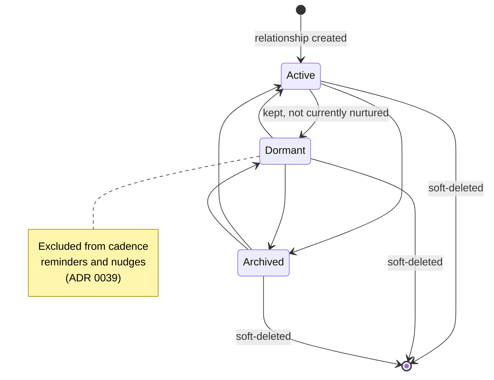
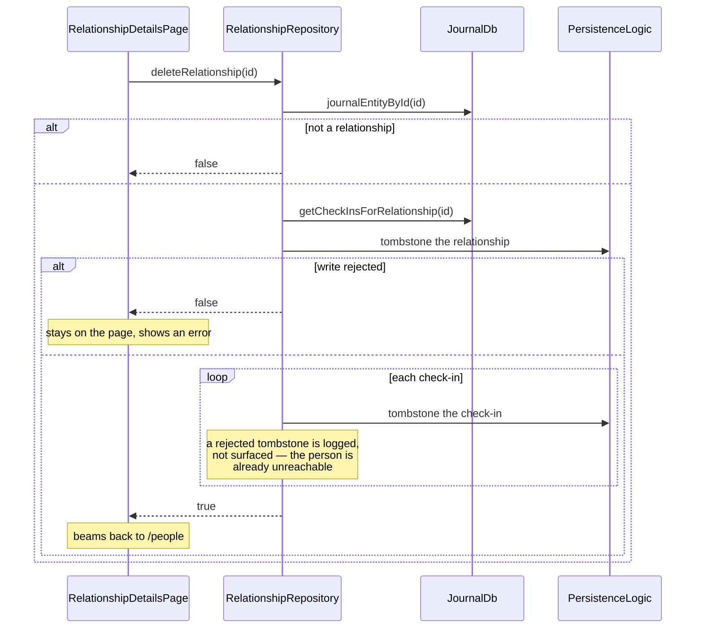

A person the user deliberately tracks is a `JournalEntity.relationship`; each
logged interaction with them is a `JournalEntity.checkIn`. Both ride the journal
table, so sync, categories, the `private` flag, export and purge apply with **no
new infrastructure and no schema change** (ADR 0038 decision 4).

**The visible experience is gated by `enableRelationshipsFlag`.** With it off,
`NavService` yields no People destination and the `/people` beamer delegate is
never mounted; the entities and their queries still exist, so a device that
syncs relationships in with the flag off stores them and shows nothing.

Relationships and check-ins are deliberately **absent from the journal
timeline**: `entryTypes` — the filter set the journal page queries with — lists
neither `Relationship` nor `CheckIn`. `JournalCard` still renders both, because
the card's `switch` over the sealed union is exhaustive and would not compile
otherwise; those branches are reachable only from linked-entry surfaces.

# Bound twice, on purpose

A check-in is tied to its relationship through **two independent mechanisms**,
and neither is redundant:

| Binding | Written by | Read by |
|---------|-----------|---------|
| `RelationshipLink` row in `linked_entries` | `PersistenceLogic.createLink` | the generic linked-entries machinery, and future link-only consumers |
| `CheckInData.relationshipId`, denormalized into the journal `subtype` column by `toDbEntity` | `RelationshipRepository.createCheckIn` | every query this feature runs, and `affectedIds` |

The denormalized copy is what makes "check-ins for this person" an **indexed
`type` + `subtype` filter** instead of a link traversal — the
`HabitCompletionData.habitId` precedent. It is also what lets a check-in's
`affectedIds` emit the relationship id as a precise token, so the detail
provider reloads on a check-in write without subscribing to anything else.

The link row is the part that will matter later, and the part the delete cascade
deliberately leaves behind — see [what the cascade does not
reach](#what-the-cascade-does-not-reach).

**One `RelationshipLink` type serves two endpoint kinds.** The same type binds a
relationship to its check-ins *and* to its linked tasks, so a link row alone does
not say which it is. `RelationshipRepository.getLinkedTasks` therefore reads the
typed link rows, then resolves the task subset through
`JournalDb.getLiveTasksByIds`, which filters on the indexed journal `type`
column — a person's whole check-in history is never deserialized only to be
discarded. Scoping the read to `RelationshipLink` also keeps it in step with
`unlinkTask`, which removes exactly that type: a task surfaced through some
other link type would render an unlink action that could never succeed.

# Recency without an N+1

The People list sorts by "most recently interacted with", falling back to
`meta.dateFrom` (when tracking started) for a person with no check-in yet, so a
freshly added person lands at the top rather than the bottom.

Computing that naively is one query per person. Instead
`JournalDb.latestCheckInTimes` runs **a single `GROUP BY subtype` aggregate**
over `type = 'CheckIn'` rows, returning `relationshipId → MAX(dateFrom)` for the
whole table at once; `getRelationshipsByRecency` joins it in Dart. Both halves
route through `_queryWithPrivateFilter`, so a hidden check-in does not leak into
recency ordering.

# Status lifecycle

`RelationshipStatus` mirrors `ProjectStatus` in shape: a sealed union whose
variants each carry their own `id`, `createdAt` and `utcOffset`, with the
replaced instance appended to `statusHistory`. The form mints a new instance
**only when the kind actually changed**, so re-saving a person without touching
the status picker does not grow the history.

The picker offers all three kinds in every direction, so every transition above
is reachable; there is no ordering constraint in the model. `important` is a
**separate** switch — the single consent gate for proactive behaviour — and
`checkInCadenceDays` is only meaningful alongside it.

# Deleting a person

Deletion is a soft delete, like everywhere else in the journal, and it
**cascades to the person's check-ins** so no orphaned record of a third party
survives (ADR 0037 §5).

**The relationship is tombstoned first, deliberately.** An interruption
mid-cascade then reads as "gone" rather than "live with a partially deleted
timeline" — and because check-ins are resolved through `subtype` rather than
link traversal, once the relationship is gone no list or detail query reaches
them.

Every tombstone checks its result. `PersistenceLogic.updateDbEntity` answers
`false` when the vector-clock comparison loses to a concurrent sync and `null`
when it swallowed an exception, and neither may be reported to the caller as a
deletion — the page would navigate away from a person who is still there.

## What the cascade does not reach

- **The `RelationshipLink` rows.** The app's generic delete model leaves link
  rows to consumers, which already filter on the endpoint's `deletedAt`. A
  future link-only consumer would have to handle these tombstones itself.
- **Anything from later phases.** When the relationship agent lands (plan v2
  phases 4–5) the cascade must grow to cover the agent identity, its reports and
  nudges, and any pending reminder rows.

# Notifications: no private channel

Neither provider needs a feature-specific notification token. `affectedIds`
already carries **the entity's own id** plus a per-kind constant, and
`updateDbEntity` emits that set unconditionally:

| Write | Tokens emitted | Woken by |
|-------|----------------|----------|
| relationship create/edit/delete | `{relationshipId, RELATIONSHIP}` | list via `RELATIONSHIP`, detail via the id |
| check-in create/edit/delete | `{checkInId, relationshipId, CHECK_IN}` | list via `CHECK_IN`, detail via the relationship id |
| link/unlink task | `{relationshipId, taskId, LINK}` | detail via the relationship id |

That holds for synced writes too, which is the reason it is worth stating: a
manual notification emitted next to the repository call would be redundant on
the local device and absent on the remote one. `RelationshipDetailController`
additionally remembers the ids of the tasks its last build saw, so a title or
status edit **on the task side** refreshes the section without a relationship
write.

`unlinkTask` is the one place that notifies by hand, because
`JournalDb.deleteTypedLink` is a raw row delete with no entity write behind it.
It is not routed through `JournalRepository.removeTypedLink`, which notifies
unconditionally per call: the two-direction removal here would emit two
notifications even for a no-op unlink.

# Privacy

Relationship data is the most sensitive class the app holds, because it
describes **third parties who never consented to being in it** (ADR 0037). It
stays on-device and syncs only through the user's own end-to-end encrypted
Matrix rooms.

`ContactChannel` values and `contactRefs` are **excluded from AI context**
(ADR 0041 §5) — they are plain snapshot data, entered manually on every platform
or copied from an OS contact, and no inference path reads them. `CheckInSentiment`
is likewise **user-set and never AI-filled** (ADR 0038); the executive briefing
grounds its health band in those explicit values first and treats prose as
secondary evidence.

# Related

* [JournalEntity](../domain/journal-entity.md) - the union both variants join, and the `subtype` denormalization pattern.
* [Entry links](../domain/entry-links.md) - the `RelationshipLink` variant and why one type can span two endpoint kinds.
* [Projects](projects.md) - the feature this one mirrors in status shape, flag gating and tab structure.
* [Persistence](../architecture/persistence.md) - how `updateDbEntity` writes, notifies and enqueues sync.
