A person the user deliberately tracks is a `JournalEntity.relationship`; each
logged interaction with them is a `JournalEntity.checkIn`. Both ride the journal
table, so sync, categories, the `private` flag, export and purge apply with **no
new infrastructure and no schema change** (ADR 0038 decision 4).

**The visible experience is gated by `enableRelationshipsFlag`.** With it off,
`NavService` yields no People destination and the `/people` beamer delegate is
never mounted; the entities and their queries still exist, so a device that
syncs relationships in with the flag off stores them and shows nothing.

**Check-ins are in the Logbook; people are not** (ADR 0064, amending
ADR 0038 Decision 2). `entryTypes` lists `CheckIn`, gated on `enableRelationshipsFlag`
like events and habits (`computeAllowedEntryTypes`), so it is a filter chip
of its own and the feed shows a check-in at its time. `JournalCard` names
the row for its person — "Check-in with {name}", read through
`relationshipNameProvider`, falling back to "Check-in" while the name loads
or for a person hidden as private, and re-read on the person's own and the
private-toggle notifications — puts the note it was logged with below,
and opens `/people/<relationshipId>/check-ins/<checkInId>` with the
opens-elsewhere glyph, as an event row does. `Relationship` is not in
`entryTypes`; its card branch exists only because the switch over the
sealed union is exhaustive. A Logbook selection saved before `CheckIn`
existed gains it once (see [browse and linking](journal/browse-and-linking.md)).
**Search never returns them**: a Logbook text search drops `CheckIn` from
the queried types (`JournalQueryRunner.runQuery`), and check-ins are not
embedded, so neither a person's name nor a check-in's note is findable
outside the People tab — a privacy posture (ADR 0037: relationship data
describes third parties), not an oversight. The People list itself is short
by design and needs no local search.

# Bound twice, on purpose

A check-in is tied to its relationship through **two independent mechanisms**,
and neither is redundant:

| Binding | Written by | Read by |
|---------|-----------|---------|
| `RelationshipLink` row in `linked_entries` | `PersistenceLogic.createLink` | the generic linked-entries machinery, and future link-only consumers |
| `CheckInData.relationshipId`, denormalized into the journal `subtype` column by `toDbEntity` | `RelationshipRepository.createCheckIn` | every query this feature runs, and `affectedIds` |

The denormalized copy is what makes "check-ins for this person" an **indexed
`type` + `subtype` filter** instead of a link traversal — the
`HabitCompletionData.habitId` precedent. It is also what lets a check-in's
`affectedIds` emit the relationship id as a precise token, so the detail
provider reloads on a check-in write without subscribing to anything else.

The link row is the part that will matter later, and the part the delete cascade
deliberately leaves behind — see [what the cascade does not
reach](#what-the-cascade-does-not-reach).

**One `RelationshipLink` type serves two endpoint kinds.** The same type binds a
relationship to its check-ins *and* to its linked tasks, so a link row alone does
not say which it is. `RelationshipRepository.getLinkedTasks` therefore reads the
typed link rows, then resolves the task subset through
`JournalDb.getLiveTasksByIds`, which filters on the indexed journal `type`
column — a person's whole check-in history is never deserialized only to be
discarded. Scoping the read to `RelationshipLink` also keeps it in step with
`unlinkTask`, which removes exactly that type: a task surfaced through some
other link type would render an unlink action that could never succeed.

# What a check-in holds

A check-in is a container (ADR 0062). Its comments, recordings and photos
are entries of their own — `JournalEntry`, `JournalAudio`, `JournalImage`
(`isCheckInEntryKind`) — each linked check-in → entry with a `BasicLink` and
inheriting the check-in's category and privacy. The text a check-in was
saved with before it held entries stays in its `entryText` and is shown, and
given to the agent, as its first entry: the migration happens at read time,
nothing is rewritten.

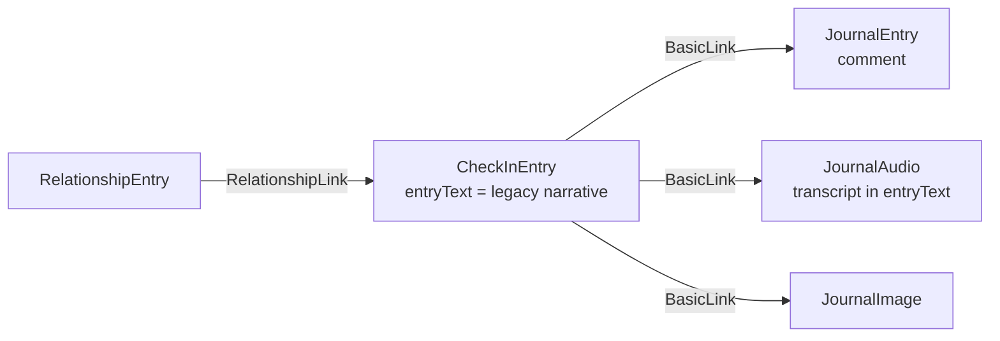

| Read | Filter | Used by |
|---|---|---|
| `getAllEntriesForCheckIns(ids)` | none — private entries included | the agent's FACTS, Phase A, the delete cascade |
| `getCheckInEntries(id)` | the private-entry display preference | the UI |

Both return entries in the order they were added — by the link's creation,
not the entry's own date, so a photo taken last week and attached today is
today's addition — and leave out deleted entries, hidden links and anything
linked from a check-in that is not a comment, recording or photo. Every write that changes what a check-in holds saves the check-in
again (`touchCheckIn`), because its `updatedAt` is the agent's "evidence
changed" signal — see the deterministic tier below. A rejected touch (a
synced edit of the same check-in landed in between) is read and saved once
more, and a second rejection is logged. Deleting a check-in, or its person,
tombstones the entries the check-ins alone hold; one that also belongs to
something still live is left alone, while a link from something already
deleted — another check-in removed earlier — no longer keeps it. The person counts as one of the owners: a
dictation is recorded against the person before its check-in exists, so its
recording carries a link from the person as well.

## Opening a check-in

A check-in row opens the check-in itself, not its edit sheet, laid out like
a task's detail page (design panel 2026-09-19).
[`CheckInDetailView`](../../lib/features/relationships/ui/widgets/check_in_detail_view.dart)
centres its content at `kDetailContentMaxWidth`, the task page's reading
width, and reads top to bottom:

* **The header** names the check-in (*Check-in with Commander Pip
  Frostbeak*) and carries type · start · length · feeling as the composer's
  own chip row (`CheckInContextChips`, with its optional feeling chip), each
  chip editing only its field in place through the composer's pickers
  (`showCheckInTypePicker`, `pickCheckInStart`, `showCheckInDurationPicker`,
  `showCheckInSentimentPicker`) and saving the check-in at once. The topics
  follow as tag pills. Everything no chip carries — topics, the notes for
  next time, the logged note — stays in the composer, behind *More → Edit
  check-in*.
* **Next time** on a card of its own.
* **The timeline**: the text the check-in was logged with as its first card,
  in the entry cards' shell and stamped at the check-in's start, then its
  entries through the journal's own `LinkedEntriesWidget`. The Timer / Audio
  / Images filters appear only from the fifth entry
  (`CheckInDetailView.filtersFrom`, via `showActivityFilters`): a short
  timeline has nothing to filter, and without the bar the list applies no
  filter at all, so one set earlier cannot strand cards out of reach.
* **A floating glass action bar** (`DesignSystemGlassStrip` with the shared
  glass pill and round buttons) adds to the timeline: *Dictate* as the
  primary pill — a recording made with the check-in as its `linkedId`, the
  bar becoming the recorder meanwhile — then *Comment*, which starts an
  empty comment card the way a task's text entry starts
  (`startCommentOnCheckIn`) and brings it into view with its editor focused
  — one left blank is removed when the view closes
  (`discardCommentIfBlank`), and never counted as a comment — and *Photo*
  through `importImagesForPlatform`. The bar wraps rather than overflows at
  large text on a narrow phone.

Each change to what the check-in holds touches it, so the briefing catches
up: a recording at once; a comment once it has words (an empty one is no
evidence); photos only when the picker actually added one, since a cancelled
picker changed no evidence. On phones the route hides the bottom navigation
(`peopleRouteHidesBottomNav`), as the chat does, so the bar is not covered.
The row in the log says what the check-in holds on its meta line
(`checkInHoldsLabelOf`: *1 recording · 1 comment*), fed by `RelationshipDetail.checkInEntries`, the
display-filtered `getEntriesForCheckIns`.

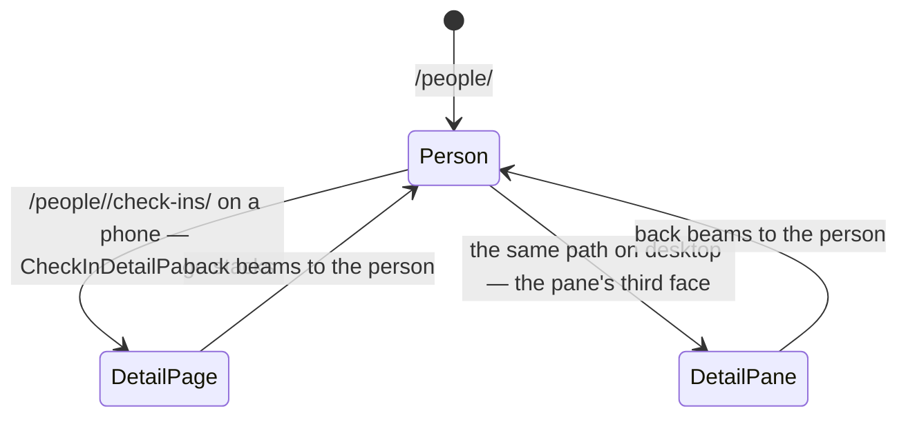

`RelationshipsLocation` writes `NavService.desktopRelationshipCheckInId`
from the `/check-ins/<id>` segment, exactly as it writes the chat flag, so
the pane shows the person, the chat or one check-in and never disagrees with
the address bar. A check-in deleted while open says so (*This check-in no
longer exists*) instead of rendering empty, and a detail that fails to load
says *Error* rather than spinning.

# A person's two images

`RelationshipData` carries an **avatar** (`avatarImageId` + `avatarCrop`) and a
**banner** (`bannerImageId` + `bannerCropX`). Both ids point at ordinary
`JournalImage` entries.

**The avatar renders.** `PersonaAvatar` has four faces, decided by
`avatarImageId` and what its file is doing: no photo (the tinted initial,
pixel-for-pixel what shipped before); the photo inside a ring of the persona
accent; the ThumbHash stand-in inside the ring while the file is still
syncing; and the initial inside the ring when the id is known but nothing can
be drawn yet. Nothing ever shows an empty circle, and the accent is the same
hash as before, so a photo never changes anyone's colour. Every surface that
draws a person — the People row, the person hero, the import review — goes
through this one widget, so all three got the photograph at once. The ring is
`spacing.step1` at every size: the design's 3 px at 80 would have needed a
token spacing does not have.

The photograph decodes at the slot's size times its *stored* zoom, rounded up
to a point: the zoom magnifies whatever was decoded, so a decode capped to the
circle itself would draw a zoomed face as a blur of its own pixels — but a
bound fixed at the deepest zoom would make every row at the default zoom hold
sixteen times the pixels it shows. The key changes only when a crop is
re-saved. The crop surface is the one exception (`AvatarCropPicture.decodeZoom`):
its zoom moves live under a pinch, so it bounds at `maxAvatarCropScale` from
the start and never re-decodes mid-gesture.

**Choosing the avatar.** Tapping the hero avatar (only while the band is
open — a folded hero's faded avatar takes no taps) opens the avatar sheet:
the privacy line, *Choose from library*, and once there is a photo *Adjust
crop* and *Remove photo*. A row pops the sheet with the flow it stands for
and `showPersonAvatarSheet` runs that flow over the page once the sheet is
gone, so the picker and the crop surface never stack on the sheet and it
never reappears under them as they close. The flows live in
`PersonPhotoActions`, whose only dependencies are the two repositories and
the two surfaces it opens, handed in as functions — so pick → crop → write,
and backing out at either step, is a plain unit test. Three rules are
load-bearing:

- **Cancelling writes nothing, even after the picker ran.** The picker has to
  import the picture before the crop surface can show it, so an entry already
  exists when the user sees *Use photo*; cancelling there deletes that entry
  again — but only when the import *created* it. A gallery asset's entry id
  is deterministic (`JournalRepository.createImageEntryTracked`), so picking a
  photo imported before lands on the row that already exists, which is the
  journal's and stays. The same discard follows a write that is refused or
  throws. `PersonPhotoActions.chooseAvatar` and `chooseBanner` own this, over
  the `ImportedImage` the picker returns.
- **The crop surface commits nothing.** `showAvatarCropSheet` resolves to the
  framing or null; the caller writes. Its preview *is* a `PersonaAvatar`, so
  the preview and the list cannot disagree, and its gesture arithmetic is
  `CoverCropGeometry` — the renderer's model written out — whose "the circle
  is never empty" invariant is a property test. The picture's size, which a
  drag moves against, comes from the file's header (`FileImageSize` over
  `readImageFileSize`), never from decoding the photograph; and the wheel
  registers with the pointer-signal resolver, so a notch over the picture
  zooms it without also scrolling the sheet. The viewport's scale recognizer
  claims touch and trackpad gestures on pointer-down so the surrounding sheet
  cannot win a vertical drag before the photo starts panning. One-finger and
  trackpad translation use the existing clamped crop geometry.
- **Removing clears the reference and keeps the entry**, the task cover-art
  precedent (`setCoverArt(null)`): taking a picture off a person is not
  deleting it from the journal.

**The banner renders.** With `bannerImageId` set, the photograph is the
whole hero above the avatar's midline — the toolbar and the band — and there
is no wash at all: the avatar sits across the picture's lower edge, its lower
half over the page. `PersonHeroAppBar` resolves the
banner *above* its sliver through `JournalImageResolver` (a component in a
sliver slot returns the sliver), so the file's arrival rebuilds the hero; the
ThumbHash stand-in shows under the same scrim meanwhile, and an id with
nothing to show is the wash exactly as without a banner. Three things are
fixed on purpose:

- **The chrome goes photo-neutral** (`PhotoNeutralGlass`, hand-authored in
  `photo_chrome_tokens.dart`): the theme's ink is near-black in the light
  theme and would vanish on a picture, so every glass action, the back
  button and the kebab take black-at-45 % glass and a white glyph whenever a
  banner is drawn — in both themes.
- **The scrim's extent is pixels, not a fraction of the current strip.**
  `PhotoScrim` darkens the top 70 % of the strip *at rest*; folding, the
  strip shrinks with the band down to the toolbar — and the scrim, fixed,
  still covers the toolbar row, which is what keeps the swapped-in name and
  the actions legible over an arbitrary picture at every scroll position.
- **The decode is bounded to the strip at rest**, so scrolling never re-keys
  the picture through the image cache.

**Choosing the banner — and the face again — is the form's Photo card**
(`PersonPhotoCard`, edit only). Face: the avatar at the import review's size
with Change · Adjust crop · Remove. Banner: a strip the hero's own height,
dragged left or right by `CoverCropGeometry` over the strip's viewport — the
arithmetic the hero renders with — with the write made once, when the finger
lifts. While the clipboard holds an image the banner row also offers *Paste*
(`PersonPhotoActions.pasteBanner`): the same write as choosing one, with the
clipboard's picture imported in place of the picker's, and the same discard
when the write is refused. Its actions are the same `PersonPhotoActions` the sheet uses, built by
`productionPersonPhotoActions` for both, and they write **immediately**, not on
Save: a picture exists the moment the picker returns, so commit-on-Save would
mean tracking orphans to delete on Cancel, and every profile editor treats a
photo change as its own act. The form therefore carries a refreshable
`_person`, re-read after every card write, and builds Save from *that* — a
Save built from the entry the form opened with would write the old photo back
over the new one, and a test pins that it does not.

The field they replaced, `coverArtId`, was declared with the rest of the model
and never written by anything, so it was **removed rather than migrated** — no
payload on any device carries the key, and a field whose name says "cover art"
would have lied about a person's portrait.

Three properties are load-bearing and easy to break:

- **The image must be *linked* to the person.** `JournalRepository`'s image
  delete finds referencing entities with `getLinkedToEntities(imageId)`, so an
  avatar created without `linkedId` set to the relationship would survive its
  own image's deletion as a dangling id. The link is also what makes the image
  inherit a private person's `private` flag through `createDbEntity`.
- **Framing is clamped on both sides.** `AvatarCrop.fromJson` and
  `cropFractionFromJson` clamp what sync delivers; `RelationshipImageFraming`
  clamps what this device writes, applied by `RelationshipRepository`'s create
  and update paths. Neither side alone is enough: a peer can send anything, and
  a local gesture can compute anything.
- **The bytes arrive after the entity.** An id syncs in one message and its file
  in another, so every surface that draws one of these needs a defined
  appearance for "id known, file not here yet". `JournalImageResolver` owns
  that loop — resolve the entry, watch the filesystem, hand the host the file
  or the ThumbHash or nothing — for every picture-of-an-entry surface:
  `PersonaAvatar`, the hero banner, the task cover thumbnail and background,
  and — through its file half, `JournalImageFileResolver`, because the list
  hands it the entry — the journal card image.

Neither image ever enters agent context, for the same reason contact channels
do not — see [Privacy](#privacy).

# Recency without an N+1

The People list sorts by "most recently interacted with", falling back to
`meta.dateFrom` (when tracking started) for a person with no check-in yet, so a
freshly added person lands at the top rather than the bottom.

Computing that naively is one query per person. Instead
`JournalDb.latestCheckInTimes` runs **a single `GROUP BY subtype` aggregate**
over `type = 'CheckIn'` rows, returning `relationshipId → MAX(dateFrom)` for the
whole table at once. The list also needs *what* the last contact was, so
`latestCheckIns` resolves that aggregate to its rows in **one further query** —
the ids and the instants as `IN` lists, the exact `(subtype, dateFrom)` pair
kept on the raw row before deserialising — and `getRelationshipsByRecency`
joins the result in Dart as `RelationshipListItem.lastCheckIn`. Every half
routes through `_queryWithPrivateFilter`, so a hidden check-in does not leak
into recency ordering or into the status line.

# The People list and the desktop split

The list (design 2026-09-06 §2–3) is three bands in display order — **Due**
(enrolled, cadence lapsed), **On track** (enrolled, not lapsed), **Not
enrolled** (not important, or dormant/archived) — **each ordered by what
that band is about**: Due by the longest lapse, On track by the nearest
deadline, Not enrolled by recency (`_orderWithin`, detailed below), under a
summary card that counts the due against the enrolled, names
who lapses next and on which day, and counts the not-enrolled. *Enrolled*
means `important` **and** active: the consent switch alone does not enrol a
dormant person (ADR 0039).

All of that is pure logic in
[`ui/model/people_list_model.dart`](../../lib/features/relationships/ui/model/people_list_model.dart)
— bands, the truthful pill (`{n} days over` when lapsed, `Due {weekday}`
within seven days, `On track`, `Not enrolled`, `Dormant`, `Archived`), the
summary — covered by Glados properties (partition, per-band order,
order-invariance, band⇔pill agreement, summary⇔bands agreement). The widgets
(`PeopleListRow`, `PeopleSummaryCard`) only render what the model says; the
row's status line composes the interaction label, the timestamp and the
cadence label, and never "Tracking since …".

**The row draws a pill only when it says something the band heading has
not.** `peopleCadencePillRestatesBand` suppresses the `onTrack` and
`notEnrolled` faces, because each occurs in exactly one band and repeats its
heading word for word; `overdue`, `dueSoon`, `dormant` and `archived` carry a
time or a status no heading does, so they stay. The reclaimed width goes to
the name, which wraps to two lines rather than truncating — the one string on
the row a reader cannot reconstruct from anything else on it. The enrolment
sparkle rides *inside* the name as a `WidgetSpan`, so a wrapped name does not
strand it in the gap between the name and the pill. The overdue pill carries
a leading `LottiIcons.warning` in `alert.warning.ink`: on the dark ground its
tint alone read as an inert brown beside the neutral chip, and the glyph is
the same one the briefing card's out-of-date line uses, so "needs attention"
is drawn one way across the feature.

**Each band orders by what that band is about** (`_orderWithin`): *Due* by
the longest lapse, *On track* by the nearest deadline, *Not enrolled* by
recency, with ties broken on recency and then id so the order is total and
rows cannot swap between rebuilds. Ordering everything by recency made the
list argue with its own summary card — the card named who lapses next and
the band under it led with someone whose deadline was later. A Glados
property pins the card and the band to the same date.

The summary also carries `mostOverdue`, kept separate from `nextDue`: the
card says *Next due {name}*, and a card that says *next due* while pointing
at someone already overdue is lying in order to be useful. Two facts, two
doors — the count opens the longest lapse, the sentence opens the person it
names, and a half with nobody behind it draws no chevron and takes no tap.

**The enrolment axis is named in plain words, not in its own noun.**
`important` is the stored boolean and `isEnrolled` the runtime predicate,
but no user-facing string says either: the bands, the pills, the summary and
the control all speak of **reminders on** / **no reminders**. It went
through an "enrolled" register first, which was at least consistent — the
state, the marker and the verb finally agreed — but consistent jargon is
still jargon to a second-language reader, and every non-English catalog had
already reached for a plainer verb of its own. The rule that survives is the
one that mattered: *one phrase for the state, the marker and the control*.

**Mono is confined to dates.** `RelationshipLineWithDate`
([`ui/shared/relationship_timestamps.dart`](../../lib/features/relationships/ui/shared/relationship_timestamps.dart))
splits a line so only the timestamp wears Inconsolata **at the size of the
prose around it** — `relationshipTimestampStyle` takes the host style as its
base and changes face, tracking and colour only, because pinning the span to
the caption tier dropped the date a size mid-sentence, which is worse than
the all-mono line the split replaced. It locates the date by searching for
its own substring — each line is one catalog message, and a
locale may put the date first, last or in the middle. A line with no date, or
one whose date does not occur in it, renders whole in the base style. Mono
tabulates a timestamp down a column; on `Call`, `Weekly` and `last spoke` it
only costs measure, which is what wrapped `Every two / weeks` onto a ragged
second line in the desktop rail.

On desktop `RelationshipsPage` is the Tasks/Projects list-detail split:
`RelationshipsLocation` mirrors the URL's person id into
`NavService.desktopSelectedRelationshipId` and pushes no detail page, the list
pane takes the shared pane-width controller, and the right pane hosts the
person's page or the empty state. The route stays the single source of truth —
tapping a row still beams to `/people/<id>`, and the page's back control
beams to `/people` to clear the selection (on a phone it pops). While the
list pane is folded away, the page's hero carries the control that brings it
back, so nothing is overlaid on the page's own chrome. The chat stacks as
its own page on every layout. Phones keep the list alone.

Adding a person is the page's bottom action, as adding a task is, never a
header control: on desktop the list pane floats a worded "Add person"
`DesignSystemFloatingActionButton`, on phones the mobile navigation launcher
docks the same action (`peopleTabDockAction`) beside Navigate — see
[navigation](../architecture/navigation.md#the-launchers-row-and-the-page-action-docked-on-it).
It is the one add control on every state of the list, the empty one
included: the empty state adds no second one. It does say what the tab is
for in one sentence, and where an address book exists it offers contact import
in words — the header's door is a glyph (`DesignSystemIconAction`, so it has a
full touch target and a spoken label) whose only name is a tooltip a phone
never shows. Both doors go through `_openContactImport`. The header keeps only
the title, the count and that door.

Both doors call `createPersonAndOpen`, which beams to `/people/<id>` with what
the sheet resolved to, the way the task list opens the task it just created.
Creating used to return to the list, leaving the user to find the row they had
just made; the page they arrive on is where the first check-in is logged. A
dismissed sheet resolves to null and navigates nowhere, and so does a refused
write — the sheet stays open with its toast.

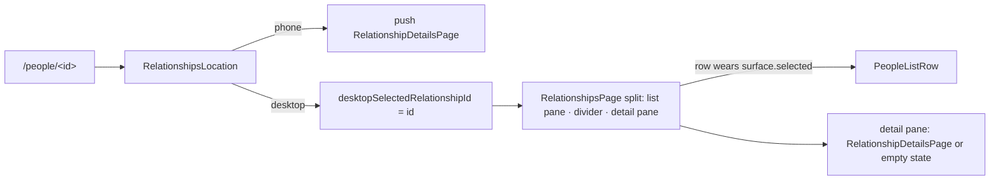

# The person page

`RelationshipDetailsPage` (design 2026-09-06 §2–3) is one `CustomScrollView`
in the design's order, above a sticky glass action bar in the Scaffold's
`bottomNavigationBar` slot with `extendBody` so the bar blurs what scrolls
under it — the task page's shape, on purpose:

| Sliver | Widget | Notes |
|---|---|---|
| Hero | [`PersonHeroAppBar`](../../lib/features/relationships/ui/widgets/person_header.dart) | A pinned `SliverPersistentHeader` of its own, not a `SliverAppBar`: the avatar hangs half its diameter below the header, and every layer of an app bar clips that overflow. Slivers paint back to front, so the earlier header paints its overhang over the block scrolling under it. The name appears in the bar only once the wash band has folded (`AnimatedSwitcher`, never an invisible duplicate). |
| Header block | `PersonHeaderBlock` (same file) | Eyebrow · name · one-liner · pills. The pills come from the list model's rules, so the page and the list never disagree about *due*; the cadence pill names the interval the runtime applies (`relationshipShownCadenceDays`), i.e. the default when none is stored. The eyebrow takes `calmEyebrowStyle`, not the mono timestamp style — it is a label, not a clock reading. The one-liner is `text.mediumEmphasis` with the mono voice on its timestamp alone: nothing on it is tappable, and the interactive token on a whole non-interactive line promised a tap that never came while outranking the person's own name. The health band is **not** here — the briefing card owns it, because only the card can date it. |
| Post-call offer | `PostInteractionPrompt` | Renders nothing until a marker exists (below). Directly under the header block, beside the paused-reminder callout: coming back from a call it is the most time-sensitive thing on the page, and below the briefing it was off a phone's first screen. Its `bottomGap` belongs to the offer, so no hole appears when there is none. |
| Next time | `NextTimeCard` in [`person_page_cards.dart`](../../lib/features/relationships/ui/widgets/person_page_cards.dart) | From the newest check-in that *has* *pay attention to* / *avoid* notes (`NextTimeCard.sourceOf`), not simply the newest: the fields sit under the composer's *More*, so a quick check-in leaves them blank, and blank means "did not get to it", not "forget the last ones". When the source is older than the newest check-in the card says which one (`fromEarlier`). Above the briefing: the user's own notes are what the page is opened for in the minute before a call, and under a card with a summary, a footer and a model row they sat below the first screen on a phone. |
| Briefing | `RelationshipBriefingCard` | Only when enrolled or a briefing exists; the page reads the report too, so the gap after the card is deterministic. |
| Check-ins | [`CheckInsCardSliver`](../../lib/features/relationships/ui/widgets/check_ins_card.dart) | A `DecoratedSliver` wearing `DesignSystemSectionCard.decoration`, so the unbounded log stays lazy inside a card that matches the boxed ones. The rows are the Tasks and Projects lists' grouped rows (`GroupedCardRowSurface`): edge to edge under the header, the hover fill spanning the row, the last one rounded into the card, and the divider beside a hovered row giving way (`buildGroupedCardRowInteractions`). Each row carries a chevron, the sentiment in a fixed trailing slot, what the check-in holds on its meta line, and at most two lines of what was said. |
| Reach · Tasks | `ReachCard`, [`LinkedTasksCard`](../../lib/features/relationships/ui/widgets/linked_tasks_card.dart) | Reach only with channels. |

Every section, the check-in sliver and the action bar sit on
`detailContentInsets` — the rule `DetailContentWidth` itself is built on: the
content gutter plus, on a desktop-wide window, the centring that caps the
column at `kDetailContentMaxWidth` **within the width the caller has**. Both
the page and the bar measure that with a `LayoutBuilder`, because on the
split the detail pane is narrower than the window and centring on the window
would over-inset it. Exposed as a function because a sliver and a
`bottomNavigationBar` cannot be children of that widget.

The [action bar](../../lib/features/relationships/ui/widgets/relationship_action_bar.dart)
resolves its third control once when built: the first channel, in the
person's own order, for which `ContactLauncher.canLaunch` answers yes — a
call on a phone, email on a desktop with a mail client, nothing where neither
exists — and launches it through the same `launchContactAction` the Reach
rows use, so the post-call marker is written the same way from both.

# Status lifecycle

`RelationshipStatus` mirrors `ProjectStatus` in shape: a sealed union whose
variants each carry their own `id`, `createdAt` and `utcOffset`, with the
replaced instance appended to `statusHistory`. The form mints a new instance
**only when the kind actually changed**, so re-saving a person without touching
the status picker does not grow the history.

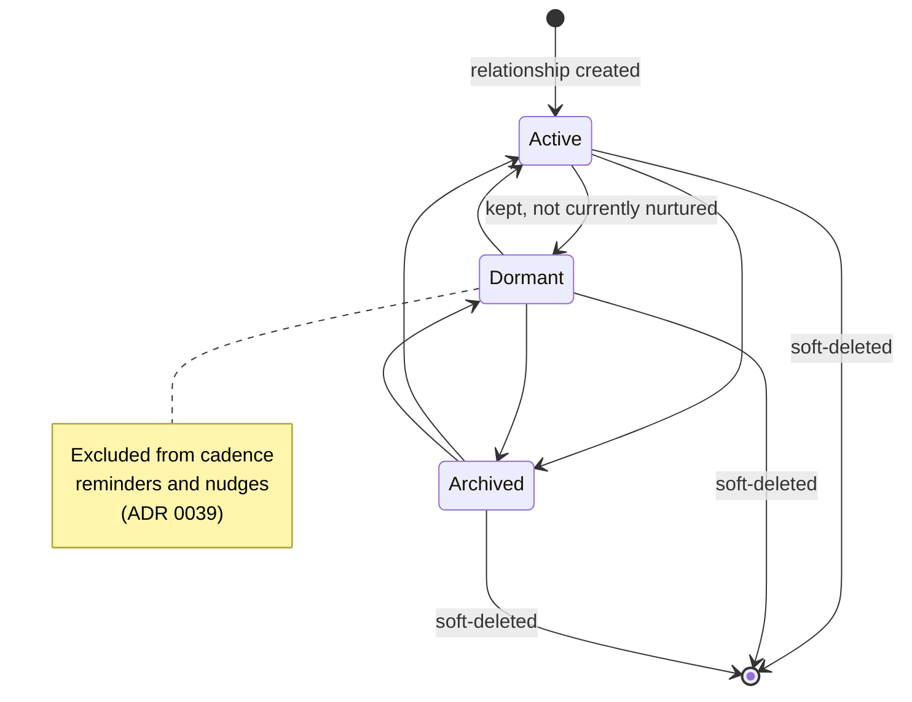

The picker offers all three kinds in every direction, so every transition above
is reachable; there is no ordering constraint in the model. `important` is a
**separate** switch — the single consent gate for proactive behaviour — and
`checkInCadenceDays` is only meaningful alongside it.

# Deleting a person

Deletion is a soft delete, like everywhere else in the journal, and it
**cascades to the person's check-ins** so no orphaned record of a third party
survives (ADR 0037 §5).

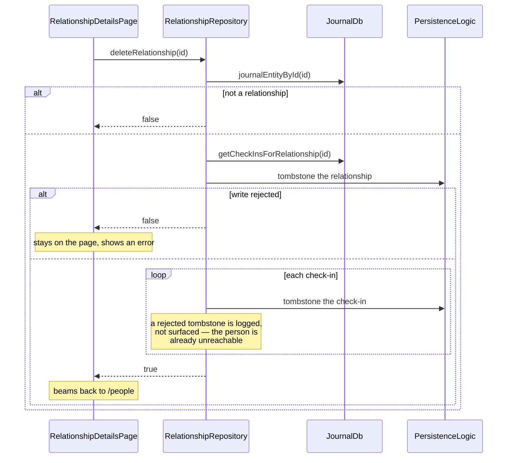

**The relationship is tombstoned first, deliberately.** An interruption
mid-cascade then reads as "gone" rather than "live with a partially deleted
timeline" — and because check-ins are resolved through `subtype` rather than
link traversal, once the relationship is gone no list or detail query reaches
them.

Every tombstone checks its result. `PersistenceLogic.updateDbEntity` answers
`false` when the vector-clock comparison loses to a concurrent sync and `null`
when it swallowed an exception, and neither may be reported to the caller as a
deletion — the page would navigate away from a person who is still there.

## What the cascade does not reach

- **The `RelationshipLink` rows.** The app's generic delete model leaves link
  rows to consumers, which already filter on the endpoint's `deletedAt`. A
  future link-only consumer would have to handle these tombstones itself.
- ~~Anything from later phases.~~ Since plan v2 phase 4 the cascade HAS an
  agent leg: the delete handler fires
  `RelationshipAgentService.handleRelationshipDeleted`, which destroys the
  agent identity through the shared `destroyAgent` lifecycle, cancels its
  pending and running wakes, and drops its subscriptions. The agent's own
  rows (registers, later reports and nudges) remain under the destroyed
  identity for audit, like every destroyed agent. The leg is fire-and-forget
  and contained — a failed teardown never fails the delete the user watched
  succeed.

  That "runtime maintenance repairs the rest" is a real mechanism, not a
  hope: `RelationshipRuntimeMaintenance.beforeWakeScan` resolves each active
  relationship agent's watched person before healing anything, and tears the
  identity down when the person is deleted or gone. It has to, because the
  delete surfaces are not the only path — the generic journal delete
  (a deep link to the entry, the journal detail page) reaches
  `RelationshipRepository.deleteRelationship` without the agent leg at all.
  A missing agent→relationship link is the creation race, not a deletion, and
  never reaps.
- ~~Pending OS reminders.~~ Since plan v2 phase 8 the delete surface also
  retracts them (ADR 0037 §5). This one cannot be left to the next Phase A
  tick the way the eligibility cases are, because destroying the agent is
  precisely what stops those ticks — an alarm armed weeks ago would otherwise
  still fire, naming someone the user deleted.

# In-app refresh: no private notification channel

Neither provider needs a feature-specific notification token. `affectedIds`
already carries **the entity's own id** plus a per-kind constant, and
`updateDbEntity` emits that set unconditionally:

| Write | Tokens emitted | Woken by |
|-------|----------------|----------|
| relationship create/edit/delete | `{relationshipId, RELATIONSHIP}` | list via `RELATIONSHIP`, detail via the id |
| check-in create/edit/delete | `{checkInId, relationshipId, CHECK_IN}` | list via `CHECK_IN`, detail via the relationship id |
| link/unlink task | `{relationshipId, taskId, LINK}` | detail via the relationship id |

That holds for synced writes too, which is the reason it is worth stating: a
manual notification emitted next to the repository call would be redundant on
the local device and absent on the remote one. `RelationshipDetailController`
additionally remembers the ids of the tasks its last build saw, so a title or
status edit **on the task side** refreshes the section without a relationship
write.

`unlinkTask` is the one place that notifies by hand, because
`JournalDb.deleteTypedLink` is a raw row delete with no entity write behind it.
It is not routed through `JournalRepository.removeTypedLink`, which notifies
unconditionally per call: the two-direction removal here would emit two
notifications even for a no-op unlink.

# The deterministic agent tier (plan v2 phase 4)

Marking a person `important` is the consent switch AND the creation trigger:
every door that turns reminders on — the form's save path, the person page's
card and contact import — goes through `ensureRelationshipAgentInBackground`,
which lazily mints one durable `relationship_agent` per person
with a **deterministic id** (`relationship_agent:<relationshipId>`), so two
devices marking the same person converge on one agent instead of duplicates.
Identity, `agentRelationship` link and the first cadence wake land in one
transaction; the agent leaves creation subscribed and with one immediate €0
evaluation queued. Re-entry on an existing agent is a fast path with one
write-through: a renamed person's title refreshes the identity's
`displayName` (the chat page titles itself from the stored identity), while
everything else is returned untouched.

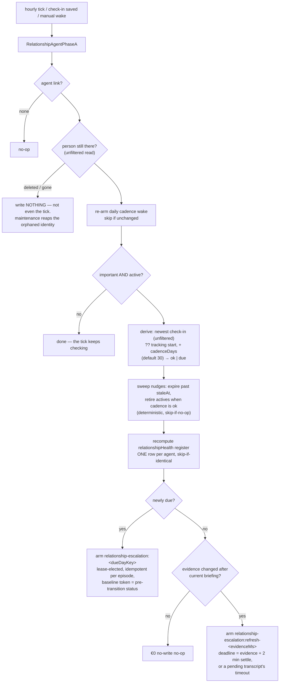

Four decisions keep multi-device runs convergent (ADR 0059 Decision 2):

- **Every runtime read ignores the private-display filter** — the check-ins
  (`getAllCheckInsForRelationship`) and the person herself
  (`getRelationshipByIdUnfiltered`): hiding an entry is a display
  preference, and devices with different settings must derive the same
  register. The gated `getRelationshipById` is the UI's read, and using it
  in the runtime silently un-tracks a private person on whichever device
  hides private entries.
- **Every derived day is a UTC calendar day.** The due day is
  `UTC-day(referenceAt) + cadenceDays`, computed with calendar components
  rather than a `Duration` — UTC has no DST, so the arithmetic is exact and
  the answer is the same in every timezone. Deriving it through the device's
  local calendar is not cosmetic: the register's `dueAt` would differ per
  device, so two peers would rewrite it at each other on every sync, and the
  episode key below would mint one escalation per timezone and pay for the
  same lapse twice.
- **The register is recomputed wholesale, never accumulated**, carries the
  vector clock of the row it read, and is skipped entirely when identical —
  so the uneventful daily tick is a true no-write no-op.
- **Escalations are per-episode** (`relationship-escalation:<dueDayKey>`,
  lease-elected via the shared `requiresLease` predicate): devices arming
  the same lapse write identical records, a consumed episode is never
  re-armed, and a check-in landing mid-episode moves the due day into a NEW
  episode. The baseline trigger token preserves "newly due" vs. "still
  due" — unreconstructable from storage once Phase A's own register write
  lands in the same transaction.

The agent's subscription is a single token: check-ins carry a denormalized
`relationshipId` that `affectedIds` emits (the table above), so one
`matchEntityIds = {relationshipId}` covers the person and every check-in,
draining immediately because the tier is free.

Escalation arms on **two facts, not one**, and each fact has its own
episode family. The cadence newly lapsing arms
`relationship-escalation:<dueDayKey>` at the due day (already past). The
evidence changing after the current briefing (`reportStale`, via
`relationshipEvidenceNewerThan`) arms
`relationship-escalation:refresh-<evidenceMs>`. The families are
deliberately separate: an early-fired refresh consuming the lapse episode's
record would let per-episode idempotence suppress the real lapse escalation.
When a tick sees both facts, only the lapse episode arms — its run
regenerates the briefing anyway.

**"Evidence changed" is a check-in's `updatedAt`, not its date** (ADR 0062).
`deriveCadenceFacts` reports `lastEvidenceAt`, the newest `updatedAt` among
the person's check-ins, and a check-in is saved again whenever what it holds
changes: `RelationshipRepository.attachEntriesToCheckIn` touches it, the
check-in's detail view does once a comment written there has words or a
recording is made there, and so does
`CheckInTranscriptionService` once a recording's transcript lands — read
back from the entry, since a run can end without an error and without words —
independently of the composer, which may be long closed — through
`touchCheckInsHolding`. Keyed by the check-in's date, as it used to be, a
check-in logged after the briefing but dated before it (yesterday's call,
logged this morning) never made the briefing stale, and a second check-in
on the same UTC day shared the first one's consumed episode. Now each
distinct change is its own episode, keyed by `relationshipEvidenceKey`: the
stored date and time to the millisecond, taken from the components rather
than the instant — journal times are stored as wall-clock values without an
offset, so a peer in another zone reads the same components as a different
instant, and only the components give every device the identical record
(`lastEvidenceKey`). The deadlines, by contrast, are instants:
`relationshipStoredInstant` rebuilds each one from the stored components and
the entry's own `utcOffset`, so every device schedules the same moment. A
refresh armed for a change that has since been overtaken stands down before
inference (`relationshipRefreshSuperseded`), even while the cadence is due;
the newer change's own refresh briefs on everything. The deadline is the change plus `relationshipEvidenceSettle` (2 min,
matching `WakeOrchestrator.throttleWindow`, which coalesces bursty edits
for the subscription-triggered wakes a refresh is not),
so a burst — a dictation, then a photo, then a comment — is briefed once;
and while a changed check-in holds a recording whose transcript has not
arrived, the deadline moves to that recording's `checkInTranscriptTimeout`,
so the agent never briefs on a check-in that says nothing yet. A transcript
that does arrive touches the check-in, minting an earlier refresh; the
deferred one then finds the briefing fresh and ends at €0.

# The LLM tier (plan v2 phase 5)

The wake router (`relationship_agent_providers.dart`) splits three ways: a
`relationship-chat-message:<id>` token runs
`RelationshipAgentWorkflow.executeUserMessage`, a fired escalation or
`relationship-report-refresh` token runs the full workflow, and everything
else stays in Phase A. The workflow is the goal Phase B shape with the goal
machinery it does not need (spec versions, revisions, proposal review)
removed:

- **€0 gates before inference.** A non-interactive run re-derives the armed
  fact and returns success without touching a provider when it no longer
  holds — the wake fired, the world moved on, nothing to say. A missing
  provider re-arms the escalation instead of consuming the episode.
- **`RelationshipFactsRenderer` is the whole ground truth.** Bounded (last
  10 check-ins; per check-in its saved narrative and up to
  `relationshipCheckInEntryLookback` (8) of its entries, oldest first —
  comments, recordings with their transcript or "transcript not available
  yet", photos with their description and caption or "no description yet" —
  each a 400-char excerpt; the entries are read unfiltered by
  `RelationshipRepository.getAllEntriesForCheckIns`, and a photo's
  description is its newest image analysis — an `AiResponseEntry` linked
  photo → response, its `tldr` where the model wrote one, else its body —
  read for the window's photos in one batch by
  `RelationshipRepository.getImageDescriptions`) and — the ADR 0041 §5 boundary
  — its `render` signature has **no channel parameter**, so contact
  channels are structurally absent from model context, not filtered out. The
  user-set sentiments in that window also emit the allowed health verdicts in
  plain language (`relationshipHealthBandConstraint`): the newest rating sets
  the bound — good/delightful allow thriving or steady, neutral allows steady
  or needs attention, strained/difficult allow needs attention or strained —
  and a positive newest rating additionally allows needs attention when the
  cadence is due or an older rating in the window was strained or difficult.
  Narrative may explain the verdict but cannot improve that deterministic
  bound. The workflow passes the same allowed set into
  `RelationshipAgentStrategy`, which rejects an out-of-range report call before
  it can persist. The exact enum stays confined to the `healthBand` tool field
  so it cannot leak into user-facing prose.

  **A photo added to a check-in is described the way a photo dropped on a
  task is.** `CheckInPhotoAnalysisTrigger` runs the shared profile automation
  with the **person** as the subject — their agent's profile, falling back to
  their category — so it describes a photo only where an image-analysis skill
  is assigned, and not at all otherwise. It then reads the description back
  and, only if one was written, touches the check-in: a description landing
  later is new evidence, exactly as a late transcript is (ADR 0062
  Decision 3), while a run that wrote nothing must not buy another briefing
  over unchanged evidence. Nothing awaits the trigger, so a failed read or
  write is logged rather than left as an unhandled asynchronous error.
- **Outputs accumulate, then persist once.** The contract requires visible
  chat through `reply_to_user`. On an interactive wake, the workflow accepts
  plain assistant content as a defensive visible-reply fallback and forces one
  more inference when neither carrier contains an answer. On a scheduled wake,
  plain assistant content remains an internal thought. Only the exact
  `PENDING USER MESSAGE:` header, followed by its explicit reply requirement,
  marks an interactive request; the rendered facts block is data and is never
  itself a user request. Multi-turn eval follow-ups carry that same header and
  each exchange must independently produce its own visible reply.
  A pending message requires exactly one reply, and the same assistant
  response must also carry every briefing, banner, snooze, and deferred task
  proposal the rendered facts explicitly trigger. The conversation loop does
  not continue after tool results (`getContinuationPrompt` returns null), so a
  rejected call is not retried in-conversation; the workflow's only extra
  inferences are its pinned retries for a required briefing, a required
  banner, and a missing interactive reply. When nothing is triggered, no tool
  runs; any plain completion is persisted only as an internal thought, never
  as a user reply. The contract never creates work merely because a tool is
  available.
  A briefing is triggered when it is missing, a check-in is newer, cadence is
  due, or the user explicitly requests a refresh.
  `reply_to_user`, `update_relationship_report`, `create_relationship_ad`,
  `snooze_relationship_ad`, `record_relationship_observations` and
  `create_and_link_task` accumulate in the strategy; `persistOutputs` writes
  one transaction. Deletion is always fenced;
  `important` and active status are fenced for automatic wakes, while chat and
  explicit briefing requests may still persist their reply, briefing and
  banner after unmarking because the user directly requested them. Deferred
  task proposals are written only while the person is still important and
  active, on every wake. Briefings cite relevant linked tasks with their
  stored status. The health band follows the user's sentiment labels;
  positive narrative cannot improve that verdict. Private narrative details
  may inform a briefing, while banner copy excludes contact details, addresses,
  diagnoses, health details, and third-party names. The briefing lands as an
  `AgentReportEntity` whose
  provenance carries the health band and its rationale
  (`RelationshipReportProvenanceKeys`, parsed fail-closed by
  `relationship_health_metrics.dart`). It carries **no confidence**: the
  project agent reports one and its card renders it as a percentage, but a
  briefing does not ask for one, because a model's stated confidence about a
  person is a number it generates about its own guess, and a percentage under
  a verdict about someone you know reads as a measurement. Briefings written
  before it was retired still carry the key; it is simply not read.
- **The agent keeps private observations, and reads them back.** FACTS hold
  what the user logged; they cannot hold what the agent learned about the
  record itself — that a name was misheard, that the user found a briefing
  wrong, how the user feels about the relationship. Without a place for that,
  a correction check-in was narrated once and forgotten, and the
  *Observations* tab under *Agent internals* stayed empty because the agent
  had no tool that writes there. `record_relationship_observations` takes
  notes with the shared priority and category (a complaint about the agent
  is category `grievance`); `persistOutputs` writes them as observation
  messages with ids derived from the agent, run and position, so a retried
  transaction rewrites rather than duplicates. The next wake reads the
  newest `relationshipObservationLookback` (20) back through
  `recallAgentObservations` and renders them under `YOUR OBSERVATIONS`,
  after the previous briefing, with an exact status: a correction the user
  made overrides the check-in or fact it corrects — FACTS are otherwise
  authoritative, so a note saying a name was misheard would lose to the
  misheard check-in — and every other note is context, never evidence. They sit behind the same deletion and consent fences as every
  other output. The parsing, recall and persistence live in
  [`agent_observations.dart`](../../lib/features/agents/workflow/agent_observations.dart),
  the contract every agent kind shares (see
  [agents overview](agents/overview.md)).
- **The standing head advances by DUE DAY, not by wall clock.** Report rows
  accumulate as history; the `agentReportHead` row is what the UI reads. It
  is stamped with the due day's last instant once that day is over (the
  wall clock while the day still runs), so two lease-elected devices
  finishing different overdue episodes resolve under generic LWW by the
  episode rather than by who wrote last — and it refuses to advance at all
  when the currently published briefing carries a NEWER `dueDayKey`, which
  LWW alone cannot prevent for a delayed escalation running locally. This
  mirrors `GoalAgentWorkflow`'s `_headTimestamp` / `headMayAdvance` pair.
- **Everything through the outbox is inside the failure path.** The
  non-interactive FACTS message is persisted inside the guarded region, so
  a failed outbox flush returns `WakeResult(success: false)` like any other
  failure — the conversation is deleted, the attribution envelope closed,
  and the consumed escalation re-armed, rather than the exception escaping
  `execute` past all three.
- **At most one banner per wake, deterministically.** The ad id is
  `relationshipAdId(agentId, runKey)` (uuid v5), so a retried wake
  overwrites rather than duplicates; a dismissal today opens a quiet
  window the workflow refuses to post into, and a live banner is never
  doubled. Active banners surface through the kind-agnostic nudge channel
  (`activeRelationshipNudgesProvider`, registered at bootstrap) on all
  surfaces, tapping through to `/people/<id>` — the resolved ADR 0059 open
  question. The tap also pauses the reminder for an hour, recorded as
  *opened* (ADR 0063): the person page then shows *Reminder paused until
  15:40* with *Snooze longer* (`PausedReminderCallout`, fed by
  `pausedRelationshipReminderProvider`), and FACTS render the banner as
  "opened by the user, paused until …" rather than as snoozed.
- **Chat turns are durable before the wake.** `RelationshipChatService`
  persists the user turn, then enqueues a manual wake whose trigger token
  carries the message id; a failed wake surfaces that id so retry
  re-enqueues the same turn instead of re-persisting it. The awaited
  completion is bounded at both ends: the orchestrator closing its
  completion stream (shutdown, runtime teardown) fails the turn rather than
  leaving the caller on a future that can no longer complete, which would
  strand the composer disabled.
- **One resolution chain for runtime and status.**
  `resolveRelationshipAgentModel` honors the typed setup saved by the shared
  model picker, including direct thinking-model overrides. Disabled or broken
  typed setups do not fall through. Legacy agents try the person's profile,
  agent profile, category default, then the device's Settings default. The
  validated GLM built-in is used only if no Settings default was selected.
  A selected Settings default that cannot resolve is an error. The generic
  fallback contract is in [profile resolution](ai/profile-resolution.md).
  `relationshipAgentResolvedSetupProvider` follows the agent's relationship
  link and uses this same resolver. The shared setup provider dispatches
  relationship identities there before asking for a task template. The card
  and configuration sheet therefore show the route that will actually run,
  including the Settings default, and refresh on identity, default-profile,
  catalog, relationship and category changes.
- **Missing configuration backs off without orphaning the episode.**
  Escalation retries keep their original workspace and trigger tokens, with
  delays of 1, 2, 4, 8, 16, then 24 hours based on the failure streak. Transient
  inference failures retain their immediate retry. Before each scheduled scan,
  maintenance checks future retries belonging to failed agents; if their route
  now resolves, it advances the pending deadline and clears the old lease.
  The normal scheduled manager still elects a device before inference. A
  concurrent consume/replacement observed during resolution is left alone;
  the final check and reschedule share a transaction.
  Saving the Settings default, changing profile/model/provider catalogs,
  editing a person's profile/category or its category default, and receiving
  an active relationship identity through sync all request a scan. The shared
  inference picker emits `AgentNotificationScopes.inferenceSetup` after a
  changed setup commits; maintenance listens to that scope rather than ordinary
  agent writes, so its own repairs cannot create a scan loop. An unchanged
  setup emits no route notification. Sync re-offers the identity after a
  relationship link, scheduled-wake record, or failed agent state arrives,
  covering creation bundles whose identity precedes those prerequisites.
  A repaired route need not wait out the backoff. Cadence
  repair runs independently before the configuration check. Configuration read
  exceptions also re-arm the episode; an unreadable failure counter uses the
  initial one-hour delay rather than discarding the retry.
- **The provider is named on the card, not confirmed per tap** (ADR 0061,
  refining ADR 0037 Decision 3). The card's model row — `{model} · via
  {provider}`, on every enrolled face before and during a run — is the
  disclosure; *Brief now* and *Update now* call `requestBriefing` at once,
  with no consent sheet and no acknowledgement toast (the running face is the
  acknowledgement). A failure to enqueue still toasts. There is no pre-tap
  route resolution any more: a wake whose route resolves to nothing is
  stamped failed, and the failed face offers *Choose a model*, which opens
  `AgentModelSheet`.

## The briefing wears the shared AI panel

`RelationshipBriefingCard` is not a relationship-shaped card; it is the
**same "intelligence" panel** as the task agent's section on Task Details and
the goal agent's read — `aiCardDecoration` chrome, `TldrHeader` identity
(sparkle badge, title, agent display name, tap → `AgentInternalsPanel`), and
`TldrBody` for the report prose. Three consequences follow from that reuse
rather than from any relationship-specific code:

* The briefing renders as **Markdown** (`AgentMarkdownView` → `GptMarkdown`).
  Phase B writes headings, bold and lists; before the panel was shared, the
  card printed them as literal `##` and `**`. The card passes `TldrBody` its
  own body tier (`bodyMedium`), so the reading faces sit at the same size as
  the waiting faces' prose; the task and goal cards keep the compact
  default.
* *Read more* / *Show less* and *Open agent internals* are the same control,
  in the same place, with the same behaviour as on a task. `TldrBody` takes a
  `disclosureKey` so a failing expectation still names the surface it fired
  on; everything else is shared verbatim.
* Retuning the wash, border or radius happens once in `ai_card_chrome.dart`
  and lands on all three surfaces together.

The footer includes the shared model identity row — with the agent's token
cost riding it as `trailingMeta`, so `model · via provider · 18.4K tokens`
is one line — and a link to `AgentModelSheet`, alongside the
relationship-specific check-in and briefing controls. Report freshness
describes the stored report; model availability describes the current
configuration and is a separate signal.

New relationship reports carry `ReportInferenceProvenance`, captured from the
resolved route used by the wake, alongside health and consumption metadata.
Model and provider names remain attributable after configuration changes.
Older reports without that snapshot honestly retain "Attribution unavailable"
until a new briefing is generated; changing the current setup cannot identify
which model authored historical text.

The health band has no pill anywhere (design 2026-09-13, revised
2026-09-20): it is the first word on the card's own status line — `Thriving ·
as of 3 h ago`, the judgement before its timestamp. The person header above
the card used to carry an undated copy of the same word, which is the less
truthful form — a band keeps reading as current long after the briefing it
came from stopped being so — so the header now carries the cadence fact
alone and the page no longer watches the report at all. The band's colour
rides the design system's presence dot (`DesignSystemBadge.dot`, toned by
`relationshipHealthBandTone`) in the status line's glyph slot, so the
judgement is carried by more than its word (*steady* is the hueless
`neutral` tone, never the accent that means pressable on the same card);
every status glyph is centred on the first line by a computed offset, so at
1.6× it still sits on the words.

**The band says why.** Directly under the status line, a current briefing
renders `RelationshipHealthMetrics.rationale` — the one sentence the contract
requires of the model ("One sentence tracing the band to specific check-in
evidence"), stored as report provenance under
`relationship_health_rationale`. It had been required, produced and persisted
since the band existed, and read by nothing, so a verdict on a person arrived
with no way to check it. It sits with the band rather than behind *Read more*
— an unexplained verdict is not a summary — and is capped at three lines so a
model that writes an essay cannot push the briefing itself off the card. Only
the current face carries it: out of date, the status line drops the band for
its warning, so the sentence would explain something no longer on screen. The not-enrolled
face wears `TldrHeader`'s plain badge — a neutral tile, not the AI accent it
disclaims — and its privacy note rides the action row's leading slot. The header's trailing rail holds only an out-of-date
briefing's age (`6 days old`, an outlined tag in the meta ink, so the status
line's warning ink is the one orange thing on the face and the tag never
competes for the first read), which is what that rail — capped at half the header width,
ellipsizing — can carry without truncating a judgement. The status line is
a `DsTieredText` that is a live region on the transitions only — running,
failed and out of date, announced as the state word without the age behind
it, so a resting "as of" never re-reads its own ticking — and one that
survives the shared header, which excludes only its badge and title from
semantics so the status can speak for itself. The alert ink is the state
word's alone: the detail after the separator (`· 20 min ago`, `· new
check-in Thursday`) reads in the meta ink through `DsTieredText.tailStyle`.
It sheds its date or time before it
wraps (`Out of date · new check-in Thursday` → `Out of date · new check-in`
→ `Out of date`; `Last run failed · 19 min ago` → `Last run failed` — a past
event in the same relative grammar as *as of*, never a clock time that
reads as an appointment), and only
the narrowest wording may take a second line, glyph top-aligned, so the
state's non-colour carrier never clips.

Three small seams made the reuse possible rather than a fork:

* `TldrHeader` grew an optional `title` — the briefing is the same panel
  wearing a different noun, not a second header widget — and its trailing
  slot is named `trailing`, since two of its three hosts put meta there
  rather than a TTS control.
* `TldrHeader` also takes a `subtitle` widget in place of the agent-name
  caption, and an `icon` for the badge: the briefing's status line carries a
  glyph or a spinner and a semantic colour the plain caption cannot, and the
  unenrolled person's plain card wears the people glyph rather than the
  sparkle. The `agentName` string is then only what the semantics announce.
* `resolveReportTldr` / `resolveReportAdditional` live beside `TldrBody` and
  answer "what is the summary" and "what goes behind Read more" once, for
  every report card. They were duplicated per card before, and the copies had
  already drifted: only one of them suppressed a Read more whose full text
  merely repeated the TLDR.

The briefing agent is **named after the person it watches**
(`RelationshipAgentService` sets `displayName` to the relationship title and
keeps it in sync on rename), and the card sits under an app bar already
carrying that name — so the header suppresses the subtitle when the two are
equal. A name that has diverged is still shown: there it carries information
the app bar does not.

## The relationship agent card

The card on the person page (design 2026-09-06 §4, rebuilt to the
2026-09-13 state matrix) is the same AI panel as the task agent's section
and the goal agent's read — `aiCardDecoration`, `TldrHeader` (tapping it
opens the internals), `TldrBody` for the prose — in one of seven faces, on
one skeleton: header with **one status line** under the title and an
optional pill on the trailing rail, body, the proposals band, then a footer
with one quiet text action on the leading edge, one primary on the trailing
edge, and the meta lines beneath (model · provider · tokens; sources where
there is a briefing). The face is a pure function of the runtime's own
signals,
[`relationshipAgentCardStateOf`](../../lib/features/relationships/ui/widgets/relationship_briefing_card.dart),
so the decision is a table rather than a widget tree:

| Face | When | Status line · body · footer |
|---|---|---|
| Not enrolled | not `important`, or dormant/archived | plain section card, people glyph · `No reminders` — the band's and the pill's own words — (or the status word while paused) · what reminders turn on · the *How often?* interval pills (not while paused) · **Remind me about {name}** |

The not-enrolled card carries **no privacy caption**. It used to read
`Only what you start yourself uses AI` in the footer's leading slot, beside
the control that starts an agent which wakes on a cadence and writes
briefings without being asked each time — so the one privacy claim on the
surface described the state the reader was one tap from leaving and said
nothing about the one they were entering. What the agent sends belongs
somewhere it can be explained, not in a caption that expires on tap.
| No briefing | enrolled, no current report | `Agent watching · next look {day}` · how many check-ins *Brief now* would read, and that it never sees a channel · *Log check-in* · **Brief now** |
| Running | `agentIsRunningProvider` | spinner · `Writing the briefing…` · the briefing being replaced, still readable (TL;DR + Read more), or no body before the first — never a duration estimate · *See activity* · no primary |
| Failed | `consecutiveFailureCount > 0` and the last wake is newer than the report | `Last run failed · {ago}` in error ink · the provider returned an error, your check-ins are unchanged (or that no model is set up) · the briefing it failed to replace, if there is one, kept readable under that with its age · *See activity* · **Choose a model** when no route resolves, **Try again** otherwise |
| Current | report, not stale | `{band} · as of {ago}` · TL;DR + Read more · *Log check-in* · **Update now** (secondary) · sources line once *Read more* is open |
| Out of date | `AgentStateEntity.isReportStale` | `Out of date · new check-in {day}` in warning ink, `{n} days old` pill once a day old · body · *Log check-in* · **Update now** (primary) — no sources line, since the count would include the check-in it missed |
| Due | the current face while the cadence is lapsed | same status · body · *Log check-in* · **Call {name}** (the first channel the platform can open, resolved like the action bar's), or **Log check-in** as the primary without one |

Open task proposals are counted once, by the proposals band beneath the
body (`2 pending`), never again in the header: a state said twice is a
state said badly, and the band is where the proposals are acted on. The
sources line (`Sources: 6 check-ins · contact details never sent`) is part
of the expanded reading — it appears with the full briefing behind *Read
more* — so the folded card stays status · TL;DR · one next step.

Two runtime details keep the faces honest. Every relationship wake now
stamps its state row (`_stampWakeOutcome` in the workflow): `lastWakeAt`
either way, and `consecutiveFailureCount` reset on success or bumped on
failure, including a wake that found no model to run on and returned before
inference — before this, no relationship wake ever wrote either, so the
failed face could never appear and the internals' Stats tab never knew the
last wake. And the card arms one timer at the next minute/hour/day boundary of the
briefing's age (`untilNextAgeBucket`, shared with the goal page), so "as of
just now" does not stay on screen for hours. *Remind me about {name}* on the plain
card also mints the agent through `ensureRelationshipAgentInBackground`, the
same lazy-create call the edit form and contact import make — and stores the
interval its pills show as selected, so the one tap never schedules a rhythm
nobody saw. A stored interval outside the presets (a synced 45 days) is offered
as its own pill by `relationshipCadenceChoices` rather than leaving nothing
selected beside a save that would store it.

**Reminders that are on always show, and store, an interval.**
`relationshipShownCadenceDays` (beside `relationshipDefaultCadenceDays` in the
runtime) is the one place the "stored, else 30 days" substitution is written:
the deterministic tier schedules from it and the list model reads it, and the
three places reminders are turned on — the form, the import review and this
card — show it as the selected pill and save it. `relationshipCadencePresets`
has no "none": an enrolled person with a null cadence ran monthly anyway, so
"No cadence" was a choice the app overrode, shown selected in the editor while
the list row said *Monthly*. A null `checkInCadenceDays` still reads correctly
— older and synced records have it — it is just no longer written for someone
whose reminders are on. With reminders off the form leaves a stored interval
untouched, and a row with neither reminders nor an interval leaves the cadence
out of its status line: its band already says *No reminders*.

The chat entry lives in the page's hero. There is no *Automatic updates*
switch, because the relationship runtime never reads
`AgentConfig.automaticUpdatesEnabled`. Task proposals appear below the TL;DR
and above the footer, including when a later wake fails. Their scope and
confirmation path are described below.

The header's pills are its own: [`relationshipCadencePill`](../../lib/features/relationships/ui/widgets/person_header.dart)
renders the list model's cadence fact, and the next-due day follows it. The
card names the band on its status line (its dot through the badge tones of
`relationshipHealthBandTone`) and draws no pill for it; nor does the header.
The token cost sums
`agentTokenUsageSummariesProvider` onto the model row; the "as of" status
uses the shared [`relativeAgoLabel`](../../lib/utils/relative_age_label.dart).

## Deferred task suggestions

[`relationship_agent_contract.dart`](../../lib/features/relationships/workflow/relationship_agent_contract.dart)
exposes `create_and_link_task` as a deferred tool. It requires an explicit
commitment, a quoted description, a structured `sourceCheckInId`, and a reason;
`dueDate` is optional and must be a real calendar date. The renderer includes
check-in IDs in its ten-entry window and the relationship-scoped `PROPOSALS`
ledger. Pending, confirmed and rejected decisions therefore feed the next wake;
contact channels remain outside FACTS. The strategy accepts only IDs from that
rendered window, deduplicates source/title pairs, and queues at most three tasks.

**The user's confirmation decides a proposal; no text is matched.** A
proposal is grounded by its `sourceCheckInId`, which must name a check-in the
wake rendered, and the card shows that check-in beside the quoted commitment.
Nothing compares the quote with the check-in's text. The dispatcher used to
demand an exact substring at confirmation and withdrew the suggestion on a
miss — but the model reads narratives whitespace-collapsed and cut at 400
characters, and quotes a name a later check-in corrected, so suggestions the
user had read and confirmed failed with *Failed to apply change* and no task.
A proposal-time check would not help either: the conversation ends after tool
results (`getContinuationPrompt` returns null), so a rejected proposal is
silently dropped rather than quoted again.

The workflow persists those items inside its existing output transaction,
rechecking that the person is live, important and active. A deterministic
agent/run change-set ID prevents a retry overwriting decisions. A fresh ledger
read suppresses structural and display duplicates. The historic `taskId` column
stores the relationship ID: the ledger already supports arbitrary subjects,
so no schema migration is involved. Paraphrase suppression remains an LLM
policy; deterministic dedup cannot recognize every equivalent commitment.

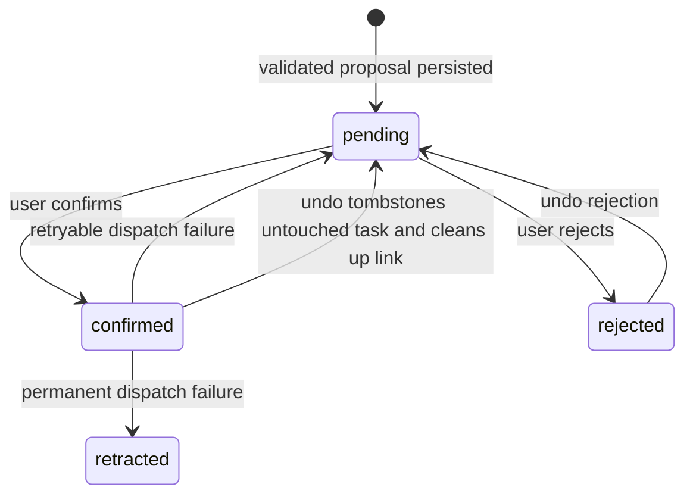

[`relationship_tool_dispatcher.dart`](../../lib/features/relationships/workflow/relationship_tool_dispatcher.dart)
is the only apply path. It rechecks that the source check-in is still visible
and still the person's, and current consent — not the quote; creates a task
with the person's category, inherited privacy (also preserving private evidence), evidence link and proposed due
date; then links it to the person. A link failure tombstones the new task only
if it is unchanged and has no live links. A refused compensation is
non-retryable, preserving tasks already edited or linked by another writer. The shared
category-default assignment helper provisions its task agent. The task has a
stable UUID derived from the person, source check-in, title and quoted
commitment, so the same synced proposal confirmed on two devices converges on
one journal row despite different clocks. The task-creation facade accepts
this explicit identity and preserves its existing insert-only write contract.
A live task found under that identity is linked without overwriting it or
creating a fresh undo receipt from potentially edited data. Reconfirmation
after undo restores the tombstoned identity with a vector clock descended
from the tombstone. An active, visible relationship link in either direction
turns a duplicate refusal or a thrown post-write error into success without a
new undo receipt.

[`relationship_proposal_service.dart`](../../lib/features/relationships/service/relationship_proposal_service.dart)
wraps the generic confirmation service. The exact creation snapshot is stored
under `_relationshipTaskReceipt` on the user decision's args, leaving immutable
proposal args and fingerprints unchanged. It supplies the durable task
navigation destination and guards undo against task edits. Undo checks the
task and additional journal links before removal. The dispatcher repeats the
exact snapshot and allowed-link checks inside the journal write transaction,
then tombstones the untouched task; the service cleans up its relationship
link afterward. Undo allows only the originating person’s relationship links;
compensation allows no live links, including hidden links. Link changes do not
advance the task’s vector clock, so clock comparison alone cannot guard this
operation. This protects local writes and peer changes already received, not
changes still offline on another device. A refused deletion leaves the live task
linked. Failed link cleanup is logged and leaves only a link to a tombstoned
task, which relationship task queries exclude; it does not undo the successful
deletion or reopen an unsafe compensation path.
Malformed or absent receipts disable confirmed-task undo. A receipt write
failure after successful creation is logged and keeps confirmation successful;
the local receipt remains usable, but its destination/undo may be unavailable
after restart until a durable receipt exists. Cross-database confirmation and
journal writes are not one atomic transaction.

[`relationship_proposal_providers.dart`](../../lib/features/relationships/state/relationship_proposal_providers.dart)
reads the agent/person ledger and receipt decisions. Ledger entries carry their
originating run key from the existing query, avoiding a per-history-row read. The band retains previous
async data and resolving rows while their shared task-card animations finish.
It folds after three pending rows, offers bulk confirmation only for a single
kind, keeps per-row buttons and swipes inert during bulk writes, links evidence
to the check-in editor, and provides handled history and
undo. Confirmation briefly highlights the created task in the Tasks card.
It does not use the task-specific `ChangeSetNotificationService`.

The shared chat projection carries each reply's `runKey`.
[`relationship_chat_pane.dart`](../../lib/features/relationships/ui/widgets/relationship_chat_pane.dart)
uses the existing attachment slot to render the same band filtered to that
run, including its handled history. Card and chat act on the same decisions.
Call scheduling and task-note proposals remain separate follow-up work; this
tool does not create Daily OS blocks or OS reminders.

## The check-in composer

`showCheckInCaptureSheet` and `showCheckInEditSheet` ([check_in_capture_sheet.dart](../../lib/features/relationships/ui/widgets/check_in_capture_sheet.dart))
open **one composer** (design 2026-09-13) in a responsive modal — a bottom
sheet on a phone, a dialog on desktop — straight onto the narrative. There
is no Write-or-Record choice first: *Dictate* is a button inside the field,
so audio stays an explicit choice without a detour, and `startSpeaking` (the
page's microphone) presses it after the first frame. A dictation is not
merged into the note: each recording is a **take** (`CheckInTake`) shown
under the note with its own words, and saving makes it one of the check-in's
entries (ADR 0062) — so the agent reads the words once, and Save never waits
for them. Editing is the same composer prefilled, without *Dictate*
(`offersDictation` is false for a saved check-in): a saved check-in is added
to from its timeline, where a recording becomes its entry at once, and the
edit sheet edits the check-in's own fields.

The composer's parts, top to bottom:

* [`CheckInComposerHeader`](../../lib/features/relationships/ui/widgets/check_in_composer_header.dart)
  in the sheet's pinned toolbar slot: the person's avatar, the title and one
  status line — `with Pip · last spoke Sat 1 Aug` at rest, read through
  `relationshipDetailControllerProvider`; what the recorder is doing
  (`● Recording`, `Paused`, `Microphone unavailable`); and, with the recorder
  at rest, where the takes' words are (`Transcribing…` while one is on its
  way, `Transcript not received` when one never came —
  `checkInComposerStatusOf`) — while a take is live the
  glyph alone carries the tone (the red dot is the design system's
  `danger` presence dot) and the words stay in the quiet ink, so accent on
  text means only pressable; a failure wears its alert ink on the words as
  well, the briefing card's rule for its own status line, so the two
  surfaces read one way; *Paused* wears a pause glyph. The line is a live
  region for the recorder and the transcript wait only — never for the
  resting subtitle, which would otherwise be re-read before a landing
  transcript, and never for a failure, which the callout beneath announces
  (its title is the next step), so one region speaks per event. Editing an existing check-in, the ladder starts at `with Pip`:
  the chip row is the one source of its date. The close control
  is a `DesignSystemIconAction`, as is the edit sheet's delete (in the error
  tone). The
  status line is **tiered**, not truncated: a `DsTieredText` shows the
  widest of its wordings that fits (`with Pip · last spoke Sat 1 Aug` →
  `with Pip`), so a narrow phone or a large text scale sheds the date before
  the person — a check-in is *with* someone — and assistive technology hears
  the full first wording whatever the screen shows. Above
  `TextScales.large` (1.3×) the avatar steps aside for the text, and the
  toolbar's height is computed from the styles' own line
  heights plus the number of lines the title actually needs at the modal's
  real width (`titleLinesFor`, a `TextPainter` measurement, capped at two)
  — Wolt reserves the slot up front, so the sheet and the header must agree
  on the number rather than guess it.
* [`CheckInNarrativeField`](../../lib/features/relationships/ui/widgets/check_in_narrative_field.dart):
  the note, then the takes, then one caption row (`5 words`, and on desktop
  the save shortcut) with *Dictate* in its footer. The recorder and its
  failure cards render **in place of the text**; a take never does. Each
  take is a `CheckInTakeRow` on the next surface up: the length and where
  its words are on the first line — a `DsTieredText` ladder that sheds the
  route before the state (`0:23 · Transcribing… · Whisper large v3 · via
  Groq` → `0:23 · Transcribing…` → `0:23`) — then *You can save now — the
  words follow* while they are on their way, the words themselves (three
  lines, a live region as they land), or, when they never came, the
  provider's own reason (or *Your 0:23 recording is saved in the journal…*)
  with *Try again*, which asks for the **same** recording's words. *Remove
  recording* on its trailing edge leaves the take out of the check-in; its
  audio stays in the journal, linked to the person, as the discard question
  says. Beside a take the note asks for one line, and the shortcut hint is
  offered with no words typed, since a take alone is enough to save. The
  failure cards — the recorder could not record — sit above a field that
  starts short and says *Or type it here…*; typing a word under one is
  choosing to type instead, so the card goes on its own (the form's
  `_onNarrativeChanged`). The cards are the design system's
  `DesignSystemInlineCallout` with a title and two actions on the trailing
  rail, quietest first — *Type instead* in the `quiet` variant (the way out,
  not a second accent) and the recommended secondary pill, so the alert tone
  is the card's one colour, the pill its one shape, and the filled accent
  stays Save's — and they announce themselves once, whole
  (`announce: true`). The header already names the state, so a card's title
  is the *next step*, short enough for one phone line (`Allow microphone
  access`); under the refused microphone the field's own *Dictate* is the
  retry — one tier down, `tertiary`, with the placeholder at `bodyMedium`,
  so the card's pill is the face's one shape and the field's ladder does not
  invert beneath it — and the body says so (`…then tap Dictate`). The
  caption row is a `DsTieredText` ladder too (`5 words · ⌘↩ to save` sheds
  the count before the shortcut), and the caption and *Dictate* share one
  corner: beside each other when they fit a line, else *Dictate* on its own
  line at the trailing edge (`_CaptionAndActions`), always so above
  `TextScales.large`. The keyboard-shortcut hint joins the caption only once
  there is something to save — beside a held Save it would be a promise the
  footer contradicts. The *More* row's caption says what is set — a field's
  name until it has a value, then the value (`Good · 2 topics · next time
  noted`, from the form's `_moreCaption`) — and is a ladder too, shedding a
  segment at a time so large text never slices a word; unfolded, *More* is
  `subtitle1` and every section — the feeling, and the three inputs —
  carries the same `subtitle2` heading one level under it, one `sectionGap`
  apart. The empty field rests two lines tall in the desktop dialog and
  three on the phone (`restMinLines`). The field's accent hairline means
  keyboard focus and nothing else, and it is the field's only frame: the
  `TextField` inside silences every border the app's
  `InputDecorationTheme` would fill in (its 2.5 px focused outline used to
  ring the text inside the hairline): the red dot, the waveform and the
  filled Stop say "live". The phases swap in place rather than through an
  `AnimatedSize`: the tiered captions lay themselves out with a
  `LayoutBuilder`, which re-dirties an animating size box in its own layout
  pass.
* [`CheckInContextChips`](../../lib/features/relationships/ui/widgets/check_in_context_chips.dart):
  type · started · duration as one wrapping chip row, each chip opening its
  picker (the type through a `DsActionModal`), quiet while the recorder
  owns the field. Opened from the post-call offer the chips
  are prefilled and a caption beneath says where the numbers came from.
* *More*: optional sentiment, topics and next-time guidance, folded unless
  the edited check-in already carries any of them.
* [`CheckInStickyActions`](../../lib/features/relationships/ui/widgets/check_in_capture_sheet.dart)
  in the modal's sticky bar: *Save check-in* always visible, and when it is
  held, why — on two lines when the bar is stacked above
  `TextScales.large`, reserved by `CheckInStickyActions.height`. Cancel is
  the button's `quiet` variant on both viewports, so the one bright shape in
  the bar is Save's even while Save is held — and when the bar stacks, Save
  leads and Cancel sits centred beneath it, the design system's rule for
  every stacked bar; on the phone Cancel's label sits on the content column
  (`alignsLabelToLeadingEdge`), like the card's quiet actions. The
  recorder's Discard · Pause · Stop sit on the trailing rail, where Dictate
  lives in every other phase, and Discard is quiet
  too: red on this surface is the live dot alone, and the level meter is
  the prose ink rather than the accent, which means pressable. The clock
  reads to assistive technology in words (`checkInSpokenClockLabel`: "23
  seconds"), as do the saved-audio captions. A held Save carries its reason
  as a semantics hint, so a reader landing on the control hears the next
  step. Discarding asks in this
  composer's own words (`checkInDiscardRecordingBody`: the audio is
  deleted, the check-in stays open). On the
  desktop dialog the field takes focus as the composer opens (the form's
  `dialog` flag), so the typed common case is open → type → ⌘↩; a phone
  waits for the first tap rather than raise its keyboard over the sheet. On a
  phone the reason sits under the bar; on the desktop dialog it takes the
  leading edge with Cancel and Save together on the trailing edge. The form
  reserves the bar's predicted height for its layout
  (`CheckInStickyActions.height`, the actions row — stacked above
  `TextScales.large` — plus, on the phone, the reason line), so the dialog
  carries no blank band above its footer; the bar reports its rendered
  height back through the handle (`reportBarHeight`) and the form adds only
  the slack a taller-than-predicted bar needs — a long-label locale stacking
  Cancel and Save on a narrow phone — so the last field always clears it.
  With the field focused on a phone — the keyboard up; the sheet
  removes the keyboard inset from what the bar can see, so focus is the
  signal — the bar slims to the context summary chip (`Call · Now · no
  duration`, tapping it drops the keyboard) and a short *Save*. On desktop
  ⌘↩ / Ctrl+↩ saves, and the field's footer says so.

**Leaving asks only when it would lose something.** Cancel, the header's
close and the back gesture all go through the form's `_dismiss`: when the
draft is clean — the narrative, the type · started · duration chips and
every detail match what the composer opened with, and no take is in flight
— it simply pops; when it is dirty it
asks first, with a wording that says what happens to the audio: a running
take is deleted with the draft — confirming cancels it through the handle's
recorder, because a button labelled Discard must discard rather than leave
a recorder running behind a closed sheet — and a recording already in the
journal stays there. The back gesture is caught by a `PopScope` whose `canPop` is the same
`_isDirty` rule, read at build time — which is why the detail fields under
*More* rebuild the form as they change — so no path around the question
exists. (A take can still
outlive its sheet when a route change pops the composer around the guard,
which is why *Dictate* adopts a running take for this person rather than
toggling it off.)

The form has no actions of its own: after each frame it publishes the save
and delete intents, the dismiss intent, the save block, the header status,
the summary and the field's focus through a `CheckInFormHandle` (a
`ChangeNotifier`), and the header and the bar render from it. The handle also carries the recorder a
recording was started on, so the sheet can put the floating indicator back
once it has closed — and only then, and only if a recording was ever
started.

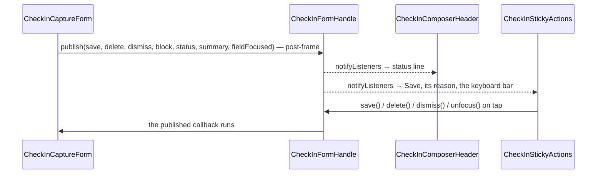

The *started* chip reads its time through `relationshipTimeLabelOf`, which
resolves the device's twelve- or twenty-four-hour preference exactly as
`DesignSystemTimeWheel` does, so the chip and the wheel that edits it never
disagree; the post-call offer and the card's last-failed-run time go
through the same helper.

**Save waits for words, and only words.** The rule is one pure function,
`checkInSaveBlockOf` in
[check_in_speech_state.dart](../../lib/features/relationships/ui/widgets/check_in_speech_state.dart):
held while the preflight, the recorder or the transcript wait is up, held
with *Add a few words to save* while the narrative is blank, held with *Type
or retry to save* when a transcript went missing and nothing was typed, and
free otherwise. A check-in is user-authored (ADR 0038), and the composer's
premise is that one line is enough — so a type or a duration alone never
saves, in create or edit mode.

*Started* opens the date picker, then `DesignSystemTimeWheel`, the same control
used by the journal date/time editor. It inherits the device's 12/24-hour
preference and labels its semantics with the localized Started label. The
chosen time preserves the selected day and is clamped to the current minute
on today's date. The chip reads
`Now · HH:mm` while the value is the current minute and the relative day plus
the time otherwise. *Duration* opens `showCheckInDurationPicker`
([check_in_duration_picker.dart](../../lib/features/relationships/ui/widgets/check_in_duration_picker.dart)):
ranked quick picks over the shared wheel, *Clear* meaning no duration. The
ranking ([`checkInDurationSuggestionsControllerProvider`](../../lib/features/relationships/state/check_in_duration_suggestions_controller.dart))
reads `getRankedCheckInDurations` — `dateTo − dateFrom` in whole minutes over
the last 90 days, private check-ins excluded while private entries are
hidden, most-used first and ties shortest first — tops a thin ranking up from
the design's positions (5 · 10 · 15 · 20 · 30 · 45 min · 1 h · 1 h 30 · 2 h ·
3 h) without repeating a value, and sorts the six chips shortest-first; the
wheel is the design's *Custom*. The length persists as the end time (no
schema change), which is what the log row shows. A dictated note's length
never fills the duration: it is how long the note took, not how long the
call did.

The picker is design-system property: [`showDurationPicker`](../../lib/features/design_system/components/time_pickers/duration_picker_modal.dart)
and [`DurationQuickPickChips`](../../lib/features/design_system/components/chips/duration_quick_pick_chips.dart)
carry the shape — a host-named title, host-worded chips, Done committing a
*changed* wheel, Clear committing zero, a chip popping before it writes — and
the task estimate picker is the other host (see the
[tasks data model](tasks/data-model.md#pickers)).

## The person form, the import review and the chat

Three surfaces finish the redesign (design 2026-09-06 §6), and all three say
the same thing in the same words: what *important* turns on, and where a
phone number does not go.

**The form** ([relationship_form_modal.dart](../../lib/features/relationships/ui/widgets/relationship_form_modal.dart))
groups into three `DesignSystemSectionCard`s — **Who** (name, nickname, the
names that come up with them — the category speech dictionary's semicolon
format, parsed by the same `parseSpeechTerms` — the category, and while
editing the status), **Important** (the consent switch — labelled as the
request it grants, *Remind me to stay in touch*, so it reads true while off —
one line saying what it enables, and the cadence presets *only* once it is
on, the applied interval preselected), **How to reach them** (the channel editor under the same privacy line
the page's Reach card carries). The category is a name beside a 10px colour
dot rather than a second large avatar competing with the person's own;
clearing it goes through the picker's own no-category row, so one component
owns what the choices are. Like the capture sheet, the form draws no actions:
it publishes `save`, `dismiss` and `canSave` to a `RelationshipFormHandle` and
`RelationshipFormStickyActions` renders them in the modal's pinned bar, which
is what keeps Save reachable over three cards of fields.

Leaving asks first. Cancel, the back gesture, the barrier and Escape all route
through the form's `_dismiss`, which compares every field against what the
sheet opened with and shows `showConfirmationModal` only when something would
be lost; an untouched sheet still closes on the first tap. The `PopScope`
around the form sets `canPop: false` unconditionally rather than `!_isDirty`,
because the fields are plain controllers with no `onChanged`: the form does
not rebuild while you type, so a dirtiness captured at build time would still
read "clean" for the name just entered. The Photo card is deliberately outside
the comparison — its actions write immediately, so there is never a pending
picture to lose.

*Add channel · or from contacts* is one row with two doors. The manual one is
on every platform (ADR 0041 §2); the address book appears only where there is
one, and it **picks without persisting** — `ContactsService.pickSingle` hands
back an `ImportedContact` whose channels become ordinary editable draft rows,
deduplicated against what is already typed. That is the difference between it
and the detail page's *Link contact*, which writes: a form that saved behind
its own Save button would lose the edits still in its fields.

**The import review** ([contact_import_page.dart](../../lib/features/relationships/ui/pages/contact_import_page.dart))
names the count and the boundary in its subtitle ("2 selected · numbers stay
on this device"), gives each chosen contact a persona avatar, and reveals the
cadence presets under a person only once they are marked important — a
cadence on an unimportant person is never evaluated — with the default
interval already on the draft (`setImportant` seeds it), so what is reviewed
is what is imported. Its switch copy says
what importance turns on, never that leaving it off keeps the person out of
AI entirely: a chat, an explicit briefing and a dictated check-in all reach a
model for anyone. Each avatar is coloured by the id the person will be
created under: `ContactImportController` mints it the moment the contact is
ticked, keeps it on the draft through the review decisions, and hands it to
`createRelationship`, so the accent in the review is the accent the People
row shows next. (The review once hashed the OS contact id, and everyone
changed colour the moment they were imported.)

**The chat** is a pane, not only a page.
[`RelationshipChatPane`](../../lib/features/relationships/ui/widgets/relationship_chat_pane.dart)
is the shared `AgentChatView` under an identity header — sparkle, "<name> ·
briefing agent", and the line naming the boundary the agent works within
(ADR 0041 §5) — with *Agent internals* labelled where there is room and an
icon where there is not. The agent is named after the person, but the person
is never the one addressed: the pane passes `AgentChatView` the localized
*Briefing agent* as its `agentName`, so replies are signed by the agent, and
its own `emptyMessage` and `composerHint` — *Start a conversation with the
briefing agent about {name}* and *Talk to the agent about {nickname or
name}…* — replace the defaults that would address the agent's display name.

**Only an active `relationship_agent` is a chat.**
[`usableRelationshipAgent`](../../lib/features/relationships/model/relationship_agent_identity.dart)
is the one predicate: the pane renders its *unavailable* state for anything
else, and the person hero's *Talk to agent* is hidden unless that predicate
holds — enrolment stands in for it only while no identity row exists yet (the
window before the agent has named itself). Destroying or pausing an agent
preserves its identity row, and `ensureAgentForRelationship` keeps the
lifecycle on re-enrolment, so "a row exists" is not "there is an agent to talk
to" and neither is "the person is enrolled" — the hero once treated either as
one and led straight to the unavailable screen.

It has two hosts, and the layout decides which:

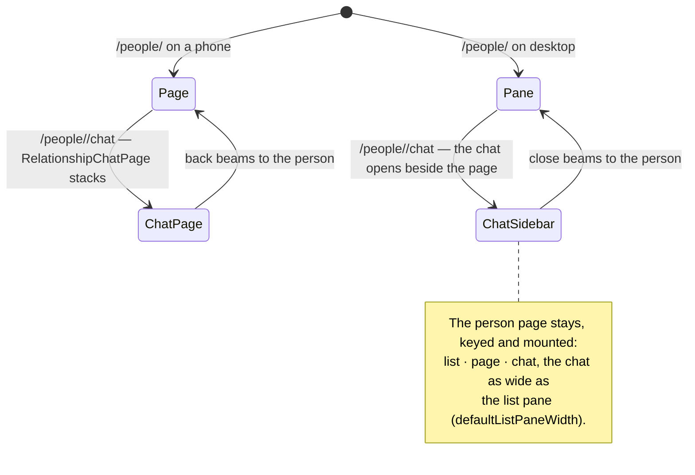

`RelationshipsLocation` writes `NavService.desktopRelationshipChatOpen` from
the URL's `/chat` segment and pushes the page only on phones, so the address
bar stays the single source of truth for both layouts and the desktop pane
never disagrees with it. On desktop the chat is a sidebar beside the person
page rather than a replacement for it (design panel 2026-09-19), so what the
agent is asked about stays in view; the phone route offers *Back*
(`onBack`), the sidebar *Close* (`onClose`). The page needs room of its own:
the sidebar docks only in a detail pane at least `chatSidebarMinDetailWidth`
wide (the sidebar plus as much again for the page). While the chat is open
and the People list would squeeze the page below that, the list steps aside,
without touching its stored preference. Where even the whole pane is
narrower, the chat takes the pane with *Back*, as on a phone. The pane carries no `Scaffold`
of its own — the phone route and the sidebar each supply one, which the
composer's field needs.

# Voice check-ins (plan v2 phase 6)

The person page's microphone opens the composer with `startSpeaking`, which
presses *Dictate* after the first frame. From there the recorder is a small
state machine, `CheckInSpeechPhase` in
[check_in_speech_state.dart](../../lib/features/relationships/ui/widgets/check_in_speech_state.dart),
each phase drawn in place of the note; a finished recording leaves the
machine as a take:

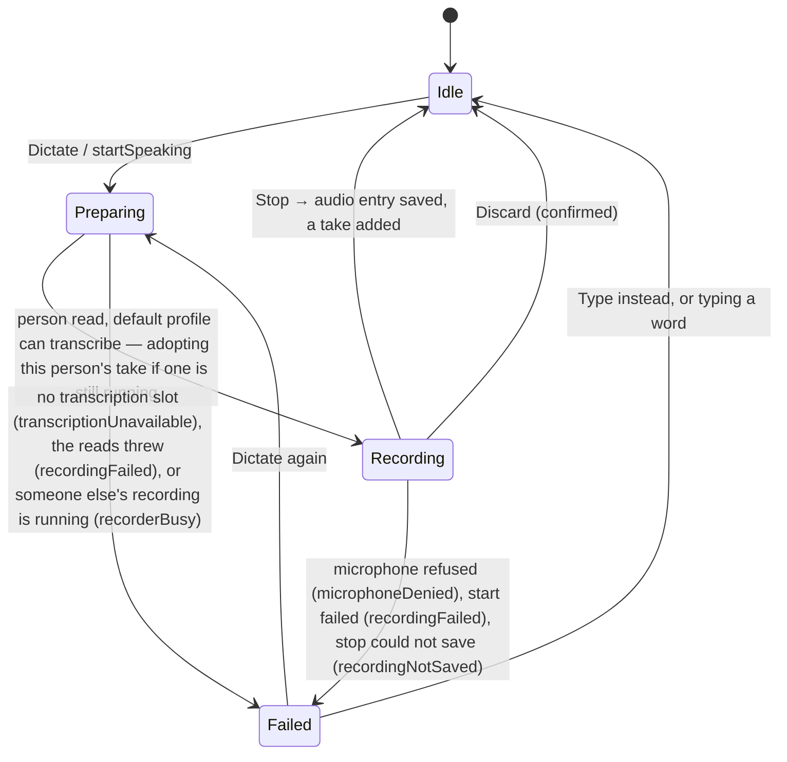

Each take then has its own words state, `CheckInTakeWords`:

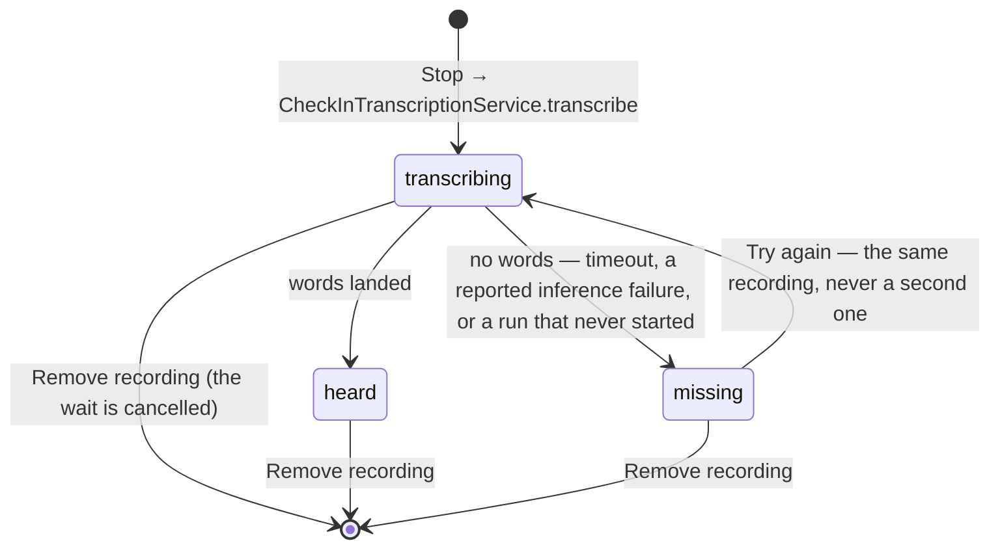

Saving does not look at that state. `_handleSave` creates the check-in with
the note, then `RelationshipRepository.attachEntriesToCheckIn` links every
take in the order it was made and touches the check-in once; a link that
fails is logged and the others go on, since a "save failed" would be
answered with a duplicate check-in. Words still on their way land on the
recording after the sheet has closed: the service's run is not the sheet's,
and once the words are read back it touches the check-in holding them
(`touchCheckInsHolding`), so the briefing catches up.

The recorder is [`CheckInInlineRecorder`](../../lib/features/relationships/ui/widgets/check_in_inline_recorder.dart),
embedded in the field rather than pushed as a sheet: a live level strip,
the running time in tabular mono figures on a fixed `h:mm:ss` shape (so the
tick never moves the controls beneath it), the line saying audio is on disk
as it goes, and Discard · Pause · Stop. It drives the app-wide
`AudioRecorderController` the way the recording sheet does — `record` on
mount with the person as `linkedId` and `transcriptionHandledByCaller`,
`stop` handing back the entry id and the length the clock stood at — and
hides the floating recording indicator while it is up. Being dismissed with
the sheet does not stop the recording (the recording sheet's own rule): the
composer's sheet brings the indicator back once it has closed, and the user
can stop it from there, the audio landing in the journal linked to the
person without a transcript. Reopening the composer while that take is
still running **adopts** it — the recorder attaches without calling
`record()`, which on a running recorder toggles it *off* — and a take
running for anyone else is refused with the *recorder busy* card, because
stopping it here would save someone else's audio wordless.

The recorder's typed refusal (`AudioRecordingFailure`) maps onto the
composer's own vocabulary, `CheckInSpeechFailure.fromRecorder`: a denied
microphone is the error card with *Open settings* (through
`checkInSettingsOpenerProvider`, the seam over `openAppSettings`) and
*Dismiss*; a failed start is the same card with *Try again*. Preparation
reads have a 15-second deadline and land in the same failed phase as
everything else.

A take's first line names the route while its words are on their way —
`Whisper large v3 · via Groq` — from `CheckInTranscriptionService.route()`,
model and provider names only, resolved after the wait has started so a
slow read never holds the transcript.
Spoken check-ins use only the system's selected default inference profile.
`CheckInTranscriptionService` calls `ProfileResolver.resolveDefaultProfile`,
which reads the device's selected profile id and resolves that profile. The
transcription model and provider must both resolve. There is no person/category
profile selection, provider ranking, model discovery, or fallback on failure.
Preflight refuses recording when the default cannot transcribe.

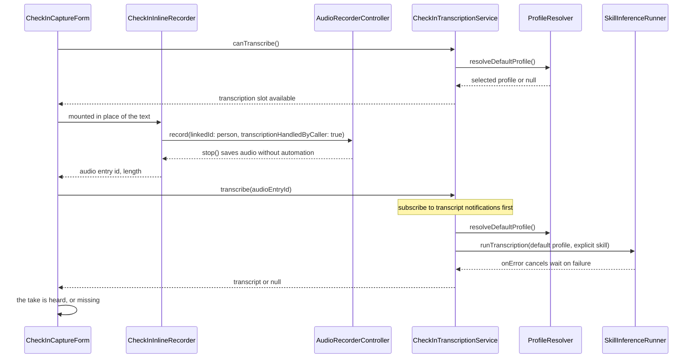

`transcriptionHandledByCaller` belongs to the recording, survives dismissal of
its sheet, and resets on stop/cancel. It suppresses the recorder's automatic
trigger without changing the shared speech-recognition preference. The service
owns the single explicit transcription request and passes no automated skill
assignment or linked task id, so it cannot start an automatic summary skill.
Ordinary audio keeps its existing automation policy. A new recording also
clears the previous category when its category is null.

The service subscribes to `UpdateNotifications.updateStream` before its first
read and re-reads the audio entry on notifications carrying its id. Blank text
means no transcript yet. The wait ends on text, missing configuration, inference
failure, database/notification failure, stream closure, cancellation, or the
five-minute `checkInTranscriptTimeout`. Disposing the form cancels the listener.

`SkillInferenceRunner` catches provider failures and reports them through its
`onError` callback and inference error controller. The callback ends the wait
promptly; the form also observes `inferenceErrorControllerProvider` with
`fireImmediately: true` to show the provider's error detail, including one
published before the listener was installed. The form keeps one wait and one
error watch per take, keyed by the audio entry id. A thrown resolution error
is also caught and ends the wait. No failure retries with another model or
provider.

Three invariants hold regardless of what comes back:

* **Nothing auto-saves.** A take is shown under the note; the check-in
  exists only once the user presses save. This is the same rule that keeps
  `CheckInSentiment` user-set (ADR 0038).
* **Speaking never touches typing.** The words are the take's, never merged
  into the note, so nothing typed is ever replaced and the agent reads each
  word once.
* **Save never waits for words.** `checkInSaveBlockOf` holds Save only for
  the recorder at work, an empty composer (no words and no take) or a save
  in flight. A transcript that is slow, or never comes, cannot cost the
  check-in.

Name accuracy comes from **correcting the transcript**, because the route
most people use cannot be biased: Melious' Whisper endpoints accept a
vocabulary `prompt` and ignore it (see
[speech dictionaries](ai/provider-routing.md#speech-dictionaries)).
`CheckInTranscriptionService.transcribe` takes the person's id and, while the
profile resolves, builds their known terms with
[`relationshipKnownTerms`](../../lib/features/relationships/model/relationship_speech_terms.dart):
the name, the nickname, the person's own `knownTerms` ("Names that come up" in
the form), then the names and nicknames of the other people in the same
category. Another person marked private contributes nothing, because the
terms leave the device with the recording; the subject always does. The
runner puts these ahead of the category's `speechDictionary` (read from the
audio entry's category, which the recording inherits from the person) and
corrects the finished transcript against both, so a misheard name reaches
the field already spelled the way the user writes it. A failed read of the
terms costs the correction, never the transcript.
# Reaching a user who has not opened the app (plan v2 phase 8)

A banner needs the app running. The case a check-in reminder exists for is the
opposite one — five weeks of not opening Lotti — so the OS has to be holding
the alarm before the app closes.

That makes the reminder a **projection of Phase A's verdict, not a second
producer**. Phase A already derives the cadence on the daily tick, on every
check-in write and on every relationship save; a separate event-driven service
(what ADR 0039 Decision 3 originally proposed) would have been a second source
of truth for "when is this person due", free to disagree with the banner and
the briefing. `RelationshipReminderSink` is the seam, declared in Phase A's own
file so the dependency runs one way: the service imports Phase A, and Phase A
never learns that `features/notifications` exists.

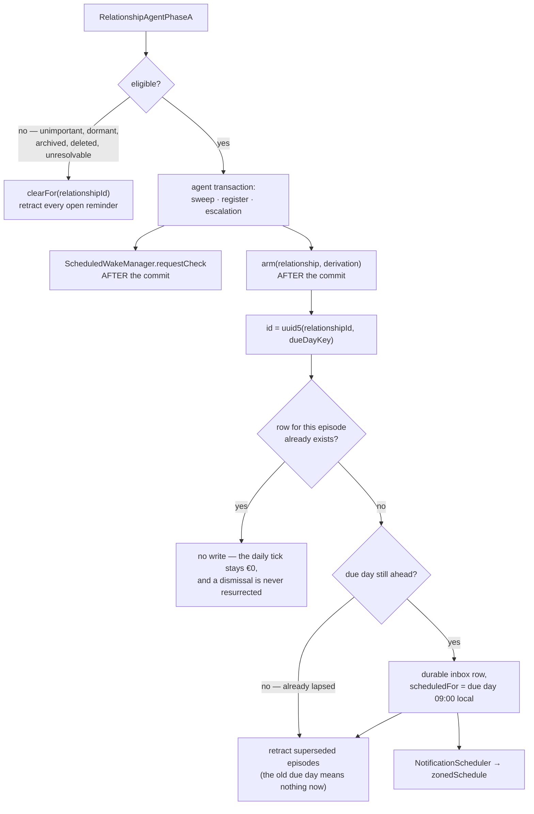

**The wake-manager nudge also waits for the commit.** `requestCheck` starts a
scan pass that runs un-awaited across many agent-database queries. Drift routes
a query to the transaction executor of the zone it is issued in, so a nudge
fired from inside the transaction closure hands the pass a transaction that has
closed by the time its later queries run — every before-scan maintenance hook
then fails with drift's "used after being closed" `StateError` in one burst.
Phase A therefore records whether an escalation was armed and nudges after
`runInTransaction` returns; the manager additionally runs every pass in the
zone it was started in (see [agents overview](agents/overview.md)).

**A due day already behind us earns no alarm.** `NotificationScheduler.schedule`
routes a past `scheduledFor` to `showNotificationNow`, so arming a lapsed
person would fire an OS banner on the spot — and the tick that first evaluates
a set of overdue people would fire one *per person*, duplicating the in-app
nudges that same tick raises. The banner channel already covers a device the
user is holding; this channel exists for the device they are not. The
retraction still runs on that path: whether or not an episode earns an alarm,
the ones it superseded must stop being armed.

Four properties carry the design:

- **The arm happens after the transaction commits, deliberately.** The row
  lives in `notifications.sqlite` behind its own vector-clock scope and outbox
  enqueue; running it inside the agent database's transaction zone would buffer
  a notification's sync messages against the commit of an unrelated store.
- **Identity is per episode, not per person.** The three lifecycle marks are
  monotonic and cannot be cleared, so one row per person would let an August
  dismissal permanently silence September. A check-in moves the due day, which
  mints a new episode and retracts the old one — which is also what cancels its
  OS alarm.
- **An existing episode is left exactly alone.** The producer runs on every
  tick; a plain upsert would bump `updatedAt`, enqueue an outbox message and
  re-notify listeners each time, and would resurrect a row the user dismissed.
  Everything derived from the episode key is already pinned by it, so an
  existing row is correct by construction — only the person's display name
  could drift mid-episode, and the next episode picks that up.
- **The sink never throws.** By the time it runs, the wake's real work — the
  cadence register — has already committed. Letting a notification-store
  failure escape would fail a wake that succeeded and schedule a retry of it,
  to fix an alarm the next daily tick re-derives anyway.

**One reminder per episode means an ignored person is reminded once.** The
episode key is the due day, and the due day only moves when a check-in lands —
so if the user never checks in, no second reminder is ever armed for that
person. That is the same anti-nag ceiling the banner escalation has, applied to
the OS channel, and it is deliberate: a reminder that repeats until obeyed is
the thing that trains people to switch reminders off. It is worth stating
because "reminder" reads as recurring, and the next person to touch this will
assume it is. Making it recur would mean rolling the episode key forward on
elapsed cadences rather than on check-ins.

The due day is a DST-safe *day key* (UTC midnight standing for a local calendar
day), not an instant, so the reminder hour is rebuilt from its calendar
components — reading it as an instant would fire the reminder at the user's UTC
offset instead of in their morning.

Withdrawing consent reaches the OS: un-marking `important`, going dormant or
archived, or a relationship that no longer resolves all retract the pending
rows on the next tick. Deletion cannot wait for that tick — destroying the
agent is what stops the ticks — so `RelationshipDetailsPage` fires the reminder
leg of the cascade directly, beside the agent leg.

Everything about how those rows then reach the OS — the Android story, startup
re-arming, why a reminder stays out of the bell until its due day, and why its
copy is baked at write time — is in [notifications](notifications.md).

# Privacy

Relationship data is the most sensitive class the app holds, because it
describes **third parties who never consented to being in it** (ADR 0037). It
stays on-device and syncs only through the user's own end-to-end encrypted
Matrix rooms.

`ContactChannel` values and `contactRefs` are **excluded from AI context**
(ADR 0041 §5) — they are plain snapshot data, entered manually on every platform
or copied from an OS contact, and no inference path reads them. `CheckInSentiment`
is likewise **user-set and never AI-filled** (ADR 0038); the executive briefing
grounds its health band in those explicit values first and treats prose as
secondary evidence.

The channel exclusion extends to logs: `UrlLauncherContactLauncher` reports a
failed quick action by **scheme only**, never the URI, because the URI *is*
the phone number.

# Contacts, quick actions and the post-call loop

Phase 7 (ADR 0041), Android and iOS only. Three invariants carry it:

- **One plugin boundary.** `contact_import_mapper.dart` is the only file that
  knows `flutter_contacts` types; everything above it works in
  `ImportedContact`, a plain record. That is what lets the import screen, the
  link action and their tests run in the pure-Dart VM. The mapper is also
  where a phone label becomes a channel *type*: mobile/iPhone/Apple Watch/MMS
  become `mobile` (call + message), everything else `phone` (call only), so a
  message composer is never opened onto a landline or a fax machine.
- **Copying is a union, never a replacement.** `mergeContactChannels` compares
  on type plus a punctuation- and case-stripped value, so `+1 (555) 010-9999`
  does not land beside `+15550109999`. A hand-typed handle the address book
  does not hold survives a re-link, and the person's `title` is never touched —
  someone renamed to "Mum" stays "Mum".
- **The two read paths differ in reach, and the wording has to.** "Link
  contact" calls `pickSingle()`, an OS picker that hands back exactly the one
  contact the user chose. The multi-select import calls `readAll()` — the
  whole address book, loaded into the app to render the selection list, with
  only the selected people persisted. Both are gated behind the runtime
  permission and neither reads in the background, but user-facing copy must
  say "reads your address book while the import screen is open" rather than
  "reads only the contacts you choose", which is true of the picker alone.
- **`contactRefs` are per-device.** The same person carries a different id in
  each address book — even on two phones running the same OS — so a ref
  written on one device reads as *unlinked* everywhere else rather than
  resolving to a stranger. The key is the platform plus this device's sync
  host id (`contactRefKeyForHost`), resolved via `contactRefKeyProvider`;
  the link action, the import and `refreshFromContact` all go through it,
  and a device whose host id is not yet provisioned stores no ref at all.

**The import screen is pushed above the shell, not into the tab.** It docks
its Import action in a `bottomNavigationBar`, and the mobile shell paints the
nav pill *over* each tab's page stack — so a plain `Navigator.of(context)`
push would leave the screen's primary action sitting behind the pill.
`bottomNavSafeNavigatorOf` is the existing seam for that (it returns the root
navigator on mobile and the nested one on desktop, where a sidebar drives
navigation and these pages overlay only their panel).

The post-call loop is a resume heuristic, not telephony (ADR 0041 D4). A
launched quick action writes one marker to `settings.sqlite` — **device-local
by construction**, since a call placed on a phone is not something the desktop
should prompt about, and the marker describes a device's behavior rather than
anything about the person. Exactly one marker is kept (most recent departure
wins) and it expires after `pendingInteractionTtl`, so a call from yesterday
does not greet the user the next morning. `PostInteractionPrompt` re-resolves
the person through the repository rather than trusting the marker: a person
deleted, or hidden while private entries are off, produces no prompt, because
naming them would leak that they exist. It only offers the marker of the
person whose page it is on. The offer asks rather than asserts — the marker
proves the dialer or the mail app opened, not that anyone answered — and names
its evidence under the question (`Did you reach Pip?` · `started 12:33 · about
11 min`). Its *Yes, log it* is a secondary button: the page's bar already
carries the one filled *Log check-in*, which opens the same composer. The
minutes it quotes travel into the capture sheet as `prefilledDuration` and
are persisted as the check-in's end time (`dateTo − dateFrom`, no schema
change), so the log's row shows the duration the offer promised; editing a
check-in keeps its length when the start time moves.

All three doors — the offer's answer and the page's own *Log check-in* and
*Dictate* — go through `openCheckInForPerson`, which claims the marker with
`PendingInteractionClaims.claimFor` (exclusive: two taps landing together get
one marker between them) and opens the composer describing the call, so it is
logged as that call whichever control the user reaches for. The elapsed
minutes are read before the claim, so clearing the marker cannot move them off
what the offer quoted. A composer closed without saving hands the claim back
(`release`, which writes the marker as it was, original start included), so a
stray swipe on a prefilled sheet does not lose the call; the offer returns
until it is logged, dismissed or expired. The offer
listens to the claim count and re-reads, which is how it stops asking (the
store is plain settings, with nothing to listen to). A marker about someone
else is neither used nor cleared. With no marker the composer starts from the
latest check-in's interaction type rather than always *In person*. Declining
is labelled *Dismiss*: it is permanent, which *Not now* did not say.

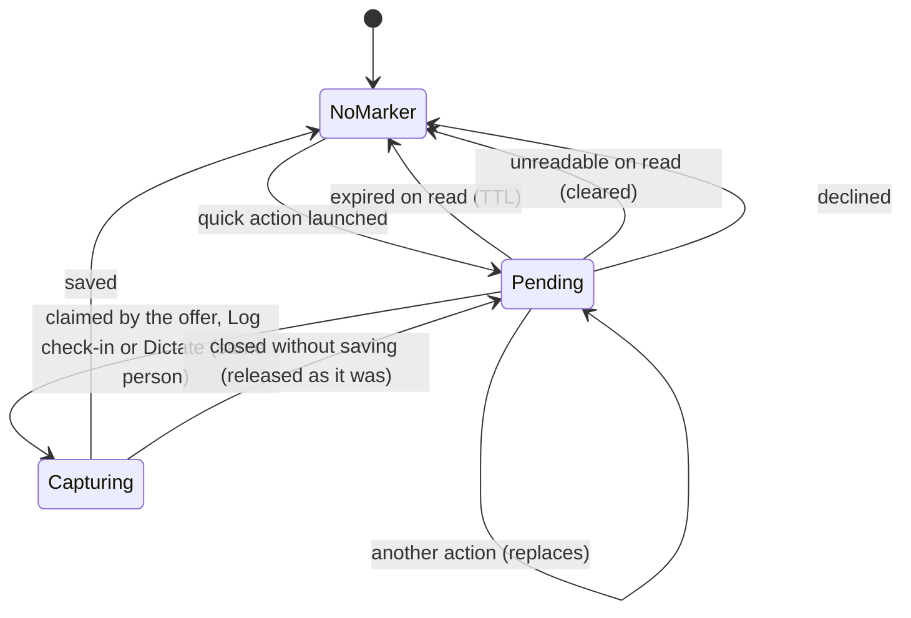

Two traps this code exists around, both found by test rather than review:
a provider written from `initState` (Riverpod rejects writes during build —
the import load is deferred a frame), and a `fullWidth` `DesignSystemButton`
in a `bottomNavigationBar`, whose content `Center` has no height factor and
silently fills loose constraints, collapsing the list above it. A `Row` is
not enough — its cross-axis constraints are merely loose; a vertical `Flex`
passes unbounded main-axis constraints, under which the same `Center`
shrink-wraps.

# Related

* [JournalEntity](../domain/journal-entity.md) - the union both variants join, and the `subtype` denormalization pattern.
* [Entry links](../domain/entry-links.md) - the `RelationshipLink` variant and why one type can span two endpoint kinds.
* [Projects](projects.md) - the feature this one mirrors in status shape, flag gating and tab structure.
* [Persistence](../architecture/persistence.md) - how `updateDbEntity` writes, notifies and enqueues sync.
