A person the user deliberately tracks is a `JournalEntity.relationship`; each
logged interaction with them is a `JournalEntity.checkIn`. Both ride the journal
table, so sync, categories, the `private` flag, export and purge apply with **no
new infrastructure and no schema change** (ADR 0038 decision 4).

**The visible experience is gated by `enableRelationshipsFlag`.** With it off,
`NavService` yields no People destination and the `/people` beamer delegate is
never mounted; the entities and their queries still exist, so a device that
syncs relationships in with the flag off stores them and shows nothing.

Relationships and check-ins are deliberately **absent from the journal
timeline**: `entryTypes` — the filter set the journal page queries with — lists
neither `Relationship` nor `CheckIn`. `JournalCard` still renders both, because
the card's `switch` over the sealed union is exhaustive and would not compile
otherwise; those branches are reachable only from linked-entry surfaces.
The exclusion extends to **global search, deliberately**: FTS title
extraction indexes neither variant, so a person's name is unfindable
outside the People tab — a privacy posture (ADR 0037: relationship data
describes third parties), not an oversight. The People list itself is short
by design and needs no local search.

# Bound twice, on purpose

A check-in is tied to its relationship through **two independent mechanisms**,
and neither is redundant:

| Binding | Written by | Read by |
|---------|-----------|---------|
| `RelationshipLink` row in `linked_entries` | `PersistenceLogic.createLink` | the generic linked-entries machinery, and future link-only consumers |
| `CheckInData.relationshipId`, denormalized into the journal `subtype` column by `toDbEntity` | `RelationshipRepository.createCheckIn` | every query this feature runs, and `affectedIds` |

The denormalized copy is what makes "check-ins for this person" an **indexed
`type` + `subtype` filter** instead of a link traversal — the
`HabitCompletionData.habitId` precedent. It is also what lets a check-in's
`affectedIds` emit the relationship id as a precise token, so the detail
provider reloads on a check-in write without subscribing to anything else.

The link row is the part that will matter later, and the part the delete cascade
deliberately leaves behind — see [what the cascade does not
reach](#what-the-cascade-does-not-reach).

**One `RelationshipLink` type serves two endpoint kinds.** The same type binds a
relationship to its check-ins *and* to its linked tasks, so a link row alone does
not say which it is. `RelationshipRepository.getLinkedTasks` therefore reads the
typed link rows, then resolves the task subset through
`JournalDb.getLiveTasksByIds`, which filters on the indexed journal `type`
column — a person's whole check-in history is never deserialized only to be
discarded. Scoping the read to `RelationshipLink` also keeps it in step with
`unlinkTask`, which removes exactly that type: a task surfaced through some
other link type would render an unlink action that could never succeed.

# A person's two images

`RelationshipData` carries an **avatar** (`avatarImageId` + `avatarCrop`) and a
**banner** (`bannerImageId` + `bannerCropX`). Both ids point at ordinary
`JournalImage` entries.

**The avatar renders.** `PersonaAvatar` has four faces, decided by
`avatarImageId` and what its file is doing: no photo (the tinted initial,
pixel-for-pixel what shipped before); the photo inside a ring of the persona
accent; the ThumbHash stand-in inside the ring while the file is still
syncing; and the initial inside the ring when the id is known but nothing can
be drawn yet. Nothing ever shows an empty circle, and the accent is the same
hash as before, so a photo never changes anyone's colour. Every surface that
draws a person — the People row, the person hero, the import review — goes
through this one widget, so all three got the photograph at once. The ring is
`spacing.step1` at every size: the design's 3 px at 80 would have needed a
token spacing does not have.

**Choosing the avatar.** Tapping the hero avatar (only while the band is
open — a folded hero's faded avatar takes no taps) opens the avatar sheet:
the privacy line, *Choose from library*, and once there is a photo *Adjust
crop* and *Remove photo*. The flows live in `AvatarPhotoActions`, whose only
dependencies are the two repositories and the two surfaces it opens, handed
in as functions — so pick → crop → write, and backing out at either step, is
a plain unit test. Three rules are load-bearing:

- **Cancelling writes nothing, even after the picker ran.** The picker has to
  import the picture before the crop surface can show it, so an entry already
  exists when the user sees *Use photo*; cancelling there deletes that entry
  again. `AvatarPhotoActions.choose` owns this.
- **The crop surface commits nothing.** `showAvatarCropSheet` resolves to the
  framing or null; the caller writes. Its preview *is* a `PersonaAvatar`, so
  the preview and the list cannot disagree, and its gesture arithmetic is
  `AvatarCropGeometry` — the renderer's model written out — whose "the circle
  is never empty" invariant is a property test.
- **Removing clears the reference and keeps the entry**, the task cover-art
  precedent (`setCoverArt(null)`): taking a picture off a person is not
  deleting it from the journal.

**The banner renders — direction 2b.** With `bannerImageId` set, the hero
becomes two stacked strips: the photograph takes the toolbar and the upper
band, and the wash keeps a bar exactly one toolbar tall at the bottom of its
band, which the avatar overlaps as before. `PersonHeroAppBar` resolves the
banner *above* its sliver through `JournalImageResolver` (a component in a
sliver slot returns the sliver), so the file's arrival rebuilds the hero; the
ThumbHash stand-in shows under the same scrim meanwhile, and an id with
nothing to show is the wash exactly as without a banner. Three things are
fixed on purpose:

- **The chrome goes photo-neutral** (`PhotoNeutralGlass`, hand-authored in
  `photo_chrome_tokens.dart`): the theme's ink is near-black in the light
  theme and would vanish on a picture, so every glass action, the back
  button and the kebab take black-at-45 % glass and a white glyph whenever a
  banner is drawn — in both themes.
- **The scrim's extent is pixels, not a fraction of the current strip.**
  `PhotoScrim` darkens the top 70 % of the strip *at rest*; folding, the bar
  goes first, then the strip shrinks to the toolbar — and the scrim, fixed,
  still covers the toolbar row, which is what keeps the swapped-in name and
  the actions legible over an arbitrary picture at every scroll position.
- **The decode is bounded to the strip at rest**, so scrolling never re-keys
  the picture through the image cache.

Nothing *chooses* a banner yet: that is the form's Photo card, after this.

The field they replaced, `coverArtId`, was declared with the rest of the model
and never written by anything, so it was **removed rather than migrated** — no
payload on any device carries the key, and a field whose name says "cover art"
would have lied about a person's portrait.

Three properties are load-bearing and easy to break:

- **The image must be *linked* to the person.** `JournalRepository`'s image
  delete finds referencing entities with `getLinkedToEntities(imageId)`, so an
  avatar created without `linkedId` set to the relationship would survive its
  own image's deletion as a dangling id. The link is also what makes the image
  inherit a private person's `private` flag through `createDbEntity`.
- **Framing is clamped on both sides.** `AvatarCrop.fromJson` and
  `cropFractionFromJson` clamp what sync delivers; `RelationshipImageFraming`
  clamps what this device writes, applied by `RelationshipRepository`'s create
  and update paths. Neither side alone is enough: a peer can send anything, and
  a local gesture can compute anything.
- **The bytes arrive after the entity.** An id syncs in one message and its file
  in another, so every surface that draws one of these needs a defined
  appearance for "id known, file not here yet". `JournalImageResolver` owns
  that loop — resolve the entry, watch the filesystem, hand the host the file
  or the ThumbHash or nothing — for every picture-of-an-entry surface;
  `PersonaAvatar` and the task cover thumbnail are two hosts of it.

Neither image ever enters agent context, for the same reason contact channels
do not — see [Privacy](#privacy).

# Recency without an N+1

The People list sorts by "most recently interacted with", falling back to
`meta.dateFrom` (when tracking started) for a person with no check-in yet, so a
freshly added person lands at the top rather than the bottom.

Computing that naively is one query per person. Instead
`JournalDb.latestCheckInTimes` runs **a single `GROUP BY subtype` aggregate**
over `type = 'CheckIn'` rows, returning `relationshipId → MAX(dateFrom)` for the
whole table at once. The list also needs *what* the last contact was, so
`latestCheckIns` resolves that aggregate to its rows in **one further query** —
the ids and the instants as `IN` lists, the exact `(subtype, dateFrom)` pair
kept on the raw row before deserialising — and `getRelationshipsByRecency`
joins the result in Dart as `RelationshipListItem.lastCheckIn`. Every half
routes through `_queryWithPrivateFilter`, so a hidden check-in does not leak
into recency ordering or into the status line.

# The People list and the desktop split

The list (design 2026-09-06 §2–3) is three bands in display order — **Due**
(enrolled, cadence lapsed), **On track** (enrolled, not lapsed), **Not
enrolled** (not important, or dormant/archived) — each most-recent contact
first, under a summary card that counts the due against the enrolled, names
who lapses next and on which day, and counts the not-enrolled. *Enrolled*
means `important` **and** active: the consent switch alone does not enrol a
dormant person (ADR 0039).

All of that is pure logic in
[`ui/model/people_list_model.dart`](../../lib/features/relationships/ui/model/people_list_model.dart)
— bands, the truthful pill (`{n} days over` when lapsed, `Due {weekday}`
within seven days, `On track`, `Not enrolled`, `Dormant`, `Archived`), the
summary — covered by Glados properties (partition, per-band order,
order-invariance, band⇔pill agreement, summary⇔bands agreement). The widgets
(`PeopleListRow`, `PeopleSummaryCard`) only render what the model says; the
row's status line composes the interaction label, the mono timestamp and the
cadence label, and never "Tracking since …".

On desktop `RelationshipsPage` is the Tasks/Projects list-detail split:
`RelationshipsLocation` mirrors the URL's person id into
`NavService.desktopSelectedRelationshipId` and pushes no detail page, the list
pane takes the shared pane-width controller, and the right pane hosts the
person's page or the empty state. The route stays the single source of truth —
tapping a row still beams to `/people/<id>`, and the page's back control
beams to `/people` to clear the selection (on a phone it pops). While the
list pane is folded away, the page's hero carries the control that brings it
back, so nothing is overlaid on the page's own chrome. The chat stacks as
its own page on every layout. Phones keep the list alone.

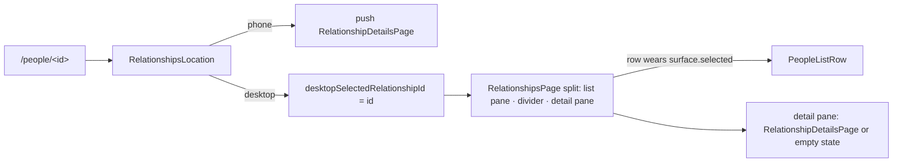

# The person page

`RelationshipDetailsPage` (design 2026-09-06 §2–3) is one `CustomScrollView`
in the design's order, above a sticky glass action bar in the Scaffold's
`bottomNavigationBar` slot with `extendBody` so the bar blurs what scrolls
under it — the task page's shape, on purpose:

| Sliver | Widget | Notes |
|---|---|---|
| Hero | [`PersonHeroAppBar`](../../lib/features/relationships/ui/widgets/person_header.dart) | A pinned `SliverPersistentHeader` of its own, not a `SliverAppBar`: the avatar hangs half its diameter below the header, and every layer of an app bar clips that overflow. Slivers paint back to front, so the earlier header paints its overhang over the block scrolling under it. The name appears in the bar only once the wash band has folded (`AnimatedSwitcher`, never an invisible duplicate). |
| Header block | `PersonHeaderBlock` (same file) | Eyebrow · name · one-liner · pills. The pills come from the list model's rules, so the page and the list never disagree about *due*; the cadence pill names the **effective** cadence (`effectiveCadenceDaysOf`), i.e. the runtime default when none is set. The health band comes from the same `currentRelationshipReport` rule the briefing card uses. |
| Briefing | `RelationshipBriefingCard` | Only when enrolled or a briefing exists; the page reads the report too, so the gap after the card is deterministic. |
| Next time | `NextTimeCard` in [`person_page_cards.dart`](../../lib/features/relationships/ui/widgets/person_page_cards.dart) | From the latest check-in's *pay attention to* / *avoid*; `NextTimeCard.hasContent` is the one visibility rule, shared with the page. |
| Post-call offer | `PostInteractionPrompt` | Renders nothing until a marker exists (below). |
| Check-ins | [`CheckInsCardSliver`](../../lib/features/relationships/ui/widgets/check_ins_card.dart) | A `DecoratedSliver` wearing `DesignSystemSectionCard.decoration`, so the unbounded log stays lazy inside a card that matches the boxed ones. Rows supply their own `Material` — there is no card Material above them in a sliver. |
| Reach · Tasks | `ReachCard`, [`LinkedTasksCard`](../../lib/features/relationships/ui/widgets/linked_tasks_card.dart) | Reach only with channels. |

Every section, the check-in sliver and the action bar sit on
`detailContentInsets` — the rule `DetailContentWidth` itself is built on: the
content gutter plus, on a desktop-wide window, the centring that caps the
column at `kDetailContentMaxWidth` **within the width the caller has**. Both
the page and the bar measure that with a `LayoutBuilder`, because on the
split the detail pane is narrower than the window and centring on the window
would over-inset it. Exposed as a function because a sliver and a
`bottomNavigationBar` cannot be children of that widget.

The [action bar](../../lib/features/relationships/ui/widgets/relationship_action_bar.dart)
resolves its third control once when built: the first channel, in the
person's own order, for which `ContactLauncher.canLaunch` answers yes — a
call on a phone, email on a desktop with a mail client, nothing where neither
exists — and launches it through the same `launchContactAction` the Reach
rows use, so the post-call marker is written the same way from both.

# Status lifecycle

`RelationshipStatus` mirrors `ProjectStatus` in shape: a sealed union whose
variants each carry their own `id`, `createdAt` and `utcOffset`, with the
replaced instance appended to `statusHistory`. The form mints a new instance
**only when the kind actually changed**, so re-saving a person without touching
the status picker does not grow the history.

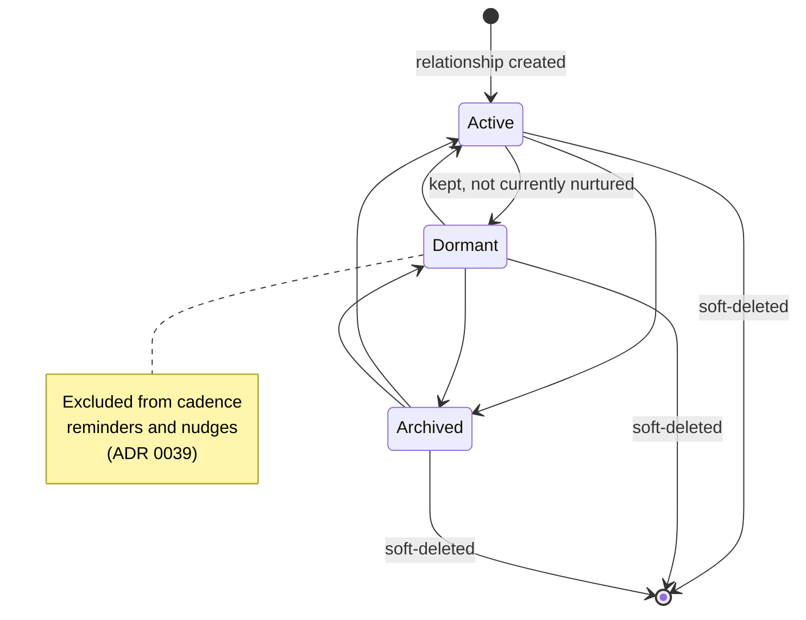

The picker offers all three kinds in every direction, so every transition above
is reachable; there is no ordering constraint in the model. `important` is a
**separate** switch — the single consent gate for proactive behaviour — and
`checkInCadenceDays` is only meaningful alongside it.

# Deleting a person

Deletion is a soft delete, like everywhere else in the journal, and it
**cascades to the person's check-ins** so no orphaned record of a third party
survives (ADR 0037 §5).

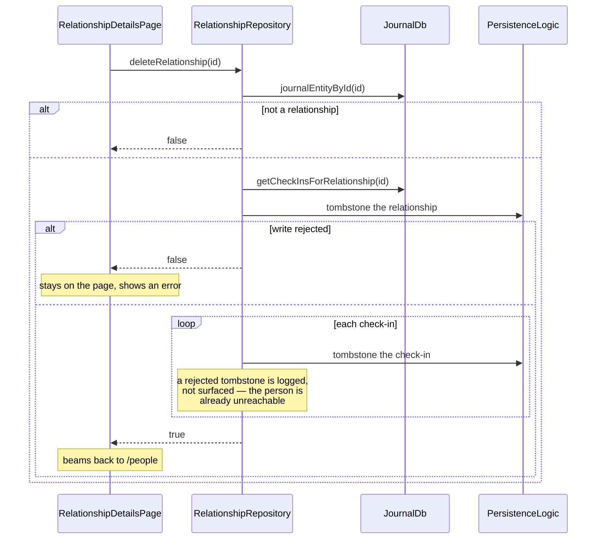

**The relationship is tombstoned first, deliberately.** An interruption
mid-cascade then reads as "gone" rather than "live with a partially deleted
timeline" — and because check-ins are resolved through `subtype` rather than
link traversal, once the relationship is gone no list or detail query reaches
them.

Every tombstone checks its result. `PersistenceLogic.updateDbEntity` answers
`false` when the vector-clock comparison loses to a concurrent sync and `null`
when it swallowed an exception, and neither may be reported to the caller as a
deletion — the page would navigate away from a person who is still there.

## What the cascade does not reach

- **The `RelationshipLink` rows.** The app's generic delete model leaves link
  rows to consumers, which already filter on the endpoint's `deletedAt`. A
  future link-only consumer would have to handle these tombstones itself.
- ~~Anything from later phases.~~ Since plan v2 phase 4 the cascade HAS an
  agent leg: the delete handler fires
  `RelationshipAgentService.handleRelationshipDeleted`, which destroys the
  agent identity through the shared `destroyAgent` lifecycle, cancels its
  pending and running wakes, and drops its subscriptions. The agent's own
  rows (registers, later reports and nudges) remain under the destroyed
  identity for audit, like every destroyed agent. The leg is fire-and-forget
  and contained — a failed teardown never fails the delete the user watched
  succeed.

  That "runtime maintenance repairs the rest" is a real mechanism, not a
  hope: `RelationshipRuntimeMaintenance.beforeWakeScan` resolves each active
  relationship agent's watched person before healing anything, and tears the
  identity down when the person is deleted or gone. It has to, because the
  delete surfaces are not the only path — the generic journal delete
  (a deep link to the entry, the journal detail page) reaches
  `RelationshipRepository.deleteRelationship` without the agent leg at all.
  A missing agent→relationship link is the creation race, not a deletion, and
  never reaps.
- ~~Pending OS reminders.~~ Since plan v2 phase 8 the delete surface also
  retracts them (ADR 0037 §5). This one cannot be left to the next Phase A
  tick the way the eligibility cases are, because destroying the agent is
  precisely what stops those ticks — an alarm armed weeks ago would otherwise
  still fire, naming someone the user deleted.

# In-app refresh: no private notification channel

Neither provider needs a feature-specific notification token. `affectedIds`
already carries **the entity's own id** plus a per-kind constant, and
`updateDbEntity` emits that set unconditionally:

| Write | Tokens emitted | Woken by |
|-------|----------------|----------|
| relationship create/edit/delete | `{relationshipId, RELATIONSHIP}` | list via `RELATIONSHIP`, detail via the id |
| check-in create/edit/delete | `{checkInId, relationshipId, CHECK_IN}` | list via `CHECK_IN`, detail via the relationship id |
| link/unlink task | `{relationshipId, taskId, LINK}` | detail via the relationship id |

That holds for synced writes too, which is the reason it is worth stating: a
manual notification emitted next to the repository call would be redundant on
the local device and absent on the remote one. `RelationshipDetailController`
additionally remembers the ids of the tasks its last build saw, so a title or
status edit **on the task side** refreshes the section without a relationship
write.

`unlinkTask` is the one place that notifies by hand, because
`JournalDb.deleteTypedLink` is a raw row delete with no entity write behind it.
It is not routed through `JournalRepository.removeTypedLink`, which notifies
unconditionally per call: the two-direction removal here would emit two
notifications even for a no-op unlink.

# The deterministic agent tier (plan v2 phase 4)

Marking a person `important` is the consent switch AND the creation trigger:
the form's save path lazily mints one durable `relationship_agent` per person
with a **deterministic id** (`relationship_agent:<relationshipId>`), so two
devices marking the same person converge on one agent instead of duplicates.
Identity, `agentRelationship` link and the first cadence wake land in one
transaction; the agent leaves creation subscribed and with one immediate €0
evaluation queued. Re-entry on an existing agent is a fast path with one
write-through: a renamed person's title refreshes the identity's
`displayName` (the chat page titles itself from the stored identity), while
everything else is returned untouched.

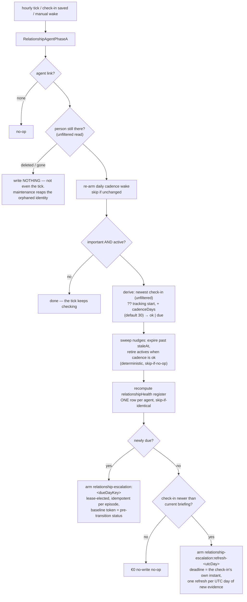

Four decisions keep multi-device runs convergent (ADR 0059 Decision 2):

- **Every runtime read ignores the private-display filter** — the check-ins
  (`getAllCheckInsForRelationship`) and the person herself
  (`getRelationshipByIdUnfiltered`): hiding an entry is a display
  preference, and devices with different settings must derive the same
  register. The gated `getRelationshipById` is the UI's read, and using it
  in the runtime silently un-tracks a private person on whichever device
  hides private entries.
- **Every derived day is a UTC calendar day.** The due day is
  `UTC-day(referenceAt) + cadenceDays`, computed with calendar components
  rather than a `Duration` — UTC has no DST, so the arithmetic is exact and
  the answer is the same in every timezone. Deriving it through the device's
  local calendar is not cosmetic: the register's `dueAt` would differ per
  device, so two peers would rewrite it at each other on every sync, and the
  episode key below would mint one escalation per timezone and pay for the
  same lapse twice.
- **The register is recomputed wholesale, never accumulated**, carries the
  vector clock of the row it read, and is skipped entirely when identical —
  so the uneventful daily tick is a true no-write no-op.
- **Escalations are per-episode** (`relationship-escalation:<dueDayKey>`,
  lease-elected via the shared `requiresLease` predicate): devices arming
  the same lapse write identical records, a consumed episode is never
  re-armed, and a check-in landing mid-episode moves the due day into a NEW
  episode. The baseline trigger token preserves "newly due" vs. "still
  due" — unreconstructable from storage once Phase A's own register write
  lands in the same transaction.

The agent's subscription is a single token: check-ins carry a denormalized
`relationshipId` that `affectedIds` emits (the table above), so one
`matchEntityIds = {relationshipId}` covers the person and every check-in,
draining immediately because the tier is free.

Escalation arms on **two facts, not one**, and each fact has its own
episode family. The cadence newly lapsing arms
`relationship-escalation:<dueDayKey>` at the due day (already past). A
check-in landing after the current briefing (`reportStale`) arms
`relationship-escalation:refresh-<utcDay>` with the check-in's own instant
as the deadline — immediately due, so "log a call, get a fresh briefing"
does not wait out the next cadence lapse. The families are deliberately
separate: an early-fired refresh consuming the lapse episode's record would
let per-episode idempotence suppress the real lapse escalation. Refresh
episodes are keyed to the newest check-in's UTC day, debouncing to at most
one refresh inference per day of new evidence; when a tick sees both facts,
only the lapse episode arms — its run regenerates the briefing anyway.

# The LLM tier (plan v2 phase 5)

The wake router (`relationship_agent_providers.dart`) splits three ways: a
`relationship-chat-message:<id>` token runs
`RelationshipAgentWorkflow.executeUserMessage`, a fired escalation or
`relationship-report-refresh` token runs the full workflow, and everything
else stays in Phase A. The workflow is the goal Phase B shape with the goal
machinery it does not need (spec versions, revisions, proposal review)
removed:

- **€0 gates before inference.** A non-interactive run re-derives the armed
  fact and returns success without touching a provider when it no longer
  holds — the wake fired, the world moved on, nothing to say. A missing
  provider re-arms the escalation instead of consuming the episode.
- **`RelationshipFactsRenderer` is the whole ground truth.** Bounded (last
  10 check-ins, 400-char narrative excerpts) and — the ADR 0041 §5 boundary
  — its `render` signature has **no channel parameter**, so contact
  channels are structurally absent from model context, not filtered out.
- **Four tools, accumulated then persisted once.** `reply_to_user`,
  `update_relationship_report`, `create_relationship_ad`,
  `snooze_relationship_ad` accumulate in the strategy; `persistOutputs`
  writes one transaction, fenced on the person still existing and still
  important. The briefing lands as an `AgentReportEntity` whose provenance
  carries the health band + rationale + confidence
  (`RelationshipReportProvenanceKeys`, parsed fail-closed by
  `relationship_health_metrics.dart`).
- **The standing head advances by DUE DAY, not by wall clock.** Report rows
  accumulate as history; the `agentReportHead` row is what the UI reads. It
  is stamped with the due day's last instant once that day is over (the
  wall clock while the day still runs), so two lease-elected devices
  finishing different overdue episodes resolve under generic LWW by the
  episode rather than by who wrote last — and it refuses to advance at all
  when the currently published briefing carries a NEWER `dueDayKey`, which
  LWW alone cannot prevent for a delayed escalation running locally. This
  mirrors `GoalAgentWorkflow`'s `_headTimestamp` / `headMayAdvance` pair.
- **Everything through the outbox is inside the failure path.** The
  non-interactive FACTS message is persisted inside the guarded region, so
  a failed outbox flush returns `WakeResult(success: false)` like any other
  failure — the conversation is deleted, the attribution envelope closed,
  and the consumed escalation re-armed, rather than the exception escaping
  `execute` past all three.
- **At most one banner per wake, deterministically.** The ad id is
  `relationshipAdId(agentId, runKey)` (uuid v5), so a retried wake
  overwrites rather than duplicates; a dismissal today opens a quiet
  window the workflow refuses to post into, and a live banner is never
  doubled. Active banners surface through the kind-agnostic nudge channel
  (`activeRelationshipNudgesProvider`, registered at bootstrap) on all
  surfaces, tapping through to `/people/<id>` — the resolved ADR 0059 open
  question.
- **Chat turns are durable before the wake.** `RelationshipChatService`
  persists the user turn, then enqueues a manual wake whose trigger token
  carries the message id; a failed wake surfaces that id so retry
  re-enqueues the same turn instead of re-persisting it. The awaited
  completion is bounded at both ends: the orchestrator closing its
  completion stream (shutdown, runtime teardown) fails the turn rather than
  leaving the caller on a future that can no longer complete, which would
  strand the composer disabled.
- **One resolution chain, first resolvable wins.**
  `resolveRelationshipAgentModel` routes inference through the person's own
  profile (`RelationshipData.profileId`), then the agent config's profile,
  then the **default profile of the person's category** (the `JournalDb`
  read the automation resolver uses for a spoken check-in's transcript), then
  the validated default model (ADR 0040 Decision 6, ADR 0059 Decision 7).
  The category step is the one an ordinary setup actually reaches: no screen
  pins a profile on a person and agent creation sets none, so without it a
  user who routes the category through their own profile had no route at
  all and "Brief me" failed with a generic toast. A dangling id at any step
  falls through to the next.
- **Disclosure fails closed.** The "Brief me" card resolves the agent's
  model to a provider name through that same chain; a cloud provider is
  named in a consent dialog first (ADR 0037), and an unresolvable profile is
  treated as cloud. The relationship read is unfiltered — Phase B resolves
  through the person's own profile whatever this device's private-entry
  display preference, so the dialog must see the same row — and a route that
  resolves to nothing at all throws (the card surfaces the failure and logs
  the reason) rather than reading as "local, proceed silently".

## The briefing wears the shared AI panel

`RelationshipBriefingCard` is not a relationship-shaped card; it is the
**same "intelligence" panel** as the task agent's section on Task Details and
the goal agent's read — `aiCardDecoration` chrome, `TldrHeader` identity
(sparkle badge, title, agent display name, tap → `AgentInternalsPanel`), and
`TldrBody` for the report prose. Three consequences follow from that reuse
rather than from any relationship-specific code:

* The briefing renders as **Markdown** (`AgentMarkdownView` → `GptMarkdown`).
  Phase B writes headings, bold and lists; before the panel was shared, the
  card printed them as literal `##` and `**`.
* *Read more* / *Show less* and *Open agent internals* are the same control,
  in the same place, with the same behaviour as on a task. `TldrBody` takes a
  `disclosureKey` so a failing expectation still names the surface it fired
  on; everything else is shared verbatim.
* Retuning the wash, border or radius happens once in `ai_card_chrome.dart`
  and lands on all three surfaces together.

What the briefing does NOT borrow is the task footer's settings zone. Its
band carries only the two things this panel can do — the per-person chat and
"Brief me".

The health band pill (`DsPill`, tinted with the band colour) sits in the card
**body**, above the prose it qualifies — deliberately not in the header's
trailing rail where the goal card keeps freshness and cost. That rail is
capped at half the header width and its child ellipsizes: measured against
real font metrics, "Braucht Aufmerksamkeit" already truncates on a 320 px
phone at 1.0x text scale, and English "Needs attention" truncates at 1.6x.
Truncating the card's headline judgement to make room for its own title is
the wrong trade, so the pill takes the full content width instead. A widget
test pins both halves: the label is whole at 320 px / German / 1.3x, *and*
the pill is wider than the rail cap would have allowed — so the assertion
cannot pass by the label happening to be short.

Two small seams made the reuse possible rather than a fork:

* `TldrHeader` grew an optional `title` — the briefing is the same panel
  wearing a different noun, not a second header widget — and its trailing
  slot is named `trailing`, since two of its three hosts put meta there
  rather than a TTS control.
* `resolveReportTldr` / `resolveReportAdditional` live beside `TldrBody` and
  answer "what is the summary" and "what goes behind Read more" once, for
  every report card. They were duplicated per card before, and the copies had
  already drifted: only one of them suppressed a Read more whose full text
  merely repeated the TLDR.

The briefing agent is **named after the person it watches**
(`RelationshipAgentService` sets `displayName` to the relationship title and
keeps it in sync on rename), and the card sits under an app bar already
carrying that name — so the header suppresses the subtitle when the two are
equal. A name that has diverged is still shown: there it carries information
the app bar does not.

## The relationship agent card

The card on the person page (design 2026-09-06 §4) is the same AI panel as
the task agent's section and the goal agent's read — `aiCardDecoration`,
`TldrHeader` (tapping it opens the internals), `TldrBody` for the prose — in
one of seven faces. The face is a pure function of the runtime's own signals,
[`relationshipAgentCardStateOf`](../../lib/features/relationships/ui/widgets/relationship_briefing_card.dart),
so the decision is a table rather than a widget tree:

| Face | When | Header meta · body · footer |
|---|---|---|
| Not enrolled | not `important`, or dormant/archived | plain section card, no sparkle · what *important* turns on · **Mark important** (or the status word while paused) |
| No briefing | enrolled, no current report | `agent watching · no run yet` · how many check-ins *Brief now* would read, and that it never sees a channel · `Next look {day}` · **Brief now** |
| Running | `agentIsRunningProvider` | `writing the briefing…` · `Reading N check-ins…` · `Running · started HH:mm` |
| Failed | `consecutiveFailureCount > 0` and the last wake is newer than the report | `last run failed · HH:mm` · the reason, with the fix as the action: **Choose a model** when no route resolves, **Try again** otherwise |
| Current | report, not stale | `as of {ago} · {tokens} tokens` · TL;DR + Read more · `Up to date` · **Update now** |
| Out of date | `AgentStateEntity.isReportStale` | same meta · body · `Out of date · new check-in {day}` in warning · **Update now** |
| Due | any briefing face while the cadence is lapsed | the cadence pill turns warning · footer becomes *Log check-in* · **Call {name}** (the first channel the platform can open, resolved like the action bar's) |

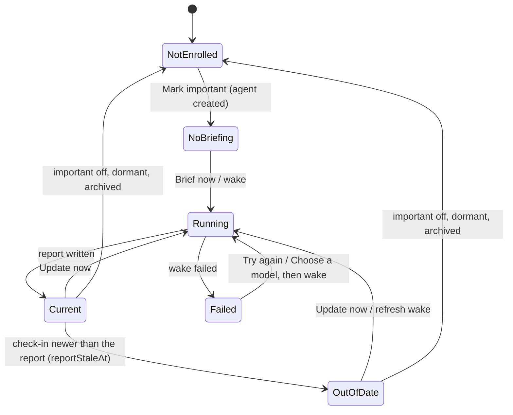

Two runtime details keep the faces honest. Every relationship wake now
stamps its state row (`_stampWakeOutcome` in the workflow): `lastWakeAt`
either way, and `consecutiveFailureCount` reset on success or bumped on
failure, including a wake that found no model to run on and returned before
inference — before this, no relationship wake ever wrote either, so the
failed face could never appear and the internals' Stats tab never knew the
last wake. And the card arms one timer at the next minute/hour/day boundary of the
briefing's age (`untilNextAgeBucket`, shared with the goal page), so "as of
just now" does not stay on screen for hours. *Mark important* on the plain
card also mints the agent through `ensureAgentForRelationship`, the same
lazy-create call the edit form makes.

The chat entry lives in the page's hero. There is no *Automatic updates*
switch, because the relationship runtime never reads
`AgentConfig.automaticUpdatesEnabled`. Task proposals appear below the TL;DR
and above the footer, including when a later wake fails. Their scope and
confirmation path are described below.

The pills are the header block's own: [`relationshipCadencePill`](../../lib/features/relationships/ui/widgets/person_header.dart)
renders the list model's cadence fact under a per-host key prefix, and the
health band pill shares `relationshipHealthBandColor`. The cost pill sums
`agentTokenUsageSummariesProvider`; the "as of" meta uses the shared
[`relativeAgoLabel`](../../lib/utils/relative_age_label.dart).

## Deferred task suggestions

[`relationship_agent_contract.dart`](../../lib/features/relationships/workflow/relationship_agent_contract.dart)
exposes `create_and_link_task` as a deferred tool. It requires an explicit
commitment, a quoted description, a structured `sourceCheckInId`, and a reason;
`dueDate` is optional and must be a real calendar date. The renderer includes
check-in IDs in its ten-entry window and the relationship-scoped `PROPOSALS`
ledger. Pending, confirmed and rejected decisions therefore feed the next wake;
contact channels remain outside FACTS. The strategy accepts only IDs from that
rendered window, deduplicates source/title pairs, and queues at most three tasks.

The workflow persists those items inside its existing output transaction,
rechecking that the person is live, important and active. A deterministic
agent/run change-set ID prevents a retry overwriting decisions. A fresh ledger
read suppresses structural and display duplicates. The historic `taskId` column
stores the relationship ID: the ledger already supports arbitrary subjects,
so no schema migration is involved. Paraphrase suppression remains an LLM
policy; deterministic dedup cannot recognize every equivalent commitment.

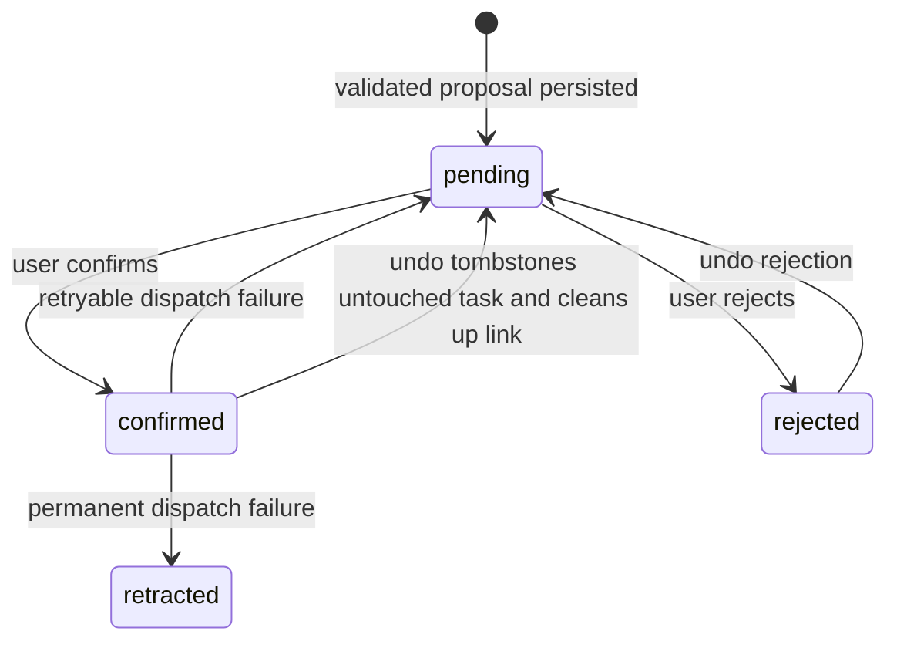

[`relationship_tool_dispatcher.dart`](../../lib/features/relationships/workflow/relationship_tool_dispatcher.dart)
is the only apply path. It rechecks visible evidence, its quoted narrative,
and current consent; creates a task with the person's category, inherited
privacy (also preserving private evidence), evidence link and proposed due
date; then links it to the person. A link failure tombstones the new task only
if it is unchanged and has no live links. A refused compensation is
non-retryable, preserving tasks already edited or linked by another writer. The shared
category-default assignment helper provisions its task agent. The task has a
stable UUID derived from the person, source check-in, title and quoted
commitment, so the same synced proposal confirmed on two devices converges on
one journal row despite different clocks. The task-creation facade accepts
this explicit identity and preserves its existing insert-only write contract.
A live task found under that identity is linked without overwriting it or
creating a fresh undo receipt from potentially edited data. Reconfirmation
after undo restores the tombstoned identity with a vector clock descended
from the tombstone. An active, visible relationship link in either direction
turns a duplicate refusal or a thrown post-write error into success without a
new undo receipt.

[`relationship_proposal_service.dart`](../../lib/features/relationships/service/relationship_proposal_service.dart)
wraps the generic confirmation service. The exact creation snapshot is stored
under `_relationshipTaskReceipt` on the user decision's args, leaving immutable
proposal args and fingerprints unchanged. It supplies the durable task
navigation destination and guards undo against task edits. Undo checks the
task and additional journal links before removal. The dispatcher repeats the
exact snapshot and allowed-link checks inside the journal write transaction,
then tombstones the untouched task; the service cleans up its relationship
link afterward. Undo allows only the originating person’s relationship links;
compensation allows no live links, including hidden links. Link changes do not
advance the task’s vector clock, so clock comparison alone cannot guard this
operation. This protects local writes and peer changes already received, not
changes still offline on another device. A refused deletion leaves the live task
linked. Failed link cleanup is logged and leaves only a link to a tombstoned
task, which relationship task queries exclude; it does not undo the successful
deletion or reopen an unsafe compensation path.
Malformed or absent receipts disable confirmed-task undo. A receipt write
failure after successful creation is logged and keeps confirmation successful;
the local receipt remains usable, but its destination/undo may be unavailable
after restart until a durable receipt exists. Cross-database confirmation and
journal writes are not one atomic transaction.

[`relationship_proposal_providers.dart`](../../lib/features/relationships/state/relationship_proposal_providers.dart)
reads the agent/person ledger and receipt decisions. Ledger entries carry their
originating run key from the existing query, avoiding a per-history-row read. The band retains previous
async data and resolving rows while their shared task-card animations finish.
It folds after three pending rows, offers bulk confirmation only for a single
kind, keeps per-row buttons and swipes inert during bulk writes, links evidence
to the check-in editor, and provides handled history and
undo. Confirmation briefly highlights the created task in the Tasks card.
It does not use the task-specific `ChangeSetNotificationService`.

The shared chat projection carries each reply's `runKey`.
[`relationship_chat_pane.dart`](../../lib/features/relationships/ui/widgets/relationship_chat_pane.dart)
uses the existing attachment slot to render the same band filtered to that
run, including its handled history. Card and chat act on the same decisions.
Call scheduling and task-note proposals remain separate follow-up work; this
tool does not create Daily OS blocks or OS reminders.

## The check-in capture sheet

`showCheckInCaptureSheet` and `showCheckInEditSheet` ([check_in_capture_sheet.dart](../../lib/features/relationships/ui/widgets/check_in_capture_sheet.dart))
open one form (design 2026-09-06 §5) in the responsive modal — a bottom sheet
on a phone, a dialog on desktop — in the order the design argued for: how it
felt (the sentiment chips, optional) → what you talked about (the narrative,
with *Speak instead* beside it) → when and how long (the type chips, a
*Started* tile and a *Duration* tile) → *More*, folded, for the topics and the
two next-time fields; it opens unfolded when the check-in being edited already
carries any of them. Save is pinned. The form has no actions of its own: after
each frame it publishes `save`, `delete` and `canSave` through a
`CheckInFormHandle` (a `ChangeNotifier`), and `CheckInStickyActions` in the
modal's sticky bar renders from it — Save held while a save or a transcript is
in flight, Delete only while editing, bottom-left on the desktop dialog.

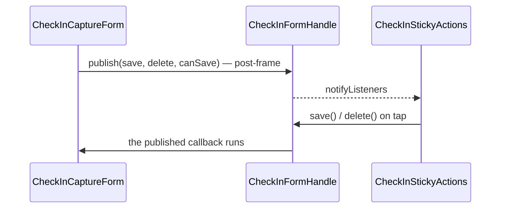

*Started* opens the date picker, then the time picker; the tile reads
`Now · HH:mm` while the value is the current minute and the relative day plus
the time otherwise. *Duration* opens `showCheckInDurationPicker`
([check_in_duration_picker.dart](../../lib/features/relationships/ui/widgets/check_in_duration_picker.dart)):
ranked quick picks over the shared wheel, *Clear* meaning no duration. The
ranking ([`checkInDurationSuggestionsControllerProvider`](../../lib/features/relationships/state/check_in_duration_suggestions_controller.dart))
reads `getRankedCheckInDurations` — `dateTo − dateFrom` in whole minutes over
the last 90 days, private check-ins excluded while private entries are
hidden, most-used first and ties shortest first — tops a thin ranking up from
the design's positions (5 · 10 · 15 · 20 · 30 · 45 min · 1 h · 1 h 30 · 2 h ·
3 h) without repeating a value, and sorts the six chips shortest-first; the
wheel is the design's *Custom*. The length persists as the end time (no
schema change), which is what the log row shows. Opened from the post-call
offer, the sheet is prefilled with the type, the start time and the elapsed
minutes, and a source strip above the sentiment row names them —
`Call · 12:33 · about 11 min` — followed by the sentence saying where they
came from.

The picker is design-system property: [`showDurationPicker`](../../lib/features/design_system/components/time_pickers/duration_picker_modal.dart)
and [`DurationQuickPickChips`](../../lib/features/design_system/components/chips/duration_quick_pick_chips.dart)
carry the shape — a host-named title, host-worded chips, Done committing a
*changed* wheel, Clear committing zero, a chip popping before it writes — and
the task estimate picker is the other host (see the
[tasks data model](tasks/data-model.md#pickers)).

## The person form, the import review and the chat

Three surfaces finish the redesign (design 2026-09-06 §6), and all three say
the same thing in the same words: what *important* turns on, and where a
phone number does not go.

**The form** ([relationship_form_modal.dart](../../lib/features/relationships/ui/widgets/relationship_form_modal.dart))
groups into three `DesignSystemSectionCard`s — **Who** (name, nickname, the
category, and while editing the status), **Important** (the consent switch,
one line saying what it enables, and the cadence presets *only* once it is
on), **How to reach them** (the channel editor under the same privacy line
the page's Reach card carries). The category is a name beside a 10px colour
dot rather than a second large avatar competing with the person's own;
clearing it goes through the picker's own no-category row, so one component
owns what the choices are. Like the capture sheet, the form draws no actions:
it publishes `save` and `canSave` to a `RelationshipFormHandle` and
`RelationshipFormStickyActions` renders them in the modal's pinned bar, which
is what keeps Save reachable over three cards of fields.

*Add channel · or from contacts* is one row with two doors. The manual one is
on every platform (ADR 0041 §2); the address book appears only where there is
one, and it **picks without persisting** — `ContactsService.pickSingle` hands
back an `ImportedContact` whose channels become ordinary editable draft rows,
deduplicated against what is already typed. That is the difference between it
and the detail page's *Link contact*, which writes: a form that saved behind
its own Save button would lose the edits still in its fields.

**The import review** ([contact_import_page.dart](../../lib/features/relationships/ui/pages/contact_import_page.dart))
names the count and the boundary in its subtitle ("2 selected · numbers stay
on this device"), gives each chosen contact a persona avatar, and reveals the
cadence presets under a person only once they are marked important — a
cadence on an unimportant person is never evaluated. Its switch copy says
what importance turns on, never that leaving it off keeps the person out of
AI entirely: a chat, an explicit briefing and a dictated check-in all reach a
model for anyone.

**The chat** is a pane, not only a page.
[`RelationshipChatPane`](../../lib/features/relationships/ui/widgets/relationship_chat_pane.dart)
is the shared `AgentChatView` under an identity header — sparkle, "<name> ·
briefing agent", and the line naming the boundary the agent works within
(ADR 0041 §5) — with *Agent internals* labelled where there is room and an
icon where there is not. It has two hosts, and the layout decides which:

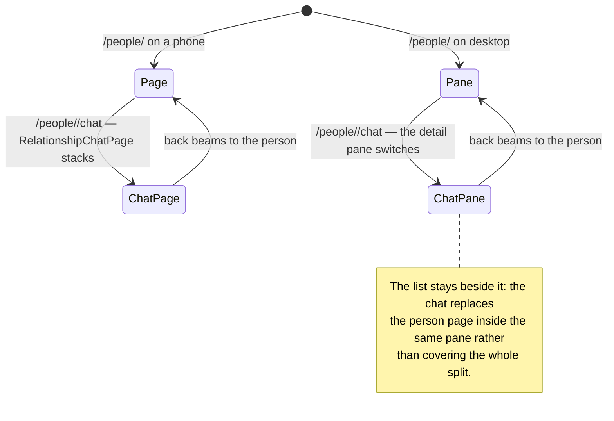

`RelationshipsLocation` writes `NavService.desktopRelationshipChatOpen` from
the URL's `/chat` segment and pushes the page only on phones, so the address
bar stays the single source of truth for both layouts and the desktop pane
never disagrees with it. The pane carries no `Scaffold` of its own — the
phone route and the detail pane each supply one, which the composer's fields
need.

# Voice check-ins (plan v2 phase 6)

The capture sheet's "Speak check-in" records through the shared recording
sheet and hands the transcript back to the user to edit. The hard part is not
the UI: it is that **automated transcription used to be task-shaped**.

`ProfileAutomationService.tryTranscribe` and `ProfileAutomationResolver` took
a `taskId`, resolved the agent through `TaskAgentService.getTaskAgentForTask`,
and read `profileId` only off `Task.data`. A recording linked to a person hit
every one of those and declined silently — no profile, no transcription, no
wake. Phase 6 replaces the task with a **subject**: any journal entity that
can own an agent, a profile and a category.

Three seams carry the generalization:

* `SubjectAgentResolver` (`agents/service/subject_agent_lookup.dart`) walks
  `subjectAgentLinkTypes` — task, project, event, relationship, in that order
  — and returns the agent behind the first link type present. A link that
  points at an unloadable agent yields `null` rather than falling through, so
  a broken link can never attach a foreign agent to an entity. `agentDay` is
  deliberately excluded: a day agent's subject is a date key, not something a
  recording hangs off.
* `subjectProfileIdOf` (`ai/state/profile_automation_providers.dart`) reads
  the profile a subject stores in its own payload, per variant —
  `Task.data.profileId`, `ProjectData.profileId`,
  `RelationshipData.profileId`. Everything else in the resolver was already
  kind-agnostic: the category lookup reads `meta.categoryId`, which every
  variant has.
* `AutomaticPromptTrigger` withholds `linkedTaskId` from non-task subjects.
  That parameter feeds both `buildTaskDetailsJson` *and* the consumption
  record's `taskId`, so passing a person's id there would file the spend
  against a task that does not exist. The trigger resolves the entity once and
  passes the id only when it really is a task.

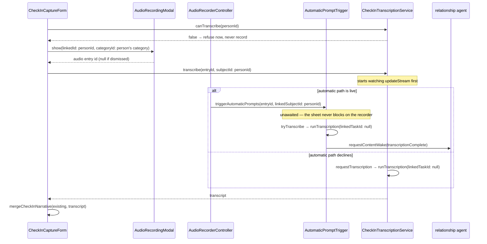

**Who runs the transcription is the subtle part.** The recorder fires
`AutomaticPromptTrigger` on every stop, and that path is gated on
`ProfileAutomationService._categoryAllowsAutomation` — the category's
automatic-inference switch. That gate is documented as the consent for
spending tokens *without a user gesture*, and pressing "Speak check-in" is a
gesture. Leaning on it alone made the feature refuse for a reason unrelated to
the request: a person filed under **no category** can never pass it, whatever
models are configured, so their spoken check-in silently never ran.

`CheckInTranscriptionService` therefore owns the decision. It asks
`hasAutomatedSkillType` whether the automatic path will run; if it will, it
stands aside and only waits, and if it will not, it calls
`ProfileAutomationService.requestTranscription` — the same resolution minus
the consent gate — and runs the skill itself. Exactly one run happens either
way, so a spoken check-in is never billed twice. `canTranscribe` is the
render-time counterpart: it answers "could *either* path produce words", and
the sheet refuses **before** recording when neither can, rather than capturing
audio for a transcript that can never arrive.

The sheet and the run are **not** connected by a return value, so the service
bridges the gap by subscribing to `UpdateNotifications.updateStream` *before*
its first read (a transcript landing between the two is not missed) and
re-reading the audio entry on every notification carrying its id. An empty
`entryText` reads as "not yet", because the audio entry's own creation
notification arrives long before any run finishes. The wait ends four ways:
the transcript arrives; the run resolves no model, which cancels the wait
immediately; the run *fails*; or `checkInTranscriptTimeout` (5 minutes)
expires. `CheckInTranscriptWait.cancel` is the manual exit, called from the
sheet's `dispose` so a dismissed sheet stops re-reading the database.

**The failure exit needs two signals, because one run is not always ours.**
`SkillInferenceRunner.runTranscription` wraps its whole body in
`_withStatusTracking`, which catches every exception, logs it, publishes it
on `inferenceStatusControllerProvider` / `inferenceErrorControllerProvider`
and then **returns normally**. It does not throw, and a failed run writes no
`entryText` — so to a waiting caller a provider outage is indistinguishable
from a slow model. An HTTP 503 used to mean five minutes of "Transcribing…"
followed by a generic "no transcript came back":

* `runTranscription` takes an **`onError` hook**, threaded to the
  `_withStatusTracking` parameter that already existed. The service passes
  `onError: (_) => onNothingToRun()`, so the run *it* starts ends the wait the
  moment it fails. This is the only signal available in pure Dart, and the
  service's own `catch` is not it — that block only sees failures raised
  *before* `_withStatusTracking` is entered.
* When the recorder's automatic path owns the run instead, the service never
  called it and no hook fires. `CheckInCaptureForm` therefore watches
  `inferenceErrorControllerProvider` for the audio entry through
  `ref.listenManual`, cancelling the wait on the first non-empty detail. That
  controller is set by **whichever path ran**, so it covers both, and it
  carries the provider's verbatim reason (`HTTP 503 · Melious · …`) into the
  toast rather than a generic refusal. `listenManual` does not fire for the
  current value, which is what keeps a stale detail from an earlier recording
  from aborting the run the user just started.

Task and journal audio never had this problem: `entry_details_page` and
`task_details_page` mount `AiRunningDecoderBars`, which already listens to the
same error controller and raises a toast. The check-in sheet is the surface
that waits on the transcript itself, so it is the surface that has to.

The recording sheet's own **speech-recognition opt-out** is one more exit.
`tryTranscribe` checks it before anything else, so unchecking it means no run
at all — and `hasAutomatedSkillType`, the pre-flight probe, cannot see it. The
sheet therefore re-reads `AudioRecorderState.enableSpeechRecognition` after
the recorder closes (the controller keeps the choice past `stop`) and skips
the wait outright, rather than holding "Transcribing…" for five minutes to
reach the answer the user already gave.

Two invariants hold regardless of what comes back:

* **Nothing auto-saves.** The transcript populates the text field;
  the check-in exists only once the user presses save. This is the same rule
  that keeps `CheckInSentiment` user-set (ADR 0038).
* **Speaking never destroys typing.** `mergeCheckInNarrative` appends below
  existing text, blank-line separated, so a second recording adds to the
  account rather than replacing it.

Name accuracy comes from the **category's `speechDictionary`**, not from
anything relationship-specific: the recording is created with the person's
`categoryId`, and `PromptBuilderHelper.getSpeechDictionaryTerms` reads the
audio entry's own category, sending those terms as provider context bias and
injecting them into the transcription prompt.
# Reaching a user who has not opened the app (plan v2 phase 8)

A banner needs the app running. The case a check-in reminder exists for is the
opposite one — five weeks of not opening Lotti — so the OS has to be holding
the alarm before the app closes.

That makes the reminder a **projection of Phase A's verdict, not a second
producer**. Phase A already derives the cadence on the daily tick, on every
check-in write and on every relationship save; a separate event-driven service
(what ADR 0039 Decision 3 originally proposed) would have been a second source
of truth for "when is this person due", free to disagree with the banner and
the briefing. `RelationshipReminderSink` is the seam, declared in Phase A's own
file so the dependency runs one way: the service imports Phase A, and Phase A
never learns that `features/notifications` exists.

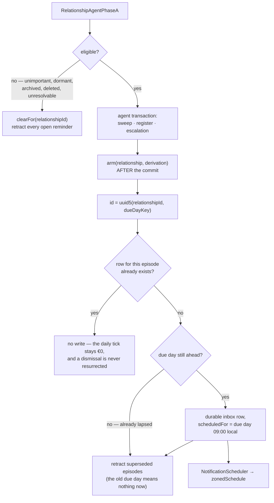

**A due day already behind us earns no alarm.** `NotificationScheduler.schedule`
routes a past `scheduledFor` to `showNotificationNow`, so arming a lapsed
person would fire an OS banner on the spot — and the tick that first evaluates
a set of overdue people would fire one *per person*, duplicating the in-app
nudges that same tick raises. The banner channel already covers a device the
user is holding; this channel exists for the device they are not. The
retraction still runs on that path: whether or not an episode earns an alarm,
the ones it superseded must stop being armed.

Four properties carry the design:

- **The arm happens after the transaction commits, deliberately.** The row
  lives in `notifications.sqlite` behind its own vector-clock scope and outbox
  enqueue; running it inside the agent database's transaction zone would buffer
  a notification's sync messages against the commit of an unrelated store.
- **Identity is per episode, not per person.** The three lifecycle marks are
  monotonic and cannot be cleared, so one row per person would let an August
  dismissal permanently silence September. A check-in moves the due day, which
  mints a new episode and retracts the old one — which is also what cancels its
  OS alarm.
- **An existing episode is left exactly alone.** The producer runs on every
  tick; a plain upsert would bump `updatedAt`, enqueue an outbox message and
  re-notify listeners each time, and would resurrect a row the user dismissed.
  Everything derived from the episode key is already pinned by it, so an
  existing row is correct by construction — only the person's display name
  could drift mid-episode, and the next episode picks that up.
- **The sink never throws.** By the time it runs, the wake's real work — the
  cadence register — has already committed. Letting a notification-store
  failure escape would fail a wake that succeeded and schedule a retry of it,
  to fix an alarm the next daily tick re-derives anyway.

**One reminder per episode means an ignored person is reminded once.** The
episode key is the due day, and the due day only moves when a check-in lands —
so if the user never checks in, no second reminder is ever armed for that
person. That is the same anti-nag ceiling the banner escalation has, applied to
the OS channel, and it is deliberate: a reminder that repeats until obeyed is
the thing that trains people to switch reminders off. It is worth stating
because "reminder" reads as recurring, and the next person to touch this will
assume it is. Making it recur would mean rolling the episode key forward on
elapsed cadences rather than on check-ins.

The due day is a DST-safe *day key* (UTC midnight standing for a local calendar
day), not an instant, so the reminder hour is rebuilt from its calendar
components — reading it as an instant would fire the reminder at the user's UTC
offset instead of in their morning.

Withdrawing consent reaches the OS: un-marking `important`, going dormant or
archived, or a relationship that no longer resolves all retract the pending
rows on the next tick. Deletion cannot wait for that tick — destroying the
agent is what stops the ticks — so `RelationshipDetailsPage` fires the reminder
leg of the cascade directly, beside the agent leg.

Everything about how those rows then reach the OS — the Android story, startup
re-arming, why a reminder stays out of the bell until its due day, and why its
copy is baked at write time — is in [notifications](notifications.md).

# Privacy

Relationship data is the most sensitive class the app holds, because it
describes **third parties who never consented to being in it** (ADR 0037). It
stays on-device and syncs only through the user's own end-to-end encrypted
Matrix rooms.

`ContactChannel` values and `contactRefs` are **excluded from AI context**
(ADR 0041 §5) — they are plain snapshot data, entered manually on every platform
or copied from an OS contact, and no inference path reads them. `CheckInSentiment`
is likewise **user-set and never AI-filled** (ADR 0038); the executive briefing
grounds its health band in those explicit values first and treats prose as
secondary evidence.

The channel exclusion extends to logs: `UrlLauncherContactLauncher` reports a
failed quick action by **scheme only**, never the URI, because the URI *is*
the phone number.

# Contacts, quick actions and the post-call loop

Phase 7 (ADR 0041), Android and iOS only. Three invariants carry it:

- **One plugin boundary.** `contact_import_mapper.dart` is the only file that
  knows `flutter_contacts` types; everything above it works in
  `ImportedContact`, a plain record. That is what lets the import screen, the
  link action and their tests run in the pure-Dart VM. The mapper is also
  where a phone label becomes a channel *type*: mobile/iPhone/Apple Watch/MMS
  become `mobile` (call + message), everything else `phone` (call only), so a
  message composer is never opened onto a landline or a fax machine.
- **Copying is a union, never a replacement.** `mergeContactChannels` compares
  on type plus a punctuation- and case-stripped value, so `+1 (555) 010-9999`
  does not land beside `+15550109999`. A hand-typed handle the address book
  does not hold survives a re-link, and the person's `title` is never touched —
  someone renamed to "Mum" stays "Mum".
- **The two read paths differ in reach, and the wording has to.** "Link
  contact" calls `pickSingle()`, an OS picker that hands back exactly the one
  contact the user chose. The multi-select import calls `readAll()` — the
  whole address book, loaded into the app to render the selection list, with
  only the selected people persisted. Both are gated behind the runtime
  permission and neither reads in the background, but user-facing copy must
  say "reads your address book while the import screen is open" rather than
  "reads only the contacts you choose", which is true of the picker alone.
- **`contactRefs` are per-device.** The same person carries a different id in
  each address book — even on two phones running the same OS — so a ref
  written on one device reads as *unlinked* everywhere else rather than
  resolving to a stranger. The key is the platform plus this device's sync
  host id (`contactRefKeyForHost`), resolved via `contactRefKeyProvider`;
  the link action, the import and `refreshFromContact` all go through it,
  and a device whose host id is not yet provisioned stores no ref at all.

**The import screen is pushed above the shell, not into the tab.** It docks
its Import action in a `bottomNavigationBar`, and the mobile shell paints the
nav pill *over* each tab's page stack — so a plain `Navigator.of(context)`
push would leave the screen's primary action sitting behind the pill.
`bottomNavSafeNavigatorOf` is the existing seam for that (it returns the root
navigator on mobile and the nested one on desktop, where a sidebar drives
navigation and these pages overlay only their panel).

The post-call loop is a resume heuristic, not telephony (ADR 0041 D4). A
launched quick action writes one marker to `settings.sqlite` — **device-local
by construction**, since a call placed on a phone is not something the desktop
should prompt about, and the marker describes a device's behavior rather than
anything about the person. Exactly one marker is kept (most recent departure
wins) and it expires after `pendingInteractionTtl`, so a call from yesterday
does not greet the user the next morning. `PostInteractionPrompt` re-resolves
the person through the repository rather than trusting the marker: a person
deleted, or hidden while private entries are off, produces no prompt, because
naming them would leak that they exist. The offer names its evidence — the
channel, how many minutes ago, when it started and about how long it has been
(`You called Pip 11 minutes ago — log it while it is fresh?` · `started
12:33 · about 11 min`) — so it reads as "log the call you just had". The
minutes it quotes travel into the capture sheet as `prefilledDuration` and
are persisted as the check-in's end time (`dateTo − dateFrom`, no schema
change), so the log's row shows the duration the offer promised; editing a
check-in keeps its length when the start time moves.

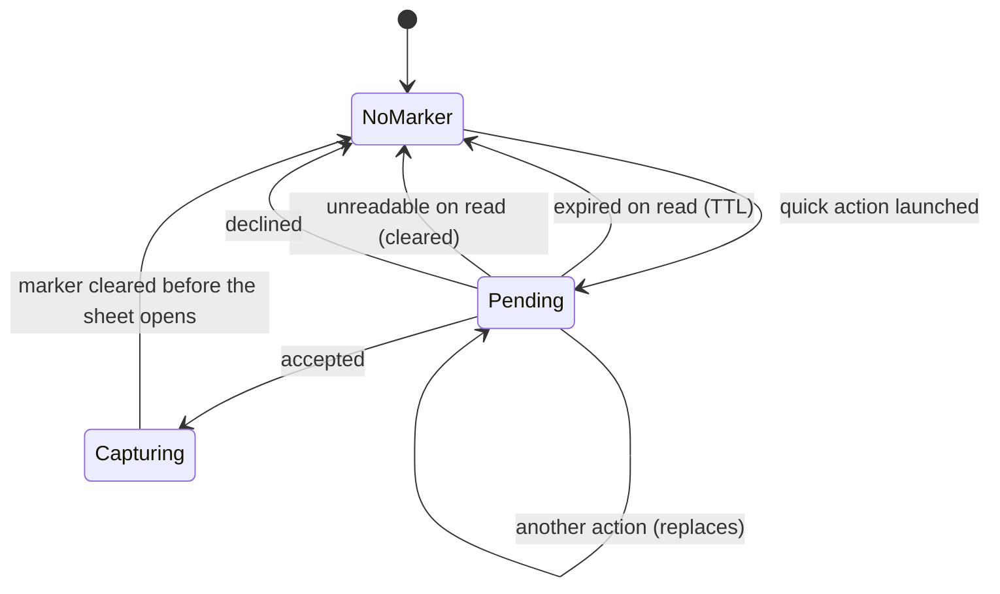

Two traps this code exists around, both found by test rather than review:
a provider written from `initState` (Riverpod rejects writes during build —
the import load is deferred a frame), and a `fullWidth` `DesignSystemButton`
in a `bottomNavigationBar`, whose content `Center` has no height factor and
silently fills loose constraints, collapsing the list above it. A `Row` is
not enough — its cross-axis constraints are merely loose; a vertical `Flex`
passes unbounded main-axis constraints, under which the same `Center`
shrink-wraps.

# Related

* [JournalEntity](../domain/journal-entity.md) - the union both variants join, and the `subtype` denormalization pattern.
* [Entry links](../domain/entry-links.md) - the `RelationshipLink` variant and why one type can span two endpoint kinds.
* [Projects](projects.md) - the feature this one mirrors in status shape, flag gating and tab structure.
* [Persistence](../architecture/persistence.md) - how `updateDbEntity` writes, notifies and enqueues sync.
