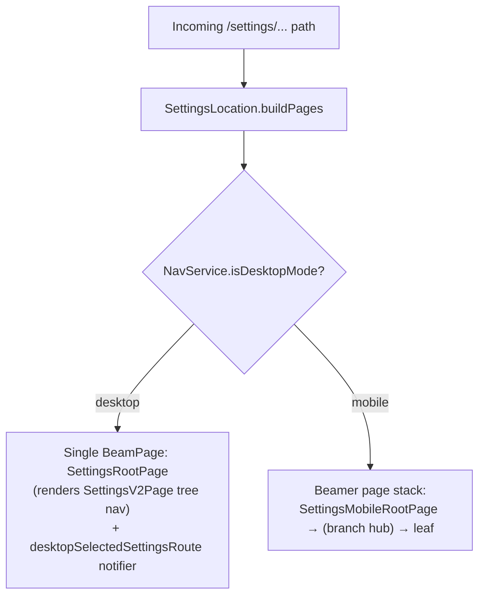
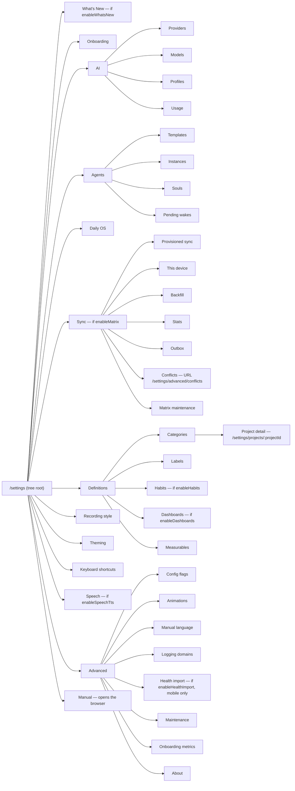

# From one tree to two page stacks

This feature owns the **shell**: turning a `/settings/...` URL into pages, and
giving every definition editor the same list/detail frame. The menu it renders is
not its own — the landing list and the section hubs read the declarative tree
defined in [`settings_v2`](settings_v2.md), which is also where the reason for
having one lives.

What this concept describes is what happens next: the same tree becomes two
different page stacks.

**Desktop pushes exactly one page.** Instead of stacking, it stores the sub-route
in `NavService.desktopSelectedSettingsRoute` and routes detail content into the
right-hand pane through that `ValueNotifier`.

**Mobile builds real stacks, not single pages.** Parent pages stay in the Beamer
stack so a back tap walks up one level at a time. `SettingsMobileRootPage` is
always first; for the three branches that are **pure navigation** —
`definitions`, `advanced` and `sync` — a `SettingsMobileBranchPage` hub is also
pushed and **stays beneath** the leaf, making it a true drill-down. The sync hub
is the same page wrapped in `SyncFeatureGate`. AI and Agents are the exception:
each has its own landing page (`AiSettingsPage` and its agents counterpart) and is
opened directly.

Each of the three hubs lists its children from the shared tree, which is what
replaced the hand-maintained `DefinitionsPage`, `AdvancedSettingsPage` and
`SyncSettingsPage` item lists — entries, icons, copy, ordering and flag gating all
come from `buildSettingsTree`.

Tapping a node is routed by `handleSettingsNodeTap`: `whats-new` opens a modal,
everything else beams to its canonical URL from `settingsNodeUrls`, and
`SettingsLocation` rebuilds the stack from that URL.

# The runtime topology

The agents children mirror the tab order inside `AgentSettingsBody`, so the tree
shape matches what the right pane shows. `Manual` is not a panel at all — it
carries `SettingsNodeAction.openManual` and leaves the app.

**One code-accurate wrinkle:** Conflicts is a child of the Sync branch in the
tree, but its Beamer URL is still `/settings/advanced/conflicts`.
`settingsNodeUrls` maps the `sync/conflicts` node id to that legacy path so
existing deep links keep resolving.

# Ownership boundaries

**Settings owns** the layout fork in `settings_root_page.dart`, route composition
in `SettingsLocation`, the shared presentation widgets, the shared list/detail
scaffolding, the two-step destructive/long-running modal wrapper, and utility
pages: theming, flags, logging, manual language, maintenance, about, health
import, recording style.

**Settings routes into other features** for AI, agents, categories, labels,
projects and sync settings — those pages live in their own features.

**Settings hosts pages that still depend on other feature logic**: habit editing
UI lives here but save/delete state comes from the habits feature; theming UI
lives here but the state machine is in the theming feature; health import lives
here but the implementation is `lib/logic/health_import.dart`.

**The menu surfaces themselves are no longer Settings-owned widgets** — the mobile
landing and the Definitions/Advanced hubs render from the shared tree in
`settings_v2`.

# The shared list/detail pattern

All five definition types — categories, labels, dashboards, habits, measurables —
reuse one pattern:

1. A list page wraps `DefinitionsListPage<T>`, fed by an
   `AsyncValue<List<T>>` from a Riverpod stream provider.
2. **The shell owns** search, sorted rendering, loading/empty/no-match/error
   states (each localized, with the empty state carrying an inline create
   button), and the create affordance — a bottom-nav-cleared FAB on mobile, a
   header button on desktop.
3. Rows lead with one shared 36 px rounded-square chip and keep a **stable
   subtitle semantic per page** — counts for categories and labels, unit for
   measurables, description for habits and dashboards.
4. Tapping a row beams to the detail editor; the desktop split pane dispatches
   the same URLs inline.
5. Saving or deleting goes through shared persistence or a feature-specific
   controller.

**The chip letter always belongs to the row's own item.** Habit and dashboard rows
pass `letterFrom: item.name` so the initial matches the row name while the
background colour carries the category (neutral when unresolved); **only category
rows show the category's own icon or initial**, since that is the row's identity.

Everything sits on the shared settings grid, so content aligns with the header
title at every pane width and centres as a capped column on wide windows.

## The detail kit

All detail editors render through `SettingsDetailScaffold`, which provides the
header (back beams to the list route), a catalog-driven **Primary+S** save handler
in the nearest `AppCommandScope`, and a sticky glass action bar with the primary
save pill — **gated on the page's dirty state, with the command using the same
enabled predicate** and disabled rendering as quiet translucent glass — plus
cancel, and in edit mode a full-width delete row at the end of the form reusing
each page's confirm flow.

Form rows group into `SettingsFormSection` cards; FormBuilder-driven pages bridge
into the design system through dedicated wrappers. **Visibility toggles share
Active polarity (ON = visible)**, and private/active switch rows carry explanatory
subtitles. Aggregation types always render **localized names, never raw enum
identifiers**.

## The persistence split

Dashboards and measurables save through `PersistenceLogic`; habits save through
`habit_settings_controller.dart`, **which also schedules notifications**.

This is one of the more useful boundaries in the feature: Settings owns the
editing shell but does not insist on owning every write path.

# Localization boundary

Settings-owned leaf pages use `context.messages` for user-visible labels,
**including debug and QA-only actions**. New copy goes into every ARB source and is
regenerated — never placed directly in the widget.

That matters most for Advanced → Maintenance: its onboarding preview and
animation-gallery rows are real app UI and **must not introduce an English island
in another locale**.

Maintenance also owns the explicit **Repair screenshot storage** action. It
runs the centralized, idempotent journal-image repair and reports repaired,
missing, conflicting, and failed entries in a localized toast. The action is
manual by design: there is no startup migration and no error-triggered write in
the image display or AI read paths.

**One row currently breaks it.** The repaint-rainbow overlay toggle in
`maintenance_page.dart` hardcodes its title and subtitle in English, the only such
row in the settings tree — every other row on that page, destructive maintenance
actions included, resolves through `context.messages`. It is an unfixed oversight
rather than an exemption for debug affordances, so do not read it as precedent.

# Related

* [Navigation and app shell](../architecture/navigation.md) - the chrome rules that decide which settings routes hide the bottom nav: menus keep the bar, terminal destinations take the bottom edge.
