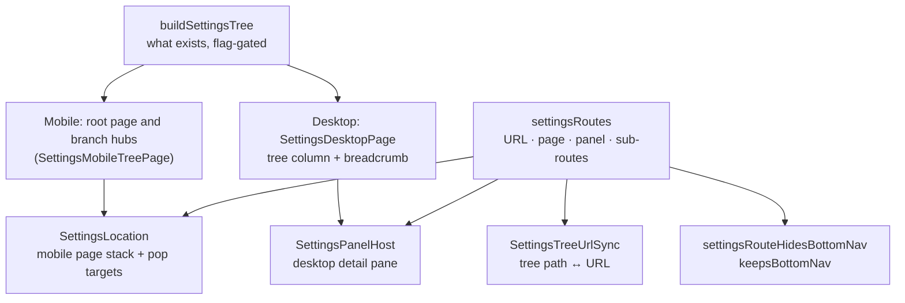
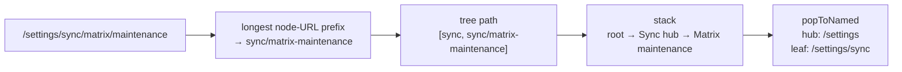
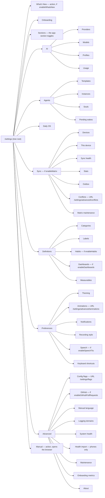
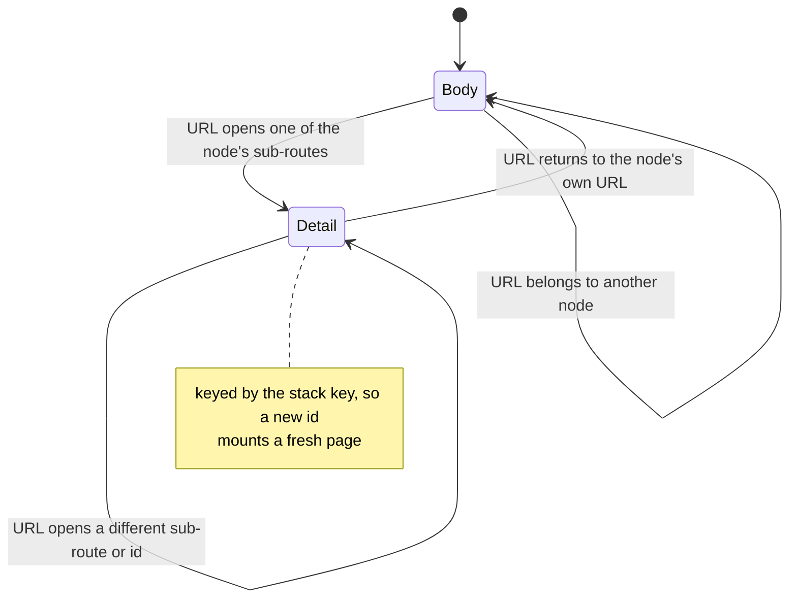
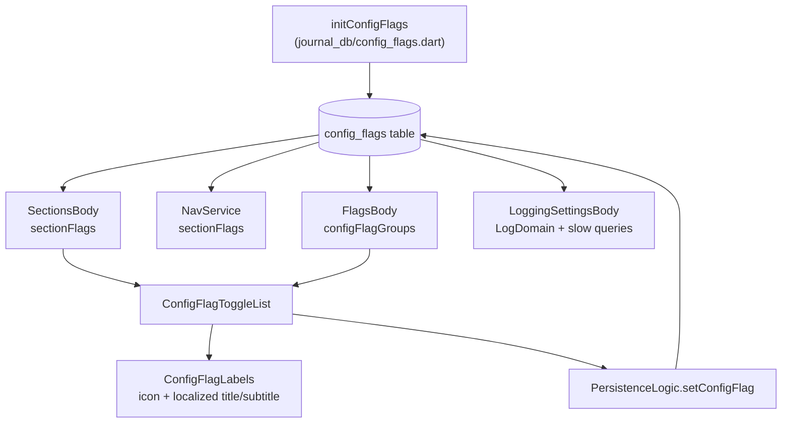

# Two declarations, two renderings

Settings is declared in two places and rendered in two shapes, and the four do
not overlap:

- **`buildSettingsTree`** decides *what exists*: every node, its icon and order,
  how nodes group into branches, and which feature flags gate them. It knows
  nothing about URLs or widgets.
- **`settingsRoutes`** decides *where each node leads*: one `SettingsRoute` per
  tree node id, carrying its URL, its mobile page, its headerless desktop panel
  and the detail sub-routes below it (editors, create flows, reviews).

From those two, the desktop tree-nav and the mobile drill-down are both derived,
so they cannot disagree about which settings exist, how they are grouped, or
where a row goes.

```mermaid
flowchart TD
  Tree["buildSettingsTree<br/>what exists, flag-gated"] --> TreeView["Desktop: SettingsDesktopPage<br/>tree column + breadcrumb"]
  Tree --> Hubs["Mobile: root page and branch hubs<br/>(SettingsMobileTreePage)"]
  Registry["settingsRoutes<br/>URL · page · panel · sub-routes"] --> Location["SettingsLocation<br/>mobile page stack + pop targets"]
  Registry --> Host["SettingsPanelHost<br/>desktop detail pane"]
  Registry --> Sync["SettingsTreeUrlSync<br/>tree path ↔ URL"]
  Registry --> Nav["settingsRouteHidesBottomNav<br/>keepsBottomNav"]
  TreeView --> Host
  Hubs --> Location
```

**Desktop pushes exactly one page.** `SettingsLocation` keeps a single
`SettingsRootPage` on the stack and publishes the URL — path, captured
parameters and query — through `NavService.desktopSelectedSettingsRoute`. The
tree, the breadcrumb and the detail pane all follow that notifier.

**Mobile builds real stacks.** The same URL resolves to the Settings root plus
one page per tree level that has one, plus any detail above them, so a back
gesture walks up one level at a time.

## Adding a page touches three places

| Place | If you skip it |
|-------|----------------|
| A node in `buildSettingsTree` | The entry does not exist |
| A `(title, desc)` case in `settingsTreeLabelsFor` | The row renders its **raw node id** as its title — deliberate, so the mistake shows instead of crashing |
| An entry in `settingsRoutes` | The registry tests fail: every tree node must be an action or have a route, and every leaf but the deliberately phone-only ones must have a desktop panel |

Every URL in the registry is a string literal, sub-routes included, because
`docs-site/scripts/validate-manual.mjs` reads them out of that file to check the
manual's route inventory — so a new URL also needs an entry in
`docs-site/metadata/surface-inventory.json`, and the manual build says so.

# How a URL becomes a page stack

`SettingsRouteTable.resolve` is a pure function from a URL to a
`SettingsRouteMatch`: the tree path, the mobile stack, the matched sub-route and
the captured parameters.

1. **Aliases first.** A retired URL maps to its canonical one —
   `/settings/maintenance`, once advertised without a page behind it, opens
   Advanced → Maintenance.
2. **The node is a greedy longest-prefix match over node URLs**, not a parse of
   the URL's shape. A node keeps its URL when it moves between branches, so the
   tree path is read from the registry, never inferred from the segments.
3. **One page per tree level that has one.** A node without a `page` — an AI or
   Agents tab, which its section's page already shows — adds none, but its URL
   still becomes the pop target of anything above it.
4. **The deepest sub-route wins, and stacks above the sub-routes it extends.**
   `/settings/agents/templates/<id>/review` stacks the review above the
   template; `/settings/habits/search/<term>` (a `replacesParent` sub-route)
   takes the list's own slot. A `:param` never captures the literal `create`,
   so a stray `…/create` under a node with no create flow falls back to the
   node instead of opening an editor for an entity called "create".

```mermaid
flowchart LR
  URL["/settings/sync/matrix/maintenance"] --> Node["longest node-URL prefix<br/>→ sync/matrix-maintenance"]
  Node --> Path["tree path<br/>[sync, sync/matrix-maintenance]"]
  Path --> Stack["stack<br/>root → Sync hub → Matrix maintenance"]
  Stack --> Pops["popToNamed<br/>hub: /settings<br/>leaf: /settings/sync"]
```

## Every page names its pop target

Beamer's default pop strips **one** URL segment. That is right only when a
page's URL nests directly under the one beneath it — and most settings URLs do
not: definition and preference leaves kept the flat URLs they shipped with
(`/settings/categories` under a hub at `/settings/definitions`), detail routes
are two segments below their list, and Matrix maintenance is three segments
under the Sync hub. Each of those, at one time or another, popped to a URL that
rebuilt the very page being left, so a back tap animated it out and pushed an
identical page straight back in.

So no settings page uses the default: every `SettingsStackEntry` carries an
explicit `popUrl`, the URL of the page beneath it, and `SettingsLocation` passes
it as `BeamPage.popToNamed`. The invariant behind it is tested over **every**
URL the registry answers on, sub-routes filled in: resolving a page's pop target
must yield exactly the stack beneath that page. Then a back gesture can only
ever uncover a page, never swap one in.

The other half is the page key. A page keeps the same key (`settings-<node id>`,
or `<owner>:<remainder>` for a detail) at every URL that shows it, which is what
lets the Navigator uncover the existing page instead of replacing it.

# The tree, not the URL, decides the hub

Because the stack is read from the tree path, a leaf whose URL sits under
another branch's prefix still stacks under its own branch:

- **Conflicts** is listed under Sync and answers on `/settings/advanced/conflicts`
  — it stacks above the **Sync** hub.
- **Animations** belongs to Preferences and answers on
  `/settings/advanced/animations` — it stacks above the **Preferences** hub.
- **Config Flags** and **Health import** belong to Advanced and answer on
  `/settings/flags` and `/settings/health_import`.

A node id must stay one tree segment per level for the same reason:
`sync/matrix-maintenance` keeps a hyphen where its URL has a slash, because
`sync/matrix/maintenance` would name a `sync/matrix` parent that does not exist.

# The runtime topology

```mermaid
flowchart LR
  Landing["/settings (tree root)"] --> WhatsNew["What's New — action, if enableWhatsNew"]
  Landing --> Onboarding["Onboarding"]
  Landing --> Sections["Sections — the app-section toggles"]
  Landing --> AI["AI"]
  Landing --> Agents["Agents"]
  Landing --> DailyOs["Daily OS"]
  Landing --> Sync["Sync — if enableMatrix"]
  Landing --> Definitions["Definitions"]
  Landing --> Preferences["Preferences"]
  Landing --> Advanced["Advanced"]
  Landing --> Manual["Manual — action, opens the browser"]

  AI --> AiProviders["Providers"]
  AI --> AiModels["Models"]
  AI --> AiProfiles["Profiles"]
  AI --> AiUsage["Usage"]

  Agents --> AgentTemplates["Templates"]
  Agents --> AgentInstances["Instances"]
  Agents --> AgentSouls["Souls"]
  Agents --> AgentWakes["Pending wakes"]

  Sync --> Provisioned["Devices"]
  Sync --> NodeProfile["This device"]
  Sync --> Backfill["Sync health"]
  Sync --> SyncStats["Stats"]
  Sync --> Outbox["Outbox"]
  Sync --> Conflicts["Conflicts — URL /settings/advanced/conflicts"]
  Sync --> MatrixMaint["Matrix maintenance"]

  Definitions --> Categories["Categories"]
  Definitions --> Labels["Labels"]
  Definitions --> Habits["Habits — if enableHabits"]
  Definitions --> Dashboards["Dashboards — if enableDashboards"]
  Definitions --> Measurables["Measurables"]

  Preferences --> Theming["Theming"]
  Preferences --> Animations["Animations — URL /settings/advanced/animations"]
  Preferences --> Notifications["Notifications"]
  Preferences --> RecordingStyle["Recording style"]
  Preferences --> Speech["Speech — if enableSpeechTts"]
  Preferences --> Keyboard["Keyboard shortcuts"]

  Advanced --> Flags["Config flags — URL /settings/flags"]
  Advanced --> GitHub["GitHub — if enableGitHubPullRequests"]
  Advanced --> ManualLanguage["Manual language"]
  Advanced --> Logging["Logging domains"]
  Advanced --> SystemHealth["System health"]
  Advanced --> HealthImport["Health import — phones only"]
  Advanced --> Maintenance["Maintenance"]
  Advanced --> OnboardingMetrics["Onboarding metrics"]
  Advanced --> About["About"]
```

In demo worlds, which have no Matrix stack, Sync collapses into a single inert
explainer tile (`sync-unavailable`). A project opened from a category
(`/settings/projects/:projectId`) belongs to no node and hangs off the root.

AI and Agents have pages of their own on mobile whose tabs are the tree's
children, so on a phone those children add no page; on desktop each child is a
panel showing one tab. The two **action** leaves never become pages on either
surface: `handleSettingsNodeAction` opens the Manual in the browser and What's
New in its modal.

# The desktop detail pane

`SettingsDetailPane` dispatches on the selected tree path:

- nothing selected, or a leaf this platform has no panel for → `EmptyRoot`;
- a branch without a panel → `CategoryEmpty`, the "pick a section" hint;
- anything with a panel — including the `ai` and `agents` branches, which carry
  one — → `LeafPanel`, which keeps every panel visited since the pane mounted
  alive in an `IndexedStack`, so switching siblings keeps their scroll position
  and filters.

`LeafPanel` hosts each panel through `SettingsPanelHost`, which listens to the
published route and shows either the node's panel body or, when the URL opens
one of the node's sub-routes, that detail in the same slot. Detail surfaces are
the same widgets on both platforms — a page stacked on mobile, the slot's
content on desktop — so each is declared once.

```mermaid
stateDiagram-v2
    [*] --> Body
    Body --> Detail: URL opens one of the node's sub-routes
    Detail --> Detail: URL opens a different sub-route or id
    Detail --> Body: URL returns to the node's own URL
    Body --> Body: URL belongs to another node
    note right of Detail
      keyed by the stack key, so a new id
      mounts a fresh page
    end note
```

A panel body never draws its own title: the breadcrumb above the pane already
names it. Where a feature page is also a phone page, its `*Body` turns the
header off — `DefinitionsListPage(showHeader: false)` for the five definition
lists, `SyncListScaffold(showTitle: false)` for Outbox and Conflicts (the pinned
filter row stays), `ImpactAnalysisBody(showTitle: false)` for AI usage. Editors
reached through sub-routes keep their own header, because its back button is
the way back to the list.

`SettingsTreeUrlSync` keeps tree path and URL in step both ways: a tree tap
beams to the node's URL with replacement, and a URL change — a deep link, a
detail opened from a list — resolves back to a tree path. A counter on each side
suppresses the echo, so opening `/settings/categories/<id>` does not get
canonicalised back to the list URL.

# The bottom navigation follows the stack

On a phone, `settingsRouteHidesBottomNav` reads the page on top of the resolved
stack: menus and browse lists keep the bar (`keepsBottomNav` — the root, the
branch hubs, the five definition lists, the conflicts list, habit search);
leaves, editors and the AI and Agents sections hide it. Sections is the one leaf
that keeps it, because its switches add and remove the bar's own tabs.

# One flag set, two pages, one rule

Every stored `ConfigFlag` renders on exactly one of two surfaces, and which one
is decided mechanically rather than editorially:

| Surface | Holds | Rule |
|---------|-------|------|
| **Sections** (`/settings/sections`, second row at the root) | `sectionFlags` | The flag adds a **top-level navigation destination** — `NavService` builds its tab watch list from this very constant |
| **Config Flags** (`/settings/flags`, under Advanced) | `configFlagGroups`, split into *Preferences* and *Advanced & experimental* | Everything else a user may set |
| *(neither)* | the per-domain logging toggles and `log_slow_queries` | They have their own page, Advanced → Logging |

The split exists because those two jobs want opposite placement. A switch that
*reveals a feature* has to be found before the feature can be used at all, so
burying it three levels down under Advanced made the app's progressive
disclosure undiscoverable — a user who wanted Habits had to already know where
the flag was. A switch that *tunes* a feature is only looked for by someone who
already has it, and is fine where it is.

Both lists live in
[`config_flag_placement.dart`](../../lib/classes/config_flag_placement.dart) —
one file, outside the UI layer, so a test can ask where a flag belongs without
importing a widget and the two halves of the partition cannot drift into
separate layers.

Row order on Sections is `sectionFlags`, which is also the order `NavService`
yields its tab specs in, so the list reads top to bottom the way the navigation
it produces does. Reordering the constant reorders the app's tabs; that is the
point, not a side effect.

```mermaid
flowchart TD
  Init["initConfigFlags<br/>(journal_db/config_flags.dart)"] --> Store[("config_flags table")]
  Store --> Sections["SectionsBody<br/>sectionFlags"]
  Store --> Nav["NavService<br/>sectionFlags"]
  Store --> Flags["FlagsBody<br/>configFlagGroups"]
  Store --> Logging["LoggingSettingsBody<br/>LogDomain + slow queries"]
  Sections --> List["ConfigFlagToggleList"]
  Flags --> List
  List --> Labels["ConfigFlagLabels<br/>icon + localized title/subtitle"]
  List --> Persist["PersistenceLogic.setConfigFlag"]
  Persist --> Store
```

Three things keep that honest:

- **`database_config_flags_test.dart` partitions the set.** It reads the flags a
  real in-memory database ends up holding and asserts that `sectionFlags` and
  `configFlagsOnFlagsPage` are disjoint and, together with the logging set,
  cover all of them. A flag added to `initConfigFlags` without a home fails
  there instead of shipping as a toggle nobody can reach.
- **`nav_service_test.dart` pins the navigation correspondence.** `NavService`
  derives its watch list from `sectionFlags` rather than spelling the flags out,
  and the test records which names it asks for and asserts they are exactly that
  list, in order.
- **`ConfigFlagToggleList` and `ConfigFlagLabels` are shared.** Both pages render
  the same row widget and resolve labels through the same catalog, so a flag that
  moves between them keeps its glyph, its wording and its tap behaviour without a
  second edit. The raw `ConfigFlag.description` written by `initConfigFlags` is a
  developer string and is only ever a fallback for a name the catalog does not
  know.

# Ownership boundaries

**Settings owns** the tree and its labels, the route registry, the desktop
tree-nav page and detail pane, the mobile root and branch hubs, the shared
presentation widgets, the shared list/detail scaffolding, the two-step
destructive/long-running modal wrapper, and the utility pages that belong to no
other feature: sections, flags, logging, manual language, maintenance, about,
animations (completion celebrations), health import and the measurable editor.

**A settings page that configures a feature lives in that feature** and is only
referenced from the registry: AI and agents, categories, labels, projects and
sync; dashboard definitions in `dashboards/ui/settings/`; the habit list in
`habits`; theming in `theming`; notification settings in `notifications`;
recording style in `onboarding`; speech in `tts`; keyboard shortcuts in
`keyboard`; system health in `system_health`; GitHub in `github`. Nothing
imports the retired `features/settings_v2` directory, and the settings tree and
its state import neither the routing layer nor the UI — both rules are in
`test/architecture/feature_import_direction_test.dart`.

# The shared list/detail pattern

All five definition types — categories, labels, dashboards, habits, measurables —
reuse one pattern:

1. A list page wraps `DefinitionsListPage<T>`, fed by an
   `AsyncValue<List<T>>` from a Riverpod stream provider.
2. **The shell owns** search, sorted rendering, loading/empty/no-match/error
   states (each localized, with the empty state carrying an inline create
   button on phones), and the create affordance — a bottom-nav-cleared FAB on a
   phone, and in the desktop detail pane a button beside the search field,
   reachable through empty, loading and error states alike.
3. Rows lead with one shared 36 px rounded-square chip and keep a **stable
   subtitle semantic per page** — counts for categories and labels,
   description for measurables, habits and dashboards.
4. Tapping a row beams to the detail editor's URL — a sub-route of the list's
   registry entry, stacked on a phone and swapped into the panel slot on
   desktop.
5. Saving or deleting goes through shared persistence or a feature-specific
   controller.

**The chip letter always belongs to the row's own item.** Habit and dashboard rows
pass `letterFrom: item.name` so the initial matches the row name while the
background colour carries the category (neutral when unresolved); **only category
rows show the category's own icon or initial**, since that is the row's identity.

Everything sits on the shared settings grid, so content aligns with the header
title at every pane width and centres as a capped column on wide windows.

## The detail kit

All detail editors render through `SettingsDetailScaffold`, which provides the
header (back beams to the list route), a catalog-driven **Primary+S** save handler
in the nearest `AppCommandScope`, and a sticky glass action bar with the primary
save pill — **gated on the page's dirty state, with the command using the same
enabled predicate** and disabled rendering as quiet translucent glass — plus
cancel, and in edit mode a full-width delete row at the end of the form reusing
each page's confirm flow.

Form rows group into `SettingsFormSection` cards; FormBuilder-driven pages bridge
into the design system through dedicated wrappers. **Visibility toggles share
Active polarity (ON = visible)**, and private/active switch rows carry explanatory
subtitles. Aggregation types always render **localized names, never raw enum
identifiers**.

## The persistence split

The measurable editor carries one field the kit has no widget for: a
*Recorded as* switch (number / choice) that decides whether the unit and
aggregation fields are shown at all, and for the choice kind a
`MeasurableChoicesEditor` — a reorderable list of the definition's choices,
each renamed in place and archived rather than deleted, with an archived
section to restore from. Both live beside the `FormBuilder` as plain widget
state and flip the same `dirty` flag; a save with the choice kind refuses a
blank title or an empty list and calls the rows out instead. What a choice is,
and why it is an id with a title rather than an enum, is in
[entity definitions](../domain/entity-definitions.md#measurabledatatype-records-a-number-or-a-choice).
Changing a numeric measurable to choices also changes the valid downstream
contract: habit evaluation treats any stored numeric bounds as obsolete, and
the goal editor drops a stored numeric criterion for that measurable when the
goal is next edited.

Dashboards and measurables save through `PersistenceLogic`; habits save through
`habit_settings_controller.dart`, **which also schedules notifications**.

This is one of the more useful boundaries in the feature: Settings owns the
editing shell but does not insist on owning every write path.

# Localization boundary

Settings-owned leaf pages use `context.messages` for user-visible labels,
**including debug and QA-only actions**. New copy goes into every ARB source and is
regenerated — never placed directly in the widget.

That matters most for Advanced → Maintenance: its onboarding preview and
animation-gallery rows are real app UI and **must not introduce an English island
in another locale**.

Maintenance also owns the explicit **Repair screenshot storage** action. It
runs the centralized, idempotent journal-image repair and reports repaired,
missing, conflicting, and failed entries in a localized toast. The action is
manual by design: there is no startup migration and no error-triggered write in
the image display or AI read paths.

**Restore missing sleep** follows the same shape — an idempotent sweep, a
localized count toast, no startup migration — and differs in one respect: it is
registered only where health import is, so unlike every other row it is absent
in a profile that imports no health data. What it restores, and why re-importing
alone would not have, is in
[health import](health_import.md#sleep-is-stored-twice-on-purpose).

**One row currently breaks it.** The repaint-rainbow overlay toggle in
`maintenance_page.dart` hardcodes its title and subtitle in English, the only such
row in the settings tree — every other row on that page, destructive maintenance
actions included, resolves through `context.messages`. It is an unfixed oversight
rather than an exemption for debug affordances, so do not read it as precedent.

# Related

* [Navigation and app shell](../architecture/navigation.md) - where the settings delegate sits among the tabs, why a Beamer pop walks one URL segment, and the chrome rules that decide which routes hide the bottom nav.
