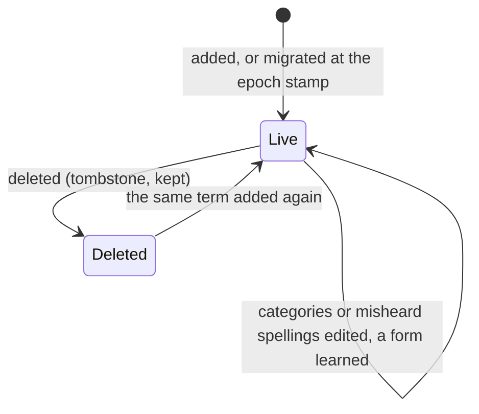
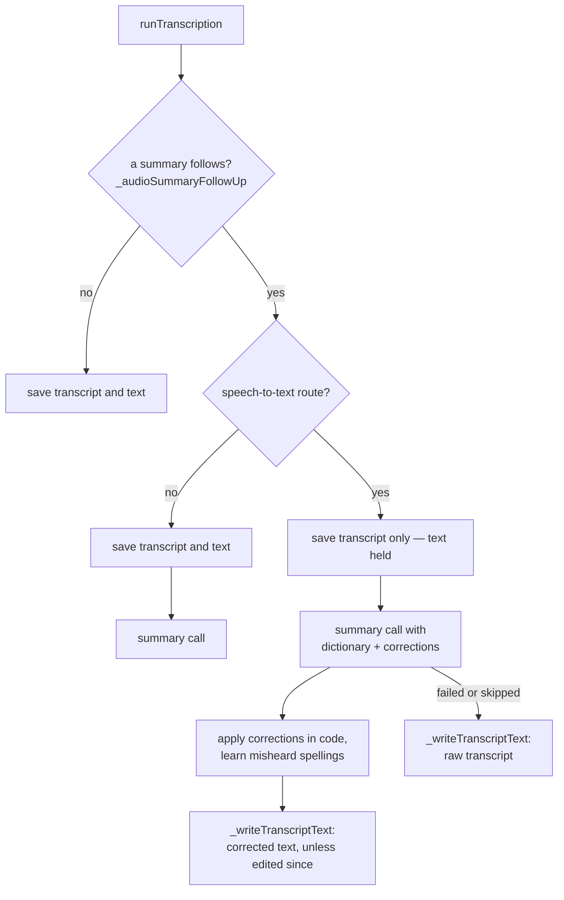

# One entry per term

The dictionary is `EntityDefinition.speechDictionaryEntry`: a term, the
categories it is limited to (`categoryIds`; null or empty means every
category), the spellings it is known to come out as (`misheardAs`), and a
`deletedAt` tombstone. It lives in the journal database's
`speech_dictionary_entries` table and replicates as a whole document through
`SyncMessage.entityDefinition`, like every definition.

**The id is the term.** `speechDictionaryEntryId` derives a v5 UUID from the
normalized term (trimmed, inner whitespace collapsed, lower-cased), so adding
the same word twice — on one device, on two, or by two migrations — writes
one entry. A respelling that only changes case keeps the entry; any other
respelling is another term, and the editor deletes the old one.

A term reaches a recording when it applies to all categories, or to the
recording's category — its own, else its linked task's
(`PromptBuilderHelper.getSpeechDictionaryEntries`). A recording without a
category gets only the global terms. The category filter exists so niche
vocabulary does not "correct" unrelated transcripts.

## Receiving an entry

`JournalDb.upsertSpeechDictionaryEntry` uses the definitions' recency gate
([definition clocks](../sync/definition-clocks.md)): a dominating clock wins,
and concurrent copies are settled by `updatedAt` and then by canonical
content, so devices that receive them in opposite orders keep the same one.
Exact ties are not rare here — every device migrates a legacy term at the same
fixed stamp. The migration's ordering rules are model-checked in
[`SpeechDictionarySync`](../../../specs/tla/README.md); the clocks, and the
sequence-log repair a lost version now gets like every definition, in
`DefinitionClocks`.

**Concurrent edits of one term are last-writer-wins.** One device limiting a
term to a category and another adding a misheard spelling at the same moment
keep one of the two edits. Learning a spelling is such an edit, so it can
overwrite a category change made elsewhere within the same sync window.

# The categories' lists, carried over

`CategoryDefinition.speechDictionary` is no longer written or read for
transcription. `SpeechDictionaryMigration` runs at every start: it turns each
term of every live category's list — private categories included, whatever
the privacy toggle shows — into one entry limited to all the categories
holding it (`legacySpeechDictionaryEntries`), and writes those
**the device holds no entry for** — live or deleted — at the epoch stamp,
through `PersistenceLogic.seedEntityDefinition`.

Each of those choices is a switch in the model, with the counterexample it
prevents:

- **Absent only.** Never merging into an entry it holds means a later run
  cannot widen a term the user limited or bring back one they deleted.
- **Epoch stamp.** Any user edit outranks a migrated entry, however late
  another device migrates.
- **Seeded, not edited.** The local-edit path re-stamps a refused write past
  the stored copy; a seeded write is simply refused, so an entry that arrived
  from another device in between wins.

The lists stay on the categories, so a device that migrates later still finds
them. Two devices holding different lists write different entries at the same
stamp; the content order picks one, and a category only the losing device had
seen drops out of that term — the migration is a one-time carry-over, not a
merge.

# Correcting a speech-to-text transcript

A speech-to-text engine (Whisper and its kin, `routesToSpeechToText`) returns
what it heard; the dictionary reaches it only as a vocabulary hint, which
not every engine honours. A multimodal model reads the dictionary and the
task in its own prompt and spells them as given. So the correction belongs to
the first only.

A summary always follows the task-context transcription skill on a
speech-to-text engine, whether the user asked for it or the category's
automation ran it: recognizing speech in a task's context *is* this composite
step. Any other transcription in a task's context chains one only when the run
was automated and the profile automates the audio summary — the consent rules
of [execution paths](../ai/execution-paths.md#audio-summaries). The plain
transcription skill never chains on its own.

**One call, two jobs.** The audio summary publishes through
`publish_recording_summary`: the three summary tiers plus `corrections`, each
the misheard words, the term, and an exact quote locating the occurrence. The
model returns edits rather than a rewritten transcript — retyping a long
transcript costs as many output tokens as it has words, and a model asked to
return one may quietly shorten it. `applyRecordingCorrections` applies only
what a check in code accepts (`applyTranscriptNameCorrections`): the
replacement is a listed term, the occurrence is the quoted one, and a
lower-case phrase is accepted only when the term is known to be misheard that
way. Misheard spellings are hints the model weighs against the context — the
word may be the one the speaker meant — and are never replaced blindly.

Applied corrections are learned: each `from` joins its term's `misheardAs`,
newest kept, capped at `kMaxMisheardForms`. The prompt lists them back on the
next recording.

**The text is written once.** While the summary runs the recording has its
transcript in the history and no new text; the corrected text, or the raw
transcript when the summary fails or is skipped, is written afterwards by
`_writeTranscriptText` — guarded on the version it re-read, and skipped when
the text changed since the run's first read, so an edit made meanwhile wins.
`TranscriptionRun`'s `Held` configuration models this phase. A recording left
with a transcript and no text (the app stopped mid-step) is offered for its
summary by [inference backfill](../ai/inference-backfill.md), and that run
fills the text.

## What the summary sees

The summary prompt is bounded by the recording, not the task: this
recording's text, the task's title and language code, the task's current
report (`TaskSummaryResolver.resolve(fullReport: true)`), and the dictionary
entries that reach the recording. Never the task's log — every other
recording's transcript is in it — nor the linked tasks, which grow without
limit.

# Editing

*Settings → Definitions → Speech dictionary* lists the terms with where each
applies, searchable by term and by misheard spelling. While private entries
are hidden, a term limited only to private categories is hidden with them,
and private categories drop out of every term's scope; transcription still
reads every entry, since a recording in a private category is private itself. An entry's page edits
the term, its categories and its misheard spellings. Both ways into the add
page from the list — the create button and the "Add …" action under an
unmatched search — seed the term with the trimmed search query, carried as
the `term` query parameter of `/settings/speech-dictionary/create`
(`speechDictionaryCreateUrl` in
[speech_dictionary_list_page.dart](../../../lib/features/speech_dictionary/ui/pages/speech_dictionary_list_page.dart));
the shared list shell hands every create button the current query. The
editor's *Add to Dictionary* on a text selection adds the selected word
limited to the entry's category, widens a term limited elsewhere to it, and
without a category adds it for all.

# Related

* [Speech overview](overview.md) — recording, playback, and where transcription
  is handed over.
* [AI execution paths](../ai/execution-paths.md) — the transcription run, its
  consent gates and the audio summary.
* [Entity definitions](../../domain/entity-definitions.md) — the union the
  entry belongs to.
* [ADR 0124](../../../docs/adr/0124-speech-dictionary-entity-and-composite-correction.md)
  — why the dictionary left the categories and why correction rides on the
  summary call.
