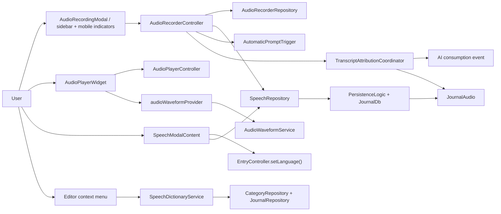
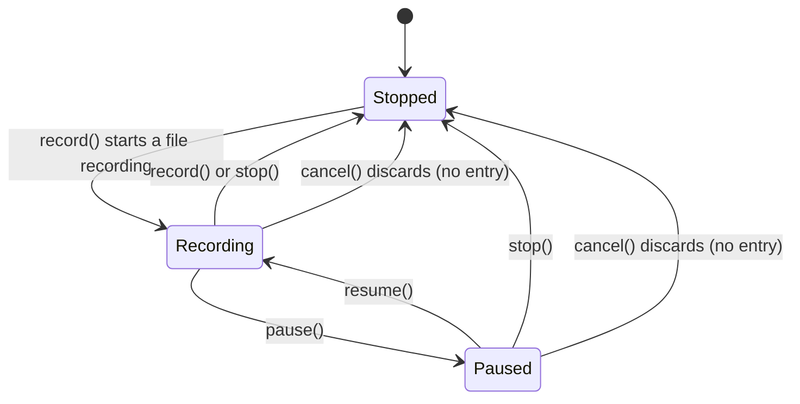

The speech feature owns audio capture, playback, waveform extraction and
transcript-adjacent tools for `JournalAudio` entries. It does three concrete
jobs: capture audio and persist it, play it back with progress/speed/waveform
scrubbing, and maintain speech-specific metadata — language, transcripts, and
category speech dictionaries.

**It does not own provider configuration or the inference stack.** Transcription
and linked-task automation call into AI-side services *after* the recording is on
disk, and **there is no streaming or realtime transcription path** — transcription
is always a batch pass over the finished file, with dictionary and context
biasing.

# Recording

`AudioRecorderRepository` wraps the `record` package: permission checks,
file-backed recording at 48 kHz, pause/resume, stop/dispose, and **amplitude
sampling every 20 ms**.

`AudioRecorderController` adds Riverpod state, VU calculation from dBFS via the
standalone `VuMeter` (a self-contained sliding-window RMS→VU unit, unit-tested
directly), live dBFS for the modal visualizer and the mobile recording pill,
linked-entry and category context, coordination with app-wide playback,
persistence through `SpeechRepository`, and optional hand-off to profile-driven
transcription automation.

**The desktop sidebar row deliberately does not visualize dBFS** — it shows a red
accent card, a pulsing record dot and elapsed time only.

The modal renders either the skeuomorphic VU meter or the energy orb depending on
`recordingStyleProvider`, from the same dBFS feed.

## `record()` is a toggle

If paused it resumes; if already recording it stops and saves; otherwise it
starts a new recording.

**Both `stop()` and `cancel()` land in `Stopped`, but only `stop()` persists.**
`stop()` creates a `JournalAudio` and fires automatic prompts; `cancel()` stops
the recorder, **deletes the partial file** and creates no entry — nothing is
transcribed and no task agent is woken. The modal's discard control asks for
confirmation first, so the page returns to exactly how it looked before.

`pause()` and `resume()` exist on the controller but are **not surfaced by the
current modal UI**.

Two state fields are vestigial and easy to misread:
`AudioRecorderStatus.initializing` exists but `build()` returns `stopped`
immediately, using the async step only for permission probing and logging; and
`showIndicator` exists but the desktop and mobile indicators derive visibility
from `status == recording && !modalVisible` instead.

## Navigation is kept out of teardown

`AudioRecordingModal.show()` hosts the Wolt sheet on the **root navigator** by
default; callers can opt into their local navigator. Finishing a recording
returns the created entry id through the modal route.

**The content pops the route exactly once, and an unlinked recording navigates to
its new entry only after the Wolt route has completed.** Keeping navigation out of
the sheet's teardown prevents nested task navigators from trying to reactivate an
element that has already been removed.

The persisted `JournalAudio` is created from `AudioData` through
`PersistenceLogic`, and the file lives under `/audio/YYYY-MM-DD/`.

# Playback and waveforms

`AudioPlayerController` is a **keep-alive** Riverpod notifier backed by
`media_kit.Player`, owning the active `JournalAudio`, playback and buffered
progress, speed, pause position, and native player setup and cleanup. It
subscribes to `media_kit` position, buffer and completion streams.

Because it is app-wide, starting a recording pauses active playback rather than
letting the two compete for the output device.

Waveforms are extracted by `AudioWaveformService` and exposed through
`audioWaveformProvider`, which caches them so scrubbing does not re-analyse the
file.

# Related

* [AI provider routing](../ai/provider-routing.md) - the transcription endpoints and the audio transcoding pipeline.
* [Sync node profiles](../sync/node-profiles-and-auto-trigger.md) - how audio recorded here can be transcribed on another device.
* [Daily OS capture](../daily_os_next/capture-and-planning.md) - the durable batch-first capture path built on this recorder.
