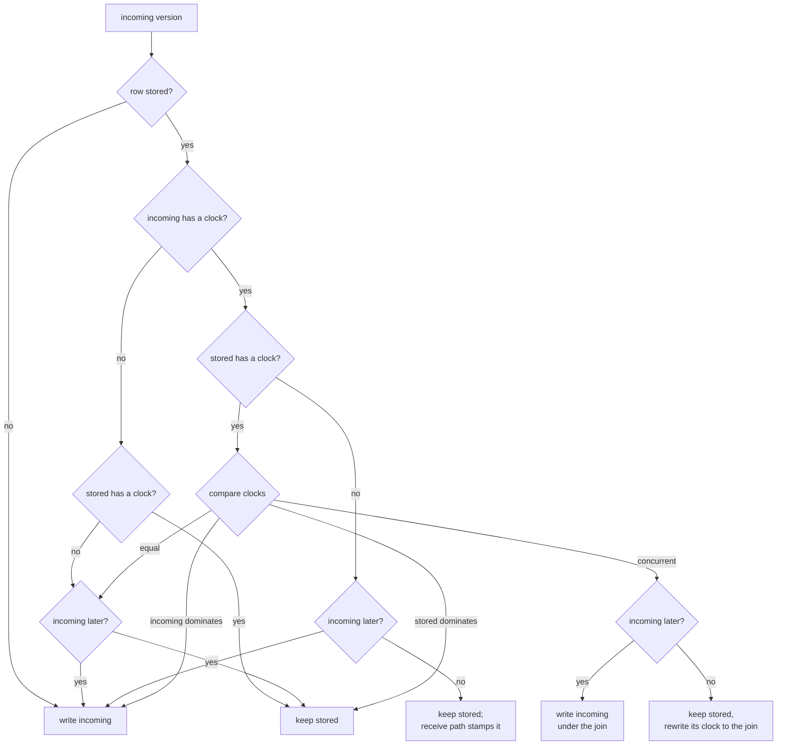
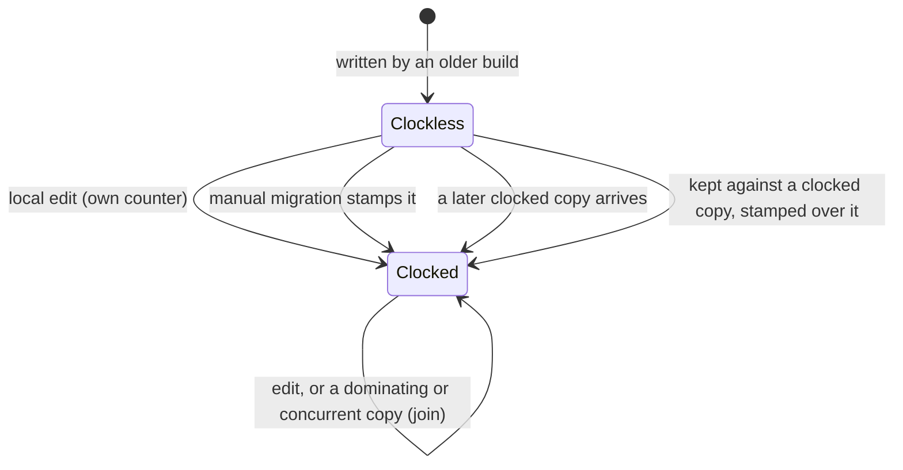

Entity definitions replicate as whole documents in
`SyncMessage.entityDefinition`. Each version carries a vector clock, so a
version that was written knowing another supersedes it everywhere, and the
sequence log can tell when one went missing. The decision is recorded in
[ADR 0125](../../../docs/adr/0125-definitions-carry-vector-clocks.md); the
protocol is model-checked in
[`DefinitionClocks`](../../../specs/tla/README.md) and, for transport and
repair, in `SyncPipeline`'s `entityDefinition` family.

# Writing a version

Every local write goes through `PersistenceDefinitionOps._writeLocalEdit`
(categories, labels, habits, measurables and dictionary entries through
`upsertEntityDefinition`, dashboards through `upsertDashboardDefinition`). In
one journal transaction it reads the stored stamp, reserves this host's next
counter **on top of the stored clock** (`getNextVectorClock(previous: …)`,
payload type `entityDefinition`), and writes. The new clock dominates every
version this device holds, so the gate always accepts it and every peer that
receives it takes it. The reservation sits in `withVcScope`: a refused write
releases and burns the counter.

The write's `updatedAt` stays the caller's unless it does not pass the stored
one — a stale editor, a delete that kept the old stamp, a peer whose clock
runs ahead — in which case it is set 1 ms above it. Last-writer-wins only
decides between concurrent versions, and this keeps a write ahead of anything
its device had seen, even through the clockless fallback below.

Seeds — definitions a device derives on its own, today the speech dictionary
migration — reserve a counter only when no copy is stored, and keep their
`updatedAt`, so any real edit made elsewhere wins over them.

# The gate

`JournalDb._upsertDefinitionIfNotOlder` decides, in one transaction, what is
stored when a version arrives — from sync, a seed or a local write. Only the
stored document's `updatedAt` and `vectorClock` are decoded, since a legacy
dashboard may not parse.

*Later* is last-writer-wins: the later `updatedAt`, and on an exact tie the
greater canonical JSON of the document **without its clock** — devices that
joined different clocks into one version must still order it the same way.
Identical content counts as later, so a re-delivery of the stored version
rewrites it unchanged. Two different documents under one clock — which no
writer produces, but a hand-written or legacy row can — are ordered the same
way, so every device keeps the same one.

**The join is the resolution.** Two concurrent versions settle on one, stored
under the pointwise maximum of both clocks (`VectorClock.merge`). That clock
is strictly greater than each, so the next edit on either device supersedes
both; no counter is spent on the resolution and nothing is sent because of
it. A kept version's join is written into its stored JSON in place
(`json_set`), leaving the rest of the document untouched.

# Rows from before clocks

Definitions written by builds before this carry no clock. A clockless copy
never displaces a clocked row; a clockless row meets any copy by *later*
alone.

**The manual migration.** *Settings → Sync → Sync health → Advanced
recovery → Repair vector clocks* runs `SyncStep.backfillDefinitionClocks` beside the
agent and entry-link clock steps. `SyncMaintenanceRepository.backfillDefinitionClocks`
lists every clockless definition, deleted and private ones included
(`JournalDb.clocklessDefinitions`), and `DefinitionClockStamper.stamp`s each:
this host's next counter, content and `updatedAt` unchanged. Re-read,
reservation, write and enqueue form one journal transaction, so a failed
enqueue rolls the stamp back, the counter is burned and the next run retries
the row.

**Running it on one device is enough.** When a clocked copy reaches a device
whose row is still clockless and the row is later, the gate keeps the row and
`SyncEventProcessor._stampIfKeptClockless` stamps it **on top of the copy's
clock**: the row now dominates the copy, and its content wins on every device.
Without that a device whose newer clockless row lost its sync before the
migration would keep it while the others kept the older one.

# Sequence log and backfill

Definitions are sequence-tracked under `SyncSequencePayloadType.entityDefinition`
(appended last: the index is persisted).

- **Send.** `prepareMessage` stamps `originatingHostId`;
  `enqueueEntityDefinition` binds this host's counter in the clock to the
  definition's id (`recordSentEntry`). Definitions do not collapse in the
  outbox.
- **Receive.** `_applyEntityDefinition` records the copy's clock
  (`recordReceivedEntry`) whether it was written or kept: a kept version
  supersedes or joins it, so its counters are no gap to ask for.
- **Answer.** A request for a definition counter is answered with the
  definition's current version (`JournalDb.definitionById` searches the six
  tables), through the same path as agent records and consumption events,
  with a hint when the current clock carries a later counter. Because the
  stored clock is the join of everything the row has met, any device that
  holds the definition covers every counter that went into it.
- **Deep backfill.** `DefinitionDeepBackfillStore` reads the six tables as one
  store, merged in id order.

# Gotchas

- **Ids are unique across the six tables.** `definitionById` returns the first
  table holding the id; UUIDs, and v5 UUIDs for dictionary terms, never
  collide.
- **The demo world writes clockless definitions** straight to its own
  database (`WorldHandle.writeEntityDefinition`); a demo world never syncs.
- **Re-sending is not migrating.** *Sync Entities* still re-enqueues every
  stored definition as it is, a clockless one included; that copy never
  displaces a clocked row, but it carries no counter either.

# Related

* [Vector clocks and conflicts](vector-clocks-and-conflicts.md) — the clock
  type and how journal entries resolve concurrency instead.
* [Sequence log and backfill](sequence-and-backfill.md) — the accounting the
  definitions now take part in.
* [Entity definitions](../../domain/entity-definitions.md) — what the six
  types are.
* [Speech dictionary](../speech/dictionary.md) — the one definition type with
  a seeding migration of its own.
