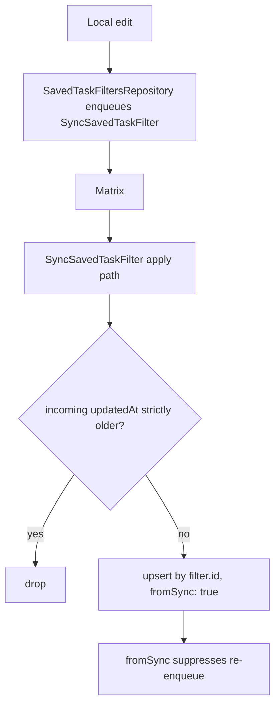

# Families

Everything on the wire is a `SyncMessage` — a freezed union with twenty-five
variants:

`journalEntity`, `entityDefinition`, `entryLink`, `aiConfig`,
`syncNodeProfile`, `aiConfigDelete`, `savedTaskFilter`,
`savedTaskFilterDelete`, `configFlag`, `themingSelection`, `dailyOsUserName`,
`notification`, `notificationStateUpdate`, `onboardingSnapshotBegin`,
`onboardingSnapshotAccepted`, `onboardingTerminalCounters`,
`onboardingSnapshotEnd`, `backfillRequest`, `backfillResponse`, `mediaRequest`,
`agentEntity`, `agentLink`, `consumptionEvent`, `agentBundle`, `outboxBundle`.

## Initial-onboarding controls

The four `onboarding*` variants coordinate one target device's bounded
full-history transfer. They carry no vector clock and never become sequence-log
payload rows. Begin freezes per-origin-host counter bounds and a fixed lease;
accepted returns the target's host identity; terminal counters carry bounded
inclusive ranges for the sender host's authoritative burns; end carries
`complete` or `aborted`.
Their persistence, ordering and suppression semantics live in
[sequence log and backfill](sequence-and-backfill.md#initial-onboarding-suppression).

## Sequence-tracked payloads

Only a subset participates in `(hostId, counter)` accounting — the seven
members of `SyncSequencePayloadType`:

`journalEntity`, `entryLink`, `agentEntity`, `agentLink`, `notification`,
`notificationStateUpdate`, `consumptionEvent`.

The enum's ordinal is **persisted** in the sequence log, so existing values
must never be reordered. New values are appended at the end only —
`consumptionEvent` was added that way.

Sequence-tracked payloads may carry:

- `originatingHostId` — the host that created or modified this payload version.
- `coveredVectorClocks` — the counters this payload semantically replaces.

`coveredVectorClocks` is not decoration. `SyncSequenceLogService` pre-marks
covered counters before normal gap detection, so a newer payload can *prove*
older counters were superseded rather than lost. See
[sequence log and backfill](sequence-and-backfill.md).

## `agentBundle` is receive-only legacy

The variant still exists so messages from peers predating the wake-bundle
removal continue to parse, but the receiver no-ops them and the producer never
builds new ones. Agent-wake writes hit the outbox as individual
`agentEntity` / `agentLink` rows, and the generic dequeue-time bundler
coalesces them (see [send path](send-path.md)). Children of any in-flight legacy
bundle resurface through per-`(host, counter)` backfill on demand.

# Saved task filters: per-item, not sequence-tracked

Saved task-filter definitions sync like AI configs — fire-and-forget, no vector
clock, no `originatingHostId`.

Three details make this safe:

- **Last-write-wins on `updatedAt`.** A strictly older incoming revision is
  dropped.
- **`fromSync` breaks the echo.** The apply path passes the flag into
  `SavedTaskFiltersRepository`, so an applied remote change never re-enqueues
  itself.
- **An in-class async lock serialises the read-modify-write.** Persistence is a
  per-item update over a single `SettingsDb` JSON blob; without the lock a
  concurrent local edit and inbound apply would clobber each other's slice.

Local-only filters that predate sync converge through the
`SyncStep.savedTaskFilters` maintenance step (*Settings → Sync → Sync
Entities*), which re-enqueues every persisted definition.

Per-device list order and derived per-filter task counts are computed locally
and **never** synced.

# File-backed payloads

Journal entities and agent payloads can travel by reference: the envelope
carries a `jsonPath` and the bytes ride as a Matrix attachment. Those payloads
are resolved through the attachment index and loader before they are applied,
which is why attachment ordering and dedupe are load-bearing for sync
correctness rather than a storage detail.

A journal entity's media blob is a *second* file event, sent alongside the JSON
only when the payload calls for it — `status == initial`,
`includeAttachments == true`, or the `resend_attachments` flag. The decision and
why it is taken at enqueue time as well as at send time are in
[sync send path](send-path.md#media-attachments-one-decision-two-places).

## Attachment encoding

An attachment event may carry a `com.lotti.encoding` key declaring an on-wire
encoding. The only defined value is `gzip`: the bytes returned from
`event.downloadAndDecryptAttachment()` are a gzip stream and must be inflated
before the file is written. `relativePath` remains the logical target path,
unchanged by the encoding.

| Direction | Rule |
|-----------|------|
| Receive | Decode the header unconditionally. |
| Send | Gzip any attachment whose `relativePath` ends in `.json` — the sole gate is `relativePath.toLowerCase().endsWith('.json')` in `MatrixPayloadSender`. The upload name gains a `.gz` suffix and the event carries the header. |
| Send (media) | Verbatim. Images and audio are already compressed and would not benefit; no header, no suffix. |
