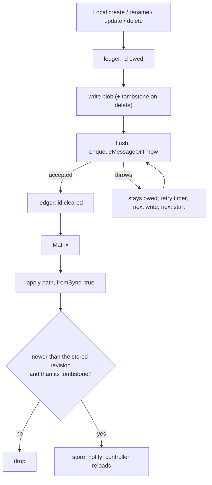

# Families

Everything on the wire is a `SyncMessage` — a freezed union with twenty-five
variants:

`journalEntity`, `entityDefinition`, `entryLink`, `aiConfig`,
`syncNodeProfile`, `aiConfigDelete`, `savedTaskFilter`,
`savedTaskFilterDelete`, `configFlag`, `themingSelection`, `dailyOsUserName`,
`notification`, `notificationStateUpdate`, `onboardingSnapshotBegin`,
`onboardingSnapshotAccepted`, `onboardingTerminalCounters`,
`onboardingSnapshotEnd`, `backfillRequest`, `backfillResponse`, `mediaRequest`,
`agentEntity`, `agentLink`, `consumptionEvent`, `agentBundle`, `outboxBundle`.

## Initial-onboarding controls

The four `onboarding*` variants coordinate one target device's bounded
full-history transfer. They carry no vector clock and never become sequence-log
payload rows. Begin freezes per-origin-host counter bounds and a fixed lease;
accepted returns the target's host identity; terminal counters carry bounded
inclusive ranges for the sender host's authoritative burns; end carries
`complete` or `aborted`.
Their persistence, ordering and suppression semantics live in
[sequence log and backfill](sequence-and-backfill.md#initial-onboarding-suppression).

## Sequence-tracked payloads

Only a subset participates in `(hostId, counter)` accounting — the seven
members of `SyncSequencePayloadType`:

`journalEntity`, `entryLink`, `agentEntity`, `agentLink`, `notification`,
`notificationStateUpdate`, `consumptionEvent`.

The enum's ordinal is **persisted** in the sequence log, so existing values
must never be reordered. New values are appended at the end only —
`consumptionEvent` was added that way.

Sequence-tracked payloads may carry:

- `originatingHostId` — the host that created or modified this payload version.
- `coveredVectorClocks` — the counters this payload semantically replaces.

`coveredVectorClocks` is not decoration. `SyncSequenceLogService` pre-marks
covered counters before normal gap detection, so a newer payload can *prove*
older counters were superseded rather than lost. See
[sequence log and backfill](sequence-and-backfill.md).

## `agentBundle` is receive-only legacy

The variant still exists so messages from peers predating the wake-bundle
removal continue to parse, but the receiver no-ops them and the producer never
builds new ones. Agent-wake writes hit the outbox as individual
`agentEntity` / `agentLink` rows, and the generic dequeue-time bundler
coalesces them (see [send path](send-path.md)). Children of any in-flight legacy
bundle resurface through per-`(host, counter)` backfill on demand.

# Saved task filters: per-item, not sequence-tracked

Saved task-filter definitions carry no vector clock and no
`originatingHostId`, and are not sequence-tracked, so backfill cannot repair a
lost one. Delivery rests instead on a durable intent ledger in `SettingsDb`
(`SAVED_TASK_FILTERS_SYNC_LEDGER`, beside the `SAVED_TASK_FILTERS` blob), and
convergence on a total order of revisions. `specs/tla/SavedTaskFilterSync.tla`
model-checks both: every filter reaches every device, and devices that have
applied the same rows agree.

What each piece guarantees:

- **What is owed is durable.** The id enters the ledger before the write and
  leaves it only once the outbox accepted its row. A failed enqueue or a crash
  after the write leaves it owed; `flushPending` resends the current revision
  (or tombstone) after every write, on a retry timer, and at startup. A device
  with no ledger owes every filter it holds — the filters saved before saved
  filters synced, which no build ever sent.
- **One total order of revisions.** `updatedAt` first (a missing stamp ranks
  lowest), then the filters' canonical JSON, so equal stamps from two devices
  settle the same way on both. A local write is stamped past the revision it
  replaces, so a device whose clock runs behind cannot write an edit its peers
  would discard as stale.
- **Deletes are tombstones.** `savedTaskFilterDelete` carries `deletedAt`,
  stamped no earlier than the revision it removes. A receiver keeps the
  tombstone even for an id it has not received yet, rejects any revision at or
  before it, and ignores a delete older than the stored revision. A delete
  without `deletedAt`, from an older build, removes unconditionally.
  Tombstones are small and never collected.
- **`fromSync` breaks the echo.** An applied remote change owes nothing.
- **Reorders never touch content.** `saveOrder` takes ids and applies them to
  what is stored, so a filter sync wrote after the controller loaded keeps its
  place. Order is per-device and never synced; neither are the derived
  per-filter task counts.
- **The controller follows the store.** `SavedTaskFiltersController` reloads
  on `SAVED_TASK_FILTERS_CHANGED`, so a synced filter appears without a
  restart.
- **An in-class async lock serialises every read-modify-write**, local and
  inbound, over the single JSON blob.
- **Decoding degrades rather than drops.** An enum value from a newer build
  decodes to the default (`TasksFilter`'s `unknownEnumValue`), and one
  undecodable stored entry is skipped rather than blanking the list. A message
  that still cannot be decoded is skipped for good by the processor — the one
  residual the model leaves unchecked.

The `SyncStep.savedTaskFilters` maintenance step (*Settings → Sync → Sync
Entities*) still re-enqueues every stored definition; receivers treat the
copies as no-ops.

# Settings without sequence recovery

`themingSelection` and `dailyOsUserName` use the versioned settings group
comparison in the [settings group contract](../../architecture/persistence.md#settings-groups). `configFlag` overwrites on arrival without a version stamp.
They have no sequence-gap repair. Theme/name apply persists the values,
freshness stamp and (for the name) bootstrap marker in one settings transaction.
Failures propagate to the inbound queue's bounded retry policy; notifications
are emitted only after successful persistence. Cache publication follows the
[settings group contract](../../architecture/persistence.md#settings-groups).

Local theme/name edits use that same serialized store before publishing their
committed snapshot. The greeting's existing publication marker can bootstrap an
unpublished name on reload; theme publication has the separate
[controller lifetime boundary](../theming.md#the-sync-boundary).

`SyncPreferenceEdits` checks local edits interleaved with remote receives and
debounced publication, assuming publication and delivery eventually succeed.
Its [bounds and mutation controls](../../../specs/tla/README.md#syncpreferenceedits--local-edits-and-debounced-publication)
are separate from the receive transaction model.

`SyncSettings` checks their conditional convergence, including equal timestamps
and a failed write. Reordered unversioned flags remain a counterexample. The assumptions and
configurations are in the [formal specs](../../../specs/tla/README.md#syncsettings--the-boundary-for-settings-without-sequence-recovery).

# File-backed payloads

Journal entities and agent payloads can travel by reference: the envelope
carries a `jsonPath` and the bytes ride as a Matrix attachment. Those payloads
are resolved through the attachment index and loader before they are applied,
which is why attachment ordering and dedupe are load-bearing for sync
correctness rather than a storage detail.

The transition away from mutable-path identity is backward compatible. A
file-backed envelope may also carry `attachmentEventId`, the Matrix event id of
the exact JSON attachment generation it represents. When that field is present,
journal, agent, notification and outbox-manifest resolution looks up only that
event and waits when it has not arrived; it never reads another descriptor or
the on-disk cache at the same `jsonPath`. `AttachmentIndex` therefore retains
every observed event by id while still exposing latest-by-path lookup for legacy
envelopes. Older peers omit the field and continue through the path-first,
disk-fallback compatibility path. The field is additive and generated decoders
ignore unknown keys, so older receivers can still read current envelopes and
use their `jsonPath`; they simply cannot enforce exact-generation identity.
Exact causality therefore activates per envelope when a current sender includes
the id and a current receiver understands it, without a flag-day upgrade.

The wire field stays optional for mixed-version rollout, but every current JSON
attachment sender populates it from the successful upload: journal entities,
notifications, agent entities and links, and outbox bundle manifests. Agent
rows carry their exact serialized payload inline while pending, so the sender
uploads those claimed bytes before stripping the large entity from the wire
envelope; a newer enqueue overwriting the stable sidecar cannot change the
generation already claimed for send. A legacy file-only agent outbox row still
reads its sidecar as a compatibility fallback. Journal payloads are serialized
from the stored row when they are sent. Exact journal payloads are parsed
directly from their referenced attachment rather than written through the
mutable stable-path cache; outbox manifests retain their existing cache write
because each current sender allocates a fresh UUID path per manifest.

An inline `agentEntity` envelope must contain a nested JSON map, never the Dart
union object. `SyncMessage.agentEntity` therefore supplies an explicit
`JsonKey.toJson` encoder that calls `AgentDomainEntity.toJson`; this keeps direct
envelope serialization correct even though the agent union wraps its generated
decoder with compatibility repairs and domain validation.

A journal entity's media blob is a *second* file event, sent alongside the JSON
only when the payload calls for it — `status == initial`,
`includeAttachments == true`, or the `resend_attachments` flag. The decision and
why it is taken at enqueue time as well as at send time are in
[sync send path](send-path.md#media-attachments-one-decision-two-places).

## Attachment encoding

An attachment event may carry a `com.lotti.encoding` key declaring an on-wire
encoding. The only defined value is `gzip`: the bytes returned from
`event.downloadAndDecryptAttachment()` are a gzip stream and must be inflated
before the file is written. `relativePath` remains the logical target path,
unchanged by the encoding.

| Direction | Rule |
|-----------|------|
| Receive | Decode the header unconditionally. |
| Send | Gzip any attachment whose `relativePath` ends in `.json` — the sole gate is `relativePath.toLowerCase().endsWith('.json')` in `MatrixPayloadSender`. The upload name gains a `.gz` suffix and the event carries the header. |
| Send (media) | Verbatim. Images and audio are already compressed and would not benefit; no header, no suffix. |
