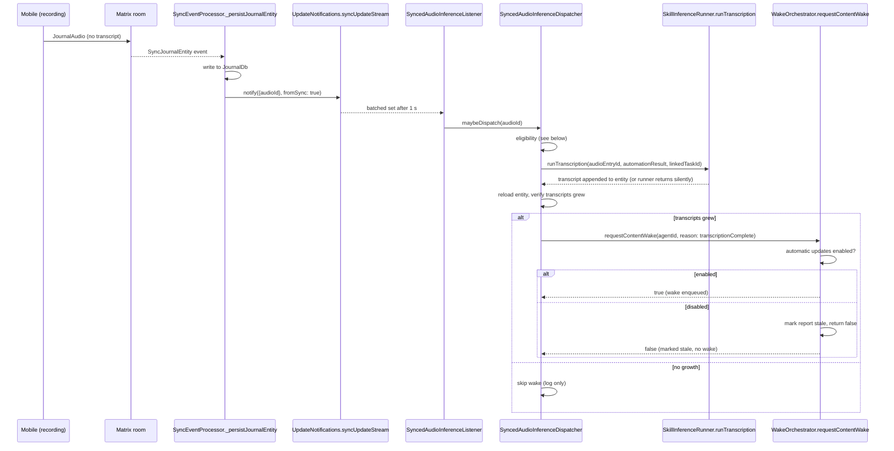

# The goal

An audio entry recorded on a phone — where local MLX and Ollama cannot run —
arrives on a capable desktop, and the desktop **automatically** runs MLX
transcription and the Ollama wake cycle, without the user touching either device
after recording.

The whole path is designed so synced audio can never accidentally leak to a
cloud transcription provider. That locality contract is the reason several
otherwise-convenient fallbacks are deliberately absent.

# Components

**`SyncNodeProfile`** captures one device's vector-clock `hostId`, display name,
platform, and advertised capabilities: `mlxAudio`, `omlxLlm`, `ollamaLlm`,
`voxtral`, `whisper`.

Capabilities are auto-detected at startup by
`makeDefaultSyncNodeCapabilityProbe`:

| Capability | Detected by |
|------------|-------------|
| `mlxAudio` | `Platform.isMacOS` |
| `omlxLlm` | The local OpenAI-compatible oMLX `/models` endpoint responds at the configured default base URL. **401/403 still counts as reachable**, because inference uses the saved provider key |
| `ollamaLlm` | A 300 ms request to `127.0.0.1:11434/api/version` succeeds |
| `voxtral`, `whisper` | Never auto-claimed — they need user-installed binaries the app does not manage |

**`SyncMessage.syncNodeProfile(profile)`** broadcasts the local self profile.
Receivers upsert it into a `SettingsDb` directory
(`sync_node_profile_directory`), last-write-wins by `updatedAt`.

**`SyncNodeProfileBroadcaster`** has two entry points:

- `broadcast()` — unconditional, called on every startup, so a peer that joined
  late, wiped settings, or missed the last event converges within a session. The
  receiver's last-write-wins upsert makes redundant re-publishes free.
- `broadcastIfChanged()` — diff-only, called from the rename UI to suppress
  no-op saves.

**`AiConfigInferenceProfile.pinnedHostId`** is a single VC host UUID. When set,
only that device claims inbound audio for the profile. **Null means no
auto-claim** — explicit and conservative, with no fallback to "any capable
desktop".

**`UpdateNotifications.syncUpdateStream`** emits the 1 s-batched id set for
every `notify(..., fromSync: true)` and nothing else. The dispatcher subscribes
here so it never fires on local edits or UI-only refreshes.

# Receive flow

# Eligibility, in order

Every step is a skip, and several exist specifically to protect the locality
contract:

1. Skip sentinels (`*_CHANGED`, `*_NOTIFICATION`).
2. Load the entity; skip if not `JournalAudio`. Capture `priorTranscriptCount`.
3. Skip if `priorTranscriptCount > 0` — already transcribed somewhere.
4. **Self-echo guard.** Skip if the clock has *exactly one* entry and it is the
   local host — a first-time self-originated entry. A merged remote clock that
   includes the local host alongside others passes through; step 3 covers
   re-transcription.
5. Find the linked task via `linksForEntryIds`; skip if there is no parent
   `Task`.
6. Call `ProfileAutomationResolver.resolveProfileIdForTask(taskId)` — same chain
   as `resolveForTask` (`agentConfig.profileId` → `version.profileId` →
   `template.profileId` → `task.data.profileId`). It **does not consult
   `category.defaultProfileId`**, which would let a category edit retroactively
   re-route claims.
7. Load the raw `AiConfigInferenceProfile`; skip if missing.
8. Skip if `profile.pinnedHostId == null`.
9. Skip if `profile.pinnedHostId != localHostId`.
10. Skip with an error log if `!await profileIsLocal(profile, repo)` — **fail
    closed**: an unresolved model id counts as not local.
11. Skip if `profile.transcriptionModelId == null` (the runner would
    early-return anyway).
12. Find the profile's automated transcription `SkillAssignment` — `automate:
    true` and `skill.skillType == transcription`. Skip if none: **there is no
    fallback** to the rank-ordered cloud-capable scan. Also skip if the profile
    owns more than one such skill, since their context policies could differ
    silently.
13. Build `ResolvedProfile` via `ProfileResolver.resolveByProfileId` plus
    `AutomationResult(handled: true, ...)`.
14. Call `skillInferenceRunner.runTranscription(...)` inside a `try` — a thrown
    runner reaches step 15 with no transcript growth.
15. Reload the entity. Skip the wake (log only) if `postCount <= priorCount` —
    a silent runner failure must not produce a misleading wake.
16. Resolve the task agent via `TaskAgentService.getTaskAgentForTask(linkedTaskId)`.
    Skip the wake (log only) if no agent exists — the recording is still
    transcribed, there is simply nothing to nudge.
17. Call `wakeOrchestrator.requestContentWake(agentId, reason:
    WakeReason.transcriptionComplete.name, triggerTokens: {linkedTaskId, id})`.
    This is **not** an unconditional enqueue: `requestContentWake` honors the
    per-agent automatic-updates opt-in. When the agent is in the orchestrator's
    `_automaticUpdatesDisabledAgents` set, it only persists a report-stale
    watermark (surfacing the manual "Wake agent" CTA) and returns `false`
    **without enqueuing a wake** — so a synced-audio transcription never spends
    tokens on an inference cycle the user has switched off. When automatic
    updates are enabled, it delegates to `enqueueManualWake` with
    `WakeInitiator.automation` and returns `true`.

**`AutomaticPromptTrigger` is deliberately not on this path.** Its
`ProfileAutomationService.tryTranscribe` re-enters the rank-ordered fallback that
includes cloud STT providers (Mistral, OpenAI, Alibaba Qwen), which would
silently break the local-only contract for synced audio.

# UI surfaces

- **`sync_node_profile_page.dart`** — settings page for this device: edit the
  display name, see auto-detected capability chips, list known peers. Reachable
  at `/settings/sync/node-profile`.
- **`profile_pinning_selector.dart`** (in the `ai` feature) — embedded in the
  inference-profile edit form. Filters the directory by required capabilities
  (`InferenceProviderType` → `NodeCapability` via
  `nodeCapabilityFromProviderType`), marks the local node with a "(this device)"
  suffix, and preserves a stale pin as a visible option so the user sees broken
  state instead of silently losing it.
