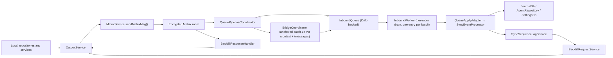
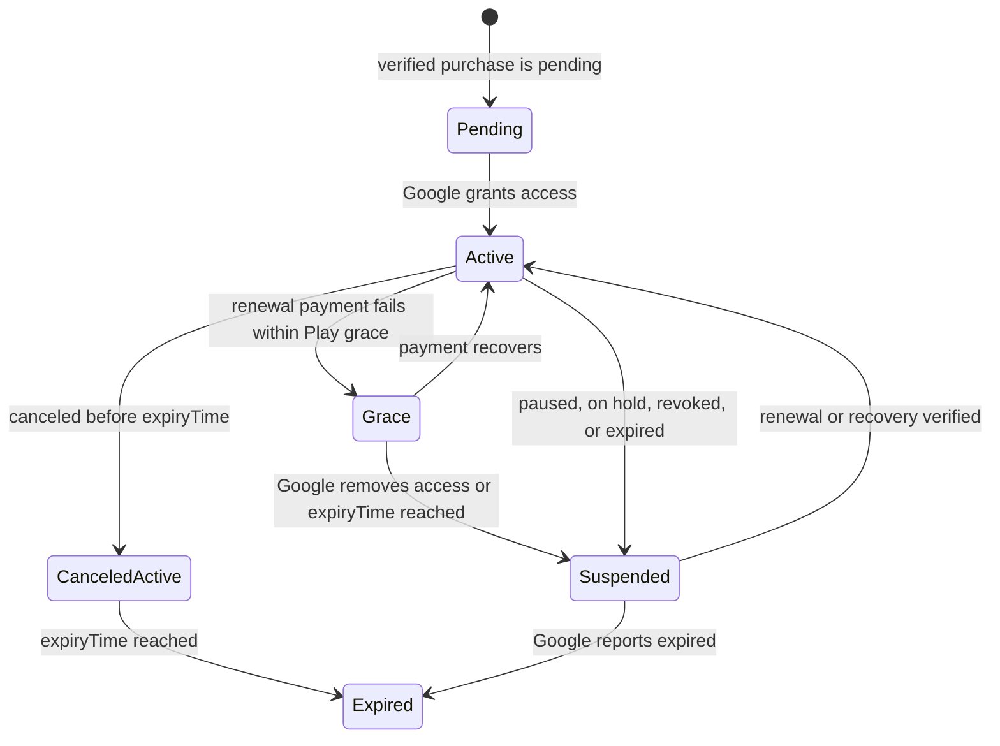
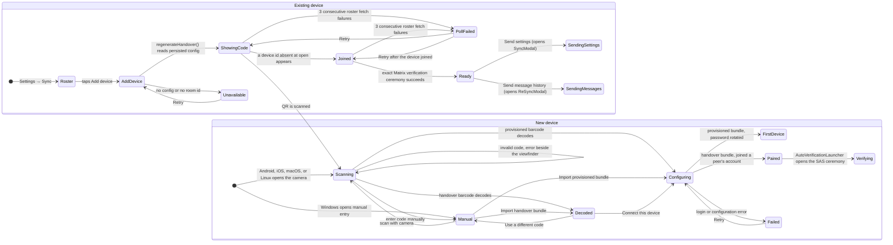

Sync replicates **one user's data across that user's own devices** over Matrix.
It is not a collaboration layer and not a raw event forwarder. It persists
outbound work, replays inbound history in order, tracks `(hostId, counter)`
coverage, and asks peers for counters it never received.

# What it owns

1. Outbound queueing, retries, backoff and send nudges.
2. Matrix session and room lifecycle.
3. Inbound ingestion — a live `timelineEvents` stream plus a `/messages` bridge
   for catch-up.
4. Applying sync payloads into local stores.
5. Sequence-log tracking for sequence-aware payloads.
6. Backfill request and response handling.
7. Provisioning, maintenance, verification and diagnostics UI.
8. The sync-node directory and auto-trigger of local AI inference on synced
   audio.

# Runtime shape



The default bootstrap in `lib/get_it.dart` wires `MatrixService`,
`OutboxService`, `SyncEventProcessor`, `SyncSequenceLogService`,
`BackfillRequestService` and `BackfillResponseHandler`. That is the path these
concepts describe. Construction order matters and is documented in
[bootstrap and dependency injection](../../architecture/bootstrap-and-di.md).

# Diagnostic logging policy

The `sync` log domain remains disabled by default and is intended for bounded
diagnostic captures. When enabled, failures, retries, gap detections, actionable
backfill sends and repair lifecycle transitions are emitted individually. These
are the events needed to explain non-convergence or an initial-sync backfill.

High-frequency bookkeeping uses `DomainLogger.logSampled`: the first event is
emitted immediately, followed by a counted summary every 100 observations or
five minutes. Every summary carries `sampleKey`, `observed`, `suppressed` and
cumulative `total`, so amplification remains measurable without one line per
record. The sampled families are enqueue insert/merge outcomes, sequence
binding writes and duplicate skips, vector-clock assignments, and embedded-link
preparation. Backfill's two no-work outcomes use the same scheme with a
50-observation / 15-minute window; actual requests remain unsampled.

Sample keys are bounded categories, never entry IDs. Representative lines may
carry IDs and vector clocks for diagnosis, but sync logging does not serialize
full journal, agent or attachment payloads.

# Code map

| Area | Role |
|------|------|
| `outbox/` | Persist pending payloads in `sync_db`, merge superseded work, enrich sequence metadata, drive send retries |
| `matrix/` | Session management, sync-room persistence and join/hydrate, message sending, read markers, verification, lifecycle. `MatrixPayloadSender` owns wire encoding (gzip, manifest, VC reconcile, size cap); `MatrixMessageSender` delegates to it |
| `gateway/` | `MatrixSyncGateway` interface and the `MatrixSdkGateway` implementation wrapping the Matrix SDK `Client` |
| `matrix/pipeline/` | Attachment ingestion and index, metrics aggregation, the `sync.limited` diagnostic listener |
| `queue/` | Persistent inbound queue, per-room worker, `onSync` catch-up bridge, durable late-key resume floor |
| `sequence/` | Record `(hostId, counter)` coverage, detect gaps, track lifecycle states |
| `backfill/` | Send missing-counter requests; answer peer requests with resend, deleted, unresolvable or covering-payload hints |
| `state/`, `ui/` | Riverpod controllers and the settings, stats, diagnostics, provisioning and maintenance screens |
| `services/`, `repository/` | Node capability probe, profile broadcaster, node-profile persistence, maintenance repository, synced-audio inference listener and dispatcher |

# Provisioned access and subscription state

The Matrix provisioning service has two credential-delivery modes. Admin and
CLI provisioning return a credential once and retain only its fingerprint. The
Google Play path, gated by `ENABLE_PLAY_SUBSCRIPTIONS`, binds a verified purchase
to a stable anonymous entitlement and retains the paid bundle in short-lived
authenticated encryption so a lost HTTP response can return the same bundle
rather than create a second Matrix account. After confirmed rotation destroys
that escrow, a replacement purchase returns a no-import recovery result and
unsuspends the existing Matrix account before responding; it never recreates
the bootstrap credential. The Android Billing client is not wired yet, so this
backend path is dormant while the feature flag remains off.
For local-JSON deployments, the bundled Compose stack treats
`GOOGLE_APPLICATION_CREDENTIALS` as a host path and binds it read-only to the
stable Application Default Credentials path inside the service container; the
subscription-disabled fallback cannot become usable Google credentials.

The anonymous entitlement endpoint consumes a durable, HMAC-pseudonymized
per-client quota before it creates any identity row. Purchase-intent requests
consume a durable per-entitlement attempt quota before scrypt verifies the
app-held secret, followed by a separate post-authentication issuance quota
before hashing and storing another one-time secret; the latter transaction
also prunes expired intents and their Integrity replay markers. Purchase
verification has its own durable attempt scope, consumed before entitlement or
intent scrypt checks and before either Google API call. The purchase intent is
consumed with the fresh post-Google verification timestamp, so authentication
and network time cannot extend its exact TTL. Paid-bundle delivery and
rotation share another durable attempt scope, consumed before entitlement or
claim-secret scrypt work. Expired-attempt cleanup stays within the current
operation because those scopes can have independently configured windows. Paid
provisioning then takes a token-owned SQLite reservation keyed by entitlement
before it touches Matrix. Pending escrow records the purchase-token fingerprint
that authorized their current claim secret: only a verified replacement token
can rebind it, while a second request for the same token must prove the existing
secret.
A linked replacement must grant access before the repository can store it or
retire the current token. First observations and the same-token path still
persist denial state so reconciliation can suspend Matrix. Replacement audit
events use the retired predecessor as their before-state, preserving recovery
and other lifecycle transitions across token rotation.
Requests in another service object or process wait for the owner's durable
claim and reuse it; a killed owner becomes recoverable after five minutes. A
replacement that takes over a stale paid-provisioning reservation receives a
fresh suffixed Matrix localpart. This fences it from the late owner: if the
late Synapse call eventually returns and its database write loses ownership,
orphan cleanup deactivates only the late owner's account and cannot deactivate
the replacement's winning account.
Cancellation after Matrix account creation is also fenced from SQLite commit:
the shared bundle service shields both the standard record write and paid atomic
escrow write, drains through repeated cancellation until the persistence
outcome is terminal, and deactivates only after a failure. Cancellation after a
successful commit therefore preserves the durable account instead of leaving
stored credentials for a deactivated user.
Admin bundle revocation destroys any paid bootstrap escrow in the same SQLite
transaction and clears its operation lease, so later and in-flight delivery
cannot return credentials after revocation wins the transaction order. Only a
claim revoked by the expiry reaper receives the durable abandonment marker that
permits a later verified purchase to detach it and create a replacement account;
an administrator-revoked claim remains linked and terminal.
These are database invariants, with reverse-proxy throttling kept as an
additional outer boundary. The bundled nginx forwards the original client
chain and Uvicorn trusts only nginx's fixed Compose address, so direct callers
cannot forge the quota identity through `X-Forwarded-For`.

Play RTDN is only a refresh signal. An authenticated Pub/Sub push resolves an
already-known token and causes a new `purchases.subscriptionsv2.get`; a periodic
reconciler performs the same authoritative refresh when notifications are lost.
Authenticated notifications for unbound tokens are acknowledged without a
Google query or state mutation because they may arrive before client
verification establishes the binding; that later verification is itself an
authoritative Google query. Authenticated Play `testNotification` probes are
also acknowledged without looking up a purchase token or mutating subscription
state. RTDN handling refreshes its wall clock after the Google query before
enforcing the current durable state, so work done during that refresh cannot
extend access past the authoritative expiry.
The Play-configured three-day grace deadline arrives as the line item's extended
`expiryTime`. Lotti uses that timestamp directly and never adds another local
grace window. Loss of entitlement suspends the Matrix user reversibly, while a
renewal or payment recovery unsuspends it without discarding device or E2EE
state. Client verification enforces the newly persisted current state before
attempting bundle delivery, including when that state denies access. The route
refreshes wall-clock time after Google verification and again before returning;
paid provisioning also refreshes time at every access boundary, including after
Matrix account creation, after claim-secret verification, and immediately before
decrypting escrow. If access expires during either operation, credential delivery
fails closed and the route runs one final enforcement pass against the freshly
reloaded subscription before returning credentials, so a concurrently suspended
purchase cannot leak escrow and an existing Matrix account does not remain
unsuspended. Reconciliation failure
handling also refreshes its clock before enforcing the durable snapshot and
scheduling its retry, so time spent waiting on Google cannot extend access.
The repository records the last observed Matrix suspension state separately
from Google's next refresh deadline. Any provisioned subscription whose desired
state differs remains due for reconciliation until successful enforcement is
recorded, including after a restart or after an access deadline passes. A newly
observed mismatch is selected ahead of ordinary Google refresh work, while a
failed Synapse attempt receives a five-minute retry deadline and is excluded
until then so repeated failures cannot monopolize a reconciliation batch. Access
enforcement reloads the authoritative subscription after the Synapse activity
lookup and before mutation, then refreshes its wall clock after the final
activity lookup before deciding and recording suspension. An expiry crossed
while Synapse responds therefore fails closed. After every suspension mutation,
enforcement reloads the entitlement and clock and immediately reconverges if
the account expired during the Synapse request; repeated concurrent state churn
is bounded and retried instead of looping indefinitely. The resulting observed
state is recorded on the current entitlement row even if its purchase token
changed during the request, so a late stale mutation remains visibly due for
correction.
Subscription reconciliation and paid-claim cleanup reject zero or negative
worker intervals during startup, preventing a configuration error from creating
a tight retry loop.
Suspension
requires Synapse 1.110.0 or newer with MSC3823 enabled; when
subscriptions are enabled, startup authenticates to Synapse and validates that
version, then probes the configured suspension endpoint with an invalid MXID
before workers start or purchase traffic is accepted. The expected
`M_INVALID_PARAM` proves that the route is registered without targeting an
account; an unrecognized route fails startup. Startup also constructs the paid
delivery service eagerly, so invalid provisioning wait, polling, or operation
timeout settings fail before any purchase intent can be consumed. Each enforcement
reloads the current purchase token while holding the entitlement's
serialization stripe, so an older refresh cannot suspend the account after a
replacement refresh restored it. Same-token persistence rejects snapshots
whose Publisher-response observation timestamp is older than the stored row.
The timestamp is captured after Google responds, so a request that started
earlier but returned later with newer evidence is not discarded.
Material lifecycle changes are also inserted into an append-only subscription
audit table before the snapshot upsert commits. The event and snapshot therefore
succeed or roll back together; SQLite triggers reject later event updates and
deletes, and audit rows retain only token fingerprints plus before/after state
rather than purchase secrets.



A paid bundle claim has a separate security boundary: delivery retries and
rotation confirmations share a pre-authentication attempt quota, and successful
requests are authorized by the entitlement and claim secret. Escrow is
destroyed only after the bound Matrix user publishes the server-derived rotation
challenge in the provisioned room and the bootstrap password no longer
authenticates. The legacy client rotation callback rejects every bundle backed
by a paid claim, so it cannot mark the user rotated while leaving escrow
unconfirmed and eligible for reaping. The
claim reaper deactivates an account that never reaches that proof before its
24-hour TTL. Its first destructive batch waits for an operator-configurable
startup delay. Rotation verification and reaping first acquire mutually exclusive
tokenized database leases; failed or crashed workers release or age out their
lease, and a late worker cannot clear a newer owner's lease. Reaper
finalization requires the same operation token that reserved the claim, so an
administrator who revokes the bundle while Synapse deactivation is in flight
wins permanently instead of having the worker relabel the claim as abandoned.
Failed reaper
attempts receive a separate bounded retry time so one broken account cannot
starve later claims; this never extends the escrow TTL. Authenticated delivery
retries acquire the same mutually exclusive operation lease before claim-secret
verification and complete the delivery stamp only while retaining ownership,
so the reaper cannot revoke the account behind an in-flight response. A linked
replacement purchase reauthorizes still-pending escrow with its verified claim
secret only while that purchase token remains current. A later verified payment
may detach an abandoned, revoked claim and provision a
fresh Matrix account, retrying with a suffixed localpart if the deterministic
name survived an earlier rollback. A rotation confirmation is idempotent only
when the claim has a real `confirmed_at`; a late request cannot turn a
reaper-destroyed claim into apparent success. Confirmed claims recover only a
still-non-revoked account, checked both before and after the purchase
acknowledgement path, without recreating bootstrap credentials. Pending plaintext
delivery is also revalidated immediately before return: its account must remain
non-revoked and its claim current, nonterminal, encrypted, and within TTL even if
Google acknowledgement was slow. The local acknowledgement timestamp is
monotonic metadata: same-token verification and reconciliation upserts preserve
it when Google's acknowledged snapshot supplies state but no local time. Lost-response
delivery retries reload the current subscription and reject non-granting state
or an elapsed authoritative expiry before decrypting escrow. The retry route
refreshes its clock after entitlement authentication and stops before claim
delivery when enforcement suspends the account. It then reloads and re-enforces
the current row once more after delivery so a concurrent
replacement purchase's entitlement state, rather than its predecessor's stale
state, is returned only when it still grants access. Both this retry path and the
purchase-verification path revalidate the cached plaintext delivery against the
current subscription, account status and nonterminal claim from one SQLite read
snapshot immediately after their final Matrix enforcement. The fresh entitlement
state and deadline are checked before building the response, with no intervening
await. An administrator revocation or entitlement loss that wins after the
delivery lease is released therefore cannot return bootstrap credentials.
Rotation refreshes its wall clock
after entitlement and claim-secret authentication and rejects an exact-TTL expiry
before reserving the claim, so authentication time cannot extend the escrow
window or exclude the reaper after expiry.

# Pairing a new device

Pairing moves a **handover bundle** — homeserver, MXID, live password, room id,
Base64url-encoded — from a device that already syncs to one that does not.
`SyncBundleKind` decides what consuming it does: a `provisioned` bundle (minted
by the provisioning service through admin or verified-subscription flows, or
by the CLI) rotates the account password and persists the new one; a `handover`
bundle (minted by a peer) joins without rotating, so every peer shares one live
credential. The controller's state transitions expose that distinction directly:
a rotating bundle enters `rotatingPassword`, while a handover bundle proceeds
from room join to `done`. The behavior derives from bundle kind, never platform.



Five properties are deliberate:

- **The handover code is a live credential, so it is never ambient.** It is
  minted on demand inside `ui/provisioned/add_device_page.dart` and only while
  that sheet is open — it used to render unconditionally at the bottom of the
  status page on desktop. It is hidden until revealed, and the sheet states
  that the code unlocks the account. "Never ambient" is about *display*, not
  secrecy: *Copy pairing code* puts it on the clipboard by design, both as a
  fallback when camera access is unavailable and as the primary Windows path.
  See the check-code bullet below for what that means for the threat model.
- **Add device is not platform-gated.** Any paired device can present a code,
  so a surviving phone can onboard a replacement for a dead desktop.
- **Camera scanning follows platform capability.** Android, iOS, and macOS use
  `mobile_scanner`; Linux streams webcam frames through the standard camera API
  backed by `camera_desktop` and decodes QR payloads in a worker isolate with
  `zxing2`. Only one Linux frame is decoded at a time and intervening frames are
  skipped to keep the UI responsive. Camera denial or absence leaves manual
  entry available, and Windows stays manual-only until it gets a scanner.
- **Both devices warn, and the warning touches the credential.** The inviting
  side keeps a lock-badged `DesignSystemInlineCallout` (the design-system
  component the sync-local callout was promoted into) glued directly under
  its pairing card; the joining side renders the caveat *inside* the warning-bordered
  well that holds the paste field (manual) or directly under the viewfinder
  (camera), so the warning physically shares a frame with the secret it is
  about. The weight belongs on the joining device because that is the side an
  attack lands on: the inviting device is showing its own code and is not at
  risk, while a joining device tricked into scanning a stranger's code
  attaches itself, and everything written on it, to that stranger's account.
  Its copy names that consequence rather than stopping at "only use your own
  code".
- **A first device skips the peer-only confirmation.** A
  `provisioned` bundle normally establishes the account's only device. Once it
  decodes, `BundleImportWidget` starts configuration immediately because no
  peer exists to display a comparison code. A peer-minted `handover` bundle
  still stops on the review and requires the user to connect deliberately.
- **Both devices in a handover derive the same check code.**
  `models/pairing_check_code.dart`
  hashes `"$user|$roomId|$homeServer"` and shows six hex characters, rendered on
  both sides through one `PairingCheckCodeView`: the inviting device derives it
  from its persisted config, the joining device from the decoded bundle. Every
  field the confirmation card displays is folded in, so the digits cover what
  the reader is actually looking at. It is a **recognition aid, not a security
  control** — unkeyed and derived from public identifiers, so it catches the
  wrong-code mistake and nothing more.

  Nothing in this step protects the bundle itself. It carries the account's
  live password, Base64url-encoded — encoding, not encryption — and the sheet
  offers a *Copy pairing code* control, so it can leave the screen as text.
  Anyone holding it can join the account. The SAS ceremony that follows
  protects a different thing: which devices are trusted with megolm keys from
  then on (`ShareKeysWith.directlyVerifiedOnly`, ADR 0045). It does not
  retroactively protect a leaked bundle. Reducing what the code carries is
  tracked separately in lotti3-ujm.
- **The inviting sheet follows one exact device through the security
  boundary.** The roster reports that at least one new session joined, but it
  never chooses the transfer target: multiple devices can appear between two
  polls. The successful outgoing or incoming Matrix verification ceremony
  supplies the exact `(userId, deviceId)`, and a ceremony for a session that
  was already present when the sheet opened is ignored. Runner objects already
  retained by `MatrixService` when the sheet opens are ignored too, including
  the incoming stream's on-listen replay. An older peer, stale success or a
  different concurrent join cannot unlock the new target's transfer actions.
  *Send settings* and *Send message history* remain disabled
  until the state reaches `ready`, because
  `ShareKeysWith.directlyVerifiedOnly` means an unverified target receives the
  ciphertext but not the keys needed to read it. The inviting sheet therefore
  has to stay open through the emoji ceremony. If it was closed, the safe
  fallback is the other device's Sync Settings → Maintenance page, whose
  independent settings and message pushes do not pretend to identify a newly
  joined target.

  The **accent** on *Send settings* follows readiness too, and deliberately so:
  the design system paints an enabled `secondary` button with the same token
  it paints a *disabled* filled one, so a quiet-but-live control read as inert.
  It is `outlined` before verification and `primary` after it, with the lead-in
  and the status line switching off the same state — three lines about one
  control that disagreed left the user unable to tell.
  `AddDeviceJoinSignal` — a `ValueNotifier<AddDeviceJoinState>` carrying the
  body's retry callback — is what connects the halves, because the sticky bar
  is built outside the view's `State`. The bar, not the card, renders the live
  waiting/joined/failed line: on a phone the card's own strip is below the
  fold, so a caption there described state the user could not see.
- **The confirmation screen's rejection is a real rejection.** `_discardDecoded`
  switches to manual entry and records the payload in `_rejectedCodes`.
  Returning to the camera contradicts the button's label *and* re-decodes the
  QR still displayed on the other device on the very next frame, so the reject
  button used to bounce the user straight back into what they had refused. For
  the same reason the mismatch copy names the account, not a fresh code: the
  check code is a pure function of account, room and server, so regenerating a
  handover produces a byte-identical one and cannot resolve a mismatch.

**Configuring has two endings, and they are not interchangeable.**
`ProvisioningState.ready` follows a `provisioned` bundle: the
password has just been rotated and this is normally the *only* device on the
account, so `_FirstDeviceView` says the account is set up and stops. There is
no peer to run a SAS ceremony against and none to push settings from, so the
diagram's `Verifying` transition does not apply to it.
`ProvisioningState.done` follows a `handover` bundle minted by a peer, so a
peer demonstrably exists; that is the state `_PairedView` serves, with its two
outstanding steps. Collapsing them told a first device to wait on a device that
did not exist.

Pairing does **not** bring data across by itself. Config entities (categories,
habits, dashboards, measurables, AI settings) only arrive when an existing
device runs the entity push (`ui/sync_modal.dart`). Entries that predate the
join are not gap-detected either — a counter from a never-seen host is recorded
without becoming a gap (see
[sequence and backfill](sequence-and-backfill.md)). After emoji verification,
the inviting device exposes both follow-up transfers in the sticky action bar:
*Send settings* opens `SyncModal`, while *Send message history* opens
`ReSyncModal`
and re-enqueues that device's local history. The latter defaults to *All*,
with *Last 30 days* and a validated custom interval available. Custom start
and end dates use the shared design-system calendar, including year selection,
and the selected end date is inclusive. The modal reports journal,
agent-entity and agent-link enqueue phases before summarizing the result. A
device consuming the handover
persists an automatic-backfill preflight before its Matrix login can start
timeline processing. The full *All* action then replaces that blanket,
one-hour-bounded gate with an exact suppression range for the new device, so it
does not request snapshot rows that are merely queued or in flight. Choosing a
partial range, dismissing the history sheet without starting, or closing Add
Device after verification without opening history sends an empty-range
Begin/End pair that adopts and releases the provisional gate without
suppressing any counter range. Manual repair remains unchanged. The runtime
contract is in
[sequence and backfill](sequence-and-backfill.md#initial-onboarding-suppression).

The agent phases stamp before they send. An agent entity or link persisted with
`vectorClock: null` is applied by the receiving peer but skipped by
`_recordReceivedAgentEntity`, so it lands invisible to the sequence log, gap
detection and backfill. `HistoricalSyncService.reSyncInterval`'s agent
`enqueueAction` therefore
gives any clockless row a vector clock and persists it *before* enqueueing —
inside the interval sweep, so a *Last 30 days* run repairs only what it is
about to send rather than every legacy row in the database. The stamp is
persisted before enqueue, and the failed-row retry retains that stamped value
so an enqueue-only failure does not increment the clock again.
`SyncMaintenanceRepository.backfillAgentEntityClocks` /
`backfillAgentLinkClocks` remain the whole-database version of the same repair,
reachable from *Backfill sync* as the **Agent vector clocks** recovery action.
The historical sweep fetches undecoded journal and agent rows, then isolates
every journal entity, entry link, agent entity and agent link: decode,
preparation, persistence or enqueue failure is logged with its payload family
and id, collected in `ReSyncResult`, and never aborts later rows or phases.
Journal links include hidden relationship state and are staged only after the
whole interval's entries have been attempted; their serialized rows are then
read and released in bounded source-ID pages rather than retained for the full
interval. A journal or agent link whose
in-range source or target did not queue is retained as a dependent failure;
retry always attempts entity failures first and queues the link only after its
dependencies succeed. The modal reports the successful and failed counts, lists the
failed ids, and retries only those retained actions. During onboarding, the
exact suppression round remains active until all failed rows succeed;
dismissing the sheet while staging or retrying aborts the round, and the
disposed sheet cannot subsequently queue a completion barrier.
The paired screen names both transfers because the new device cannot send
history it does not yet have.

The joining wizard's wayfinding is drawn, not narrated: a three-station
`SyncWizardProgressTrack` (Get code · Check · Connect) heads the handover
steps, with the accent on the live station and passed stations faded. A first
device jumps from Get code directly to Connect because Check requires a peer.
The three endings —
first device, paired, error — drop the track, because a progress line under a
terminal screen would promise a next station that does not exist. The
inviting sheet carries no track at all: it is not a wizard, and its live
state is a three-stop timeline in the body (waiting → joined → verified)
plus a one-line caption in the pinned bar explaining the locked hand-off
buttons.

A failed connect distinguishes its remedies honestly: closing the inviting
sheet does not revoke a code (`regenerateHandover()` re-serializes the
persisted credential unchanged), but a rejected login usually means the code
predates a password rotation — the first pairing from a `provisioned`
bundle rotates
it — or was mangled in transit, and both are fixed by a fresh code, never by
re-attempting this one. So the bar's accent is *Enter a new code* (which
resets `ProvisioningController` — the import page listens for the return to
`initial` and clears its stale decoded bundle), while *Retry this code*
stays as the demoted quiet action for transient network failures.

The last screen is state-driven throughout, for one reason worth stating: a
device that has completed the SAS ceremony leaves `getUnverifiedDevices()`
exactly as an unpaired one does, so absence from that set cannot mean "done".
`_PairedView` reads success off the roster instead and passes it down, which
flips the gate checklist — step 1 closes to a checked row, step 2 unlocks —
and swaps the bar's accent from *Show the emoji* to *Go to Devices*.
Computed in two places, they contradicted each other on the terminal screen
of the entire flow. *Show the emoji* stays disabled while
`matrixUnverifiedControllerProvider` is empty: right after the handover the
peer's device keys are often still in flight, and a relaunch request fired
then would vanish into a launcher with nothing to relaunch —
`AutoVerificationLauncher` opens the ceremony on its own the moment the keys
land, and the button enables at the same moment for reopening a dismissed
sheet.

The roster keeps the hand-off from dying with the sheet: if a device joins
and completes its ceremony while the device list is open — the reopened-sheet
case that used to dead-end in Maintenance — `SyncDevicesList` shows a
one-time banner offering *Send settings* and *Send message history* directly.

The three modal pages share `SyncStickyBar` and
`WoltModalConfig.stickyActionBarClearance`: the bar draws a top hairline so
content scrolling underneath reads as continuing rather than truncated, and the
clearance is named rather than copy-pasted as a bare `80` into every page that
has one.

`AutoVerificationLauncher`
(`ui/widgets/matrix/auto_verification_launcher.dart`) is shared by the paired
screen and the status page. It reacts to `matrixUnverifiedControllerProvider`
rather than waiting a fixed delay for device keys to arrive, and takes the
app-wide modal lock so two surfaces watching the same provider cannot both
open a ceremony.

Three details there are load-bearing, each fixing a way the ceremony could
reach the wrong device or none at all:

- It offers the first device **not already shown**, keyed on
  `(userId, deviceId)` — not simply `devices.first`. A stale or legacy
  unverified peer can sort ahead of the device actually being paired.
- That record lives in `matrixVerificationHandledProvider`, not in the widget's
  `State`, because two launchers can be mounted at once — the settings pane
  embeds the roster while the setup modal is open. Per-widget, the one that
  lost the lock knew nothing about what the winner had shown and reopened the
  sheet the user had just dismissed.
- A device is recorded only when its ceremony is **shown**. Recording on a
  failed lock acquisition looks equivalent and is not: a manual or incoming
  ceremony holding the lock invalidates the unverified provider repeatedly
  while its sheet is open, so every rebuild would consume another peer and
  leave a newly paired device with nothing once the lock freed.
- Clearing that record once nothing is unverified is **deferred to a
  post-frame callback**, because Riverpod rejects a provider write during
  widget construction. The empty-list branch runs on initial mount too, but it
  only writes when the set is non-empty — which is the *successful*
  verification of the last pending device. Clearing inline was therefore silent
  in the common case and threw at the normal end of the flow.

Whether the settings surface shows the roster or the pairing setup card is
`syncConfiguredProvider` (`state/sync_configured_provider.dart`): logged in
**and** holding a room id. Neither half notifies on its own —
`MatrixService.syncRoomId` is a plain read through to a plain field — so the
provider watches three signals and then reads the service once for the current
truth. Login state alone is not enough, and the gap is not theoretical:
`SyncSessionManager.connect()` drops a persisted room the account can no longer
join (`M_FORBIDDEN`/`M_NOT_FOUND`) *after* the login event has already fired,
leaving the roster on screen for a room that no longer exists.
`SyncRoomManager.roomIdChanges` closes that — every mutation of the room id
goes through one private setter, so no path can change it without emitting.

## Telling a finished ceremony from a failed one

The SDK's `KeyVerification.isDone` is `canceled || state in {error, done}` —
true for a ceremony that was refused just as loudly as for one that verified
(matrix 10.0.0, `encryption/utils/key_verification.dart`). Every SDK path that
sets `error` also sets `canceled`, so failure is not separable from
cancellation; there are two terminal outcomes, not three.

`keyVerificationOutcome` (`matrix/key_verification_runner.dart`) is the single
place that classifies one, and `KeyVerificationRunner.outcome` exposes it.
Cancellation is checked first and deliberately wins: a remote cancel sets
`canceled` without clearing the state that preceded it, and claiming success
for a ceremony that did not verify is the worse of the two errors. It is a free
function rather than only a getter so test doubles derive the same answer
instead of copying the rules.

Three consequences, each of which was a defect while `isDone` stood in for
success:

- **Both verification modals show the green shield only on `success`.** The
  outgoing one used to render the cancellation notice and the success shield at
  the same time; the incoming one had no cancellation branch at all, so a
  refusal read as a completed verification.
- **`onCompleted` fires only on `success`.** It runs `updateUserDeviceKeys` and
  a rescan, which a cancelled ceremony has no business triggering.
- **The auto-dismiss timer is armed once**, from `_scheduleAutoDismiss` rather
  than from `build`. A `StreamBuilder` re-runs `build` for every emission while
  a terminal state holds, so the old code armed a fresh 30-second pop per
  rebuild and each one fired at whatever route existed by then.

`matrixVerificationRelaunchProvider` is what "show the emoji again" bumps. It
releases only the identity that launcher last showed, deliberately rather than
clearing the set: a reset restarts selection at the head of the list and
reopens the stale peer instead of the ceremony just dismissed.

# Device management

All of a user's devices are sessions on **one Matrix account**; verification
state is per-install local trust (there is no cross-signing). The client is
constructed with `ShareKeysWith.directlyVerifiedOnly` (ADR 0045,
`matrix/client.dart`): a device this session has not SAS-verified receives
**no megolm keys** and cannot read new entries, while every verified device
keeps syncing. Sends are never halted for unverified devices — the sender
only logs the exclusion (`matrix/matrix_message_sender.dart`). A dead
session — an uninstalled app that never logged out — therefore costs
nothing beyond roster noise, and device management exists to explain and
clean it up:

- **Two account models.** The current pairing flow shares **one Matrix
  account** across all devices. Rooms paired under the **legacy model run one
  Matrix user per device**; direct SAS verification works cross-user, so key
  sharing honours it identically there. The unverified set
  (`MatrixSyncGateway.unverifiedDevices()`) deliberately spans every cached
  user, and the roster derives its warning state from that same full set: a
  foreign user's unverified device appears as a **verify-only** entry
  (`SyncDeviceInfo.ownAccount == false`) — it can be SAS-verified cross-user
  but never deleted from this account.
- **Inventory.** `MatrixServiceOps.getSyncDevices()` merges the homeserver's
  session inventory (`MatrixSyncGateway.getDevices()`, i.e. `GET /devices`:
  display name, last-seen) with the E2EE key cache (verification state) into
  `models/sync_device_info.dart`, after waiting (bounded) for an in-flight
  key load. Sessions that never published keys appear with `keys == null`:
  they cannot be verified and hold nothing to exclude — only removed. An
  **own-account unverified cached-keys entry missing from the server list**
  is retained as a **deletion-only** entry (`onServer == false` — a session
  the server no longer knows can never answer a verification): exclusion is
  computed from the key cache, not `GET /devices`, so dropping it would
  clear the warning while the exclusion persists. Display order: excluded
  devices first, then the current device, then recency.

  ```mermaid
  stateDiagram-v2
    [*] --> Excluded: unverified, receives no megolm keys, cannot read new entries
    Excluded --> Verifying: user starts SAS verification (own on-server or legacy foreign device)
    Verifying --> Excluded: cancelled, refused, or times out
    Verifying --> Recovering: emoji ceremony succeeds
    Excluded --> Deleting: user confirms removal (own-account sessions only)
    Deleting --> Reauthenticating: UIA rejected (M_FORBIDDEN — stored password is stale)
    Reauthenticating --> Deleting: user supplies the account's current password
    Reauthenticating --> Excluded: user cancels the password prompt
    Deleting --> Recovering: homeserver accepts the delete
    Recovering --> Trusted: keys refreshed, lifecycle reconciled, rescan
    Recovering --> ConvergesLater: refresh fails or exceeds deleteDeviceRecoveryTimeout
    ConvergesLater --> Trusted: a later sync prunes the cached keys
    Trusted --> [*]
  ```
- **Deletion recovery sequence.** `MatrixServiceOps.deleteDeviceById()` runs,
  in order: cancel any in-flight emoji verification against the device (a
  dead peer can never answer), delete the session on the homeserver
  (UIA-gated with the stored account password), then a **best-effort,
  bounded** recovery — refresh cached device keys, reconcile the lifecycle,
  trigger a catch-up rescan — shared with post-verification recovery
  (`refreshDeviceKeysAndResumeSync`). Recovery failures are logged and
  swallowed, and the whole recovery is capped by
  `SyncTuning.deleteDeviceRecoveryTimeout`: once the homeserver accepted the
  delete, a network drop must not hang the caller; the cache converges on a
  later sync.
- **Interactive re-authentication.** `M_FORBIDDEN` on the delete means the
  homeserver rejected the *credential*, not the request: the account password
  was rotated on another device while this one kept syncing on its access
  token, so the persisted password no longer matches. `deleteDeviceById`
  therefore takes an optional `reauthPassword` that replaces the stored one
  for that call, and `device_card.dart` opens
  `ui/widgets/matrix/sync_reauth_modal.dart` instead of ending in a toast. The
  sheet stays open across failed attempts, attaching the reason to the field,
  so a mistyped password costs one correction rather than the whole
  confirm-and-delete flow. The retry outlives the sheet — dismissing it
  mid-flight must not drop a removal that then succeeds — so `DeviceCard`
  tracks the outcome itself and awaits the in-flight call rather than reading
  the modal's result.
- **Credential repair.** **A delete the homeserver actually performed repairs
  the stored config** — accepting the password proves it is the account's —
  so later interactive operations no longer prompt. Two conditions bound it.
  The repair requires the *delete* to have succeeded, not merely the method:
  `M_NOT_FOUND` is treated as success but can come from a peer's concurrent
  deletion without the password ever being validated, so it must not
  authorise a write. And the write is best-effort in both directions: the
  device is already gone, so a failure is logged
  (`deleteDevice.reauthPersist`) rather than reported as a failed removal —
  and because `SecureStorage.writeValue` deletes the key before writing it, a
  failed write is followed by an attempt to put the previous config back
  (`deleteDevice.reauthRestore`), so a half-completed replacement cannot
  strand the account with no credentials to reconnect with.
- **Guards.** Deletion targets account-owned device ids surfaced by
  `getSyncDevices()`, including deletion-only cached entries for sessions no
  longer present in the homeserver inventory. Foreign-user entries are
  verify-only and never offer removal. At the operation boundary,
  `deleteDeviceById` refuses the current session (use logout instead). Deletion
  also needs *some* password — stored or typed — and is refused with an
  `UnsupportedError` when neither exists (SSO/token UIA is not implemented).
- **UI.** `ui/widgets/matrix/sync_devices_list.dart` renders the inventory on
  the provisioned-status page with a warning banner while any unverified
  device is excluded from key sharing; `ui/widgets/matrix/device_card.dart` flips its action
  hierarchy for stale unverified devices — removal becomes the labeled
  primary action, verification is demoted — because a device silent past
  `syncDeviceStaleThreshold` will never complete a ceremony, so removal is
  the realistic way to clear it. Verification on such a device is gated by a
  pre-flight warning for the same reason: the ceremony needs the peer awake
  and online, and a waiting ceremony is indistinguishable from a slow one, so
  the cost is stated before the modal opens rather than discovered in it.
  Removal never "resumes sync": verified peers keep syncing throughout
  (ADR 0045). Verifying instead restores that device's own access to new
  entries.

# Concepts

* [Message model](message-model.md) - what travels on the wire and which payloads are sequence-tracked.
* [Vector clocks and conflicts](vector-clocks-and-conflicts.md) - causal ordering, supersession, and what happens when two devices diverge.
* [Send path](send-path.md) - outbox staging, dequeue-time bundling, retries.
* [Receive path](receive-path.md) - the inbound queue pipeline, catch-up bridge, and marker advancement.
* [Sequence log and backfill](sequence-and-backfill.md) - causal accounting and gap repair.
* [Node profiles and auto-trigger](node-profiles-and-auto-trigger.md) - capability advertisement and local-only inference on synced audio.

# Standing constraints

The correctness of the whole feature rests on a few sharp assumptions:

- The stack described here exists only in **real profiles**. Guest/demo
  worlds never construct it — they register an inert outbox instead, have
  their own per-world host ID, and never read the keychain Matrix
  credentials. See
  [profiles and demo mode](../../architecture/profiles-and-demo-mode.md).

- Sender-side `coveredVectorClocks` enrichment must stay correct, or offline
  convergence stops being sound.
- File-backed payload replay depends on attachment dedupe and ordering in
  `matrix/pipeline/attachment_*`.
- Backfill correctness depends on verified `(hostId, counter) → payloadId`
  mappings, never on "some later vector clock exists".

# Who feeds it

| Producer | Enqueues |
|----------|----------|
| `journal` repositories and `PersistenceLogic` | journal entities and entry links |
| `agents/sync/agent_sync_service.dart` | agent entities and links |
| `ai` repositories | AI config updates and deletes |
| `SavedTaskFiltersRepository` | `savedTaskFilter` / `savedTaskFilterDelete` per item |
| `PersistenceLogic.setConfigFlag(...)` | `configFlag` — only on explicit user change |
| Theming | `themingSelection` |
| `ai_consumption` | `consumptionEvent` |

Startup flag seeding deliberately uses `JournalDb.insertFlagIfNotExists(...)`
and does **not** broadcast, so a device only pushes a flag state when the user
actually changes that setting.

Related: [persistence](../../architecture/persistence.md) for `sync.sqlite`,
[security and privacy](../../architecture/security-and-privacy.md) for the
encryption story.
