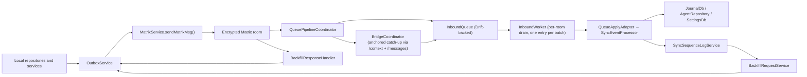
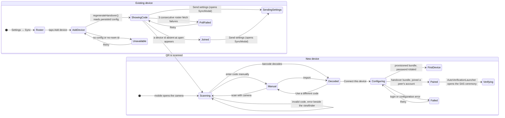
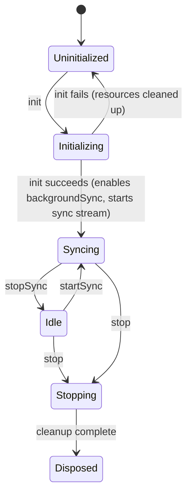

Sync replicates **one user's data across that user's own devices** over Matrix.
It is not a collaboration layer and not a raw event forwarder. It persists
outbound work, replays inbound history in order, tracks `(hostId, counter)`
coverage, and asks peers for counters it never received.

# What it owns

1. Outbound queueing, retries, backoff and send nudges.
2. Matrix session and room lifecycle.
3. Inbound ingestion — a live `timelineEvents` stream plus a `/messages` bridge
   for catch-up.
4. Applying sync payloads into local stores.
5. Sequence-log tracking for sequence-aware payloads.
6. Backfill request and response handling.
7. Provisioning, maintenance, verification and diagnostics UI.
8. The sync-node directory and auto-trigger of local AI inference on synced
   audio.

# Runtime shape



The default bootstrap in `lib/get_it.dart` wires `MatrixService`,
`OutboxService`, `SyncEventProcessor`, `SyncSequenceLogService`,
`BackfillRequestService` and `BackfillResponseHandler`. That is the path these
concepts describe. Construction order matters and is documented in
[bootstrap and dependency injection](../../architecture/bootstrap-and-di.md).

# Code map

| Area | Role |
|------|------|
| `outbox/` | Persist pending payloads in `sync_db`, merge superseded work, enrich sequence metadata, drive send retries |
| `matrix/` | Session management, room discovery and persistence, message sending, read markers, verification, lifecycle. `MatrixPayloadSender` owns wire encoding (gzip, manifest, VC reconcile, size cap); `MatrixMessageSender` delegates to it |
| `gateway/` | `MatrixSyncGateway` interface and the `MatrixSdkGateway` implementation wrapping the Matrix SDK `Client` |
| `matrix/pipeline/` | Attachment ingestion and index, metrics aggregation, the `sync.limited` diagnostic listener |
| `queue/` | Persistent inbound queue, per-room worker, `onSync` catch-up bridge, pending-decryption holding pen |
| `sequence/` | Record `(hostId, counter)` coverage, detect gaps, track lifecycle states |
| `backfill/` | Send missing-counter requests; answer peer requests with resend, deleted, unresolvable or covering-payload hints |
| `state/`, `ui/` | Riverpod controllers and the settings, stats, diagnostics, provisioning and maintenance screens |
| `actor/` | Isolate-based sync implementation — present and tested, **not** wired by the default bootstrap |
| `services/`, `repository/` | Node capability probe, profile broadcaster, node-profile persistence, maintenance repository, synced-audio inference listener and dispatcher |

# Pairing a new device

Pairing moves a **handover bundle** — homeserver, MXID, live password, room id,
Base64url-encoded — from a device that already syncs to one that does not.
`SyncBundleKind` decides what consuming it does: a `provisioned` bundle (minted
by the CLI) rotates the account password and persists the new one; a `handover`
bundle (minted by a peer) joins without rotating, so every peer shares one live
credential. `ProvisioningController.rotatesPassword` exposes that distinction —
the progress step count is **three for a rotating bundle and two otherwise**,
and derives from the bundle kind, never from the platform.



Four properties are deliberate:

- **The handover code is a live credential, so it is never ambient.** It is
  minted on demand inside `ui/provisioned/add_device_page.dart` and only while
  that sheet is open — it used to render unconditionally at the bottom of the
  status page on desktop. It is hidden until revealed, and the sheet states
  that the code unlocks the account. "Never ambient" is about *display*, not
  secrecy: *Copy pairing code* puts it on the clipboard by design, because a
  desktop joining a desktop has no camera. See the check-code bullet below for
  what that means for the threat model.
- **Add device is not platform-gated.** Any paired device can present a code,
  so a surviving phone can onboard a replacement for a dead desktop.
- **Both devices warn, and the joining one warns louder.** Each side wraps its
  caveat in a lock-badged `SyncCallout` ahead of the thing it is about — above
  the QR on the inviting side, above the viewfinder on the joining side. The
  weight belongs on the joining device because that is the side an attack
  lands on: the inviting device is showing its own code and is not at risk,
  while a joining device tricked into scanning a stranger's code attaches
  itself, and everything written on it, to that stranger's account. Its copy
  names that consequence rather than stopping at "only use your own code".
- **Both devices derive the same check code.** `models/pairing_check_code.dart`
  hashes `"$user|$roomId|$homeServer"` and shows six hex characters, rendered on
  both sides through one `PairingCheckCodeView`: the inviting device derives it
  from its persisted config, the joining device from the decoded bundle. Every
  field the confirmation card displays is folded in, so the digits cover what
  the reader is actually looking at. It is a **recognition aid, not a security
  control** — unkeyed and derived from public identifiers, so it catches the
  wrong-code mistake and nothing more.

  Nothing in this step protects the bundle itself. It carries the account's
  live password, Base64url-encoded — encoding, not encryption — and the sheet
  offers a *Copy pairing code* control, so it can leave the screen as text.
  Anyone holding it can join the account. The SAS ceremony that follows
  protects a different thing: which devices are trusted with megolm keys from
  then on (`ShareKeysWith.directlyVerifiedOnly`, ADR 0045). It does not
  retroactively protect a leaked bundle. Reducing what the code carries is
  tracked separately in lotti3-ujm.
- **The waiting latch, the hand-off gate and the hand-off's emphasis are three
  separate questions.** `_observeRoster` latches "a new device joined" on a
  device id absent when the sheet opened. Whether *Send settings* is *enabled*
  is `AddDeviceActionBar.hasPeer` — does the account hold any session other
  than this one — because the joining device tells the user to come back and
  press it, by which time the sheet has usually been closed and reopened, and
  gating on the delta left the button permanently dead in exactly that case.
  The **accent** follows enablement too, and deliberately so: the design
  system paints an enabled `secondary` button with the same token it paints a
  *disabled* filled one, so a quiet-but-live control read as inert. It is
  `outlined` while it cannot be pressed and `primary` the moment it can, with
  the lead-in and the status line switching off the same boolean — three lines
  about one control that disagreed left the user unable to tell.
  `AddDeviceJoinSignal` — a `ValueNotifier<AddDeviceJoinState>` carrying the
  body's retry callback — is what connects the halves, because the sticky bar
  is built outside the view's `State`. The bar, not the card, renders the live
  waiting/joined/failed line: on a phone the card's own strip is below the
  fold, so a caption there described state the user could not see.
- **The confirmation screen's rejection is a real rejection.** `_discardDecoded`
  switches to manual entry and records the payload in `_rejectedCodes`.
  Returning to the camera contradicts the button's label *and* re-decodes the
  QR still displayed on the other device on the very next frame, so the reject
  button used to bounce the user straight back into what they had refused. For
  the same reason the mismatch copy names the account, not a fresh code: the
  check code is a pure function of account, room and server, so regenerating a
  handover produces a byte-identical one and cannot resolve a mismatch.

**Configuring has two endings, and they are not interchangeable.**
`ProvisioningState.ready` follows a CLI-minted `provisioned` bundle: the
password has just been rotated and this is normally the *only* device on the
account, so `_FirstDeviceView` says the account is set up and stops. There is
no peer to run a SAS ceremony against and none to push settings from, so the
diagram's `Verifying` transition does not apply to it.
`ProvisioningState.done` follows a `handover` bundle minted by a peer, so a
peer demonstrably exists; that is the state `_PairedView` serves, with its two
outstanding steps. Collapsing them told a first device to wait on a device that
did not exist.

Pairing does **not** bring data across. Config entities (categories, habits,
dashboards, measurables, AI settings) only arrive when an existing device runs
the entity push (`ui/sync_modal.dart`), which is why *Send settings* lives in
the add-device sheet's sticky action bar — pinned there because the QR pushes
everything else below the fold — and why `_PairedView` names it as an
outstanding step. Entries that predate the join are not gap-detected either — a
counter from a never-seen host is recorded without becoming a gap (see
[sequence and backfill](sequence-and-backfill.md)).

Both halves of the flow use one wayfinding component — a quiet
`SyncPairStepIndicator` eyebrow above a subtitle-rank imperative — because the
two are read side by side with both devices in hand, so the device must *look*
the same on each. What the eyebrow says differs by half, deliberately. The
joining device counts ("Step 2 of 3 · Confirm") because it walks a fixed
three-screen route. The inviting device is temporal ("Now · Show the code",
"Next · after it joins") because its second rung lives in the pinned bar, which
is present from the start: a fraction there would put two "you are here"
positions on one viewport, and a fraction only on the body would promise a
step 2 that never announces itself.

The connect phase's `DesignSystemProgressBar` inside step 3 renders no second
fraction for the same reason. Step 3's eyebrow follows the state —
*Connecting*, *Couldn't connect*, *Finish on your other device* — because a
constant "Finish" printed above a spinner, a red error card, or a card of
outstanding work is untrue in all three.

The last screen is state-driven throughout, for one reason worth stating: a
device that has completed the SAS ceremony leaves `getUnverifiedDevices()`
exactly as an unpaired one does, so absence from that set cannot mean "done".
`_PairedView` reads success off the roster instead and passes it down, which
both retitles the card ("One thing left") and replaces step 1's imperative with
a past-tense line. Computed in two places, they contradicted each other on the
terminal screen of the entire flow.

The three modal pages share `SyncStickyBar` and
`WoltModalConfig.stickyActionBarClearance`: the bar draws a top hairline so
content scrolling underneath reads as continuing rather than truncated, and the
clearance is named rather than copy-pasted as a bare `80` into every page that
has one.

`AutoVerificationLauncher`
(`ui/widgets/matrix/auto_verification_launcher.dart`) is shared by the paired
screen and the status page. It reacts to `matrixUnverifiedControllerProvider`
rather than waiting a fixed delay for device keys to arrive, and takes the
app-wide modal lock so two surfaces watching the same provider cannot both
open a ceremony.

Three details there are load-bearing, each fixing a way the ceremony could
reach the wrong device or none at all:

- It offers the first device **not already shown**, keyed on
  `(userId, deviceId)` — not simply `devices.first`. A stale or legacy
  unverified peer can sort ahead of the device actually being paired.
- That record lives in `matrixVerificationHandledProvider`, not in the widget's
  `State`, because two launchers can be mounted at once — the settings pane
  embeds the roster while the setup modal is open. Per-widget, the one that
  lost the lock knew nothing about what the winner had shown and reopened the
  sheet the user had just dismissed.
- A device is recorded only when its ceremony is **shown**. Recording on a
  failed lock acquisition looks equivalent and is not: a manual or incoming
  ceremony holding the lock invalidates the unverified provider repeatedly
  while its sheet is open, so every rebuild would consume another peer and
  leave a newly paired device with nothing once the lock freed.

`matrixVerificationRelaunchProvider` is what "show the emoji again" bumps. It
releases only the identity that launcher last showed, deliberately rather than
clearing the set: a reset restarts selection at the head of the list and
reopens the stale peer instead of the ceremony just dismissed.

# Device management

All of a user's devices are sessions on **one Matrix account**; verification
state is per-install local trust (there is no cross-signing). The client is
constructed with `ShareKeysWith.directlyVerifiedOnly` (ADR 0045,
`matrix/client.dart`): a device this session has not SAS-verified receives
**no megolm keys** and cannot read new entries, while every verified device
keeps syncing. Sends are never halted for unverified devices — the sender
only logs the exclusion (`matrix/matrix_message_sender.dart`). A dead
session — an uninstalled app that never logged out — therefore costs
nothing beyond roster noise, and device management exists to explain and
clean it up:

- **Two account models.** The current pairing flow shares **one Matrix
  account** across all devices. Rooms paired under the **legacy model run one
  Matrix user per device**; direct SAS verification works cross-user, so key
  sharing honours it identically there. The unverified set
  (`MatrixSyncGateway.unverifiedDevices()`) deliberately spans every cached
  user, and the roster derives its warning state from that same full set: a
  foreign user's unverified device appears as a **verify-only** entry
  (`SyncDeviceInfo.ownAccount == false`) — it can be SAS-verified cross-user
  but never deleted from this account.
- **Inventory.** `MatrixServiceOps.getSyncDevices()` merges the homeserver's
  session inventory (`MatrixSyncGateway.getDevices()`, i.e. `GET /devices`:
  display name, last-seen) with the E2EE key cache (verification state) into
  `models/sync_device_info.dart`, after waiting (bounded) for an in-flight
  key load. Sessions that never published keys appear with `keys == null`:
  they cannot be verified and hold nothing to exclude — only removed. An
  **own-account unverified cached-keys entry missing from the server list**
  is retained as a **deletion-only** entry (`onServer == false` — a session
  the server no longer knows can never answer a verification): exclusion is
  computed from the key cache, not `GET /devices`, so dropping it would
  clear the warning while the exclusion persists. Display order: excluded
  devices first, then the current device, then recency.

  ```mermaid
  stateDiagram-v2
    [*] --> Excluded: unverified, receives no megolm keys, cannot read new entries
    Excluded --> Verifying: user starts SAS verification (own on-server or legacy foreign device)
    Verifying --> Excluded: cancelled or times out
    Verifying --> Recovering: emoji ceremony completes
    Excluded --> Deleting: user confirms removal (own-account sessions only)
    Deleting --> Excluded: UIA rejected (e.g. stale password)
    Deleting --> Recovering: homeserver accepts the delete
    Recovering --> Trusted: keys refreshed, lifecycle reconciled, rescan
    Recovering --> ConvergesLater: refresh fails or exceeds deleteDeviceRecoveryTimeout
    ConvergesLater --> Trusted: a later sync prunes the cached keys
    Trusted --> [*]
  ```
- **Deletion recovery sequence.** `MatrixServiceOps.deleteDeviceById()` runs,
  in order: cancel any in-flight emoji verification against the device (a
  dead peer can never answer), delete the session on the homeserver
  (UIA-gated with the stored account password), then a **best-effort,
  bounded** recovery — refresh cached device keys, reconcile the lifecycle,
  trigger a catch-up rescan — shared with post-verification recovery
  (`refreshDeviceKeysAndResumeSync`). Recovery failures are logged and
  swallowed, and the whole recovery is capped by
  `SyncTuning.deleteDeviceRecoveryTimeout`: once the homeserver accepted the
  delete, a network drop must not hang the caller; the cache converges on a
  later sync.
- **Guards.** The current session can never delete itself (use logout), and
  the `DeviceKeys`-based wrapper refuses devices of another user. Deletion is
  impossible without a stored password (SSO/token UIA is not implemented).
- **UI.** `ui/widgets/matrix/sync_devices_list.dart` renders the inventory on
  the provisioned-status page with a warning banner while any unverified
  device is excluded from key sharing; `ui/widgets/matrix/device_card.dart` flips its action
  hierarchy for stale unverified devices — removal becomes the labeled
  primary action, verification is demoted — because a device silent past
  `syncDeviceStaleThreshold` will never complete a ceremony, so removal is
  the realistic way to clear it. Removal never "resumes sync": verified
  peers keep syncing throughout (ADR 0045). Verifying instead restores that
  device's own access to new entries.

# Concepts

* [Message model](message-model.md) - what travels on the wire and which payloads are sequence-tracked.
* [Vector clocks and conflicts](vector-clocks-and-conflicts.md) - causal ordering, supersession, and what happens when two devices diverge.
* [Send path](send-path.md) - outbox staging, dequeue-time bundling, retries.
* [Receive path](receive-path.md) - the inbound queue pipeline, catch-up bridge, and marker advancement.
* [Sequence log and backfill](sequence-and-backfill.md) - causal accounting and gap repair.
* [Node profiles and auto-trigger](node-profiles-and-auto-trigger.md) - capability advertisement and local-only inference on synced audio.

# The isolate actor path

`actor/` holds a separate isolate-based implementation —
`SyncActorCommandHandler`, `SyncActorHost`, an actor-side `OutboundQueue` —
with its own lifecycle:



It is documented because it exists and is tested, but nothing in the default
bootstrap reaches it. Do not assume a change to the actor path affects shipping
behaviour.

# Standing constraints

The correctness of the whole feature rests on a few sharp assumptions:

- Sender-side `coveredVectorClocks` enrichment must stay correct, or offline
  convergence stops being sound.
- File-backed payload replay depends on attachment dedupe and ordering in
  `matrix/pipeline/attachment_*`.
- Backfill correctness depends on verified `(hostId, counter) → payloadId`
  mappings, never on "some later vector clock exists".

# Who feeds it

| Producer | Enqueues |
|----------|----------|
| `journal` repositories and `PersistenceLogic` | journal entities and entry links |
| `agents/sync/agent_sync_service.dart` | agent entities and links |
| `ai` repositories | AI config updates and deletes |
| `SavedTaskFiltersRepository` | `savedTaskFilter` / `savedTaskFilterDelete` per item |
| `PersistenceLogic.setConfigFlag(...)` | `configFlag` — only on explicit user change |
| Theming | `themingSelection` |
| `ai_consumption` | `consumptionEvent` |

Startup flag seeding deliberately uses `JournalDb.insertFlagIfNotExists(...)`
and does **not** broadcast, so a device only pushes a flag state when the user
actually changes that setting.

Related: [persistence](../../architecture/persistence.md) for `sync.sqlite`,
[security and privacy](../../architecture/security-and-privacy.md) for the
encryption story.
