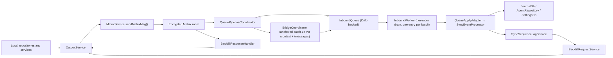
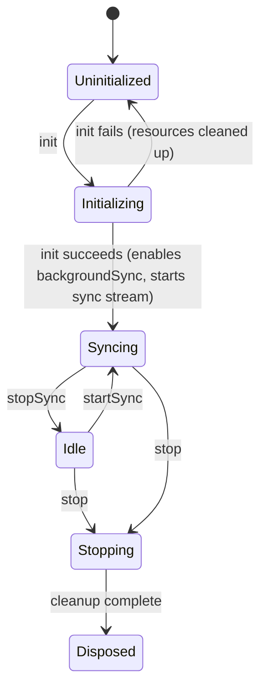

Sync replicates **one user's data across that user's own devices** over Matrix.
It is not a collaboration layer and not a raw event forwarder. It persists
outbound work, replays inbound history in order, tracks `(hostId, counter)`
coverage, and asks peers for counters it never received.

# What it owns

1. Outbound queueing, retries, backoff and send nudges.
2. Matrix session and room lifecycle.
3. Inbound ingestion — a live `timelineEvents` stream plus a `/messages` bridge
   for catch-up.
4. Applying sync payloads into local stores.
5. Sequence-log tracking for sequence-aware payloads.
6. Backfill request and response handling.
7. Provisioning, maintenance, verification and diagnostics UI.
8. The sync-node directory and auto-trigger of local AI inference on synced
   audio.

# Runtime shape

The default bootstrap in `lib/get_it.dart` wires `MatrixService`,
`OutboxService`, `SyncEventProcessor`, `SyncSequenceLogService`,
`BackfillRequestService` and `BackfillResponseHandler`. That is the path these
concepts describe. Construction order matters and is documented in
[bootstrap and dependency injection](../../architecture/bootstrap-and-di.md).

# Code map

| Area | Role |
|------|------|
| `outbox/` | Persist pending payloads in `sync_db`, merge superseded work, enrich sequence metadata, drive send retries |
| `matrix/` | Session management, room discovery and persistence, message sending, read markers, verification, lifecycle. `MatrixPayloadSender` owns wire encoding (gzip, manifest, VC reconcile, size cap); `MatrixMessageSender` delegates to it |
| `gateway/` | `MatrixSyncGateway` interface and the `MatrixSdkGateway` implementation wrapping the Matrix SDK `Client` |
| `matrix/pipeline/` | Attachment ingestion and index, metrics aggregation, the `sync.limited` diagnostic listener |
| `queue/` | Persistent inbound queue, per-room worker, `onSync` catch-up bridge, pending-decryption holding pen |
| `sequence/` | Record `(hostId, counter)` coverage, detect gaps, track lifecycle states |
| `backfill/` | Send missing-counter requests; answer peer requests with resend, deleted, unresolvable or covering-payload hints |
| `state/`, `ui/` | Riverpod controllers and the settings, stats, diagnostics, provisioning and maintenance screens |
| `actor/` | Isolate-based sync implementation — present and tested, **not** wired by the default bootstrap |
| `services/`, `repository/` | Node capability probe, profile broadcaster, node-profile persistence, maintenance repository, synced-audio inference listener and dispatcher |

# Concepts

* [Message model](message-model.md) - what travels on the wire and which payloads are sequence-tracked.
* [Vector clocks and conflicts](vector-clocks-and-conflicts.md) - causal ordering, supersession, and what happens when two devices diverge.
* [Send path](send-path.md) - outbox staging, dequeue-time bundling, retries.
* [Receive path](receive-path.md) - the inbound queue pipeline, catch-up bridge, and marker advancement.
* [Sequence log and backfill](sequence-and-backfill.md) - causal accounting and gap repair.
* [Node profiles and auto-trigger](node-profiles-and-auto-trigger.md) - capability advertisement and local-only inference on synced audio.

# The isolate actor path

`actor/` holds a separate isolate-based implementation —
`SyncActorCommandHandler`, `SyncActorHost`, an actor-side `OutboundQueue` —
with its own lifecycle:

It is documented because it exists and is tested, but nothing in the default
bootstrap reaches it. Do not assume a change to the actor path affects shipping
behaviour.

# Standing constraints

The correctness of the whole feature rests on a few sharp assumptions:

- Sender-side `coveredVectorClocks` enrichment must stay correct, or offline
  convergence stops being sound.
- File-backed payload replay depends on attachment dedupe and ordering in
  `matrix/pipeline/attachment_*`.
- Backfill correctness depends on verified `(hostId, counter) → payloadId`
  mappings, never on "some later vector clock exists".

# Who feeds it

| Producer | Enqueues |
|----------|----------|
| `journal` repositories and `PersistenceLogic` | journal entities and entry links |
| `agents/sync/agent_sync_service.dart` | agent entities and links |
| `ai` repositories | AI config updates and deletes |
| `SavedTaskFiltersRepository` | `savedTaskFilter` / `savedTaskFilterDelete` per item |
| `PersistenceLogic.setConfigFlag(...)` | `configFlag` — only on explicit user change |
| Theming | `themingSelection` |
| `ai_consumption` | `consumptionEvent` |

Startup flag seeding deliberately uses `JournalDb.insertFlagIfNotExists(...)`
and does **not** broadcast, so a device only pushes a flag state when the user
actually changes that setting.

Related: [persistence](../../architecture/persistence.md) for `sync.sqlite`,
[security and privacy](../../architecture/security-and-privacy.md) for the
encryption story.
