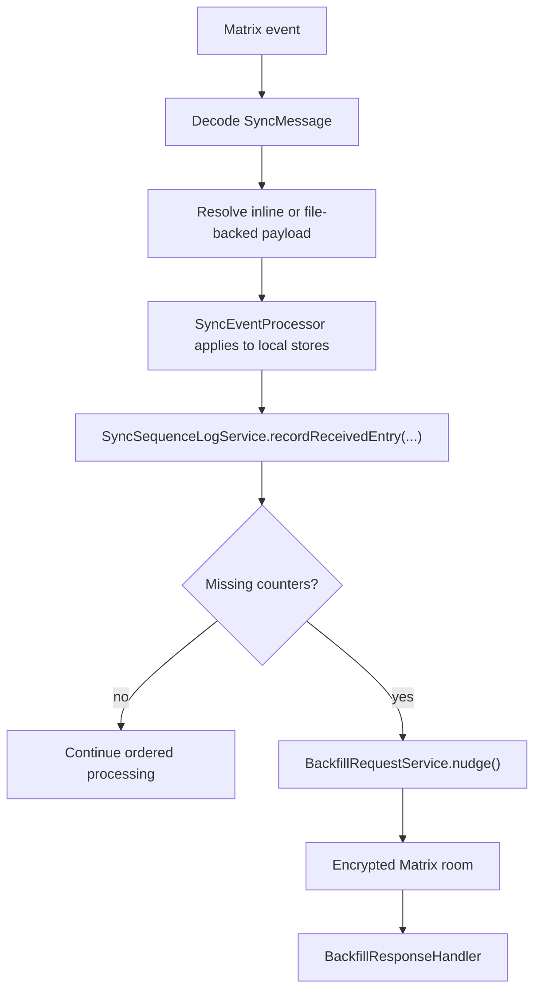
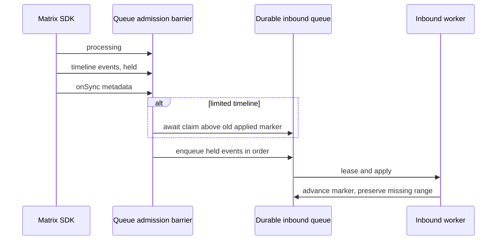
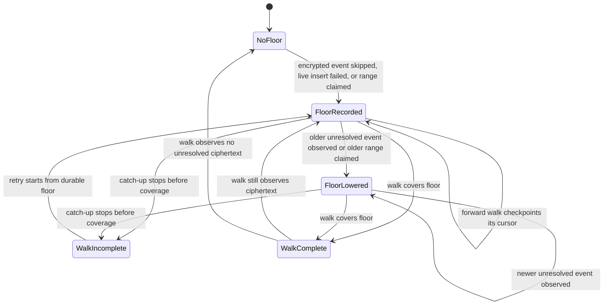
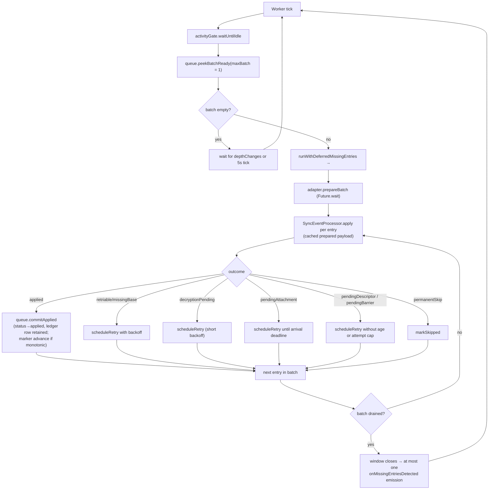
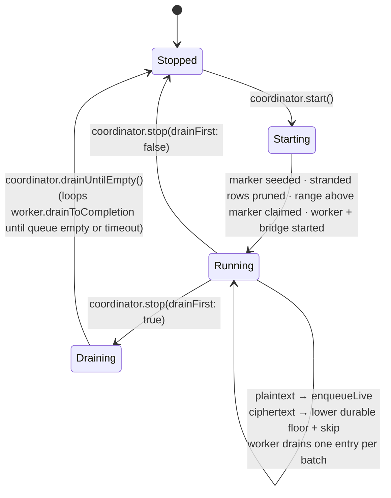
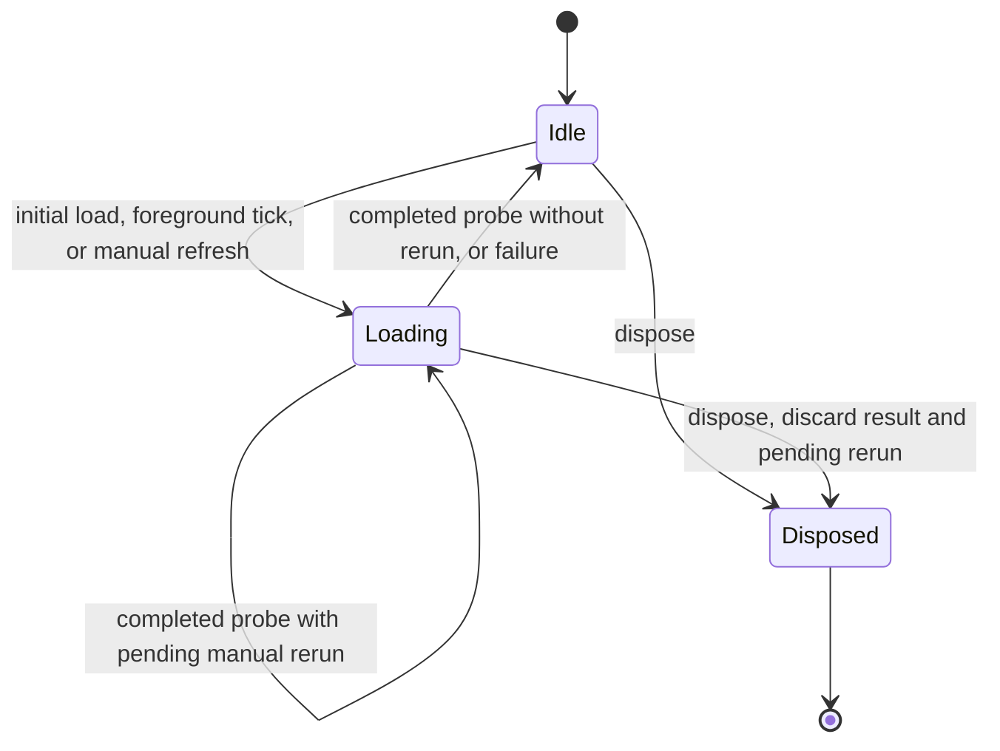

# The queue pipeline is the only receive path

`MatrixService` composes `SyncEngine`, `SyncRoomManager`,
`QueuePipelineCoordinator` and `SyncEventProcessor`. The retained
`MatrixStreamConsumer` is a thin façade: it seeds startup state for the
processor, attaches the `sync.limited` diagnostic via
`MatrixStreamSignalBinder`, and surfaces metrics for the Matrix Stats UI.
**Ingestion itself belongs entirely to the queue pipeline** — there is no second
legacy path to compare against.

# Components

Agent runtime restoration also runs when required rows arrive after their
identity, so an early restoration pass does not strand work until a restart or
periodic scan. The relationship retry contract is documented in
[Relationships](../relationships.md).

All under `lib/features/sync/queue/`:

| Component | Role |
|-----------|------|
| `InboundQueue` | Drift-backed queue in `sync_db` — `inbound_event_queue` plus a per-room `queue_markers` table |
| `InboundWorker` | Per-room drain loop, gated by `UserActivityGate` |
| `BridgeCoordinator` | Subscribes to `Client.onSync`; runs anchored catch-up walks and retries durable ciphertext floors after to-device traffic. Single-flight |
| `QueueApplyAdapter` | Bridges the worker to `SyncEventProcessor.prepare` / `apply` |
| `QueuePipelineCoordinator` | Owns the above plus the live producer subscription; exposed as `MatrixService.queueCoordinator` |
| `QueueMarkerSeeder` | One-shot migration copying legacy `lastReadMatrixEventTs`/`Id` into `queue_markers`. Never overwrites an existing row |

Two primitives carry the durability guarantees:

- **`event_id` UNIQUE** on the queue table is the *sole* cross-producer dedupe
  primitive. Live ingestion and bridge walks can both offer the same event; the
  constraint decides.
- **`lease_until`** is a durable worker lease that survives crashes.

`AttachmentIndex` has two lookup contracts. Latest-by-path remains the
compatibility path for envelopes from peers that know only `jsonPath`. Exact
lookup retains every attachment by Matrix event id, so a newer attachment at a
reused path cannot replace the generation named by an envelope carrying
`attachmentEventId`. If that exact event has not been observed yet, prepare
stays retryable and does not fall back to a different descriptor or a mutable
disk cache. Recording the matching attachment still emits the canonical path
signal, which wakes the pending queue row without weakening the exact-id check.
The same rule is enforced for journal JSON, agent entity/link JSON,
notifications, and outbox bundle manifests. Exact descriptors must also declare
the same normalized `relativePath` as the envelope; a mismatched immutable id is
malformed rather than a reason to read some other file.

The index is volatile. If preparation needs an exact descriptor that is absent,
`SyncEventProcessor` retrieves that event by ID from the envelope's room through
the SDK's database/server lookup and retries decryption of cached ciphertext.
If cached plaintext lacks a nonempty attachment path, it fetches the same event
directly from the room endpoint so an incomplete cache cannot trap every retry.
The wire event ID and optional room ID are checked before constructing an SDK
event (which assigns its supplied room), and the resulting descriptor's identity
is checked again before indexing it and retrying preparation once. This repairs a restart or missed file event even
when the durable cursor has already passed the descriptor. Existing canonical
data that satisfies preparation needs no lookup. Missing, still-encrypted or
temporarily unavailable descriptors produce `PendingSyncDescriptorException`.
`QueueApplyAdapter` maps this to `pendingDescriptor`: the worker retries every
30 seconds without the generic attempt cap or the attachment-arrival age limit.
Descriptor-cache download/decode failures after exact discovery use the same
recovery state. Local cache writes preserve their original filesystem error and
use bounded generic retries; a parent bundle descriptor does not turn a child
cache-write failure into unlimited attachment recovery.
An envelope already older than ten minutes at restart therefore stays active
until exact-ID discovery succeeds; it does not depend on another timeline event
or a manual retry. This requires the referenced event to remain retrievable and
its decryption keys eventually to arrive. Neither a newer file at the same path
nor the mutable disk cache may substitute for the named generation.

Per-room markers advance only after a successful slice commit, so a crash
mid-drain simply re-leases the same rows on restart. Resurrection flips a row
back to `enqueued` only while the UPDATE still finds it eligible — abandoned,
under the hard cap, and matching the pass's path or reason: its SELECT runs
outside the UPDATE's transaction, and a row another pass re-armed and the
worker applied or abandoned again in between must stay as it is.

# Live ingestion

`QueuePipelineCoordinator` subscribes to `MatrixSessionManager.timelineEvents`.
The subscription uses `asyncMap`, so live events are handled in stream order.
SDK `processing` status opens an admission barrier before its timeline events;
progress updates share that barrier. A subscriber attaching during processing
also starts held. `onSync` supplies the later room metadata: a limited slice
must first await the coordinator's durable catch-up claim above the old marker.
Only then can its events reach the queue and worker. An older claim still writing
also holds admission when a later response has already finished. This closes the
window where the post-gap slice could advance the anchor before the gap was known.

If the SDK finishes or errors without observed metadata, the coordinator claims
the unknown range conservatively before release and requests a bridge pass.
Failed claims remain retained by the queue and are retried before insertion.
Out-of-batch decrypted events pass directly when no response is held. Shutdown
and failed startup discard held events without moving the marker, then await
claims already writing before disposing their stores; startup catch-up can
recover those unadmitted events from the retained room history.

For an event still typed `m.room.encrypted`, the coordinator first lowers the
room's durable `queue_markers.resume_floor_ts`, then skips the event.
**Pre-decryption ciphertext never lands in `inbound_event_queue.raw_json`**:
round-tripping it through `Event.toJson` / `Event.fromJson` would not preserve a
usable decrypted payload. If the floor write fails transiently, the observation
remains process-local and every later queue insertion or floor read retries it;
no later plaintext can enter the queue and advance the marker until the floor
is durable. The key-trigger marker read goes through the same retrying accessor
before deciding whether catch-up is needed, so a later room key can persist a
previously failed observation and immediately schedule its recovery walk.

The Matrix SDK owns the in-memory ciphertext and decryption attempts. Its sync
handler calls `decryptRoomEvent`, retains failures in its pending-decryption
queue, and processes to-device keys before publishing `Client.onSync`. Lotti
does not maintain a second retry cache. When any to-device traffic arrives
while a durable floor exists, `BridgeCoordinator` reruns catch-up; pagination
can still return a cached encrypted `Event`, so `QueueBootstrapSink` makes one
fresh `decryptRoomEvent` attempt before classifying it. Successful plaintext is
queued; ciphertext that remains unresolved keeps the floor. When that fresh
attempt reveals an attachment descriptor, the queue sink synchronously hands
the decrypted event to `AttachmentAwareBootstrapSink` before type
classification. The descriptor then enters the same bounded attachment worker
pool as plaintext page events, so its JSON can land and wake a companion payload
from `pendingAttachment`; the descriptor itself remains excluded from the
inbound event queue.

A plaintext insert that throws is recorded the same way: `_safeEnqueue` lowers
the floor to the event and requests a bridge pass. The live stream never
delivers an event twice, so dropping it would lose it as soon as a later event
applied and moved the anchor past it.

The same rule applies to bootstrap pages. `QueueBootstrapSink` lowers each
room's floor before appending later plaintext from that page, re-decrypts each
still-encrypted event at most once per visit, counts unresolved ciphertext as
observed pagination progress, and tracks the oldest unresolved timestamp seen
by that walk. Ciphertext without a usable room id is logged and excluded from
floor reconciliation instead of creating an unreachable empty-string marker.
This has no fixed capacity and no attempt timer.

# Catch-up: the anchored forward walk

On coordinator startup, an explicit room save, a manual rescan, or a joined-room
`timeline.limited == true`, `BridgeCoordinator` runs a catch-up walk anchored on
the per-room `last_applied_event_id` marker.

Catch-up is single-flight. Organic sync triggers that arrive during a walk
coalesce into one rerun. Explicit `bridgeNow()` callers await that entire rerun
cascade, so returning from a manual rescan is a reliable synchronisation point
for the bridge itself; attachment downloads remain independently queued.

The preferred path is an **anchored forward walk**
(`CatchUpStrategy.collectForwardForBootstrap`): force a server
`/context/{eventId}` request with `room.getTimeline(eventContextId: marker,
limit: 0)`, then walk `/messages?dir=f`. It is used only when the durable
`resume_floor_ts` is absent or newer than the applied anchor. A floor at or
behind the anchor means known-missing work exists outside the strictly-forward
window, so anchoring there would skip it.

**The zero cache limit was required by Matrix SDK 7.0.0**, and has not been
re-verified since; `pubspec.yaml` now pins
`matrix: ^10.0.0`, and four in-code comments still name 7.0.0
(`bootstrap_forward_strategy.dart`, `bootstrap_backward_strategy.dart`, and twice
in `queue_pipeline_coordinator.dart`). Treat the workaround as load-bearing until
someone re-checks it — not as a fact about the pinned version. Without it,
an
anchor already present in the SDK database suppresses the context request,
leaves the timeline without a forward token, and can make a reconnect
incorrectly report completion with no bootstrap events. This is a subtle failure
— it looks like a successful catch-up that silently delivered nothing.

If a homeserver omits a forward-pagination token from a non-empty context
window, or a forward page returns no new events, the walk re-anchors at its
newest event and probes until the server returns nothing newer.

The fallback is a timestamp-bounded **backward** walk
(`collectHistoryForBootstrap`), used for fresh clients, unresolvable anchors,
and unsafe anchors. It walks back to `BridgeMarker.backwardWalkBound`, the
lower of `resume_floor_ts` and `last_applied_ts`: an unsafe anchor walks to the
floor, and a claim one millisecond above the marker never narrows the walk past
the applied millisecond. Both directions feed the same enqueue path with
`producer=bootstrap` via `InboundQueue.appendBootstrapPage`. When the boundary
timestamp spans pages, the backward walk continues until that entire
millisecond bucket is exhausted. It retains only the event IDs emitted at the
current oldest timestamp, so newly loaded collisions are delivered once
without an unbounded all-history seen-set. Equal-timestamp continuation uses
the same round-trip cap as stale-cache continuation; reaching the cap reports
an incomplete walk and keeps the floor for a later retry. Bridge and
gap-recovery backward walks also have a wall-clock budget.

## Claiming the range above the marker

The anchor must never pass an event that is neither queued nor inside the
range the next catch-up fetches. Walks break that on their own: a backward
walk pages the tip first, so its newest event can apply and become the anchor
while older pages are still unfetched, and a forward walk that stops on its
budget or an error leaves a remainder that the next live event applies past.
A retry, or the startup walk after a crash, would then walk forward from the
new anchor and skip the rest for good.

So the range above the marker is **claimed** before anything newer can apply
there: the floor drops to one millisecond above `last_applied_ts`
(`InboundQueue.claimAboveMarker`). One above, so the claim alone keeps the anchor
safe and the forward walk remains the normal path; once something newer
applies past it, the next walk goes backward to the claim.

- `startImpl` claims before it subscribes to the live stream and starts the
  worker, covering what arrived while the app was down.
- A limited sync claims the gap at once, before requesting its pass, so a pass
  that has to wait for an in-flight walk cannot re-read a marker the post-gap
  slice already moved.
- Every walk claims at its start in the room's lane, walk-locally, so its own
  completion still clears it.
- A claim whose marker read throws is retained in the queue, like a failed
  floor write, and resolved against the marker as it then is before any
  queue insert or floor read.
- A forward walk **checkpoints** after each page: the floor moves to one above
  the page's newest event, or to the oldest ciphertext the walk still holds. A
  retry after a capped or failed forward walk then resumes forward from the
  anchor the walk's own rows reached, and walks backward only over the
  remainder when something newer applied past it.

One window is left open: the SDK publishes a limited sync's slice on
`onTimelineEvent` before `onSync`, so a post-gap event can apply before the
bridge claims the gap. The options and the model's counterexample are in
[ADR 0084](../../../docs/adr/0084-model-checked-inbound-queue.md).

A completed walk compare-and-sets the floor revision it observed at walk start
with the sink's oldest still-encrypted event, or clears it when the walk
observes none. Live ciphertext observations increment the revision, even when
their millisecond timestamp equals the current floor. Walk-local observations
persist the floor before page payloads are queued but do not increment the
revision, so the walk cannot invalidate its own completion CAS. If live traffic
observes ciphertext while pagination is in flight, the comparison fails and
the concurrent durable observation wins. An incomplete walk never reconciles
the floor. The sink and completion both belong to the same room-specific walk,
so switching rooms while pagination is in flight cannot erase another room's
recovery state. Bridge, manual full-history, and gap-recovery walks share a
per-room serialization lane. A bridge that waited behind another walk refreshes
its durable marker inside that lane before choosing forward or backward
pagination, so it cannot act on the stale pre-wait anchor snapshot.

# Draining

`InboundWorker` drains each room **one entry per batch**
(`SyncTuning.inboundWorkerBatchSize = 1`). It was deliberately dropped from 20
to 1 in PR #3038, because dequeue-time outbox bundling already packs up to
`outboxBundleMaxSize` children into a single queue entry — batching queue
entries on top of that just delayed the first commit.

Each batch is wrapped in `SyncSequenceLogService.runWithDeferredMissingEntries`,
so per-slice gap detections coalesce into **one** `onMissingEntriesDetected`
emission rather than a storm.

A throw inside one iteration — a peek, or the batch's queue transaction, which
rolls back and leaves its row leased until the lease expires — is logged, and
the loop waits one idle tick (or for `stop()`) and carries on. Nothing else
restarts the worker while the coordinator runs, so a loop that ended on an
error would strand every queued row until the next restart.

## Prepare outside the transaction, receipt after commit

`QueueApplyAdapter` runs `prepare` outside writer transactions — the P1 freeze
fix (#2981). Prepare is I/O-bound (attachment
downloads, gzip decode, JSON decode); running it inside a write transaction held
the writer lock for the length of a network round trip.

`bindPrepareBatch()` exposes a parallel prepare hook the worker invokes with a
whole batch before the apply loop, collapsing the critical path to the slowest
entry rather than the sum. With `inboundWorkerBatchSize = 1` there is nothing to
parallelise at runtime; the hook remains for batch sizes above 1.

Prepared payloads are cached by `eventId` and consumed one at a time by apply.
Outcomes caught at prepare time (`permanentSkip`, `pendingAttachment`,
`pendingDescriptor`, `retriable`) also survive in the cache, so apply surfaces them without re-running
prepare.

Journal entities and entry links own their narrow JournalDb transactions.
Their sequence receipt is written to SyncDatabase only after the domain commit
returns. The adapter must not wrap these handlers or outbox bundles in another
journal transaction: a nested savepoint can succeed before an outer commit
fails, leaving a receipt whose payload rolled back. Other families use their
own database; the adapter retains the outer journal transaction for definitions,
config flags and backfill controls.

Receipt write errors propagate to the queue's retriable outcome for journal
entities, entry links, agents, notifications and consumption events. Replay
retries receipt even when the domain row is already present. Bundle application
stops at any failed child and retries the containing delivery; earlier committed
children tolerate replay. Each child's post-commit effects finish before moving
to the next child. The worker's attempt limit still applies, so prolonged
failure can require sequence repair.

The adapter conformance tests use the real processor, JournalDb and SyncDatabase
with both individual and bundled links. SQLite fault injection covers a refused
receipt insert and a deferred constraint that fails the payload commit, then
verifies retry restores the payload and its receipt without a false acknowledgement.

# Marker advancement is monotonic

`commitApplied` delegates to `_advanceMarkerIfNewer`, which advances
`last_applied_ts` / `last_applied_event_id` only when a clamped candidate
timestamp **strictly** beats the stored one, with the durable `event_id` as a
tiebreak only when both sides are durable. The candidate is clamped against the
oldest still-active row for the room, so the marker never crosses an unapplied
gap.

Ciphertext has no row and therefore does not participate in that in-memory
clamp. Its separate durable `queue_markers.resume_floor_ts` closes the gap:
every skipped encrypted event lowers the floor before later plaintext can
advance the applied marker, and `_runBootstrap` rejects a forward anchor at or
ahead of it. The current or next process therefore walks backward to the floor
instead of stepping over work known to be unresolved. Only a completed walk
may clear the floor, and only a completed walk or a forward walk's checkpoint
may raise it.

`QueueMarkerAdvancer` performs that comparison inline: it checks the stored
timestamp first and uses durable event ids only to break an equal-timestamp
tie. A null stored event id therefore does not erase a non-zero timestamp or
let an older durable event regress the marker.

The net effect: an out-of-order apply — a live event at ts=100 applied first,
then a bridge event at ts=60 from the same burst — cannot regress the marker.

The clamp keeps `last_applied_ts` meaning "applied", but it is not what keeps
events from being lost: a row it holds the marker behind is already in the
queue. Loss is prevented by the claims above; the model checks this
(`NoSilentLoss` holds without the clamp).

# Lifecycle

A room change marks active rows from the old Matrix room as abandoned via
`InboundQueue.pruneStrandedEntries`. That maintenance query uses **literal**
active statuses (`enqueued`, `leased`, `retrying`) so SQLite can prove the
partial `idx_inbound_event_queue_active_status_room` predicate and scan only
active rows instead of the whole applied/abandoned ledger.

# Observability and manual recovery

Every committed apply emits
`queue.commit pipeline=queue eventId=… originTs=… markerAdvanced=…` from
`InboundQueue.commitApplied`, which a log analyser can use to track apply rates.

The backfill settings page hosts the operator surface:

- `_QueueDepthScope` subscribes to `InboundQueue.depthChanges` (seeded by a
  one-shot `depthSnapshot()`) and shows total, per-producer breakdown and
  abandoned count.
- The desktop Settings destination reuses the same live depth through
  `inboundQueueDepthProvider` for its neutral outlined `↓ count` badge.
- `_AdvancedRecoveryGroup` drives
  `QueuePipelineCoordinator.triggerBridge()` (kick catch-up), retry of skipped
  rows, and the reset / retire-stuck backfill controls.

The Matrix metrics panel polls every five seconds while foregrounded. Initial,
periodic, and manual metrics loads share one in-flight guard. Periodic ticks skip
an outstanding load; refresh, retry, and rescan actions request at most one
trailing load so changes made during the outstanding probe are observed without
parallel aggregate queries. Disposal discards an outstanding result and prevents
its trailing refresh; completion of an earlier retry/rescan action also cannot
refresh providers after disposal. The underlying queue depth emitter separately coalesces
mutation-driven depth snapshots; its bounded aggregate excludes applied history,
while an explicit full statistics read also counts the applied ledger.

`QueuePipelineCoordinator.collectHistory` exists but is wired into no production
UI; it is exercised only by tests.
