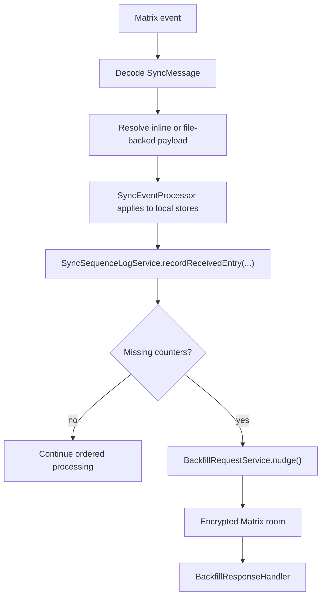
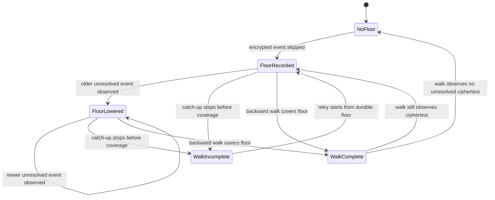
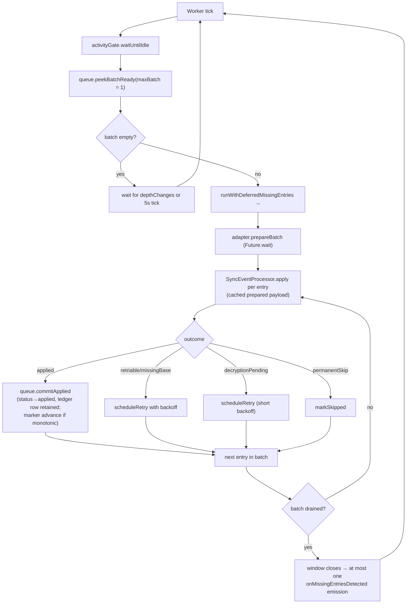
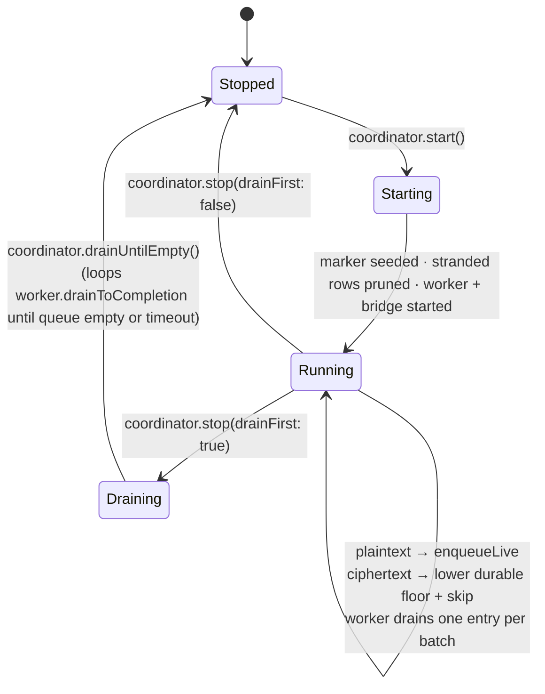

# The queue pipeline is the only receive path

`MatrixService` composes `SyncEngine`, `SyncRoomManager`,
`QueuePipelineCoordinator` and `SyncEventProcessor`. The retained
`MatrixStreamConsumer` is a thin façade: it seeds startup state for the
processor, attaches the `sync.limited` diagnostic via
`MatrixStreamSignalBinder`, and surfaces metrics for the Matrix Stats UI.
**Ingestion itself belongs entirely to the queue pipeline** — there is no second
legacy path to compare against.

# Components

All under `lib/features/sync/queue/`:

| Component | Role |
|-----------|------|
| `InboundQueue` | Drift-backed queue in `sync_db` — `inbound_event_queue` plus a per-room `queue_markers` table |
| `InboundWorker` | Per-room drain loop, gated by `UserActivityGate` |
| `BridgeCoordinator` | Subscribes to `Client.onSync`; runs anchored catch-up walks and retries durable ciphertext floors after to-device traffic. Single-flight |
| `QueueApplyAdapter` | Bridges the worker to `SyncEventProcessor.prepare` / `apply` |
| `QueuePipelineCoordinator` | Owns the above plus the live producer subscription; exposed as `MatrixService.queueCoordinator` |
| `QueueMarkerSeeder` | One-shot migration copying legacy `lastReadMatrixEventTs`/`Id` into `queue_markers`. Never overwrites an existing row |

Two primitives carry the durability guarantees:

- **`event_id` UNIQUE** on the queue table is the *sole* cross-producer dedupe
  primitive. Live ingestion and bridge walks can both offer the same event; the
  constraint decides.
- **`lease_until`** is a durable worker lease that survives crashes.

Per-room markers advance only after a successful slice commit, so a crash
mid-drain simply re-leases the same rows on restart.

# Live ingestion

`QueuePipelineCoordinator` subscribes to `MatrixSessionManager.timelineEvents`.
The subscription uses `asyncMap`, so live events are handled in stream order.
For an event still typed `m.room.encrypted`, the coordinator first lowers the
room's durable `queue_markers.resume_floor_ts`, then skips the event.
**Pre-decryption ciphertext never lands in `inbound_event_queue.raw_json`**:
round-tripping it through `Event.toJson` / `Event.fromJson` would not preserve a
usable decrypted payload. If the floor write fails transiently, the observation
remains process-local and every later queue insertion or floor read retries it;
no later plaintext can enter the queue and advance the marker until the floor
is durable. The key-trigger marker read goes through the same retrying accessor
before deciding whether catch-up is needed, so a later room key can persist a
previously failed observation and immediately schedule its recovery walk.

The Matrix SDK owns the in-memory ciphertext and decryption attempts. Its sync
handler calls `decryptRoomEvent`, retains failures in its pending-decryption
queue, and processes to-device keys before publishing `Client.onSync`. Lotti
does not maintain a second retry cache. When any to-device traffic arrives
while a durable floor exists, `BridgeCoordinator` reruns catch-up; pagination
can still return a cached encrypted `Event`, so `QueueBootstrapSink` makes one
fresh `decryptRoomEvent` attempt before classifying it. Successful plaintext is
queued; ciphertext that remains unresolved keeps the floor.

The same rule applies to bootstrap pages. `QueueBootstrapSink` lowers each
room's floor before appending later plaintext from that page, re-decrypts each
still-encrypted event at most once per visit, counts unresolved ciphertext as
observed pagination progress, and tracks the oldest unresolved timestamp seen
by that walk. Ciphertext without a usable room id is logged and excluded from
floor reconciliation instead of creating an unreachable empty-string marker.
This has no fixed capacity and no attempt timer.

# Catch-up: the anchored forward walk

On coordinator startup, an explicit room save, a manual rescan, or a joined-room
`timeline.limited == true`, `BridgeCoordinator` runs a catch-up walk anchored on
the per-room `last_applied_event_id` marker.

Catch-up is single-flight. Organic sync triggers that arrive during a walk
coalesce into one rerun. Explicit `bridgeNow()` callers await that entire rerun
cascade, so returning from a manual rescan is a reliable synchronisation point
for the bridge itself; attachment downloads remain independently queued.

The preferred path is an **anchored forward walk**
(`CatchUpStrategy.collectForwardForBootstrap`): force a server
`/context/{eventId}` request with `room.getTimeline(eventContextId: marker,
limit: 0)`, then walk `/messages?dir=f`. It is used only when the durable
`resume_floor_ts` is absent or newer than the applied anchor. A floor at or
behind the anchor means known-missing work exists outside the strictly-forward
window, so anchoring there would skip it.

**The zero cache limit was required by Matrix SDK 7.0.0**, and has not been
re-verified since; `pubspec.yaml` now pins
`matrix: ^8.1.0`, and four in-code comments still name 7.0.0
(`bootstrap_forward_strategy.dart`, `bootstrap_backward_strategy.dart`, and twice
in `queue_pipeline_coordinator.dart`). Treat the workaround as load-bearing until
someone re-checks it on 8.x — not as a fact about the pinned version. Without it,
an
anchor already present in the SDK database suppresses the context request,
leaves the timeline without a forward token, and can make a reconnect
incorrectly report completion with no bootstrap events. This is a subtle failure
— it looks like a successful catch-up that silently delivered nothing.

If a homeserver omits a forward-pagination token from a non-empty context
window, or a forward page returns no new events, the walk re-anchors at its
newest event and probes until the server returns nothing newer.

The fallback is a timestamp-bounded **backward** walk
(`collectHistoryForBootstrap`), used for fresh clients, unresolvable anchors,
and unsafe anchors. An unsafe anchor walks back to `resume_floor_ts`, not
`last_applied_ts`. Both directions feed the same enqueue path with
`producer=bootstrap` via `InboundQueue.appendBootstrapPage`. When the boundary
timestamp spans pages, the backward walk continues until that entire
millisecond bucket is exhausted. It retains only the event IDs emitted at the
current oldest timestamp, so newly loaded collisions are delivered once
without an unbounded all-history seen-set. Equal-timestamp continuation uses
the same round-trip cap as stale-cache continuation; reaching the cap reports
an incomplete walk and keeps the floor for a later retry. Bridge and
gap-recovery backward walks also have a wall-clock budget.

A completed walk compare-and-sets the floor revision it observed at walk start
with the sink's oldest still-encrypted event, or clears it when the walk
observes none. Live ciphertext observations increment the revision, even when
their millisecond timestamp equals the current floor. Walk-local observations
persist the floor before page payloads are queued but do not increment the
revision, so the walk cannot invalidate its own completion CAS. If live traffic
observes ciphertext while pagination is in flight, the comparison fails and
the concurrent durable observation wins. An incomplete walk never reconciles
the floor. The sink and completion both belong to the same room-specific walk,
so switching rooms while pagination is in flight cannot erase another room's
recovery state. Bridge, manual full-history, and gap-recovery walks share a
per-room serialization lane. A bridge that waited behind another walk refreshes
its durable marker inside that lane before choosing forward or backward
pagination, so it cannot act on the stale pre-wait anchor snapshot.

# Draining

`InboundWorker` drains each room **one entry per batch**
(`SyncTuning.inboundWorkerBatchSize = 1`). It was deliberately dropped from 20
to 1 in PR #3038, because dequeue-time outbox bundling already packs up to
`outboxBundleMaxSize` children into a single queue entry — batching queue
entries on top of that just delayed the first commit.

Each batch is wrapped in `SyncSequenceLogService.runWithDeferredMissingEntries`,
so per-slice gap detections coalesce into **one** `onMissingEntriesDetected`
emission rather than a storm.

## Prepare outside the transaction, apply inside

`QueueApplyAdapter` runs `prepare` outside the writer transaction and `apply`
inside it — this is the P1 freeze fix (#2981). Prepare is I/O-bound (attachment
downloads, gzip decode, JSON decode); running it inside a write transaction held
the writer lock for the length of a network round trip.

`bindPrepareBatch()` exposes a parallel prepare hook the worker invokes with a
whole batch before the apply loop, collapsing the critical path to the slowest
entry rather than the sum. With `inboundWorkerBatchSize = 1` there is nothing to
parallelise at runtime; the hook remains for batch sizes above 1.

Prepared payloads are cached by `eventId` and consumed one at a time by apply.
Terminal outcomes caught at prepare time (`permanentSkip`, `pendingAttachment`,
`retriable`) also survive in the cache, so apply surfaces them without re-running
prepare.

Each entry's apply runs in its own `JournalDb.transaction`, but only for payload
families that write to JournalDb tables.

# Marker advancement is monotonic

`commitApplied` delegates to `_advanceMarkerIfNewer`, which advances
`last_applied_ts` / `last_applied_event_id` only when a clamped candidate
timestamp **strictly** beats the stored one, with the durable `event_id` as a
tiebreak only when both sides are durable. The candidate is clamped against the
oldest still-active row for the room, so the marker never crosses an unapplied
gap.

Ciphertext has no row and therefore does not participate in that in-memory
clamp. Its separate durable `queue_markers.resume_floor_ts` closes the gap:
every skipped encrypted event lowers the floor before later plaintext can
advance the applied marker, and `_runBootstrap` rejects a forward anchor at or
ahead of it. The current or next process therefore walks backward to the floor
instead of stepping over work known to be unresolved. Only a completed walk
may raise or clear the floor.

It deliberately does **not** use `TimelineEventOrdering.isNewer`, because
`isNewer` treats a null stored event id as "no marker" even when the marker
carries a non-zero timestamp.

The net effect: an out-of-order apply — a live event at ts=100 applied first,
then a bridge event at ts=60 from the same burst — cannot regress the marker.

# Lifecycle

A room change marks active rows from the old Matrix room as abandoned via
`InboundQueue.pruneStrandedEntries`. That maintenance query uses **literal**
active statuses (`enqueued`, `leased`, `retrying`) so SQLite can prove the
partial `idx_inbound_event_queue_active_status_room` predicate and scan only
active rows instead of the whole applied/abandoned ledger.

# Observability and manual recovery

Every committed apply emits
`queue.commit pipeline=queue eventId=… originTs=… markerAdvanced=…` from
`InboundQueue.commitApplied`, which a log analyser can use to track apply rates.

The backfill settings page hosts the operator surface:

- `_QueueDepthScope` subscribes to `InboundQueue.depthChanges` (seeded by a
  one-shot `depthSnapshot()`) and shows total, per-producer breakdown and
  abandoned count.
- `_AdvancedRecoveryGroup` drives
  `QueuePipelineCoordinator.triggerBridge()` (kick catch-up), retry of skipped
  rows, and the reset / retire-stuck backfill controls.

`QueuePipelineCoordinator.collectHistory` exists but is wired into no production
UI; it is exercised only by tests.
