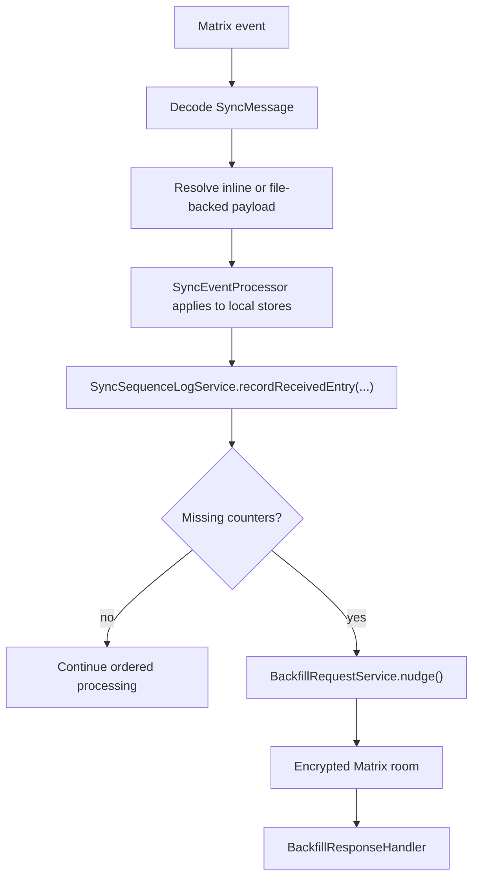
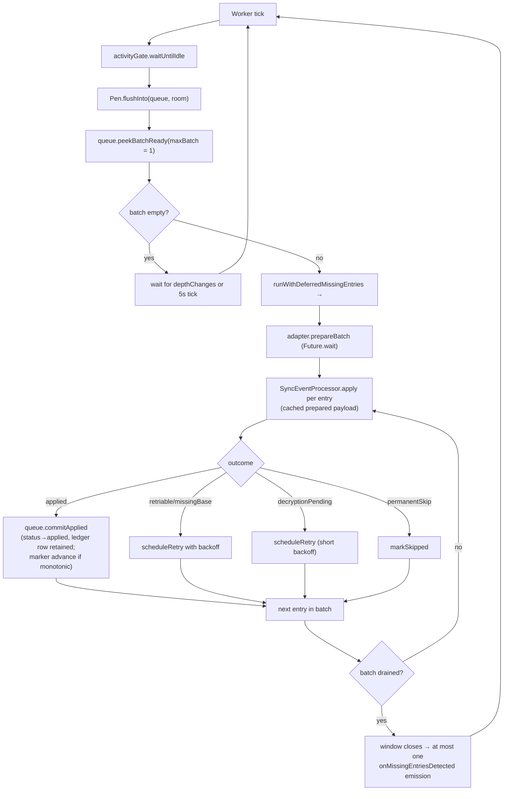
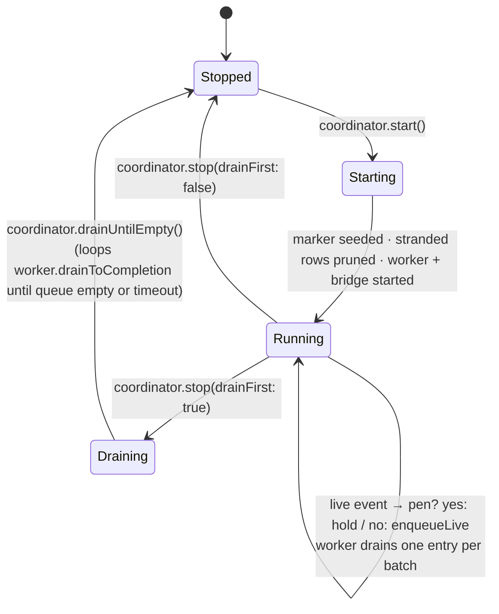

# The queue pipeline is the only receive path

`MatrixService` composes `SyncEngine`, `SyncRoomManager`,
`QueuePipelineCoordinator` and `SyncEventProcessor`. The retained
`MatrixStreamConsumer` is a thin façade: it seeds startup state for the
processor, attaches the `sync.limited` diagnostic via
`MatrixStreamSignalBinder`, and surfaces metrics for the Matrix Stats UI.
**Ingestion itself belongs entirely to the queue pipeline** — there is no second
legacy path to compare against.

# Components

All under `lib/features/sync/queue/`:

| Component | Role |
|-----------|------|
| `InboundQueue` | Drift-backed queue in `sync_db` — `inbound_event_queue` plus a per-room `queue_markers` table |
| `InboundWorker` | Per-room drain loop, gated by `UserActivityGate` |
| `BridgeCoordinator` | Subscribes to `Client.onSync`; runs anchored catch-up walks. Single-flight |
| `PendingDecryptionPen` | LRU holding pen for Megolm events that arrive before their session key |
| `QueueApplyAdapter` | Bridges the worker to `SyncEventProcessor.prepare` / `apply` |
| `QueuePipelineCoordinator` | Owns the above plus the live producer subscription; exposed as `MatrixService.queueCoordinator` |
| `QueueMarkerSeeder` | One-shot migration copying legacy `lastReadMatrixEventTs`/`Id` into `queue_markers`. Never overwrites an existing row |

Two primitives carry the durability guarantees:

- **`event_id` UNIQUE** on the queue table is the *sole* cross-producer dedupe
  primitive. Live ingestion and bridge walks can both offer the same event; the
  constraint decides.
- **`lease_until`** is a durable worker lease that survives crashes.

Per-room markers advance only after a successful slice commit, so a crash
mid-drain simply re-leases the same rows on restart.

# Live ingestion

`QueuePipelineCoordinator` subscribes to `MatrixSessionManager.timelineEvents`.
Live events are routed through `PendingDecryptionPen` first, so
**pre-decryption ciphertext never lands in `inbound_event_queue.raw_json`**. The
worker re-resolves penned events via `room.getEventById` on every drain
iteration; only fully-decrypted events reach `raw_json`.

**The pen's give-up budget is measured in time, not in sweeps.** An entry that
never decrypts is eventually dropped, and a dropped entry is gone — its
ciphertext is never written to the queue, so nothing retries it and nothing
records it as abandoned. That makes the budget load-bearing, and it cannot be
counted per sweep: the worker sweeps at the top of every drain iteration and
loops straight back after a non-empty batch, so sweep frequency tracks queue
throughput. Counting one attempt per sweep once spent the entire 20-attempt
budget in ~2ms while a burst drained, discarding events whose Megolm key was
still in flight — worst on slow links, where keys take longest and bursts drain
longest. An attempt is therefore only spent once `attemptInterval` has elapsed
since the last one, giving a real `maxAttempts * attemptInterval` window
(10 minutes by default). Spacing the countdown costs no recovery latency: every
sweep still asks the room for a decrypted copy and enqueues it the moment one
exists.

# Catch-up: the anchored forward walk

On coordinator startup, an explicit room save, a manual rescan, or a joined-room
`timeline.limited == true`, `BridgeCoordinator` runs a catch-up walk anchored on
the per-room `last_applied_event_id` marker.

The preferred path is an **anchored forward walk**
(`CatchUpStrategy.collectForwardForBootstrap`): force a server
`/context/{eventId}` request with `room.getTimeline(eventContextId: marker,
limit: 0)`, then walk `/messages?dir=f`.

**The zero cache limit was required by Matrix SDK 7.0.0**, and has not been
re-verified since; `pubspec.yaml` now pins
`matrix: ^8.1.0`, and four in-code comments still name 7.0.0
(`bootstrap_forward_strategy.dart`, `bootstrap_backward_strategy.dart`, and twice
in `queue_pipeline_coordinator.dart`). Treat the workaround as load-bearing until
someone re-checks it on 8.x — not as a fact about the pinned version. Without it,
an
anchor already present in the SDK database suppresses the context request,
leaves the timeline without a forward token, and can make a reconnect
incorrectly report completion with no bootstrap events. This is a subtle failure
— it looks like a successful catch-up that silently delivered nothing.

If a homeserver omits a forward-pagination token from a non-empty context
window, or a forward page returns no new events, the walk re-anchors at its
newest event and probes until the server returns nothing newer.

The fallback is a timestamp-bounded **backward** walk
(`collectHistoryForBootstrap`), used only for fresh clients with no anchor or
when the anchor is unresolvable. Both feed the same enqueue path with
`producer=bootstrap` via `InboundQueue.appendBootstrapPage`.

# Draining

`InboundWorker` drains each room **one entry per batch**
(`SyncTuning.inboundWorkerBatchSize = 1`). It was deliberately dropped from 20
to 1 in PR #3038, because dequeue-time outbox bundling already packs up to
`outboxBundleMaxSize` children into a single queue entry — batching queue
entries on top of that just delayed the first commit.

Each batch is wrapped in `SyncSequenceLogService.runWithDeferredMissingEntries`,
so per-slice gap detections coalesce into **one** `onMissingEntriesDetected`
emission rather than a storm.

## Prepare outside the transaction, apply inside

`QueueApplyAdapter` runs `prepare` outside the writer transaction and `apply`
inside it — this is the P1 freeze fix (#2981). Prepare is I/O-bound (attachment
downloads, gzip decode, JSON decode); running it inside a write transaction held
the writer lock for the length of a network round trip.

`bindPrepareBatch()` exposes a parallel prepare hook the worker invokes with a
whole batch before the apply loop, collapsing the critical path to the slowest
entry rather than the sum. With `inboundWorkerBatchSize = 1` there is nothing to
parallelise at runtime; the hook remains for batch sizes above 1.

Prepared payloads are cached by `eventId` and consumed one at a time by apply.
Terminal outcomes caught at prepare time (`permanentSkip`, `pendingAttachment`,
`retriable`) also survive in the cache, so apply surfaces them without re-running
prepare.

Each entry's apply runs in its own `JournalDb.transaction`, but only for payload
families that write to JournalDb tables.

# Marker advancement is monotonic

`commitApplied` delegates to `_advanceMarkerIfNewer`, which advances
`last_applied_ts` / `last_applied_event_id` only when a clamped candidate
timestamp **strictly** beats the stored one, with the durable `event_id` as a
tiebreak only when both sides are durable. The candidate is clamped against the
oldest still-active row for the room, so the marker never crosses an unapplied
gap.

It deliberately does **not** use `TimelineEventOrdering.isNewer`, because
`isNewer` treats a null stored event id as "no marker" even when the marker
carries a non-zero timestamp.

The net effect: an out-of-order apply — a live event at ts=100 applied first,
then a bridge event at ts=60 from the same burst — cannot regress the marker.

# Lifecycle

A room change marks active rows from the old Matrix room as abandoned via
`InboundQueue.pruneStrandedEntries`. That maintenance query uses **literal**
active statuses (`enqueued`, `leased`, `retrying`) so SQLite can prove the
partial `idx_inbound_event_queue_active_status_room` predicate and scan only
active rows instead of the whole applied/abandoned ledger.

# Observability and manual recovery

Every committed apply emits
`queue.commit pipeline=queue eventId=… originTs=… markerAdvanced=…` from
`InboundQueue.commitApplied`, which a log analyser can use to track apply rates.

The backfill settings page hosts the operator surface:

- `_QueueDepthScope` subscribes to `InboundQueue.depthChanges` (seeded by a
  one-shot `depthSnapshot()`) and shows total, per-producer breakdown and
  abandoned count.
- `_AdvancedRecoveryGroup` drives
  `QueuePipelineCoordinator.triggerBridge()` (kick catch-up), retry of skipped
  rows, and the reset / retire-stuck backfill controls.

`QueuePipelineCoordinator.collectHistory` exists but is wired into no production
UI; it is exercised only by tests.
