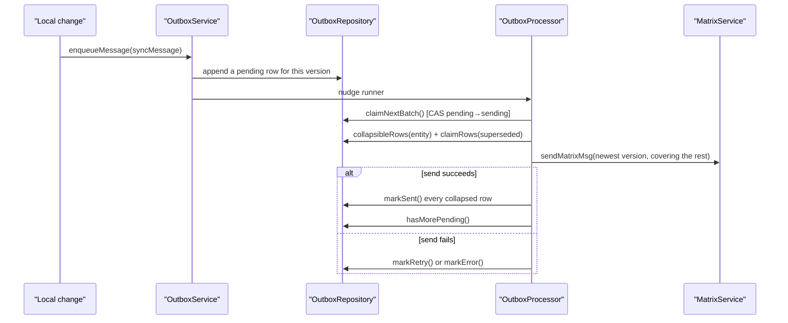
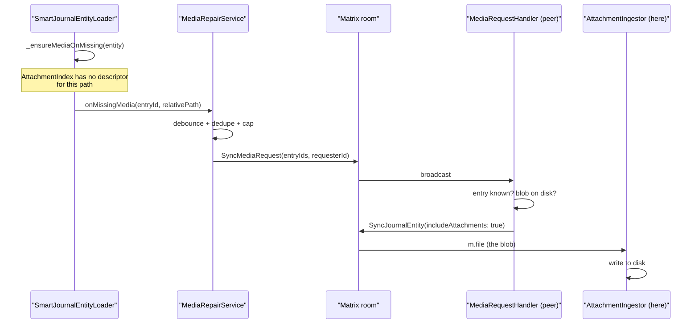
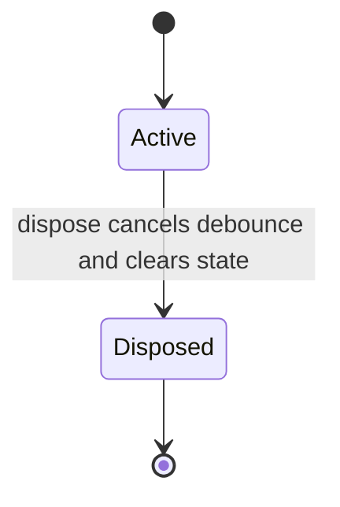
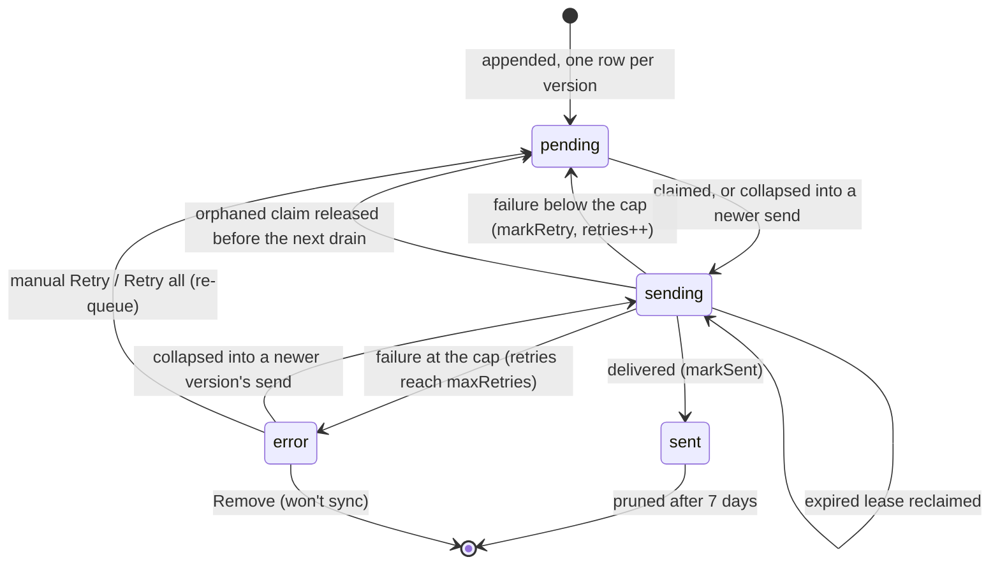
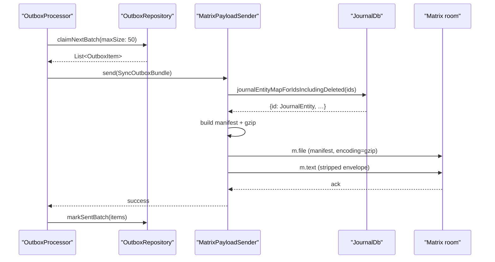
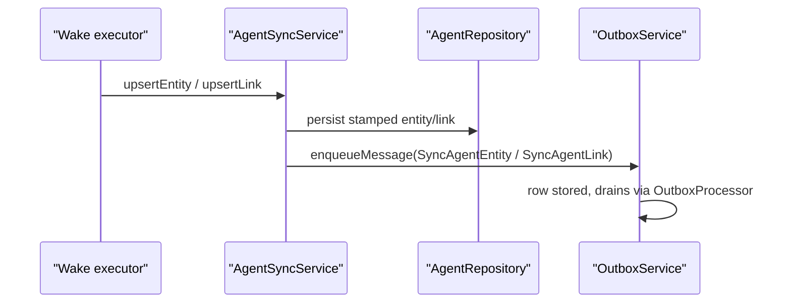

# Staging

`OutboxService` stages local work in `sync_db` as **one immutable row per
version** — never merged — and nudges a `ClientRunner`-driven
`OutboxProcessor`, which collapses an entity's rows when it sends
([ADR 0086](../../../docs/adr/0086-append-only-outbox.md)).

Sends are nudged by connectivity regain, Matrix login completion, outbox
row-count changes, and a watchdog for pending-but-idle queues. The whole pass is
gated by `UserActivityGate`, so the queue waits for idle time before running.

# Media attachments: one decision, two places

Whether a `SyncJournalEntity` send carries the entry's image or audio blob is
decided by `shouldSendJournalAttachments`
(`lib/features/sync/model/sync_attachment_policy.dart`). Media rides along when
the entry is new to every peer (`SyncEntryStatus.initial`), when the payload
opts in via `SyncJournalEntity.includeAttachments`, or when the
`resend_attachments` config flag is on. An ordinary edit sends JSON only — the
blob is immutable for the life of the entry and the peer already has it.

Two collaborators consult that one function, and they must agree:

| Where | What it does with the answer |
| --- | --- |
| `OutboxEnqueueWriter` | Resolves the media file and stamps the row's `filePath` |
| `OutboxProcessor` collapse | Sets `includeAttachments` on the send when any collapsed row has a `filePath` |
| `MatrixPayloadSender.sendJournalEntityPayload` | Uploads the blob as a second file event |

The enqueue-time half is not redundant. `filePath` is what excludes a row from
dequeue-time bundling (below), and a bundle ships a JSON manifest only. A row
whose message asks for media but whose `filePath` is null would be packed into a
bundle and its blob dropped with no error anywhere. It is also how the collapse
knows a row still owes the blob: an audio entry and the location update that
follows it before the first send go out as one send of the update, with the
audio; a later edit ships JSON only, so the blob goes up exactly once.

`includeAttachments` exists for the flows that hand an entire history to a peer
holding none of it — the historical re-send
(`HistoricalSyncService.reSyncInterval`) and backfill responses
(`BackfillResponseHandler`). Both are necessarily
`update` sends: the entry is not new on the sending device. Before the flag
existed, both shipped JSON without blobs, so a freshly provisioned device
received every entry's text and none of its media, while entries created after
it joined arrived complete.

`MatrixPayloadSender` also uploads blobs for any media-bearing bundle child that
reaches it anyway — defence in depth against a row enqueued by an older build,
where the attachment decision had not yet moved to enqueue time.

## Self-healing: repairing a blob that never arrived

The policy above governs sends this device chooses to make. A device can still
end up holding an entry whose blob it never received — it joined after the
upload, a download failed, a peer ran a build that predates the policy. Nothing
in the apply path treats that as an error: the JSON is the authoritative state
and the entry must apply regardless, so the miss would otherwise be observed on
every load and dropped.

`lib/features/sync/media/` closes that loop.

Three properties are load-bearing:

- **The request travels by entry id, not by path.** The responder resolves the
  id through `JournalDb` and derives the media path itself, so no wire-supplied
  path is ever resolved against a peer's filesystem. It also means the answer is
  an ordinary journal-entity send — no media-specific upload path exists to
  drift out of step with the policy above.
- **There is no response envelope.** The blob arrives as a plain attachment
  event and `AttachmentIngestor` writes it, the same way any attachment lands.
  The requester never learns a request succeeded; it stops asking because the
  file now exists and the loader stops reporting it missing.
- **The request is broadcast and answers are optional.** Any peer holding the
  blob may answer, because the device that created the entry is often the one
  that is offline. A peer that lacks the file stays silent rather than
  answering with nothing.

Bounds live in `SyncTuning` (`mediaRepair*`): a debounce window so a catch-up's
burst of misses becomes one request, a batch cap so a backlog drains across
successive requests, an attempt cap so a blob no peer holds is eventually
abandoned, and a tracking cap so the pending set cannot grow without limit.

Media repair disposal cancels its debounce and clears pending ids and attempt
counts. A host lookup completing after disposal cannot enqueue a request; a
pending enqueue failure cannot restore cleared state or arm another retry.
Failures while the service remains active still restore the batch and its
attempt budget for the normal debounced retry.

# Collapse at send time

Enqueue never reads the outbox: every version of every entity is appended as
its own row, keyed by the entity's outbox entry id and carrying its own
counter, so concurrent enqueues of one entity cannot overwrite each other.

The processor coalesces instead. For each entity with a row in the claimed
batch, `OutboxProcessor._collapse` reads the entity's other `pending` and
`error` rows (`collapsibleOutboxRows`) — only rows of the same payload family
*and* outbox entry id, because two families can share an id (an agent entity
and an agent link) — picks the newest version and claims
every row that version supersedes (`claimOutboxRows`, a compare-and-set on the
status it read). The rules live in `outbox_collapse.dart`:

- **Newest by clock.** Journal entities, entry links and agent entities and
  links are ordered by vector clock, so an enqueue that arrived out of order
  never sends an older payload over a newer one. A config flag has no clock
  and is applied in arrival order, so its newest is the row enqueued last.
- **Cover everything folded in.** The send carries the newest payload with
  every other collapsed row's clock as a covered clock, so each counter
  reaches peers exactly as if its row had been sent. A row whose clock is
  concurrent with the newest is not folded; it is sent on its own.
- **Carry the attachment if any folded row owed it** (see above). A bundle
  ships JSON only, so a bundled send does not fold in rows that owe an
  attachment; they go out alone.
- **Settle superseded failures.** An `error` row that the newest version
  supersedes is folded in and marked sent with it, so the monitor's Retry can
  never resend a stale value after a newer one went out.

Every collapsed row is marked sent with the send, or retried with it. A
row outside the batch that cannot be decoded is skipped, not allowed to fail
the send; it fails on its own when claimed. Retry pacing follows the rows the
pass claimed: a folded-in `error` row is past the cap already and does not
turn the retries of newer rows into a zero-delay loop.
`specs/tla/Outbox.tla` model-checks the rules.

# File payload identity follows the claimed generation

Every JSON-backed send records the successful Matrix file-event id in the text
envelope as `attachmentEventId`. The relative path remains the cache location
and the compatibility key for older peers; it is no longer the identity of a
new payload generation.

Agent outbox rows make the send-side half explicit. A pending
`SyncAgentEntity` retains the serialized entity inline even though the sender
strips it from the wire text after upload. The uploader uses those inline bytes,
not the mutable `/agent_entities/<id>.json` sidecar. If a newer local update
overwrites that sidecar after the old row is claimed, the in-flight row still
uploads its own payload and stamps the event id returned for those exact bytes.
Legacy rows that contain only `jsonPath` continue to read the sidecar so mixed
versions remain sendable. Journal and notification senders already snapshot
their file bytes before upload and reconcile the envelope against that same
snapshot; outbox bundles use a fresh UUID path and stamp the manifest upload id.

When a standalone journal sidecar is missing, the sender reads the canonical
journal row, including deletion tombstones. That replacement must cover the
queued vector clock and every covered clock before upload. The same holds
when the sidecar exists but is older than the queued version — two enqueues
refreshed it out of order: the sender sends the canonical row instead of
adopting the sidecar's older clock, which would cover a newer counter than
the payload carries. Recovery
serializes the row in memory and leaves the reclaimed sidecar absent. An absent
row, an older or concurrent clock, or another filesystem error keeps the outbox
item retryable; none acknowledges an unsent generation.

# Item lifecycle

`DatabaseOutboxRepository.maxRetries` defaults to **10**. Retry delay is 5 s,
error delay 15 s, send timeout 20 s, claim lease 1 minute
(`SyncTuning`). A failed send (the sender returns `false`, throws, or times
out) and a throwing `markSent` both take the `markRetry` path, so a delivered
row can be sent again: a duplicate, never a loss.

A claim can end without any mark: the process dies between the send and
`markSent`, or `markSent` and `markRetry` both throw. Its rows stay `sending`.
`sendNext` releases every `sending` row to `pending`
(`OutboxRepository.releaseOrphanedClaims`) before it claims. `sendNext`
chains its calls, whoever makes them, so each drain starts only after the one
before it finished, and only a drain claims: no claim of this service is in
flight there. The orphan is resent in its turn, before newer
rows of its entity. Left to its one-minute lease, it would go out after them
and an older payload would land last. The lease stays as a second guard.

The release is sound only because no other drain can still be running, and a
profile switch or closed-generation restart brings the same profile back
within the same process. So `sendNext` returns at once once the service is
disposed, and `dispose` awaits the tail of its chain — every drain queued so
far, each stopping after its current pass — before it cancels anything else. Otherwise the old
generation's send could land after the new generation released and resent its
row together with a newer version. The old generation's late marks cannot
touch the new one's rows: `ServiceDisposer` closes its `SyncDatabase` first.

One ordering is **not** guaranteed (ADR 0085's residual, kept by ADR 0086):
a send the processor abandoned at its timeout can still land after a newer
version. Receivers that order by vector clock drop the stale copy; a config
flag or an AI configuration is applied in arrival order. Two narrower cases
are documented in ADR 0086: a bundled send leaves a failed row that owes an
attachment alone, so a later Retry sends that older journal version (and its
blob) after the newer one; and removing the newer row, then retrying an
older one, is the user's own reversal.

# Dequeue-time bundling

When `claimNextBatch(maxSize: SyncTuning.outboxBundleMaxSize)` — 50 — returns
more than one row, the processor wraps them in a `SyncOutboxBundle` and ships
the batch as **one** Matrix envelope. A single-row batch routes through the
per-row send instead.

**Media-attachment rows (`filePath != null`) always travel alone.** The boundary
rule lives in `claimNextBatch`, so a bundle can never carry audio or image
bytes.

Claim order is priority, then `createdAt`, then `id` — so user-visible journal
entities and entry links drain ahead of older normal-priority agent or backfill
rows, while order within a priority stays stable.

`MatrixPayloadSender.sendOutboxBundlePayload` builds the wire form:

1. **Bulk-load** every `SyncJournalEntity` child's `JournalEntity` via
   `JournalDb.journalEntityMapForIdsIncludingDeleted` in one `WHERE id IN (…)`
   query. This outbound-only read includes soft-deleted rows because their
   tombstones must reach peers; ordinary application bulk reads still hide
   them. The database is the system of record — the sender never reads
   per-child JSON files from disk.
2. **Reconcile** each child envelope's `vectorClock` against the DB version.
3. **Emit one manifest**:
   `{version: 1, entries: [{envelope: <SyncMessage>, payload: <JournalEntity?>}]}`.
   Inline-payload families (`SyncEntryLink`, `SyncAiConfig`,
   `SyncAiConfigDelete`, `SyncSavedTaskFilter`, `SyncSavedTaskFilterDelete`,
   `SyncEntityDefinition`, `SyncThemingSelection`, `SyncBackfillRequest`,
   `SyncBackfillResponse`) and agent envelopes carry their data inside the
   freezed envelope and need no separate `payload`.
4. **Gzip on a worker isolate** and upload as a single `m.file` event with
   `relativePath: /outbox_bundles/<uuid>.json`, upload name `<uuid>.json.gz` and
   `extraContent.encoding = "gzip"`. No temp file ever touches disk.
5. **Send the thin envelope** — `children: []`, `jsonPath` pointing at the
   uploaded cache path.

## Size cap and failure

The post-gzip cap `SyncTuning.outboxBundleMaxBytes` is **8 MiB**, and it is a
send-side guard only. When the gzipped manifest exceeds it,
`sendOutboxBundlePayload` returns `null`, which triggers
`OutboxRepository.markRetryBatch` to re-queue every row for the next pass.

Rows stay pending until acknowledged, so a failed manifest send simply
re-bundles from outbox state next drain — no on-disk artifact survives across
attempts.

A journal child absent even from the including-deleted lookup was hard-purged,
not merely soft-deleted. The sender aborts that bundle rather than silently
acknowledging a manifest that omitted the child. Soft deletion therefore no
longer sends every valid sibling through the retry loop; genuinely missing
payloads still surface through the existing retry/error diagnostics.

## Receiver side

`SyncEventProcessor._resolveOutboxBundleManifest` reverses it:

1. Reuse the descriptor pipeline; `decodeAttachmentBytes` gunzips transparently.
2. Bulk-load the local `JournalEntity` map for every `SyncJournalEntity` id in
   the manifest — one query, no N+1.
3. Per entry, run a clock dominance check against the database. When the local
   copy already covers the incoming clock, **leave the on-disk JSON cache
   alone** so `SmartJournalEntityLoader` returns the canonical local entity.
   Otherwise write the inlined payload to its declared `jsonPath` so the apply
   pipeline reads it as a cache hit and skips the descriptor index.
4. Hand the reconstructed children to `OutboxBundleUnpacker.prepare`.

The manifest is dropped (`null`) when `version` is absent or unequal to
`SyncTuning.outboxBundleManifestVersion`, or when `entries` is missing. The
receiver has no outbox rows to re-queue, so a dropped manifest surfaces its
missing children through per-`(host, counter)` backfill.

# Agent wake writes

Agent wake execution installs **no** wake-scoped sync interceptor. Each
`AgentRepository` write inside a wake commits immediately, receives a vector
clock at write time, and enqueues its own `SyncAgentEntity` or `SyncAgentLink`
row. The generic bundler coalesces them at dequeue time like anything else.

An earlier design coalesced wake writes into a `SyncAgentBundle` envelope
flushed at the terminal edge of the wake scope. The wire variant remains
parseable so older peers interoperate, but the producer no longer builds it. If
a peer is missing a child that an in-flight legacy bundle dropped, gap detection
reopens it and backfill pulls each child individually.

# Outbox monitor

*Settings → Sync → Outbox* is the user-facing view. It reads a **one-shot
snapshot** (`getOutboxItems`) with pull-to-refresh, deliberately not a live
`watch()` — the queue churns hundreds of rows per minute during sync.

The page opens with a plain-language summary driven by the pure
`summarizeOutbox()`: "Everything's synced", "Sending N…", "N waiting to send",
"N couldn't send" (with a one-tap **Retry all**), or — when sync is off — "N
will send when you reconnect", so an offline user is reassured rather than
alarmed.

Each row is an `OutboxMessageCard` with a status pill (waiting / sending /
failed / sent → warning / info / error / success). Failed items add a
reassurance ("still saved on this device") plus **Retry** (safe, no
confirmation) and **Remove** (guarded by a confirmation spelling out that the
change won't reach other devices). Per-row diagnostics and the daily-volume
chart hide behind a "show technical details" toggle.

Manual actions write straight to `SyncDatabase`.

# Directional queue badges

The Settings destination carries compact queue depth rather than a separate
sidebar status row. `SyncQueueCounts` reads
`outboxPendingCountProvider` for the outgoing `↑ count` pill and reuses
`inboundQueueDepthProvider` for the incoming `↓ count` pill. Both use the
neutral outlined badge tone because queued work is normal operation, and each
direction disappears independently at zero. The former per-packet pulse
signaler and its opt-in config flag no longer exist.
