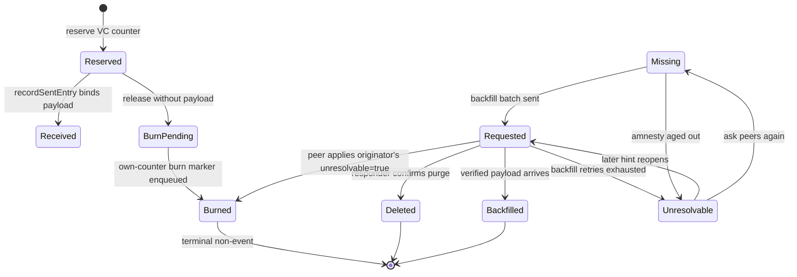
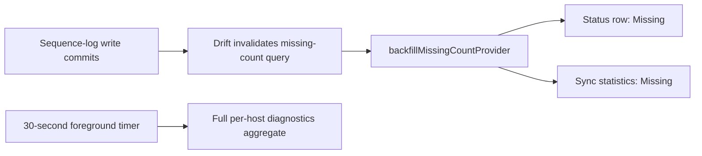

# The accounting layer

`SyncSequenceLogService` records which `(hostId, counter)` pairs are known
locally and tracks each through a lifecycle. It is what turns "we replicate
events" into "we can prove nothing was lost".

`SyncSequenceStatus` has nine values:

| Status | Meaning |
|--------|---------|
| `received` | Received and processed successfully |
| `missing` | Gap detected — expected but not yet received |
| `requested` | A backfill request has been sent |
| `backfilled` | Arrived via backfill after being marked missing |
| `deleted` | The responder confirmed the entry was purged |
| `unresolvable` | Receiver gave up — **reopenable** |
| `reserved` | A local vector-clock counter is reserved, not yet written |
| `burnPending` | A reservation was released without a payload; the broadcast is not out yet |
| `burned` | Authoritatively confirmed to carry no payload — **terminal** |

# Own-host reservations

A local write reserves its counter *before* the write path gets it, so a crash
between reservation and write leaves an auditable row rather than an invisible
hole.

Startup reconciliation retries `burnPending` rows by enqueueing the durable
`unresolvable=true` broadcast and terminalizing the local row to `burned`. It
deliberately does **not** terminalize plain `reserved` rows: a crash may have
left a real local payload behind before outbox logging ran, and burning it would
destroy recoverable data.

# `burned` versus `unresolvable`

Both mean "no payload will arrive here", and the split is deliberate.

**`burned` is the authoritative non-event.** The originating host — or a peer
applying that host's `unresolvable=true` broadcast, since the originator is
authoritative for its own counters — confirms the counter carries no payload.
Like a voided number in a monotonic invoice sequence. Terminal, never reopened.

**`unresolvable` is the receiver's give-up.** A `missing` or `requested` row
exhausted backfill retries (`retireExhaustedRequestedEntries`) or aged past the
7-day amnesty (`retireAgedOutRequestedEntries`). The payload may still be
recoverable from some peer, so it stays reopenable by a later hint or the "ask
peers again" action.

Both count as resolved for the contiguous-prefix watermark
(`SyncSequenceStatusX.isResolved` — the single source of truth mirrored by the
watermark CTEs and the `idx_sync_sequence_log_resolved_host_counter` partial
index), so neither blocks progress.

# Gap detection rules

- Detection runs for hosts already seen online, plus the current originating
  host. A counter from a never-seen host is recorded but not turned into a gap.
- Sent entries from this device are recorded so peers can request them later.
- **Later vector clocks do not automatically close gaps.** Explicit coverage is
  required — see [vector clocks](vector-clocks-and-conflicts.md).
- Verified covering entries are used as hints when an exact payload is no longer
  the best answer.
- Each host's contiguous resolved watermark is persisted in
  `sync_sequence_watermarks`. Migrated hosts warm that row lazily on the first
  `getLastCounterForHost`, so startup does not recompute every historic host
  with the compatibility `ROW_NUMBER` scan.

# Requesting

`BackfillRequestService` sends bounded batches of missing counters on a
2-minute interval (`backfillRequestInterval`, up to `backfillMaxRequestCount`
= 10 per batch), supports a manual full historical backfill, and can re-request
entries previously requested but never resolved.

# Responding

`BackfillResponseHandler` answers with one of four outcomes:

| Outcome | When |
|---------|------|
| Exact payload resend | The responder still has it |
| `deleted` | The responder confirms it was purged |
| `unresolvable` | **Only ever sent by the originating host for its own counter.** The receiving peer classifies an incoming `unresolvable=true` as the terminal `burned` state — the wire flag is unchanged, so old and new peers interoperate |
| A verified covering payload hint | An exact payload is no longer the best answer |

Responses are rate-limited and cooled down per `(hostId, counter)` — 5-minute
cooldown, a 1-minute rate window — so repair traffic cannot turn into its own
feedback loop.

# Two statistics paths, on purpose

The backfill settings page reads its numbers two different ways, and the split
is a performance decision:

- The **two visible Missing values** watch the focused
  `watchBackfillMissingCount()` query while the page is mounted. Drift re-runs
  that indexed count after committed `sync_sequence_log` changes, so it tracks
  a large inbound drain live without rebuilding every host/status bucket.
- The **full per-host `getBackfillStats()` aggregate** refreshes on a throttled
  30-second cadence, for diagnostics only.

Closing the page auto-disposes the provider and its database subscription.
