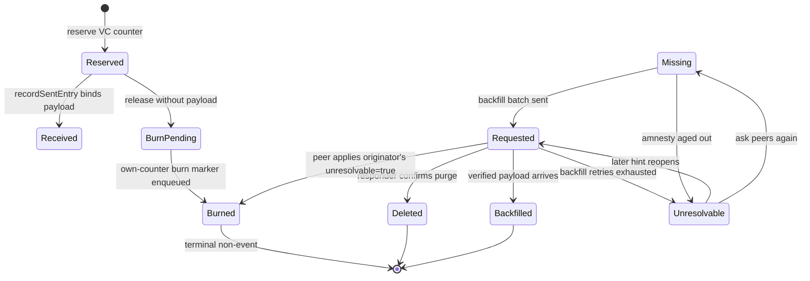
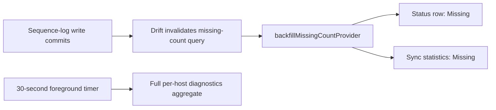

# The accounting layer

`SyncSequenceLogService` records which `(hostId, counter)` pairs are known
locally and tracks each through a lifecycle. It is what turns "we replicate
events" into "we can prove nothing was lost".

`SyncSequenceStatus` has nine values:

| Status | Meaning |
|--------|---------|
| `received` | Received and processed successfully |
| `missing` | Gap detected — expected but not yet received |
| `requested` | A backfill request has been sent |
| `backfilled` | Arrived via backfill after being marked missing |
| `deleted` | The responder confirmed the entry was purged |
| `unresolvable` | Receiver gave up — **reopenable** |
| `reserved` | A local vector-clock counter is reserved, not yet written |
| `burnPending` | A reservation was released without a payload; the broadcast is not out yet |
| `burned` | Authoritatively confirmed to carry no payload — **terminal** |

# Own-host reservations

A local write reserves its counter *before* the write path gets it, so a crash
between reservation and write leaves an auditable row rather than an invisible
hole.



Startup reconciliation retries `burnPending` rows by enqueueing the durable
`unresolvable=true` broadcast and terminalizing the local row to `burned`. It
deliberately does **not** terminalize plain `reserved` rows: a crash may have
left a real local payload behind before outbox logging ran, and burning it would
destroy recoverable data.

Local persistence records the exact `(host, counter, entry, payload type)`
binding immediately after its data commit. The outbox records it again as a
fallback for direct enqueue and re-sync paths. `SyncSequenceCache` remembers a
successful binding for five minutes and makes the normal second call
idempotent; a later call reaches the database again in case lifecycle state
changed. Counted `sequence.recordSent.write` and
`sequence.recordSent.duplicate` diagnostics preserve the ratio between useful
writes and redundant attempts without logging every binding.

# `burned` versus `unresolvable`

Both mean "no payload will arrive here", and the split is deliberate.

**`burned` is the authoritative non-event.** The originating host — or a peer
applying that host's `unresolvable=true` broadcast, since the originator is
authoritative for its own counters — confirms the counter carries no payload.
Like a voided number in a monotonic invoice sequence. Terminal, never reopened.

**`unresolvable` is the receiver's give-up.** A `missing` or `requested` row
exhausted backfill retries (`retireExhaustedRequestedEntries`) or aged past the
7-day amnesty (`retireAgedOutRequestedEntries`). The payload may still be
recoverable from some peer, so it stays reopenable by a later hint or the "ask
peers again" action.

Both count as resolved for the contiguous-prefix watermark
(`SyncSequenceStatusX.isResolved` — the single source of truth mirrored by the
watermark CTEs and the `idx_sync_sequence_log_resolved_host_counter` partial
index), so neither blocks progress.

# Gap detection rules

- Detection runs for hosts already seen online, plus the current originating
  host. A counter from a never-seen host is recorded but not turned into a gap.
- Sent entries from this device are recorded so peers can request them later.
- **Later vector clocks do not automatically close gaps.** Explicit coverage is
  required — see [vector clocks](vector-clocks-and-conflicts.md).
- Verified covering entries are used as hints when an exact payload is no longer
  the best answer.
- Each host's contiguous resolved watermark is persisted in
  `sync_sequence_watermarks`. Migrated hosts warm that row lazily on the first
  `getLastCounterForHost`, so startup does not recompute every historic host
  with the compatibility `ROW_NUMBER` scan.

## Payload proof and contradictory mappings

For every exact-attachment, sequence-tracked file payload, the vector clock
decoded from the named attachment generation is the proof source. Journal and
notification envelopes distinguish that clock from the envelope's announced
clock; agent entity and link receipts already derive their recorded clock from
the decoded payload. A `(hostId, counter)` mapping is recorded only when the
payload clock reaches the announced counter. Covered clocks are subject to the
same proof before they can suppress gap detection. An attachment whose payload
is behind its envelope therefore creates neither a mapping nor a synthetic gap,
and replaying the same stale event remains a no-op.

After applying an exact payload, the receiver compares every historical row
bound to the same payload id and type with the canonical local payload clock.
Bindings beyond that clock are retired explicitly:

- `received` and `backfilled` rows become reopenable `unresolvable` rows;
- actionable rows retain their lifecycle status so a genuine payload can still
  arrive; and
- every contradictory row loses both its payload id and mutable path hint.

The repair is idempotent because repaired rows no longer match the payload
binding query. In-memory watermark and materialization caches are cleared when
any row changes. Exact journal, notification, agent entity, and agent link
events use this proof-and-repair path. Legacy path-only envelopes retain the
historical behavior for mixed-version peers because they cannot prove which
generation a mutable sidecar path returned.

# Requesting

`BackfillRequestService` sends bounded batches of missing counters on a
2-minute interval (`backfillRequestInterval`, up to `backfillMaxRequestCount`
= 10 per batch), supports a manual full historical backfill, and can re-request
entries previously requested but never resolved.

Fresh `missing` rows retain the 10-minute ordering debounce. A queue-drain
nudge bypasses only that debounce: a row already marked `requested` must be at
least one hour past `lastRequestedAt` before another automatic request. Rows
that entered `requested` without that timestamp use `updatedAt` as the retry
anchor, so every suppressed or failed request eventually becomes eligible.
Manual full backfill and the explicit re-request action bypass this automatic
cooldown.

Backfill observability deliberately distinguishes work from polling. Gap
detections, ranges, filtered queued rows and sent-request counts are logged for
every actionable event, including manual full-history backfill. The frequent
`no actionable entries` and `no missing entries` outcomes are counted samples,
so a no-op storm is still visible by its cumulative total without producing a
line for every timer or drain nudge.

# Initial-onboarding suppression

The full *All* transfer opened from the Add Device sheet coordinates a
target-specific suppression round. Other re-sync ranges and manual backfill do
not use it. When the joining device consumes a peer handover, it persists an
inbound `awaitingBegin` preflight **before Matrix login starts background
timeline processing**. Automatic backfill is blanket-blocked during this short
phase, closing the queue-drain race that previously allowed one 250-counter
request before the sender's Begin arrived. A user-triggered full backfill or
re-request remains available throughout.

The inviting device captures the exact verified Matrix user/device pair,
persists an outbound round, queues `onboardingSnapshotBegin`, and waits for that
device's durable `onboardingSnapshotAccepted` before staging history. If the
inviter chooses a partial transfer, dismisses the history sheet, or closes Add
Device after verification without opening history, it instead queues an
empty-range Begin followed by a complete End. Add Device hands cleanup to the
history sheet only once that sheet opens, and the history sheet disarms its own
cleanup only after `beginOutbound` succeeds. The empty Begin atomically adopts
the provisional gate but claims no covered counters, so automatic backfill is
no longer blocked while the partial or declined flow continues.

Once a full round is active, the sender fetches undecoded rows and performs
decode, preparation, persistence and enqueue inside each retained item action.
One malformed payload therefore cannot abort the rest of its page. Failed rows
are logged and retained in the result while later work continues. Hidden journal
links remain part of the replicated history. Journal entries complete first;
the sender then reads serialized link rows in bounded source-ID pages, so it can
check later-page endpoint outcomes without retaining every link payload for the
whole interval. Journal and agent links are
dependent items: a link is retained without enqueue when either in-range
endpoint fails, and retry preserves entity-before-link ordering. The End barrier
is not queued while any failures remain: the sheet summarizes them and retry
acts only on those retained rows. A successful retry completes the round;
dismissing the sheet during staging, retry or the partial summary aborts it,
and a disposed sheet cannot later enqueue End.

```mermaid
stateDiagram-v2
  note right of AwaitingAcceptance: Sender-side lifecycle
  [*] --> AwaitingAcceptance: sender persists begin
  AwaitingAcceptance --> Active: target persists lease and accepts
  AwaitingAcceptance --> Ending: acceptance times out, abort queued
  Active --> Ending: sender queues end barrier
  Ending --> Completed: Matrix sends complete end
  Ending --> Aborted: Matrix sends aborted end, cooldown remains
  Active --> [*]: lease timestamp expires
  Ending --> [*]: lease timestamp expires
  Completed --> [*]
  Aborted --> [*]: original lease expires
```

```mermaid
stateDiagram-v2
  note right of AwaitingBegin: Receiver-side preflight lifecycle
  [*] --> AwaitingBegin: handover persists gate before login
  AwaitingBegin --> Adopted: targeted Begin atomically installs range lease
  AwaitingBegin --> Adopted: empty Begin releases declined or partial transfer
  AwaitingBegin --> Cancelled: login or room setup fails
  AwaitingBegin --> [*]: fixed one-hour expiry
  Adopted --> [*]
  Cancelled --> [*]
```

The persisted state strings also include receiver preflight states
`awaitingBegin`, `adopted`, and `cancelled`, alongside round states
`awaitingAcceptance`, `active`, `ending`, `completed`, and `aborted`.
`awaitingBegin` is a durable blanket gate with no claimed sender host or
coverage. Preflight checks are scoped to the currently logged-in Matrix user,
so a stale row from a previous account cannot block the active account. The
targeted Begin installs its bounded range row and marks every unexpired
matching-user preflight `adopted` in one database transaction. A restart
therefore preserves the gate, while a failed provisioning attempt cancels its
own gate before restoring any previous Matrix session. Preflight creation runs
before that session is changed, so a creation failure leaves the previous
account connected. If no Begin or explicit empty-range release ever arrives,
expiry releases automatic repair after one hour.

`ending` keeps sender-side filtering alive while the
low-priority end barrier drains; the sender terminalizes it only when Matrix
confirms that event was sent. If End shares an outbox bundle, the transport
callback receives the original logical bundle and inspects its children; the
wire bundle has already moved those children into an attachment. Sender echoes
are consumed by the sent-event registry and are not a lifecycle signal. On the
receiver, an inbound round is
only `active` and transitions directly to `completed` or `aborted` when its
matching End arrives. A completed round stops suppressing immediately. An
aborted round deliberately remains suppressive until its original lease
expires, giving a failed full transfer the same hour-scale cooldown as a
disconnected sender. Partial transfers use the empty-range release instead.
Expiry is not another stored state:
suppression queries require `expiresAt` to remain in the future. The fixed,
non-renewing lease is one hour.
A duplicate begin can re-acknowledge a still-active round, but never renews its
timestamps or reopens a completed, aborted or expired round. A restart
therefore preserves the same bound; a disconnected sender cannot suppress
repair forever.

The begin freezes a `coverageUpperBounds` map from every origin host in the
sender's resolved sequence history to that host's highest included counter.
While the inbound lease is active, automatic request selection omits counters
at or below those per-host bounds before applying per-host quotas. Once the
sender learns the accepting device's host id, it likewise ignores already-sent
backfill requests from that exact device for every covered origin range before
applying the response cap. Requests from other devices, unknown origin hosts
and counters above the snapshot remain actionable.

Automatic request processing checks the blanket preflight before reading
missing rows. Its authoritative final preflight/range check and the durable
outbox enqueue run inside the same process-local serialization gate used by
preflight and targeted-Begin installation. Begin therefore linearizes either
before that final check or after the outbox row exists; it cannot land between
the check and persistence. The final check also reloads range coverage, so a
pass that started reading before Begin filters the newly covered counters
before it can enqueue. Once acceptance is durable,
sender-side processing also filters any older request from the target host that
reached the room just before Begin.

Begin and Accepted use a dedicated negative priority ahead of the normal
high-priority queue. Negative-priority rows are standalone dequeue boundaries,
so neither a pre-existing history backlog nor unrelated children in the same
transport bundle can consume the one-minute acceptance timeout. Before history
is staged, the sender emits its own authoritative `burned`
counters at or below its origin-host bound as compact ranges, with at most 250
represented counters per event. It cannot claim burns for other origin hosts;
any genuine residual gaps there become eligible when the barrier or lease ends.
The recipient converts only unresolved rows to terminal `burned`;
payload-backed terminal rows win over a contradictory manifest. The receiver
also caps an inbound terminal event at 250 counters before touching the
database.

After all journal and agent rows are staged, `onboardingSnapshotEnd` is queued
at low priority. Existing high, normal and earlier low outbox rows therefore
send first. The receiver treats End, whether direct or nested in an outbox
bundle, as a second, durable inbound barrier: if an older row in the same room
is still enqueued, leased or retrying — including an attachment wait whose next
due time is in the future — the containing event remains retrying without the
generic attempt cap. It can release suppression only after those older rows
commit or become abandoned. A completed End then calls `nudgeAfterDrain`,
bypassing the normal ten-minute missing-row debounce while still respecting
prior-request cooldowns. If another backfill pass is active, the drain nudge is
coalesced and runs immediately after that pass finishes instead of being
dropped. If the sender crashes before staging the end, the one-hour lease
releases repair instead. An explicit abort also waits out that original lease;
it does not turn a staging failure into an immediate request storm. This
intentionally risks delaying a genuinely missing counter for up to an hour;
the trade is bounded convergence in exchange for avoiding thousands of
redundant 250-counter requests on a slow onboarding device.

# Responding

`BackfillResponseHandler` answers with one of four outcomes:

| Outcome | When |
|---------|------|
| Exact payload resend | The responder still has it |
| `deleted` | The responder confirms it was purged |
| `unresolvable` | **Only ever sent by the originating host for its own counter.** The receiving peer classifies an incoming `unresolvable=true` as the terminal `burned` state — the wire flag is unchanged, so old and new peers interoperate |
| A verified covering payload hint | An exact payload is no longer the best answer |

Responses are rate-limited and cooled down per `(hostId, counter)` — 5-minute
cooldown, a 1-minute rate window — so repair traffic cannot turn into its own
feedback loop.

An exact sequence row is not sufficient evidence by itself. Before resend, the
handler loads the current payload and distinguishes absence from an absent
vector clock. A missing payload follows the per-type `deleted` path. A present
payload whose clock is null, lacks the requested host, or is behind the counter
is rejected before any resend. The originating host answers that rejection with
only `unresolvable`; a relay searches later resolved rows and uses only a
candidate whose loaded payload clock covers the requested counter. A payload
whose clock is ahead is a valid superseding answer and travels with a mapping
hint.

The hint and payload may arrive in either order. A first-arriving hint remains
`missing` or `requested` with its payload id until the payload is locally
available. The later receive path verifies it with the decoded payload clock;
an already-present payload is verified immediately. Duplicate hint, payload,
and replay processing does not downgrade a resolved row.

# Two statistics paths, on purpose

The backfill settings page reads its numbers two different ways, and the split
is a performance decision:



- The **two visible Missing values** watch the focused
  `watchBackfillMissingCount()` query while the page is mounted. Drift re-runs
  that indexed count after committed `sync_sequence_log` changes, so it tracks
  a large inbound drain live without rebuilding every host/status bucket.
- The **full per-host `getBackfillStats()` aggregate** refreshes on a throttled
  30-second cadence, for diagnostics only.

Closing the page auto-disposes the provider and its database subscription.
