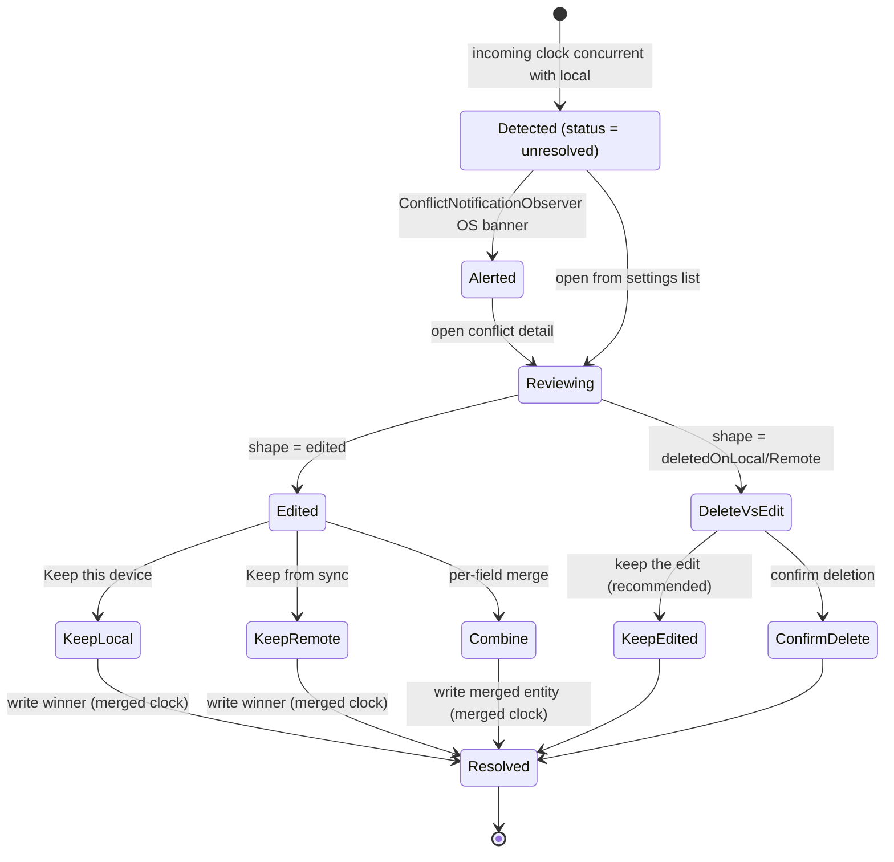
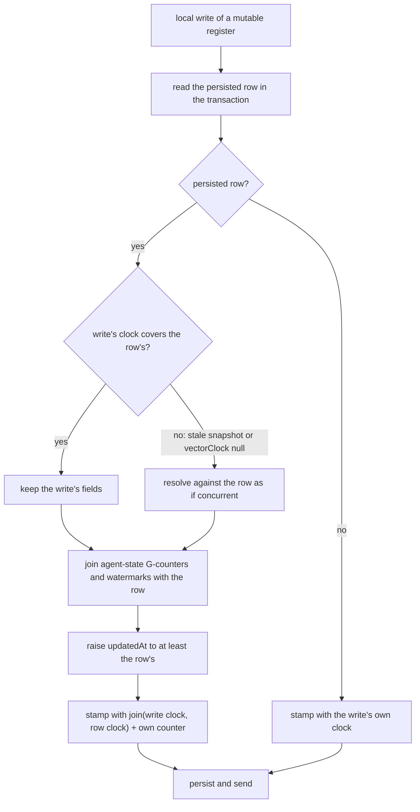

# What a vector clock is here

A `VectorClock` is a `Map<String, int>` from host id to that host's monotonic
counter. For a locally written payload it answers:

> When this payload version was written, what counters were already present in
> the version it was derived from, plus this host's next counter?

`VectorClockService.getNextVectorClock(previous: ...)` keeps the previous
entries and advances only the current host's counter. A brand-new local payload
with no previous clock contains just the current host's counter.

That is a different question from `originatingHostId`:

| Field | Answers |
|-------|---------|
| `originatingHostId` | Which host produced *this* payload version |
| `vectorClock` | What causal snapshot the version was created from — may mention other hosts |
| `coveredVectorClocks` | Which counters this payload *semantically replaces* |

# Compare rules

`VectorClock.compare(a, b)` yields four outcomes:

| Outcome | Meaning |
|---------|---------|
| `equal` | Both clocks contain the same counters |
| `a_gt_b` | `a` dominates: every host counter in `a` is ≥ `b`, at least one strictly greater |
| `b_gt_a` | The same relation reversed |
| `concurrent` | Neither dominates |

Implementation facts that decide edge cases:

- A missing host entry compares as `0`.
- A negative counter is invalid and throws `VclockException`.
- `VectorClock.merge(a, b)` takes the per-host maximum.

| A | B | `compare(A, B)` | Why |
|---|---|---|---|
| `{A: 5}` | `{A: 5}` | `equal` | Same counter everywhere |
| `{A: 7}` | `{A: 5}` | `a_gt_b` | `A` moved forward |
| `{A: 5}` | `{A: 7}` | `b_gt_a` | Reverse |
| `{A: 1, B: 1}` | `{A: 1}` | `a_gt_b` | Missing hosts count as `0`, so `B:1 > 0` |
| `{A: 3, B: 1}` | `{A: 1, B: 3}` | `concurrent` | Ahead on one host, behind on another |

```text
merge({A:5, B:1}, {A:3, B:4, C:2}) == {A:5, B:4, C:2}
```

# Three distinct uses

## 1. Freshness and conflict detection

`SyncEventProcessor` and `MatrixMessageSender` compare clocks to decide whether
what is on disk, in memory, or already stored locally is older, newer, equal or
concurrent. A `concurrent` result stores the incoming payload as a `Conflict`
row instead of merging it.

## 2. Gap detection

`SyncSequenceLogService.recordReceivedEntry()` walks **every** host in the
incoming clock except the receiver's own — not only the originator. It converts
those observations into gaps only for the originator and for hosts the receiver
has already seen online.

So a payload written by Alice can reveal that Bob's counter `7` is missing, if
the clock carries Bob at `8` and the receiver already has Bob in host activity.
If Bob has never been seen online by that receiver, the counter is recorded but
gap detection is skipped for Bob.

## 3. Supersession

`coveredVectorClocks` carries what a newer payload replaces, and the receiver
processes it before normal gap detection.

# Why a later clock is not enough

```text
missing counter:    {A:11}
new payload clock:  {A:20}
```

`{A:20}` proves the sender knows about later work. It does **not** prove that
counter `11` was semantically superseded by the payload being received. That
proof must be explicit:

```text
vectorClock        = {A:20}
coveredVectorClocks = [{A:10}, {A:12}, {A:15}, {A:20}]
```

The receiver pre-marks `10`, `12` and `15`, then handles `20` as the current
payload. Non-covered counters in between stay missing and can still trigger
backfill.

**Vector clocks describe causal knowledge. `coveredVectorClocks` describes
semantic replacement.** Conflating the two is the single most likely way to
break offline convergence.

## Worked example: rapid updates on one host

Host `A` updates the same entry three times before the outbox drains — `{A:5}`,
`{A:6}`, `{A:7}`. The outbox merge path collapses them into one pending message:

```text
vectorClock         = {A:7}
coveredVectorClocks = [{A:5}, {A:6}, {A:7}]
```

On receive, the covered clock equal to the current payload clock is filtered out
before pre-marking. Counters `5` and `6` are marked covered, `7` is recorded as
the payload being applied, and the receiver does not strand `5` and `6` as
permanent missing rows.

## Worked example: multi-host clock, single originator

A stored version already carries `{Alice:9, Bob:8}` — Bob edited earlier and
synced, then Alice edited locally. Alice's next local write produces:

```text
originatingHostId = Alice
vectorClock       = {Alice:10, Bob:8}
```

Bob's `8` is inherited causal history, not a counter Alice invented. This is
exactly why gap detection walks all hosts rather than only the originator.

# Conflicts

When detection yields `concurrent`, the payload lands as a `Conflict` row and
the user resolves it in *Settings → Advanced → Conflicts*.



## Field-level diff

`ConflictDetailRoute` loads both versions — the local journal row and the remote
payload deserialized from the `Conflict` row — and renders a full field diff.
`computeEntryDiff` walks a registry of comparable fields (title, body, category,
start/end dates, starred, private, flag, audio duration) and returns
`EntryDiff{shape, fields, identicalFieldCount}`.

Two details make it trustworthy:

- **Text fields carry a word-level LCS diff** (`computeTitleDiff`).
- **A JSON completeness guard** emits a single `EntryField.other` entry whenever
  the two versions differ in a field the registry does not model. A change can
  therefore never be silently hidden across any of the 16 entity types — which
  matters because the registry will always lag new fields.

## Resolution

`ConflictResolutionView` offers three paths: **Keep this device**, **Keep from
sync**, or **Combine** — a per-field merge where each independently-mergeable
field gets a non-colour-dependent toggle and everything else follows a chosen
base side. A *recommended* chip marks the no-data-loss option.

When one side was soft-deleted while the other was edited
(`ConflictShape.deletedOnLocal` / `deletedOnRemote`), the diff is replaced by a
safe binary — keep the edited version or confirm the deletion — defaulting to
keeping the edit.

All three paths resolve through `ConflictResolutionService`. `resolveToSide` /
`buildMergedEntity` build the winner and stamp `VectorClock.merge(local,
remote)`, so the written entity dominates both clocks;
`PersistenceLogic.updateJournalEntity` applies it and the `detectConflict`
write-gate auto-resolves the row.

## Proactive surfacing

Conflicts do not have to be discovered by browsing settings.
`ConflictNotificationObserver`, started from `get_it`, watches the
unresolved-conflict stream and raises a single OS banner when *new* conflicts
appear during a session. Conflicts already present at startup are primed
silently, and a burst — a device returning from a long offline stretch — is
coalesced into one alert. `unresolvedConflictCountProvider` exposes the live
count for badges.

# Agent state converges without user involvement

Inbound agent entities are resolved by one pure function,
`resolveAgentEntityVersions` in `agent_concurrent_resolver.dart`, which
`SyncEventProcessor` applies before it overwrites a local `AgentRepository`
row:

| Comparison | Behaviour |
|------------|-----------|
| a clock missing on either side | Apply the incoming version |
| `a_gt_b` / `equal` (local wins) | Skip the upsert, restore the local JSON cache when the message came via `jsonPath`, but still record the sequence-log receipt so backfill stops asking |
| `b_gt_a` (incoming wins) | Apply — with agent state's G-counters and report watermarks joined in from the local row |
| `concurrent` | The type's override, then last-writer-wins on `updatedAt`, then the canonical clock tiebreak; agent-state G-counters and nudge accumulators merge |

The concurrent case picks the strictly-newer `updatedAt`, falling back to a
replica-independent canonical clock comparison on ties. Type overrides run
first: a retraction is terminal, a scheduled wake with a later target beats
an earlier one, a day summary keeps its earliest testimony, a goal spec head
prefers the higher ordinal, and a nudge's dismissal, supersession and higher
activation outrank the timestamp. The cumulative counters on
`AgentStateEntity` — `wakeCounter`, `slots.totalSessionsCompleted`,
`slots.weeklyReviewCount` — are merged as a CRDT join via
`mergeAgentStateCounters`, and so are the report freshness watermarks. The
join also runs when the incoming version *dominates*: a concurrent merge joins
counters into a row without moving its clock, so a version that succeeds only
the merge's winner need not carry the loser's increments. Unlike journal
entries, agent-derived state never raises a user-facing `Conflict`.

Links (`AgentLink`) keep plain dominance plus last-writer-wins.

## A local write succeeds the row it replaces

Convergence is not only about the receive path: a pure pairwise rule still
diverges when a device keeps something its peers reject. So local writes of
mutable registers (the variants last-writer-wins orders by `updatedAt`) go
through the same decision (ADR 0068). `AgentSyncService._upsertEntityRaw`
reads the persisted row in the write's transaction and stamps the write with a
clock that covers both — every peer takes it as that row's successor — and
`resolveLocalAgentWrite` fixes its fields:



A write built on a stale snapshot therefore loses locally exactly where it
loses on every peer — an edit older than a retraction cannot revive it — and
a successor never sorts before its predecessor, whatever the writing device's
clock says. Append-only variants are written as given.

The scheduling fields (`nextWakeAt`, `sleepUntil`, `scheduledWakeAt`) are
device-local: the receive path overlays this device's values onto every
incoming state row. Maintenance writes that change only those fields go
straight to the repository without a clock or a sync message and leave
`updatedAt` alone — the throttle's `nextWakeAt`, and the project and
scheduled-wake cleanups of `scheduledWakeAt` — because a local timestamp
peers never see would let this device keep a row that every other device
rejects. Workflow outcome writes that also set `scheduledWakeAt` (the day
and project agents) go through `AgentSyncService` like any other state write.

## Residuals

The model `specs/tla/AgentReplication.tla` checks this with three replicas,
arbitrary arrival orders, stale and unclocked writes and a lagging clock. Two
cases stay open, recorded in `specs/tla/README.md` and ADR 0068:

- A successor that ranks *below* its predecessor under a type override — the
  day agent's digest retry re-arming its consumed window at the same instant,
  a relationship retry moved to an earlier instant — can still let arrival
  order decide against a third concurrent version.
- Nudges store the join of both clocks after a concurrent merge, so an exact
  `updatedAt` tie between two nudge versions is broken on a history-dependent
  clock.
