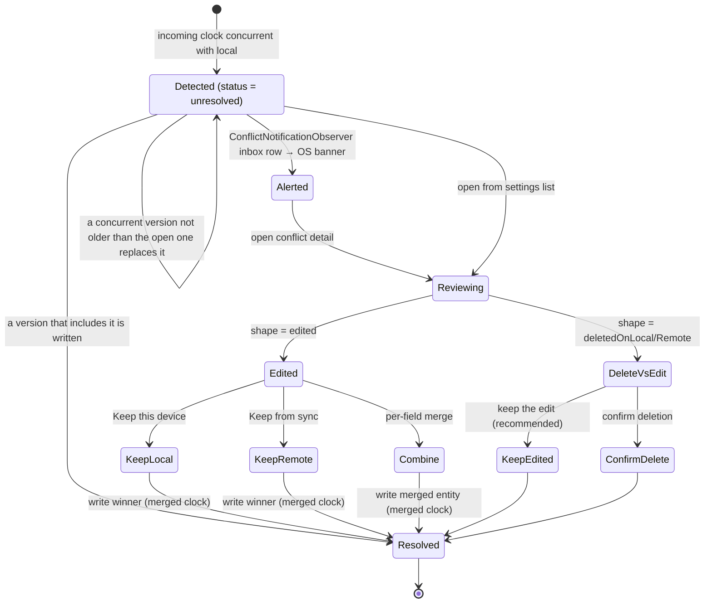
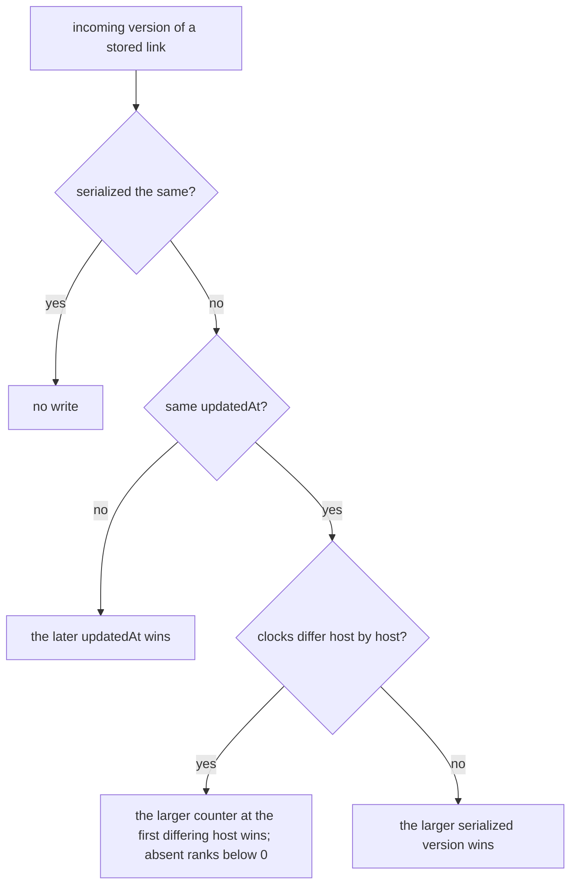
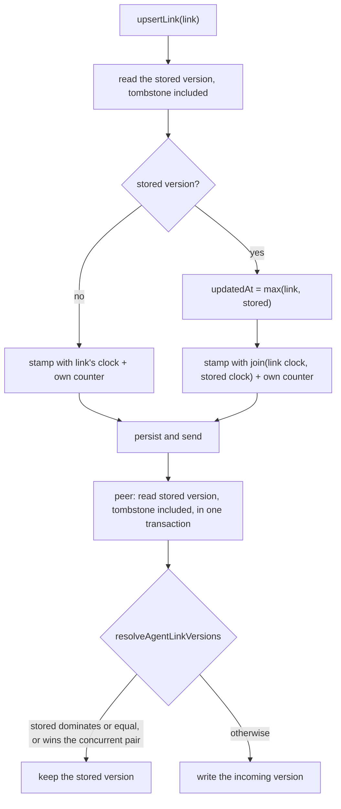
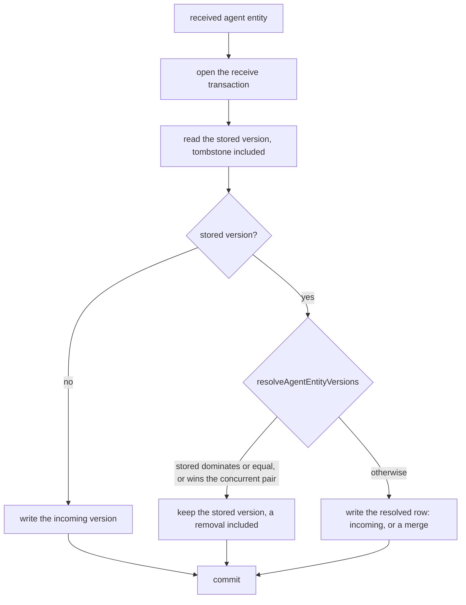
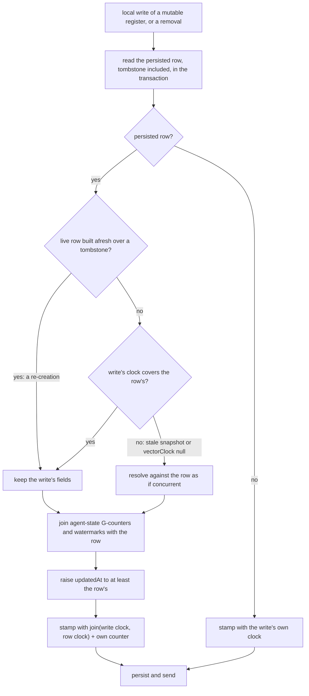

# What a vector clock is here

A `VectorClock` is a `Map<String, int>` from host id to that host's monotonic
counter. For a locally written payload it answers:

> When this payload version was written, what counters were already present in
> the version it was derived from, plus this host's next counter?

`VectorClockService.getNextVectorClock(previous: ...)` keeps the previous
entries and advances only the current host's counter. A brand-new local payload
with no previous clock contains just the current host's counter.

**A present entry says the host wrote; an absent one says it did not.** A new
host's first counter is `firstVectorClockCounter`, 1. Hosts that builds before
[ADR 0080](../../../docs/adr/0080-a-present-counter-ranks-above-an-absent-host.md)
created started at 0, and their clocks, `{…, host: 0}` included, are on every
device and keep arriving from devices that have not updated. So counter 0 is a
real write and must never read as "absent" (below).

**An update reserves with the entity's current clock as `previous`.** That is
what makes the new version dominate the one it replaces on every device.
Without it the update's clock holds only this host's counter, is merely
concurrent with its predecessor, and a late copy of the predecessor can win or
raise a conflict. Every update path passes it: `MetadataService.updateMetadata`
for journal entries, `JournalRepository.updateLink` and the project-link
tombstone for entry links, the notification repository, the consumption sync,
`AgentSyncService` for agent entities and links, and the maintenance and
historical re-stamps. The two link writers were missing it until
[ADR 0078](../../../docs/adr/0078-entry-link-versions-are-ordered.md).
Creates pass none. Entity definitions reserve no counter at all: a local edit
carries the stored clock and moves `updatedAt` past the stored one.

That is a different question from `originatingHostId`:

| Field | Answers |
|-------|---------|
| `originatingHostId` | Which host produced *this* payload version |
| `vectorClock` | What causal snapshot the version was created from — may mention other hosts |
| `coveredVectorClocks` | Which counters this payload *semantically replaces* |

# Compare rules

`VectorClock.compare(a, b)` yields four outcomes:

| Outcome | Meaning |
|---------|---------|
| `equal` | Both clocks contain the same counters |
| `a_gt_b` | `a` dominates: every host counter in `a` is ≥ `b`, at least one strictly greater |
| `b_gt_a` | The same relation reversed |
| `concurrent` | Neither dominates |

Implementation facts that decide edge cases:

- A missing host entry ranks below every counter, 0 included. Only identical
  clocks are `equal`.
- A negative counter is invalid and throws `VclockException`.
- `VectorClock.merge(a, b)` takes the per-host maximum over the union of hosts.
- `VectorClock.compareCanonically(a, b)` is a total order for the tiebreaks:
  the first host, in sorted order, whose counters differ decides, an absent
  host again below 0. It returns 0 only for identical clocks and ranks a
  dominating clock higher.

| A | B | `compare(A, B)` | Why |
|---|---|---|---|
| `{A: 5}` | `{A: 5}` | `equal` | Same counter everywhere |
| `{A: 7}` | `{A: 5}` | `a_gt_b` | `A` moved forward |
| `{A: 5}` | `{A: 7}` | `b_gt_a` | Reverse |
| `{A: 1, B: 1}` | `{A: 1}` | `a_gt_b` | `B` is absent from the second clock |
| `{A: 1, B: 0}` | `{A: 1}` | `a_gt_b` | The same: `B`'s first write, from a host an older build created |
| `{A: 1, B: 0}` | `{A: 1, C: 0}` | `concurrent` | Two new hosts each extended `{A: 1}` |
| `{A: 3, B: 1}` | `{A: 1, B: 3}` | `concurrent` | Ahead on one host, behind on another |

Until ADR 0080 a missing host compared as 0. A new host's first edit of an
existing entry or agent row, `{…, host: 0}`, then compared *equal* to the
version it extended. On the device that made it the journal write was refused
as older-or-equal and its counter burned, so the edit never stuck; every peer
kept its own row; and a concurrent version lacking only the `host: 0` entry
was taken as newer, so no conflict was raised. `AgentReplication.tla` finds
`NoLostSuccessor` violated in two steps with the old reading and a first
counter of 0, and `Converged` with the old canonical tiebreak.

```text
merge({A:5, B:1}, {A:3, B:4, C:2}) == {A:5, B:4, C:2}
```

# Three distinct uses

## 1. Freshness and conflict detection

`SyncEventProcessor` and `MatrixMessageSender` compare clocks to decide whether
what is on disk, in memory, or already stored locally is older, newer, equal or
concurrent. A `concurrent` result stores the incoming payload as a `Conflict`
row instead of merging it.

## 2. Gap detection

`SyncSequenceLogService.recordReceivedEntry()` walks **every** host in the
incoming clock except the receiver's own — not only the originator. It converts
those observations into gaps only for the originator and for hosts the receiver
has already seen online.

So a payload written by Alice can reveal that Bob's counter `7` is missing, if
the clock carries Bob at `8` and the receiver already has Bob in host activity.
If Bob has never been seen online by that receiver, the counter is recorded but
gap detection is skipped for Bob.

## 3. Supersession

`coveredVectorClocks` carries what a newer payload replaces, and the receiver
processes it before normal gap detection.

# Why a later clock is not enough

```text
missing counter:    {A:11}
new payload clock:  {A:20}
```

`{A:20}` proves the sender knows about later work. It does **not** prove that
counter `11` was semantically superseded by the payload being received. That
proof must be explicit:

```text
vectorClock        = {A:20}
coveredVectorClocks = [{A:10}, {A:12}, {A:15}, {A:20}]
```

The receiver pre-marks `10`, `12` and `15`, then handles `20` as the current
payload. Non-covered counters in between stay missing and can still trigger
backfill.

**Vector clocks describe causal knowledge. `coveredVectorClocks` describes
semantic replacement.** Conflating the two is the single most likely way to
break offline convergence.

## Worked example: rapid updates on one host

Host `A` updates the same entry three times before the outbox drains — `{A:5}`,
`{A:6}`, `{A:7}`. Each is its own outbox row; when the processor sends, it
collapses them into one message (ADR 0086):

```text
vectorClock         = {A:7}
coveredVectorClocks = [{A:5}, {A:6}, {A:7}]
```

On receive, the covered clock equal to the current payload clock is filtered out
before pre-marking. Counters `5` and `6` are marked covered, `7` is recorded as
the payload being applied, and the receiver does not strand `5` and `6` as
permanent missing rows.

## Worked example: multi-host clock, single originator

A stored version already carries `{Alice:9, Bob:8}` — Bob edited earlier and
synced, then Alice edited locally. Alice's next local write produces:

```text
originatingHostId = Alice
vectorClock       = {Alice:10, Bob:8}
```

Bob's `8` is inherited causal history, not a counter Alice invented. This is
exactly why gap detection walks all hosts rather than only the originator.

# Conflicts

When detection yields `concurrent`, the payload lands as a `Conflict` row and
the user resolves it in *Settings → Advanced → Conflicts*.

## The journal write decision

`JournalDb.updateJournalEntity` decides every journal write, local and
received, in one transaction: it reads the stored row **with its deletion**
(`entityByIdIncludingDeleted`) and compares clocks with `detectConflict`
([ADR 0083](../../../docs/adr/0083-model-checked-journal-replication.md),
`specs/tla/JournalReplication.tla`).

| Stored vs incoming | Outcome |
|--------------------|---------|
| incoming newer | applied; the entry's open conflict is marked resolved **only if the written version includes it** (its clock covers the conflict's) |
| equal or older | refused — a late copy of the version a deletion replaced included |
| concurrent | refused and stored as the entry's `Conflict` row, **unless the open conflict already holds that version or a newer one** |
| concurrent, both deleted | merged, no conflict: the canonically greater deletion's fields under the join of both clocks, the same row on every device |
| incoming without a clock | refused over a clocked row; applied over a row without one |
| stored without a clock | incoming applied |

A deletion is therefore a version like any other: a late copy cannot bring a
deleted entry back, and an edit made concurrently with a deletion is a
delete-versus-edit conflict on both devices. Only a creation
(`overwrite: false`) under a reused id replaces a deleted row outright, as it
always has — under a clock that does not cover the deletion, so peers ask the
user. Label writes (`LabelsRepository.setLabels`, `suppressLabelOnTask`) build
on the stored entry under a new clock, conditional on it still being stored,
and build again on a version that synced in meanwhile; nothing forces a write
over the stored row any more.

The conflict table holds **one row per entry**. A second concurrent version —
from a third device, or a save of this device refused while a conflict is
open — replaces the first on this device. A peer's version replaced this way
is raised again from its own device; a refused local save replaced this way is
lost. That is a residual awaiting a product decision (ADR 0083).



## Field-level diff

`ConflictDetailRoute` loads both versions — the local journal row and the remote
payload deserialized from the `Conflict` row — and renders a full field diff.
`computeEntryDiff` walks a registry of comparable fields (title, body, category,
start/end dates, starred, private, flag, audio duration) and returns
`EntryDiff{shape, fields, identicalFieldCount}`.

Two details make it trustworthy:

- **Text fields carry a word-level LCS diff** (`computeTitleDiff`).
- **A JSON completeness guard** emits a single `EntryField.other` entry whenever
  the two versions differ in a field the registry does not model. A change can
  therefore never be silently hidden across any of the 16 entity types — which
  matters because the registry will always lag new fields.

## Resolution

`ConflictResolutionView` offers three paths: **Keep this device**, **Keep from
sync**, or **Combine** — a per-field merge where each independently-mergeable
field gets a non-colour-dependent toggle and everything else follows a chosen
base side. A *recommended* chip marks the no-data-loss option.

When one side was soft-deleted while the other was edited
(`ConflictShape.deletedOnLocal` / `deletedOnRemote`), the diff is replaced by a
safe binary — keep the edited version or confirm the deletion — defaulting to
keeping the edit. The page reads the local side with its deletion
(`journalEntityByIdIncludingDeleted`), so a deletion made on this device opens
too; before ADR 0083 it showed "entry not found".

All three paths resolve through `ConflictResolutionService`. `resolveToSide` /
`buildMergedEntity` build the winner and stamp `VectorClock.merge(local,
remote)`, so the written entity dominates both clocks;
`PersistenceLogic.updateJournalEntity` applies it — keeping the stored row's
labels, a deleted one's included — and the write decision marks the row
resolved, because the written clock covers the conflict's.

## Proactive surfacing

Conflicts do not have to be discovered by browsing settings.
`ConflictNotificationObserver`, started from `get_it`, watches the
unresolved-conflict stream and writes a single `syncConflict` inbox row when
*new* conflicts appear during a session — the OS banner is the notification
scheduler's projection of that row, a tap opens this list, and the row stays
in the bell after the banner is gone. Conflicts already present at startup
are primed silently, and a burst — a device returning from a long offline
stretch — is coalesced into one row; the next burst retracts the previous
one. The row is [device-local](../notifications.md#two-rows-never-leave-the-device):
a conflict is this device's disagreement with a peer, so the row must never
reach that peer. `unresolvedConflictCountProvider` exposes the live count for
badges.

# Entry links: one version on every device

A link has no conflict UI: every device keeps one version, and it must be the
same one. Versions arrive as `entryLink` messages, as backfill answers and
inside every journal-entity message, which embeds a snapshot of the entry's
links. `JournalDb.upsertEntryLink` orders them by one key in its
transaction, for sync and local writers alike, and refuses a version older
than the stored one:



A single lexicographic key is transitive for any mix of versions, clockless
legacy copies included. A dominance check with a timestamp fallback, the order
agent entities use (below), can form a cycle on such a mix. The key agrees
with causality because of the writers, as `AgentReplication.tla` requires of
agent writes (`IntentCarriesClock`, `ClampTimestamp`). An edit reserves with
the stored link's clock as `previous`, so its clock is its predecessor's plus
this host's next counter. `linkEditTimestamp` never stamps it earlier than the
version it replaces, even when a peer's wall clock ran ahead. The clock step
is `VectorClock.compareCanonically`, in which an absent host ranks below
counter 0, so an edit from a host that started at 0 still ranks above its
predecessor ([ADR 0078](../../../docs/adr/0078-entry-link-versions-are-ordered.md);
since ADR 0080 `compare` reads it the same way). A refused version is still
recorded as received in the sequence log. The stored clock covers its
counter.

Links written before ADR 0078 have clocks without their predecessor's entries.
Pairs of those are concurrent and ordered by `updatedAt` until the link's next
edit. A removal is an edit too: `removeLink`, `removeTypedLink`, the project
unlink and the relationship unlink write the link's next version with
`deletedAt` set and send it. A peer's late snapshot of the live link ranks
below it. Linking the same pair and type again revives that version under
the same id rather than minting a second row, so a re-link is ordered against
the removal like any other edit
([entry links](../../domain/entry-links.md#a-removal-is-a-synced-tombstone),
ADR 0078 addendum).

# Agent state converges without user involvement

Inbound agent entities are resolved by one pure function,
`resolveAgentEntityVersions` in `agent_concurrent_resolver.dart`, which
`SyncEventProcessor` applies before it overwrites a local `AgentRepository`
row:

| Comparison | Behaviour |
|------------|-----------|
| a clock missing on either side | Apply the incoming version — for agent state with the heads merged (below) |
| `a_gt_b` / `equal` (local wins) | Skip the upsert, restore the local JSON cache when the message came via `jsonPath`, but still record the sequence-log receipt so backfill stops asking |
| `b_gt_a` (incoming wins) | Apply — with agent state's G-counters and report watermarks joined in from the local row, and the local head kept when it is known to descend from the incoming one (below) |
| `concurrent` | The type's override, then last-writer-wins on `updatedAt`, then the canonical clock tiebreak; agent-state G-counters and nudge accumulators merge, the agent head follows the message DAG (below), and change sets merge item by item |

The concurrent case picks the strictly-newer `updatedAt`, falling back to a
replica-independent canonical clock comparison on ties
(`VectorClock.compareCanonically`). Type overrides run
first: a retraction is terminal, a scheduled wake with a later target beats
an earlier one, a day summary keeps its earliest testimony, a goal spec head
prefers the higher ordinal, and a nudge's dismissal, supersession and higher
activation outrank the timestamp, and an evolution session keeps the more
final status — completed, then abandoned, then active — so a 1-on-1 whose
proposal was adopted is never recorded as abandoned by a peer's concurrent
sweep (ADR 0081). The cumulative counters on
`AgentStateEntity` — `wakeCounter`, `slots.totalSessionsCompleted`,
`slots.weeklyReviewCount` — are merged as a CRDT join via
`mergeAgentStateCounters`, and so are the report freshness watermarks. The
join also runs when the incoming version *dominates*: a concurrent merge joins
counters into a row without moving its clock, so a version that succeeds only
the merge's winner need not carry the loser's increments. Unlike journal
entries, agent-derived state never raises a user-facing `Conflict`.

## Agent links: a tombstone is a version

Agent links (`AgentLink`) are ordered like any register, by
`resolveAgentLinkVersions`: dominance, then `updatedAt`, then the canonical
clock. Three things make that order hold on every replica (ADR 0081,
`specs/tla/AgentLinks.tla`):

- **The receive reads the stored version with its tombstone**
  (`AgentRepository.getLinkByIdIncludingDeleted`), and reads and writes it in
  one transaction. `getLinkById` filters `deleted_at IS NULL`, so a removal
  used to read as no row, and any late copy of the link it removed replaced
  it.
- **Backfill serves a tombstone like any version.** The responder and the
  verifier read the same way. Answering `deleted` for a removed link settled
  a lost removal with nothing applied.
- **A local write succeeds the stored version.** Writers build links afresh
  (`vectorClock: null`) under reused ids, such as the Daily OS links'
  deterministic ids. `AgentSyncService.upsertLink` reads the stored version,
  tombstone included, in the write's transaction, stamps a clock that covers
  both, and never stamps an `updatedAt` older than the stored one.



Soul assignments and improver targets are an exception, recorded as a
residual below.

## Agent entities: a removal is a version too

Removing an agent entity writes it with `deletedAt` set, and sync treats that
tombstone as one more version of the id, as it does for links (ADR 0081,
addendum; `specs/tla/AgentReplication.tla`, the removal kind):

- **Everything sync orders reads the tombstone.**
  `AgentRepository.getEntityIncludingDeleted` is what the receive
  (`resolveReceivedAgentEntity`), the backfill responder, the backfill
  verifier, own-counter settlement, the sequence log's canonical clock and the
  local write resolution read. `getEntity` hides it, so a removal read as no
  row and a late copy of the live version replaced it; a lost removal was
  answered `deleted` and never arrived.
- **Every entity is received in one transaction.** The stored row is read,
  resolved and written together, whatever the type; a local write that
  committed between a read and a write was otherwise overwritten.
- **A removal succeeds the version it replaces.** A removal of any variant,
  append-only ones included, is stamped over the stored version, like a write
  to a mutable register.
- **A removal ranks at its instant.** `effectiveUpdatedAt` is the later of
  the variant's timestamp and `deletedAt`. A removal and an edit made
  concurrently go by last-writer-wins on those instants, so the later of the
  two stands everywhere. An append-only variant's edit keeps its `createdAt`,
  so there a concurrent removal always wins. No type that is removed has a
  status override.
- **A row built afresh over a tombstone is a re-creation.** Its writer read no
  row, so it has no clock; it keeps its fields, and its stamp covers the
  tombstone, so it succeeds the removal on every device. A day plan drafted
  again for a deleted day, a recommendation decision recorded again after an
  undo, and the default templates and souls that seeding restores are
  re-created this way.



## A local write succeeds the row it replaces

Convergence is not only about the receive path: a pure pairwise rule still
diverges when a device keeps something its peers reject. So local writes of
mutable registers (the variants last-writer-wins orders by `updatedAt`) go
through the same decision (ADR 0068). `AgentSyncService._upsertEntityRaw`
reads the persisted row in the write's transaction and stamps the write with a
clock that covers both — every peer takes it as that row's successor — and
`resolveLocalAgentWrite` fixes its fields:



A write built on a stale snapshot therefore loses locally exactly where it
loses on every peer — an edit older than a retraction cannot revive it — and
a successor never sorts before its predecessor, whatever the writing device's
clock says. Other append-only writes are written as given; a removal of an
append-only variant is stamped over the persisted row too.

The flip side: a writer that *means* to replace the row must build on it. A
write with `vectorClock: null` over an existing id is resolved as concurrent,
and one that moves the row against the resolver's order — an earlier
deadline under the scheduled-wake override, a new report at the instant the
standing head was stamped, a new version while a peer's clock runs ahead —
is handed the row back, here and on every peer. So report heads, soul and
template heads and goal-progress registers carry the clock
of the row they read in the same transaction (ADR 0068 addendum;
`AgentReplication.tla`'s `Intend` write and `LocalWriteTakesEffect`).

The scheduling fields (`nextWakeAt`, `sleepUntil`, `scheduledWakeAt`) are
device-local: the receive path overlays this device's values onto every
incoming state row. Maintenance writes that change only those fields go
straight to the repository without a clock or a sync message and leave
`updatedAt` alone — the throttle's `nextWakeAt`, and the project and
scheduled-wake cleanups of `scheduledWakeAt` — because a local timestamp
peers never see would let this device keep a row that every other device
rejects. Workflow outcome writes that also set `scheduledWakeAt` (the day
and project agents) go through `AgentSyncService` like any other state write.

## Change sets merge item by item

A change set is one synced row that every device showing it edits — the user
confirms an item on the phone while a wake on the desktop retracts another.
Picking one whole version dropped the other device's decisions (a change set's
last-writer-wins timestamp is its `createdAt`, so the canonical clock order
decided), and an item confirmed and applied on one device read `pending`
everywhere again. The receive decision therefore merges two concurrent
versions item by item — the change-set case of `resolveAgentEntityVersions`'
concurrent branch (`mergeConcurrentChangeSets`):

| Per item | Kept |
|----------|------|
| different `revision` | the version that changed the item last |
| a side without a `revision` (an older build wrote it, and drops the field) | judged by status, as below — not as revision 0; on a status tie, the side with a revision, which changed the item |
| same revision, different status | the more final status: `confirmed` over `rejected` over `retracted` over `pending` — a confirm took effect, a concurrent rejection or retraction did not |
| same revision and status | a fixed order on the item's content — never the clock order |

Every writer bumps an item's `revision` when it changes the item's status or
arguments (`ChangeItemRevision.withStatus` / `withArgs`). Items only one
version appended are kept, the set status is derived from the merged items,
and the merged row carries the join of both clocks, so the two devices compute
the same row and a later write on either dominates it; a version that
succeeds only one side is concurrent with the merged row and merges again.

Unlike the nudge residual below, the joined clock is safe here. No step of the
item merge reads the canonical clock order: each item is the maximum of a
total order on (revision, status rank, content), so the merged row depends
only on the versions' contents, not on the order a replica received them in.
Two cases fall outside that order and keep the whole-row winner's
history-dependence: versions that disagree on which proposal an index holds
(or a tombstone), which fall back to the whole-row winner, and items an older
build wrote without a revision, which are compared by status alone.

Change sets are append-only for last-writer-wins (`createdAt`), so a local
change-set write is not resolved by `resolveLocalAgentWrite`; every writer
already re-reads the set and changes its own item in one transaction
(ADR 0067).

The receive is one transaction, as it is for every agent entity: the local
row is read, compared and written together. Otherwise a local claim
committing between the read and the write is overwritten by a peer version
that only covered the row as it was before the claim.

`specs/tla/ChangeSetLifecycle.tla` model-checks both. An item decided on two
devices before they sync is still dispatched on both (the rows converge), but
since [ADR 0075](../../../docs/adr/0075-idempotent-change-set-tools.md) the
second dispatch of the tools it covers changes nothing: a created entity's id
is derived from the item, and a task field is set only while it holds the
value the proposal was made against. The tools without that protection are
listed in the ADR. When both devices create the entity before either has received the
other's, the journal receive (see *Conflicts* above) finds the two versions of that one id
concurrent — their creation timestamps differ — and keeps the second as a
`Conflict` row: one entity, resolved by the user, not two. See
[ADR 0067](../../../docs/adr/0067-model-checked-change-set-lifecycle.md) for
the lifecycle and ADR 0075 for what stays open.

## The agent head follows the message DAG

An agent-state row carries the agent's head pointer, `recentHeadMessageId`:
the message the next append chains off. Taken from the last writer like the
other fields, it went back whenever an older head won on `updatedAt` — a
version from a device whose clock runs ahead, say — and the next append then
forked the log off the old head (ADR 0071's residual). The head is therefore
merged apart from the other fields, as a register over the message DAG
(ADR 0076, `mergeAgentHeads`):

| Heads | Kept |
|-------|------|
| one unset | the other |
| one known here to descend from the other | the descendant, whichever version wins the other fields |
| no order known here — a true fork, or messages and edges still in flight | the greater id: the same on every device, never the clock or arrival order |

A version with no clock on either side — an older build's — still applies,
with the heads merged the same way. On dominance the incoming head stands
unless the local one is known to descend from it, or the incoming one is
unset: a concurrent merge keeps the winner's
clock, so a replica can hold a head its successor's writer never saw.

The resolver stays pure. `SyncEventProcessor` reads the order of the two heads
in the local DAG first (`AgentMessageDag.ancestryOf`, a forward walk over the
`messagePrev` edges of present rows) and passes it in as `isAncestor`; the
local write path needs none, since every local head writer reads the row in
its own transaction. An agent-state row is also read, resolved and written in
one transaction, as every received entity is: a local append committing in
between was otherwise overwritten and the head moved back past it.

What the merge cannot know — an order whose rows have not arrived yet — the
append path settles: `_appendMessage` advances the head to a tip past it
before chaining (`AgentMessageDag.tipFrom`), so a pointer left on a row that
has since received a child does not fork the log — provided the child's
`messagePrev` edge has arrived, since the walk follows edges.
`specs/tla/AgentMessageLog.tla` model-checks both (`HeadNeverRegresses`,
`AppendsOffTips`, `SettledHead`).

## Residuals

The model `specs/tla/AgentReplication.tla` checks this with three replicas,
arbitrary arrival orders, stale and unclocked writes, removals and
re-creations, lost deliveries recovered by backfill, and a lagging clock.
These cases stay open, recorded in `specs/tla/README.md` and ADRs 0068 and
0081:

- A successor that ranks *below* its predecessor under a type override — the
  day agent's digest retry re-arming its consumed window at the same instant,
  a relationship retry moved to an earlier instant — can still let arrival
  order decide against a third concurrent version.
- Nudges store the join of both clocks after a concurrent merge, so an exact
  `updatedAt` tie between two nudge versions is broken on a history-dependent
  clock.
- A template has at most one live soul assignment, and a template has at most
  one improver. When a live one arrives, `AgentRepoLinks.upsertLink`
  tombstones the other locally, without a clock bump or a sync message, so
  two devices that reassign concurrently swap the assignments (ADR 0081).
  The fix needs a decision.
- Seeding restores a default template or soul the user deleted, at the next
  start. The re-creation wins on every device; whether a deleted default
  should stay deleted is a product decision (ADR 0081, addendum).
- A hard delete (`hardDeleteAgent`, retention pruning) leaves no tombstone and
  is not synced, so a late copy can restore such a row.
