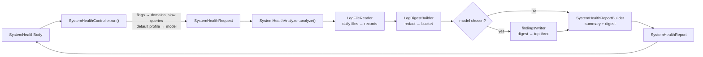
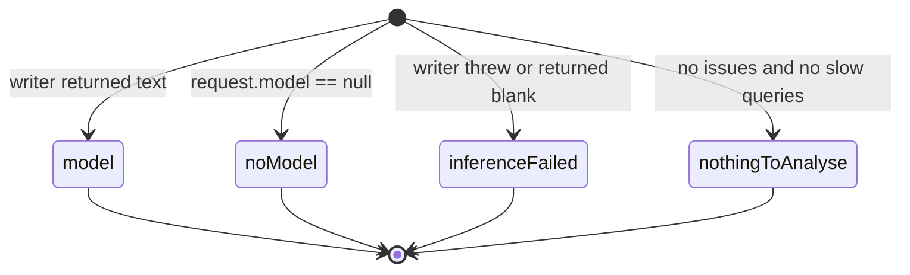

# One pipeline, no UI in it

`SystemHealthAnalyzer` takes a request and returns a report; it knows nothing
about widgets, Riverpod or `getIt`. The controller is the only place the
device's state is gathered — logging flags from `JournalDb`, the default
profile from `AiConfigRepository`, the model catalog — and it hands the
analyzer a plain `SystemHealthRequest`. A scheduled check later can build the
same request from the same flags and call the same method.

The model call is a function type, `SystemHealthFindingsWriter`, not a class
the analyzer constructs. Production wires `SystemHealthFindingsInference.write`
(one `CloudInferenceRepository.generate` call, captured for usage attribution
when `AiInteractionCapture` is registered); tests pass a stub.

# Which files are read

The writers decide the naming, and the reader follows it — see
[logging and diagnostics](../architecture/logging-and-diagnostics.md) for why
each file exists:

| Selected | File per day | Line shape |
|----------|--------------|------------|
| a domain other than `sync` | `<wireName>-<yyyy-MM-dd>.log` | `<iso> [LEVEL] <subDomain>?: <message>` |
| the `sync` domain | `sync-<yyyy-MM-dd>.log` | `<iso> [LEVEL] sync <subDomain>?: <message>` |
| slow queries (the `log_slow_queries` flag) | `slow_queries-<date>.log` and `super_slow_queries-<date>.log` | `<iso> [<db>] <op> <ms>ms args=<n> <sql>` |

Days come from `SystemHealthRange.days`; every line is then checked against the
exact window, because a daily file holds the whole day. A line that does not
open with a timestamp — a stack frame, a diagnostics dump, `PLAN:` / `STACK:` /
`TIMING:` rows — belongs to the entry above it. `INFO` lines are counted per
domain and dropped; only errors and warnings become records. Missing files are
simply absent from the count; a malformed line is skipped, never fatal.

**Domains are the logging flags.** The page embeds `LoggingSettingsBody`
unchanged, and `run()` reads the same `log_<domain>` config flags, so the set
that is logged and the set that is analysed cannot drift apart. The global
`enable_logging` flag is deliberately *not* consulted: old files are still
worth reading when logging has since been switched off.

# Redaction runs before anything else

`LogRedactor.redact` is applied inside the digest builder to every message,
statement and stack frame *before* grouping, so the digest never contains a raw
line — and therefore neither the page, the model prompt nor the clipboard does.

| Pattern | Becomes |
|---------|---------|
| email address | `[email]` |
| UUID | `[id:abcdef]` — the first six characters, the same form `DomainLogger.sanitizeId` writes |
| Matrix user / room / event id | `[matrix-id]` |
| `api_key=`, `token:`, `password=`, `Authorization: Bearer …` and similar | key kept, value `[redacted]` |
| opaque run of 40+ mixed letters and digits | `[token]` |
| `/Users/<name>`, `/home/<name>`, `C:\Users\<name>` | user segment `[user]` |
| IPv4 address | `[ip]` |
| international phone number (`+` prefixed only) | `[phone]` |
| URL user-info and query string | `[credentials]@`, `?[query]` |

Phone matching requires the `+` prefix on purpose: a bare digit run is
indistinguishable from the counters, durations and timestamps that make a log
line useful. Log messages are telemetry by contract (the
`DomainLogger` rule), so free text is not scrubbed — the report states exactly
what was, so a reader knows what to expect.

# What the digest keeps

- **Issues**: error and warning records grouped by domain, level and a
  *signature* — the redacted message with ids, ISO timestamps and numbers
  replaced, cut at 200 characters. Each bucket keeps its count, first and last
  seen, the first redacted sample and up to six `package:lotti/` stack frames
  from that sample. Errors sort before warnings, then by count.
- **Slow queries**: grouped by a normalised statement (quoted literals and
  numbers to `?`, `IN (?, ?, ?)` to `(?...)`, whitespace collapsed), with
  count, p50 / p95 / max / total elapsed, distinct `EXPLAIN QUERY PLAN` shapes
  and distinct top app frames. A query above the super-slow cutoff is written
  to *both* files, so statistics come from the slow file's series and the
  super-slow file only contributes plans, frames and `superSlowCount`; a
  statement seen only in the super-slow file falls back to that series.
- **Domain counts** by level, and **error bursts**: minutes with at least ten
  errors and at least three times the lower median of error-carrying minutes.
- Bucket caps (25 issues, 15 statements) set `truncated`, which the rendering
  shows as `+` on the totals.

# Size budget

The rendered digest is both the model prompt and the collapsed evidence
section, so `SystemHealthReportBuilder.renderDigest` halves the number of
issue and query buckets it shows until the text fits `maxDigestChars` (24 000)
or only three of each remain, and says how many were left out. Inline
fragments are single-line, back-tick-safe and cut at 400 characters.

# The report and its fallbacks

`renderReport` returns three strings: the summary (header with window,
domains, counts and the redaction note, then the findings section), the digest,
and the full report — summary plus digest inside a `
` block. The page
shows the summary and toggles the digest; the clipboard always gets the full
text.

Every outcome still renders the digest. A failed model call is described in
the report with the *redacted* error text, and the run itself is not a failure
— only a problem before analysis (reading flags, an unexpected exception)
lands in `SystemHealthState.failure` and surfaces as a toast.

# Saved reports

A run's full Markdown is written by `SystemHealthReportStore` to
`<documents>/logs/system_health/system-health-<yyyy-MM-dd-HHmmss>.md`, next
to the files it was built from, and the page shows the path under the report.
The store never indexes anything: the newest file is the one whose name
carries the latest stamp, and `loadLatest` splits it back into summary and
digest at the `
` marker (`SystemHealthReportDocument.fromMarkdown`).
Saving is best effort — a write failure costs the path, not the report.

The page therefore renders a `SystemHealthReportDocument`, never the report
itself: a fresh run's document comes from `SystemHealthReport.toDocument`, and
the one restored on the controller's first build comes from disk with no
request or digest objects behind it. `SystemHealthState.report` is set only by
a run in this session.

# The controller

`SystemHealthController` is a kept-alive `Notifier` so a report survives
leaving the page; its `build` also kicks off restoring the newest saved
document, which a run finishing first overrides. It holds the preset (custom seeds the last seven whole days
once), the explicit model choice or the "follow the default" flag, and the last
report or failure. `run()` ignores re-entry, holds a subscription on the
auto-disposed `systemHealthAnalyzerProvider` for the duration (the cloud
inference repository behind it closes on dispose), and resolves the model as
`systemHealthDefaultModelProvider` — the default profile's `thinkingModelId`,
matched by config id or provider model id against the agentic model catalog —
unless the user picked one in the shared `InferenceProviderModelPickerModal`.

# Gotchas

- The widget test binding's fake clock never completes real file IO, so the
  page test feeds an in-memory `LogFileReader` subclass; the reader's own
  tests use a temp directory inside a plain `test()`.
- `thenThrow` on a mocked `Future`-returning method does not reject the
  future in this Mocktail version; stub failures with `thenAnswer((_) async =>
  throw …)`.
- The single-provider model picker titles its page with the provider's name,
  not the title passed to `show`.

Related: [settings](settings.md) · [settings v2](settings_v2.md) ·
[logging and diagnostics](../architecture/logging-and-diagnostics.md) ·
[persistence (slow-query capture)](../architecture/persistence.md#slow-query-capture) ·
[profile resolution](ai/profile-resolution.md)
