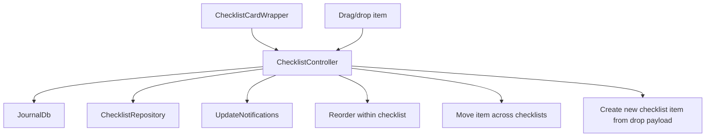
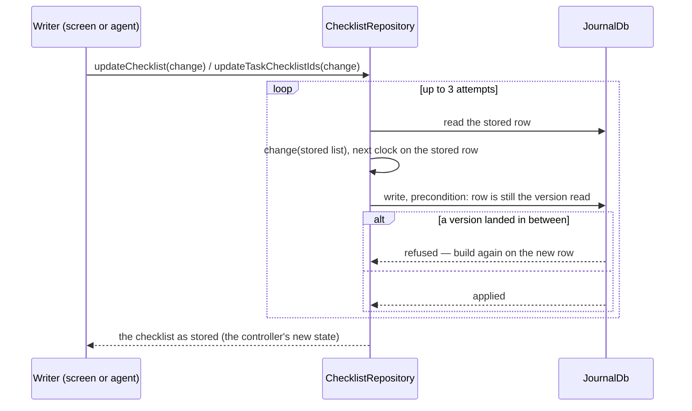
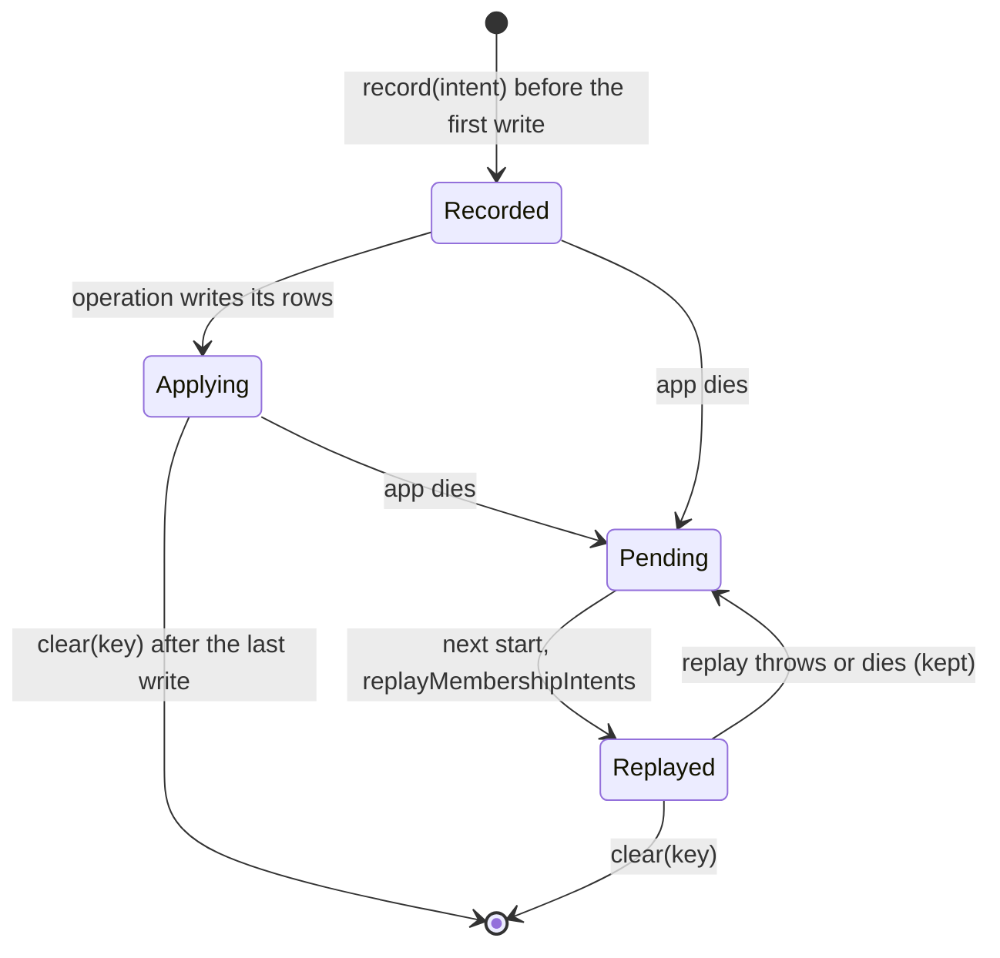
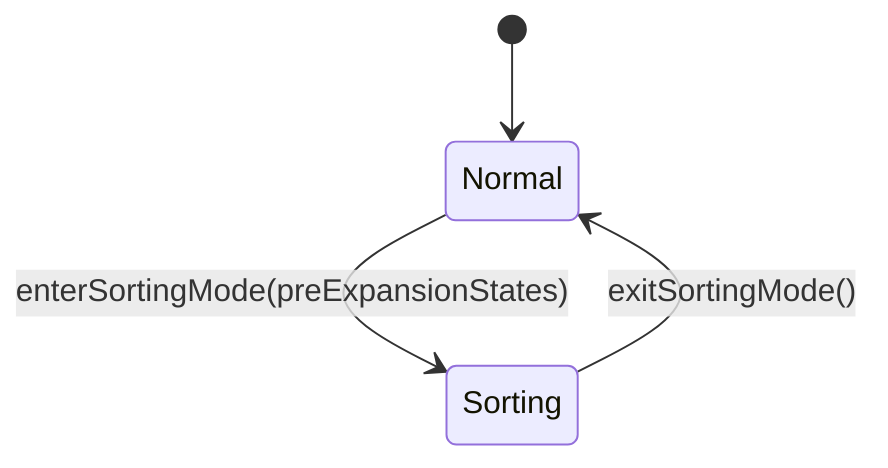

Checklists are one of the main reasons the tasks feature exists as a feature
rather than a loose set of task helper widgets.

# The runtime model

`ChecklistController` loads a checklist entity, subscribes to it and to all
linked item ids, updates title and item order, handles dropping existing and new
items into a checklist, unlinks and relinks items, and deletes the checklist —
removing its id from the parent task when possible.

# Membership is changed on the stored row

Which checklists a task shows is `TaskData.checklistIds`; which items a
checklist shows is `ChecklistData.linkedChecklistItems`. Every reader — the
task page, `ChecklistRepository.getChecklistItemsForTask`, the agent's context
— resolves membership from those lists alone, so an id dropped from its
parent's list is an item or checklist nobody sees, though its row lives on.

**A membership write states an intent, never a whole list.** Add an id
(`withMember`), remove one (`withoutMember`), or show these in this order
(`inVisibleOrder`, which keeps ids the screen never saw) — the pure helpers in
`lib/features/tasks/model/membership_list.dart`. The intent is applied to the
list *as stored*, through `writeOnStored` (`lib/logic/write_on_stored.dart`):

**`ChecklistRepository.updateTaskChecklistIds` is the one writer of a task's
checklist list.** Every other task write keeps the stored list:
`PersistenceLogic.updateTask` writes on the stored task with its own
`checklistIds`, and `JournalRepository.updateJournalEntity` (the agent's task
field tools) keeps the list read just before the write. So a status or
estimate saved from a screen's copy of the task cannot drop a checklist the
agent or sync added since. Conflict resolution writes through
`PersistenceLogic` directly and keeps the side the user chose.

**The screens' copies are never the base of a write.** `ChecklistController`
and `ChecklistItemController` state is refreshed by an update notification
some time after its row changes, so it only decides *what* to change: an item
check, rename or archive is a change of those fields applied to the stored
item (`ChecklistRepository.updateChecklistItem`), so it never writes an old
back-link or title back. The agent's item tools and the Plaza check-off write
the same way. `ChecklistsWidget` keeps the order of a drag only until the
task's own list changes, so a checklist that arrives later is shown.

**An operation that writes several rows records its intent first.** Creating
and listing items, moving an item (its back-link, the target's list, the
source's), deleting an item across its swipe-undo window, and creating or
deleting a checklist each save a device-local settings row
(`ChecklistMembershipIntents`) before their first write and remove it after
their last. At startup `ChecklistRepository.replayMembershipIntents` finishes
whatever the app died in the middle of; each intent is a set of idempotent
changes to stored rows, so replaying a finished one is harmless.

A swipe-deleted item's intent spans the undo window: `beginItemDeletion`
records it, unlists the item and times the window in the (keep-alive)
repository — not in the row, which leaves the screen with the item and used
to cancel the delete with it, leaving swiped items alive forever. Either
`completeItemDeletion` (window closed) or `undoItemDeletion` (Undo) clears
it; a crash in between completes the deletion the user last saw. An
operation whose writes were refused or failed keeps its intent too, and the
next start finishes it.

Why each rule exists — the counterexamples TLC found when it was missing — is
in `specs/tla/ChecklistMembership.tla` and its README section, and the
decision in [ADR 0089](../../../docs/adr/0089-checklist-membership-on-the-stored-row.md).

When a user renames an item, `ChecklistItemController.updateTitle` fires a
fire-and-forget `correctionCaptureService.captureCorrection(...)` with the
before/after title and the item's category, and the rename surfaces an undo
affordance. **That before→after pair becomes category-scoped AI guidance** — the
the checklist feature owns the capture and undo logic.

The pending correction is shared UI state, but each editable details surface
owns exactly one `CorrectionCaptureToastListener`. Task details mounts it
immediately below its nested `ScaffoldMessenger`; the standalone journal entry
details page mounts one around its scaffold so checklist edits there retain the
undo affordance. Individual `ChecklistCardWrapper`s never listen for it.

The app shell keeps inactive tabs mounted with `TickerMode` disabled, so each
page listener ignores correction updates while its tab is offstage. This keeps
the active task undo toast inside the detail pane on desktop, above the sticky
action bar on every platform, without letting an offstage journal page dispatch
the same provider update through the app-wide messenger.

# The sorting state machine

In sorting mode checklist cards collapse, large drag handles appear, pre-sort
expansion states are stored, and widgets restore their previous expansion when
sorting ends.

# Celebration

Checking an item fires a light haptic, an `easeOutBack` checkbox pop, a spark
burst at the checkbox, and a left-to-right strike-through wipe on its title.

**The burst is fired imperatively from the tap** via `spawnCompletionBurst`, not
from the widget edge — so it still plays when checking the *last* open item
collapses the row away.

Reaching 100% blooms a soft, low-intensity glow around the card with a medium
haptic — and **no** card-wide burst, since the completing item's own checkbox
burst already carries the sparks. Marking the whole task Done fires the full
celebration on the status pill.

**Visual beats are gated** on the user's celebration switches
(`.checklistItems` for the item pop/burst, wipe and 100% glow; `.tasks` for the
task-done beat) and on system reduce-motion.

**Those switches do not silence haptics** — but a separate haptics preference
does, honoured by passing `onCelebrate: null`. Every beat fires only on the
not-done → done transition.

# The checkbox is 20×20 inside a 44×44 target

The compact visual is centred inside a 44×44 `InkWell`, clearing the Material and
WCAG touch-target minimum without enlarging the box — users with reduced motor
precision can hit the surrounding ring instead of aiming at the tiny square.

A centre tap lands on the `Checkbox` itself, keeping its native gesture and
accessibility semantics; the ring is caught by the `InkWell`. **Both route through
the row's single `applyCheck` handler**, so toggle behaviour stays in one place.

The 44 px zone draws a faint resting "well" — a `surface.enabled` fill with a
`decorative.level02` border, the same filled-and-bordered language as the metadata
chips — so **the forgiving tap area is visible at rest**. On touch there is no
hover, so a hover-only highlight left it invisible exactly where most users tap.
The `InkWell` still carries a `hoverColor` for pointer devices.

The drag-grip icon sits at a low 0.2 alpha (a long-press anywhere on the row
starts the drag), so the repeating grip texture does not compete with the checkbox
and title. **The empty checkbox draws its outline at medium emphasis / 2 px**, not
the faint low-emphasis 1.5 px it used to: an unchecked control must stay visible
against the dark card for low-vision users. That is control legibility, not the
metadata-chip emphasis tiering.

# A chat approval is credited on the row

When a task chat approval still backs any part of an item's current state —
its check, title or archival — `ChecklistChatApprovalCaption` sits under the
title: a chat glyph and "Approved by you in chat · <date>" in the low-emphasis
caption style. It exists so a change the agent applied on the user's say-so no
longer reads as the agent's own edit. The row reads
`ChecklistItemData.currentChatApproval`, so a later direct edit of that field
removes the caption on the next render; what counts as "still backs" is defined
in [chat checklist approval provenance](../agents/task-agents.md#chat-checklist-approval-provenance).

The caption sits outside the title's tap-to-edit gesture and gives way to the
editor. The date wraps onto a second line on a narrow row, because the glyph is
an inline `WidgetSpan`, instead of being truncated. While task chat is enabled,
tapping the caption selects the approval's conversation in
`queryChatControllerProvider` and opens the task's companion pane — the same
switch the chat's Ask button flips.

# Stale-while-revalidate rendering

The row reads `itemAsync.value` — the retained value — rather than
`itemAsync.map(loading: …)`, so a *reloading* item keeps its current state
instead of blanking to `SizedBox.shrink` for a frame. That flicker appeared when
an accepted AI suggestion updated the checklist. A genuine first mount or deletion
still collapses, and a hard load error with no prior value still surfaces an
`ErrorWidget`.

Relatedly, checklist cards are keyed by **identity** (`Key('checklist-$id-…')`,
not the list index), so inserting or reordering keeps every other card's element
and state instead of shifting indices and re-fetching.

Both checklist ids and linked-item ids **seed their existing set on first
render**; only ids arriving later play the one-shot entrance, so background
refreshes do not replay initial-load motion.

Card expansion uses **width-stable cross-fade endpoints**: the hidden endpoint
keeps the card's full horizontal constraint and collapses only height, preventing
Flutter from relaying out the outgoing body at progressively narrower widths.
Filter-empty summaries are limited to one ellipsized line, so completion and
collapse animations cannot stack individual letters under narrow or scaled
layouts.

# Checking an item off under a filter

Under the Open filter (`hideIfChecked`) or Done filter (`hideIfUnchecked`), a row
that stops matching leaves the list. It holds its completed state for 1150 ms —
long enough to read the checkmark and strike-through — then collapses over 300 ms
through `SizeFadeCollapse`.

**`SizeFadeCollapse` drives the reserved height, the paint scale *and* the opacity
from a single tween**, so the row leaves as one piece: checkbox, title, drag grip
and edit affordance all shrink by the same factor at the same instant. The scale
and height share one anchor (top-start), which keeps painted size equal to
reserved size on every frame.

**That coupling is the entire point.** A clip-based collapse — `SizeTransition`,
or an `AnimatedCrossFade` to a zero-sized second child — shrinks the *box* while
the child keeps its full layout size, so the fixed 44×44 checkbox held its
original dimensions and got sliced by the clip as the row closed around it.
`AnimatedCrossFade` compounded it: because the outgoing row stops being the sizing
child, it was re-laid-out against the zero-sized second child's constraints and
its contents jumped — measured at roughly 180 px right and 18 px down — on the
very *first* frame, before any size animation had run. The row also narrowed from
both sides under the card's loose width constraints. `SizeFadeCollapse` keeps the
box at full width and scales instead of cropping.

Reduced motion snaps the collapse. A collapsing row is `IgnorePointer`ed,
`ExcludeFocus`ed and `ExcludeSemantics`ed **as soon as it starts leaving**, so it
can neither be tapped nor announced — but its subtree keeps ticking, so an
in-flight strike-through wipe or checkbox pop is not frozen half-played.

**The collapse is reversible**: unchecking under the Open filter, or a filter flip
that makes the row match again, runs the same tween backwards.

`SizeFadeCollapse` is the exit counterpart to `SizeFadeEntrance` and lives in the
**design system**, not in checklist code.
