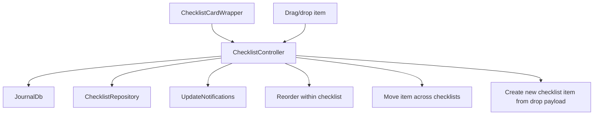
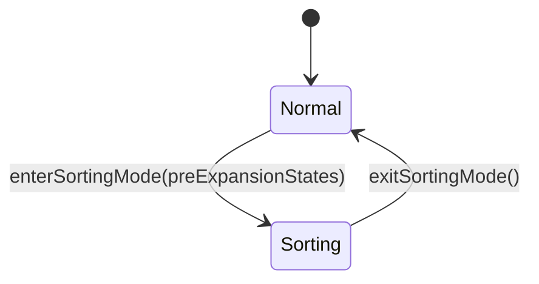

Checklists are one of the main reasons the tasks feature exists as a feature
rather than a loose set of task helper widgets.

# The runtime model

`ChecklistController` loads a checklist entity, subscribes to it and to all
linked item ids, updates title and item order, handles dropping existing and new
items into a checklist, unlinks and relinks items, and deletes the checklist —
removing its id from the parent task when possible.

When a user renames an item, `ChecklistItemController.updateTitle` fires a
fire-and-forget `correctionCaptureService.captureCorrection(...)` with the
before/after title and the item's category, and the rename surfaces an undo
affordance. **That before→after pair becomes category-scoped AI guidance** — the
the checklist feature owns the capture and undo logic.

The pending correction is task-wide UI state, so its toast has exactly one
listener at the task-details boundary: `CorrectionCaptureToastListener` sits
immediately below `TaskDetailsPage`'s nested `ScaffoldMessenger`. Individual
`ChecklistCardWrapper`s never listen for it. This keeps the undo toast inside
the detail pane on desktop, above the sticky action bar on every platform, and
prevents one provider update from being dispatched once per checklist card.

# The sorting state machine

In sorting mode checklist cards collapse, large drag handles appear, pre-sort
expansion states are stored, and widgets restore their previous expansion when
sorting ends.

# Celebration

Checking an item fires a light haptic, an `easeOutBack` checkbox pop, a spark
burst at the checkbox, and a left-to-right strike-through wipe on its title.

**The burst is fired imperatively from the tap** via `spawnCompletionBurst`, not
from the widget edge — so it still plays when checking the *last* open item
collapses the row away.

Reaching 100% blooms a soft, low-intensity glow around the card with a medium
haptic — and **no** card-wide burst, since the completing item's own checkbox
burst already carries the sparks. Marking the whole task Done fires the full
celebration on the status pill.

**Visual beats are gated** on the user's celebration switches
(`.checklistItems` for the item pop/burst, wipe and 100% glow; `.tasks` for the
task-done beat) and on system reduce-motion.

**Those switches do not silence haptics** — but a separate haptics preference
does, honoured by passing `onCelebrate: null`. Every beat fires only on the
not-done → done transition.

# The checkbox is 20×20 inside a 44×44 target

The compact visual is centred inside a 44×44 `InkWell`, clearing the Material and
WCAG touch-target minimum without enlarging the box — users with reduced motor
precision can hit the surrounding ring instead of aiming at the tiny square.

A centre tap lands on the `Checkbox` itself, keeping its native gesture and
accessibility semantics; the ring is caught by the `InkWell`. **Both route through
the row's single `applyCheck` handler**, so toggle behaviour stays in one place.

The 44 px zone draws a faint resting "well" — a `surface.enabled` fill with a
`decorative.level02` border, the same filled-and-bordered language as the metadata
chips — so **the forgiving tap area is visible at rest**. On touch there is no
hover, so a hover-only highlight left it invisible exactly where most users tap.
The `InkWell` still carries a `hoverColor` for pointer devices.

The drag-grip icon sits at a low 0.2 alpha (a long-press anywhere on the row
starts the drag), so the repeating grip texture does not compete with the checkbox
and title. **The empty checkbox draws its outline at medium emphasis / 2 px**, not
the faint low-emphasis 1.5 px it used to: an unchecked control must stay visible
against the dark card for low-vision users. That is control legibility, not the
metadata-chip emphasis tiering.

# Stale-while-revalidate rendering

The row reads `itemAsync.value` — the retained value — rather than
`itemAsync.map(loading: …)`, so a *reloading* item keeps its current state
instead of blanking to `SizedBox.shrink` for a frame. That flicker appeared when
an accepted AI suggestion updated the checklist. A genuine first mount or deletion
still collapses, and a hard load error with no prior value still surfaces an
`ErrorWidget`.

Relatedly, checklist cards are keyed by **identity** (`Key('checklist-$id-…')`,
not the list index), so inserting or reordering keeps every other card's element
and state instead of shifting indices and re-fetching.

Both checklist ids and linked-item ids **seed their existing set on first
render**; only ids arriving later play the one-shot entrance, so background
refreshes do not replay initial-load motion.

Card expansion uses **width-stable cross-fade endpoints**: the hidden endpoint
keeps the card's full horizontal constraint and collapses only height, preventing
Flutter from relaying out the outgoing body at progressively narrower widths.
Filter-empty summaries are limited to one ellipsized line, so completion and
collapse animations cannot stack individual letters under narrow or scaled
layouts.

# Checking an item off under a filter

Under the Open filter (`hideIfChecked`) or Done filter (`hideIfUnchecked`), a row
that stops matching leaves the list. It holds its completed state for 1150 ms —
long enough to read the checkmark and strike-through — then collapses over 300 ms
through `SizeFadeCollapse`.

**`SizeFadeCollapse` drives the reserved height, the paint scale *and* the opacity
from a single tween**, so the row leaves as one piece: checkbox, title, drag grip
and edit affordance all shrink by the same factor at the same instant. The scale
and height share one anchor (top-start), which keeps painted size equal to
reserved size on every frame.

**That coupling is the entire point.** A clip-based collapse — `SizeTransition`,
or an `AnimatedCrossFade` to a zero-sized second child — shrinks the *box* while
the child keeps its full layout size, so the fixed 44×44 checkbox held its
original dimensions and got sliced by the clip as the row closed around it.
`AnimatedCrossFade` compounded it: because the outgoing row stops being the sizing
child, it was re-laid-out against the zero-sized second child's constraints and
its contents jumped — measured at roughly 180 px right and 18 px down — on the
very *first* frame, before any size animation had run. The row also narrowed from
both sides under the card's loose width constraints. `SizeFadeCollapse` keeps the
box at full width and scales instead of cropping.

Reduced motion snaps the collapse. A collapsing row is `IgnorePointer`ed,
`ExcludeFocus`ed and `ExcludeSemantics`ed **as soon as it starts leaving**, so it
can neither be tapped nor announced — but its subtree keeps ticking, so an
in-flight strike-through wipe or checkbox pop is not frozen half-played.

**The collapse is reversible**: unchecking under the Open filter, or a filter flip
that makes the row match again, runs the same tween backwards.

`SizeFadeCollapse` is the exit counterpart to `SizeFadeEntrance` and lives in the
**design system**, not in checklist code.
