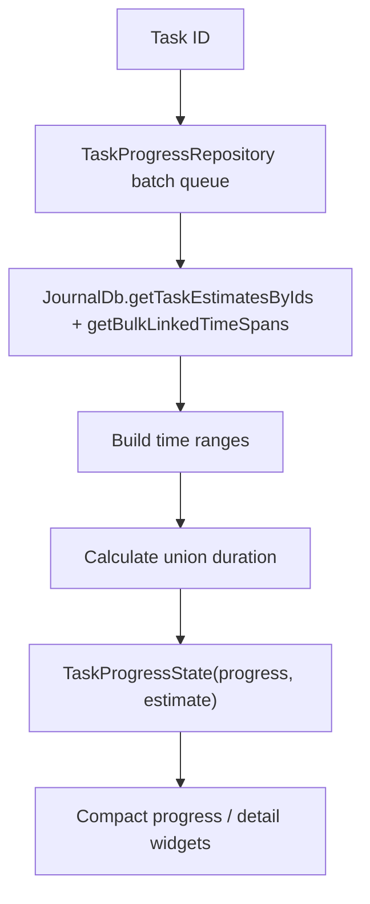

# `TaskData`

Tasks are the `Task` journal-entity variant with `TaskData`, which carries title,
status, priority, estimate, due date, checklist ids, cover-art id, language
preference, inference profile id, and AI-suppressed label ids.

**Two boundaries are deliberate:**

- **Label assignments live on entry metadata** (`meta.labelIds`), not in
  `TaskData`.
- **Project membership is resolved through the [projects](../projects.md)
  feature**, not embedded as a task field.

Checklist content is modelled separately through checklist entities and linked
checklist-item entities. That split is what allows drag, drop, reorder, export
and cross-checklist movement without flattening everything into one giant task
row.

# Pickers

The detail header routes due-date edits through `showDueDatePicker` and estimate
edits through `showEstimatePicker`:

- **Due dates** use the shared `DesignSystemCalendarPicker`, so the selected
  value includes its weekday and the month grid exposes weekday headers.
  **Today** updates the draft, **Clear** produces an explicit null result, and
  dismissal stays distinct from either.
- **Absolute due-date text** is formatted with `DateFormat.yMMMd` in the active
  Flutter locale. The persisted value remains a locale-neutral `DateTime` while a
  German, Czech or other localized surface gets its own calendar wording.
- **Estimates** use `DesignSystemDurationWheel` in the same token-backed frame
  and shared glass footer. The draft commits only when Done confirms a *changed*
  duration; Clear resets a non-zero estimate.

Both use the responsive modal contract — bottom sheet on narrow layouts, dialog
on wide — with the same surface colour inside the subtle frame in light and dark.

# Progress is computed from linked work

`TaskProgressRepository` batches progress requests across tasks and computes the
estimate, the time ranges of linked work, and the **union** duration of
meaningful spans.

It deliberately excludes `Task`, `AiResponseEntry` and `JournalAudio` from
counted work duration.

**That last exclusion matters.** Otherwise a one-hour audio recording of a
meeting would count as one hour of work even when it is just a recording
artifact — mathematically neat and practically wrong.
