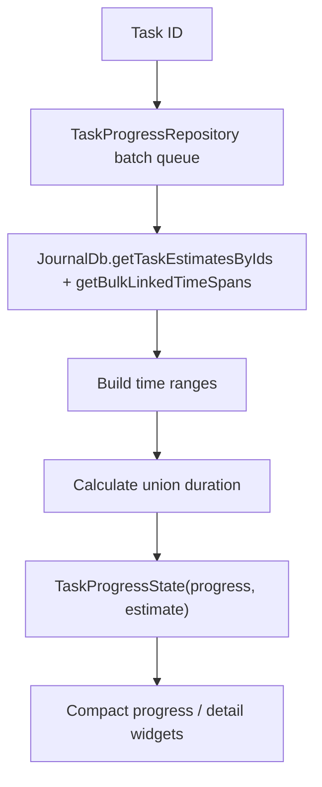

# `TaskData`

Tasks are the `Task` journal-entity variant with `TaskData`, which carries title,
status, priority, estimate, due date, checklist ids, cover-art id, language
preference, inference profile id, and AI-suppressed label ids.

# `TaskStatus` is seven states with no enforced transitions

The sealed `TaskStatus` union in `lib/classes/task.dart` has seven variants. Five
are live and two are terminal:

| | Variants |
|---|---|
| Live — `openTaskStatuses` | `open`, `groomed`, `inProgress`, `blocked`, `onHold` |
| Terminal | `done`, `rejected` |

Every variant carries `id`, `createdAt`, `utcOffset`, `timezone` and
`geolocation`; **`blocked` and `onHold` additionally require a `reason`**, and are
the only two that do. Nothing else distinguishes `done` from `rejected`
structurally, so for the terminal pair the status *is* the discriminator.

**The live/terminal split is not in the union, and it is duplicated widely.** At
least thirteen files decide "DONE and REJECTED are the closed ones" independently,
in five idioms — the exact count is not the point, the absence of a shared constant
is:

| Idiom | Where |
|-------|-------|
| The five live labels as a list | `tasks/ui/utils.dart` `openTaskStatuses` — what the linking UI filters on |
| A `{'DONE', 'REJECTED'}` set | `day_agent_capture_helpers.dart` (`isClosedTask`), `agents/tools/task_status_handler.dart` |
| Raw SQL `NOT IN ('DONE', 'REJECTED')` | `database.dart`, `database.drift`, `database_task_due_queries.dart`, `database_migration.dart` |
| A sealed-type test, `is TaskDone \|\| is TaskRejected` | `wake_run_chart_providers.dart` (`_findResolution`), `task_resolution_time_series.dart`, `task_blockers_controller.dart`, `desktop_task_header_connector.dart` |
| Prompt and tool contracts | `task_field_tool_definitions.dart`, `task_agent_prompt_builder.dart` |

**Adding an eighth status means finding all of them** — grep for both the string
pair and the type pair; there is no constant to change. The quietest to miss is the
metrics path: `_findResolution` returning null makes a wake run read as
*unresolved* rather than erroring, so a new terminal status would silently distort
the charts.

**Nothing in the code restricts which status may follow which.** There is no
transition table, no guard, and no validation — a task can go from `onHold`
straight to `inProgress`, from `done` back to `open`, and the write succeeds. So
there is deliberately no state diagram here: drawing one would invent a machine
the code does not implement.

What *is* derived rather than stored is **blockedness**, which comes from live
`blocks` links at read time and is independent of the `blocked` status value — the
two can disagree. See [typed relationships](relationships.md).

**Two boundaries are deliberate:**

- **Label assignments live on entry metadata** (`meta.labelIds`), not in
  `TaskData`.
- **Project membership is resolved through the [projects](../projects.md)
  feature**, not embedded as a task field.

Checklist content is modelled separately through checklist entities and linked
checklist-item entities. That split is what allows drag, drop, reorder, export
and cross-checklist movement without flattening everything into one giant task
row.

# Pickers

The detail header routes due-date edits through `showDueDatePicker` and estimate
edits through `showEstimatePicker`:

- **Due dates** use the shared `DesignSystemCalendarPicker`, so the selected
  value includes its weekday and the month grid exposes weekday headers.
  **Today** updates the draft, **Clear** produces an explicit null result, and
  dismissal stays distinct from either.
- **Absolute due-date text** is formatted with `DateFormat.yMMMd` in the active
  Flutter locale. The persisted value remains a locale-neutral `DateTime` while a
  German, Czech or other localized surface gets its own calendar wording.
- **Estimates** use `DesignSystemDurationWheel` in the same token-backed frame
  and shared glass footer. The draft commits only when Done confirms a *changed*
  duration; Clear resets a non-zero estimate.

Both use the responsive modal contract — bottom sheet on narrow layouts, dialog
on wide — with the same surface colour inside the subtle frame in light and dark.

# Progress is computed from linked work

`TaskProgressRepository` batches progress requests across tasks and computes the
estimate, the time ranges of linked work, and the **union** duration of
meaningful spans.

It deliberately excludes `Task`, `AiResponseEntry` and `JournalAudio` from
counted work duration.

**That last exclusion matters.** Otherwise a one-hour audio recording of a
meeting would count as one hour of work even when it is just a recording
artifact — mathematically neat and practically wrong.
