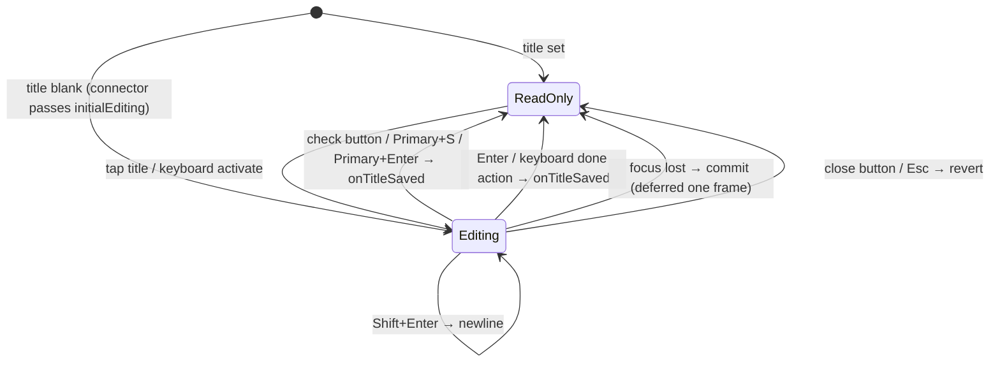
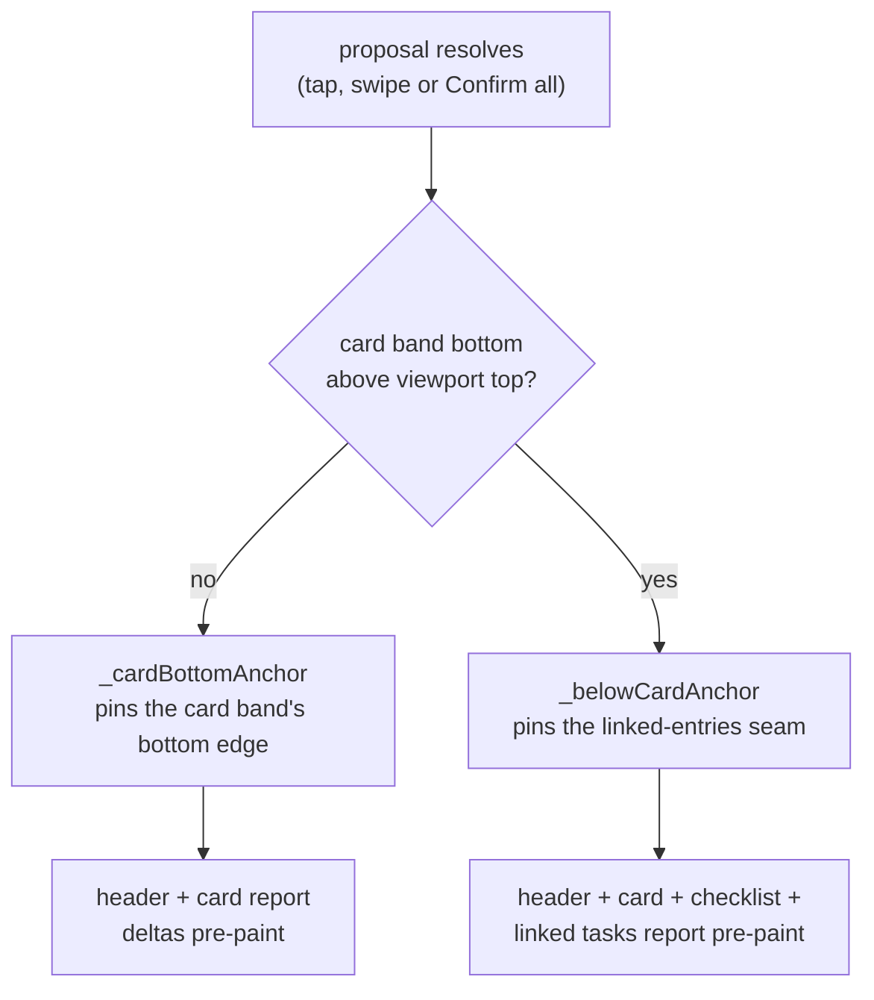

# Band order

`TaskForm` stacks the reading bands in a deliberate order: the identity header,
the optional legacy body (set off by a hairline rule and `sectionGap`), then
the `AiSummaryCard`, and finally the user's **own work** (`ChecklistsWidget`,
`LinkedTasksWidget`).

The AI card renders **directly below the header** so a reader lands on "what
is this task about and where does it stand" before scrolling into the work.
The model attribution lives only inside the card's own footer — nothing
renders a standalone attribution strip under the title.

Below the form, the dated log-entry history (linked entries plus reverse
links) sits inside an **expanded-by-default** `TaskHistorySection`: the log is
what a reader opens a task to read, so the disclosure exists to fold a long
log away, not to hide it. The page owns the expansion state, resets it per
task, and force-expands the section when a focus intent targets an entry
inside it — a collapsed section has no mounted entry keys to scroll to. On a first-run
task the section (header included) stands down entirely.

## The first-run band

A task with **no content at all** — no checklists, no body text, no agent, as
decided by `TaskFirstRunActions.isBlank` — gains one more band at the bottom:
`TaskFirstRunActions`, a single card of worded rows a `sectionGap` beneath the
header.

Order is **Write a note → Add a checklist → Record a voice note → Assign an
agent**. Writing leads because it is what a journaling app's user came to do, and
because it was the one path an empty task did not offer: `EditorWidget` renders
only for a task that *already* has entry text, so the plain-text route existed
solely behind the action bar's unlabelled overflow glyph.

All four rows are unconditional. The agent row in particular is *not* gated on a
template existing: `AgentTemplateSeeding.seedDefaults()` runs at startup, so a
fresh install already has task-agent templates, and gating on an async check
would only flash the row in and out on first paint. What a fresh install can
still be missing is an inference provider and its key — a prerequisite the
picker itself reports, not this band.

The band as a whole is conditional, by the rule **a section must not offer what
cannot happen**: it disappears the moment the task has any content, so a
returning user never meets it twice on the same task.

`watchTaskFirstRunState` decides that, and it answers in **three** states —
`unresolved`, `firstRun`, `established` — because every consequence below is
layout-bearing and both boolean guesses reflow the page a frame after it
paints. Reading unresolved as "no content" flashed the first-run offer onto a
task that has an agent; reading it as established flashed the *established*
layout onto every newly created task, which then collapsed into the first-run
one — the create-a-task flash. `TaskDetailsPage` therefore holds its loading
shell while the answer is `unresolved`, so the first content paint is the
final one.

Three answers are given without waiting, all for the same reason — a hold that
might never end is worse than a stale guess:

| Input | Answer | Why |
| --- | --- | --- |
| The task carries its own content (checklist or body text) | `established` | An agent or a linked note can only ever *add* content, so the lookups cannot change this |
| A lookup failed | `established` | An error never resolves |
| A link whose target never resolves | `established` | A dangling edge leaves the resolved count permanently short |

`watchTaskIsFirstRun` is the boolean view of the same state, for callers that
already render inside a page which held.

While this band renders, `TaskForm` passes `showAssignCta: false` to
`AiSummaryCard`: the band carries the same offer, and two "assign agent"
affordances on one screen is one too many. The AI card's own band padding also
collapses to zero in that state, so a card that renders nothing does not still
charge the page for the gaps around it.

Two composition rules follow from the block, and both live on the *page*:

- **`TaskDetailsPage` adopts the block's 520 pt measure** for the whole content
  column while it renders, so the title field, the chip lane and the block share
  one right edge. At the full reading width the three disagreed by hundreds of
  points and the only card on the page floated far left of the window's centre.
- **The first content sliver grows to at least the remaining viewport** and
  settles the group slightly above centre, so the space below reads as margin
  rather than as a page that stopped rendering. Deliberately *not*
  `SliverFillRemaining(hasScrollBody: false)`: that measures the child's
  intrinsic height, and the subtree contains `LayoutBuilder`s that cannot answer
  an intrinsic query. A `minHeight` constraint plus an `Align` composes the same
  way without ever asking, and being a floor rather than a fixed height it still
  scrolls normally at large text scales.

Row affordances say what the tap does: **`+` where the row creates something in
place** (note, checklist), **a chevron where it opens a picker** (voice note,
agent). Four identical chevrons over four different behaviours told the user
nothing — and two of those rows retire the whole card from under the finger.

**"Write a note" publishes a `TaskFocusIntent`** so the new note scrolls into
view. `EntryCreationService.createTextEntry` navigates only for an *unlinked*
entry; linked to a task it writes a row into the linked entries below and
returns, which left the row looking like a dead button that silently made an
empty note per tap.

While the block renders, `TaskActionBar` is passed `compact: true` and drops the
mic, checklist and image glyphs: those actions already have a worded home a few
centimetres higher, and two surfaces with overlapping-but-unequal membership
left users unable to tell which was the real list. An *active* recording
overrides it — the mic is the only way to stop a session in progress.

**`TaskDetailsPage` owns the content gutter, once** (`spacing.step5` on both
slivers). The header, its breadcrumb segments and the sliver each used to add a
little of their own, which put five different left edges in the top hundred
points of the page. The header now contributes vertical padding only.

`TaskDetailsPage` composes `TaskSliverAppBar` and `TaskForm`. Lifetime AI
cost, energy and CO₂e for tasks with recorded AI calls surface as the
read-only **AI spend** row in the metadata fly-out (hidden entirely for tasks
without recorded calls). An `EditorWidget` appears **only** for legacy tasks
that already have non-empty entry text.

# The header

`DesktopTaskHeaderConnector` concentrates the whole metadata band. It watches
`entryControllerProvider`, `projectForTaskProvider`, `taskOneLinerProvider` and
the labels stream, maps the task to an immutable `DesktopTaskHeaderData`, and
wires the crumb's category/project taps to the shared `TaskMetaPickers` while
every other edit routes through the metadata fly-out (`TaskMetaFlyout.show`).
When the task agent has published a one-liner, the header renders it as
complete wrapping text directly between the title and metadata. Its ink is
`aiCard.accent`, matching the AI summary card instead of neutral task metadata.

`LinkedTasksWidget` resolves every linked task's one-liner through one
`taskOneLinersProvider` batch and passes the results into both plain and typed
rows. The batch watches the shared agent-update topic, so a local or synced
report refreshes the card without one query and stream subscription per row.
When the linked-id set changes, the widget retains the last resolved taglines
for ids that remain in the card while the new batch key loads; added rows can
arrive without a subtitle, but established rows never flash back to empty.
Each compact text column lets both the title and AI subtitle wrap to their full
content. Status is carried once by the coloured leading glyph; its localized
meaning is available from the glyph tooltip on hover or long press and remains
part of the row's accessibility label, instead of consuming inline text space.

**Extended actions — share, speech modal — belong to the pinned app bar's
`more_horiz` button, not the header.** There is no ellipsis inside the header.

## Title states

**A blank title opens straight into the editor.** The connector passes
`initialEditing: data.title.trim().isEmpty`, keyed by task id so the decision is
re-made per task. Naming the task is the one thing every new task needs, and the
title was previously a read-only label whose only affordance was a hover cursor.

**ReadOnly** renders as plain text in Heading 2 Bold at 1.15 line-height, so a
wrapping multi-line title reads as one cohesive block. **The whole title is the
edit target — there is deliberately no trailing pencil glyph**, because a
persistent pencil drifted into a dead gutter beside short or wrapping titles. The
affordance is carried by the hover click-cursor, an "Edit title" `Semantics`
button, and keyboard activation. The title spans the full content width and wraps
freely; no control rides this line.

A **blank** title is the exception: it renders an imperative prompt ("Name this
task") at `text.lowEmphasis` and `w400` inside real field chrome — a
`decorative.level01` hairline on `surface.enabled`, `step4`/`step3` padding. It
used to show the same "No title" *report* the task list shows, in italic, with no
box: the largest mark on a new task's page announced an absence and offered
nothing. The lighter weight matters as much as the paler ink — at the title's own
weight, readers took the prompt for the task's actual name.

**Editing** uses the identical box with the border escalated to
`interactive.enabled`, so focusing changes colour and nothing else — no text jumps
under the caret. Its nearest `AppCommandScope` owns catalog-driven Primary+S save
and Escape cancel, so the command palette sees the same actions and platform
binding as the rest of the app.

Three rules govern getting *out* of edit mode:

- **Bare Enter commits, on every platform; Shift+Enter is the newline.** Typing a
  name and pressing Return is the most common action on this screen, and it used
  to bury a line break in the title and leave the editor open with no feedback.
  Primary+Enter and Primary+S are kept as aliases, since they were the documented
  gesture and the command palette still advertises Primary+S. The newline moves
  to Shift+Enter — a keyboard that has a Shift to press is the only one that
  wanted a multi-line title in the first place. A phone keyboard's `done` action
  commits too, since that is the control a thumb actually reaches for.
- **Losing focus commits**, deferred one frame and re-checked. Tapping the ✕ takes
  focus away *before* the cancel handler runs, so a synchronous commit would save
  the very text the user asked to discard; by the next frame `_cancelEdit` has
  cleared the flag and the listener backs off. Committing rather than discarding
  is the less surprising of the two outcomes — the text is in front of the user
  and they typed it.
- **The ✓/✕ pair stays hidden until the field differs from the title it opened
  on.** On an auto-opened blank task both would be no-ops, and an enabled-looking
  ✕ on a task the user just created reads as "delete it". The check uses
  `interactive.enabled`, not `alert.success` — that hue is the app's own *Done*
  status, and spending it here put two unrelated greens in one small box. Both
  targets are `step9` (48 pt).

## The metadata summary, the fly-out and the column

The header body is Crumb → Title → AI one-liner → Summary:

1. **Crumb** — `category / [project | No project]` separated by a literal `/`.
   No label chips here.
2. **Title** — full width, tap to edit.
3. **AI one-liner** — an optional, fully wrapping AI-accent summary. It
   preserves the last value during background refresh and grows vertically
   rather than truncating useful context.
4. **Summary** — one compact lane (`TaskMetaSummaryLine`) of informational
   read-outs plus the "Details" fly-out trigger. The trigger renders **only
   when a fly-out is on offer**: `DesktopTaskHeaderConnector` passes a null
   `onOpenDetails` where a details column already carries those rows, and the
   lane then ends at its facts.

**Without a category the crumb renders nothing at all**, and the summary lane
carries a dashed "Set category" offer (verb-form, muted shell, fully-rounded
— it is an action) that opens the category picker directly; the fly-out's
Category row covers the same edit once a category exists. The crumb segment
and the dashed offer never coexist. A project is scoped to a category —
`ProjectRepository.linkTaskToProject` refuses a cross-category link — so an
uncategorized task cannot acquire one, and the connector passes a null
`onProjectTap`; the separator and the project segment appear only once a
category is set.

**Metadata is set once and rarely changed, so it no longer wears
always-visible button-styled chrome.** The summary lane is read-outs only:
`[status] → [blocked-by?] → [priority] → [due?] → [labels?] → [AI cost?] →
[Set category?] → Details`.

**The AI cost sits in that lane, not behind a panel.** What the machine has
cost on this task is readable at the same glance as its status, through the
shared `AiCostIndicator` in its compact leaf-and-amount form. It is a fact
about the *open* task, so it lives on the detail surfaces only — the browse
list stays a list of tasks, not of invoices. It renders nothing until the task
has recorded AI
calls, so the lane is unchanged for a task that never met the machine. Its tap
opens the fly-out that holds the full breakdown; where the details column is
already mounted the connector passes the read-only form instead, for the same
reason the Details trigger stands down there. The section's own **AI spend**
row keeps the fuller cost / energy / carbon read-out — the same fact at two
densities, not two facts.
Every read-out wears `DsPillShape.tag` — the tight `radii.xs` (4) corner —
so a fact can never be mistaken for the fully-rounded filter/action pills
elsewhere on the page. The one lever in the lane, the **Details** trigger,
keeps the fully-rounded interactive pill shape. Tapping any **editable**
read-out — status, priority, due, labels — opens the same fly-out, so a tap on
the fact lands on its editor. The AI cost is the exception in both directions:
it has no editor, and its tap opens the details for the fuller reading, which
is why it stands down to a plain read-out once the column is showing them.

### One section, two hosts

`TaskMetaSection` lists every attribute as a descriptive **label + value**
row — Status, Priority, Category, Project (once a category exists), Due date,
**Estimate**, Labels, and a read-only AI spend row for tasks with recorded AI
calls. Each editable row opens its existing modal picker through the shared
`TaskMetaPickers` (also used by the crumb), and the section watches the task
so a persisted edit updates the open host immediately. The Estimate row keeps
the `{tracked} of {estimate}` read (`1h 30m of 2h`, never a clock-like
`01:30 / 02:00`) plus the small progress bar, escalating to error ink when
tracked exceeds the estimate.

The section has two hosts, and `TaskMetaDensity` is the only difference
between them:

| Host | Density | When |
| --- | --- | --- |
| `TaskMetaFlyout` (`ModalUtils.showSinglePageModal`) | `wide` — label column (`step12` = 96) beside a value column | Everywhere the column does not fit: phone, narrow pane, list pane visible |
| `TaskMetaColumn` | `narrow` — label stacked above its value | Focused task, pane ≥ `kTaskMetaColumnMinHostWidth` |

The narrow density stacks rather than narrowing the label column: at
`kTaskMetaColumnWidth` (320) a fixed 96 pt label column either starves the
values or clips a long localized label — German "Fälligkeitsdatum" does not
fit beside its own date.

### The details column

`TaskMetaColumn` is the Linear-shaped layout for a **focused** task: once the
list pane is collapsed, the freed width buys a third column rather than a
wider task. `TasksRootPage` mounts it as a peer to the task page — its own
title, a hairline left rule, and its own scroll, so glanced-at metadata does
not move when the task beside it scrolls.

Two conditions, both required:

- the list pane is collapsed **and** a task is selected — the column is the
  focus-mode layout, not a permanent fourth column; and
- the detail pane measures at least `kTaskMetaColumnMinHostWidth` (960).

The gate reads the **pane's own constraints**, not `MediaQuery`. The
navigation sidebar can be collapsed, so a window width answers the wrong
question by up to 256 points. Below the floor the metadata falls back to the
fly-out rather than squeezing the work it describes.

The pane keeps **one tree shape in every state** — always a `Row`, with the
column as an optional trailing child. Swapping between "task" and "Row(task,
column)" would rebuild `TaskDetailsPage` from scratch on every collapse,
losing its scroll position and its state.

Summary-lane treatment carries over the accessibility decisions the old pill
lanes earned:

- **The status read-out is the lane's only tinted accent** (active statuses
  keep their 18% wash; Open and Rejected use the neutral filled + bordered
  shell, Rejected struck through at medium emphasis); priority carries urgency
  via a coloured glyph; the due read-out escalates to a tinted accent only
  when due today or overdue, and reads at high emphasis otherwise.
- **The status label text stays at the high-emphasis text colour, not the
  accent** — accent-on-accent-tint fails WCAG. Its colour identity is carried
  by the translucent tinted fill plus a per-status glyph.
- **Priority spells the level out** (Urgent / High / Medium / Low) rather than
  the opaque `P2` code. The compact `P{n}` form is retained only for picker
  rows and AI-context strings.
- Neutral filled tags carry the quiet 1 px `decorative.level02` border for a
  legible boundary against the near-same-tone surface.
- **Labels compress into one read-out** — two names plus a `+N` suffix, led by
  their colour dots — instead of a lane of per-label pills; the full list
  lives in the fly-out's Labels row.
- The **blocked-by chip** (link-derived readiness, ADR 0042 §4) stays on the
  page beside the status read-out: it is an alarm, not routine metadata, and
  navigates to the blocker rather than opening the fly-out.

Spacing encodes grouping: inter-tag gaps (`step2`) are tighter than each tag's
internal padding (`step3`) so the lane reads as one anchored cluster, and
**run spacing is a step looser than the inter-tag gutter** (`step3` against
`step2`) so a wrapped lane still shows its row break. Vertically, `step4`
separates the breadcrumb from the title and a tighter `step3` bonds the title
to its metadata; the header's own bottom padding is only `step2`, because
whatever section follows brings its own leading padding.

**Nothing in the header adds horizontal inset** — not the outer padding, not the
crumb segments. The page owns the gutter (see above).

`TaskCompactAppBar` and `TaskExpandableAppBar` surface the task title in
`subtitle2` once the scroll offset passes a threshold, so the title stays visible
as the header scrolls away. Both app bars also carry a desktop-only
knowledge-graph entry point (`Icons.hub_outlined` → `TaskKnowledgeGraphPage`,
gated by `knowledgeGraphEntryPointEnabledProvider`), so the graph is one tap
from the task without competing for header space on mobile.

On desktop, list focus mode conditionally adds the restore-list overlay inside
a stable `Stack` parent. The task detail subtree never changes parent while the
list hides or returns, preserving scroll position and other local widget state.
The restore control remains distinct from Back, which continues to traverse the
linked-task detail stack. The desktop split also owns the primary search command:
invoking it from the focused detail restores the offstage list, then delegates
to the still-mounted tab to expand and focus task search on the next frame.

When the expandable app bar has cover art, the whole artwork is an interactive
image surface. A tap opens the same full-screen, zoomable viewer used by linked
image entries, including rotation, download and zoom controls. The cover uses a
task-specific Hero tag so an expanded linked image lower on the same detail page
cannot become the transition source by mistake. On a wide detail workspace the
art remains centred at the shared detail-content maximum width instead of
stretching across the whole window. Once the cover scrolls away, the compact
title renders on the toolbar's level-01 surface and therefore uses the standard
high-emphasis toolbar text token in both themes.

The header is exercised in isolation under **Widgetbook → Tasks → Desktop task
header**, whose Playground drives priority, status, category, due date, labels and
the editing flag through in-page controls — no Riverpod needed, because the
presentational widget takes plain data and emits callbacks.

# Section surfaces

Most section cards render on `TaskDetailSectionCard`: solid `background.level02`,
`radii.l`, a subtle `decorative.level01` border, **no gradient and no drop
shadow**. This matches the task-list item surface, so the detail page reads as
part of the same system. `LinkedTasksWidget` does not use the shared widget — it
replicates the same treatment inline.

**The AI Summary card is the deliberate exception.** It draws on a dedicated dark
AI surface defined in `tokens.json` under `color.aiCard.*`: a `#0E1A22`
background, a teal-at-14%-alpha border, a 14 px radius and a subtle teal outer
glow. Proposal-kind chips draw from `color.proposalKind.*` so chip colours stay
tokenized, and all accents route through `color.aiCard.accent`. **The card is
dark-only by design**, and its hex values are set up to read consistently in both
themes.

Some text styles inside the card override the base token's line-height to hit the
spec's tighter rhythm. **That gap is a documented follow-up** — the eventual fix
is a `compact` density tier in `tokens.typography.styles.*` rather than continued
call-site tuning.

# Scroll stability

`TaskDetailsPage` wraps its scroll view in `TaskScrollStabilityScope`, which has
three region-adapter modes over one `ViewportStableScrollController`:

| Adapter | Behaviour |
|---------|-----------|
| `ViewportStableAnimatedSize` | Animates generated entry text and nested AI-response height, arming only when the region is fully above the viewport |
| `ViewportStableSizeReporter` | No motion — used by the header band and the AI card band while a suggestion-resolution hold is armed, because their content already owns its own animations. Whichever edge the page pins lies *below* both bands, so their deltas are absorbed unconditionally |
| `ViewportStableSizeReporter(offscreenOnly: true)` | Wraps the checklist and linked-tasks bands, reporting only while the page armed the hold with `includeOffscreenRegions` — i.e. while the card is fully above the viewport and `_belowCardAnchor` pins the linked-entries seam. While the card is visible, a checklist or linked task growing *below* it is the visible reflow — new content appearing, only what lies under it moving |

The offscreen-only reporters **deliberately do not compute the offscreen
predicate themselves**: the page has to pick a matching `ScrollAnchor` from the
same answer, and two mechanisms deciding independently would disagree over the
padding between their reference points and then fight each frame.

## Which edge holds

The page arms exactly one post-frame `ScrollAnchor` per resolve, chosen by
whether the AI card band has scrolled fully above the viewport:

**Card visible — the card's bottom edge.** Every resolved row collapses *inside*
the card, and on a Confirm-all the rows collapse one after another from the top.
Pinning the card's bottom keeps the rows still to come, the Confirm-all rail and
everything below the card exactly where they were; the collapse is paid for above
them, by the summary sliding down into the space the rows leave. The previous
design pinned the proposals section's *top*, which sent the whole visible page
racing upwards by the collapsed height — five rows is well over half a phone
screen — because the collapsing rows sit between that edge and everything the
user is looking at. Both the off-screen predicate and this anchor read the same
edge (`_cardRegionBottomGlobal`), so the decision and the point held can never
disagree.

**Card fully above the viewport — the seam below the work bands.** The user is
reading the linked entries; the card, the checklist and the linked-tasks bands
all report so the correction lands pre-paint, and `_belowCardAnchor` catches
whatever slips past.

The two anchors are never armed together: they sit either side of the work
bands, so the correction that holds one moves the other by exactly those bands'
height change, which the other then reads as drift and undoes on the next
post-frame.

Each band carries a distinct, task-scoped `ValueKey`. `StaggeredEntrance` maps its
children through `flutter_animate`, **which does not forward their keys**, so the
column matches children positionally — without distinct keys, toggling the legacy
body band would let one band's render object, and its measured height baseline, be
reused for another and emit a bogus delta.

All adapters feed exact region-height deltas into the viewport's own layout cycle,
so **the content currently being read never paints at an intermediate displaced
position**. The scroll position also retains a temporary trailing extent when a
simultaneous shrink below the anchor would otherwise clamp the viewport; that
extent disappears once the user scrolls inside the real range. User scrolling
cancels the hold immediately, and the standalone journal-entry detail page stays
outside the scope. At the scroll origin the correction clamps: what a collapse
cannot give back above the viewport, the content below it moves up by.

What the card itself does to stay collapse-only — no unmount in a single frame
anywhere in the section — is the card's contract, in
[agent UI surfaces](../agents/ui-surfaces.md#proposal-acceptreject-motion).

## Known gap: insertions inside the below-card sliver

Both `ScrollAnchor`s pin **the top of a container** and are structurally incapable
of seeing an insertion or removal *inside* it. That is why the AI card's own
collapse needed the card band to report — and the same blindness remains one level
down: `_belowCardKey` sits on the `Center` wrapping the whole below-card column,
so it cannot see the linked-entries list change from within.

This is reachable from the agent's time-tracking proposals:
`sortedLinkedEntriesProvider` defaults to `newestFirst`, so a confirmed
`create_time_entry` or `update_time_entry` inserts at the **top** and pushes every
visible entry down.

The obvious fix — a `ViewportStableSizeReporter` around the linked-entries region
— **is unsafe as written**, because that region already contains
`ViewportStableAnimatedSize` wrappers reporting through the animated-size channel;
nesting the two would double-count every delta while a hold is armed. Two
candidate fixes, neither implemented: add nesting protection so an inner adapter
defers to an outer one, or anchor the topmost *visible entry* using the
`_entryKeys` map the page already maintains for scroll-to, which is correct under
top-insertion where a container anchor is not.

# AI integrations are consumed, not owned

The feature consumes AI-adjacent capabilities rather than owning them: the
AI-running animation wrapper, the automatic image-analysis trigger on dropped
media, AI-generated content in linked entries, and agent reports and pending
change sets displayed on task pages but generated elsewhere.

**That separation is deliberate.** The task feature owns the task experience; it
should not become a secret duplicate of the AI feature.
