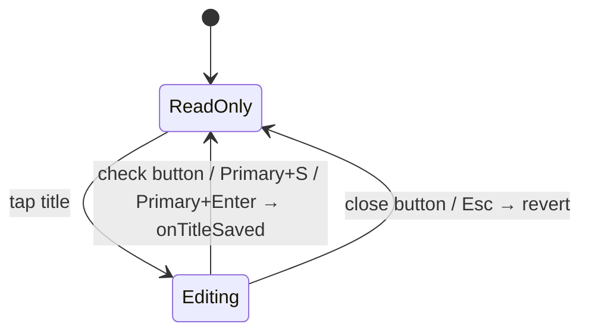

# Band order

`TaskForm` stacks the reading bands in a deliberate order: the identity header,
the optional legacy body (set off by a hairline rule and `sectionGap`), then the
user's **own work** (`ChecklistsWidget`, `LinkedTasksWidget`), and finally the
`AiSummaryCard`.

The AI card renders **below** the checklists so the user's work comes first.

`TaskDetailsPage` composes `TaskSliverAppBar`, `TaskConsumptionChip` — the AI
consumption pill in the header's meta row showing lifetime cost, energy and CO₂e
for tasks with recorded AI calls, hidden entirely otherwise — and `TaskForm`. An
`EditorWidget` appears **only** for legacy tasks that already have non-empty entry
text.

# The header

`DesktopTaskHeaderConnector` concentrates the whole metadata band. It watches
`entryControllerProvider`, `projectForTaskProvider` and the labels stream, maps
the task to an immutable `DesktopTaskHeaderData` plus a Riverpod-aware
`estimateSlot`, and forwards callbacks to the existing modal pickers.

**Extended actions — share, speech modal — belong to the pinned app bar's
`more_vert` button, not the header.** There is no ellipsis inside the header.

## Title states

**ReadOnly** renders as plain text in Heading 2 Bold at 1.15 line-height, so a
wrapping multi-line title reads as one cohesive block. **The whole title is the
edit target — there is deliberately no trailing pencil glyph**, because a
persistent pencil drifted into a dead gutter beside short or wrapping titles. The
affordance is carried by the hover click-cursor, an "Edit title" `Semantics`
button, and keyboard activation. The title spans the full content width and wraps
freely; no control rides this line.

**Editing** becomes a capsule-shaped inline `TextField` with a teal border and
external check and close buttons. Its nearest `AppCommandScope` owns
catalog-driven Primary+S save and Escape cancel, so the command palette sees the
same actions and platform binding as the rest of the app. **Enter inserts a
newline**; Primary+Enter is a control-local commit gesture.

## The two-lane meta row

The header body is Crumb → Title → Meta:

1. **Crumb** — `[category | unassigned] / [project | No project]` separated by a
   literal `/`. No label chips here.
2. **Title** — full width, tap to edit.
3. **Meta** — a two-lane column.

The **attribute lane** is a left-aligned wrap led by the status pill:
`[status] → [priority] → [due | No due date] + [estimate]`. The **label lane**
below is a second wrap of label chips or an *Add Label* placeholder.

**Status leads the attribute lane** rather than being pinned to a trailing edge,
so it has one stable home that never opens a horizontal dead zone next to a short
cluster and never gets marooned when the row wraps. Separating structured
attributes from the free-form label taxonomy keeps the "what state / when / how
big" read distinct from the user's tags.

**Due date and estimate are bonded into one inner wrap**, so a narrow viewport
breaks the lane as `status+priority` / `due+estimate` instead of stranding the
lone estimate on its own near-empty row. The inner wrap reuses the same chip gap,
so the pair looks identical to two adjacent chips on wide screens.

Chip treatment carries real accessibility decisions:

- The chips share one neutral filled shell at one height. **The status pill is the
  lane's only tinted accent**; priority carries urgency via a coloured glyph; the
  due chip escalates to a tinted accent only when due today or overdue.
- Every neutral filled chip carries a quiet 1 px `decorative.level02` border, so
  its boundary is legible against the near-same-tone surface for low-vision users.
  The status pill and an urgent due chip skip it — their fill already reads.
- **The status pill's label text stays at the high-emphasis text colour, not the
  accent** — accent-on-accent-tint fails WCAG. Its colour identity is carried by
  the translucent tinted fill plus a per-status glyph.
- **Priority spells the level out** (Urgent / High / Medium / Low) rather than the
  opaque `P2` code, so urgency direction reads at a glance. The compact `P{n}`
  form is retained only for picker rows and AI-context strings.
- **The estimate reads `{tracked} of {estimate}`** in plain duration units
  (`1h 30m of 2h`), not a clock-like `01:30 / 02:00`, which users misread as a
  time-of-day range. A tooltip spells it out.
- The label lane caps at 4 chips and collapses the remainder behind a tappable
  `+N`; expanding swaps in "Show fewer", and a label change on a new task resets
  the expansion.

Spacing encodes grouping: inter-chip gaps (`step2`) are tighter than each pill's
internal padding (`step3`) so the chips read as one anchored cluster, while a full
`step4` context break sets the two lanes apart. Vertically, `step4` separates the
breadcrumb from the title and a tighter `step3` bonds the title to its metadata,
so title plus chips read as one unit.

`TaskCompactAppBar` and `TaskExpandableAppBar` surface the task title in
`subtitle2` once the scroll offset passes a threshold, so the title stays visible
as the header scrolls away.

The header is exercised in isolation under **Widgetbook → Tasks → Desktop task
header**, whose Playground drives priority, status, category, due date, labels and
the editing flag through in-page controls — no Riverpod needed, because the
presentational widget takes plain data and emits callbacks.

# Section surfaces

Most section cards render on `TaskDetailSectionCard`: solid `background.level02`,
`radii.l`, a subtle `decorative.level01` border, **no gradient and no drop
shadow**. This matches the task-list item surface, so the detail page reads as
part of the same system. `LinkedTasksWidget` does not use the shared widget — it
replicates the same treatment inline.

**The AI Summary card is the deliberate exception.** It draws on a dedicated dark
AI surface defined in `tokens.json` under `color.aiCard.*`: a `#0E1A22`
background, a teal-at-14%-alpha border, a 14 px radius and a subtle teal outer
glow. Proposal-kind chips draw from `color.proposalKind.*` so chip colours stay
tokenized, and all accents route through `color.aiCard.accent`. **The card is
dark-only by design**, and its hex values are set up to read consistently in both
themes.

Some text styles inside the card override the base token's line-height to hit the
spec's tighter rhythm. **That gap is a documented follow-up** — the eventual fix
is a `compact` density tier in `tokens.typography.styles.*` rather than continued
call-site tuning.

# Scroll stability

`TaskDetailsPage` wraps its scroll view in `TaskScrollStabilityScope`, which has
three region-adapter modes over one `ViewportStableScrollController`:

| Adapter | Behaviour |
|---------|-----------|
| `ViewportStableAnimatedSize` | Animates generated entry text and nested AI-response height, arming only when the region is fully above the viewport |
| `ViewportStableSizeReporter` | No motion — used by the header, checklist and linked-tasks bands while a suggestion-resolution hold is armed, because their content already owns its own entrance and completion animations |
| `ViewportStableSizeReporter(offscreenOnly: true)` | Wraps the AI card band, reporting only while the page armed the hold with `includeOffscreenRegions` |

The third **deliberately does not compute the offscreen predicate itself**: the
page has to pick a matching `ScrollAnchor` from the same answer, and two
mechanisms deciding independently would disagree over the padding between their
reference points and then fight each frame.

Each band carries a distinct, task-scoped `ValueKey`. `StaggeredEntrance` maps its
children through `flutter_animate`, **which does not forward their keys**, so the
column matches children positionally — without distinct keys, toggling the legacy
body band would let one band's render object, and its measured height baseline, be
reused for another and emit a bogus delta.

All adapters feed exact region-height deltas into the viewport's own layout cycle,
so **the content currently being read never paints at an intermediate displaced
position**. The scroll position also retains a temporary trailing extent when a
simultaneous shrink below the anchor would otherwise clamp the viewport; that
extent disappears once the user scrolls inside the real range. User scrolling
cancels the hold immediately, and the standalone journal-entry detail page stays
outside the scope.

## Known gap: insertions inside the below-card sliver

Both `ScrollAnchor`s pin **the top of a container** and are structurally incapable
of seeing an insertion or removal *inside* it. That is why the AI card's own
collapse needed the card band to report — and the same blindness remains one level
down: `_belowCardKey` sits on the `Center` wrapping the whole below-card column,
so it cannot see the linked-entries list change from within.

This is reachable from the agent's time-tracking proposals:
`sortedLinkedEntriesProvider` defaults to `newestFirst`, so a confirmed
`create_time_entry` or `update_time_entry` inserts at the **top** and pushes every
visible entry down.

The obvious fix — a `ViewportStableSizeReporter` around the linked-entries region
— **is unsafe as written**, because that region already contains
`ViewportStableAnimatedSize` wrappers reporting through the animated-size channel;
nesting the two would double-count every delta while a hold is armed. Two
candidate fixes, neither implemented: add nesting protection so an inner adapter
defers to an outer one, or anchor the topmost *visible entry* using the
`_entryKeys` map the page already maintains for scroll-to, which is correct under
top-insertion where a container anchor is not.

# AI integrations are consumed, not owned

The feature consumes AI-adjacent capabilities rather than owning them: the
AI-running animation wrapper, the automatic image-analysis trigger on dropped
media, AI-generated content in linked entries, and agent reports and pending
change sets displayed on task pages but generated elsewhere.

**That separation is deliberate.** The task feature owns the task experience; it
should not become a secret duplicate of the AI feature.
