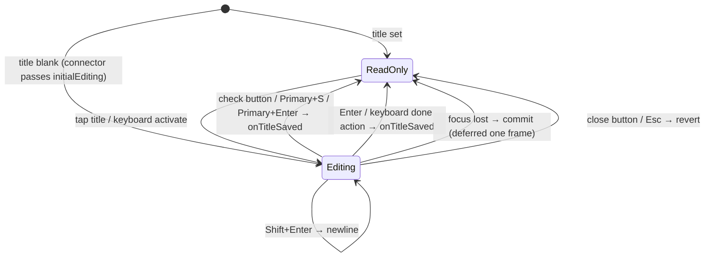

# Band order

`TaskForm` stacks the reading bands in a deliberate order: the identity header,
the optional legacy body (set off by a hairline rule and `sectionGap`), then the
user's **own work** (`ChecklistsWidget`, `LinkedTasksWidget`), and finally the
`AiSummaryCard`.

The AI card renders **below** the checklists so the user's work comes first.

## The first-run band

A task with **no content at all** — no checklists, no body text, no agent, as
decided by `TaskFirstRunActions.isBlank` — gains one more band below the AI card:
`TaskFirstRunActions`, a single card of worded rows a `sectionGap` beneath the
header.

Order is **Write a note → Add a checklist → Record a voice note → Assign an
agent**. Writing leads because it is what a journaling app's user came to do, and
because it was the one path an empty task did not offer: `EditorWidget` renders
only for a task that *already* has entry text, so the plain-text route existed
solely behind the action bar's unlabelled overflow glyph.

All four rows are unconditional. The agent row in particular is *not* gated on a
template existing: `AgentTemplateSeeding.seedDefaults()` runs at startup, so a
fresh install already has task-agent templates, and gating on an async check
would only flash the row in and out on first paint. What a fresh install can
still be missing is an inference provider and its key — a prerequisite the
picker itself reports, not this band.

The band as a whole is conditional, by the rule **a section must not offer what
cannot happen**: it disappears the moment the task has any content, so a
returning user never meets it twice on the same task. `watchTaskIsFirstRun`
decides that, and treats an unresolved provider as *unknown*, not as "no
content" — otherwise a task with an agent flashes the offer before the database
answers.

While this band renders, `TaskForm` passes `showAssignCta: false` to
`AiSummaryCard`: the band carries the same offer, and two "assign agent"
affordances on one screen is one too many. The AI card's own band padding also
collapses to zero in that state, so a card that renders nothing does not still
charge the page for the gaps around it.

Two composition rules follow from the block, and both live on the *page*:

- **`TaskDetailsPage` adopts the block's 520 pt measure** for the whole content
  column while it renders, so the title field, the chip lane and the block share
  one right edge. At the full reading width the three disagreed by hundreds of
  points and the only card on the page floated far left of the window's centre.
- **The first content sliver grows to at least the remaining viewport** and
  settles the group slightly above centre, so the space below reads as margin
  rather than as a page that stopped rendering. Deliberately *not*
  `SliverFillRemaining(hasScrollBody: false)`: that measures the child's
  intrinsic height, and the subtree contains `LayoutBuilder`s that cannot answer
  an intrinsic query. A `minHeight` constraint plus an `Align` composes the same
  way without ever asking, and being a floor rather than a fixed height it still
  scrolls normally at large text scales.

Row affordances say what the tap does: **`+` where the row creates something in
place** (note, checklist), **a chevron where it opens a picker** (voice note,
agent). Four identical chevrons over four different behaviours told the user
nothing — and two of those rows retire the whole card from under the finger.

**"Write a note" publishes a `TaskFocusIntent`** so the new note scrolls into
view. `EntryCreationService.createTextEntry` navigates only for an *unlinked*
entry; linked to a task it writes a row into the linked entries below and
returns, which left the row looking like a dead button that silently made an
empty note per tap.

While the block renders, `TaskActionBar` is passed `compact: true` and drops the
mic, checklist and image glyphs: those actions already have a worded home a few
centimetres higher, and two surfaces with overlapping-but-unequal membership
left users unable to tell which was the real list. An *active* recording
overrides it — the mic is the only way to stop a session in progress.

**`TaskDetailsPage` owns the content gutter, once** (`spacing.step5` on both
slivers). The header, its breadcrumb segments and the sliver each used to add a
little of their own, which put five different left edges in the top hundred
points of the page. The header now contributes vertical padding only.

`TaskDetailsPage` composes `TaskSliverAppBar`, `TaskConsumptionChip` — the AI
consumption pill in the header's meta row showing lifetime cost, energy and CO₂e
for tasks with recorded AI calls, hidden entirely otherwise — and `TaskForm`. An
`EditorWidget` appears **only** for legacy tasks that already have non-empty entry
text.

# The header

`DesktopTaskHeaderConnector` concentrates the whole metadata band. It watches
`entryControllerProvider`, `projectForTaskProvider`, `taskOneLinerProvider` and
the labels stream, maps the task to an immutable `DesktopTaskHeaderData` plus a
Riverpod-aware `estimateSlot`, and forwards callbacks to the existing modal
pickers. When the task agent has published a one-liner, the header renders it as
complete wrapping text directly between the title and metadata. Its ink is
`aiCard.accent`, matching the AI summary card instead of neutral task metadata.

`LinkedTasksWidget` resolves every linked task's one-liner through one
`taskOneLinersProvider` batch and passes the results into both plain and typed
rows. The batch watches the shared agent-update topic, so a local or synced
report refreshes the card without one query and stream subscription per row.
When the linked-id set changes, the widget retains the last resolved taglines
for ids that remain in the card while the new batch key loads; added rows can
arrive without a subtitle, but established rows never flash back to empty.
Each compact text column lets both the title and AI subtitle wrap to their full
content. Status is carried once by the coloured leading glyph; its localized
meaning is available from the glyph tooltip on hover or long press and remains
part of the row's accessibility label, instead of consuming inline text space.

**Extended actions — share, speech modal — belong to the pinned app bar's
`more_horiz` button, not the header.** There is no ellipsis inside the header.

## Title states

**A blank title opens straight into the editor.** The connector passes
`initialEditing: data.title.trim().isEmpty`, keyed by task id so the decision is
re-made per task. Naming the task is the one thing every new task needs, and the
title was previously a read-only label whose only affordance was a hover cursor.

**ReadOnly** renders as plain text in Heading 2 Bold at 1.15 line-height, so a
wrapping multi-line title reads as one cohesive block. **The whole title is the
edit target — there is deliberately no trailing pencil glyph**, because a
persistent pencil drifted into a dead gutter beside short or wrapping titles. The
affordance is carried by the hover click-cursor, an "Edit title" `Semantics`
button, and keyboard activation. The title spans the full content width and wraps
freely; no control rides this line.

A **blank** title is the exception: it renders an imperative prompt ("Name this
task") at `text.lowEmphasis` and `w400` inside real field chrome — a
`decorative.level01` hairline on `surface.enabled`, `step4`/`step3` padding. It
used to show the same "No title" *report* the task list shows, in italic, with no
box: the largest mark on a new task's page announced an absence and offered
nothing. The lighter weight matters as much as the paler ink — at the title's own
weight, readers took the prompt for the task's actual name.

**Editing** uses the identical box with the border escalated to
`interactive.enabled`, so focusing changes colour and nothing else — no text jumps
under the caret. Its nearest `AppCommandScope` owns catalog-driven Primary+S save
and Escape cancel, so the command palette sees the same actions and platform
binding as the rest of the app.

Three rules govern getting *out* of edit mode:

- **Bare Enter commits, on every platform; Shift+Enter is the newline.** Typing a
  name and pressing Return is the most common action on this screen, and it used
  to bury a line break in the title and leave the editor open with no feedback.
  Primary+Enter and Primary+S are kept as aliases, since they were the documented
  gesture and the command palette still advertises Primary+S. The newline moves
  to Shift+Enter — a keyboard that has a Shift to press is the only one that
  wanted a multi-line title in the first place. A phone keyboard's `done` action
  commits too, since that is the control a thumb actually reaches for.
- **Losing focus commits**, deferred one frame and re-checked. Tapping the ✕ takes
  focus away *before* the cancel handler runs, so a synchronous commit would save
  the very text the user asked to discard; by the next frame `_cancelEdit` has
  cleared the flag and the listener backs off. Committing rather than discarding
  is the less surprising of the two outcomes — the text is in front of the user
  and they typed it.
- **The ✓/✕ pair stays hidden until the field differs from the title it opened
  on.** On an auto-opened blank task both would be no-ops, and an enabled-looking
  ✕ on a task the user just created reads as "delete it". The check uses
  `interactive.enabled`, not `alert.success` — that hue is the app's own *Done*
  status, and spending it here put two unrelated greens in one small box. Both
  targets are `step9` (48 pt).

## The two-lane meta row

The header body is Crumb → Title → AI one-liner → Meta:

1. **Crumb** — `category / [project | No project]` separated by a literal `/`.
   No label chips here.
2. **Title** — full width, tap to edit.
3. **AI one-liner** — an optional, fully wrapping AI-accent summary. It
   preserves the last value during background refresh and grows vertically
   rather than truncating useful context.
4. **Meta** — a two-lane column.

**Without a category the crumb is one segment: `No category`.** A project is
scoped to a category — `ProjectRepository.linkTaskToProject` refuses a
cross-category link — so an uncategorized task cannot acquire one, and the
connector passes a null `onProjectTap`. Rendering the separator and a
`No project` placeholder there offered a choice that could not be made; the
separator and the project segment appear only once a category is set.

The **attribute lane** is a left-aligned wrap led by the status pill:
`[status] → [priority] → [due | No due date] + [estimate]`. The **label lane**
below is a second wrap of label chips or an *Add Label* placeholder.

**Status leads the attribute lane** rather than being pinned to a trailing edge,
so it has one stable home that never opens a horizontal dead zone next to a short
cluster and never gets marooned when the row wraps. Separating structured
attributes from the free-form label taxonomy keeps the "what state / when / how
big" read distinct from the user's tags.

**Every attribute is its own wrap unit.** The due date and estimate used to be
bonded into one inner wrap so the estimate could not strand alone — but the pair
was wide enough on a phone that *both* dropped to a second row while half the
first row sat empty, burying the due date, which is the lane's second-most
decision-relevant chip after status. Unbonded, a narrow viewport breaks the lane
as `status+priority+due` / `estimate…`, and the estimate travels with whatever
follows it rather than alone.

Chip treatment carries real accessibility decisions:

- The chips share one neutral filled shell at one height. **The status pill is the
  lane's only tinted accent**; priority carries urgency via a coloured glyph; the
  due chip escalates to a tinted accent only when due today or overdue.
- Every neutral filled chip carries a quiet 1 px `decorative.level02` border, so
  its boundary is legible against the near-same-tone surface for low-vision users.
  The status pill and an urgent due chip skip it — their fill already reads.
- **Unset chips are not italicised.** `DsPillVariant.muted`'s dashed border and
  low-emphasis ink already say "unset" twice; the slant added a third signal that
  read as *disabled* rather than *empty*, on exactly the chips a user most needs
  to fill in — and a 12 pt italic caption is a real legibility failure at large
  accessibility text sizes. The unset breadcrumb dropped its italics for the same
  reason.
- **The priority glyph is tinted from the palette**, like the status glyph. The
  SVG assets bake the *dark* theme's alert hues, so an untinted glyph painted the
  dark palette onto the light screen — the only un-themed ink on the page, and a
  hue collision with the Groomed status.
- **The status pill's label text stays at the high-emphasis text colour, not the
  accent** — accent-on-accent-tint fails WCAG. Its colour identity is carried by
  the translucent tinted fill plus a per-status glyph.
- **Priority spells the level out** (Urgent / High / Medium / Low) rather than the
  opaque `P2` code, so urgency direction reads at a glance. The compact `P{n}`
  form is retained only for picker rows and AI-context strings.
- **Set reads at high emphasis, unset at medium.** A set priority used to ink
  identically to the unset chips beside it, so the lane's two shells stopped
  meaning "set" and "unset" at all.
- **Unset chips speak verbs** — *Set due date*, *Add estimate*, *Add label* —
  not statements of fact. "No due date" was read as a label describing the task
  rather than a control offering to fix it, so it was never tapped.
- **An unset category swatch is a hollow ring**, not a solid fill. A grey square
  asserted a colour the task did not have, and it was the first and loudest ink
  on the page standing for an absence.
- **The estimate reads `{tracked} of {estimate}`** in plain duration units
  (`1h 30m of 2h`), not a clock-like `01:30 / 02:00`, which users misread as a
  time-of-day range. A tooltip spells it out.
- The label lane caps at 4 chips and collapses the remainder behind a tappable
  `+N`; expanding swaps in "Show fewer", and a label change on a new task resets
  the expansion.

Spacing encodes grouping: inter-chip gaps (`step2`) are tighter than each pill's
internal padding (`step3`) so the chips read as one anchored cluster, while a full
`step4` context break sets the two lanes apart. **Run spacing is a step looser
than the inter-chip gutter** (`step3` against `step2`): reusing one value for both
axes put wrapped rows closer together than the chips inside a row, so a two-row
lane read as one crowded slab. Vertically, `step4` separates the breadcrumb from
the title and a tighter `step3` bonds the title to its metadata, so title plus
chips read as one unit; the header's own bottom padding is only `step2`, because
whatever section follows brings its own leading padding.

**Nothing in the header adds horizontal inset** — not the outer padding, not the
crumb segments. The page owns the gutter (see above).

`TaskCompactAppBar` and `TaskExpandableAppBar` surface the task title in
`subtitle2` once the scroll offset passes a threshold, so the title stays visible
as the header scrolls away. Both app bars also carry a desktop-only
knowledge-graph entry point (`Icons.hub_outlined` → `TaskKnowledgeGraphPage`,
gated by `knowledgeGraphEntryPointEnabledProvider`), so the graph is one tap
from the task without competing for header space on mobile.

On desktop, list focus mode conditionally adds the restore-list overlay inside
a stable `Stack` parent. The task detail subtree never changes parent while the
list hides or returns, preserving scroll position and other local widget state.
The restore control remains distinct from Back, which continues to traverse the
linked-task detail stack. The desktop split also owns the primary search command:
invoking it from the focused detail restores the offstage list, then delegates
to the still-mounted tab to expand and focus task search on the next frame.

When the expandable app bar has cover art, the whole artwork is an interactive
image surface. A tap opens the same full-screen, zoomable viewer used by linked
image entries, including rotation, download and zoom controls. The cover uses a
task-specific Hero tag so an expanded linked image lower on the same detail page
cannot become the transition source by mistake. On a wide detail workspace the
art remains centred at the shared detail-content maximum width instead of
stretching across the whole window. Once the cover scrolls away, the compact
title renders on the toolbar's level-01 surface and therefore uses the standard
high-emphasis toolbar text token in both themes.

The header is exercised in isolation under **Widgetbook → Tasks → Desktop task
header**, whose Playground drives priority, status, category, due date, labels and
the editing flag through in-page controls — no Riverpod needed, because the
presentational widget takes plain data and emits callbacks.

# Section surfaces

Most section cards render on `TaskDetailSectionCard`: solid `background.level02`,
`radii.l`, a subtle `decorative.level01` border, **no gradient and no drop
shadow**. This matches the task-list item surface, so the detail page reads as
part of the same system. `LinkedTasksWidget` does not use the shared widget — it
replicates the same treatment inline.

**The AI Summary card is the deliberate exception.** It draws on a dedicated dark
AI surface defined in `tokens.json` under `color.aiCard.*`: a `#0E1A22`
background, a teal-at-14%-alpha border, a 14 px radius and a subtle teal outer
glow. Proposal-kind chips draw from `color.proposalKind.*` so chip colours stay
tokenized, and all accents route through `color.aiCard.accent`. **The card is
dark-only by design**, and its hex values are set up to read consistently in both
themes.

Some text styles inside the card override the base token's line-height to hit the
spec's tighter rhythm. **That gap is a documented follow-up** — the eventual fix
is a `compact` density tier in `tokens.typography.styles.*` rather than continued
call-site tuning.

# Scroll stability

`TaskDetailsPage` wraps its scroll view in `TaskScrollStabilityScope`, which has
three region-adapter modes over one `ViewportStableScrollController`:

| Adapter | Behaviour |
|---------|-----------|
| `ViewportStableAnimatedSize` | Animates generated entry text and nested AI-response height, arming only when the region is fully above the viewport |
| `ViewportStableSizeReporter` | No motion — used by the header, checklist and linked-tasks bands while a suggestion-resolution hold is armed, because their content already owns its own entrance and completion animations |
| `ViewportStableSizeReporter(offscreenOnly: true)` | Wraps the AI card band, reporting only while the page armed the hold with `includeOffscreenRegions` |

The third **deliberately does not compute the offscreen predicate itself**: the
page has to pick a matching `ScrollAnchor` from the same answer, and two
mechanisms deciding independently would disagree over the padding between their
reference points and then fight each frame.

Each band carries a distinct, task-scoped `ValueKey`. `StaggeredEntrance` maps its
children through `flutter_animate`, **which does not forward their keys**, so the
column matches children positionally — without distinct keys, toggling the legacy
body band would let one band's render object, and its measured height baseline, be
reused for another and emit a bogus delta.

All adapters feed exact region-height deltas into the viewport's own layout cycle,
so **the content currently being read never paints at an intermediate displaced
position**. The scroll position also retains a temporary trailing extent when a
simultaneous shrink below the anchor would otherwise clamp the viewport; that
extent disappears once the user scrolls inside the real range. User scrolling
cancels the hold immediately, and the standalone journal-entry detail page stays
outside the scope.

## Known gap: insertions inside the below-card sliver

Both `ScrollAnchor`s pin **the top of a container** and are structurally incapable
of seeing an insertion or removal *inside* it. That is why the AI card's own
collapse needed the card band to report — and the same blindness remains one level
down: `_belowCardKey` sits on the `Center` wrapping the whole below-card column,
so it cannot see the linked-entries list change from within.

This is reachable from the agent's time-tracking proposals:
`sortedLinkedEntriesProvider` defaults to `newestFirst`, so a confirmed
`create_time_entry` or `update_time_entry` inserts at the **top** and pushes every
visible entry down.

The obvious fix — a `ViewportStableSizeReporter` around the linked-entries region
— **is unsafe as written**, because that region already contains
`ViewportStableAnimatedSize` wrappers reporting through the animated-size channel;
nesting the two would double-count every delta while a hold is armed. Two
candidate fixes, neither implemented: add nesting protection so an inner adapter
defers to an outer one, or anchor the topmost *visible entry* using the
`_entryKeys` map the page already maintains for scroll-to, which is correct under
top-insertion where a container anchor is not.

# AI integrations are consumed, not owned

The feature consumes AI-adjacent capabilities rather than owning them: the
AI-running animation wrapper, the automatic image-analysis trigger on dropped
media, AI-generated content in linked entries, and agent reports and pending
change sets displayed on task pages but generated elsewhere.

**That separation is deliberate.** The task feature owns the task experience; it
should not become a secret duplicate of the AI feature.
