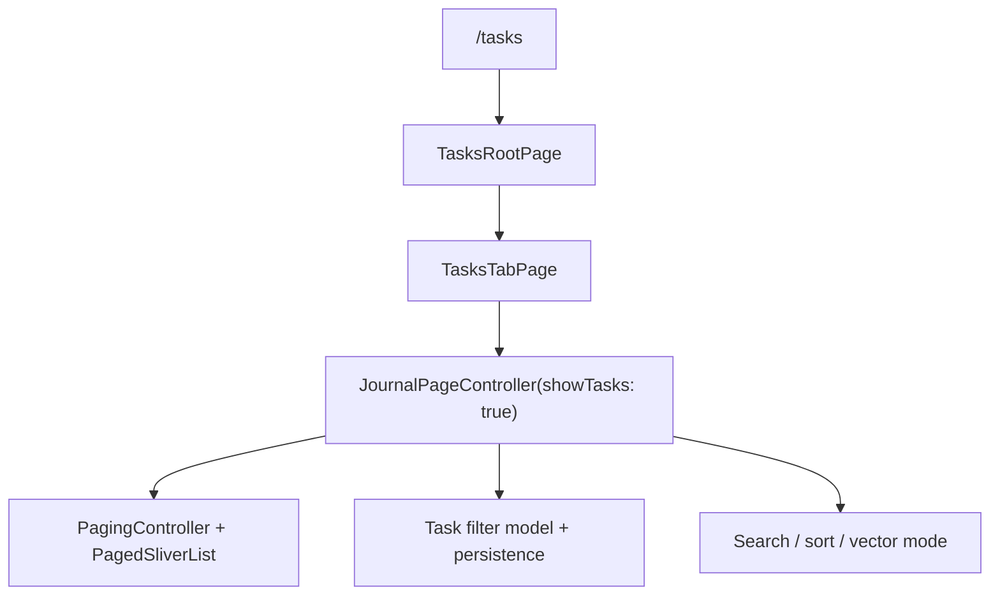
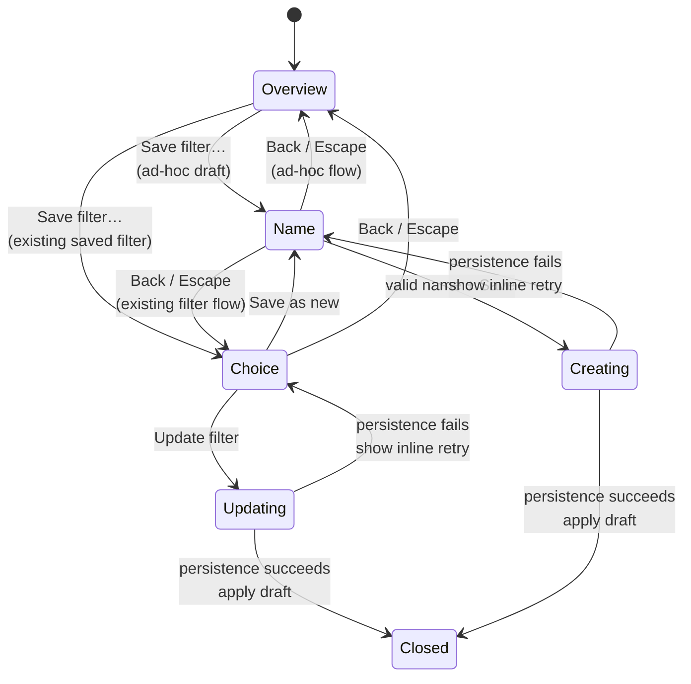
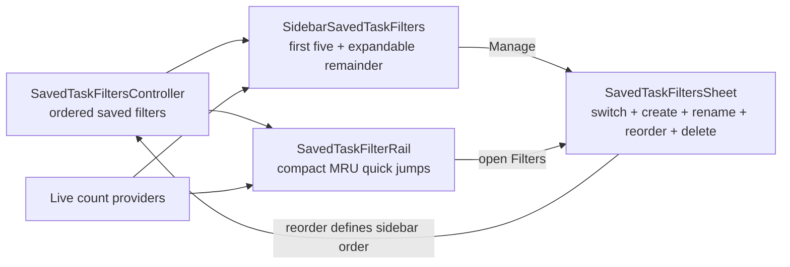
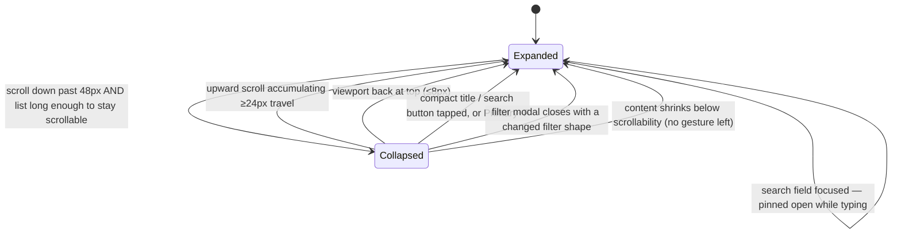
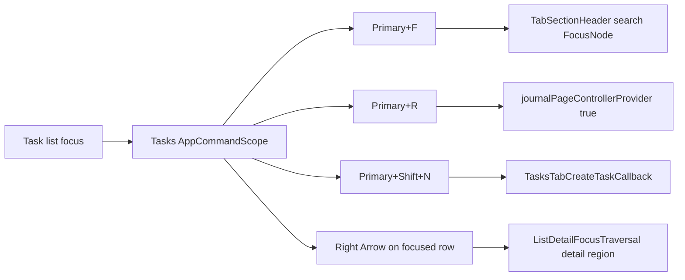

# The query stack is shared

`TasksTabPage` owns **no** pagination, query execution or filter semantics — it
transforms the already-loaded visible slice into section presentation metadata,
so the tab keeps handling thousands of rows.

Grouping is sort-dependent: due-date sort produces `Due Today` / `Due Tomorrow` /
`Due Yesterday` / dated buckets / `No due date`; priority sort produces `P0`–`P3`
buckets; creation-date sort produces creation-day buckets.

# The filter modal

The filter button opens **one** adaptive `showDesignSystemFilterModal` route — a
bottom sheet on compact layouts, a dialog on wide. The overview and its status,
category, label and project pages **share one mutable draft**, so navigating
deeper never stacks another modal. Child pages return with Back or Done; Apply and
Save remain overview actions. The transition coordinates the content fade with the
Wolt page-size animation, and returning **restores keyboard focus to the field
that opened the child page**.

Project choices use a **stale-while-revalidate catalog**: the route opens from the
last snapshot immediately, refreshes after its first frame, and updates the draft
without replacing established content with a loading shell. Category grouping and
the project search field stay available when the first snapshot is empty. Each
project row contains only its title, because the category heading already supplies
that context.

At compact breakpoints the overview reserves token-backed scroll clearance for its
sticky action bar, **including a larger allowance at 200% text**, so the final
display toggle can move fully above the footer.

## Persisted concerns

Selected statuses, priorities, labels, categories and projects; sort option;
due-date, creation-date, cover-art, projects-header and distance display; and the
agent-assignment filter.

Persistence uses `TASKS_CATEGORY_FILTERS`, keeping tasks-tab filter state
**separate from the journal tab** while sharing semantics and controller methods
via `JournalPageController`.

Active status, category, label and project clauses are shown only by the removable
filter-chip row. **Empty category or label ids render as the localized
*Unassigned* chip** rather than disappearing.

# Saved filters

Saved task filters are **task-local secondary navigation**. Desktop places them
under the active Tasks destination so important queues and their counts stay
visible while the task pane stays dedicated to search, active clauses and results.
Mobile keeps a compact rail above the list because it has no persistent sidebar.

**A matched saved filter replaces its underlying removable clause chips**; those
chips remain visible only for an ad-hoc `Custom` filter.

## The model

- **`SavedTaskFilter`** (`{id, name, filter: TasksFilter}`) is a Freezed
  JSON-serializable model. **The ephemeral `match` (search text) field is
  deliberately not part of the saved payload** — it stays on live page state and
  is preserved across activations.
- **`SavedTaskFiltersPersistence`** writes the ordered list as a single JSON blob
  to `SettingsDb` under `SAVED_TASK_FILTERS`. **Position in the list is the sort
  order.**
- **`savedTaskFiltersControllerProvider`** (`keepAlive: true` async notifier)
  exposes `create`, `rename`, `updateFilter`, `delete`, `reorder`; each mutation
  persists.
- **`SavedTaskFilterActivator`** applies a filter to the live controller via
  `applyBatchFilterUpdate`, and `clearToDefault()` resets every clause while
  **preserving the search query**.

Two derived providers wire the UI to live state:

- `currentSavedTaskFilterIdProvider` — the id whose persisted shape matches the
  live filter, ignoring display-only fields, or `null`.
- `tasksFilterHasUnsavedClausesProvider` — true when the live filter has clauses
  but matches nothing saved, letting navigation distinguish an ad-hoc **Custom**
  from **All tasks**. The filter modal does **not** use this live-state provider
  for its Save button; it evaluates the route-scoped draft so availability updates
  immediately as the user edits.

Both derive the live snapshot via the top-level helper
`liveTasksFilterFor(JournalPageState)` — there is no `liveTasksFilterProvider`.

## Counts

`savedTaskFilterCountsProvider` fans out **one `repo.count` per saved filter**,
recomputed on `taskNotification`. Because each recompute is one query per filter,
notification-driven invalidations are **debounced 300 ms** so a sync burst —
already coalesced upstream into ~1 s/100 ms batches — collapses into a single
recompute. **The initial computation is never debounced.**

`allTasksTotalCountProvider` and `currentTasksFilterCountProvider` share the same
repository and debounce wiring. The latter additionally **expands an empty status
selection to every status** before counting, mirroring how the live list treats
"no status filter" as "all statuses", so the Custom pill's number agrees with the
list.

## The save flow

**Save is another page in the existing Wolt route** — never an anchored popup or
second modal. An ad-hoc draft moves directly to a focused name page; a draft
opened from an existing saved filter first presents two explicit operations:
*Update filter* changes clauses without renaming, *Save as new* preserves the
existing filter.

**Persistence must succeed before the route applies the draft and closes.**
Failures remain inline on the current page for retry.

## Surfaces

- **`SidebarSavedTaskFilters`** renders `All tasks` plus the first five saved
  filters in persisted order, each with a live trailing count. *More* expands the
  remainder in place. **There is no pin property, expansion cap, or second
  priority model.** The enclosing navigation column scrolls, so an expanded
  collection can use as much vertical space as the user chooses while Settings,
  activity and sync stay pinned.
- Labels and counts use the caption token. Counts retain **tabular figures**, show
  `0` at low emphasis, cap at `999+`, and read stale `AsyncValue.value` during
  background refresh instead of flashing a placeholder. Category colours are a
  leading dot **and** category names are in semantics, so meaning is never
  colour-only.
- **`SavedTaskFilterRail`** is the mobile entry surface: the Filters disclosure,
  `All`, the current saved/custom filter, width-permitting MRU quick jumps, and
  `Save filter` for an ad-hoc filter. Large text keeps the current anchor and
  reset in one horizontally scrollable run. **Mobile MRU state is in-memory and
  per-device** — it does not alter desktop order.
- **`SavedTaskFiltersSheet`** is the complete switcher and manager. Normal rows
  are single-select ≥48dp targets with live counts and **multi-channel selection**
  (selected surface, radio, bold name). Edit mode replaces selection controls with
  a ≥48dp drag handle plus rename/delete while retaining a small active-status
  dot. **Deleting the active filter resets the live query to `All`.**

The redesigned browse page preserves the existing non-filter behaviour:
pull-to-refresh, the full-text versus vector search toggle, the create-task FAB
and auto-assign flow, and `/tasks/:taskId` navigation on row selection.

# The header collapses on scroll in narrow panes

Whenever the pane hosting the list is narrower than `kDesktopBreakpoint` — a
phone, a narrowed desktop window, or the desktop split view's ~400px list pane
(the gate is the pane's own `LayoutBuilder` width, not the window's) — the
header stack above the list — `TabSectionHeader` (title + search), the
saved-filter rail, and the active-filter chip row — folds into a one-row
compact bar while the user scrolls down, and unfolds on a deliberate upward
scroll. The mechanism lives in
`lib/features/tasks/ui/widgets/collapsing_task_list_header.dart`:
`TaskListHeaderCollapseController` is a pure, widget-free state machine fed by
the page's scroll listener (mirroring how the task-details page feeds its offset
into `taskAppBarControllerProvider`), and `CollapsingTaskListHeader` renders the
decision as an `AnimatedCrossFade` (height tween + fade, `MotionDurations.medium1`)
— or a plain `Offstage` swap under reduced motion — under a shared bottom
hairline that seats **both** states against the scrolling content. Both
representations stay mounted, so typed search text survives a collapse.

Guards that keep the user out of dead ends: the search field's focus pins the
header open; a list shorter than `minCollapsibleExtent` never collapses (the
collapse itself grows the viewport, so the margin guarantees an upward gesture
remains possible); a `ScrollMetricsNotification` listener re-expands when a
filter change shrinks the content below scrollability without any scroll event;
and the 24px upward-travel threshold keeps an accidental jiggle from slamming
the half-viewport header back over the list.

The compact bar states *what* narrows the list, not only that something does,
via the shared `TabHeaderIconButton` (one design-system component consumed by
both header states, so their activated treatments cannot drift): an ad-hoc
filter shows an accent count badge with the number of active clauses; an active
saved view shows its **name** beside the title with no badge (mirroring the
expanded header, which suppresses clause chips for a resolved saved view); an
active search shows the **quoted** query beside the title — `Tasks ⌄ · "x"`
versus `Tasks ⌄ · Errands`, so a query and a view name are typographically
distinct. The title, chevron and context render as one rich-text run: shared
baseline, chevron anchored to the title, and end-ellipsis so the context
truncates before the title. The filter button opens the modal directly; the
search button expands the header and hands the field focus; the title
re-expands. The chip row itself never echoes the *default* open-work status
set — an unfiltered list renders zero chips, keeping the chip count and the
collapsed badge count in agreement — and from two ad-hoc clauses up it ends
with a "Clear all" chip. The rail's "Filters" opener carries no numeral (a
saved-filter inventory count read as a false "1 active"); every number in the
header means *active narrowing*. Only a pane that is itself desktop-wide keeps
the static header.

The task-list page contributes commands **only while its pane owns focus**:

| Binding | Action |
|---------|--------|
| Primary+F | Focus the task search field |
| Primary+R | Refresh the paged query, keeping visible items rendered |
| Primary+Shift+N | Create a task with the single selected category, when one can be inferred |
| Right Arrow on a focused row | Open the task in the adjacent detail pane and transfer focus there, without landing on the divider |

Global Primary+1 navigation and Primary+T task creation are owned by the app
shell; entry-detail save remains owned by the journal entry-detail scope.
