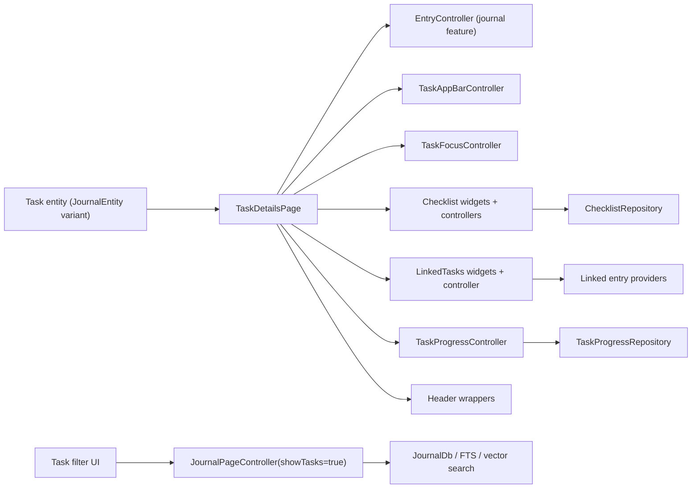
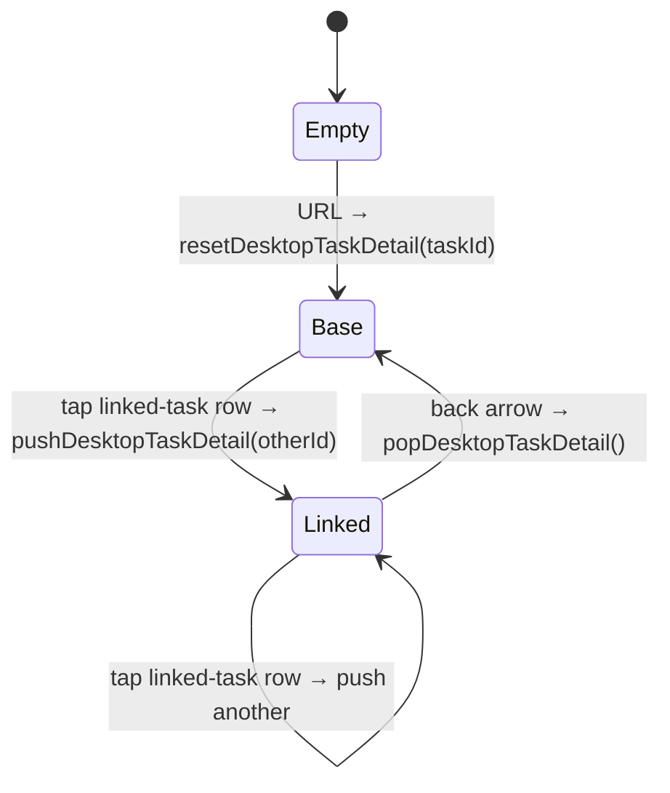
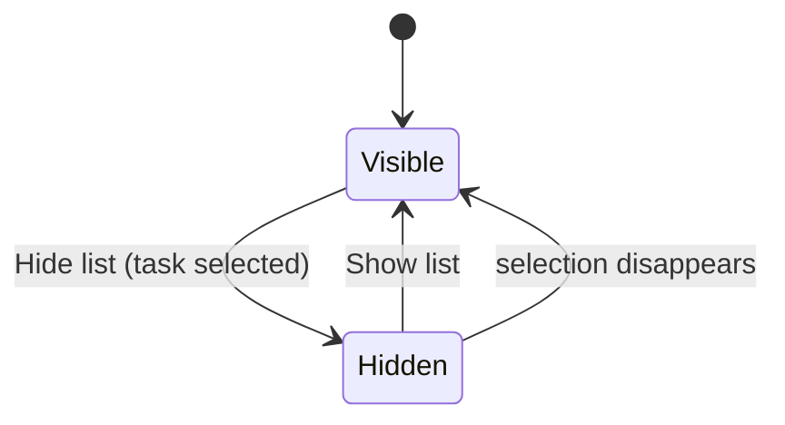
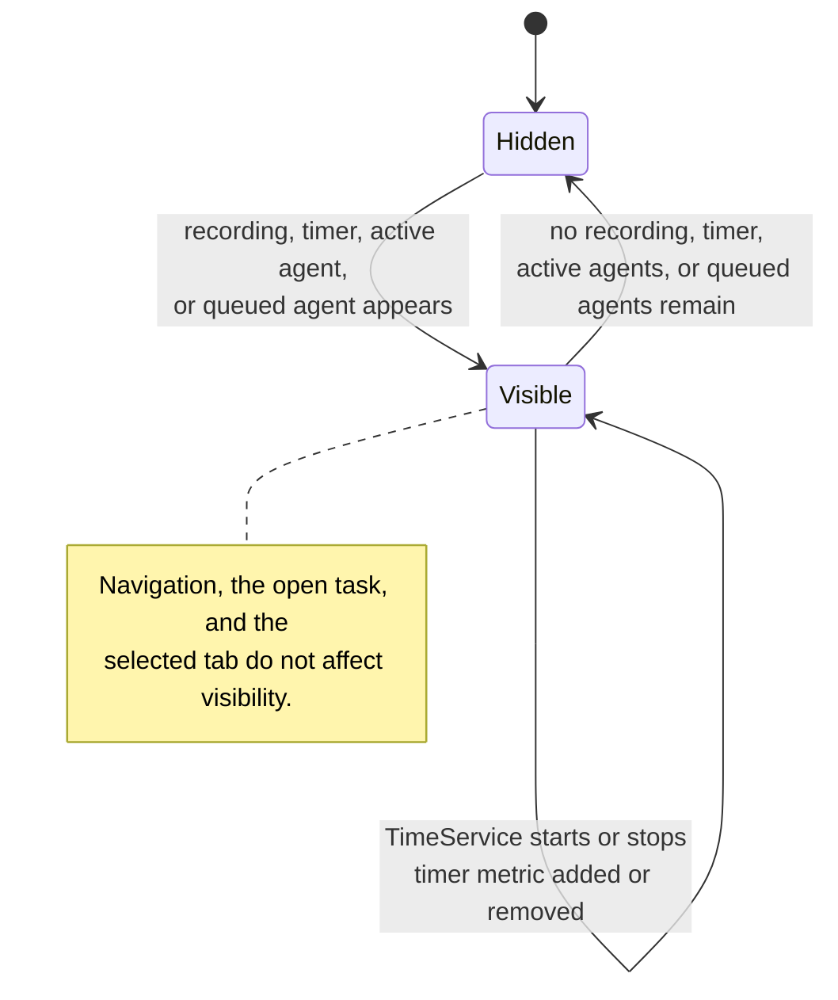

A task is still a `JournalEntity`. This feature is where it becomes a proper
task: detail surfaces, checklists, linked tasks, progress, task-specific filter
UI, and the priority/due-date/label/project/cover-art presentation.

**It does not own raw task persistence.** Task entities live in the
journal/persistence layer, and many writes flow through shared controllers there.



The boundary: the tasks feature owns task **behaviour and presentation** while
deliberately reusing shared journal controllers and persistence paths.

```text
lib/features/tasks/
├── model/ · repository/ · services/
├── state/saved_filters/
├── ui/{checklists,filtering,header,labels,linked_tasks,pages,saved_filters,widgets}
├── util/ · widgetbook/
```

# Concepts

* [Data model and progress](data-model.md) - `TaskData`, its deliberate boundaries, the pickers, and how progress is computed.
* [Checklists](checklists.md) - the subsystem, its motion contract, and the sorting state machine.
* [Typed relationships and blockedness](relationships.md) - five link types, one directed choice, and readiness derived at read time.
* [Detail composition](detail-composition.md) - the header, section surfaces, scroll stability and AI integrations.
* [Filtering and saved filters](filtering.md) - the browse page, filter model, persistence, and keyboard commands.

# The tasks tab is a presentation swap

The redesigned tab is an **in-place browse-page migration, not a new query
stack**. `TasksTabPage` still reads from `JournalPageController(showTasks: true)`
and still uses the journal feature's infinite paging. It owns no pagination,
query execution, or filter semantics — it reads the already-loaded slice and
transforms it into section presentation metadata.

# The desktop detail stack

In split-pane mode `TasksRootPage` keeps the list pane mounted while the detail
pane is **keyed by the selected task id**, so each detail surface gets its own
state lifetime instead of reusing the previous task's stateful internals.

The right-hand pane is backed by a per-pane stack on
`NavService.desktopTaskDetailStack`:



- `TasksLocation` calls `resetDesktopTaskDetail(taskId)` on URL change, seeding
  the stack with the **base** task.
- Tapping a linked-task row pushes the linked task **strictly inside** the
  right-hand pane; the list pane stays visible. **Mobile keeps
  `Navigator.push`**, because there the navigator stack and the visible
  navigation stack are the same thing.
- The back arrow renders on desktop only when the stack is deeper than one — the
  base task hides it, since the list pane already returns to a sibling.
- `desktopSelectedTaskId` stays in sync with `stack.last`, so existing
  list-pane highlight listeners keep working unchanged.

Both panes share a `ListDetailFocusTraversal`: Right Arrow on a focused task
selects the row and moves focus to a real detail control **after the detail frame
renders**, skipping the independently keyboard-resizable divider. During the
detail crossfade, outgoing pages are wrapped in `ExcludeFocus`, so the bridge
cannot restore focus into a task that is only still present for animation.

With a base task selected, the split can enter focus mode. The list and
divider become offstage while the detail takes the full split width; the list
subtree stays mounted, preserving its filter, search, paging and scroll state.

Geometry can force the same layout. The app shell's docked day-view column
(`dayViewColumnAllowance` in `lib/beamer/beamer_app.dart`) is clamped, never
removed, beside an open task, so on a window that cannot host the sidebar, the
column and a `kDesktopBreakpoint`-wide split at once, the split gives way:
while the column is up and the region has dropped below the breakpoint, an
open task takes the whole region as in focus mode, without setting the
persisted collapse flag — the list returns on its own once the column hides
or the window widens. `TaskDetailShowListButton` still works in that state:
it yields the column (`hideDayViewPanel`) before expanding the list, since the
list is what the reader asked for and clearing the flag alone would change
nothing on screen.

**Both halves of the toggle live in the detail pane's top-left corner.**
`TaskDetailDesktopLeading` fills the task app bar's leading slot with up to two
controls — the back arrow (only while a linked task is stacked) and
`TaskDetailHideListButton` — and sizes the bar's `leadingWidth` through
`TaskDetailDesktopLeading.widthFor`. Once the list is hidden,
`TaskDetailShowListButton` takes the same corner, so the toggle is one control
in one place rather than two affordances a pane apart.

Both directions share one rule, because **glass is for a photograph behind the
glyph, not for app bars in general**: a bare glyph at medium emphasis by
default — matching the compact bar's trailing actions — and the glass
treatment only where cover art actually sits behind that corner. A tinted
circle beside two bare icons in the same row read as a different species of
control.

The two halves learn that from different places, since they render in
different layers. `TaskDetailHideListButton` is told by the app bar that hosts
it (the cover-art bar passes `glass: true`); `TaskDetailShowListButton` floats
over the task instead, so it resolves the question itself from the task under
it — `taskHasCoverArt(ref, taskId)`, with no task and no answer meaning no
glass.

The Hide action used to sit next to the *task list's* own title, where selecting
a task made it appear and shoved that title sideways. The Show action is owned
by `TasksRootPage`, so it remains reachable even while task data is loading. Its
collapse preference and expanded width are shared with Projects and persisted by
`PaneWidthController`. Focus mode uses the released canvas without turning media
into wall-sized chrome: cover art remains 16:9 but is capped at the shared
960 pt detail measure.

Focus mode is also what mounts the **details column**: with the list gone and
a pane at least 960 pt wide, `TaskMetaColumn` carries the task's metadata
beside it instead of behind a fly-out, and the header drops its Details
trigger. See [detail composition](detail-composition.md).

This does not change the detail stack: Show list only changes layout, while Back
still appears only when `desktopTaskDetailStack` is deeper than the base task.



# Sidebar activity

`SidebarActivitySummary` and `TaskActionBar`'s running pill read the **same live
`TimeService` session**. The persistent sidebar shows one compact timer metric on
a wrapping line beneath the Activity heading, shared with recording and agent
activity; selecting it expands `SidebarTimerSection` in place.



**Neither `desktopSelectedTaskId`, the active route, nor the selected tab affects
timer visibility** — the metric survives navigation. The stream is seeded with
`TimeService.getCurrent()` as `initialData`, so an already-running session renders
on the first frame.

# Constraints

- Task persistence still flows through shared journal/persistence machinery.
- List filtering is powered by the shared journal page controller, so some
  list-state logic lives outside this directory.
- Checklists are modular, which means the feature spans several controllers and
  widget clusters.
- Linked-task UI is task-specific while generic linked-entry rendering still
  lives in the journal feature.

# Relationships

| Feature | Contributes |
|---------|-------------|
| [journal](../journal/) | The shared entry substrate and paging/filter controller |
| [projects](../projects.md) | Project grouping and project-agent summaries |
| [labels](../labels.md) | Label entities and category scoping |
| [speech](../speech/) | Task-linked audio entries |
| [ai](../ai/) and [agents](../agents/) | Reports, change sets, prompts, automation |
