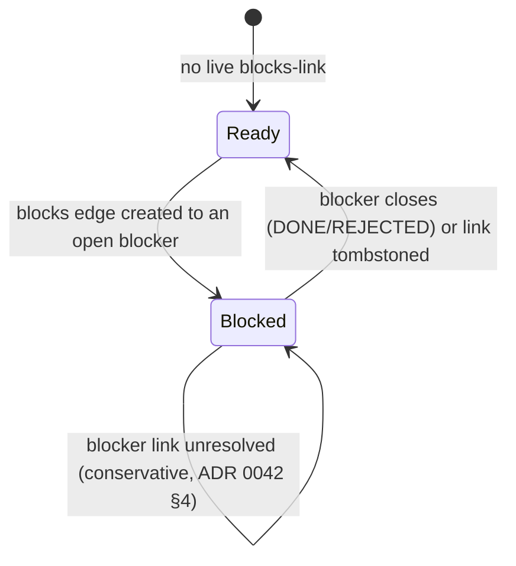

# Five types, one row each

Beyond the plain "belongs with" `BasicLink`, a task-to-task link can carry one of
five typed semantics. Each is an `EntryLink` union variant with **the same shape**
as `BasicLink` — id, `fromId`, `toId`, timestamps, vector clock — so the
relationship lives entirely in the `type` column and every existing
`type = 'BasicLink'` consumer (recorded-time attribution, capture attachment)
stays structurally blind to typed edges.

**One row is stored per relationship.** "Is blocked by" / "has follow-up" are
*rendering labels for the reverse direction of that same row*, never separate
rows.

| Variant | Reading (from → to) | Inverse rendering |
|---|---|---|
| `blocks` | *from* blocks *to* | *to* is blocked by *from* |
| `followsUp` | *from* follows up on *to* | *to* has follow-up *from* |
| `duplicates` | *from* duplicates *to* (canonical) | *to* is duplicated by *from* |
| `fixes` | *from* fixes *to* (the defect) | *to* is fixed by *from* |
| `supersedes` | *from* supersedes *to* (obsolete) | *to* is superseded by *from* |

## Type and direction are one choice, not two

`RelationshipTypeSelector` renders a **single** dropdown completing the sentence
"This task… ⟨Blocks⟩", whose list holds all eleven directed relations: the
symmetric plain link ("Relates to", the default) plus each of the five types in
both directions. A `DirectedRelation` carries the type and its `inverse` flag
together, so callers never reconcile two independent values.

An earlier iteration split this into six type chips plus a separate
primary/inverse toggle. Because a `blocks` link's primary phrase *is* the word
"Blocks", the selected chip and the toggle's first segment displayed the same
word stacked a few pixels apart for four of the five directional types — which
reviewers and test users consistently read as a duplicated or contradictory
control. Every established issue tracker presents relations as one flat list of
directed phrases; this now does too.

Picking an inverse phrase **swaps `fromId`/`toId` before persisting**, so the
canonical stored direction is always the one the table lists — a `blocks` link's
`fromId` is always the blocker.

`PersistenceLogic.createLink` runs a best-effort local cycle guard for
`EntryLinkType.blocks` only, surfaced as a snackbar on rejection. **Read-time
traversal tolerates cycles regardless**, since two offline devices can always
race one into existence.

The candidate list excludes only tasks that already hold *the relation currently
selected*, recomputed as that selection changes — not every task the anchor
already touches. The schema's `UNIQUE(from_id, to_id, type)` lets one pair hold
several relationships, and direction is part of the identity, so the inverse of
an existing link stays offerable.

Committing is **one tap** — picking a candidate creates the link and pops. That
speed is the point, so it is not gated behind a confirm step; instead the commit
is followed by a SnackBar naming the relation written, with an Undo that removes
exactly that `(fromId, toId, type)` triple. Undo can therefore only take back the
edge the message is about, never another relationship the same pair holds.

# Blockedness is derived, not stored

Readiness is computed **at read time from live `blocks` links** (ADR 0042 §4): a
task is blocked iff a non-deleted `blocks` link exists with `toId == task` whose
blocker is neither tombstoned nor closed (`DONE`/`REJECTED`).

Closing or deleting a blocker therefore **releases every dependent implicitly, on
every device, with no unlock write and no sync race.**

An **unresolvable** blocker — the link row exists but its `fromId` task cannot be
loaded, typically a sync gap — keeps the dependent blocked conservatively. That is
distinct from a **tombstoned** blocker (`deletedAt` set), which releases it.

## Three readers, two of which resolve blockedness

The UI-facing and model-facing resolvers differ *deliberately*; the third reader
only groups links for display and resolves nothing.

| Reader | Shape | Treats unresolvable blockers |
|--------|-------|------------------------------|
| `TaskBlockersController(taskId)` | Single task, UI-facing, autoDispose Riverpod | **Distinguishes** them — reports `TaskBlockersResult(openBlockers, unresolvedCount)`, with `isBlocked = openBlockers.isNotEmpty \|\| unresolvedCount > 0` |
| `TaskLinkGroupsController` | Display grouping | Drops tombstoned and unresolvable identically — fine for display |
| `TaskDependencyResolver` | Batch, model-facing, stateless plain Dart | Serializes a bare `{"taskId": …}` so "still blocked" is never downgraded |

`TaskBlockersController` runs **two bounded queries** — one type-scoped link
fetch, one batch status load for the distinct blocker ids. No transitive closure,
no per-task fan-out.

`TaskDependencyResolver` is deliberately **not shared code** with it: a UI-facing
single-task controller and a model-facing batch resolver have different call
shapes and failure-representation needs. See
[dependency-aware planning](../daily_os_next/dependency-aware-planning.md).

## The voice surface shares the same directed vocabulary

`DirectedRelation` lives in
`../../../lib/features/tasks/model/directed_relation.dart` (pure Dart, no
Flutter import) and is re-exported by the picker file, so the UI and the task
agent cannot drift apart on what a phrase means. Beyond the localized picker
labels, each relation carries a stable `wireName`
(`blocks` / `is_blocked_by` / … / `relates_to`) that the task agent's
`link_task` and `create_follow_up_task` tool schemas enumerate, plus
`canonicalEndpoints`, which performs the same inverse swap the picker does
before persisting.

Spoken relationships ("this task is blocked by X", "this supersedes Y") become
**user-confirmable proposals**, never direct writes — see
[task agents](../agents/task-agents.md) for the validation and apply pipeline.

## Where it surfaces

- **`_TaskBlockedByChip`** in the detail header, next to the status pill: hidden
  when not blocked; a **bare untappable "Blocked" pill** when every blocker is
  unresolved (nothing to name or navigate to); otherwise a tappable pill naming
  the single blocker or the count, opening the blocker's detail page directly or
  a list sheet.
- **The status-enrichment prompt.** When the status picker sets a task's status
  to `BLOCKED` — a change, not a no-op — and the task is not already
  named-blocked, it opens `BlockingTaskPickerModal`: a search picker **fixed** to
  the `blocks` relationship with no type selector, creating a `blocks` link from
  the chosen task to this one. Fully skippable — **the status write already
  committed before the modal opens**, so dismissing persists nothing further.
  The panel the picker was opened from has closed by then
  ([detail composition](detail-composition.md#one-section-two-hosts)), so the
  prompt is presented on the navigator rather than over that panel.

**Manual `TaskStatus.blocked` and link-derived blockedness never write to each
other automatically.** The link layer only *offers* the picker after a manual
status change, and only when the task is not already named-blocked. Many real
blocks are external — a person, a delivery, a decision — and have no task to link.
