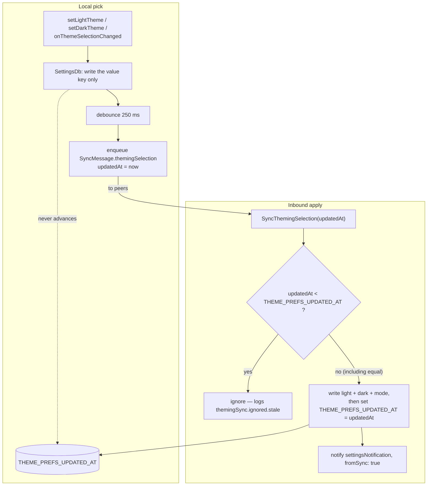

The theming feature turns stored user preferences into actual `ThemeData` for the
light theme, the dark theme and the theme mode — and **syncs the selection across
devices**.

# The sync boundary

Theme selection is one of the few pure-preference values that replicates: a change
enqueues a debounced `SyncMessage.themingSelection`, and an inbound change is
applied unless it is **older than the last inbound one**.

That is arrival-based, not last-write-wins. The comparison reads
`THEME_PREFS_UPDATED_AT` out of `SettingsDb`, but the local setters
(`setLightTheme`, `setDarkTheme`, `onThemeSelectionChanged`) write only the value
key and enqueue — they never advance that timestamp. So the stored value reflects
the last message *received*, and any inbound message not older than it wins over a
local pick made a second ago. Two devices changing theme concurrently converge on
whichever message lands last, not on whichever choice was made last.

The dotted edge is the whole asymmetry: only an **apply** advances the timestamp,
so the guard compares an incoming message against the last message *received*
rather than against the local choice. A device that has never received one holds
`0` and therefore accepts anything.

It is a benign asymmetry for a preference this cheap to re-pick, and it is the
reason the stale check exists at all: it stops a delayed message from undoing a
newer one, which is the failure that would actually be noticed.

**The neighbouring case is not the same, despite the code saying so.** The
`dailyOsUserName` apply branch is commented "mirroring theming", but
`DailyOsPreferencesController` *does* persist
`DAILY_OS_USER_NAME_UPDATED_AT` on a local edit, so that one really is
last-write-wins — see [Daily OS](daily_os_next/overview.md). Theming is the
outlier, so do not read one as documentation of the other.

That is deliberate — a user who picks a theme on their laptop expects their phone
to match, unlike device-local concerns such as pane widths, agent-wake concurrency
or Daily OS category exclusions, which stay put.

# Where the tokens come from

The theming feature builds the app's `ThemeData`; the
[design system](design_system/) injects its token tree into that theme's
extensions, so `context.designTokens` resolves inside production widgets without
the app adopting the standalone design-system theme wholesale.

The theming **UI** lives under [settings](settings.md); the state machine lives
here.
