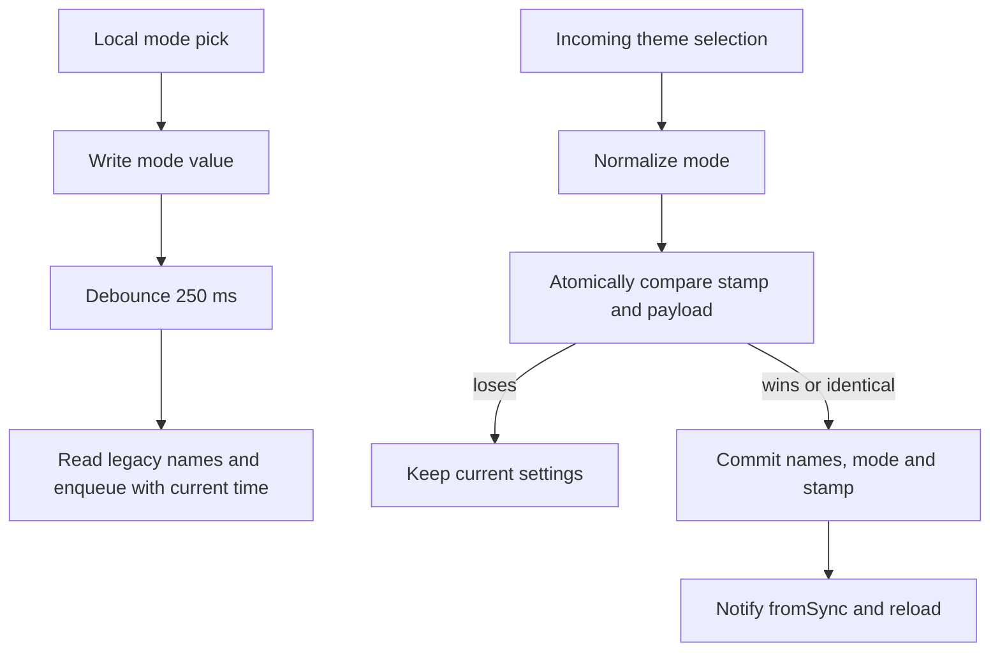

The theming feature builds the app's one theme — `withOverrides(DesignSystemTheme)`
for each brightness — and turns the stored light/dark/system preference into
what `MaterialApp` renders. The old scheme picker is gone, but sync still
round-trips legacy scheme names stored by older devices, using the legacy
default only when a stored name is absent.

# The sync boundary

A local mode selection writes the value key and schedules a debounced sync
envelope. The debounce reads the retained legacy scheme names and stamps the
outgoing message when it fires. It does **not** persist that outbound stamp in
`THEME_PREFS_UPDATED_AT`; that key currently records received preferences only.
Consequently, a delayed inbound message can still replace a more recent local
pick if its stamp wins against the last received preference. This local-writer
asymmetry remains outside the receive-register convergence guarantee.

Inbound application normalizes an unknown mode to `system`, then uses the
[versioned settings group contract](../architecture/persistence.md#settings-groups)
to choose and commit a complete preference. A losing version changes nothing and
emits no settings notification. A successful commit notifies with `fromSync`,
which reloads the theme without enqueuing an echo.

The [sync message model](sync/message-model.md#settings-without-sequence-recovery)
documents the delivery and retry boundary shared with other preference messages.
Local-only preferences such as pane widths and Daily OS category exclusions do
not use this protocol.

# Where the theme comes from

`ThemingController._buildTheme` composes
`withOverrides(DesignSystemTheme.dark()/light())`: the
[design system](design_system/) supplies the token-derived `ColorScheme`
(surfaces, container ramp, accents), `TextTheme` (including the platform-aware
color-emoji font fallback) and the `DsTokens` extension behind
`context.designTokens`; `withOverrides` layers the Material-level extras on
top — wolt sheet motion, markdown theme, input/card shapes — without touching
the scheme or the text theme. The screenshot harness's `screenshotTheme`
builds the identical composition, which is what keeps design verdicts made on
captures transferable to the running app.

The theming **UI** lives under [settings](settings.md); the state machine lives
here.
