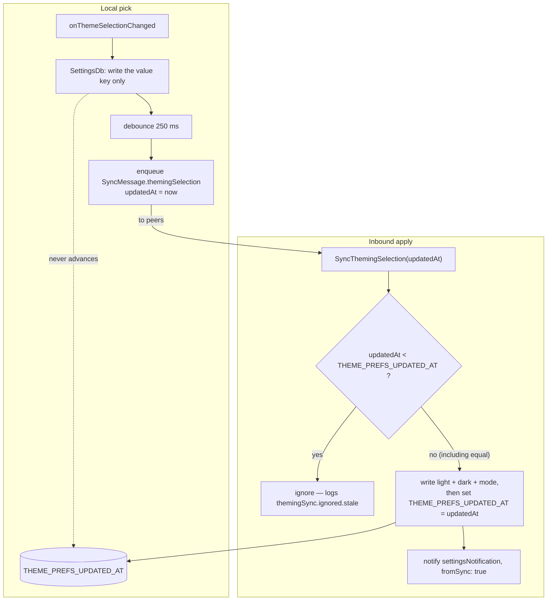

The theming feature builds the app's one theme — `withOverrides(DesignSystemTheme)`
for each brightness — and turns the stored theme-mode preference (light / dark /
system) into what `MaterialApp` renders, **syncing that selection across
devices**. The FlexColorScheme scheme picker is gone; the `themingSelection` sync
message keeps its scheme-name fields for wire compatibility and always carries a
constant name.

# The sync boundary

Theme selection is one of the few pure-preference values that replicates: a change
enqueues a debounced `SyncMessage.themingSelection`, and an inbound change is
applied unless it is **older than the last inbound one**.

That is arrival-based, not last-write-wins. The comparison reads
`THEME_PREFS_UPDATED_AT` out of `SettingsDb`, but the local setter
(`onThemeSelectionChanged`) writes only the value key and enqueues — it never
advances that timestamp. So the stored value reflects the last message
*received*, and any inbound message not older than it wins over a local pick
made a second ago. Two devices changing the mode concurrently converge on
whichever message lands last, not on whichever choice was made last.

The dotted edge is the whole asymmetry: only an **apply** advances the timestamp,
so the guard compares an incoming message against the last message *received*
rather than against the local choice. A device that has never received one holds
`0` and therefore accepts anything.

It is a benign asymmetry for a preference this cheap to re-pick, and it is the
reason the stale check exists at all: it stops a delayed message from undoing a
newer one, which is the failure that would actually be noticed.

**The neighbouring case is not the same, despite the code saying so.** The
`dailyOsUserName` apply branch is commented "mirroring theming", but
`DailyOsPreferencesController` *does* persist
`DAILY_OS_USER_NAME_UPDATED_AT` on a local edit, so that one really is
last-write-wins — see [Daily OS](daily_os_next/overview.md). Theming is the
outlier, so do not read one as documentation of the other.

That is deliberate — a user who picks a mode on their laptop expects their phone
to match, unlike device-local concerns such as pane widths, agent-wake concurrency
or Daily OS category exclusions, which stay put.

# Where the theme comes from

`ThemingController._buildTheme` composes
`withOverrides(DesignSystemTheme.dark()/light())`: the
[design system](design_system/) supplies the token-derived `ColorScheme`
(surfaces, container ramp, accents), `TextTheme` (including the platform-aware
color-emoji font fallback) and the `DsTokens` extension behind
`context.designTokens`; `withOverrides` layers the Material-level extras on
top — wolt sheet motion, markdown theme, input/card shapes — without touching
the scheme or the text theme. The screenshot harness's `screenshotTheme`
builds the identical composition, which is what keeps design verdicts made on
captures transferable to the running app.

The theming **UI** lives under [settings](settings.md); the state machine lives
here.
