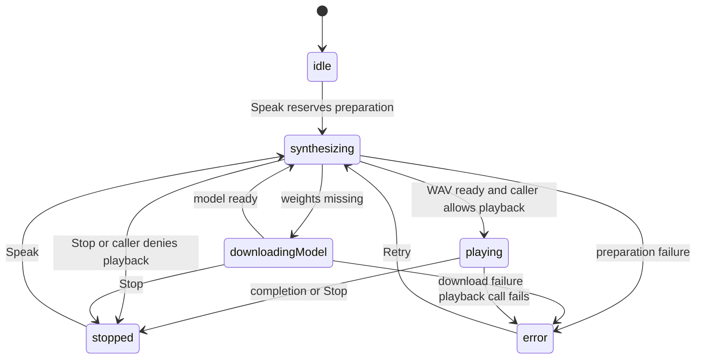

On-device text-to-speech that reads a task's AI **TL;DR** or a saved query
answer aloud. It runs the
Supertonic 3 ONNX model (~99M params, 44.1 kHz 16-bit WAV) locally via
`flutter_onnxruntime` and plays the result through the app's existing `media_kit`
stack.

**Synthesis never leaves the device — but the model has to arrive first.** The
weights are not bundled. `TtsModelRepository` checks the model directory for the
six files in `kSupertonicModelFiles` (four `.onnx` graphs plus `tts.json` and
`unicode_indexer.json`) and downloads whichever are missing from
`https://huggingface.co/<repo>/resolve/main/onnx/<file>`. So the first speak on a
fresh install needs the network; every one after it does not, and no text or audio
is ever sent anywhere.

The engine sits behind a `TtsEngine` interface, with `SupertonicOnnxEngine` wired
on macOS, iOS, Linux and Android.

# The Apple linkage workaround

On Apple platforms onnxruntime ships as a **statically linked binary**, which
CocoaPods rejects under the project's dynamic `use_frameworks!`.

The global fix — `use_frameworks! :linkage => :static` — **breaks
`super_native_extensions`' Rust FFI**. So both `macos/Podfile` and `ios/Podfile`
instead use a **targeted `pre_install` hook** that forces static linkage for only
the `flutter_onnxruntime` plugin and its `onnxruntime-*` dependencies.

That narrowness is the point: the workaround is scoped to the one plugin that
needs it, so the rest of the project keeps dynamic frameworks.

# Gating

Task-card and query-answer speak buttons are hidden unless `enable_ai_summary_tts` is enabled in
config flags. **It seeds off** while local TTS model quality and runtime behaviour
are still being evaluated — see [AI provider routing](ai/provider-routing.md).

# Preparation and cancellation

`TtsPlaybackController` owns one utterance. It reserves its busy state before
awaiting model discovery, serializes preparation through the shared ONNX
session, and uses a generation check after asynchronous work. Stop invalidates
that generation immediately. Native synthesis can finish after cancellation,
but the resulting file is deleted without playback. A caller may provide a
`canPlay` callback for a fresh visibility check after synthesis; query chat's
[privacy and lifecycle rules](agents/query-chat.md#audio-evidence-and-spoken-answers)
use that boundary. Source-specific stopping cannot stop another surface's
utterance. `MediaKitTtsAudioPlayer` also invalidates in-flight open/rate changes
on stop or disposal. Temporary utterance WAV files are removed after playback,
cancellation or disposal; model weights remain installed.

