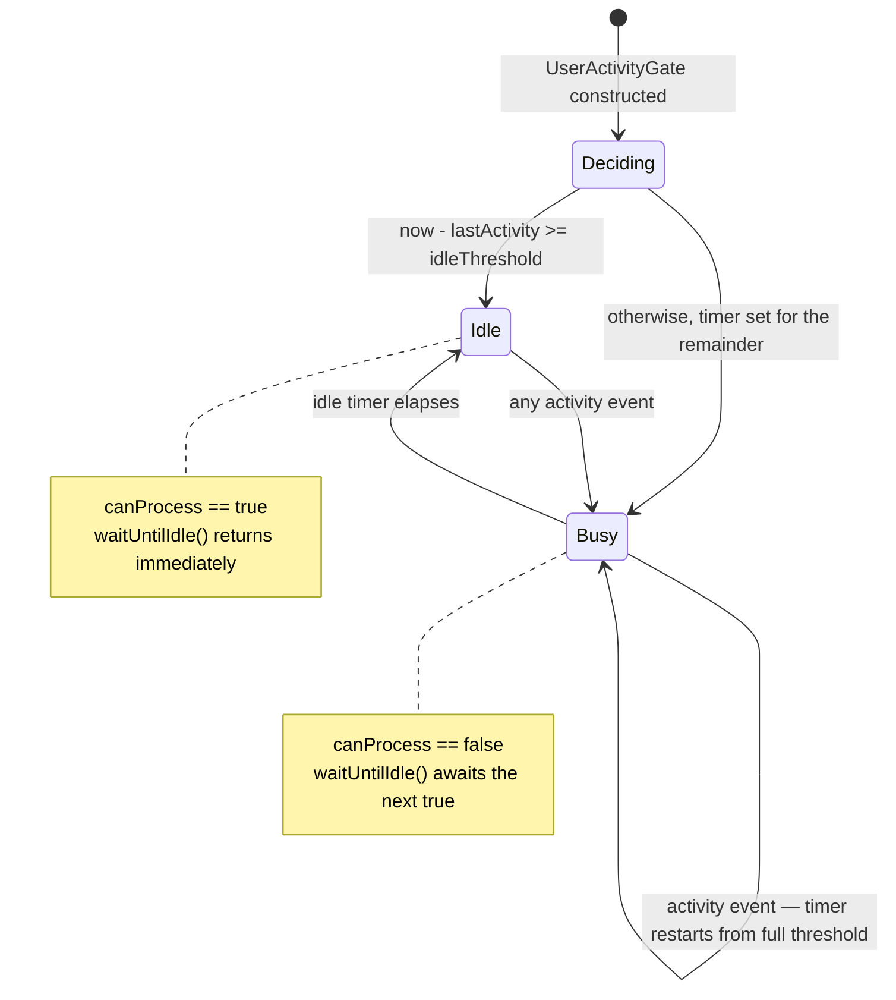

The user-activity feature tracks whether the user was active recently and exposes
a **gate** background work waits on before doing potentially disruptive
processing.

It is what lets other parts of the app ask two questions: *is the user actively
doing things right now*, and *wait until they have been idle for a bit*.

Two details of that machine matter to a caller:

- **Activity restarts the full threshold, it does not extend the remainder.** A
  user typing steadily holds the gate closed indefinitely, because every keystroke
  resets the timer to the whole `idleThreshold`.
- **`canProcessStream` is `.distinct()`.** Listeners see only real idle↔busy
  flips, never the repeated internal writes — so a caller cannot use the stream to
  count activity.

# Who waits on it

Every consumer today is in [sync](sync/):

| Consumer | Behaviour |
|----------|-----------|
| [Outbox send passes](sync/send-path.md) | Wait for idle before draining, so a send burst does not compete with typing |
| [The inbound queue worker](sync/receive-path.md) | Calls `activityGate.waitUntilIdle` at the top of every tick |
| `MatrixService`, `QueuePipelineCoordinator` | Hold the gate for their own scheduling |

**Daily OS processing does *not* use this gate.** `DayProcessingRuntime` drains
on startup, outbox changes, retries and connectivity events without waiting for
idle, so day transcription and agent wakes can compete with active interaction.
That is a real difference from sync, not an omission in this document — wiring
the gate in would be a behaviour change, not a docs fix.

The idle threshold is a single tuning constant —
`SyncTuning.outboxIdleThreshold`, **1200 ms** — passed in at registration time in
[bootstrap](../architecture/bootstrap-and-di.md) and again where `OutboxService`
builds its own gate. `UserActivityGate` also carries a 1 s constructor default,
which nothing in the app uses; **1200 ms is the live value**, and the default is
only what a test or a new caller gets by omission.

# Why a gate rather than a check

A boolean "is idle" read gives a caller no way to wait: it either proceeds into
live interaction or gives up. **The gate is awaited**, so a caller parks until an
idle edge arrives and resumes as one continuation — which is why heavy sync work
starts in the quiet gaps rather than under the user's fingers.

**It does not make the start race-free, and should not be read that way.**
`waitUntilIdle()` returns immediately when `canProcess` is already true, otherwise
awaits `canProcessStream.firstWhere((v) => v)` — and that is all. It takes no
lease, registers no cancellation hook, and excludes nothing after the wake. A user
who resumes in the microtask after the edge fires gets their input during a large
apply exactly as before; the gate moved *when* the work starts, not what happens
once it has.

Making that guarantee real would need a reservation the gate does not have — a
lease held across the work, or a cancellation signal the caller polls. Both are
behaviour changes, so treat this section as the boundary of what the gate
promises: **it delays work to an idle edge, and nothing more.**
